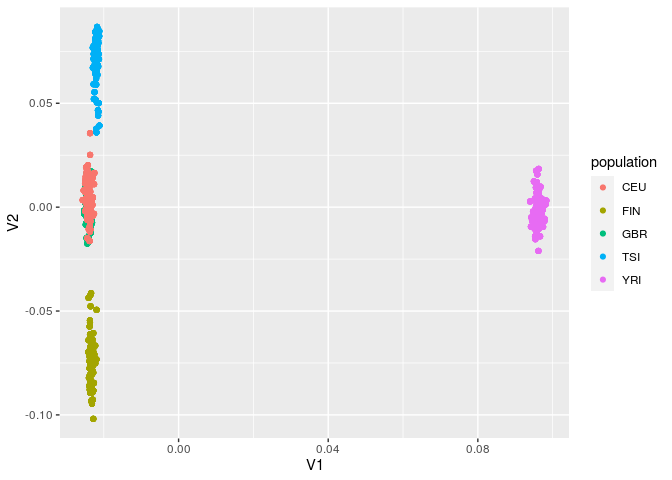
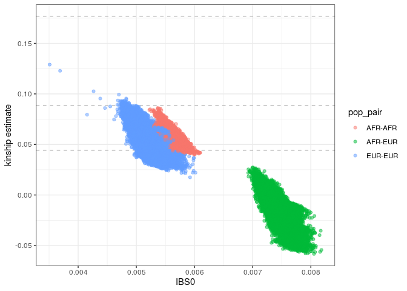
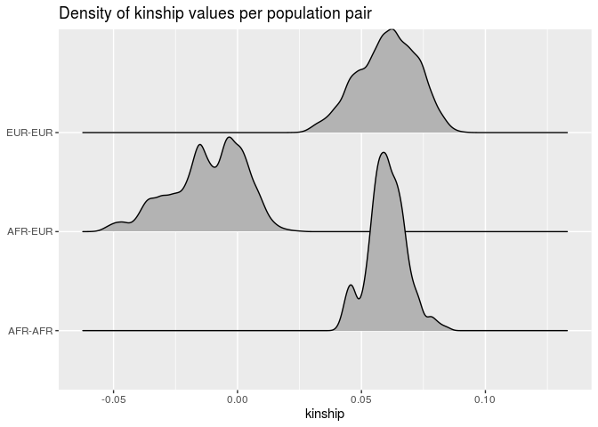

Exploratory data analysis
================

## 1\. VCF processing

### Subset and filtering

Here we select the GEUVADIS individuals, and exclude variants with
missing data or which are monomorphic in this subset of individuals.

Next we call an R script that converts VCF to GDS.

    #!/bin/bash
    
    #PBS -l nodes=1:ppn=1
    #PBS -l mem=8gb
    #PBS -l walltime=24:00:00
    #PBS -q short
    #PBS -t 1-22
    #PBS -N processVCF
    #PBS -j oe
    #PBS -o log/$PBS_JOBNAME
    
    cd $PBS_O_WORKDIR
    
    chr=$PBS_ARRAYID
    samples=/raid/genevol/heritability/samples.txt
    vcfin=/raid/genevol/heritability/genotypes_1000g/ALL.chr${chr}_GRCh38.genotypes.20170504.vcf.gz
    vcfout=./data/kgp/chr${chr}_subset.vcf
    
    bcftools view --samples-file $samples --force-samples $vcfin |\
        bcftools view --genotype ^miss - |\
        bcftools view --min-ac=1:minor -o $vcfout -
    
    Rscript vcf2gds.R $chr
    
    rm $vcfout

The content of the vcf2gds.R script is the following:

    library(SeqArray)
    library(SNPRelate)
    
    chr <- commandArgs(TRUE)[1]
    
    vcf_file <- sprintf("./data/kgp/chr%s_subset.vcf", chr)
    gds_file <- sprintf("./data/kgp/chr%s_tmp.gds", chr)
    
    #convert
    seqVCF2GDS(vcf_file, gds_file, fmt.import = "GT", verbose = FALSE)

## Analyses in R

### Packages:

``` r
library(tidyverse)
library(SeqArray) 
library(SeqVarTools) 
library(SNPRelate)
library(Biobase) 
library(GENESIS)
```

### Concatenate GDS files for all chromosomes

``` r
gds_file <- "./data/kgp/allchrs.gds"

gds_list <- sprintf("./data/kgp/chr%d.gds", 1:22)

seqMerge(gds_list, gds_file)
```

### Pruning

``` r
# this step takes hours
gds <- seqOpen(gds_file)

set.seed(100)
pruned <- snpgdsLDpruning(gds, 
                          method = "corr", 
                          ld.threshold = sqrt(0.1))

prunedsnps <- unlist(pruned, use.names = FALSE)

seqSetFilter(gds, variant.id = prunedsnps)
seqExport(gds, "./data/kgp/allchrs_pruned.gds")
seqClose(gds)
```

### PCA on genotype data

``` r
gds <- seqOpen("./data/kgp/allchrs_pruned.gds")
pca <- snpgdsPCA(gds)
```

    Principal Component Analysis (PCA) on genotypes:
    Calculating allele counts/frequencies ...
    [..................................................]  0%, ETC: ---    [==================================================] 100%, completed, 9s
    # of selected variants: 2,195,733
        # of samples: 445
        # of SNVs: 2,195,733
        using 1 thread
        # of principal components: 32
    CPU capabilities: Double-Precision SSE2
    Thu Oct 29 02:46:59 2020    (internal increment: 8752)
    [..................................................]  0%, ETC: ---        [=>................................................]  1%, ETC: 12.4m        [=>................................................]  2%, ETC: 11.6m        [==>...............................................]  3%, ETC: 11.1m        [==>...............................................]  4%, ETC: 10.5m        [====>.............................................]  7%, ETC: 9.1m        [====>.............................................]  8%, ETC: 8.9m        [=====>............................................]  9%, ETC: 8.9m        [=====>............................................] 10%, ETC: 8.9m        [========>.........................................] 16%, ETC: 7.3m        [=========>........................................] 17%, ETC: 7.3m        [=========>........................................] 18%, ETC: 7.1m        [===========>......................................] 22%, ETC: 6.1m        [=================>................................] 34%, ETC: 4.0m        [==================>...............................] 35%, ETC: 4.1m        [==================>...............................] 36%, ETC: 4.1m        [===================>..............................] 37%, ETC: 4.0m        [=======================>..........................] 46%, ETC: 3.2m        [========================>.........................] 48%, ETC: 3.4m        [=========================>........................] 49%, ETC: 3.5m        [=========================>........................] 50%, ETC: 3.5m        [=============================>....................] 57%, ETC: 2.5m        [==============================>...................] 59%, ETC: 2.6m        [=================================>................] 65%, ETC: 2.3m        [====================================>.............] 72%, ETC: 1.6m        [=====================================>............] 73%, ETC: 1.7m        [======================================>...........] 75%, ETC: 1.7m        [=======================================>..........] 77%, ETC: 1.6m        [=======================================>..........] 78%, ETC: 1.6m        [========================================>.........] 79%, ETC: 1.5m        [==========================================>.......] 83%, ETC: 1.3m        [===========================================>......] 85%, ETC: 1.1m        [=================================================>] 98%, ETC: 7s        [==================================================] 99%, ETC: 3s        [==================================================] 100%, completed, 7.0m
    Thu Oct 29 02:54:01 2020    Begin (eigenvalues and eigenvectors)
    Thu Oct 29 02:54:01 2020    Done.

``` r
pops <- read_tsv("/raid/genevol/heritability/hla_expression.tsv") %>%
    select(sampleid = 1, 2:3)

pcadf <- as.data.frame(pca$eigenvect) %>%
    as_tibble() %>%
    add_column(sampleid = pca$sample.id, .before = 1) %>%
    inner_join(pops, ., by = "sampleid")

ggplot(pcadf, aes(V1, V2, color = population)) +
    geom_point()
```

<!-- -->

### Kinship

We use the KING algorithm to obtain kinship estimates. KING is robust to
population structure but not admixture.

``` r
king <- snpgdsIBDKING(gds)
```

    IBD analysis (KING method of moment) on genotypes:
    Calculating allele counts/frequencies ...
    [..................................................]  0%, ETC: ---    [==================================================] 100%, completed, 10s
    # of selected variants: 2,195,733
        # of samples: 445
        # of SNVs: 2,195,733
        using 1 thread
    No family is specified, and all individuals are treated as singletons.
    Relationship inference in the presence of population stratification.
    CPU capabilities: Double-Precision SSE2
    Thu Oct 29 02:54:14 2020    (internal increment: 65536)
    [..................................................]  0%, ETC: ---        [==================================================] 100%, completed, 1.6m
    Thu Oct 29 02:55:50 2020    Done.

``` r
kinship <- snpgdsIBDSelection(king) %>%
    left_join(distinct(select(pops, 1, pop1 = 2)), 
              by = c("ID1" = "sampleid")) %>%
    left_join(distinct(select(pops, 1, pop2 = 2)), 
              by = c("ID2" = "sampleid")) %>%
    mutate(POP1 = pmin(pop1, pop2),
           POP2 = pmax(pop1, pop2)) %>%
    select(ID1, ID2, IBS0, kinship, POP1, POP2) %>%
    unite(pop_pair, c("POP1", "POP2"), sep = "-")
```

We plot the pairwise estimates. KING kinship estimates are negative for
samples with different ancestry.

Dashed lines correspond to the kinship thresholds for different degrees
of relatedness: full siblings, 2nd degree relatives, and first cousins.

``` r
ggplot(kinship, aes(IBS0, kinship, color = pop_pair)) +
    geom_hline(yintercept = c(1/(2^(5/2)), 1/(2^(7/2)), 1/(2^(9/2))),
               linetype = "dashed", color = "grey") +
    geom_point(alpha = 0.5) +
    ylab("kinship estimate") +
    theme_bw()
```

<!-- -->

\*Obs: these values have a better behavior when we account for
population structure (PCs) in the kinship estimation (see tutorial 2).

``` r
ggplot(kinship, aes(kinship, pop_pair)) +
    ggridges::geom_density_ridges() +
    labs(y = NULL, title = "Density of kinship values per population pair")
```

<!-- -->
