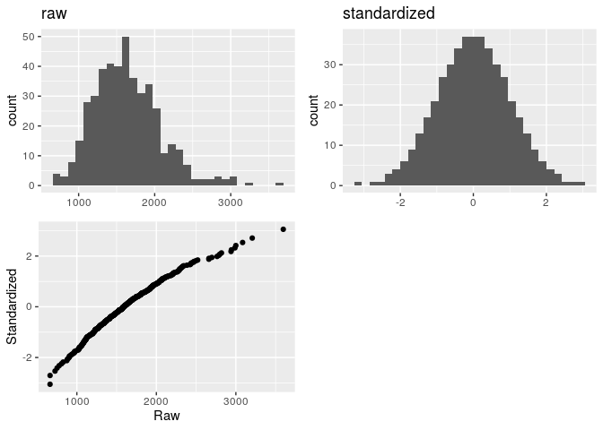
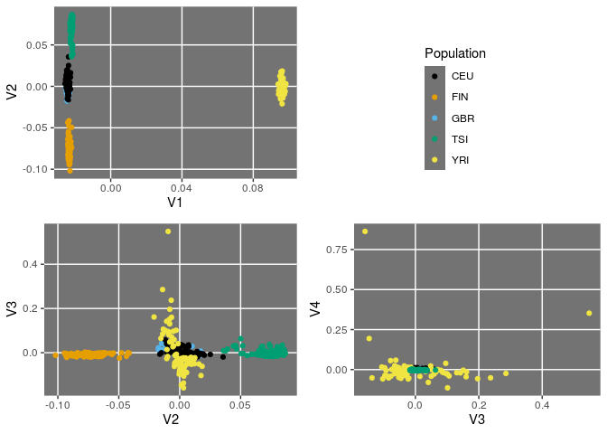
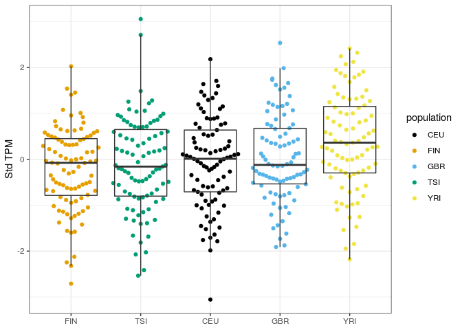
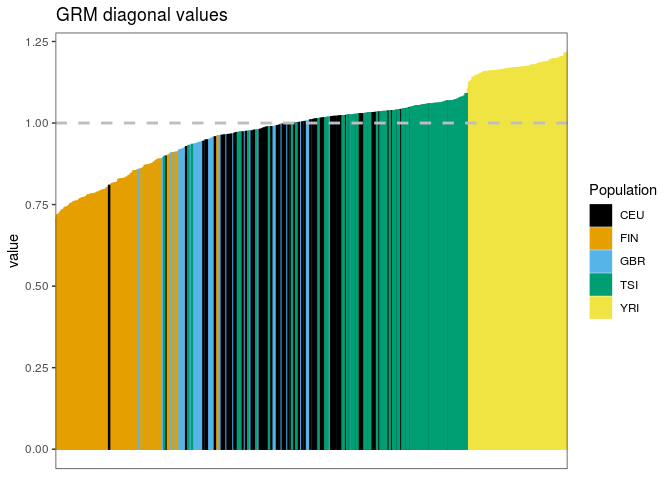
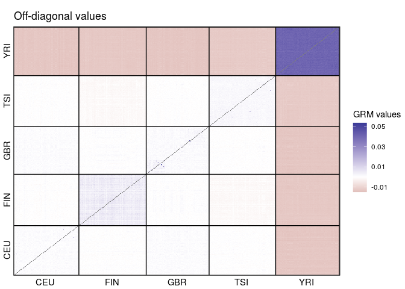

Heritability
================

``` r
library(tidyverse)
library(SeqArray) 
library(SeqVarTools) 
library(SNPRelate)
library(GENESIS)
library(Biobase)
library(cowplot)
library(ggbeeswarm)
library(ggthemes)
```

## Sample:

-   445 individuals from The 1000 Genomes Project (358 from 4 European populations + 87 Yorubans) with RNA-seq available from the Geuvadis consortium.

## Data pre-processing

### Genotypes

We use VCF files provided by 1000 Genomes Phase III (low coverage, in GRCh38 coordinates).

We select the GEUVADIS individuals, and exclude variants with missing data or which are monomorphic in this subset of individuals.

Then we convert VCF to GDS, which is a data structure that optimizes working with genotype data in R.

To perform all this processing, we run the script `./launch_processVCF.sh`.

Then we concatenate the GDS files for each chromosome in a single GDS with the code below:

``` r
gds_list <- sprintf("/raid/genevol/heritability/data/kgp/chr%d.gds", 1:22)

gds_file <- "/raid/genevol/heritability/data/kgp/allchrs.gds"

seqMerge(gds_list, gds_file)
```

We reduce the amount of variants by LD pruning:

``` r
# this step takes hours
gds <- seqOpen(gds_file)

set.seed(100)
pruned <- snpgdsLDpruning(gds, 
                          method = "corr", 
                          ld.threshold = sqrt(0.1))

prunedsnps <- unlist(pruned, use.names = FALSE)

seqSetFilter(gds, variant.id = prunedsnps)
seqExport(gds, "/raid/genevol/heritability/data/kgp/allchrs_pruned.gds")
seqClose(gds)
```

### Phenotypes

We use the FASTQ files provided by the Geuvadis Consortium, and estimate expression with Salmon. We begin with the expression of HLA-A.

Transcript Per Million (TPM) values are quantile normal transformed by `QTLtools correct`. Here is a comparison between raw and standardize TPMs:

``` r
# raw
hla_expression <- 
    "/raid/genevol/heritability/data/geuvadis_expression.bed.gz" %>%
    read_tsv() %>%
    filter(id == "HLA-A") %>%
    pivot_longer(-(1:6), names_to = "sampleid") %>%
    select(sampleid, value)

# standardized by QTLtools
hla_expression_std <- 
    "/raid/genevol/heritability/data/geuvadis_expression_std.bed" %>%
    read_tsv() %>%
    filter(id == "HLA-A") %>%
    pivot_longer(-(1:6), names_to = "sampleid") %>%
    select(sampleid, value)
```



## Results

### PCA on genotype data

``` r
# Close GDS and open the pruned one
gdsfmt::showfile.gds(closeall = TRUE)

gds <- seqOpen("/raid/genevol/heritability/data/kgp/allchrs_pruned.gds")

sample_ids <- seqGetData(gds, "sample.id")

pca <- snpgdsPCA(gds, num.thread = 16L)
```

    Principal Component Analysis (PCA) on genotypes:
    Calculating allele counts/frequencies ...
    # of selected variants: 2,195,733
        # of samples: 445
        # of SNVs: 2,195,733
        using 16 threads
        # of principal components: 32
    CPU capabilities: Double-Precision SSE2
    Wed Mar 24 10:32:14 2021    (internal increment: 8752)

    [..................................................]  0%, ETC: ---        
    [==================================================] 100%, completed, 43s
    Wed Mar 24 10:32:57 2021    Begin (eigenvalues and eigenvectors)
    Wed Mar 24 10:32:57 2021    Done.

``` r
pops <- read_tsv("/raid/genevol/heritability/data/geuvadis_metadata.tsv") %>%
    distinct(sampleid, population)

pcadf <- as.data.frame(pca$eigenvect) %>%
    as_tibble() %>%
    add_column(sampleid = pca$sample.id, .before = 1) %>%
    inner_join(pops, ., by = "sampleid")
```



### HLA-A expression across populations

``` r
sample_info <- "/raid/genevol/heritability/data/geuvadis_metadata.tsv" %>%
    read_tsv() %>%
    select(-ena_id)

expression_df <- left_join(hla_expression_std, sample_info, by = "sampleid") %>%
    select(sampleid, population, sex, lab, value)

ggplot(expression_df, aes(reorder(population, value), value)) +
    geom_quasirandom(aes(color = population), method = "smiley") +
    geom_boxplot(fill = NA, outlier.color = NA) +
    scale_color_colorblind() +
    theme_bw() +
    labs(x = NULL, y = "Std TPM")
```


### HLA-A expression across laboratories

``` r
ggplot(expression_df, aes(reorder(lab, value), value)) +
    geom_quasirandom(aes(color = lab), method = "smiley") +
    geom_boxplot(fill = NA, outlier.color = NA) +
    theme_bw() +
    labs(x = NULL, y = "Std TPM")
```


### HLA-A expression between males and females

``` r
ggplot(expression_df, aes(reorder(sex, value), value)) +
    geom_quasirandom(aes(color = sex), method = "smiley") +
    geom_boxplot(fill = NA, outlier.color = NA) +
    theme_bw() +
    labs(x = NULL, y = "Std TPM")
```



Here we got to evaluate whether such differences across groupings are adequate for an analysis with the combined dataset, or whether they can be accounted for by using covariates.

Before we continue, we need to transform our phenotype data.frame into an "Annotated data frame", which is a data structure provided by `Biobase`. This means that we have to add metadata to our `expression_df` data.frame, and include a `sample.id` column as a requirement for `GENESIS`. Since we do not have multiple samples for the same individuals, we will just create the `sample.id` column as a copy of `sampleid`.

``` r
metadata <- 
    c("sample identifier",
      "subject identifier",
      "laboratory of RNA sequencing",
      "subject's sex",
      "subject's population",
      "PC 1",
      "PC 2",
      "PC 3",
      "expression levels in TPM") %>%
    data.frame(labelDescription = .) 

annotphen <- expression_df %>%
    mutate(sample.id = sampleid) %>%
    left_join(select(pcadf, sampleid, V1:V3), by = "sampleid") %>%
    select(sample.id, sampleid, lab, sex, population, V1, V2, V3, value) %>%
    as.data.frame() %>%
    AnnotatedDataFrame(metadata)

# access the metadata with the varMetadata() function
varMetadata(annotphen)
```

                           labelDescription
    sample.id             sample identifier
    sampleid             subject identifier
    lab        laboratory of RNA sequencing
    sex                       subject's sex
    population         subject's population
    V1                                 PC 1
    V2                                 PC 2
    V3                                 PC 3
    value          expression levels in TPM

``` r
# access the data with the pData() function
head(pData(annotphen))
```

      sample.id sampleid      lab    sex population          V1            V2           V3      value
    1   HG00096  HG00096    UNIGE   male        GBR -0.02409590  1.178854e-03 -0.005208341  0.0620013
    2   HG00097  HG00097     LUMC female        GBR -0.02433438 -9.808199e-04 -0.007818318 -0.4860010
    3   HG00099  HG00099     HMGU female        GBR -0.02452840 -2.650025e-05 -0.007551133 -1.9096400
    4   HG00100  HG00100 CNAG_CRG female        GBR -0.02342908  1.718510e-02  0.007413764 -0.4235280
    5   HG00101  HG00101    UNIGE   male        GBR -0.02409977  1.364934e-03 -0.003502374 -1.4375500
    6   HG00102  HG00102    MPIMG female        GBR -0.02474157 -2.891527e-03 -0.006582548 -1.3484100

## GRM

### GCTA

We will use the `SNPRelate` package to compute a GRM. We will begin with the GCTA method.

``` r
# Close GDS and open the pruned one
gdsfmt::showfile.gds(closeall = TRUE)
```

                                                    FileName ReadOnly  State
    1 /raid/genevol/heritability/data/kgp/allchrs_pruned.gds     TRUE closed

``` r
pruned <- seqOpen("/raid/genevol/heritability/data/kgp/allchrs_pruned.gds")

# Computar a GRM
grm_obj <- snpgdsGRM(pruned, method = "GCTA", num.thread = 16L)
```

    Genetic Relationship Matrix (GRM, GCTA):
    Calculating allele counts/frequencies ...
    # of selected variants: 2,195,733
        # of samples: 445
        # of SNVs: 2,195,733
        using 16 threads
    CPU capabilities: Double-Precision SSE2
    Wed Mar 24 10:33:03 2021    (internal increment: 8752)

    [..................................................]  0%, ETC: ---        
    [==================================================] 100%, completed, 49s
    Wed Mar 24 10:33:52 2021    Done.

We extract and rename the matrix

``` r
grm <- grm_obj$grm
rownames(grm) <- sample_ids
colnames(grm) <- sample_ids

# first 5 individuals:
grm[1:5, 1:5]
```

                HG00096      HG00097      HG00099     HG00100     HG00101
    HG00096 0.956687356 0.0022034937 0.0023660411 0.001431433 0.003642691
    HG00097 0.002203494 0.9754513066 0.0007980224 0.003025820 0.003069123
    HG00099 0.002366041 0.0007980224 0.9609264716 0.009601814 0.005132164
    HG00100 0.001431433 0.0030258202 0.0096018139 0.998632104 0.010114417
    HG00101 0.003642691 0.0030691232 0.0051321635 0.010114417 0.938943766

### Distribution of the GRM diagonal values



### GRM off-diagonal values

\* diagonal is set to NA so we can better see the range for off-diagonal (much smaller) values



### Fitting the Null model

The first step in finding genetic variants which are associated with a phenotype is preparing null model.

We fit a null model which adjusts gene expression according to covariates such as population of origin, laboratory of sequencing, and sex. We also account for the relatedness between individuals (GRM).

``` r
mod_null <- fitNullModel(annotphen, 
                         outcome = "value", 
                         covars = c("lab", "sex", "V1", "V2"),
                         cov.mat = grm)
```

    [1]    0.4996713    0.4996713 -572.3989493    0.7609524
    [1]    0.7946567    0.1283191 -571.4559448    0.8274359
    [1]    0.85256910    0.04770545 -571.29695132    0.84968960
    [1]    0.87353098    0.01740093 -571.24256294    0.85920572
    [1]  8.826167e-01  4.040699e-03 -5.712196e+02  8.636316e-01
    [1]  8.847395e-01  8.939585e-04 -5.712143e+02  8.646985e-01
    [1]  8.852615e-01  1.185643e-04 -5.712130e+02  8.649628e-01

\*Note: if we include PC3, we get an error "the leading minor of order 445 is not positive definite"

### Association testing

Now that we have a Null model adjusting expression levels for sex, laboratory, population genetic structure, and relatedness, we can test for the association of the genetic variants with expression levels.

The first step is to create a `SeqVarData` object including both the GDS (genotypes) and the Annotated data.frame (phenotypes).

Then we will use the `assocTestSingle` function to assess the effect of each variant.

``` r
# order individuals according to GDS
pData(annotphen) <- pData(annotphen) %>%
    mutate(sampleid = factor(sampleid, levels = seqGetData(pruned, "sample.id"))) %>%
    arrange(sampleid)

# create SeqVarData object and iterator
seqData <- SeqVarData(pruned, sampleData = annotphen)
iterator <- SeqVarBlockIterator(seqData, variantBlock = 20000, verbose = FALSE)

# test
assoc <- assocTestSingle(iterator, mod_null)
```

    # of selected samples: 445

``` r
assoc
```

         variant.id chr     pos allele.index n.obs        freq MAC         Score   Score.SE    Score.Stat   Score.pval           Est     Est.SE          PVE
    1             1   1   10177            1   445 0.428089888 381 -1.927113e+01 11.1780661 -1.7240132578 0.0847054498 -0.1542318006 0.08946091 7.899407e-03
    2             2   1   10352            1   445 0.439325843 391  3.175980e+00  9.2765292  0.3423672198 0.7320745543  0.0369068229 0.10779894 3.115284e-04
    3             6   1   11012            1   445 0.092134831  82 -1.067291e+01  9.2196640 -1.1576241195 0.2470174620 -0.1255603375 0.10846382 3.561627e-03
    4             8   1   13110            1   445 0.043820225  39 -8.597626e+00  6.3394456 -1.3562110370 0.1750320313 -0.2139321188 0.15774250 4.888413e-03
    5            10   1   13118            1   445 0.143820225 128 -5.262152e+00 10.8740346 -0.4839189645 0.6284433807 -0.0445022460 0.09196219 6.223842e-04
    6            11   1   13273            1   445 0.128089888 114  1.059346e+01 10.1486070  1.0438336959 0.2965623388  0.1028548746 0.09853569 2.895849e-03
    7            14   1   13445            1   445 0.001123596   1  2.797633e-04  1.0215946  0.0002738496 0.9997814996  0.0002680610 0.97886190 1.993139e-10
    8            16   1   13494            1   445 0.001123596   1  3.714169e-01  1.0479487  0.3544227924 0.7230220559  0.3382062527 0.95424521 3.338540e-04
    9            20   1   14604            1   445 0.150561798 134 -9.632020e+00 10.5824489 -0.9101881917 0.3627232705 -0.0860092218 0.09449609 2.201789e-03
    10           24   1   14933            1   445 0.041573034  37  4.380638e+00  6.2722052  0.6984207150 0.4849141253  0.1113517003 0.15943356 1.296425e-03
    11           25   1   15117            1   445 0.001123596   1  1.307628e+00  0.9852980  1.3271394673 0.1844625518  1.3469421849 1.01492135 4.681084e-03
    12           26   1   15211            1   445 0.682022472 283 -1.071637e+01 11.2223705 -0.9549115305 0.3396224382 -0.0850900019 0.08910773 2.423481e-03
    13           27   1   15245            1   445 0.002247191   2  5.986436e-01  1.3849382  0.4322529673 0.6655575665  0.3121099415 0.72205390 4.965800e-04
    14           29   1   15585            1   445 0.002247191   2 -1.165538e+00  1.4769536 -0.7891500516 0.4300243112 -0.5343093144 0.67706935 1.655131e-03
    15           32   1   15777            1   445 0.017977528  16 -6.333470e+00  4.2407570 -1.4934763300 0.1353125457 -0.3521721043 0.23580695 5.928024e-03
    16           33   1   15820            1   445 0.297752809 265 -1.005894e+01 13.3014848 -0.7562271258 0.4495130319 -0.0568528352 0.07517958 1.519910e-03
    17           34   1   15833            1   445 0.001123596   1 -1.193914e-01  0.9891386 -0.1207024038 0.9039267550 -0.1220277939 1.01098064 3.872087e-05
    18           36   1   16042            1   445 0.001123596   1  4.522588e-01  1.0190087  0.4438222508 0.6571711000  0.4355431225 0.98134585 5.235178e-04
    19           38   1   16142            1   445 0.003370787   3  1.282869e+00  1.8868943  0.6798837303 0.4965780841  0.3603189200 0.52997138 1.228521e-03
    20           41   1   16949            1   445 0.014606742  13 -3.240186e+00  3.7826312 -0.8565959127 0.3916682454 -0.2264550460 0.26436625 1.950138e-03
    21           56   1   49298            1   445 0.821348315 159  1.868082e+01 12.2234961  1.5282711128 0.1264452390  0.1250273321 0.08180965 6.207463e-03
    22           62   1   50891            1   445 0.005617978   5  2.153171e+00  2.5502505  0.8442980397 0.3985028812  0.3310647537 0.39211835 1.894545e-03
    23           72   1   51765            1   445 0.013483146  12  4.772463e+00  3.6302881  1.3146237219 0.1886363936  0.3621265592 0.27546023 4.593209e-03
    24           85   1   54712            1   445 0.025842697  23  3.227902e+00  5.0423109  0.6401632944 0.5220664432  0.1269583158 0.19832177 1.089168e-03
    25           86   1   54712            1   445 0.608988764 348  1.948839e+01 13.9810838  1.3939113006 0.1633443913  0.0996998027 0.07152521 5.163968e-03
    26           89   1   54830            1   445 0.002247191   2 -1.368953e+00  1.6491563 -0.8300927583 0.4064863411 -0.5033438963 0.60637066 1.831330e-03
    27           92   1   55054            1   445 0.001123596   1 -1.918021e+00  1.1880277 -1.6144584390 0.1064280247 -1.3589400405 0.84173120 6.927349e-03
    28           94   1   55165            1   445 0.001123596   1 -8.588910e-01  0.9853995 -0.8716170417 0.3834173306 -0.8845316418 1.01481683 2.019132e-03
    29          101   1   55852            1   445 0.001123596   1 -4.656623e-01  1.1626533 -0.4005169110 0.6887758303 -0.3444852397 0.86010161 4.263390e-04
    30          104   1   56829            1   445 0.002247191   2  2.965194e+00  1.5600783  1.9006700933 0.0573452382  1.2183170858 0.64099345 9.601228e-03
    31          108   1   57292            1   445 0.011235955  10 -2.098303e+00  4.0023076 -0.5242731698 0.6000885553 -0.1309927216 0.24985586 7.305140e-04
    32          117   1   61026            1   445 0.001123596   1 -1.016325e+00  0.9848274 -1.0319828227 0.3020801645 -1.0478819544 1.01540639 2.830468e-03
    33          124   1   61993            1   445 0.001123596   1  7.533392e-01  0.9919610  0.7594443560 0.4475867883  0.7655989989 1.00810414 1.532870e-03
    34          129   1   62595            1   445 0.001123596   1 -3.990436e-01  0.9825035 -0.4061497678 0.6846325602 -0.4133825315 1.01780812 4.384153e-04
    35          132   1   62728            1   445 0.001123596   1 -4.084626e-02  1.2439884 -0.0328349188 0.9738062320 -0.0263948752 0.80386601 2.865400e-06
    36          134   1   62777            1   445 0.406741573 362  6.940695e+00 13.6432380  0.5087278214 0.6109430184  0.0372879094 0.07329638 6.878350e-04
    37          138   1   63336            1   445 0.013483146  12 -7.550317e-01  3.6054601 -0.2094134091 0.8341255259 -0.0580822980 0.27735711 1.165527e-04
    38          139   1   63447            1   445 0.001123596   1  1.037825e+00  1.0179460  1.0195284140 0.3079521708  1.0015544679 0.98237033 2.762562e-03
    39          152   1   65015            1   445 0.001123596   1 -2.986188e+00  1.0089997 -2.9595531685 0.0030808553 -2.9331555330 0.99108053 2.327907e-02
    40          160   1   66435            1   445 0.017977528  16  1.221779e+00  3.6026686  0.3391316574 0.7345105509  0.0941334604 0.27757202 3.056680e-04
    41          164   1   66849            1   445 0.001123596   1 -9.848763e-01  0.9883588 -0.9964765071 0.3190186762 -1.0082133269 1.01177832 2.639049e-03
    42          168   1   67580            1   445 0.010112360   9 -2.013750e+00  3.6723385 -0.5483562123 0.5834473366 -0.1493207158 0.27230605 7.991694e-04
    43          173   1   69428            1   445 0.042696629  38  2.710204e+00  7.3236974  0.3700594943 0.7113381619  0.0505290529 0.13654305 3.639623e-04
    44          175   1   69569            1   445 0.001123596   1 -1.241392e-01  0.9652565 -0.1286074940 0.8976682362 -0.1332366044 1.03599410 4.395880e-05
    45          181   1   70351            1   445 0.004494382   4 -3.334614e-01  2.1158060 -0.1576049106 0.8747681338 -0.0744893030 0.47263314 6.601654e-05
    46          186   1   73836            1   445 0.002247191   2 -2.560290e-01  1.4900416 -0.1718267644 0.8635737235 -0.1153167589 0.67112222 7.846842e-05
    47          190   1   74792            1   445 0.037078652  33  3.537613e+00  5.6306182  0.6282814574 0.5298195765  0.1115830330 0.17760039 1.049112e-03
    48          199   1   78061            1   445 0.005617978   5  2.492397e+00  2.3321972  1.0686905925 0.2852091120  0.4582333670 0.42878020 3.035409e-03
    49          208   1   81105            1   445 0.001123596   1 -3.085336e-01  1.0098555 -0.3055225175 0.7599682228 -0.3025408369 0.99024072 2.480846e-04
    50          225   1   83514            1   445 0.306741573 273  3.818993e+00 18.9618936  0.2014035538 0.8403830366  0.0106214895 0.05273735 1.078071e-04
    51          230   1   84346            1   445 0.001123596   1 -2.441362e-01  1.0690114 -0.2283756541 0.8193542146 -0.2136325668 0.93544370 1.386159e-04
    52          232   1   84705            1   445 0.001123596   1 -9.435111e-01  1.0225880 -0.9226698321 0.3561792918 -0.9022889143 0.97791093 2.262590e-03
    53          234   1   85022            1   445 0.013483146  12 -7.492811e-01  3.6545798 -0.2050252498 0.8375523976 -0.0561009090 0.27362927 1.117192e-04
    54          236   1   85473            1   445 0.001123596   1  4.359803e-01  0.9950488  0.4381496697 0.6612777905  0.4403298381 1.00497585 5.102209e-04
    55          238   1   85676            1   445 0.001123596   1 -1.961279e+00  1.0195406 -1.9236889988 0.0543935778 -1.8868194825 0.98083395 9.835196e-03
    56          239   1   85892            1   445 0.004494382   4 -1.369702e-01  1.9434326 -0.0704784985 0.9438128137 -0.0362649566 0.51455348 1.320160e-05
    57          243   1   86192            1   445 0.006741573   6 -1.073485e+00  2.6454182 -0.4057904329 0.6848965888 -0.1533936793 0.37801206 4.376399e-04
    58          244   1   86331            1   445 0.119101124 106 -1.178277e+01 11.3230857 -1.0405973724 0.2980624512 -0.0919005121 0.08831515 2.877920e-03
    59          246   1   87021            1   445 0.008988764   8 -1.769518e+00  3.1646847 -0.5591451077 0.5760626920 -0.1766827200 0.31598724 8.309260e-04
    60          248   1   87256            1   445 0.001123596   1 -1.023556e+00  0.9960554 -1.0276099235 0.3041333544 -1.0316794530 1.00396019 2.806531e-03
    61          250   1   87366            1   445 0.001123596   1  8.898928e-01  1.0000826  0.8898192847 0.3735629298  0.8897458198 0.99991744 2.104345e-03
    62          251   1   87377            1   445 0.001123596   1  1.065275e+00  0.9924321  1.0733983292 0.2830924339  1.0815835928 1.00762556 3.062211e-03
    63          258   1   87956            1   445 0.001123596   1  6.871732e-01  0.9934592  0.6916974278 0.4891273627  0.6962514927 1.00658390 1.271586e-03
    64          270   1   88429            1   445 0.012359551  11 -8.674319e+00  3.0895375 -2.8076432323 0.0049905481 -0.9087584167 0.32367304 2.095063e-02
    65          271   1   88598            1   445 0.005617978   5 -6.670672e+00  2.7759914 -2.4029872834 0.0162617529 -0.8656320943 0.36023166 1.534674e-02
    66          273   1   88714            1   445 0.001123596   1  7.813891e-01  1.0030286  0.7790297922 0.4359621653  0.7766775749 0.99698058 1.612952e-03
    67          275   1   88794            1   445 0.013483146  12 -8.381919e+00  3.1897028 -2.6278057036 0.0085937585 -0.8238402896 0.31350883 1.835269e-02
    68          276   1   89567            1   445 0.001123596   1  8.059606e-01  1.0474628  0.7694408019 0.4416316746  0.7345757605 0.95468782 1.573489e-03
    69          281   1   89823            1   445 0.001123596   1  7.776507e-01  1.0565536  0.7360257553 0.4617150240  0.6966288544 0.94647348 1.439791e-03
    70          286   1   91132            1   445 0.001123596   1 -8.338856e-03  0.9743502 -0.0085583772 0.9931714863 -0.0087836768 1.02632504 1.946687e-07
    71          287   1   91175            1   445 0.001123596   1 -7.118469e-01  1.0474360 -0.6796089117 0.4967521254 -0.6488309567 0.95471226 1.227528e-03
    72          289   1   91234            1   445 0.001123596   1  4.165333e-01  0.9848163  0.4229553415 0.6723278443  0.4294764004 1.01541784 4.754472e-04
    73          297   1   91551            1   445 0.052808989  47  3.079031e+00  5.0200101  0.6133516444 0.5396438521  0.1221813565 0.19920279 9.998443e-04
    74          300   1   92858            1   445 0.212359551 189  2.209687e+01 16.3289970  1.3532285904 0.1759826142  0.0828727318 0.06124075 4.866936e-03
    75          301   1   92875            1   445 0.003370787   3  2.314852e+00  1.8076091  1.2806151036 0.2003288923  0.7084579746 0.55321694 4.358635e-03
    76          302   1   92923            1   445 0.001123596   1 -1.458653e-01  1.0628593 -0.1372385724 0.8908422230 -0.1291220479 0.94085829 5.005710e-05
    77          304   1   93251            1   445 0.001123596   1  5.079784e-01  0.9820698  0.5172528611 0.6049796556  0.5266966293 1.01825755 7.110810e-04
    78          305   1   94476            1   445 0.001123596   1  7.107709e-01  0.9889220  0.7187330541 0.4723054130  0.7267843707 1.01120210 1.372930e-03
    79          308   1   94991            1   445 0.002247191   2  3.705275e-01  1.5114651  0.2451446003 0.8063444702  0.1621900544 0.66160974 1.597195e-04
    80          311   1   95440            1   445 0.069662921  62  7.227237e-01  8.7308824  0.0827778540 0.9340281786  0.0094810410 0.11453596 1.821133e-05
    81          314   1   98325            1   445 0.005617978   5  2.023976e-01  2.1479791  0.0942270066 0.9249288321  0.0438677480 0.46555387 2.359740e-05
    82          315   1   98618            1   445 0.013483146  12  4.090116e-01  3.5923610  0.1138559290 0.9093520019  0.0316938996 0.27836846 3.445281e-05
    83          316   1   98946            1   445 0.002247191   2  2.568039e+00  1.3919802  1.8448821223 0.0650546878  1.3253652389 0.71840104 9.045874e-03
    84          321   1   99687            1   445 0.078651685  70 -9.988057e+00 11.2366674 -0.8888807448 0.3740671748 -0.0791053713 0.08899436 2.099908e-03
    85          323   1  100676            1   445 0.001123596   1  7.897012e-01  0.9722213  0.8122648591 0.4166396700  0.8354732257 1.02857241 1.753512e-03
    86          325   1  102322            1   445 0.002247191   2  1.883231e-01  1.4106508  0.1335008794 0.8937972689  0.0946377912 0.70889264 4.736762e-05
    87          326   1  102990            1   445 0.001123596   1 -1.523358e+00  0.9879707 -1.5419056742 0.1230965169 -1.5606795184 1.01217574 6.318717e-03
    88          327   1  103289            1   445 0.001123596   1 -2.093700e-01  1.0503617 -0.1993313570 0.8420035520 -0.1897740072 0.95205295 1.056002e-04
    89          329   1  104186            1   445 0.637078652 323  1.813325e+01 11.6736592  1.5533476463 0.1203401031  0.1330643307 0.08566294 6.412843e-03
    90          330   1  104281            1   445 0.038202247  34  3.516682e+00  5.7014522  0.6168046303 0.5373635975  0.1081837772 0.17539391 1.011134e-03
    91          332   1  106845            1   445 0.001123596   1 -2.817675e-01  0.9753583 -0.2888861497 0.7726685030 -0.2961846317 1.02526422 2.218027e-04
    92          335   1  108375            1   445 0.001123596   1 -4.873948e-02  0.9908123 -0.0491914355 0.9607667364 -0.0496475831 1.00927291 6.431204e-06
    93          336   1  108382            1   445 0.001123596   1 -8.453256e-01  1.0469599 -0.8074096524 0.4194305077 -0.7711944079 0.95514638 1.732611e-03
    94          339   1  108929            1   445 0.011235955  10  1.038707e+00  3.3372314  0.3112481073 0.7556120136  0.0932653659 0.29964958 2.574701e-04
    95          340   1  109503            1   445 0.005617978   5  2.012810e+00  2.4120453  0.8344825701 0.4040091052  0.3459647123 0.41458591 1.850750e-03
    96          342   1  115446            1   445 0.001123596   1 -1.641160e+00  0.9754448 -1.6824729322 0.0924771694 -1.7248263219 1.02517330 7.523319e-03
    97          343   1  115729            1   445 0.007865169   7  8.191939e-01  2.7272656  0.3003718777 0.7638935122  0.1101366446 0.36666763 2.397904e-04
    98          345   1  118285            1   445 0.001123596   1 -5.978300e-01  1.0509812 -0.5688303145 0.5694713000 -0.5412373587 0.95149176 8.599610e-04
    99          346   1  118588            1   445 0.001123596   1 -3.760538e-01  0.9915393 -0.3792626441 0.7044928368 -0.3824988617 1.00853292 3.822904e-04
    100         349   1  120732            1   445 0.001123596   1  9.607540e-02  1.1196006  0.0858122105 0.9316156997  0.0766453785 0.89317567 1.957093e-05
    101         350   1  122872            1   445 0.232584270 207 -5.796981e+00 11.3722884 -0.5097462301 0.6102292604 -0.0448235405 0.08793305 6.905917e-04
    102         352   1  125957            1   445 0.002247191   2 -2.815828e-01  1.4678686 -0.1918310317 0.8478745626 -0.1306867846 0.68125987 9.780274e-05
    103         353   1  126133            1   445 0.002247191   2  8.043679e-01  1.4306959  0.5622214247 0.5739651659  0.3929705892 0.69896054 8.400944e-04
    104         354   1  128747            1   445 0.003370787   3 -2.462685e+00  1.6821435 -1.4640160899 0.1431895522 -0.8703276926 0.59447960 5.696459e-03
    105         355   1  129010            1   445 0.555056180 396 -5.827729e+00 14.6276280 -0.3984056075 0.6903312252 -0.0272365149 0.06836378 4.218560e-04
    106         360   1  133426            1   445 0.001123596   1 -9.052916e-01  0.9933295 -0.9113709472 0.3620999560 -0.9174910970 1.00671532 2.207515e-03
    107         361   1  133855            1   445 0.002247191   2 -3.392276e-01  1.7194804 -0.1972849320 0.8436045702 -0.1147352048 0.58157105 1.034430e-04
    108         364   1  135135            1   445 0.001123596   1  1.698450e-01  0.9798829  0.1733319763 0.8623904906  0.1768904972 1.02053009 7.984922e-05
    109         365   1  135163            1   445 0.003370787   3  1.511209e-01  1.7830051  0.0847563076 0.9324551300  0.0475356505 0.56085089 1.909226e-05
    110         366   1  135195            1   445 0.008988764   8 -3.413891e-01  3.0074113 -0.1135159237 0.9096215394 -0.0377453932 0.33251188 3.424734e-05
    111         367   1  135196            1   445 0.001123596   1  1.081831e-01  1.0331376  0.1047131112 0.9166034579  0.1013544685 0.96792529 2.914174e-05
    112         368   1  135203            1   445 0.043820225  39 -5.788658e+00  6.3440780 -0.9124506237 0.3615315507 -0.1438271443 0.15762732 2.212748e-03
    113         369   1  135238            1   445 0.001123596   1  1.592626e+00  0.9896656  1.6092568861 0.1075601822  1.6260612036 1.01044228 6.882783e-03
    114         374   1  136131            1   445 0.004494382   4  6.571689e-01  2.0496517  0.3206246629 0.7484948453  0.1564288532 0.48788777 2.732166e-04
    115         376   1  136452            1   445 0.001123596   1  5.228057e-01  1.0420706  0.5016989274 0.6158793191  0.4814442659 0.95962786 6.689592e-04
    116         377   1  136461            1   445 0.001123596   1 -8.686949e-01  1.0462704 -0.8302775823 0.4063818598 -0.7935592726 0.95577586 1.832145e-03
    117         380   1  137978            1   445 0.001123596   1 -1.202222e+00  0.9753875 -1.2325588376 0.2177404022 -1.2636607090 1.02523358 4.037650e-03
    118         383   1  138430            1   445 0.001123596   1  1.746317e+00  1.0175784  1.7161495043 0.0861346825  1.6865035076 0.98272528 7.827508e-03
    119         385   1  138593            1   445 0.070786517  63 -6.372370e+00  7.8329850 -0.8135302114 0.4159141321 -0.1038595388 0.12766525 1.758979e-03
    120         388   1  138988            1   445 0.001123596   1  1.217575e-01  0.9727131  0.1251730905 0.9003865203  0.1286844920 1.02805237 4.164235e-05
    121         389   1  139189            1   445 0.003370787   3  1.438758e-01  1.6788449  0.0856993074 0.9317054527  0.0510465913 0.59564765 1.951947e-05
    122         390   1  139510            1   445 0.001123596   1 -7.477675e-01  1.0338400 -0.7232912993 0.4695009371 -0.6996162772 0.96726765 1.390400e-03
    123         391   1  139853            1   445 0.001123596   1 -1.018833e+00  0.9804603 -1.0391373440 0.2987408653 -1.0598464356 1.01992912 2.869850e-03
    124         394   1  173052            1   445 0.064044944  57 -5.050328e+00  7.8844637 -0.6405417112 0.5218204807 -0.0812409991 0.12683171 1.090456e-03
    125         397   1  260354            1   445 0.005617978   5 -2.829442e+00  2.4579417 -1.1511427538 0.2496735116 -0.4683360598 0.40684447 3.521857e-03
    126         399   1  263139            1   445 0.001123596   1  1.089913e+00  1.0201854  1.0683475239 0.2853637787  1.0472091397 0.98021394 3.033461e-03
    127         404   1  263725            1   445 0.007865169   7  1.535252e+00  2.7808817  0.5520740067 0.5808976499  0.1985248088 0.35959818 8.100427e-04
    128         407   1  263769            1   445 0.001123596   1 -1.083650e-01  1.0091997 -0.1073771708 0.9144897648 -0.1063983349 0.99088413 3.064342e-05
    129         410   1  264690            1   445 0.001123596   1  6.714762e-02  0.9714407  0.0691216847 0.9448927604  0.0711537845 1.02939888 1.269819e-05
    130         411   1  264694            1   445 0.001123596   1  7.140588e-01  1.0669349  0.6692618438 0.5033284621  0.6272752563 0.93726433 1.190434e-03
    131         412   1  265317            1   445 0.001123596   1 -4.477512e-01  1.0641159 -0.4207729531 0.6739208835 -0.3954202116 0.93974722 4.705534e-04
    132         413   1  265394            1   445 0.001123596   1  3.459972e-01  0.9843218  0.3515081826 0.7252071348  0.3571069615 1.01592788 3.283857e-04
    133         414   1  265467            1   445 0.002247191   2 -8.380725e-01  1.3812240 -0.6067607365 0.5440097084 -0.4392920686 0.72399554 9.784716e-04
    134         416   1  267754            1   445 0.017977528  16  5.767012e+00  4.1733320  1.3818724164 0.1670108787  0.3311196957 0.23961669 5.075154e-03
    135         417   1  268598            1   445 0.001123596   1 -1.900851e+00  0.9867651 -1.9263463967 0.0540611358 -1.9521833254 1.01341240 9.862388e-03
    136         419   1  271426            1   445 0.001123596   1 -2.551408e+00  0.9842066 -2.5923496694 0.0095322831 -2.6339485863 1.01604680 1.786078e-02
    137         424   1  278052            1   445 0.001123596   1 -5.566733e-01  0.9944842 -0.5597608253 0.5756425877 -0.5628654955 1.00554642 8.327570e-04
    138         426   1  279525            1   445 0.013483146  12  1.038101e-01  3.6677671  0.0283033537 0.9774202058  0.0077167805 0.27264545 2.129066e-06
    139         428   1  280272            1   445 0.001123596   1  1.184292e+00  0.9897981  1.1964989843 0.2315018947  1.2088313938 1.01030708 3.804854e-03
    140         429   1  280532            1   445 0.001123596   1 -1.027566e+00  1.0569503 -0.9721989299 0.3309515929 -0.9198151481 0.94611825 2.512023e-03
    141         430   1  281010            1   445 0.002247191   2  3.589153e+00  1.4435633  2.4863146433 0.0129073789  1.7223454338 0.69273028 1.642954e-02
    142         435   1  284322            1   445 0.001123596   1  8.960876e-01  0.9773954  0.9168116958 0.3592413228  0.9380151150 1.02312734 2.233951e-03
    143         436   1  284435            1   445 0.001123596   1  1.995519e+00  1.2194626  1.6363920093 0.1017575705  1.3418960142 0.82003335 7.116853e-03
    144         438   1  284562            1   445 0.002247191   2  1.921488e+00  1.3760641  1.3963652904 0.1626045218  1.0147531010 0.72671034 5.182167e-03
    145         439   1  285629            1   445 0.001123596   1  5.032062e-01  1.0505159  0.4790086480 0.6319324765  0.4559746913 0.95191328 6.098177e-04
    146         442   1  285911            1   445 0.001123596   1  9.235514e-01  0.9913847  0.9315771347 0.3515551044  0.9396726542 1.00869012 2.306487e-03
    147         444   1  286096            1   445 0.001123596   1 -6.706781e-01  0.9914028 -0.6764941047 0.4987269877 -0.6823605099 1.00867178 1.216302e-03
    148         445   1  286172            1   445 0.140449438 125  2.587388e+00 10.7736302  0.2401593469 0.8102067279  0.0222914044 0.09281922 1.532895e-04
    149         446   1  286272            1   445 0.035955056  32 -4.684573e-01  5.2762715 -0.0887856789 0.9292522393 -0.0168273523 0.18952778 2.095073e-05
    150         447   1  286747            1   445 0.110112360  98 -2.106519e+00  9.2415558 -0.2279399183 0.8196929491 -0.0246646693 0.10820689 1.380874e-04
    151         452   1  288386            1   445 0.011235955  10 -4.192841e-01  3.2720438 -0.1281413588 0.8980371063 -0.0391624832 0.30561938 4.364072e-05
    152         453   1  288838            1   445 0.002247191   2  1.417337e+00  1.6464386  0.8608499234 0.3893207049  0.5228557648 0.60737156 1.969555e-03
    153         455   1  297476            1   445 0.016853933  15  7.189082e-01  3.8278236  0.1878112176 0.8510246419  0.0490647521 0.26124506 9.374678e-05
    154         459   1  361906            1   445 0.001123596   1 -6.169958e-01  0.9818905 -0.6283753539 0.5297580785 -0.6399647886 1.01844349 1.049425e-03
    155         460   1  396652            1   445 0.001123596   1  2.581256e-01  0.9956279  0.2592590793 0.7954353502  0.2603975656 1.00439131 1.786410e-04
    156         465   1  434326            1   445 0.001123596   1  5.541129e-01  1.0701538  0.5177880607 0.6046061494  0.4838445300 0.93444513 7.125533e-04
    157         467   1  456090            1   445 0.001123596   1 -4.284627e-01  0.9834415 -0.4356768161 0.6630712289 -0.4430124482 1.01683733 5.044780e-04
    158         473   1  494515            1   445 0.012359551  11 -8.405030e-01  3.6057880 -0.2330982838 0.8156850875 -0.0646455879 0.27733189 1.444081e-04
    159         475   1  586198            1   445 0.024719101  22 -2.123745e+00  4.8839141 -0.4348449250 0.6636749933 -0.0890361540 0.20475381 5.025533e-04
    160         480   1  588475            1   445 0.001123596   1  8.898928e-01  1.0000826  0.8898192847 0.3735629298  0.8897458198 0.99991744 2.104345e-03
    161         499   1  591827            1   445 0.021348315  19 -2.020227e+00  3.9650610 -0.5095071552 0.6103967842 -0.1284991980 0.25220293 6.899440e-04
    162         509   1  597033            1   445 0.001123596   1 -4.763207e-01  1.0906265 -0.4367404494 0.6622995908 -0.4004491358 0.91690416 5.069442e-04
    163         510   1  597082            1   445 0.001123596   1  5.093818e-01  1.0535711  0.4834811390 0.6287541486  0.4588974890 0.94915283 6.212585e-04
    164         518   1  597799            1   445 0.021348315  19  4.640973e+00  4.4327827  1.0469660632 0.2951152305  0.2361870952 0.22559193 2.913255e-03
    165         520   1  597817            1   445 0.075280899  67  2.474385e+00  7.4865725  0.3305097791 0.7410148047  0.0441470085 0.13357247 2.903233e-04
    166         526   1  598801            1   445 0.001123596   1 -9.510068e-01  0.9876632 -0.9628857108 0.3356048812 -0.9749130222 1.01249090 2.464125e-03
    167         530   1  598941            1   445 0.001123596   1 -1.459631e+00  1.0639807 -1.3718585763 0.1701074679 -1.2893641229 0.93986665 5.001865e-03
    168         533   1  599363            1   445 0.002247191   2  1.056095e+00  1.5127558  0.6981263620 0.4850981731  0.4614931085 0.66104524 1.295333e-03
    169         539   1  601076            1   445 0.001123596   1 -1.540400e+00  1.0351358 -1.4881139541 0.1367208441 -1.4376025917 0.96605679 5.885531e-03
    170         540   1  601324            1   445 0.001123596   1  3.438494e-01  1.0722155  0.3206905624 0.7484449000  0.2990915122 0.93264831 2.733290e-04
    171         543   1  603227            1   445 0.001123596   1  8.745709e-01  1.1742959  0.7447619552 0.4564156379  0.6342200092 0.85157412 1.474172e-03
    172         563   1  611217            1   445 0.002247191   2  8.296668e-01  1.5894831  0.5219727386 0.6016893117  0.3283915004 0.62913535 7.241173e-04
    173         565   1  611268            1   445 0.034831461  31  4.571366e+00  5.7830309  0.7904792114 0.4292479582  0.1366894324 0.17291971 1.660712e-03
    174         567   1  611425            1   445 0.189887640 169  7.522194e+00 11.8313984  0.6357823115 0.5249183181  0.0537368696 0.08452086 1.074311e-03
    175         570   1  613382            1   445 0.001123596   1  3.009463e-01  1.0808388  0.2784376786 0.7806763993  0.2576125755 0.92520731 2.060484e-04
    176         572   1  617990            1   445 0.001123596   1 -5.007975e-01  0.9912526 -0.5052168883 0.6134065099 -0.5096752469 1.00882464 6.783737e-04
    177         574   1  623755            1   445 0.016853933  15  5.227764e-01  3.6339400  0.1438593934 0.8856115014  0.0395877181 0.27518341 5.500343e-05
    178         575   1  624100            1   445 0.034831461  31  1.349471e+01  5.5996701  2.4099112740 0.0159564005  0.4303666545 0.17858195 1.543531e-02
    179         576   1  624603            1   445 0.001123596   1  4.165333e-01  0.9848163  0.4229553415 0.6723278443  0.4294764004 1.01541784 4.754472e-04
    180         577   1  624605            1   445 0.011235955  10 -5.203083e+00  3.1663276 -1.6432549486 0.1003301952 -0.5189781883 0.31582329 7.176674e-03
    181         578   1  626084            1   445 0.001123596   1  8.229938e-02  1.0597420  0.0776598260 0.9380986518  0.0732818224 0.94362589 1.602899e-05
    182         594   1  629482            1   445 0.068539326  61  4.886885e+00  7.5006881  0.6515248659 0.5147077309  0.0868620127 0.13332110 1.128172e-03
    183         607   1  629750            1   445 0.013483146  12 -3.785406e+00  4.5507468 -0.8318207851 0.4055101099 -0.1827877523 0.21974415 1.838962e-03
    184         610   1  629804            1   445 0.002247191   2  2.615256e+00  1.9705960  1.3271394673 0.1844625518  0.6734710925 0.50746068 4.681084e-03
    185         612   1  629816            1   445 0.013483146  12 -1.157180e+00  4.3767223 -0.2643942486 0.7914761429 -0.0604091901 0.22848148 1.857878e-04
    186         614   1  629829            1   445 0.001123596   1  1.068287e+00  0.9894326  1.0796963544 0.2802774179  1.0912278032 1.01068027 3.098251e-03
    187         616   1  629858            1   445 0.002247191   2 -2.917306e-01  2.1257186 -0.1372385724 0.8908422230 -0.0645610240 0.47042914 5.005710e-05
    188         618   1  629897            1   445 0.003370787   3 -1.498794e-01  1.9155513 -0.0782434865 0.9376343708 -0.0408464574 0.52204291 1.627083e-05
    189         623   1  629918            1   445 0.002247191   2  2.497814e+00  2.0693338  1.2070617082 0.2274083802  0.5833093329 0.48324732 3.872329e-03
    190         625   1  629999            1   445 0.002247191   2  1.363612e+00  2.1197404  0.6432918869 0.5200347197  0.3034767311 0.47175588 1.099840e-03
    191         629   1  630054            1   445 0.001123596   1  1.788049e-02  1.0293129  0.0173712863 0.9861404159  0.0168765842 0.97152185 8.020053e-07
    192         632   1  630090            1   445 0.001123596   1 -1.348643e-01  1.0424361 -0.1293741443 0.8970616056 -0.1241075012 0.95929138 4.448446e-05
    193         640   1  630211            1   445 0.303370787 270 -5.023699e+00 12.1544476 -0.4133218638 0.6793708133 -0.0340058124 0.08227441 4.540358e-04
    194         641   1  630216            1   445 0.022471910  20 -3.289826e+00  4.6802753 -0.7029128621 0.4821100550 -0.1501862205 0.21366264 1.313156e-03
    195         644   1  630263            1   445 0.002247191   2 -8.551534e-01  2.0632844 -0.4144622145 0.6785356340 -0.2008749856 0.48466417 4.565446e-04
    196         647   1  630301            1   445 0.001123596   1 -3.026918e-01  1.2026689 -0.2516833859 0.8012857998 -0.2092707107 0.83148401 1.683536e-04
    197         655   1  630362            1   445 0.082022472  73 -6.668910e+00  8.2907729 -0.8043773580 0.4211790734 -0.0970207931 0.12061602 1.719622e-03
    198         657   1  630405            1   445 0.001123596   1 -1.023556e+00  0.9960554 -1.0276099235 0.3041333544 -1.0316794530 1.00396019 2.806531e-03
    199         659   1  630420            1   445 0.001123596   1  1.065275e+00  0.9924321  1.0733983292 0.2830924339  1.0815835928 1.00762556 3.062211e-03
    200         660   1  630432            1   445 0.001123596   1 -5.942844e-01  1.0211318 -0.5819859712 0.5605761304 -0.5699420508 0.97930548 9.001986e-04
    201         675   1  630630            1   445 0.001123596   1 -6.582752e-01  0.9914173 -0.6639738884 0.5067070234 -0.6697218952 1.00865698 1.171697e-03
    202         678   1  630672            1   445 0.001123596   1 -1.039986e+00  1.1200542 -0.9285143383 0.3531408337 -0.8289905367 0.89281393 2.291345e-03
    203         688   1  631412            1   445 0.050561798  45 -5.567929e+00  6.9211341 -0.8044821334 0.4211185837 -0.1162355946 0.14448499 1.720070e-03
    204         707   1  632316            1   445 0.032584270  29  7.527313e-01  5.3659142  0.1402801569 0.8884386418  0.0261428253 0.18636153 5.230049e-05
    205         711   1  632427            1   445 0.246067416 219 -7.095655e+00 12.3876755 -0.5727995173 0.5667804459 -0.0462394673 0.08072540 8.720042e-04
    206         715   1  632539            1   445 0.001123596   1 -8.147387e-01  0.9788562 -0.8323375250 0.4052184552 -0.8503164624 1.02160054 1.841248e-03
    207         725   1  632876            1   445 0.213483146 190  2.136655e+00 11.8065380  0.1809722161 0.8563893842  0.0153281357 0.08469883 8.704365e-05
    208         728   1  632939            1   445 0.016853933  15 -1.491782e+00  4.4393217 -0.3360383114 0.7368419763 -0.0756958678 0.22525964 3.001172e-04
    209         735   1  633062            1   445 0.035955056  32 -2.776300e+00  5.2458116 -0.5292413046 0.5966380669 -0.1008883545 0.19062827 7.444247e-04
    210         737   1  633212            1   445 0.001123596   1 -1.724686e+00  1.1268611 -1.5305219095 0.1258875945 -1.3582169460 0.88742078 6.225760e-03
    211         748   1  633438            1   445 0.001123596   1  6.705131e-01  1.0889862  0.6157222999 0.5380778168  0.5654087256 0.91828528 1.007588e-03
    212         750   1  633444            1   445 0.050561798  45  2.823320e+00  6.7714350  0.4169456245 0.6767181807  0.0615741903 0.14767919 4.620321e-04
    213         754   1  633579            1   445 0.001123596   1  9.915309e-01  0.9779090  1.0139296142 0.3106163393  1.0368343117 1.02259003 2.732303e-03
    214         761   1  633742            1   445 0.001123596   1  1.439306e+00  1.0839678  1.3278126162 0.1842400181  1.2249557588 0.92253662 4.685834e-03
    215         764   1  633773            1   445 0.002247191   2 -2.482784e-01  1.9305129 -0.1286074940 0.8976682362 -0.0666183022 0.51799705 4.395880e-05
    216         770   1  633846            1   445 0.506741573 439 -6.537502e-01 11.9784528 -0.0545771790 0.9564753201 -0.0045562795 0.08348324 7.916541e-06
    217         771   1  633866            1   445 0.011235955  10 -2.424036e+00  3.2490333 -0.7460791134 0.4556196256 -0.2296311068 0.30778386 1.479391e-03
    218         772   1  633870            1   445 0.144943820 129 -8.957420e+00  9.8997324 -0.9048143636 0.3655637409 -0.0913978609 0.10101283 2.175867e-03
    219         784   1  634091            1   445 0.002247191   2  1.392041e+00  2.0677913  0.6732018334 0.5008188950  0.3255656504 0.48360779 1.204492e-03
    220         795   1  634158            1   445 0.002247191   2  5.566411e-01  2.0895425  0.2663937614 0.7899359694  0.1274890375 0.47857366 1.886086e-04
    221         798   1  634208            1   445 0.001123596   1  1.681801e-01  1.1793163  0.1426081245 0.8865996806  0.1209244041 0.84794891 5.405076e-05
    222         801   1  634224            1   445 0.025842697  23  9.707919e+00  5.2162839  1.8610794530 0.0627329573  0.3567826250 0.19170736 9.205410e-03
    223         804   1  634286            1   445 0.002247191   2 -8.806503e-01  1.9617516 -0.4489101902 0.6534964447 -0.2288313095 0.50974853 5.355897e-04
    224         807   1  634317            1   445 0.001123596   1 -8.883663e-01  1.0389389 -0.8550707793 0.3925119652 -0.8230231768 0.96252053 1.943200e-03
    225         812   1  634407            1   445 0.001123596   1  5.239654e-01  1.0554396  0.4964428511 0.6195819985  0.4703659607 0.94747252 6.550159e-04
    226         813   1  634435            1   445 0.001123596   1 -4.477690e-01  1.0678986 -0.4192991260 0.6749975352 -0.3926394423 0.93641846 4.672628e-04
    227         814   1  634469            1   445 0.001123596   1  4.522588e-01  1.0190087  0.4438222508 0.6571711000  0.4355431225 0.98134585 5.235178e-04
    228         816   1  634551            1   445 0.001123596   1  4.235481e-01  1.0369066  0.4084727616 0.6829266240  0.3939339916 0.96440700 4.434447e-04
    229         825   1  634717            1   445 0.021348315  19 -7.579992e+00  4.6759116 -1.6210724979 0.1050020914 -0.3466858748 0.21386204 6.984224e-03
    230         826   1  634768            1   445 0.001123596   1 -9.041893e-01  1.0837172 -0.8343406284 0.4040890634 -0.7698878122 0.92275000 1.850121e-03
    231         830   1  634822            1   445 0.002247191   2 -1.281727e+00  2.1728544 -0.5898818183 0.5552698844 -0.2714778355 0.46022411 9.247904e-04
    232         832   1  635193            1   445 0.001123596   1 -1.162537e+00  1.0460037 -1.1114081336 0.2663927129 -1.0625278778 0.95601953 3.282921e-03
    233         833   1  635258            1   445 0.065168539  58  1.626835e+00  7.5728541  0.2148245554 0.8299041074  0.0283677134 0.13205061 1.226538e-04
    234         837   1  636777            1   445 0.001123596   1  6.730845e-01  1.0366773  0.6492710147 0.5161632173  0.6263000192 0.96462033 1.120380e-03
    235         846   1  646026            1   445 0.001123596   1  1.590422e+00  1.0306143  1.5431783558 0.1227875073  1.4973384553 0.97029514 6.329152e-03
    236         847   1  648103            1   445 0.929213483  63  1.165750e+01  8.2565420  1.4119109966 0.1579761694  0.1710051246 0.12111608 5.298195e-03
    237         848   1  650479            1   445 0.001123596   1  9.160911e-02  1.0167028  0.0901041193 0.9282044758  0.0886238510 0.98357158 2.157757e-05
    238         851   1  656945            1   445 0.001123596   1 -4.348012e-01  1.0240474 -0.4245908522 0.6711349628 -0.4146202964 0.97651726 4.791313e-04
    239         853   1  659466            1   445 0.001123596   1  1.698450e-01  0.9798829  0.1733319763 0.8623904906  0.1768904972 1.02053009 7.984922e-05
    240         858   1  665713            1   445 0.001123596   1 -1.499193e+00  1.1773031 -1.2734125728 0.2028716782 -1.0816352419 0.84939890 4.309745e-03
    241         867   1  668136            1   445 0.043820225  39  5.574546e+00  5.8918144  0.9461509812 0.3440715840  0.1605873716 0.16972700 2.379218e-03
    242         877   1  668849            1   445 0.031460674  28 -5.287851e-01  5.0732305 -0.1042304437 0.9169864750 -0.0205451820 0.19711306 2.887370e-05
    243         879   1  668972            1   445 0.035955056  32  9.379824e-01  5.9041835  0.1588674189 0.8737733306  0.0269076020 0.16937143 6.707844e-05
    244         892   1  690034            1   445 0.019101124  17 -2.723822e+00  4.3846748 -0.6212140600 0.5344587897 -0.1416784789 0.22806708 1.025642e-03
    245         895   1  691143            1   445 0.001123596   1  3.694278e-02  1.0350259  0.0356926111 0.9715274623  0.0344847513 0.96615939 3.385867e-06
    246         903   1  702442            1   445 0.001123596   1  1.217575e-01  0.9727131  0.1251730905 0.9003865203  0.1286844920 1.02805237 4.164235e-05
    247         914   1  729745            1   445 0.001123596   1  9.747020e-01  1.2060711  0.8081629517 0.4189967822  0.6700790186 0.82913850 1.735846e-03
    248         918   1  730418            1   445 0.001123596   1  8.766795e-02  1.2016196  0.0729581531 0.9418394177  0.0607165138 0.83221013 1.414689e-05
    249         928   1  733990            1   445 0.001123596   1 -1.034891e+00  1.0347878 -1.0000999426 0.3172621439 -0.9664782992 0.96638172 2.658276e-03
    250         935   1  736217            1   445 0.001123596   1 -8.588910e-01  0.9853995 -0.8716170417 0.3834173306 -0.8845316418 1.01481683 2.019132e-03
    251         937   1  736536            1   445 0.001123596   1  1.753492e-01  1.0336653  0.1696382799 0.8652946159  0.1641133591 0.96743117 7.648231e-05
    252         939   1  736950            1   445 0.122471910 109  6.249067e+00  9.5372606  0.6552266569 0.5123218339  0.0687017672 0.10485191 1.141028e-03
    253         955   1  744139            1   445 0.001123596   1  5.346209e-01  1.0143987  0.5270322750 0.5981711757  0.5195513901 0.98580564 7.382233e-04
    254         958   1  749409            1   445 0.001123596   1 -4.799241e-01  1.0989914 -0.4366950325 0.6623325323 -0.3973598126 0.90992519 5.068387e-04
    255         959   1  749414            1   445 0.001123596   1  7.319573e-01  1.0301124  0.7105606324 0.4773565457  0.6897893881 0.97076781 1.341886e-03
    256         962   1  756187            1   445 0.024719101  22  5.340631e+00  4.0403502  1.3218238935 0.1862268000  0.3271557738 0.24750330 4.643661e-03
    257         982   1  766376            1   445 0.001123596   1 -1.045560e-01  1.0145442 -0.1030571411 0.9179176203 -0.1015797478 0.98566433 2.822731e-05
    258        1021   1  774742            1   445 0.001123596   1  8.504516e-01  1.0373579  0.8198246420 0.4123160812  0.7903006394 0.96398742 1.786303e-03
    259        1060   1  779380            1   445 0.001123596   1  2.765816e+00  1.0361909  2.6692146827 0.0076028837  2.5759872775 0.96507310 1.893565e-02
    260        1105   1  784493            1   445 0.001123596   1 -1.523358e+00  0.9879707 -1.5419056742 0.1230965169 -1.5606795184 1.01217574 6.318717e-03
    261        1120   1  786158            1   445 0.002247191   2  1.787459e+00  1.4528574  1.2303058553 0.2185825925  0.8468180385 0.68829880 4.022902e-03
    262        1160   1  788985            1   445 0.001123596   1  3.714169e-01  1.0479487  0.3544227924 0.7230220559  0.3382062527 0.95424521 3.338540e-04
    263        1167   1  789503            1   445 0.452808989 403 -9.539917e+00 10.6195796 -0.8983328387 0.3690081303 -0.0845921284 0.09416569 2.144805e-03
    264        1170   1  789619            1   445 0.001123596   1 -6.008309e-01  1.1383548 -0.5278063882 0.5976337229 -0.4636572019 0.87846076 7.403935e-04
    265        1218   1  791734            1   445 0.001123596   1  5.708918e-01  0.9804753  0.5822602809 0.5603913750  0.5938551345 1.01991352 9.010474e-04
    266        1223   1  792149            1   445 0.002247191   2  2.111357e+00  1.5166857  1.3920863355 0.1638962556  0.9178476006 0.65933238 5.150456e-03
    267        1238   1  794252            1   445 0.001123596   1  1.061077e+00  1.0491864  1.0113328821 0.3118571331  0.9639210542 0.95311946 2.718326e-03
    268        1257   1  796073            1   445 0.011235955  10 -1.625646e+00  3.3867746 -0.4799982594 0.6312286307 -0.1417272512 0.29526618 6.123400e-04
    269        1295   1  798201            1   445 0.021348315  19  9.077924e+00  4.4619581  2.0345158428 0.0418996129  0.4559692896 0.22411685 1.100108e-02
    270        1307   1  798941            1   445 0.002247191   2 -1.210034e+00  1.5756293 -0.7679688861 0.4425056700 -0.4874045344 0.63466703 1.567475e-03
    271        1328   1  800302            1   445 0.074157303  66  5.370312e+00  8.6998748  0.6172861223 0.5370460188  0.0709534492 0.11494418 1.012713e-03
    272        1368   1  803475            1   445 0.001123596   1  5.839046e-01  1.0365337  0.5633242489 0.5732141089  0.5434692801 0.96475392 8.433934e-04
    273        1371   1  803830            1   445 0.826966292 154 -1.566363e+01 10.8096143 -1.4490463133 0.1473246493 -0.1340516201 0.09251024 5.580561e-03
    274        1388   1  805501            1   445 0.001123596   1  7.168663e-01  1.0165536  0.7051928259 0.4806902453  0.6937094167 0.98371593 1.321688e-03
    275        1429   1  809261            1   445 0.001123596   1  1.219268e+00  1.1182293  1.0903559653 0.2755563712  0.9750737147 0.89427100 3.159730e-03
    276        1430   1  809277            1   445 0.016853933  15  9.910476e-02  3.5215885  0.0281420610 0.9775488475  0.0079912975 0.28396277 2.104869e-06
    277        1439   1  810782            1   445 0.001123596   1 -2.576469e+00  1.0410151 -2.4749581796 0.0133251778 -2.3774470499 0.96060090 1.627980e-02
    278        1442   1  810854            1   445 0.001123596   1  2.720545e-01  1.0451509  0.2603016606 0.7946310918  0.2490565236 0.95679960 1.800807e-04
    279        1443   1  811031            1   445 0.001123596   1 -1.224267e+00  1.0215726 -1.1984138513 0.2307559427 -1.1731068613 0.97888293 3.817042e-03
    280        1447   1  811448            1   445 0.002247191   2 -2.554608e+00  1.5921411 -1.6045109586 0.1086014709 -1.0077693342 0.62808504 6.842246e-03
    281        1451   1  811660            1   445 0.013483146  12  6.531155e-01  3.3168356  0.1969092187 0.8438985794  0.0593665899 0.30149218 1.030494e-04
    282        1459   1  812667            1   445 0.001123596   1 -6.136308e-01  1.0316569 -0.5948012021 0.5519763639 -0.5765494269 0.96931450 9.402795e-04
    283        1470   1  813107            1   445 0.025842697  23 -9.137153e-01  4.9035575 -0.1863372226 0.8521803192 -0.0380004156 0.20393357 9.228105e-05
    284        1479   1  814137            1   445 0.111235955  99  1.633212e+01 10.0609550  1.6233169958 0.1045216582  0.1613482017 0.09939414 7.003578e-03
    285        1481   1  814184            1   445 0.012359551  11  2.847898e+00  3.2979024  0.8635482901 0.3878360809  0.2618477384 0.30322304 1.981922e-03
    286        1484   1  814309            1   445 0.237078652 211 -4.441257e+00 15.9493182 -0.2784606385 0.7806587765 -0.0174590936 0.06269861 2.060824e-04
    287        1485   1  814327            1   445 0.053932584  48 -1.122998e+01  6.7032607 -1.6753013939 0.0938751121 -0.2499233525 0.14918113 7.459319e-03
    288        1523   1  817505            1   445 0.001123596   1  2.401376e+00  1.0390323  2.3111659483 0.0208236904  2.2243446900 0.96243400 1.419631e-02
    289        1535   1  818158            1   445 0.001123596   1  5.471143e-01  0.9873491  0.5541244644 0.5794936683  0.5612244475 1.01281298 8.160710e-04
    290        1573   1  820887            1   445 0.013483146  12  2.144828e+00  3.5712684  0.6005786633 0.5481206528  0.1681695666 0.28001256 9.586346e-04
    291        1600   1  822668            1   445 0.095505618  85 -4.477432e+00  9.5199278 -0.4703220287 0.6381249614 -0.0494039493 0.10504281 5.879006e-04
    292        1626   1  824220            1   445 0.001123596   1  1.586634e+00  1.0905882  1.4548420978 0.1457129807  1.3339976328 0.91693637 5.625291e-03
    293        1651   1  826420            1   445 0.114606742 102 -9.007531e+00 10.9027234 -0.8261725609 0.4087062111 -0.0757767146 0.09172020 1.814073e-03
    294        1653   1  826577            1   445 0.283146067 252 -2.549488e+01 13.0534536 -1.9531137652 0.0508061162 -0.1496242935 0.07660808 1.013838e-02
    295        1654   1  826578            1   445 0.044943820  40  8.841163e+00  6.6720638  1.3251017501 0.1851374057  0.1986044780 0.14987866 4.666720e-03
    296        1724   1  833043            1   445 0.001123596   1 -2.126472e-01  1.1940316 -0.1780917775 0.8586508994 -0.1491516509 0.83749881 8.429485e-05
    297        1735   1  833985            1   445 0.002247191   2  7.880261e-01  1.6628830  0.4738914889 0.6355772888  0.2849818620 0.60136523 5.968581e-04
    298        1741   1  834416            1   445 0.001123596   1  1.203872e+00  1.2263627  0.9816604774 0.3262671424  0.8004650354 0.81541944 2.561155e-03
    299        1746   1  834705            1   445 0.012359551  11 -4.785548e-01  3.4158053 -0.1401001257 0.8885808813 -0.0410152550 0.29275673 5.216634e-05
    300        1773   1  836353            1   445 0.001123596   1 -1.993564e-01  1.0225336 -0.1949631537 0.8454217932 -0.1906667499 0.97796300 1.010226e-04
    301        1775   1  836545            1   445 0.001123596   1  5.228057e-01  1.0420706  0.5016989274 0.6158793191  0.4814442659 0.95962786 6.689592e-04
    302        1821   1  838666            1   445 0.002247191   2  2.254094e-01  1.3839865  0.1628696795 0.8706210443  0.1176815529 0.72255041 7.050076e-05
    303        1836   1  839443            1   445 0.001123596   1 -1.027566e+00  1.0569503 -0.9721989299 0.3309515929 -0.9198151481 0.94611825 2.512023e-03
    304        1844   1  839755            1   445 0.028089888  25  2.241014e+00  4.8702117  0.4601472145 0.6454105563  0.0944819745 0.20532988 5.627388e-04
    305        1848   1  839898            1   445 0.013483146  12 -2.369003e+00  3.6030584 -0.6574977046 0.5108609464 -0.1824832207 0.27754199 1.148952e-03
    306        1865   1  841166            1   445 0.189887640 169  1.008198e+00 12.7541698  0.0790484985 0.9369940475  0.0061978553 0.07840573 1.660736e-05
    307        1884   1  842310            1   445 0.001123596   1 -3.832540e-01  1.1076587 -0.3460037326 0.7293399096 -0.3123739597 0.90280517 3.181815e-04
    308        1889   1  842922            1   445 0.931460674  61  4.610359e+00  7.2057960  0.6398125721 0.5222944582  0.0887913804 0.13877717 1.087975e-03
    309        1925   1  846136            1   445 0.001123596   1 -6.623145e-01  1.0314430 -0.6421241949 0.5207925475 -0.6225493722 0.96951552 1.095851e-03
    310        1965   1  848423            1   445 0.011235955  10  2.313927e+00  2.9515105  0.7839806848 0.4330514440  0.2656201615 0.33880957 1.633518e-03
    311        1975   1  849292            1   445 0.001123596   1 -4.051857e-01  1.1168543 -0.3627919213 0.7167603272 -0.3248337090 0.89537195 3.498070e-04
    312        1977   1  849370            1   445 0.001123596   1  1.089913e+00  1.0201854  1.0683475239 0.2853637787  1.0472091397 0.98021394 3.033461e-03
    313        1978   1  849371            1   445 0.011235955  10 -3.173137e-01  2.9489629 -0.1076017813 0.9143115839 -0.0364880073 0.33910226 3.077175e-05
    314        1996   1  850603            1   445 0.001123596   1  2.536833e-01  1.1268632  0.2251234281 0.8218832558  0.1997788510 0.88741919 1.346960e-04
    315        2044   1  853764            1   445 0.173033708 154 -4.780690e+00 10.8862175 -0.4391507059 0.6605523402 -0.0403400634 0.09185927 5.125550e-04
    316        2067   1  855373            1   445 0.006741573   6  6.142334e-01  2.4884445  0.2468342690 0.8050364881  0.0991921940 0.40185747 1.619288e-04
    317        2067   1  855373            2   445 0.010112360   9 -8.467302e-01  3.1602857 -0.2679283817 0.7887544467 -0.0847797976 0.31642709 1.907879e-04
    318        2070   1  855449            1   445 0.001123596   1 -1.333530e-01  1.0333307 -0.1290516507 0.8973167791 -0.1248890175 0.96774444 4.426296e-05
    319        2072   1  855480            1   445 0.008988764   8 -2.776615e+00  2.6723754 -1.0390062799 0.2988018156 -0.3887950296 0.37419892 2.869126e-03
    320        2072   1  855480            2   445 0.003370787   3 -2.798104e+00  2.0155331 -1.3882696948 0.1650549367 -0.6887853531 0.49614665 5.122253e-03
    321        2112   1  857860            1   445 0.001123596   1  8.541788e-01  0.9912577  0.8617121792 0.3888459219  0.8693119768 1.00881942 1.973503e-03
    322        2123   1  858571            1   445 0.011235955  10  1.564435e+00  3.4301967  0.4560774088 0.6483343148  0.1329595500 0.29152847 5.528285e-04
    323        2147   1  859751            1   445 0.001123596   1 -3.778431e-01  1.0938848 -0.3454139620 0.7297831822 -0.3157681264 0.91417302 3.170977e-04
    324        2153   1  860004            1   445 0.001123596   1  8.603203e-01  1.1506394  0.7476888771 0.4546478418  0.6498029345 0.86908199 1.485782e-03
    325        2163   1  860628            1   445 0.001123596   1  1.222822e+00  1.2235578  0.9993985062 0.3176016832  0.8167971140 0.81728871 2.654549e-03
    326        2164   1  860686            1   445 0.001123596   1 -7.344696e-01  0.9821805 -0.7477949186 0.4545838676 -0.7613620078 1.01814279 1.486204e-03
    327        2183   1  862094            1   445 0.133707865 119  3.129905e+00  9.8760132  0.3169199059 0.7513043773  0.0320898625 0.10125543 2.669392e-04
    328        2196   1  863741            1   445 0.001123596   1 -2.119861e-01  1.1479502 -0.1846649154 0.8534918663 -0.1608649123 0.87111789 9.063211e-05
    329        2205   1  864499            1   445 0.013483146  12 -3.736653e+00  3.5240293 -1.0603353388 0.2889920677 -0.3008872075 0.28376608 2.988132e-03
    330        2211   1  864923            1   445 0.001123596   1 -6.180946e-01  1.0242125 -0.6034827901 0.5461875610 -0.5892163738 0.97635986 9.679281e-04
    331        2291   1  871811            1   445 0.001123596   1  4.450570e-02  1.0405568  0.0427710406 0.9658840491  0.0411039941 0.96102394 4.861977e-06
    332        2292   1  871922            1   445 0.635955056 324 -1.817899e+01 12.2507796 -1.4839048798 0.1378341571 -0.1211273832 0.08162746 5.852284e-03
    333        2341   1  874866            1   445 0.001123596   1  1.038969e+00  0.9901916  1.0492603041 0.2940583306  1.0596537783 1.00990553 2.926037e-03
    334        2370   1  877057            1   445 0.001123596   1 -4.256851e-02  1.1582662 -0.0367519214 0.9706828093 -0.0317301176 0.86335942 3.589826e-06
    335        2376   1  877290            1   445 0.019101124  17  1.674353e+00  4.4151122  0.3792322479 0.7045154066  0.0858941365 0.22649481 3.822292e-04
    336        2382   1  877654            1   445 0.011235955  10  1.429178e+00  2.9571552  0.4832948293 0.6288864110  0.1634323542 0.33816284 6.207798e-04
    337        2396   1  878665            1   445 0.130337079 116 -1.231939e+01  9.8788354 -1.2470490907 0.2123794981 -0.1262344235 0.10122651 4.133143e-03
    338        2398   1  878835            1   445 0.375280899 334  1.425486e+01 11.5083423  1.2386545507 0.2154734568  0.1076310143 0.08689349 4.077685e-03
    339        2402   1  878920            1   445 0.493258427 439  4.025530e+00  4.2783058  0.9409169388 0.3467474264  0.2199274619 0.23373738 2.352967e-03
    340        2411   1  879759            1   445 0.131460674 117  8.008000e-01  9.7310167  0.0822935591 0.9344132762  0.0084568306 0.10276419 1.799886e-05
    341        2413   1  879854            1   445 0.021348315  19 -3.377783e+00  4.6169041 -0.7316122230 0.4644052856 -0.1584638127 0.21659536 1.422575e-03
    342        2414   1  879958            1   445 0.002247191   2 -1.811115e+00  1.5238004 -1.1885514094 0.2346162383 -0.7799915507 0.65625394 3.754475e-03
    343        2434   1  883632            1   445 0.002247191   2 -1.832609e+00  1.4476411 -1.2659276925 0.2055389709 -0.8744761973 0.69077895 4.259230e-03
    344        2474   1  886801            1   445 0.001123596   1 -7.953025e-01  1.0226193 -0.7777112977 0.4367392304 -0.7605091468 0.97788106 1.607497e-03
    345        2481   1  887138            1   445 0.001123596   1  6.062346e-01  0.9797326  0.6187755666 0.5360642205  0.6315759654 1.02068666 1.017606e-03
    346        2490   1  888341            1   445 0.001123596   1  9.301818e-01  1.1304999  0.8228057597 0.4106184608  0.7278247256 0.88456445 1.799318e-03
    347        2528   1  891873            1   445 0.025842697  23 -4.774018e+00  5.0149238 -0.9519623039 0.3411160999 -0.1898258774 0.19940483 2.408534e-03
    348        2549   1  893503            1   445 0.107865169  96 -1.093553e+01  9.7908995 -1.1169072030 0.2640340045 -0.1140760567 0.10213566 3.315488e-03
    349        2550   1  893605            1   445 0.001123596   1 -9.052916e-01  0.9933295 -0.9113709472 0.3620999560 -0.9174910970 1.00671532 2.207515e-03
    350        2561   1  894257            1   445 0.955056180  40  7.760187e+00  5.2721917  1.4719091996 0.1410453990  0.2791835502 0.18967444 5.758049e-03
    351        2602   1  897288            1   445 0.001123596   1  3.919970e-01  0.9950332  0.3939537420 0.6936151917  0.3959202078 1.00499162 4.124808e-04
    352        2651   1  899712            1   445 0.015730337  14  1.612130e+00  4.0042451  0.4026051717 0.6872387045  0.1005445884 0.24973496 4.307963e-04
    353        2662   1  900370            1   445 0.002247191   2 -2.139498e-01  1.4894947 -0.1436391925 0.8857853904 -0.0964348463 0.67136862 5.483517e-05
    354        2664   1  900450            1   445 0.001123596   1  2.479147e-01  1.0337051  0.2398311494 0.8104611578  0.2320111870 0.96739388 1.528708e-04
    355        2695   1  902655            1   445 0.001123596   1  7.107709e-01  0.9889220  0.7187330541 0.4723054130  0.7267843707 1.01120210 1.372930e-03
    356        2732   1  904846            1   445 0.013483146  12  3.612478e+00  3.6250307  0.9965370925 0.3189892540  0.2749044534 0.27585973 2.639370e-03
    357        2736   1  905373            1   445 0.449438202 400  6.684864e+00 16.3214197  0.4095761452 0.6821168989  0.0250943946 0.06126918 4.458437e-04
    358        2737   1  905395            1   445 0.001123596   1  2.708270e-01  1.1252571  0.2406800954 0.8098030671  0.2138889856 0.88868581 1.539549e-04
    359        2739   1  905676            1   445 0.012359551  11  7.089011e+00  3.1544628  2.2472957114 0.0246211348  0.7124178933 0.31701119 1.342251e-02
    360        2744   1  906367            1   445 0.001123596   1 -1.245435e+00  1.0352701 -1.2030047390 0.2289744867 -1.1620202063 0.96593153 3.846343e-03
    361        2759   1  907236            1   445 0.347191011 309  6.221991e+00 14.4442999  0.4307575429 0.6666446737  0.0298219745 0.06923146 4.931500e-04
    362        2776   1  908122            1   445 0.001123596   1  2.368062e+00  1.0756301  2.2015576868 0.0276965676  2.0467609691 0.92968764 1.288171e-02
    363        2782   1  908532            1   445 0.023595506  21  5.914410e+00  4.4987115  1.3146898439 0.1886141612  0.2922369745 0.22228587 4.593671e-03
    364        2795   1  909345            1   445 0.055056180  49  1.699758e+00  6.6976925  0.2537826813 0.7996634538  0.0378910621 0.14930515 1.711738e-04
    365        2810   1  910129            1   445 0.164044944 146 -3.214735e-01 10.7521883 -0.0298984276 0.9761480599 -0.0027806830 0.09300432 2.375801e-06
    366        2811   1  910158            1   445 0.012359551  11  1.309011e+00  3.2974439  0.3969774186 0.6913841127  0.1203894376 0.30326520 4.188369e-04
    367        2831   1  911113            1   445 0.001123596   1  1.350596e+00  0.9784015  1.3804110494 0.1674601200  1.4108839643 1.02207525 5.064425e-03
    368        2847   1  911725            1   445 0.001123596   1  1.746317e+00  1.0175784  1.7161495043 0.0861346825  1.6865035076 0.98272528 7.827508e-03
    369        2849   1  911795            1   445 0.001123596   1  1.000905e+00  1.1093786  0.9022212543 0.3669393464  0.8132672060 0.90140551 2.163413e-03
    370        2856   1  912134            1   445 0.011235955  10  6.897099e-01  3.4472644  0.2000745448 0.8414222811  0.0580386421 0.29008509 1.063891e-04
    371        2882   1  913775            1   445 0.001123596   1 -1.837079e+00  1.0806113 -1.7000364447 0.0891240706 -1.5732172769 0.92540209 7.681212e-03
    372        2949   1  916835            1   445 0.001123596   1 -9.240140e-02  1.0532271 -0.0877316929 0.9300899295 -0.0832979789 0.94946280 2.045626e-05
    373        2978   1  918214            1   445 0.001123596   1  9.019427e-02  1.0490158  0.0859799039 0.9314823924  0.0819624527 0.95327453 1.964750e-05
    374        3003   1  920099            1   445 0.001123596   1  2.430782e-01  1.0235742  0.2374797768 0.8122846063  0.2320103105 0.97696871 1.498879e-04
    375        3006   1  920224            1   445 0.001123596   1 -2.110419e-01  1.0576710 -0.1995345054 0.8418446546 -0.1886546038 0.94547358 1.058155e-04
    376        3011   1  920394            1   445 0.012359551  11  1.829387e+00  3.3059905  0.5533552513 0.5800201744  0.1673795654 0.30248121 8.138069e-04
    377        3025   1  920949            1   445 0.210112360 187  1.520695e+01 13.3394761  1.1399963651 0.2542878155  0.0854603553 0.07496546 3.453983e-03
    378        3047   1  921856            1   445 0.001123596   1 -2.036706e-01  1.0396424 -0.1959044935 0.8446849201 -0.1884345029 0.96186922 1.020005e-04
    379        3072   1  923482            1   445 0.001123596   1 -6.169958e-01  0.9818905 -0.6283753539 0.5297580785 -0.6399647886 1.01844349 1.049425e-03
    380        3074   1  923515            1   445 0.001123596   1 -9.712881e-01  1.0196973 -0.9525259963 0.3408302883 -0.9341262676 0.98068323 2.411387e-03
    381        3077   1  923759            1   445 0.001123596   1  5.785362e-01  1.0411049  0.5556944531 0.5784197492  0.5337545126 0.96051798 8.207019e-04
    382        3111   1  926482            1   445 0.001123596   1  3.635202e-01  1.0702516  0.3396586220 0.7341136258  0.3173633300 0.93435971 3.066187e-04
    383        3121   1  927008            1   445 0.013483146  12  5.055630e-01  3.6440691  0.1387358288 0.8896589046  0.0380716784 0.27441850 5.115529e-05
    384        3151   1  928131            1   445 0.246067416 219  1.290592e+01 13.5873785  0.9498458543 0.3421905826  0.0699064839 0.07359771 2.397836e-03
    385        3152   1  928141            1   445 0.056179775  50  2.635016e+00  7.2604368  0.3629279705 0.7166586918  0.0499870713 0.13773276 3.500694e-04
    386        3156   1  928163            1   445 0.001123596   1  5.001590e-02  1.0581201  0.0472686442 0.9622991184  0.0446722849 0.94507227 5.938265e-06
    387        3165   1  928202            1   445 0.050561798  45 -1.036289e+00  6.5526883 -0.1581471831 0.8743408217 -0.0241347027 0.15260912 6.647161e-05
    388        3171   1  928216            1   445 0.103370787  92  1.078121e+01  9.5509877  1.1288055367 0.2589798765  0.1181873091 0.10470121 3.386504e-03
    389        3197   1  928853            1   445 0.001123596   1  1.358869e+00  1.1813756  1.1502429542 0.2500438191  0.9736471607 0.84647088 3.516353e-03
    390        3198   1  928859            1   445 0.001123596   1  2.063597e-01  1.0680356  0.1932142502 0.8467911790  0.1809061810 0.93629834 9.921826e-05
    391        3216   1  929549            1   445 0.001123596   1 -4.180663e-01  1.0369554 -0.4031670742 0.6868253198 -0.3887988599 0.96436164 4.319997e-04
    392        3231   1  930282            1   445 0.001123596   1  2.160928e+00  1.0089321  2.1417968946 0.0322098294  2.1228354482 0.99114694 1.219186e-02
    393        3238   1  930481            1   445 0.001123596   1 -2.344840e-01  1.0467641 -0.2240083973 0.8227507691 -0.2140008363 0.95532506 1.333650e-04
    394        3243   1  930892            1   445 0.001123596   1 -2.551408e+00  0.9842066 -2.5923496694 0.0095322831 -2.6339485863 1.01604680 1.786078e-02
    395        3248   1  931131            1   445 0.197752809 176  4.882315e+00 10.6243717  0.4595391739 0.6458470276  0.0432533034 0.09412321 5.612526e-04
    396        3270   1  932283            1   445 0.016853933  15  3.229004e+00  4.0959420  0.7883422312 0.4304965517  0.1924690913 0.24414408 1.651745e-03
    397        3274   1  932640            1   445 0.001123596   1 -7.182797e-01  1.0844879 -0.6623215437 0.5077651727 -0.6107228292 0.92209416 1.165873e-03
    398        3282   1  933024            1   445 0.953932584  41 -2.657614e+00  6.1645297 -0.4311138147 0.6663856162 -0.0699345829 0.16221838 4.939661e-04
    399        3295   1  933575            1   445 0.001123596   1  5.079784e-01  0.9820698  0.5172528611 0.6049796556  0.5266966293 1.01825755 7.110810e-04
    400        3298   1  933691            1   445 0.021348315  19  2.888057e+00  4.1373847  0.6980393000 0.4851526169  0.1687151057 0.24169858 1.295010e-03
    401        3313   1  934941            1   445 0.046067416  41 -6.960655e+00  5.2443653 -1.3272636481 0.1844214844 -0.2530837537 0.19068084 4.681960e-03
    402        3375   1  937187            1   445 0.001123596   1 -1.016325e+00  0.9848274 -1.0319828227 0.3020801645 -1.0478819544 1.01540639 2.830468e-03
    403        3377   1  937396            1   445 0.580898876 373  2.958181e+01 15.6463297  1.8906547649 0.0586704446  0.1208369500 0.06391275 9.500310e-03
    404        3380   1  937572            1   445 0.030337079  27  7.469607e+00  4.8825483  1.5298582499 0.1260518195  0.3133319226 0.20481108 6.220362e-03
    405        3402   1  938649            1   445 0.001123596   1 -8.901892e-01  1.0420515 -0.8542660556 0.3929575905 -0.8197925768 0.95964550 1.939544e-03
    406        3418   1  939570            1   445 0.689887640 276 -6.479067e+00 14.9326056 -0.4338872452 0.6643703224 -0.0290563655 0.06696755 5.003421e-04
    407        3426   1  940296            1   445 0.688764045 277  4.229794e+00 11.8330363  0.3574563834 0.7207501731  0.0302083399 0.08450916 3.395935e-04
    408        3429   1  940441            1   445 0.001123596   1 -1.253588e+00  1.0614568 -1.1810073010 0.2375998229 -1.1126287016 0.94210146 3.706965e-03
    409        3437   1  940900            1   445 0.001123596   1  5.459640e-01  1.0240130  0.5331611872 0.5939220064  0.5206585900 0.97655006 7.554928e-04
    410        3459   1  942485            1   445 0.001123596   1 -9.715292e-01  1.1169505 -0.8698050121 0.3844069719 -0.7787318992 0.89529479 2.010746e-03
    411        3460   1  942606            1   445 0.001123596   1  7.140588e-01  1.0669349  0.6692618438 0.5033284621  0.6272752563 0.93726433 1.190434e-03
    412        3479   1  943405            1   445 0.001123596   1 -5.930514e-02  1.0239740 -0.0579166433 0.9538150259 -0.0565606592 0.97658732 8.914974e-06
    413        3494   1  943943            1   445 0.001123596   1 -4.657426e-01  1.0632654 -0.4380303769 0.6613642631 -0.4119671009 0.94049893 5.099431e-04
    414        3498   1  944042            1   445 0.001123596   1  3.118200e-01  1.0731799  0.2905570818 0.7713900882  0.2707440515 0.93181020 2.243759e-04
    415        3502   1  944102            1   445 0.014606742  13  3.281331e+00  3.8809586  0.8454948764 0.3978345921  0.2178572251 0.25766830 1.899920e-03
    416        3512   1  944363            1   445 0.001123596   1  1.184292e+00  0.9897981  1.1964989843 0.2315018947  1.2088313938 1.01030708 3.804854e-03
    417        3514   1  944472            1   445 0.001123596   1 -7.645079e-01  0.9965794 -0.7671319522 0.4430030661 -0.7697649923 1.00343232 1.564060e-03
    418        3530   1  945376            1   445 0.001123596   1 -1.230566e-01  1.1688839 -0.1052770485 0.9161559744 -0.0900662984 0.85551694 2.945647e-05
    419        3531   1  945404            1   445 0.001123596   1  9.663430e-01  1.0294235  0.9387225479 0.3478732137  0.9118915450 0.97141754 2.342005e-03
    420        3550   1  946368            1   445 0.001123596   1  5.967917e-01  1.0451631  0.5710033692 0.5679973590  0.5463294246 0.95678844 8.665440e-04
    421        3551   1  946538            1   445 0.043820225  39  8.793972e-01  6.3948948  0.1375155068 0.8906233365  0.0215039513 0.15637474 5.025932e-05
    422        3567   1  947516            1   445 0.001123596   1  3.664390e-01  1.0346045  0.3541826621 0.7232019961  0.3423362885 0.96655293 3.334018e-04
    423        3583   1  948538            1   445 0.001123596   1 -1.235608e+00  1.1078618 -1.1153092173 0.2647179369 -1.0067223785 0.90263970 3.306008e-03
    424        3604   1  949815            1   445 0.002247191   2 -9.322372e-01  1.3965612 -0.6675233175 0.5044379206 -0.4779764230 0.71604453 1.184258e-03
    425        3607   1  949870            1   445 0.001123596   1 -4.411598e-01  1.0242460 -0.4307165903 0.6666744542 -0.4205206381 0.97632793 4.930563e-04
    426        3632   1  950502            1   445 0.016853933  15  1.308357e+00  4.1250105  0.3171767577 0.7511094848  0.0768911403 0.24242363 2.673721e-04
    427        3640   1  950729            1   445 0.001123596   1  8.701689e-01  1.0511010  0.8278642824 0.4077473647  0.7876163379 0.95138340 1.821510e-03
    428        3642   1  950799            1   445 0.826966292 154 -1.014540e+01 10.6652362 -0.9512588887 0.3414729710 -0.0891924825 0.09376257 2.404976e-03
    429        3664   1  951742            1   445 0.001123596   1 -2.886836e-01  1.0785446 -0.2676603558 0.7889607681 -0.2481680832 0.92717535 1.904063e-04
    430        3680   1  952352            1   445 0.001123596   1 -1.641160e+00  0.9754448 -1.6824729322 0.0924771694 -1.7248263219 1.02517330 7.523319e-03
    431        3708   1  953968            1   445 0.001123596   1  2.635045e-01  1.0112808  0.2605650707 0.7944279289  0.2576584720 0.98884502 1.804453e-04
    432        3731   1  954852            1   445 0.001123596   1  1.115849e+00  1.0520196  1.0606735983 0.2888382624  1.0082260969 0.95055265 2.990039e-03
    433        3737   1  955002            1   445 0.001123596   1  7.897012e-01  0.9722213  0.8122648591 0.4166396700  0.8354732257 1.02857241 1.753512e-03
    434        3755   1  956237            1   445 0.001123596   1 -1.645399e-01  0.9885528 -0.1664452700 0.8678065505 -0.1683726622 1.01157974 7.363024e-05
    435        3792   1  957757            1   445 0.001123596   1  1.774943e-01  1.1272643  0.1574558303 0.8748856159  0.1396796080 0.88710344 6.589171e-05
    436        3802   1  958060            1   445 0.001123596   1  1.790148e+00  1.0498153  1.7052028834 0.0881565925  1.6242884441 0.95254850 7.727970e-03
    437        3814   1  958780            1   445 0.001123596   1  3.872009e-01  0.9969367  0.3883906666 0.6977269502  0.3895840769 1.00307271 4.009137e-04
    438        3818   1  959002            1   445 0.001123596   1 -6.628408e-01  1.0664987 -0.6215110919 0.5342633988 -0.5827583915 0.93764761 1.026623e-03
    439        3820   1  959139            1   445 0.012359551  11  2.426052e+00  3.4750020  0.6981439508 0.4850871744  0.2009046193 0.28776962 1.295398e-03
    440        3837   1  960324            1   445 0.001123596   1 -6.206232e-01  1.0413734 -0.5959660731 0.5511978916 -0.5722885230 0.96027031 9.439660e-04
    441        3862   1  961687            1   445 0.001123596   1 -5.118722e-01  1.1066094 -0.4625591053 0.6436804271 -0.4179967409 0.90366125 5.686536e-04
    442        3863   1  961753            1   445 0.001123596   1  1.608485e+00  1.0748581  1.4964631342 0.1345330079  1.3922425661 0.93035541 5.951759e-03
    443        3893   1  963579            1   445 0.001123596   1  3.087131e-01  0.9760367  0.3162925398 0.7517804731  0.3240580350 1.02455162 2.658834e-04
    444        3894   1  963582            1   445 0.002247191   2 -6.851899e-01  1.5182297 -0.4513084796 0.6517672342 -0.2972596900 0.65866188 5.413277e-04
    445        3915   1  964595            1   445 0.217977528 194 -5.346770e+00 12.4729603 -0.4286688491 0.6681642334 -0.0343678515 0.08017343 4.883792e-04
    446        3963   1  966542            1   445 0.008988764   8 -2.743834e+00  2.6777349 -1.0246847854 0.3055119442 -0.3826684909 0.37344996 2.790576e-03
    447        3963   1  966542            2   445 0.004494382   4  2.703858e+00  2.2274588  1.2138758129 0.2247951504  0.5449599442 0.44894209 3.916173e-03
    448        3966   1  966644            1   445 0.001123596   1 -1.632386e+00  0.9766606 -1.6713949335 0.0946436960 -1.7113364830 1.02389713 7.424573e-03
    449        3975   1  966908            1   445 0.029213483  26  1.896928e+00  5.3309948  0.3558300907 0.7219678129  0.0667474090 0.18758225 3.365105e-04
    450        3978   1  967072            1   445 0.001123596   1 -4.504302e-01  0.9834094 -0.4580291613 0.6469314907 -0.4657563584 1.01687054 5.575702e-04
    451        3982   1  967375            1   445 0.012359551  11 -7.599659e-01  3.4181829 -0.2223303841 0.8240567009 -0.0650434435 0.29255310 1.313745e-04
    452        3989   1  967865            1   445 0.434831461 387 -1.245190e+01 14.4839053 -0.8597062455 0.3899509912 -0.0593559697 0.06904215 1.964326e-03
    453        4010   1  969548            1   445 0.001123596   1  6.757845e-01  1.0398281  0.6499001887 0.5157566963  0.6250073203 0.96169740 1.122552e-03
    454        4045   1  970892            1   445 0.114606742 102  1.297815e+00  9.4218377  0.1377454673 0.8904415842  0.0146198089 0.10613641 5.042756e-05
    455        4050   1  971049            1   445 0.001123596   1  5.032062e-01  1.0505159  0.4790086480 0.6319324765  0.4559746913 0.95191328 6.098177e-04
    456        4080   1  972614            1   445 0.019101124  17  4.228362e+00  4.1548362  1.0176964234 0.3088222475  0.2449426109 0.24068338 2.752642e-03
    457        4091   1  973010            1   445 0.001123596   1  3.542786e-01  1.0926639  0.3242338044 0.7457610311  0.2967370091 0.91519454 2.794022e-04
    458        4097   1  973443            1   445 0.141573034 126 -1.019087e+01 11.1673156 -0.9125617843 0.3614730610 -0.0817172023 0.08954704 2.213288e-03
    459        4099   1  973467            1   445 0.001123596   1 -5.716047e-01  0.9817261 -0.5822445727 0.5604019541 -0.5930825087 1.01861406 9.009988e-04
    460        4109   1  973858            1   445 0.652808989 309 -1.150466e+00 15.3985458 -0.0747126300 0.9404433585 -0.0048519277 0.06494120 1.483547e-05
    461        4123   1  974177            1   445 0.001123596   1 -4.388325e-01  0.9840500 -0.4459453783 0.6556367023 -0.4531735038 1.01620854 5.285385e-04
    462        4125   1  974286            1   445 0.001123596   1  5.867670e-01  1.0203797  0.5750476431 0.5652590759  0.5635624011 0.98002732 8.788625e-04
    463        4127   1  974494            1   445 0.001123596   1  1.995519e+00  1.2194626  1.6363920093 0.1017575705  1.3418960142 0.82003335 7.116853e-03
    464        4130   1  974582            1   445 0.001123596   1 -3.990436e-01  0.9825035 -0.4061497678 0.6846325602 -0.4133825315 1.01780812 4.384153e-04
    465        4138   1  975029            1   445 0.144943820 129 -2.381605e+00 10.8958203 -0.2185797292 0.8269774448 -0.0200608787 0.09177831 1.269793e-04
    466        4142   1  975132            1   445 0.019101124  17 -4.629851e+00  4.2989025 -1.0769845047 0.2814871883 -0.2505254537 0.23261751 3.082707e-03
    467        4148   1  975488            1   445 0.001123596   1 -2.622918e-01  1.0680963 -0.2455694573 0.8060155349 -0.2299132128 0.93624515 1.602736e-04
    468        4162   1  976551            1   445 0.001123596   1 -7.280397e-01  1.0438024 -0.6974880879 0.4854973916 -0.6682185323 0.95803576 1.292965e-03
    469        4169   1  978042            1   445 0.017977528  16  7.234593e+00  3.9362790  1.8379267401 0.0660732012  0.4669198289 0.25404703 8.977795e-03
    470        4209   1  979945            1   445 0.001123596   1 -1.900851e+00  0.9867651 -1.9263463967 0.0540611358 -1.9521833254 1.01341240 9.862388e-03
    471        4240   1  982507            1   445 0.001123596   1 -4.477512e-01  1.0641159 -0.4207729531 0.6739208835 -0.3954202116 0.93974722 4.705534e-04
    472        4259   1  983369            1   445 0.001123596   1 -4.084626e-02  1.2439884 -0.0328349188 0.9738062320 -0.0263948752 0.80386601 2.865400e-06
    473        4285   1  985252            1   445 0.001123596   1 -3.582606e+00  1.1456616 -3.1271066620 0.0017653587 -2.7295202949 0.87285807 2.598955e-02
    474        4309   1  986370            1   445 0.001123596   1 -1.394457e+00  1.1024649 -1.2648537390 0.2059237632 -1.1472961610 0.90705836 4.252006e-03
    475        4311   1  986434            1   445 0.001123596   1 -1.202595e+00  1.0400287 -1.1563097150 0.2475544960 -1.1118055595 0.96151191 3.553544e-03
    476        4369   1  991016            1   445 0.001123596   1  1.138548e+00  1.1969975  0.9511699848 0.3415180925  0.7946298944 0.83542364 2.404527e-03
    477        4401   1  993425            1   445 0.001123596   1  7.260397e-02  1.0355738  0.0701098985 0.9441061882  0.0677015009 0.96564825 1.306387e-05
    478        4459   1  996559            1   445 0.371910112 331 -9.527495e+00 10.5050056 -0.9069480988 0.3644342441 -0.0863348519 0.09519271 2.186141e-03
    479        4460   1  996674            1   445 0.483146067 430 -3.203573e+00 12.3846211 -0.2586734631 0.7958871962 -0.0208866675 0.08074530 1.778349e-04
    480        4469   1  997211            1   445 0.001123596   1  9.235514e-01  0.9913847  0.9315771347 0.3515551044  0.9396726542 1.00869012 2.306487e-03
    481        4491   1  998409            1   445 0.001123596   1 -1.781185e+00  0.9753937 -1.8261191770 0.0678323122 -1.8721867677 1.02522705 8.862812e-03
    482        4543   1 1001333            1   445 0.103370787  92  4.711041e+00  9.7570916  0.4828325406 0.6292146437  0.0494852936 0.10248956 6.195928e-04
    483        4559   1 1002376            1   445 0.001123596   1 -1.881574e+00  1.2044782 -1.5621490005 0.1182528917 -1.2969508605 0.83023505 6.485720e-03
    484        4562   1 1002416            1   445 0.584269663 370 -6.499151e-01 10.7141022 -0.0606597813 0.9516301626 -0.0056616766 0.09333493 9.779462e-06
    485        4588   1 1004570            1   445 0.011235955  10 -5.829055e+00  3.3710887 -1.7291314518 0.0837855712 -0.5129296812 0.29664007 7.946380e-03
    486        4606   1 1005808            1   445 0.015730337  14  2.691146e+00  3.7947292  0.7091798943 0.4782128486  0.1868855068 0.26352341 1.336676e-03
    487        4612   1 1005978            1   445 0.001123596   1  1.502016e+00  1.0551738  1.4234773895 0.1545978121  1.3490454632 0.94771120 5.385356e-03
    488        4641   1 1007418            1   445 0.001123596   1  1.323934e+00  1.0716308  1.2354384343 0.2166673761  1.1528583212 0.93315724 4.056538e-03
    489        4679   1 1009525            1   445 0.001123596   1  1.293302e+00  0.9861727  1.3114352661 0.1897107507  1.3298231639 1.01402120 4.570956e-03
    490        4696   1 1010208            1   445 0.001123596   1  2.532937e+00  1.1300015  2.2415344274 0.0249914781  1.9836561054 0.88495456 1.335378e-02
    491        4747   1 1013673            1   445 0.019101124  17 -9.140110e+00  3.7454376 -2.4403315525 0.0146737875 -0.6515477730 0.26699150 1.582745e-02
    492        4749   1 1013756            1   445 0.001123596   1 -1.340761e+00  0.9934163 -1.3496463586 0.1771294463 -1.3585908706 1.00662730 4.841203e-03
    493        4755   1 1014111            1   445 0.001123596   1  4.858149e-01  1.0469206  0.4640417496 0.6426178342  0.4432444631 0.95518229 5.723048e-04
    494        4765   1 1014663            1   445 0.001123596   1 -2.986188e+00  1.0089997 -2.9595531685 0.0030808553 -2.9331555330 0.99108053 2.327907e-02
    495        4796   1 1016572            1   445 0.002247191   2  1.871202e-01  1.4242639  0.1313802929 0.8954744775  0.0922443448 0.70211706 4.587475e-05
    496        4801   1 1016830            1   445 0.001123596   1 -8.338856e-03  0.9743502 -0.0085583772 0.9931714863 -0.0087836768 1.02632504 1.946687e-07
    497        4814   1 1017127            1   445 0.013483146  12  1.843251e+00  3.5465330  0.5197332591 0.6032495024  0.1465468574 0.28196552 7.179171e-04
    498        4819   1 1017224            1   445 0.001123596   1  1.043783e+00  1.2014394  0.8687771994 0.3849690065  0.7231136488 0.83233498 2.005996e-03
    499        4851   1 1018820            1   445 0.001123596   1  1.037825e+00  1.0179460  1.0195284140 0.3079521708  1.0015544679 0.98237033 2.762562e-03
    500        4854   1 1018941            1   445 0.001123596   1  5.435787e-01  1.0625355  0.5115863425 0.6089405459  0.4814769255 0.94114499 6.955866e-04
    501        4865   1 1020060            1   445 0.661797753 301 -4.004595e+00 13.6631149 -0.2930953356 0.7694492820 -0.0214515752 0.07318975 2.283132e-04
    502        4876   1 1020947            1   445 0.043820225  39  2.442521e+00  6.8479847  0.3566774127 0.7213333169  0.0520850191 0.14602836 3.381151e-04
    503        4891   1 1021618            1   445 0.011235955  10 -1.804390e+00  3.3760721 -0.5344642433 0.5930203818 -0.1583094879 0.29620221 7.591902e-04
    504        4899   1 1022188            1   445 0.015730337  14  3.463165e+00  3.3706283  1.0274539471 0.3042067601  0.3048256435 0.29668059 2.805679e-03
    505        4931   1 1024596            1   445 0.001123596   1 -1.004029e+00  1.1078258 -0.9063059512 0.3647739364 -0.8180942701 0.90266898 2.183046e-03
    506        4943   1 1025725            1   445 0.014606742  13  4.070400e+00  3.7704677  1.0795478415 0.2803435787  0.2863166935 0.26521909 3.097399e-03
    507        4967   1 1027032            1   445 0.001123596   1 -1.057810e+00  1.1465871 -0.9225730849 0.3562297273 -0.8046253797 0.87215354 2.262116e-03
    508        4994   1 1028484            1   445 0.001123596   1 -5.810786e-01  1.0198007 -0.5697962133 0.5688159242 -0.5587329057 0.98058375 8.628840e-04
    509        5006   1 1029228            1   445 0.001123596   1 -1.066080e+00  1.0430930 -1.0220373930 0.3067632028 -0.9798142251 0.95868726 2.776175e-03
    510        5021   1 1030376            1   445 0.185393258 165  9.220479e+00 11.0612921  0.8335806127 0.4045173543  0.0753601481 0.09040535 1.846752e-03
    511        5026   1 1030548            1   445 0.001123596   1 -5.978300e-01  1.0509812 -0.5688303145 0.5694713000 -0.5412373587 0.95149176 8.599610e-04
    512        5037   1 1031055            1   445 0.013483146  12 -1.201706e+00  3.7862558 -0.3173864659 0.7509503754 -0.0838259436 0.26411316 2.677257e-04
    513        5066   1 1033565            1   445 0.011235955  10 -3.564972e+00  3.3578896 -1.0616703914 0.2883853454 -0.3161719130 0.29780609 2.995661e-03
    514        5074   1 1034368            1   445 0.001123596   1 -6.955622e-02  1.0498615 -0.0662527645 0.9471765890 -0.0631061972 0.95250663 1.166598e-05
    515        5079   1 1035037            1   445 0.042696629  38  4.453825e+00  5.7988292  0.7680559557 0.4424539422  0.1324501783 0.17244861 1.567830e-03
    516        5083   1 1035169            1   445 0.998876404   1  1.918021e+00  1.1880277  1.6144584377 0.1064280250  1.3589400394 0.84173120 6.927349e-03
    517        5096   1 1035909            1   445 0.001123596   1 -1.083650e-01  1.0091997 -0.1073771708 0.9144897648 -0.1063983349 0.99088413 3.064342e-05
    518        5124   1 1037792            1   445 0.001123596   1  1.444494e+00  1.0282364  1.4048262270 0.1600729581  1.3662482530 0.97253897 5.245157e-03
    519        5166   1 1040322            1   445 0.878651685 108  1.783677e+01  9.8248253  1.8154796260 0.0694502342  0.1847849270 0.10178298 8.759838e-03
    520        5185   1 1041647            1   445 0.001123596   1 -6.396356e-01  1.2205816 -0.5240416713 0.6002495565 -0.4293376848 0.81928157 7.298690e-04
    521        5224   1 1043808            1   445 0.001123596   1 -7.477675e-01  1.0338400 -0.7232912993 0.4695009371 -0.6996162772 0.96726765 1.390400e-03
    522        5233   1 1044214            1   445 0.001123596   1  1.467324e+00  1.0664368  1.3759123378 0.1688487750  1.2901958219 0.93770205 5.031469e-03
    523        5240   1 1044530            1   445 0.001123596   1 -1.018833e+00  0.9804603 -1.0391373440 0.2987408653 -1.0598464356 1.01992912 2.869850e-03
    524        5275   1 1046300            1   445 0.001123596   1 -1.694152e-01  1.1645722 -0.1454741595 0.8843365164 -0.1249163968 0.85868444 5.624514e-05
    525        5300   1 1047193            1   445 0.022471910  20  1.490999e+00  4.1020247  0.3634787457 0.7162472873  0.0886095940 0.24378205 3.511328e-04
    526        5308   1 1047485            1   445 0.001123596   1 -8.445970e-01  1.0549998 -0.8005660715 0.4233828992 -0.7588305547 0.94786749 1.703365e-03
    527        5340   1 1048791            1   445 0.932584270  60  3.430644e+00  7.1618150  0.4790187469 0.6319252920  0.0668851052 0.13962941 6.098434e-04
    528        5349   1 1049093            1   445 0.001123596   1  2.584039e-01  1.0095751  0.2559531179 0.7979870382  0.2535255823 0.99051570 1.741142e-04
    529        5360   1 1049468            1   445 0.001123596   1  8.314017e-01  0.9721890  0.8551852047 0.3924486256  0.8796490924 1.02860654 1.943720e-03
    530        5378   1 1050070            1   445 0.411235955 366 -7.649814e-01 13.0309082 -0.0587051486 0.9531869584 -0.0045050696 0.07674062 9.159372e-06
    531        5388   1 1050391            1   445 0.001123596   1 -6.702538e-01  1.1059257 -0.6060568453 0.5444770061 -0.5480086608 0.90421990 9.762027e-04
    532        5405   1 1051080            1   445 0.002247191   2  1.432718e+00  1.6451241  0.8708872299 0.3838157301  0.5293748011 0.60785689 2.015752e-03
    533        5406   1 1051140            1   445 0.001123596   1 -6.475774e-01  1.0292776 -0.6291572579 0.5292461080 -0.6112610261 0.97155523 1.052039e-03
    534        5414   1 1051538            1   445 0.001123596   1  6.871732e-01  0.9934592  0.6916974278 0.4891273627  0.6962514927 1.00658390 1.271586e-03
    535        5468   1 1054120            1   445 0.086516854  77  1.485597e+01  8.5530106  1.7369284484 0.0823998012  0.2030780197 0.11691790 8.018205e-03
    536        5471   1 1054424            1   445 0.001123596   1  1.592626e+00  0.9896656  1.6092568861 0.1075601822  1.6260612036 1.01044228 6.882783e-03
    537        5475   1 1054622            1   445 0.001123596   1  6.424704e-02  1.0381379  0.0618868005 0.9506529790  0.0596132736 0.96326314 1.017910e-05
    538        5476   1 1054658            1   445 0.001123596   1  5.274496e-02  1.2370192  0.0426387540 0.9659895024  0.0344689499 0.80839487 4.831949e-06
    539        5506   1 1056414            1   445 0.022471910  20 -4.393362e+00  4.2385584 -1.0365228160 0.2999583008 -0.2445460766 0.23592928 2.855427e-03
    540        5513   1 1056564            1   445 0.001123596   1 -4.284627e-01  0.9834415 -0.4356768161 0.6630712289 -0.4430124482 1.01683733 5.044780e-04
    541        5520   1 1056668            1   445 0.655056180 307  1.960995e+00 13.0087819  0.1507438986 0.8801777428  0.0115878565 0.07687115 6.039386e-05
    542        5563   1 1058975            1   445 0.001123596   1 -9.935789e-01  1.0705945 -0.9280627621 0.3533750144 -0.8668667040 0.93406043 2.289117e-03
    543        5584   1 1060359            1   445 0.001123596   1 -7.118469e-01  1.0474360 -0.6796089117 0.4967521254 -0.6488309567 0.95471226 1.227528e-03
    544        5625   1 1063256            1   445 0.013483146  12  8.713830e-02  3.3781161  0.0257949409 0.9794208971  0.0076358954 0.29602298 1.768408e-06
    545        5670   1 1065531            1   445 0.001123596   1 -1.156611e+00  0.9904940 -1.1677114319 0.2429231839 -1.1789182743 1.00959727 3.623968e-03
    546        5695   1 1066912            1   445 0.001123596   1 -9.820114e-01  1.0566222 -0.9293875259 0.3526882901 -0.8795836075 0.94641211 2.295657e-03
    547        5720   1 1068824            1   445 0.447191011 398  5.224223e+00 12.3297183  0.4237098491 0.6717774314  0.0343649254 0.08110485 4.771450e-04
    548        5750   1 1070689            1   445 0.068539326  61 -7.187163e+00  8.2028348 -0.8761803930 0.3809319738 -0.1068143407 0.12190907 2.040330e-03
    549        5754   1 1071015            1   445 0.001123596   1  1.809363e+00  1.0524931  1.7191206493 0.0855924056  1.6333795474 0.95012502 7.854635e-03
    550        5771   1 1071841            1   445 0.001123596   1 -7.167448e-01  1.0380485 -0.6904733530 0.4898965616 -0.6651648272 0.96334612 1.267089e-03
    551        5782   1 1072228            1   445 0.001123596   1  1.054549e+00  1.0564861  0.9981665703 0.3181985939  0.9447985834 0.94653399 2.648008e-03
    552        5828   1 1075136            1   445 0.001123596   1 -4.584574e-03  1.0215706 -0.0044877706 0.9964192891 -0.0043930108 0.97888489 5.352721e-08
    553        5835   1 1075564            1   445 0.001123596   1 -1.658756e-01  1.0561522 -0.1570565508 0.8752002799 -0.1487063658 0.94683326 6.555796e-05
    554        5851   1 1077167            1   445 0.069662921  62  9.828473e+00  8.2753241  1.1876843060 0.2349578091  0.1435211834 0.12084119 3.748999e-03
    555        5853   1 1077251            1   445 0.286516854 255  4.136759e+00 12.2252200  0.3383790944 0.7350775262  0.0276787734 0.08179812 3.043129e-04
    556        5855   1 1077479            1   445 0.019101124  17  4.943327e-01  4.2648788  0.1159078016 0.9077256126  0.0271772790 0.23447325 3.570579e-05
    557        5856   1 1077583            1   445 0.013483146  12  9.187421e+00  3.5873457  2.5610636027 0.0104352250  0.7139160239 0.27875763 1.743227e-02
    558        5863   1 1079215            1   445 0.001123596   1  1.724467e+00  0.9903864  1.7412062803 0.0816474268  1.7581080888 1.00970695 8.057749e-03
    559        5874   1 1079707            1   445 0.012359551  11 -1.624742e+00  3.5345003 -0.4596808299 0.6457453314 -0.1300553959 0.28292543 5.615987e-04
    560        5938   1 1083304            1   445 0.001123596   1  6.190971e-01  1.0413895  0.5944914122 0.5521834845  0.5708636778 0.96025555 9.393003e-04
    561        5954   1 1084338            1   445 0.001123596   1  3.748107e-01  1.1171052  0.3355196281 0.7372331408  0.3003473931 0.89517086 2.991914e-04
    562        5967   1 1085142            1   445 0.001123596   1  6.807313e-01  1.0540177  0.6458442538 0.5183802250  0.6127451794 0.94875069 1.108585e-03
    563        6002   1 1087126            1   445 0.001123596   1 -4.028688e-01  1.0851034 -0.3712722798 0.7104347424 -0.3421538367 0.92157119 3.663518e-04
    564        6010   1 1087765            1   445 0.168539326 150 -2.877899e+00 11.7676265 -0.2445607141 0.8067965860 -0.0207825014 0.08497890 1.589596e-04
    565        6043   1 1089921            1   445 0.910112360  80 -1.142521e+01  8.9278190 -1.2797314911 0.2006395853 -0.1433420063 0.11200944 4.352623e-03
    566        6050   1 1090292            1   445 0.012359551  11 -8.852512e+00  3.4383342 -2.5746514009 0.0100341161 -0.7488077872 0.29083851 1.761774e-02
    567        6071   1 1091167            1   445 0.001123596   1  2.581256e-01  0.9956279  0.2592590793 0.7954353502  0.2603975656 1.00439131 1.786410e-04
    568        6094   1 1092173            1   445 0.001123596   1  2.517732e-02  1.0449053  0.0240953162 0.9807765794  0.0230598077 0.95702449 1.543045e-06
    569        6104   1 1092508            1   445 0.021348315  19 -4.409674e+00  4.5541323 -0.9682797549 0.3329046728 -0.2126156390 0.21958080 2.491810e-03
    570        6110   1 1092924            1   445 0.012359551  11  1.095022e+00  3.0776660  0.3557963965 0.7219930479  0.1156059141 0.32492154 3.364468e-04
    571        6113   1 1093698            1   445 0.001123596   1 -1.405821e+00  1.0548337 -1.3327418997 0.1826165181 -1.2634615947 0.94801671 4.720689e-03
    572        6121   1 1094696            1   445 0.001123596   1  1.226954e+00  0.9785392  1.2538625891 0.2098919549  1.2813616120 1.02193145 4.178431e-03
    573        6124   1 1094939            1   445 0.001123596   1 -8.360920e-01  1.0178816 -0.8214040235 0.4114161725 -0.8069740676 0.98243257 1.793193e-03
    574        6128   1 1095070            1   445 0.001123596   1 -1.353754e+00  1.2097906 -1.1189989204 0.2631405996 -0.9249525327 0.82658930 3.327918e-03
    575        6148   1 1097199            1   445 0.001123596   1  1.265172e+00  1.2035789  1.0511748037 0.2931783131  0.8733742050 0.83085535 2.936724e-03
    576        6204   1 1100842            1   445 0.002247191   2  8.743319e-01  1.3993257  0.6248237322 0.5320867529  0.4465177308 0.71462992 1.037596e-03
    577        6206   1 1100917            1   445 0.001123596   1 -1.163512e+00  1.0582940 -1.0994219411 0.2715840647 -1.0388624442 0.94491697 3.212492e-03
    578        6212   1 1101356            1   445 0.001123596   1 -1.299667e-01  0.9937507 -0.1307839904 0.8959461880 -0.1316064414 1.00628862 4.545927e-05
    579        6277   1 1106377            1   445 0.001123596   1 -1.977225e+00  1.0134683 -1.9509492728 0.0510630804 -1.9250224845 0.98671068 1.011592e-02
    580        6290   1 1107153            1   445 0.001123596   1 -1.832017e+00  1.1485653 -1.5950481092 0.1107014780 -1.3887308533 0.87065139 6.761777e-03
    581        6301   1 1107718            1   445 0.001123596   1  8.337982e-01  1.0829979  0.7698982218 0.4413602688  0.7108953704 0.92336279 1.575360e-03
    582        6311   1 1108241            1   445 0.001123596   1 -2.771079e-01  1.0855310 -0.2552740548 0.7985114375 -0.2351605363 0.92120814 1.731915e-04
    583        6322   1 1108917            1   445 0.001123596   1  1.097308e+00  1.0545165  1.0405790864 0.2980709416  0.9867831595 0.94830193 2.877819e-03
    584        6334   1 1109844            1   445 0.001123596   1  5.093818e-01  1.0535711  0.4834811390 0.6287541486  0.4588974890 0.94915283 6.212585e-04
    585        6335   1 1109933            1   445 0.001123596   1 -2.269163e+00  1.0693874 -2.1219275630 0.0338438214 -1.9842459511 0.93511484 1.196670e-02
    586        6341   1 1110264            1   445 0.001123596   1  6.714762e-02  0.9714407  0.0691216847 0.9448927604  0.0711537845 1.02939888 1.269819e-05
    587        6350   1 1110782            1   445 0.058426966  52  2.177240e+00  7.0598743  0.3083963625 0.7577807495  0.0436829821 0.14164558 2.527736e-04
    588        6361   1 1111648            1   445 0.040449438  36  3.529069e+00  6.5517044  0.5386490151 0.5901290599  0.0822150973 0.15263204 7.711255e-04
    589        6399   1 1113782            1   445 0.016853933  15  4.755163e+00  3.9827888  1.1939278875 0.2325061776  0.2997718299 0.25108035 3.788519e-03
    590        6403   1 1113899            1   445 0.001123596   1  7.613559e-01  1.0678779  0.7129615729 0.4758695361  0.6676433609 0.93643667 1.350970e-03
    591        6409   1 1114303            1   445 0.001123596   1 -5.359106e-01  1.0418608 -0.5143783164 0.6069875163 -0.4937111898 0.95982116 7.031996e-04
    592        6445   1 1116762            1   445 0.001123596   1 -9.510068e-01  0.9876632 -0.9628857108 0.3356048812 -0.9749130222 1.01249090 2.464125e-03
    593        6454   1 1117929            1   445 0.001123596   1 -4.763207e-01  1.0906265 -0.4367404494 0.6622995908 -0.4004491358 0.91690416 5.069442e-04
    594        6469   1 1118581            1   445 0.001123596   1  1.423493e+00  0.9918327  1.4352152864 0.1512257589  1.4470336845 1.00823458 5.474537e-03
    595        6471   1 1118711            1   445 0.014606742  13 -1.167616e+00  3.9615769 -0.2947352845 0.7681961067 -0.0743984771 0.25242474 2.308753e-04
    596        6489   1 1119608            1   445 0.013483146  12 -2.485693e+00  3.4639894 -0.7175808743 0.4730157538 -0.2071544661 0.28868449 1.368532e-03
    597        6614   1 1125436            1   445 0.069662921  62 -4.050022e+00  8.1708616 -0.4956663944 0.6201298007 -0.0606626838 0.12238611 6.529685e-04
    598        6620   1 1125822            1   445 0.011235955  10  8.692280e-01  3.3482038  0.2596102385 0.7951644379  0.0775371674 0.29866760 1.791253e-04
    599        6643   1 1126645            1   445 0.388764045 346 -7.822639e+00 15.6870130 -0.4986697739 0.6180120417 -0.0317887015 0.06374700 6.609055e-04
    600        6651   1 1126929            1   445 0.015730337  14 -9.026639e-01  3.4589963 -0.2609612270 0.7941224078 -0.0754442057 0.28910121 1.809945e-04
    601        6670   1 1128112            1   445 0.015730337  14 -8.134504e+00  4.0219449 -2.0225299383 0.0431216339 -0.5028736084 0.24863593 1.087184e-02
    602        6683   1 1129155            1   445 0.713483146 255  1.589564e-01 14.4944488  0.0109667075 0.9912500088  0.0007566143 0.06899193 3.196435e-07
    603        6697   1 1129916            1   445 0.691011236 275  4.624436e+00 15.2118321  0.3040025708 0.7611259325  0.0199846126 0.06573830 2.456223e-04
    604        6714   1 1130649            1   445 0.062921348  56  7.344840e-01  7.9016204  0.0929535922 0.9259404296  0.0117638646 0.12655632 2.296390e-05
    605        6720   1 1130744            1   445 0.001123596   1 -1.023556e+00  0.9960554 -1.0276099235 0.3041333544 -1.0316794530 1.00396019 2.806531e-03
    606        6780   1 1133443            1   445 0.001123596   1  5.733598e-01  1.1872357  0.4829368174 0.6291405990  0.4067741589 0.84229271 6.198605e-04
    607        6820   1 1134568            1   445 0.012359551  11  2.663983e-01  3.4493575  0.0772312734 0.9384395633  0.0223900460 0.28990906 1.585257e-05
    608        6832   1 1135086            1   445 0.001123596   1  1.982793e-01  1.0944489  0.1811681379 0.8562356030  0.1655336627 0.91370185 8.723222e-05
    609        6874   1 1137907            1   445 0.001123596   1 -9.435111e-01  1.0225880 -0.9226698321 0.3561792918 -0.9022889143 0.97791093 2.262590e-03
    610        6877   1 1138282            1   445 0.001123596   1 -5.138576e-01  1.0475290 -0.4905426176 0.6237499802 -0.4682854745 0.95462750 6.395386e-04
    611        6879   1 1138363            1   445 0.021348315  19 -4.047289e+00  4.5536146 -0.8888079804 0.3741062862 -0.1951873544 0.21960576 2.099564e-03
    612        6899   1 1139291            1   445 0.419101124 373  6.748482e+00 14.4056972  0.4684592539 0.6394562028  0.0325190269 0.06941698 5.832529e-04
    613        6927   1 1142603            1   445 0.001123596   1 -1.669474e+00  0.9979646 -1.6728792054 0.0943510782 -1.6762911992 1.00203959 7.437765e-03
    614        6937   1 1143203            1   445 0.044943820  40  7.217757e+00  6.6000637  1.0935890094 0.2741352717  0.1656937062 0.15151369 3.178495e-03
    615        6973   1 1145014            1   445 0.015730337  14 -5.164210e-01  4.0421620 -0.1277586170 0.8983400004 -0.0316065062 0.24739236 4.338042e-05
    616        6979   1 1145547            1   445 0.457303371 407 -7.110801e+00 10.2778265 -0.6918584473 0.4890262277 -0.0673156379 0.09729684 1.272178e-03
    617        7022   1 1148002            1   445 0.001123596   1  4.359803e-01  0.9950488  0.4381496697 0.6612777905  0.4403298381 1.00497585 5.102209e-04
    618        7120   1 1152919            1   445 0.001123596   1 -5.007975e-01  0.9912526 -0.5052168883 0.6134065099 -0.5096752469 1.00882464 6.783737e-04
    619        7132   1 1153378            1   445 0.001123596   1  1.439306e+00  1.0839678  1.3278126162 0.1842400181  1.2249557588 0.92253662 4.685834e-03
    620        7147   1 1153882            1   445 0.973033708  24  2.845490e+00  5.2275372  0.5443269869 0.5862164793  0.1041268512 0.19129467 7.874682e-04
    621        7157   1 1154790            1   445 0.017977528  16  3.685902e+00  4.1130530  0.8961474496 0.3701740177  0.2178788979 0.24312840 2.134382e-03
    622        7169   1 1156070            1   445 0.001123596   1  1.693228e-01  1.0238786  0.1653738992 0.8686496963  0.1615170901 0.97667825 7.268541e-05
    623        7208   1 1157320            1   445 0.012359551  11 -6.343197e-01  3.4068373 -0.1861901971 0.8522956111 -0.0546519192 0.29352737 9.213548e-05
    624        7237   1 1158837            1   445 0.001123596   1 -9.746359e-01  1.0501902 -0.9280565825 0.3533782197 -0.8837033728 0.95220851 2.289087e-03
    625        7240   1 1159190            1   445 0.001123596   1 -1.242821e-01  1.1378269 -0.1092275731 0.9130219909 -0.0959966556 0.87886834 3.170866e-05
    626        7268   1 1160601            1   445 0.001123596   1 -1.540400e+00  1.0351358 -1.4881139541 0.1367208441 -1.4376025917 0.96605679 5.885531e-03
    627        7269   1 1160625            1   445 0.001123596   1  9.505589e-01  1.0244278  0.9278925180 0.3534633259  0.9057665886 0.97615464 2.288277e-03
    628        7285   1 1161719            1   445 0.025842697  23 -5.054618e+00  5.3973081 -0.9365071889 0.3490121130 -0.1735137541 0.18527755 2.330964e-03
    629        7305   1 1162557            1   445 0.998876404   1  2.531255e-01  1.0335179  0.2449164278 0.8065211415  0.2369735638 0.96756908 1.594223e-04
    630        7318   1 1162886            1   445 0.023595506  21 -7.813811e+00  4.9499264 -1.5785710911 0.1144344699 -0.3189079944 0.20202321 6.622799e-03
    631        7327   1 1163274            1   445 0.001123596   1  4.235481e-01  1.0369066  0.4084727616 0.6829266240  0.3939339916 0.96440700 4.434447e-04
    632        7362   1 1165428            1   445 0.001123596   1  2.905625e-01  1.1227504  0.2587952663 0.7957932104  0.2305011663 0.89066995 1.780024e-04
    633        7374   1 1166750            1   445 0.001123596   1  6.663398e-01  1.1370072  0.5860471458 0.5578438331  0.5154295723 0.87950189 9.128058e-04
    634        7387   1 1167770            1   445 0.257303371 229 -2.469471e+00 13.9843036 -0.1765887915 0.8598313988 -0.0126276429 0.07150875 8.287806e-05
    635        7396   1 1168157            1   445 0.022471910  20 -9.685594e-01  4.1355517 -0.2342032015 0.8148272297 -0.0566316708 0.24180571 1.457803e-04
    636        7400   1 1168578            1   445 0.001123596   1 -3.990436e-01  0.9825035 -0.4061497678 0.6846325602 -0.4133825315 1.01780812 4.384153e-04
    637        7400   1 1168578            2   445 0.923595506  68  5.436304e+00  8.3028509  0.6547514295 0.5126278069  0.0788586278 0.12044056 1.139374e-03
    638        7409   1 1169287            1   445 0.001123596   1  7.339948e-01  1.0111041  0.7259339216 0.4678792801  0.7179615720 0.98901780 1.400579e-03
    639        7420   1 1169858            1   445 0.344943820 307  1.222178e+00 14.0514957  0.0869785160 0.9306885891  0.0061899828 0.07116680 2.010654e-05
    640        7424   1 1169942            1   445 0.001123596   1  1.267892e+00  1.1168010  1.1352889186 0.2562542837  1.0165543080 0.89541463 3.425517e-03
    641        7430   1 1170138            1   445 0.001123596   1 -1.458653e-01  1.0628593 -0.1372385724 0.8908422230 -0.1291220479 0.94085829 5.005710e-05
    642        7432   1 1170181            1   445 0.001123596   1 -8.994837e-01  1.1563485 -0.7778655843 0.4366482592 -0.6726913232 0.86479121 1.608135e-03
    643        7438   1 1170341            1   445 0.084269663  75 -3.329712e+00  8.5969493 -0.3873132158 0.6985243428 -0.0450524019 0.11632033 3.986924e-04
    644        7445   1 1170681            1   445 0.486516854 433  8.172138e+00 15.1147592  0.5406726878 0.5887332070  0.0357711743 0.06616050 7.769305e-04
    645        7456   1 1171286            1   445 0.001123596   1 -4.477690e-01  1.0678986 -0.4192991260 0.6749975352 -0.3926394423 0.93641846 4.672628e-04
    646        7464   1 1171404            1   445 0.219101124 195  7.346139e+00 12.1896746  0.6026525809 0.5467398332  0.0494395953 0.08203664 9.652667e-04
    647        7491   1 1172065            1   445 0.001123596   1 -1.438615e+00  1.0203070 -1.4099824646 0.1585448608 -1.3819198857 0.98009721 5.283731e-03
    648        7492   1 1172226            1   445 0.001123596   1 -1.039986e+00  1.1200542 -0.9285143383 0.3531408337 -0.8289905367 0.89281393 2.291345e-03
    649        7553   1 1174690            1   445 0.066292135  59 -6.693908e+00  8.3443987 -0.8022037694 0.4224350963 -0.0961367976 0.11984087 1.710341e-03
    650        7570   1 1175544            1   445 0.001123596   1 -1.499193e+00  1.1773031 -1.2734125728 0.2028716782 -1.0816352419 0.84939890 4.309745e-03
    651        7576   1 1175850            1   445 0.001123596   1 -4.656623e-01  1.1626533 -0.4005169110 0.6887758303 -0.3444852397 0.86010161 4.263390e-04
    652        7578   1 1175865            1   445 0.098876404  88 -4.726940e+00  8.0343647 -0.5883402625 0.5563039258 -0.0732279754 0.12446535 9.199632e-04
    653        7584   1 1176054            1   445 0.001123596   1  6.960205e-01  1.0338957  0.6732018334 0.5008188950  0.6511313009 0.96721558 1.204492e-03
    654        7620   1 1177427            1   445 0.001123596   1  1.536472e+00  1.1947606  1.2860079009 0.1984403043  1.0763728310 0.83698773 4.395422e-03
    655        7647   1 1179704            1   445 0.001123596   1  1.065275e+00  0.9924321  1.0733983292 0.2830924339  1.0815835928 1.00762556 3.062211e-03
    656        7666   1 1180346            1   445 0.001123596   1 -7.865517e-01  1.0897304 -0.7217855955 0.4704263069 -0.6623524272 0.91765814 1.384617e-03
    657        7678   1 1180803            1   445 0.001123596   1 -3.026918e-01  1.2026689 -0.2516833859 0.8012857998 -0.2092707107 0.83148401 1.683536e-04
    658        7681   1 1180851            1   445 0.151685393 135  4.163471e+00 10.2259302  0.4071484159 0.6838989855  0.0398152940 0.09779062 4.405739e-04
    659        7705   1 1182084            1   445 0.001123596   1  4.769755e-01  1.0501429  0.4542005665 0.6496844754  0.4325130932 0.95225133 5.482879e-04
    660        7717   1 1182739            1   445 0.001123596   1  6.490572e-01  1.0929992  0.5938313540 0.5526249159  0.5433044794 0.91491376 9.372157e-04
    661        7743   1 1183700            1   445 0.001123596   1 -5.217604e-03  1.0901237 -0.0047862492 0.9961811402 -0.0043905563 0.91732713 6.088410e-08
    662        7763   1 1184927            1   445 0.171910112 153 -4.211351e+00 11.6852957 -0.3603974266 0.7185499508 -0.0308419603 0.08557764 3.452047e-04
    663        7782   1 1185807            1   445 0.001123596   1  6.597664e-01  1.0729146  0.6149290778 0.5386015587  0.5731388663 0.93204060 1.004994e-03
    664        7798   1 1186409            1   445 0.001123596   1 -7.561202e-01  1.0811128 -0.6993906086 0.4843079553 -0.6469173028 0.92497282 1.300029e-03
    665        7886   1 1190784            1   445 0.001123596   1 -2.651141e-02  1.0703642 -0.0247685832 0.9802395504 -0.0231403318 0.93426142 1.630481e-06
    666        7896   1 1191127            1   445 0.001123596   1  5.541129e-01  1.0701538  0.5177880607 0.6046061494  0.4838445300 0.93444513 7.125533e-04
    667        7901   1 1191332            1   445 0.001123596   1  2.732628e-01  1.0675409  0.2559740458 0.7979708782  0.2397791478 0.93673227 1.741427e-04
    668        7904   1 1191569            1   445 0.011235955  10 -2.595196e+00  3.3028441 -0.7857457696 0.4320164432 -0.2378997444 0.30276936 1.640882e-03
    669        7912   1 1191825            1   445 0.001123596   1 -3.931636e-01  1.1344562 -0.3465657013 0.7289176171 -0.3054906096 0.88147964 3.192159e-04
    670        8061   1 1201178            1   445 0.001123596   1  3.694278e-02  1.0350259  0.0356926111 0.9715274623  0.0344847513 0.96615939 3.385867e-06
    671        8075   1 1202524            1   445 0.001123596   1  1.378561e+00  1.1153019  1.2360425341 0.2164427537  1.1082582482 0.89661821 4.060506e-03
    672        8079   1 1202663            1   445 0.046067416  41  1.298429e+01  5.9661499  2.1763258322 0.0295309053  0.3647789414 0.16761228 1.258813e-02
    673        8150   1 1206628            1   445 0.001123596   1 -9.794306e-01  1.0120546 -0.9677646029 0.3331619456 -0.9562375507 0.98808899 2.489160e-03
    674        8165   1 1207277            1   445 0.001123596   1  4.533682e-02  1.0726423  0.0422664801 0.9662862664  0.0394040759 0.93227721 4.747943e-06
    675        8180   1 1208277            1   445 0.056179775  50  9.333628e+00  7.7704787  1.2011651793 0.2296871336  0.1545805901 0.12869220 3.834589e-03
    676        8207   1 1209306            1   445 0.002247191   2 -1.119415e+00  1.4956495 -0.7484474250 0.4541903259 -0.5004163230 0.66860584 1.488798e-03
    677        8210   1 1209449            1   445 0.001123596   1 -1.070695e+00  1.0384567 -1.0310442482 0.3025200704 -0.9928620739 0.96296747 2.825322e-03
    678        8215   1 1209963            1   445 0.001123596   1  7.776507e-01  1.0565536  0.7360257553 0.4617150240  0.6966288544 0.94647348 1.439791e-03
    679        8247   1 1212042            1   445 0.259550562 231  2.239525e+01 13.5379428  1.6542582724 0.0980750474  0.1221942131 0.07386647 7.273106e-03
    680        8263   1 1213569            1   445 0.001123596   1 -3.580211e-01  1.0121036 -0.3537395684 0.7235340661 -0.3495092329 0.98804110 3.325681e-04
    681        8291   1 1215434            1   445 0.001123596   1  3.009463e-01  1.0808388  0.2784376786 0.7806763993  0.2576125755 0.92520731 2.060484e-04
    682        8350   1 1218898            1   445 0.001123596   1  3.827834e-01  1.0229053  0.3742119736 0.7082466164  0.3658324654 0.97760759 3.721763e-04
    683        8372   1 1219881            1   445 0.012359551  11  1.695243e+00  3.0724258  0.5517603544 0.5811125531  0.1795846012 0.32547572 8.091225e-04
    684        8382   1 1220424            1   445 0.107865169  96 -4.992496e+00  9.8270490 -0.5080361440 0.6114279958 -0.0516977320 0.10175995 6.859659e-04
    685        8391   1 1220830            1   445 0.001123596   1 -1.229785e+00  1.0516535 -1.1693823732 0.2422496084 -1.1119464848 0.95088357 3.634347e-03
    686        8404   1 1221463            1   445 0.001123596   1 -2.829214e-01  0.9838486 -0.2875659973 0.7736789761 -0.2922868263 1.01641651 2.197801e-04
    687        8418   1 1222153            1   445 0.001123596   1  2.884548e-01  1.2028747  0.2398045312 0.8104817941  0.1993595333 0.83134181 1.528368e-04
    688        8430   1 1222424            1   445 0.001123596   1  1.788049e-02  1.0293129  0.0173712863 0.9861404159  0.0168765842 0.97152185 8.020053e-07
    689        8433   1 1222521            1   445 0.001123596   1 -4.403251e-01  0.9808758 -0.4489101902 0.6534964447 -0.4576626189 1.01949706 5.355897e-04
    690        8470   1 1223802            1   445 0.013483146  12 -5.741597e+00  3.5529901 -1.6159900280 0.1060964692 -0.4548253687 0.28145308 6.940498e-03
    691        8471   1 1223850            1   445 0.001123596   1  4.522588e-01  1.0190087  0.4438222508 0.6571711000  0.4355431225 0.98134585 5.235178e-04
    692        8608   1 1229150            1   445 0.001123596   1  3.459972e-01  0.9843218  0.3515081826 0.7252071348  0.3571069615 1.01592788 3.283857e-04
    693        8660   1 1232619            1   445 0.001123596   1 -1.961279e+00  1.0195406 -1.9236889988 0.0543935778 -1.8868194825 0.98083395 9.835196e-03
    694        8673   1 1233804            1   445 0.001123596   1  1.640900e+00  1.0369472  1.5824336659 0.1135506043  1.5260504347 0.96436929 6.655249e-03
    695        8690   1 1235027            1   445 0.001123596   1 -1.972395e+00  1.0177784 -1.9379417773 0.0526303263 -1.9040901483 0.98253217 9.981476e-03
    696        8695   1 1235188            1   445 0.001123596   1  7.262341e-03  1.2083793  0.0060099848 0.9952047548  0.0049735913 0.82755472 9.599753e-08
    697        8713   1 1235757            1   445 0.001123596   1  9.915309e-01  0.9779090  1.0139296142 0.3106163393  1.0368343117 1.02259003 2.732303e-03
    698        8741   1 1236807            1   445 0.001123596   1 -1.162537e+00  1.0460037 -1.1114081336 0.2663927129 -1.0625278778 0.95601953 3.282921e-03
    699        8747   1 1237379            1   445 0.001123596   1 -9.481644e-01  1.1227965 -0.8444668120 0.3984086013 -0.7521103140 0.89063336 1.895302e-03
    700        8765   1 1238047            1   445 0.001123596   1 -2.817675e-01  0.9753583 -0.2888861497 0.7726685030 -0.2961846317 1.02526422 2.218027e-04
    701        8790   1 1238976            1   445 0.001123596   1  2.797633e-04  1.0215946  0.0002738496 0.9997814996  0.0002680610 0.97886190 1.993139e-10
    702        8791   1 1239020            1   445 0.001123596   1  9.528935e-01  1.0587807  0.8999914031 0.3681248257  0.8500262456 0.94448263 2.152732e-03
    703        8818   1 1240580            1   445 0.106741573  95 -1.580451e+01  9.7211719 -1.6257825763 0.1039959162 -0.1672414180 0.10286826 7.024869e-03
    704        8856   1 1243156            1   445 0.001123596   1  4.035881e-01  1.0433550  0.3868176716 0.6988911936  0.3707440729 0.95844658 3.976728e-04
    705        8888   1 1245686            1   445 0.008988764   8  2.434478e+00  3.3202557  0.7332200439 0.4634242322  0.2208323996 0.30118162 1.428835e-03
    706        8912   1 1247525            1   445 0.069662921  62 -1.785409e+00  8.0117336 -0.2228492294 0.8236528518 -0.0278153567 0.12481693 1.319883e-04
    707        8947   1 1248666            1   445 0.029213483  26  1.197914e+01  5.4149289  2.2122427240 0.0269498983  0.4085451098 0.18467463 1.300705e-02
    708        8952   1 1248798            1   445 0.019101124  17  3.113967e+00  4.1949761  0.7423086925 0.4579003264  0.1769518293 0.23838038 1.464476e-03
    709        8957   1 1248971            1   445 0.257303371 229  2.073035e+01 12.6919812  1.6333421446 0.1023970577  0.1286908731 0.07878991 7.090349e-03
    710        8958   1 1249103            1   445 0.001123596   1 -1.241392e-01  0.9652565 -0.1286074940 0.8976682362 -0.1332366044 1.03599410 4.395880e-05
    711        8995   1 1251230            1   445 0.001123596   1 -2.441362e-01  1.0690114 -0.2283756541 0.8193542146 -0.2136325668 0.93544370 1.386159e-04
    712        9001   1 1251356            1   445 0.843820225 139  2.915114e+01 11.5642218  2.5208044705 0.0117086894  0.2179830618 0.08647361 1.688852e-02
    713        9010   1 1252048            1   445 0.001123596   1  3.438494e-01  1.0722155  0.3206905624 0.7484449000  0.2990915122 0.93264831 2.733290e-04
    714        9029   1 1252942            1   445 0.001123596   1  2.524146e-01  1.1696264  0.2158078451 0.8291375329  0.1845100688 0.85497387 1.237792e-04
    715        9040   1 1253939            1   445 0.001123596   1  5.189869e-01  1.1024986  0.4707370371 0.6378285322  0.4269728981 0.90703060 5.889386e-04
    716        9045   1 1254228            1   445 0.001123596   1  8.881875e-01  1.0905059  0.8144728870 0.4153740984  0.7468762045 0.91700561 1.763058e-03
    717        9070   1 1255990            1   445 0.001123596   1  5.346209e-01  1.0143987  0.5270322750 0.5981711757  0.5195513901 0.98580564 7.382233e-04
    718        9072   1 1256389            1   445 0.001123596   1 -1.034891e+00  1.0347878 -1.0000999426 0.3172621439 -0.9664782992 0.96638172 2.658276e-03
    719        9115   1 1259158            1   445 0.001123596   1 -4.275767e-01  1.0316422 -0.4144622145 0.6785356340 -0.4017499712 0.96932834 4.565446e-04
    720        9129   1 1259823            1   445 0.001123596   1  6.523083e-01  1.0573597  0.6169218763 0.5372862566  0.5834550850 0.94575198 1.011518e-03
    721        9133   1 1259953            1   445 0.001123596   1  4.611008e-01  1.2027454  0.3833735397 0.7014428196  0.3187487078 0.83143116 3.906228e-04
    722        9155   1 1261658            1   445 0.001123596   1  4.608282e-01  1.1257917  0.4093369689 0.6822923889  0.3635992069 0.88826379 4.453231e-04
    723        9167   1 1262254            1   445 0.001123596   1  8.914172e-01  1.0465970  0.8517291000 0.3943644655  0.8138080562 0.95547758 1.928041e-03
    724        9188   1 1264769            1   445 0.001123596   1 -9.481889e-01  1.0235048 -0.9264137278 0.3542310126 -0.9051386363 0.97703500 2.280989e-03
    725        9201   1 1266062            1   445 0.001123596   1  1.208797e+00  1.0753863  1.1240580073 0.2609884183  1.0452597414 0.92989840 3.358078e-03
    726        9215   1 1266648            1   445 0.001123596   1  7.813891e-01  1.0030286  0.7790297922 0.4359621653  0.7766775749 0.99698058 1.612952e-03
    727        9221   1 1267132            1   445 0.001123596   1  1.590422e+00  1.0306143  1.5431783558 0.1227875073  1.4973384553 0.97029514 6.329152e-03
    728        9224   1 1267814            1   445 0.001123596   1 -3.085336e-01  1.0098555 -0.3055225175 0.7599682228 -0.3025408369 0.99024072 2.480846e-04
    729        9281   1 1271542            1   445 0.001123596   1 -9.848763e-01  0.9883588 -0.9964765071 0.3190186762 -1.0082133269 1.01177832 2.639049e-03
    730        9309   1 1274102            1   445 0.041573034  37 -2.866728e+00  6.0759338 -0.4718168671 0.6370575105 -0.0776533912 0.16458375 5.916437e-04
    731        9315   1 1274721            1   445 0.005617978   5 -1.275193e+00  2.3303755 -0.5472048822 0.5842379824 -0.2348140406 0.42911540 7.958170e-04
    732        9315   1 1274721            2   445 0.006741573   6 -5.205149e-01  2.3866119 -0.2180978380 0.8273528819 -0.0913838729 0.41900403 1.264201e-04
    733        9330   1 1275569            1   445 0.001123596   1  1.407800e+00  1.0371235  1.3574084211 0.1746514740  1.3088203742 0.96420529 4.897048e-03
    734        9362   1 1277573            1   445 0.001123596   1 -1.934150e-01  1.0515740 -0.1839290409 0.8540691221 -0.1749083122 0.95095539 8.991122e-05
    735        9392   1 1278892            1   445 0.001123596   1  6.901053e-01  0.9810093  0.7034645942 0.4817662640  0.7170825082 1.01935835 1.315218e-03
    736        9394   1 1278988            1   445 0.001123596   1  6.705131e-01  1.0889862  0.6157222999 0.5380778168  0.5654087256 0.91828528 1.007588e-03
    737        9432   1 1280844            1   445 0.001123596   1  8.745709e-01  1.1742959  0.7447619552 0.4564156379  0.6342200092 0.85157412 1.474172e-03
    738        9447   1 1281657            1   445 0.001123596   1  1.348875e+00  1.0259140  1.3148035659 0.1885759287  1.2815923530 0.97474055 4.594466e-03
    739        9458   1 1282809            1   445 0.013483146  12  4.145381e-01  3.4973996  0.1185275297 0.9056496833  0.0338901877 0.28592672 3.733806e-05
    740        9476   1 1284017            1   445 0.001123596   1  8.697570e-01  1.0473927  0.8304019924 0.4063115395  0.7928277243 0.95475171 1.832694e-03
    741        9488   1 1284745            1   445 0.001123596   1 -1.202222e+00  0.9753875 -1.2325588376 0.2177404022 -1.2636607090 1.02523358 4.037650e-03
    742        9492   1 1284826            1   445 0.011235955  10 -1.131000e+00  3.3993390 -0.3327118494 0.7393518042 -0.0978754552 0.29417484 2.942049e-04
    743        9501   1 1285442            1   445 0.011235955  10  1.929117e+00  2.9565474  0.6524897507 0.5140852826  0.2206931454 0.33823236 1.131516e-03
    744        9522   1 1286264            1   445 0.001123596   1  4.988960e-01  1.0438961  0.4779172958 0.6327090706  0.4578207412 0.95794972 6.070421e-04
    745        9537   1 1287027            1   445 0.014606742  13 -6.629542e+00  3.3734491 -1.9652116984 0.0493897405 -0.5825526542 0.29643252 1.026436e-02
    746        9568   1 1288171            1   445 0.001123596   1 -7.141969e-01  1.2165983 -0.5870441429 0.5571740602 -0.4825291381 0.82196398 9.159143e-04
    747        9574   1 1288228            1   445 0.017977528  16 -1.889796e+00  4.2186580 -0.4479614556 0.6541810144 -0.1061857714 0.23704221 5.333283e-04
    748        9575   1 1288234            1   445 0.001123596   1  3.086476e-01  1.0477835  0.2945719110 0.7683209223  0.2811381350 0.95439560 2.306195e-04
    749        9609   1 1290104            1   445 0.080898876  72  3.474508e+00  8.2949259  0.4188715444 0.6753100143  0.0504973219 0.12055563 4.663103e-04
    750        9611   1 1290127            1   445 0.023595506  21  2.050178e+00  4.6713917  0.4388794164 0.6607489121  0.0939504638 0.21406897 5.119219e-04
    751        9615   1 1290173            1   445 0.311235955 277 -4.918208e+00 12.3625870 -0.3978299693 0.6907555244 -0.0321801552 0.08088922 4.206378e-04
    752        9619   1 1290182            1   445 0.019101124  17 -1.031098e+01  4.1857309 -2.4633649364 0.0137639742 -0.5885148888 0.23890690 1.612764e-02
    753        9622   1 1290196            1   445 0.131460674 117  1.157970e+00 10.5121348  0.1101555973 0.9122859761  0.0104788989 0.09512816 3.224976e-05
    754        9624   1 1290200            1   445 0.030337079  27  2.900886e+00  5.3878784  0.5384096414 0.5902942716  0.0999298054 0.18560181 7.704402e-04
    755        9633   1 1290345            1   445 0.001123596   1  1.417056e+00  1.0165973  1.3939207665 0.1633415325  1.3711631427 0.98367366 5.164039e-03
    756        9638   1 1290444            1   445 0.011235955  10 -2.437749e+00  3.0124264 -0.8092309835 0.4183822962 -0.2686309602 0.33195832 1.740437e-03
    757        9658   1 1290967            1   445 0.001123596   1  8.955195e-01  1.0859015  0.8246784308 0.4095541804  0.7594413196 0.92089388 1.807518e-03
    758        9666   1 1291159            1   445 0.013483146  12 -2.678669e+00  3.7230098 -0.7194901706 0.4718389564 -0.1932549788 0.26859989 1.375824e-03
    759        9685   1 1291814            1   445 0.011235955  10  6.268638e+00  3.4063656  1.8402716295 0.0657283684  0.5402448892 0.29356801 9.000718e-03
    760        9687   1 1291828            1   445 0.001123596   1  1.217575e-01  0.9727131  0.1251730905 0.9003865203  0.1286844920 1.02805237 4.164235e-05
    761        9695   1 1291928            1   445 0.001123596   1 -8.883663e-01  1.0389389 -0.8550707793 0.3925119652 -0.8230231768 0.96252053 1.943200e-03
    762        9704   1 1292546            1   445 0.001123596   1  1.698450e-01  0.9798829  0.1733319763 0.8623904906  0.1768904972 1.02053009 7.984922e-05
    763        9791   1 1297516            1   445 0.001123596   1 -8.710645e-01  1.1005279 -0.7914970026 0.4286540246 -0.7191975932 0.90865485 1.664991e-03
    764        9799   1 1297620            1   445 0.012359551  11 -3.147864e+00  3.3330735 -0.9444328472 0.3449485027 -0.2833519444 0.30002339 2.370585e-03
    765        9829   1 1298731            1   445 0.001123596   1 -1.327751e+00  0.9816015 -1.3526371100 0.1761715909 -1.3779900742 1.01874336 4.862682e-03
    766        9832   1 1298789            1   445 0.015730337  14  3.874647e+00  3.7905982  1.0221729356 0.3066990579  0.2696600611 0.26381061 2.776912e-03
    767        9883   1 1302973            1   445 0.001123596   1 -8.147387e-01  0.9788562 -0.8323375250 0.4052184552 -0.8503164624 1.02160054 1.841248e-03
    768        9907   1 1304477            1   445 0.001123596   1 -1.523358e+00  0.9879707 -1.5419056742 0.1230965169 -1.5606795184 1.01217574 6.318717e-03
    769        9910   1 1304598            1   445 0.001123596   1 -3.507338e-02  1.0429062 -0.0336304252 0.9731718602 -0.0322468353 0.95885898 3.005924e-06
    770        9982   1 1308782            1   445 0.017977528  16 -4.964286e+00  4.0035650 -1.2399663863 0.2149878273 -0.3097155609 0.24977738 4.086327e-03
    771        9995   1 1309780            1   445 0.001123596   1  1.307628e+00  0.9852980  1.3271394673 0.1844625518  1.3469421849 1.01492135 4.681084e-03
    772       10006   1 1310155            1   445 0.016853933  15 -7.177789e-01  3.9560753 -0.1814371196 0.8560244851 -0.0458629081 0.25277577 8.749144e-05
    773       10008   1 1310533            1   445 0.001123596   1 -1.557623e+00  1.0341311 -1.5062138696 0.1320122801 -1.4565019106 0.96699542 6.029573e-03
    774       10042   1 1311763            1   445 0.001123596   1  3.224725e-01  1.0354719  0.3114256115 0.7554770861  0.3007571955 0.96574329 2.577638e-04
    775       10045   1 1312089            1   445 0.001123596   1 -3.485021e-01  1.0466571 -0.3329668365 0.7391593167 -0.3181240929 0.95542276 2.946560e-04
    776       10064   1 1314116            1   445 0.001123596   1 -9.692574e-01  1.0996974 -0.8813856080 0.3781091446 -0.8014801581 0.90934110 2.064644e-03
    777       10080   1 1314971            1   445 0.001123596   1  1.180841e-01  0.9909023  0.1191682811 0.9051420356  0.1202623898 1.00918121 3.774285e-05
    778       10085   1 1315305            1   445 0.001123596   1 -4.348012e-01  1.0240474 -0.4245908522 0.6711349628 -0.4146202964 0.97651726 4.791313e-04
    779       10090   1 1315691            1   445 0.001123596   1  7.319573e-01  1.0301124  0.7105606324 0.4773565457  0.6897893881 0.97076781 1.341886e-03
    780       10105   1 1316742            1   445 0.001123596   1  6.871883e-01  1.0249826  0.6704389991 0.5025779807  0.6540979464 0.97562634 1.194626e-03
    781       10108   1 1316895            1   445 0.001123596   1  3.159741e-01  1.0550611  0.2994841731 0.7645706462  0.2838548032 0.94781237 2.383752e-04
    782       10117   1 1317471            1   445 0.001123596   1  3.714169e-01  1.0479487  0.3544227924 0.7230220559  0.3382062527 0.95424521 3.338540e-04
    783       10119   1 1317486            1   445 0.001123596   1 -2.407769e-01  1.1248305 -0.2140561511 0.8305032696 -0.1903008032 0.88902282 1.217780e-04
    784       10122   1 1317748            1   445 0.001123596   1  3.173112e-01  1.0201378  0.3110474119 0.7557645786  0.3049072616 0.98025976 2.571381e-04
    785       10123   1 1317789            1   445 0.001123596   1 -8.861859e-01  1.0879720 -0.8145300289 0.4153413767 -0.7486681698 0.91914128 1.763305e-03
    786       10126   1 1318234            1   445 0.001123596   1  5.432211e-01  1.0669028  0.5091570624 0.6106421370  0.4772291016 0.93729251 6.889962e-04
    787       10172   1 1321440            1   445 0.001123596   1  1.219268e+00  1.1182293  1.0903559653 0.2755563712  0.9750737147 0.89427100 3.159730e-03
    788       10188   1 1323341            1   445 0.011235955  10  5.884761e-01  2.9908655  0.1967578028 0.8440170740  0.0657862430 0.33435138 1.028910e-04
    789       10190   1 1323361            1   445 0.001123596   1  8.578154e-01  1.0479669  0.8185519758 0.4130420762  0.7810856861 0.95422858 1.780762e-03
    790       10198   1 1324102            1   445 0.022471910  20 -3.810110e-01  4.4629523 -0.0853719662 0.9319656795 -0.0191290338 0.22406692 1.937064e-05
    791       10235   1 1326396            1   445 0.001123596   1  1.005063e-01  1.0718381  0.0937700629 0.9252918133  0.0874852881 0.93297675 2.336909e-05
    792       10238   1 1326862            1   445 0.001123596   1 -8.686949e-01  1.0462704 -0.8302775823 0.4063818598 -0.7935592726 0.95577586 1.832145e-03
    793       10258   1 1328190            1   445 0.001123596   1 -6.008309e-01  1.1383548 -0.5278063882 0.5976337229 -0.4636572019 0.87846076 7.403935e-04
    794       10278   1 1329314            1   445 0.001123596   1 -1.166429e+00  1.0648972 -1.0953444470 0.2733657621 -1.0285917554 0.93905781 3.188708e-03
    795       10317   1 1330292            1   445 0.012359551  11  2.582416e+00  3.4966223  0.7385458362 0.4601828244  0.2112169300 0.28599028 1.449667e-03
    796       10324   1 1330690            1   445 0.001123596   1  3.087959e-01  1.1854146  0.2604961361 0.7944810954  0.2197510807 0.84358672 1.803499e-04
    797       10328   1 1331095            1   445 0.016853933  15 -8.748701e-01  4.0969072 -0.2135440443 0.8309026389 -0.0521232324 0.24408657 1.211960e-04
    798       10345   1 1332115            1   445 0.001123596   1 -4.483162e-01  1.0679962 -0.4197731824 0.6746511576 -0.3930474478 0.93633292 4.683200e-04
    799       10372   1 1333185            1   445 0.002247191   2 -9.135869e-01  1.5355521 -0.5949565989 0.5518724826 -0.3874545092 0.65123155 9.407709e-04
    800       10381   1 1333607            1   445 0.001123596   1  8.504516e-01  1.0373579  0.8198246420 0.4123160812  0.7903006394 0.96398742 1.786303e-03
    801       10395   1 1334416            1   445 0.001123596   1 -4.126773e-01  1.0577350 -0.3901518605 0.6964242562 -0.3688559748 0.94541642 4.045579e-04
    802       10448   1 1336771            1   445 0.001123596   1 -8.857195e-01  1.0311375 -0.8589732958 0.3903552492 -0.8330347148 0.96980281 1.960978e-03
    803       10462   1 1337898            1   445 0.815730337 164  1.278144e+00 12.3933937  0.1031310536 0.9178589592  0.0083214539 0.08068815 2.826781e-05
    804       10470   1 1338490            1   445 0.001123596   1 -8.453256e-01  1.0469599 -0.8074096524 0.4194305077 -0.7711944079 0.95514638 1.732611e-03
    805       10491   1 1339815            1   445 0.001123596   1  5.471143e-01  0.9873491  0.5541244644 0.5794936683  0.5612244475 1.01281298 8.160710e-04
    806       10531   1 1341137            1   445 0.001123596   1 -8.588910e-01  0.9853995 -0.8716170417 0.3834173306 -0.8845316418 1.01481683 2.019132e-03
    807       10551   1 1341593            1   445 0.096629213  86  9.615365e+00  8.7584639  1.0978368789 0.2722757246  0.1253458249 0.11417527 3.203236e-03
    808       10551   1 1341593            2   445 0.789887640 187 -1.208074e+01 11.1006506 -1.0882912673 0.2764665445 -0.0980385124 0.09008481 3.147774e-03
    809       10552   1 1341644            1   445 0.001123596   1  6.730845e-01  1.0366773  0.6492710147 0.5161632173  0.6263000192 0.96462033 1.120380e-03
    810       10555   1 1341741            1   445 0.001123596   1 -4.908687e-01  1.0857005 -0.4521215886 0.6511813920 -0.4164330507 0.92106429 5.432801e-04
    811       10560   1 1342355            1   445 0.001123596   1 -1.724686e+00  1.1268611 -1.5305219095 0.1258875945 -1.3582169460 0.88742078 6.225760e-03
    812       10562   1 1342461            1   445 0.001123596   1  8.886205e-01  1.0302934  0.8624926747 0.3884164624  0.8371331002 0.97059735 1.977079e-03
    813       10585   1 1343497            1   445 0.001123596   1 -6.706781e-01  0.9914028 -0.6764941047 0.4987269877 -0.6823605099 1.00867178 1.216302e-03
    814       10590   1 1344054            1   445 0.001123596   1  6.818059e-01  1.0598702  0.6432918869 0.5200347197  0.6069534622 0.94351176 1.099840e-03
    815       10601   1 1344878            1   445 0.001123596   1 -2.093700e-01  1.0503617 -0.1993313570 0.8420035520 -0.1897740072 0.95205295 1.056002e-04
    816       10619   1 1345630            1   445 0.001123596   1  4.207391e-01  1.1402338  0.3689936604 0.7121324501  0.3236122706 0.87701309 3.618688e-04
    817       10628   1 1346444            1   445 0.001123596   1 -3.832540e-01  1.1076587 -0.3460037326 0.7293399096 -0.3123739597 0.90280517 3.181815e-04
    818       10660   1 1348759            1   445 0.011235955  10 -3.750168e+00  3.3044089 -1.1348981427 0.2564179982 -0.3434496690 0.30262599 3.423159e-03
    819       10698   1 1352352            1   445 0.001123596   1  1.875879e+00  1.1053968  1.6970187415 0.0896931173  1.5352122189 0.90465248 7.653967e-03
    820       10715   1 1353135            1   445 0.001123596   1  1.464987e+00  1.0187888  1.4379687727 0.1504429146  1.4114493024 0.98155769 5.495563e-03
    821       10728   1 1353657            1   445 0.001123596   1 -1.348643e-01  1.0424361 -0.1293741443 0.8970616056 -0.1241075012 0.95929138 4.448446e-05
    822       10752   1 1355688            1   445 0.001123596   1  2.401376e+00  1.0390323  2.3111659483 0.0208236904  2.2243446900 0.96243400 1.419631e-02
    823       10786   1 1358518            1   445 0.001123596   1 -1.459631e+00  1.0639807 -1.3718585763 0.1701074679 -1.2893641229 0.93986665 5.001865e-03
    824       10792   1 1358817            1   445 0.001123596   1  8.229938e-02  1.0597420  0.0776598260 0.9380986518  0.0732818224 0.94362589 1.602899e-05
    825       10802   1 1359457            1   445 0.001123596   1 -5.532649e-01  1.0209326 -0.5419211337 0.5878728372 -0.5308099113 0.97949661 7.805226e-04
    826       10825   1 1360753            1   445 0.001123596   1  8.603203e-01  1.1506394  0.7476888771 0.4546478418  0.6498029345 0.86908199 1.485782e-03
    827       10851   1 1362005            1   445 0.001123596   1 -5.942844e-01  1.0211318 -0.5819859712 0.5605761304 -0.5699420508 0.97930548 9.001986e-04
    828       10863   1 1362470            1   445 0.602247191 354 -1.078094e+01 11.0038282 -0.9797443575 0.3272123245 -0.0890366821 0.09087746 2.551167e-03
    829       10887   1 1363819            1   445 0.002247191   2  6.931506e-01  1.4993041  0.4623148555 0.6438555480  0.3083529572 0.66697610 5.680532e-04
    830       10940   1 1366402            1   445 0.001123596   1  5.474506e-01  1.0362323  0.5283087049 0.5972850908  0.5098361561 0.96503456 7.418034e-04
    831       10953   1 1366826            1   445 0.001123596   1 -4.051857e-01  1.1168543 -0.3627919213 0.7167603272 -0.3248337090 0.89537195 3.498070e-04
    832       10985   1 1367615            1   445 0.084269663  75 -6.150596e+00  9.3942488 -0.6547192936 0.5126485009 -0.0696936297 0.10644811 1.139262e-03
    833       10991   1 1367929            1   445 0.001123596   1 -6.980546e-01  1.2430471 -0.5615673041 0.5744108622 -0.4517667217 0.80447476 8.381407e-04
    834       11011   1 1368887            1   445 0.001123596   1  7.415881e-01  1.0075558  0.7360268185 0.4617143770  0.7305072713 0.99250089 1.439795e-03
    835       11039   1 1370288            1   445 0.001123596   1  8.760341e-01  1.1326992  0.7734040519 0.4392832927  0.6827974098 0.88284695 1.589740e-03
    836       11069   1 1372163            1   445 0.001123596   1 -2.119861e-01  1.1479502 -0.1846649154 0.8534918663 -0.1608649123 0.87111789 9.063211e-05
    837       11072   1 1372258            1   445 0.883146067 104 -1.148823e+01  8.8804793 -1.2936494701 0.1957865265 -0.1456733833 0.11260653 4.447813e-03
    838       11073   1 1372363            1   445 0.001123596   1  7.956937e-01  1.0852649  0.7331792153 0.4634491305  0.6755762612 0.92143401 1.428675e-03
    839       11077   1 1372723            1   445 0.001123596   1  1.435908e+00  1.0588908  1.3560492449 0.1750835002  1.2806317861 0.94438442 4.887246e-03
    840       11155   1 1377161            1   445 0.001123596   1 -6.180946e-01  1.0242125 -0.6034827901 0.5461875610 -0.5892163738 0.97635986 9.679281e-04
    841       11185   1 1379094            1   445 0.037078652  33 -4.075579e+00  5.9353794 -0.6866585678 0.4922979118 -0.1156890771 0.16848123 1.253127e-03
    842       11199   1 1379817            1   445 0.001123596   1 -1.333530e-01  1.0333307 -0.1290516507 0.8973167791 -0.1248890175 0.96774444 4.426296e-05
    843       11226   1 1382375            1   445 0.414606742 369 -2.632580e+00  8.5553626 -0.3077111466 0.7583021373 -0.0359670493 0.11688575 2.516516e-04
    844       11227   1 1382489            1   445 0.038202247  34  3.501370e+00  6.0253810  0.5811034977 0.5611707015  0.0964426150 0.16596461 8.974707e-04
    845       11229   1 1382491            1   445 0.520224719 427 -2.980221e+00  5.0764261 -0.5870706839 0.5571562356 -0.1156464553 0.19698898 9.159971e-04
    846       11230   1 1382697            1   445 0.485393258 432 -2.755584e+00  3.7944410 -0.7262159818 0.4677063760 -0.1913894497 0.26354343 1.401667e-03
    847       11231   1 1382736            1   445 0.437078652 389 -1.704917e+00  7.8440061 -0.2173527882 0.8279334212 -0.0277094108 0.12748588 1.255578e-04
    848       11238   1 1383081            1   445 0.012359551  11 -3.154604e+00  3.1225225 -1.0102742833 0.3123638985 -0.3235442734 0.32025389 2.712638e-03
    849       11243   1 1383653            1   445 0.001123596   1 -1.006985e-01  1.0668113 -0.0943920620 0.9247977213 -0.0884805605 0.93737290 2.368014e-05
    850       11251   1 1384257            1   445 0.011235955  10 -6.669478e+00  3.3324637 -2.0013655850 0.0453530066 -0.6005663493 0.30007828 1.064550e-02
    851       11286   1 1386152            1   445 0.001123596   1  8.960876e-01  0.9773954  0.9168116958 0.3592413228  0.9380151150 1.02312734 2.233951e-03
    852       11304   1 1387373            1   445 0.001123596   1  8.541788e-01  0.9912577  0.8617121792 0.3888459219  0.8693119768 1.00881942 1.973503e-03
    853       11320   1 1388567            1   445 0.221348315 197  1.595827e+01 11.4016895  1.3996404819 0.1616210050  0.1227572882 0.08770630 5.206505e-03
    854       11324   1 1388583            1   445 0.350561798 312  9.434278e+00 11.7286457  0.8043791082 0.4211780630  0.0685824375 0.08526134 1.719629e-03
    855       11334   1 1389683            1   445 0.001123596   1 -3.196075e-01  1.0435525 -0.3062687615 0.7594000218 -0.2934866715 0.95826512 2.492979e-04
    856       11343   1 1390113            1   445 0.365168539 325  3.488536e+00 11.1869826  0.3118388790 0.7551629751  0.0278751555 0.08938961 2.584484e-04
    857       11364   1 1393257            1   445 0.001123596   1 -1.110485e+00  1.0344572 -1.0734956456 0.2830487913 -1.0377381312 0.96669058 3.062766e-03
    858       11369   1 1393807            1   445 0.001123596   1 -1.366901e+00  1.1071160 -1.2346504434 0.2169606268 -1.1151952277 0.90324774 4.051365e-03
    859       11370   1 1393815            1   445 0.001123596   1  7.489923e-01  1.0337366  0.7245484924 0.4687290677  0.7009024247 0.96736441 1.395238e-03
    860       11415   1 1396948            1   445 0.001123596   1  9.894058e-01  1.0795902  0.9164641702 0.3594234917  0.8489000110 0.92627736 2.232257e-03
    861       11431   1 1397867            1   445 0.001123596   1  1.115136e-01  1.0244772  0.1088492481 0.9133220615  0.1062485791 0.97610761 3.148938e-05
    862       11451   1 1399095            1   445 0.023595506  21  3.475892e+00  4.6269809  0.7512224134 0.4525188135  0.1623569290 0.21612365 1.499859e-03
    863       11466   1 1400041            1   445 0.001123596   1  1.964310e-01  1.2351772  0.1590306529 0.8736447236  0.1287512823 0.80960041 6.721636e-05
    864       11470   1 1400521            1   445 0.001123596   1 -4.256851e-02  1.1582662 -0.0367519214 0.9706828093 -0.0317301176 0.86335942 3.589826e-06
    865       11486   1 1401260            1   445 0.001123596   1 -1.268040e+00  1.1862188 -1.0689762886 0.2850803540 -0.9011628244 0.84301479 3.037033e-03
    866       11520   1 1403848            1   445 0.001123596   1 -8.630537e-01  1.0699687 -0.8066157913 0.4198878730 -0.7538685596 0.93460675 1.729206e-03
    867       11523   1 1403888            1   445 0.001123596   1  2.479147e-01  1.0337051  0.2398311494 0.8104611578  0.2320111870 0.96739388 1.528708e-04
    868       11558   1 1406889            1   445 0.128089888 114  9.205026e+00  9.7052460  0.9484587654 0.3428959551  0.0977264013 0.10303706 2.390838e-03
    869       11566   1 1407617            1   445 0.001123596   1  8.546100e-01  1.1655029  0.7332543229 0.4634033285  0.6291312679 0.85799872 1.428968e-03
    870       11574   1 1408276            1   445 0.001123596   1 -2.437694e-01  1.0756408 -0.2266270943 0.8207137222 -0.2106903014 0.92967834 1.365014e-04
    871       11603   1 1409838            1   445 0.006741573   6 -1.756379e+00  2.3654766 -0.7425052986 0.4577812427 -0.3138924702 0.42274778 1.465252e-03
    872       11603   1 1409838            2   445 0.010112360   9 -1.431056e+00  2.8778737 -0.4972617052 0.6190045129 -0.1727878832 0.34747877 6.571785e-04
    873       11607   1 1409855            1   445 0.001123596   1  7.107709e-01  0.9889220  0.7187330541 0.4723054130  0.7267843707 1.01120210 1.372930e-03
    874       11608   1 1409858            1   445 0.001123596   1 -1.528246e+00  1.0418278 -1.4668891789 0.1424062047 -1.4079958482 0.95985155 5.718840e-03
    875       11616   1 1410115            1   445 0.066292135  59  4.809081e+00  7.0339031  0.6837001377 0.4941645365  0.0972006762 0.14216858 1.242352e-03
    876       11646   1 1411781            1   445 0.020224719  18  6.433858e+00  4.7871002  1.3439990542 0.1789486927  0.2807543209 0.20889473 4.800774e-03
    877       11655   1 1412110            1   445 0.001123596   1  1.061077e+00  1.0491864  1.0113328821 0.3118571331  0.9639210542 0.95311946 2.718326e-03
    878       11677   1 1413412            1   445 0.001123596   1 -1.245435e+00  1.0352701 -1.2030047390 0.2289744867 -1.1620202063 0.96593153 3.846343e-03
    879       11696   1 1414923            1   445 0.002247191   2  3.677938e-01  1.3759508  0.2673015841 0.7892369672  0.1942668240 0.72677019 1.898962e-04
    880       11747   1 1418929            1   445 0.001123596   1  6.062346e-01  0.9797326  0.6187755666 0.5360642205  0.6315759654 1.02068666 1.017606e-03
    881       11774   1 1420432            1   445 0.001123596   1  1.746317e+00  1.0175784  1.7161495043 0.0861346825  1.6865035076 0.98272528 7.827508e-03
    882       11794   1 1421663            1   445 0.001123596   1 -1.993564e-01  1.0225336 -0.1949631537 0.8454217932 -0.1906667499 0.97796300 1.010226e-04
    883       11831   1 1423971            1   445 0.055056180  49  9.067588e+00  7.2464975  1.2513062424 0.2108227688  0.1726773855 0.13799770 4.161410e-03
    884       11858   1 1425162            1   445 0.001123596   1 -6.136308e-01  1.0316569 -0.5948012021 0.5519763639 -0.5765494269 0.96931450 9.402795e-04
    885       11872   1 1425348            1   445 0.001123596   1  3.004080e-01  1.2230713  0.2456177741 0.8059781289  0.2008204897 0.81761383 1.603367e-04
    886       11876   1 1425490            1   445 0.001123596   1 -9.712881e-01  1.0196973 -0.9525259963 0.3408302883 -0.9341262676 0.98068323 2.411387e-03
    887       11882   1 1425766            1   445 0.001123596   1  5.228057e-01  1.0420706  0.5016989274 0.6158793191  0.4814442659 0.95962786 6.689592e-04
    888       11884   1 1425835            1   445 0.001123596   1 -2.576469e+00  1.0410151 -2.4749581796 0.0133251778 -2.3774470499 0.96060090 1.627980e-02
    889       11904   1 1426982            1   445 0.021348315  19  2.478145e-01  4.6740608  0.0530191105 0.9577166811  0.0113432649 0.21394672 7.470990e-06
    890       11924   1 1428724            1   445 0.001123596   1  2.708270e-01  1.1252571  0.2406800954 0.8098030671  0.2138889856 0.88868581 1.539549e-04
    891       11940   1 1429954            1   445 0.988764045  10  5.895833e+00  3.1917353  1.8472186019 0.0647154644  0.5787505709 0.31330919 9.068801e-03
    892       11942   1 1430084            1   445 0.001123596   1  1.943648e-02  1.0432397  0.0186308853 0.9851355642  0.0178586808 0.95855246 9.225295e-07
    893       11951   1 1430894            1   445 0.012359551  11  4.841181e-01  3.1356879  0.1543897499 0.8773024352  0.0492363248 0.31890929 6.335053e-05
    894       11958   1 1431261            1   445 0.001123596   1  8.068381e-01  1.1845166  0.6811539046 0.4957741116  0.5750479973 0.84422624 1.233116e-03
    895       12019   1 1434875            1   445 0.001123596   1 -2.036706e-01  1.0396424 -0.1959044935 0.8446849201 -0.1884345029 0.96186922 1.020005e-04
    896       12054   1 1438627            1   445 0.001123596   1  1.068287e+00  0.9894326  1.0796963544 0.2802774179  1.0912278032 1.01068027 3.098251e-03
    897       12056   1 1438697            1   445 0.001123596   1 -1.193914e-01  0.9891386 -0.1207024038 0.9039267550 -0.1220277939 1.01098064 3.872087e-05
    898       12073   1 1439827            1   445 0.057303371  51 -4.979739e+00  6.8598140 -0.7259290911 0.4678822415 -0.1058234362 0.14577655 1.400560e-03
    899       12094   1 1441503            1   445 0.001123596   1 -8.824454e-01  1.0490995 -0.8411455969 0.4002663736 -0.8017786634 0.95319843 1.880423e-03
    900       12107   1 1442349            1   445 0.001123596   1 -4.180663e-01  1.0369554 -0.4031670742 0.6868253198 -0.3887988599 0.96436164 4.319997e-04
    901       12112   1 1442606            1   445 0.001123596   1 -1.837079e+00  1.0806113 -1.7000364447 0.0891240706 -1.5732172769 0.92540209 7.681212e-03
    902       12173   1 1445897            1   445 0.001123596   1  1.038969e+00  0.9901916  1.0492603041 0.2940583306  1.0596537783 1.00990553 2.926037e-03
    903       12222   1 1449236            1   445 0.001123596   1 -4.578544e-01  1.2058781 -0.3796854395 0.7041789298 -0.3148621998 0.82927120 3.831433e-04
    904       12226   1 1449279            1   445 0.021348315  19  2.934360e+00  4.2929323  0.6835327338 0.4942702733  0.1592228070 0.23294101 1.241744e-03
    905       12230   1 1449600            1   445 0.001123596   1 -2.828692e-01  1.1157997 -0.2535125199 0.7998721876 -0.2272025416 0.89621823 1.708095e-04
    906       12231   1 1449608            1   445 0.001123596   1 -2.110419e-01  1.0576710 -0.1995345054 0.8418446546 -0.1886546038 0.94547358 1.058155e-04
    907       12235   1 1449912            1   445 0.001123596   1  9.663430e-01  1.0294235  0.9387225479 0.3478732137  0.9118915450 0.97141754 2.342005e-03
    908       12261   1 1451198            1   445 0.024719101  22  3.122357e+00  4.7666762  0.6550385749 0.5124429183  0.1374204043 0.20978979 1.140373e-03
    909       12268   1 1451477            1   445 0.001123596   1  1.248907e+00  1.0346669  1.2070617082 0.2274083802  1.1666186659 0.96649464 3.872329e-03
    910       12290   1 1452147            1   445 0.001123596   1  2.720545e-01  1.0451509  0.2603016606 0.7946310918  0.2490565236 0.95679960 1.800807e-04
    911       12294   1 1452367            1   445 0.010112360   9 -4.328699e+00  3.1669674 -1.3668277340 0.1716793075 -0.4315888270 0.31575949 4.965247e-03
    912       12323   1 1453961            1   445 0.128089888 114 -4.169384e+00 10.7098495 -0.3893036596 0.6970515294 -0.0363500588 0.09337199 4.028008e-04
    913       12326   1 1454179            1   445 0.001123596   1 -9.501635e-01  1.0221455 -0.9295775474 0.3525898570 -0.9094375633 0.97833426 2.296596e-03
    914       12381   1 1456130            1   445 0.001123596   1  2.265219e+00  0.9839822  2.3020931621 0.0213299190  2.3395678593 1.01627853 1.408507e-02
    915       12416   1 1457255            1   445 0.001123596   1 -9.956886e-01  1.0408058 -0.9566516912 0.3387430890 -0.9191452698 0.96079407 2.432322e-03
    916       12418   1 1457325            1   445 0.001123596   1  3.664390e-01  1.0346045  0.3541826621 0.7232019961  0.3423362885 0.96655293 3.334018e-04
    917       12427   1 1457606            1   445 0.003370787   3 -5.442948e-01  1.6834685 -0.3233175098 0.7464547946 -0.1920543885 0.59401172 2.778253e-04
    918       12456   1 1459161            1   445 0.001123596   1  9.781889e-01  1.0666964  0.9170265222 0.3591287423  0.8596884302 0.93747390 2.234998e-03
    919       12470   1 1459477            1   445 0.001123596   1 -1.668422e+00  1.1556459 -1.4437137769 0.1488195045 -1.2492700068 0.86531695 5.539563e-03
    920       12475   1 1459648            1   445 0.001123596   1  5.459640e-01  1.0240130  0.5331611872 0.5939220064  0.5206585900 0.97655006 7.554928e-04
    921       12541   1 1462685            1   445 0.001123596   1 -1.090554e+00  1.0989777 -0.9923351248 0.3210340744 -0.9029619840 0.90993653 2.617159e-03
    922       12549   1 1463581            1   445 0.001123596   1  1.608485e+00  1.0748581  1.4964631342 0.1345330079  1.3922425661 0.93035541 5.951759e-03
    923       12573   1 1464774            1   445 0.001123596   1  1.775970e+00  1.1687479  1.5195496219 0.1286242076  1.3001517289 0.85561650 6.136816e-03
    924       12602   1 1466501            1   445 0.001123596   1  3.919970e-01  0.9950332  0.3939537420 0.6936151917  0.3959202078 1.00499162 4.124808e-04
    925       12603   1 1466566            1   445 0.001123596   1 -8.901892e-01  1.0420515 -0.8542660556 0.3929575905 -0.8197925768 0.95964550 1.939544e-03
    926       12605   1 1466766            1   445 0.001123596   1  3.087131e-01  0.9760367  0.3162925398 0.7517804731  0.3240580350 1.02455162 2.658834e-04
    927       12617   1 1467532            1   445 0.001123596   1  2.536833e-01  1.1268632  0.2251234281 0.8218832558  0.1997788510 0.88741919 1.346960e-04
    928       12673   1 1469865            1   445 0.001123596   1 -1.016325e+00  0.9848274 -1.0319828227 0.3020801645 -1.0478819544 1.01540639 2.830468e-03
    929       12688   1 1471227            1   445 0.001123596   1 -7.953025e-01  1.0226193 -0.7777112977 0.4367392304 -0.7605091468 0.97788106 1.607497e-03
    930       12733   1 1474229            1   445 0.011235955  10  2.230991e+00  2.9475681  0.7568921256 0.4491144933  0.2567852920 0.33926273 1.522584e-03
    931       12734   1 1474236            1   445 0.001123596   1  1.753492e-01  1.0336653  0.1696382799 0.8652946159  0.1641133591 0.96743117 7.648231e-05
    932       12743   1 1474527            1   445 0.002247191   2  3.043759e-01  1.4956008  0.2035141419 0.8387331933  0.1360751736 0.66862761 1.100785e-04
    933       12749   1 1475334            1   445 0.001123596   1  1.115849e+00  1.0520196  1.0606735983 0.2888382624  1.0082260969 0.95055265 2.990039e-03
    934       12751   1 1475419            1   445 0.001123596   1  2.430782e-01  1.0235742  0.2374797768 0.8122846063  0.2320103105 0.97696871 1.498879e-04
    935       12782   1 1476924            1   445 0.001123596   1 -7.344696e-01  0.9821805 -0.7477949186 0.4545838676 -0.7613620078 1.01814279 1.486204e-03
    936       12806   1 1478568            1   445 0.044943820  40 -3.452593e+00  6.7401796 -0.5122405239 0.6084826850 -0.0759980529 0.14836400 6.973666e-04
    937       12809   1 1478731            1   445 0.001123596   1  1.586634e+00  1.0905882  1.4548420978 0.1457129807  1.3339976328 0.91693637 5.625291e-03
    938       12852   1 1480175            1   445 0.001123596   1 -6.206232e-01  1.0413734 -0.5959660731 0.5511978916 -0.5722885230 0.96027031 9.439660e-04
    939       12857   1 1480262            1   445 0.001123596   1 -1.027566e+00  1.0569503 -0.9721989299 0.3309515929 -0.9198151481 0.94611825 2.512023e-03
    940       12861   1 1480525            1   445 0.001123596   1  7.897012e-01  0.9722213  0.8122648591 0.4166396700  0.8354732257 1.02857241 1.753512e-03
    941       12905   1 1482614            1   445 0.001123596   1  8.766795e-02  1.2016196  0.0729581531 0.9418394177  0.0607165138 0.83221013 1.414689e-05
    942       12912   1 1483195            1   445 0.001123596   1  1.000905e+00  1.1093786  0.9022212543 0.3669393464  0.8132672060 0.90140551 2.163413e-03
    943       12916   1 1483306            1   445 0.001123596   1 -7.182797e-01  1.0844879 -0.6623215437 0.5077651727 -0.6107228292 0.92209416 1.165873e-03
    944       12938   1 1484572            1   445 0.001123596   1  2.040779e-01  1.1923832  0.1711512928 0.8641048050  0.1435371527 0.83865655 7.785270e-05
    945       12944   1 1484757            1   445 0.001123596   1 -6.623145e-01  1.0314430 -0.6421241949 0.5207925475 -0.6225493722 0.96951552 1.095851e-03
    946       12953   1 1485177            1   445 0.002247191   2 -8.033491e-01  1.6167382 -0.4968949732 0.6192631166 -0.3073441163 0.61852933 6.562095e-04
    947       13032   1 1487676            1   445 0.001123596   1  2.765816e+00  1.0361909  2.6692146827 0.0076028837  2.5759872775 0.96507310 1.893565e-02
    948       13035   1 1487727            1   445 0.001123596   1 -2.344840e-01  1.0467641 -0.2240083973 0.8227507691 -0.2140008363 0.95532506 1.333650e-04
    949       13066   1 1489398            1   445 0.001123596   1 -4.504302e-01  0.9834094 -0.4580291613 0.6469314907 -0.4657563584 1.01687054 5.575702e-04
    950       13088   1 1490031            1   445 0.035955056  32  4.964533e+00  5.9553106  0.8336311822 0.4044888485  0.1399811424 0.16791735 1.846976e-03
    951       13118   1 1490798            1   445 0.001123596   1 -4.388325e-01  0.9840500 -0.4459453783 0.6556367023 -0.4531735038 1.01620854 5.285385e-04
    952       13120   1 1490881            1   445 0.001123596   1 -5.118722e-01  1.1066094 -0.4625591053 0.6436804271 -0.4179967409 0.90366125 5.686536e-04
    953       13174   1 1494547            1   445 0.001123596   1 -1.731174e+00  1.0687553 -1.6198035815 0.1052744767 -1.5155981182 0.93566784 6.973295e-03
    954       13179   1 1494832            1   445 0.001123596   1 -6.408637e-01  1.0864272 -0.5898818183 0.5552698844 -0.5429556710 0.92044822 9.247904e-04
    955       13184   1 1494996            1   445 0.001123596   1  7.533392e-01  0.9919610  0.7594443560 0.4475867883  0.7655989989 1.00810414 1.532870e-03
    956       13234   1 1496100            1   445 0.002247191   2 -2.124991e+00  1.4660452 -1.4494716650 0.1472059078 -0.9886951020 0.68210723 5.583837e-03
    957       13290   1 1498777            1   445 0.001123596   1  4.450570e-02  1.0405568  0.0427710406 0.9658840491  0.0411039941 0.96102394 4.861977e-06
    958       13307   1 1499469            1   445 0.001123596   1 -1.519598e+00  1.1875481 -1.2796094073 0.2006825397 -1.0775222068 0.84207118 4.351792e-03
    959       13325   1 1500388            1   445 0.001123596   1  5.079784e-01  0.9820698  0.5172528611 0.6049796556  0.5266966293 1.01825755 7.110810e-04
    960       13341   1 1500637            1   445 0.001123596   1 -4.084626e-02  1.2439884 -0.0328349188 0.9738062320 -0.0263948752 0.80386601 2.865400e-06
    961       13347   1 1500691            1   445 0.012359551  11 -6.513182e+00  3.3288778 -1.9565698583 0.0503980617 -0.5877565969 0.30040154 1.017429e-02
    962       13351   1 1500736            1   445 0.012359551  11  1.316895e+00  3.0809494  0.4274316654 0.6690649476  0.1387337503 0.32457527 4.855642e-04
    963       13359   1 1501128            1   445 0.001123596   1 -5.930514e-02  1.0239740 -0.0579166433 0.9538150259 -0.0565606592 0.97658732 8.914974e-06
    964       13398   1 1502991            1   445 0.002247191   2 -6.851899e-01  1.5182297 -0.4513084796 0.6517672342 -0.2972596900 0.65866188 5.413277e-04
    965       13411   1 1504297            1   445 0.001123596   1  5.032062e-01  1.0505159  0.4790086480 0.6319324765  0.4559746913 0.95191328 6.098177e-04
    966       13453   1 1507368            1   445 0.001123596   1 -2.622918e-01  1.0680963 -0.2455694573 0.8060155349 -0.2299132128 0.93624515 1.602736e-04
    967       13459   1 1507604            1   445 0.001123596   1  5.839046e-01  1.0365337  0.5633242489 0.5732141089  0.5434692801 0.96475392 8.433934e-04
    968       13518   1 1509756            1   445 0.001123596   1 -1.781185e+00  0.9753937 -1.8261191770 0.0678323122 -1.8721867677 1.02522705 8.862812e-03
    969       13525   1 1510127            1   445 0.014606742  13 -1.093845e+00  3.5862600 -0.3050099702 0.7603585588 -0.0850495981 0.27884203 2.472529e-04
    970       13551   1 1511879            1   445 0.006741573   6  5.178994e-02  2.5424336  0.0203702239 0.9837480368  0.0080120967 0.39332394 1.102821e-06
    971       13551   1 1511879            2   445 0.004494382   4 -1.019716e+00  2.0466403 -0.4982389161 0.6183156561 -0.2434423422 0.48860564 6.597640e-04
    972       13578   1 1513867            1   445 0.001123596   1 -1.045560e-01  1.0145442 -0.1030571411 0.9179176203 -0.1015797478 0.98566433 2.822731e-05
    973       13594   1 1514811            1   445 0.001123596   1 -2.030660e-01  1.1419817 -0.1778189784 0.8588651423 -0.1557108759 0.87567074 8.403680e-05
    974       13606   1 1515435            1   445 0.001123596   1  1.350596e+00  0.9784015  1.3804110494 0.1674601200  1.4108839643 1.02207525 5.064425e-03
    975       13618   1 1516124            1   445 0.001123596   1  1.293302e+00  0.9861727  1.3114352661 0.1897107507  1.3298231639 1.01402120 4.570956e-03
    976       13655   1 1517530            1   445 0.001123596   1  1.089913e+00  1.0201854  1.0683475239 0.2853637787  1.0472091397 0.98021394 3.033461e-03
    977       13675   1 1518292            1   445 0.021348315  19 -4.935694e+00  4.3171261 -1.1432822700 0.2529214139 -0.2648248478 0.23163558 3.473923e-03
    978       13675   1 1518292            2   445 0.046067416  41  6.021083e-01  6.5751216  0.0915737201 0.9270367321  0.0139273045 0.15208844 2.228717e-05
    979       13698   1 1518945            1   445 0.001123596   1  8.059606e-01  1.0474628  0.7694408019 0.4416316746  0.7345757605 0.95468782 1.573489e-03
    980       13739   1 1521039            1   445 0.001123596   1  1.666149e-01  1.1441279  0.1456261587 0.8842165165  0.1272813680 0.87402819 5.636274e-05
    981       13741   1 1521230            1   445 0.001123596   1  3.635202e-01  1.0702516  0.3396586220 0.7341136258  0.3173633300 0.93435971 3.066187e-04
    982       13758   1 1522401            1   445 0.002247191   2  1.526973e+00  1.5368417  0.9935788714 0.3204279347  0.6465069573 0.65068509 2.623723e-03
    983       13792   1 1523479            1   445 0.034831461  31  8.530512e+00  5.8226750  1.4650504068 0.1429071657  0.2516112295 0.17174237 5.704511e-03
    984       13795   1 1523545            1   445 0.001123596   1 -1.394457e+00  1.1024649 -1.2648537390 0.2059237632 -1.1472961610 0.90705836 4.252006e-03
    985       13800   1 1523645            1   445 0.001123596   1 -5.566733e-01  0.9944842 -0.5597608253 0.5756425877 -0.5628654955 1.00554642 8.327570e-04
    986       13805   1 1523952            1   445 0.001123596   1 -2.551408e+00  0.9842066 -2.5923496694 0.0095322831 -2.6339485863 1.01604680 1.786078e-02
    987       13839   1 1525006            1   445 0.003370787   3 -1.345053e+00  1.6861708 -0.7976965061 0.4250466319 -0.4730816837 0.59305974 1.691176e-03
    988       13839   1 1525006            2   445 0.011235955  10 -1.507783e+00  3.3612338 -0.4485802368 0.6537344932 -0.1334570161 0.29750980 5.348027e-04
    989       13858   1 1525361            1   445 0.001123596   1  1.138548e+00  1.1969975  0.9511699848 0.3415180925  0.7946298944 0.83542364 2.404527e-03
    990       13860   1 1525413            1   445 0.320224719 285 -1.050789e+00 11.8706352 -0.0885200574 0.9294633434 -0.0074570616 0.08424149 2.082556e-05
    991       13867   1 1525605            1   445 0.001123596   1  1.790148e+00  1.0498153  1.7052028834 0.0881565925  1.6242884441 0.95254850 7.727970e-03
    992       13881   1 1526086            1   445 0.011235955  10 -1.146228e+00  2.9657823 -0.3864841763 0.6991381195 -0.1303144116 0.33717916 3.969874e-04
    993       13911   1 1527958            1   445 0.334831461 298  8.619595e+00 10.8306071  0.7958551604 0.4261162262  0.0734820451 0.09233093 1.683377e-03
    994       13913   1 1528178            1   445 0.019101124  17 -1.650308e+00  4.1795849 -0.3948498566 0.6929536979 -0.0944710701 0.23925821 4.143595e-04
    995       13922   1 1528490            1   445 0.011235955  10 -1.917546e+00  2.9656190 -0.6465922971 0.5178958447 -0.2180294575 0.33719773 1.111154e-03
    996       13953   1 1530257            1   445 0.001123596   1  9.235514e-01  0.9913847  0.9315771347 0.3515551044  0.9396726542 1.00869012 2.306487e-03
    997       13993   1 1531630            1   445 0.023595506  21  1.012501e+00  4.7061802  0.2151428560 0.8296559419  0.0457149632 0.21248655 1.230176e-04
    998       13995   1 1531756            1   445 0.001123596   1 -9.240140e-02  1.0532271 -0.0877316929 0.9300899295 -0.0832979789 0.94946280 2.045626e-05
    999       14052   1 1533820            1   445 0.013483146  12 -4.799935e+00  3.6672773 -1.3088551818 0.1905834106 -0.3569010686 0.27268186 4.552988e-03
    1000      14079   1 1534166            1   445 0.725842697 244 -1.324137e+01 13.8132758 -0.9585970705 0.3377617689 -0.0693967952 0.07239412 2.442224e-03
    1001      14083   1 1534226            1   445 0.326966292 291  9.451942e+00 14.0764794  0.6714705732 0.5019207996  0.0477015988 0.07104049 1.198305e-03
    1002      14087   1 1534341            1   445 0.012359551  11  3.640933e+00  3.6916211  0.9862693189 0.3240009713  0.2671642855 0.27088370 2.585261e-03
    1003      14096   1 1534542            1   445 0.001123596   1 -1.881574e+00  1.2044782 -1.5621490005 0.1182528917 -1.2969508605 0.83023505 6.485720e-03
    1004      14131   1 1536921            1   445 0.011235955  10 -2.262196e+00  2.9230347 -0.7739201755 0.4389779978 -0.2647659898 0.34211020 1.591863e-03
    1005      14156   1 1538862            1   445 0.001123596   1 -1.202595e+00  1.0400287 -1.1563097150 0.2475544960 -1.1118055595 0.96151191 3.553544e-03
    1006      14180   1 1541509            1   445 0.001123596   1  5.435787e-01  1.0625355  0.5115863425 0.6089405459  0.4814769255 0.94114499 6.955866e-04
    1007      14185   1 1541869            1   445 0.001123596   1 -5.810786e-01  1.0198007 -0.5697962133 0.5688159242 -0.5587329057 0.98058375 8.628840e-04
    1008      14187   1 1541900            1   445 0.001123596   1 -5.716047e-01  0.9817261 -0.5822445727 0.5604019541 -0.5930825087 1.01861406 9.009988e-04
    1009      14191   1 1542064            1   445 0.001123596   1 -3.760538e-01  0.9915393 -0.3792626441 0.7044928368 -0.3824988617 1.00853292 3.822904e-04
    1010      14193   1 1542198            1   445 0.013483146  12  1.502091e+00  3.6880633  0.4072845694 0.6837989946  0.1104331831 0.27114502 4.408686e-04
    1011      14209   1 1543134            1   445 0.001123596   1  3.872009e-01  0.9969367  0.3883906666 0.6977269502  0.3895840769 1.00307271 4.009137e-04
    1012      14210   1 1543210            1   445 0.001123596   1 -1.004029e+00  1.1078258 -0.9063059512 0.3647739364 -0.8180942701 0.90266898 2.183046e-03
    1013      14215   1 1543548            1   445 0.001123596   1 -1.230566e-01  1.1688839 -0.1052770485 0.9161559744 -0.0900662984 0.85551694 2.945647e-05
    1014      14218   1 1543702            1   445 0.178651685 159  7.037837e+00  9.9708141  0.7058437934 0.4802852844  0.0707909894 0.10029271 1.324130e-03
    1015      14221   1 1543768            1   445 0.012359551  11 -1.161260e+00  3.3866687 -0.3428914940 0.7316800911 -0.1012474288 0.29527542 3.124832e-04
    1016      14237   1 1544392            1   445 0.001123596   1  1.364592e+00  1.0998857  1.2406667310 0.2147288892  1.1279960515 0.90918538 4.090944e-03
    1017      14241   1 1545025            1   445 0.001123596   1  2.783205e-01  1.0447712  0.2663937614 0.7899359694  0.2549780750 0.95714732 1.886086e-04
    1018      14246   1 1545326            1   445 0.001123596   1 -2.986188e+00  1.0089997 -2.9595531685 0.0030808553 -2.9331555330 0.99108053 2.327907e-02
    1019      14313   1 1549481            1   445 0.001123596   1 -4.799241e-01  1.0989914 -0.4366950325 0.6623325323 -0.3973598126 0.90992519 5.068387e-04
    1020      14350   1 1552152            1   445 0.015730337  14  3.195843e+00  4.0025884  0.7984441664 0.4246127817  0.1994819547 0.24983833 1.694347e-03
    1021      14370   1 1554074            1   445 0.001123596   1 -5.978300e-01  1.0509812 -0.5688303145 0.5694713000 -0.5412373587 0.95149176 8.599610e-04
    1022      14372   1 1554113            1   445 0.001123596   1 -1.018833e+00  0.9804603 -1.0391373440 0.2987408653 -1.0598464356 1.01992912 2.869850e-03
    1023      14382   1 1554326            1   445 0.028089888  25 -4.899890e+00  5.1452620 -0.9523111172 0.3409392213 -0.1850850573 0.19435356 2.410299e-03
    1024      14386   1 1554691            1   445 0.014606742  13 -7.154431e-02  4.3414914 -0.0164792003 0.9868520956 -0.0037957464 0.23033559 7.217480e-07
    1025      14395   1 1555175            1   445 0.001123596   1 -1.972737e+00  1.1191804 -1.7626621445 0.0779574890 -1.5749579586 0.89351097 8.257555e-03
    1026      14408   1 1556291            1   445 0.001123596   1  1.043783e+00  1.2014394  0.8687771994 0.3849690065  0.7231136488 0.83233498 2.005996e-03
    1027      14416   1 1556893            1   445 0.001123596   1  2.635045e-01  1.0112808  0.2605650707 0.7944279289  0.2576584720 0.98884502 1.804453e-04
    1028      14417   1 1557058            1   445 0.015730337  14  5.023236e+00  3.9051274  1.2863179859 0.1983321080  0.3293920629 0.25607359 4.397542e-03
    1029      14420   1 1557328            1   445 0.001123596   1  8.314017e-01  0.9721890  0.8551852047 0.3924486256  0.8796490924 1.02860654 1.943720e-03
    1030      14425   1 1557623            1   445 0.001123596   1  6.871732e-01  0.9934592  0.6916974278 0.4891273627  0.6962514927 1.00658390 1.271586e-03
    1031      14426   1 1557682            1   445 0.011235955  10  2.750689e+00  3.3192731  0.8287023186 0.4072728735  0.2496637984 0.30127079 1.825200e-03
    1032      14441   1 1558975            1   445 0.982022472  16  3.919751e+00  4.3136078  0.9086943784 0.3635114724  0.2106576261 0.23182451 2.194568e-03
    1033      14455   1 1560477            1   445 0.013483146  12  1.408657e+00  3.7985274  0.3708428961 0.7107545493  0.0976280680 0.26325991 3.655049e-04
    1034      14456   1 1560757            1   445 0.001123596   1 -4.202554e-01  1.1577770 -0.3629847129 0.7166163040 -0.3135186781 0.86372419 3.501789e-04
    1035      14458   1 1560811            1   445 0.001123596   1 -3.778431e-01  1.0938848 -0.3454139620 0.7297831822 -0.3157681264 0.91417302 3.170977e-04
    1036      14464   1 1561215            1   445 0.024719101  22  7.522814e-01  4.8653827  0.1546191554 0.8771215678  0.0317794435 0.20553368 6.353893e-05
    1037      14466   1 1561261            1   445 0.014606742  13 -5.139521e+00  3.8471671 -1.3359234577 0.1815742928 -0.3472486162 0.25993152 4.743255e-03
    1038      14487   1 1562773            1   445 0.001123596   1 -6.475774e-01  1.0292776 -0.6291572579 0.5292461080 -0.6112610261 0.97155523 1.052039e-03
    1039      14488   1 1562811            1   445 0.001123596   1  3.118200e-01  1.0731799  0.2905570818 0.7713900882  0.2707440515 0.93181020 2.243759e-04
    1040      14489   1 1562832            1   445 0.001123596   1  9.472688e-01  1.0351696  0.9150855984 0.3601466948  0.8839957818 0.96602524 2.225547e-03
    1041      14508   1 1565043            1   445 0.001123596   1  6.757845e-01  1.0398281  0.6499001887 0.5157566963  0.6250073203 0.96169740 1.122552e-03
    1042      14519   1 1565545            1   445 0.012359551  11 -5.975713e+00  3.4578144 -1.7281763581 0.0839566110 -0.4997886458 0.28920002 7.937604e-03
    1043      14525   1 1565709            1   445 0.011235955  10 -2.424257e-01  3.4049559 -0.0711978952 0.9432402566 -0.0209100785 0.29368956 1.347248e-05
    1044      14536   1 1566416            1   445 0.013483146  12 -1.761714e+00  3.1956830 -0.5512793200 0.5814422126 -0.1725075104 0.31292215 8.077123e-04
    1045      14538   1 1566482            1   445 0.001123596   1  5.001590e-02  1.0581201  0.0472686442 0.9622991184  0.0446722849 0.94507227 5.938265e-06
    1046      14550   1 1567848            1   445 0.001123596   1  5.631740e-01  1.0201752  0.5520365967 0.5809232799  0.5411194297 0.98022383 8.099329e-04
    1047      14551   1 1567869            1   445 0.047191011  42 -3.579964e+00  6.5397188 -0.5474186394 0.5840911526 -0.0837067550 0.15291177 7.964389e-04
    1048      14570   1 1569658            1   445 0.014606742  13  4.392470e+00  4.1779107  1.0513555902 0.2930953043  0.2516462541 0.23935408 2.937735e-03
    1049      14580   1 1570734            1   445 0.001123596   1 -1.632386e+00  0.9766606 -1.6713949335 0.0946436960 -1.7113364830 1.02389713 7.424573e-03
    1050      14621   1 1574140            1   445 0.001123596   1  1.809363e+00  1.0524931  1.7191206493 0.0855924056  1.6333795474 0.95012502 7.854635e-03
    1051      14654   1 1577568            1   445 0.011235955  10 -8.938090e-01  3.2526732 -0.2747921314 0.7834759437 -0.0844819368 0.30743943 2.006882e-04
    1052      14664   1 1577931            1   445 0.011235955  10  1.332818e+00  3.4754200  0.3834984296 0.7013502344  0.1103459241 0.28773501 3.908773e-04
    1053      14677   1 1578803            1   445 0.051685393  46 -1.046830e+01  7.3292003 -1.4283008338 0.1532052879 -0.1948781280 0.13644053 5.421915e-03
    1054      14704   1 1580299            1   445 0.025842697  23 -1.198308e+00  5.0236913 -0.2385313250 0.8114690225 -0.0474812864 0.19905682 1.512182e-04
    1055      14712   1 1580568            1   445 0.025842697  23  4.996114e+00  4.8035936  1.0400783318 0.2983035096  0.2165208835 0.20817748 2.875050e-03
    1056      14719   1 1580651            1   445 0.001123596   1 -4.284627e-01  0.9834415 -0.4356768161 0.6630712289 -0.4430124482 1.01683733 5.044780e-04
    1057      14725   1 1580890            1   445 0.212359551 189 -1.711777e+00 12.9826926 -0.1318507128 0.8951023736 -0.0101558834 0.07702562 4.620386e-05
    1058      14728   1 1581121            1   445 0.001123596   1  1.203872e+00  1.2263627  0.9816604774 0.3262671424  0.8004650354 0.81541944 2.561155e-03
    1059      14749   1 1582336            1   445 0.011235955  10  7.080436e+00  3.3266060  2.1284262335 0.0333017600  0.6398191510 0.30060668 1.204011e-02
    1060      14755   1 1582556            1   445 0.141573034 126 -8.476328e+00 10.9438654 -0.7745278384 0.4386187122 -0.0707727857 0.09137539 1.594364e-03
    1061      14756   1 1582586            1   445 0.001123596   1 -1.918021e+00  1.1880277 -1.6144584390 0.1064280247 -1.3589400405 0.84173120 6.927349e-03
    1062      14762   1 1582992            1   445 0.285393258 254 -2.753346e+00 13.5899010 -0.2026023715 0.8394458363 -0.0149083037 0.07358405 1.090944e-04
    1063      14766   1 1583090            1   445 0.001123596   1 -7.477675e-01  1.0338400 -0.7232912993 0.4695009371 -0.6996162772 0.96726765 1.390400e-03
    1064      14770   1 1583222            1   445 0.001123596   1 -4.584574e-03  1.0215706 -0.0044877706 0.9964192891 -0.0043930108 0.97888489 5.352721e-08
    1065      14771   1 1583236            1   445 0.016853933  15 -4.100876e+00  3.9522832 -1.0375965958 0.2994579035 -0.2625309349 0.25301831 2.861346e-03
    1066      14773   1 1583378            1   445 0.001123596   1  4.906898e-01  1.0714504  0.4579678310 0.6469755529  0.4274279160 0.93331428 5.574209e-04
    1067      14775   1 1583424            1   445 0.001123596   1 -1.083650e-01  1.0091997 -0.1073771708 0.9144897648 -0.1063983349 0.99088413 3.064342e-05
    1068      14776   1 1583446            1   445 0.116853933 104 -5.675791e+00  9.8321623 -0.5772678514 0.5637585275 -0.0587121974 0.10170703 8.856621e-04
    1069      14779   1 1583489            1   445 0.013483146  12 -2.811679e-01  3.2814968 -0.0856828152 0.9317185633 -0.0261108938 0.30473898 1.951195e-05
    1070      14780   1 1583491            1   445 0.001123596   1 -2.551128e-01  1.2287524 -0.2076193642 0.8355261834 -0.1689676181 0.81383362 1.145642e-04
    1071      14785   1 1583688            1   445 0.329213483 293  2.243170e+00 15.0872036  0.1486803113 0.8818058978  0.0098547296 0.06628134 5.875167e-05
    1072      14787   1 1583718            1   445 0.001123596   1 -4.477512e-01  1.0641159 -0.4207729531 0.6739208835 -0.3954202116 0.93974722 4.705534e-04
    1073      14792   1 1583783            1   445 0.001123596   1 -1.066080e+00  1.0430930 -1.0220373930 0.3067632028 -0.9798142251 0.95868726 2.776175e-03
    1074      14793   1 1583825            1   445 0.048314607  43  1.454113e-01  6.6318165  0.0219263109 0.9825067367  0.0033062301 0.15078825 1.277746e-06
    1075      14800   1 1584267            1   445 0.013483146  12 -1.222469e+00  3.6584339 -0.3341508771 0.7382657099 -0.0913371371 0.27334101 2.967553e-04
    1076      14815   1 1584642            1   445 0.001123596   1 -6.628408e-01  1.0664987 -0.6215110919 0.5342633988 -0.5827583915 0.93764761 1.026623e-03
    1077      14850   1 1586160            1   445 0.001123596   1 -1.900851e+00  0.9867651 -1.9263463967 0.0540611358 -1.9521833254 1.01341240 9.862388e-03
    1078      14871   1 1587064            1   445 0.023595506  21  3.178440e+00  3.9698757  0.8006396225 0.4233403055  0.2016787635 0.25189706 1.703678e-03
    1079      14874   1 1587181            1   445 0.001123596   1 -8.445970e-01  1.0549998 -0.8005660715 0.4233828992 -0.7588305547 0.94786749 1.703365e-03
    1080      14876   1 1587222            1   445 0.167415730 149  8.623543e+00 11.7800672  0.7320452782 0.4641409321  0.0621427079 0.08488916 1.424260e-03
    1081      14877   1 1587352            1   445 0.373033708 332  2.264556e+01 14.1562723  1.5996838658 0.1096687329  0.1130017728 0.07064007 6.801139e-03
    1082      14900   1 1588408            1   445 0.001123596   1 -1.371169e+00  1.0388963 -1.3198322941 0.1868910168 -1.2704177693 0.96256000 4.629678e-03
    1083      14903   1 1588572            1   445 0.001123596   1 -4.411598e-01  1.0242460 -0.4307165903 0.6666744542 -0.4205206381 0.97632793 4.930563e-04
    1084      14971   1 1593003            1   445 0.016853933  15  6.359164e+00  4.0527811  1.5690865496 0.1166277734  0.3871629139 0.24674414 6.543455e-03
    1085      14973   1 1593032            1   445 0.001123596   1  1.184292e+00  0.9897981  1.1964989843 0.2315018947  1.2088313938 1.01030708 3.804854e-03
    1086      14997   1 1594782            1   445 0.001123596   1 -2.125309e-01  1.2176946 -0.1745354899 0.8614446419 -0.1433327310 0.82122399 8.096192e-05
    1087      15004   1 1594995            1   445 0.607865169 349  2.304586e+01 16.2953357  1.4142609038 0.1572853116  0.0867893077 0.06136725 5.315846e-03
    1088      15013   1 1595519            1   445 0.001123596   1 -3.582606e+00  1.1456616 -3.1271066620 0.0017653587 -2.7295202949 0.87285807 2.598955e-02
    1089      15016   1 1595740            1   445 0.039325843  35 -8.833967e+00  6.0656786 -1.4563855927 0.1452860561 -0.2401026627 0.16486201 5.637234e-03
    1090      15027   1 1596144            1   445 0.061797753  55 -5.034490e+00  7.2829489 -0.6912707600 0.4893954035 -0.0949163269 0.13730702 1.270017e-03
    1091      15040   1 1596953            1   445 0.011235955  10 -1.494489e+00  3.2176837 -0.4644610248 0.6423174773 -0.1443463901 0.31078257 5.733395e-04
    1092      15041   1 1596997            1   445 0.001123596   1  1.444494e+00  1.0282364  1.4048262270 0.1600729581  1.3662482530 0.97253897 5.245157e-03
    1093      15061   1 1598294            1   445 0.001123596   1 -6.955622e-02  1.0498615 -0.0662527645 0.9471765890 -0.0631061972 0.95250663 1.166598e-05
    1094      15098   1 1601401            1   445 0.001123596   1  1.054549e+00  1.0564861  0.9981665703 0.3181985939  0.9447985834 0.94653399 2.648008e-03
    1095      15101   1 1601550            1   445 0.001123596   1 -7.118469e-01  1.0474360 -0.6796089117 0.4967521254 -0.6488309567 0.95471226 1.227528e-03
    1096      15107   1 1602052            1   445 0.001123596   1  4.858149e-01  1.0469206  0.4640417496 0.6426178342  0.4432444631 0.95518229 5.723048e-04
    1097      15118   1 1602728            1   445 0.001123596   1 -3.990436e-01  0.9825035 -0.4061497678 0.6846325602 -0.4133825315 1.01780812 4.384153e-04
    1098      15122   1 1602964            1   445 0.001123596   1  6.807313e-01  1.0540177  0.6458442538 0.5183802250  0.6127451794 0.94875069 1.108585e-03
    1099      15135   1 1604269            1   445 0.037078652  33 -1.405131e+00  5.9311020 -0.2369089456 0.8127274299 -0.0399434952 0.16860273 1.491682e-04
    1100      15145   1 1605134            1   445 0.001123596   1 -1.405821e+00  1.0548337 -1.3327418997 0.1826165181 -1.2634615947 0.94801671 4.720689e-03
    1101      15176   1 1608103            1   445 0.001123596   1 -8.360920e-01  1.0178816 -0.8214040235 0.4114161725 -0.8069740676 0.98243257 1.793193e-03
    1102      15197   1 1609437            1   445 0.001123596   1 -1.156611e+00  0.9904940 -1.1677114319 0.2429231839 -1.1789182743 1.00959727 3.623968e-03
    1103      15210   1 1610095            1   445 0.001123596   1  1.724467e+00  0.9903864  1.7412062803 0.0816474268  1.7581080888 1.00970695 8.057749e-03
    1104      15214   1 1610240            1   445 0.001123596   1 -1.556085e-02  0.9896888 -0.0157229775 0.9874553959 -0.0158867891 1.01041861 6.570265e-07
    1105      15215   1 1610287            1   445 0.001123596   1 -1.235608e+00  1.1078618 -1.1153092173 0.2647179369 -1.0067223785 0.90263970 3.306008e-03
    1106      15216   1 1610366            1   445 0.021348315  19  2.390924e+00  4.2955670  0.5566025867 0.5777989861  0.1295760456 0.23279814 8.233865e-04
    1107      15220   1 1610653            1   445 0.001123596   1  1.097308e+00  1.0545165  1.0405790864 0.2980709416  0.9867831595 0.94830193 2.877819e-03
    1108      15238   1 1612867            1   445 0.222471910 198 -8.559687e+00 11.5660484 -0.7400701516 0.4592574289 -0.0639864302 0.08645995 1.455657e-03
    1109      15250   1 1613369            1   445 0.012359551  11  3.014111e+00  3.4841533  0.8650913808 0.3869886351  0.2482931484 0.28701378 1.989011e-03
    1110      15282   1 1615558            1   445 0.001123596   1  1.592626e+00  0.9896656  1.6092568861 0.1075601822  1.6260612036 1.01044228 6.882783e-03
    1111      15308   1 1618037            1   445 0.001123596   1 -9.935789e-01  1.0705945 -0.9280627621 0.3533750144 -0.8668667040 0.93406043 2.289117e-03
    1112      15323   1 1619113            1   445 0.001123596   1 -4.657426e-01  1.0632654 -0.4380303769 0.6613642631 -0.4119671009 0.94049893 5.099431e-04
    1113      15333   1 1620016            1   445 0.044943820  40 -2.776261e+00  6.5236552 -0.4255682839 0.6704224550 -0.0652346382 0.15328830 4.813398e-04
    1114      15346   1 1620806            1   445 0.017977528  16  1.165554e+00  4.0828242  0.2854775115 0.7752783311  0.0699215786 0.24492850 2.165993e-04
    1115      15352   1 1621507            1   445 0.001123596   1  1.323934e+00  1.0716308  1.2354384343 0.2166673761  1.1528583212 0.93315724 4.056538e-03
    1116      15365   1 1622295            1   445 0.380898876 339  9.139288e+00 15.2607992  0.5988735161 0.5492572334  0.0392426050 0.06552737 9.531989e-04
    1117      15380   1 1623090            1   445 0.001123596   1 -7.280397e-01  1.0438024 -0.6974880879 0.4854973916 -0.6682185323 0.95803576 1.292965e-03
    1118      15383   1 1623402            1   445 0.001123596   1  6.424704e-02  1.0381379  0.0618868005 0.9506529790  0.0596132736 0.96326314 1.017910e-05
    1119      15401   1 1624971            1   445 0.001123596   1 -4.028688e-01  1.0851034 -0.3712722798 0.7104347424 -0.3421538367 0.92157119 3.663518e-04
    1120      15406   1 1625401            1   445 0.001123596   1  2.147463e+00  1.1757841  1.8264092386 0.0677886413  1.5533542274 0.85049626 8.865628e-03
    1121      15447   1 1627818            1   445 0.001123596   1 -5.359106e-01  1.0418608 -0.5143783164 0.6069875163 -0.4937111898 0.95982116 7.031996e-04
    1122      15485   1 1630592            1   445 0.025842697  23 -7.730293e+00  5.1673157 -1.4959978837 0.1346542067 -0.2895116115 0.19352408 5.948059e-03
    1123      15498   1 1631594            1   445 0.001123596   1 -7.167448e-01  1.0380485 -0.6904733530 0.4898965616 -0.6651648272 0.96334612 1.267089e-03
    1124      15522   1 1634663            1   445 0.935955056  57  3.514200e+00  7.1968586  0.4882963818 0.6253399239  0.0678485447 0.13894951 6.336950e-04
    1125      15561   1 1637392            1   445 0.001123596   1  6.714762e-02  0.9714407  0.0691216847 0.9448927604  0.0711537845 1.02939888 1.269819e-05
    1126      15563   1 1637582            1   445 0.015730337  14  5.506325e-01  4.1399262  0.1330053878 0.8941891195  0.0321274782 0.24155020 4.701666e-05
    1127      15566   1 1637671            1   445 0.001123596   1  5.733598e-01  1.1872357  0.4829368174 0.6291405990  0.4067741589 0.84229271 6.198605e-04
    1128      15572   1 1638397            1   445 0.002247191   2  1.415155e+00  1.3719410  1.0314981097 0.3023072942  0.7518531071 0.72889431 2.827810e-03
    1129      15574   1 1638455            1   445 0.001123596   1 -1.353754e+00  1.2097906 -1.1189989204 0.2631405996 -0.9249525327 0.82658930 3.327918e-03
    1130      15576   1 1638653            1   445 0.001123596   1 -6.582752e-01  0.9914173 -0.6639738884 0.5067070234 -0.6697218952 1.00865698 1.171697e-03
    1131      15604   1 1640474            1   445 0.001123596   1  6.754493e-01  1.0846618  0.6227280518 0.5334632454  0.5741218477 0.92194634 1.030648e-03
    1132      15610   1 1640955            1   445 0.001123596   1 -1.163512e+00  1.0582940 -1.0994219411 0.2715840647 -1.0388624442 0.94491697 3.212492e-03
    1133      15625   1 1643841            1   445 0.001123596   1 -1.253588e+00  1.0614568 -1.1810073010 0.2375998229 -1.1126287016 0.94210146 3.706965e-03
    1134      15637   1 1645423            1   445 0.046067416  41  3.011299e+00  6.7504227  0.4460904859 0.6555318850  0.0660833415 0.14813887 5.288825e-04
    1135      15641   1 1645781            1   445 0.001123596   1  2.581256e-01  0.9956279  0.2592590793 0.7954353502  0.2603975656 1.00439131 1.786410e-04
    1136      15671   1 1647565            1   445 0.001123596   1 -9.510068e-01  0.9876632 -0.9628857108 0.3356048812 -0.9749130222 1.01249090 2.464125e-03
    1137      15676   1 1647751            1   445 0.002247191   2  5.451145e-01  1.5276305  0.3568366535 0.7212140947  0.2335883314 0.65460857 3.384170e-04
    1138      15677   1 1647882            1   445 0.030337079  27  1.822210e-01  5.4588376  0.0333809228 0.9733708226  0.0061150240 0.18318918 2.961488e-06
    1139      15682   1 1648387            1   445 0.001123596   1  1.467324e+00  1.0664368  1.3759123378 0.1688487750  1.2901958219 0.93770205 5.031469e-03
    1140      15732   1 1656035            1   445 0.001123596   1 -5.138576e-01  1.0475290 -0.4905426176 0.6237499802 -0.4682854745 0.95462750 6.395386e-04
    1141      15738   1 1656732            1   445 0.051685393  46  4.793537e+00  6.8795365  0.6967819967 0.4859392345  0.1012832770 0.14535863 1.290349e-03
    1142      15743   1 1657085            1   445 0.061797753  55 -5.949698e+00  9.1290326 -0.6517336800 0.5145729915 -0.0713913188 0.10954063 1.128895e-03
    1143      15753   1 1658913            1   445 0.001123596   1 -1.977225e+00  1.0134683 -1.9509492728 0.0510630804 -1.9250224845 0.98671068 1.011592e-02
    1144      15780   1 1660956            1   445 0.001123596   1  1.037825e+00  1.0179460  1.0195284140 0.3079521708  1.0015544679 0.98237033 2.762562e-03
    1145      15787   1 1661185            1   445 0.001123596   1 -9.052916e-01  0.9933295 -0.9113709472 0.3620999560 -0.9174910970 1.00671532 2.207515e-03
    1146      15798   1 1662907            1   445 0.011235955  10  3.409906e+00  3.1147385  1.0947647896 0.2736196959  0.3514788728 0.32105424 3.185334e-03
    1147      15814   1 1663738            1   445 0.001123596   1  5.867670e-01  1.0203797  0.5750476431 0.5652590759  0.5635624011 0.98002732 8.788625e-04
    1148      15816   1 1663749            1   445 0.001123596   1  9.505589e-01  1.0244278  0.9278925180 0.3534633259  0.9057665886 0.97615464 2.288277e-03
    1149      15846   1 1666762            1   445 0.987640449  11  4.826930e+00  3.4764079  1.3884820370 0.1649903109  0.3994013547 0.28765324 5.123820e-03
    1150      15864   1 1667469            1   445 0.001123596   1  9.019427e-02  1.0490158  0.0859799039 0.9314823924  0.0819624527 0.95327453 1.964750e-05
    1151      15870   1 1667922            1   445 0.951685393  43  1.371981e+01  6.7291907  2.0388505205 0.0414649484  0.3029859909 0.14860628 1.104801e-02
    1152      15872   1 1667945            1   445 0.014606742  13 -6.972907e-02  3.7340429 -0.0186738809 0.9851012646 -0.0050009819 0.26780624 9.267924e-07
    1153      15874   1 1667965            1   445 0.001123596   1 -1.023556e+00  0.9960554 -1.0276099235 0.3041333544 -1.0316794530 1.00396019 2.806531e-03
    1154      15883   1 1668458            1   445 0.001123596   1 -1.832017e+00  1.1485653 -1.5950481092 0.1107014780 -1.3887308533 0.87065139 6.761777e-03
    1155      15886   1 1668577            1   445 0.052808989  47  1.047715e+01  6.9987430  1.4970047471 0.1343920228  0.2138962293 0.14288280 5.956068e-03
    1156      15887   1 1668613            1   445 0.011235955  10 -7.479336e+00  2.9431831 -2.5412404895 0.0110459913 -0.8634326937 0.33976819 1.716346e-02
    1157      15901   1 1670656            1   445 0.001123596   1  1.254264e-02  1.0660661  0.0117653492 0.9906128261  0.0110362284 0.93802812 3.678942e-07
    1158      15923   1 1672117            1   445 0.001123596   1  2.514958e+00  1.1401360  2.2058401329 0.0273951952  1.9347167127 0.87708836 1.293187e-02
    1159      15933   1 1672785            1   445 0.001123596   1  7.140588e-01  1.0669349  0.6692618438 0.5033284621  0.6272752563 0.93726433 1.190434e-03
    1160      15948   1 1673582            1   445 0.001123596   1  4.235481e-01  1.0369066  0.4084727616 0.6829266240  0.3939339916 0.96440700 4.434447e-04
    1161      15955   1 1674056            1   445 0.001123596   1  1.358869e+00  1.1813756  1.1502429542 0.2500438191  0.9736471607 0.84647088 3.516353e-03
    1162      15985   1 1675910            1   445 0.002247191   2 -3.010235e+00  1.3991499 -2.1514741615 0.0314387931 -1.5377009553 0.71471969 1.230228e-02
    1163      16009   1 1678155            1   445 0.001123596   1 -9.435111e-01  1.0225880 -0.9226698321 0.3561792918 -0.9022889143 0.97791093 2.262590e-03
    1164      16028   1 1679041            1   445 0.068539326  61  1.253233e+01  8.1680964  1.5343028019 0.1249551768  0.1878409263 0.12242755 6.256558e-03
    1165      16029   1 1679085            1   445 0.382022472 340 -7.338635e+00 14.8763674 -0.4933082478 0.6217948015 -0.0331605313 0.06722071 6.467703e-04
    1166      16030   1 1679100            1   445 0.442696629 394  1.015648e+01 14.9139162  0.6810068083 0.4958671825  0.0456625074 0.06705147 1.232583e-03
    1167      16037   1 1679404            1   445 0.012359551  11 -1.456041e+00  3.0640173 -0.4752065741 0.6346397418 -0.1550926548 0.32636892 6.001754e-04
    1168      16044   1 1679947            1   445 0.001123596   1 -1.540400e+00  1.0351358 -1.4881139541 0.1367208441 -1.4376025917 0.96605679 5.885531e-03
    1169      16061   1 1680630            1   445 0.001123596   1  5.274496e-02  1.2370192  0.0426387540 0.9659895024  0.0344689499 0.80839487 4.831949e-06
    1170      16065   1 1680989            1   445 0.001123596   1 -4.477690e-01  1.0678986 -0.4192991260 0.6749975352 -0.3926394423 0.93641846 4.672628e-04
    1171      16122   1 1684572            1   445 0.001123596   1 -1.645399e-01  0.9885528 -0.1664452700 0.8678065505 -0.1683726622 1.01157974 7.363024e-05
    1172      16128   1 1684967            1   445 0.001123596   1 -1.438615e+00  1.0203070 -1.4099824646 0.1585448608 -1.3819198857 0.98009721 5.283731e-03
    1173      16153   1 1686321            1   445 0.360674157 321  1.664620e+01 11.7741429  1.4137928245 0.1574227410  0.1200760710 0.08493187 5.312328e-03
    1174      16212   1 1689566            1   445 0.001123596   1 -8.994837e-01  1.1563485 -0.7778655843 0.4366482592 -0.6726913232 0.86479121 1.608135e-03
    1175      16224   1 1692276            1   445 0.013483146  12  3.230177e+00  3.6981990  0.8734460008 0.3824200270  0.2361814512 0.27040189 2.027615e-03
    1176      16234   1 1692900            1   445 0.201123596 179 -1.118833e+01 12.2698875 -0.9118525003 0.3618463690 -0.0743162884 0.08150034 2.209848e-03
    1177      16245   1 1694002            1   445 0.001123596   1  2.584039e-01  1.0095751  0.2559531179 0.7979870382  0.2535255823 0.99051570 1.741142e-04
    1178      16251   1 1694458            1   445 0.001123596   1 -7.046397e-01  1.0505402 -0.6707402949 0.5023859883 -0.6384717942 0.95189121 1.195700e-03
    1179      16304   1 1702373            1   445 0.001123596   1 -3.755639e-01  0.9901713 -0.3792918110 0.7044711800 -0.3830567541 1.00992624 3.823492e-04
    1180      16307   1 1702703            1   445 0.766292135 208  1.472539e+01 11.1303123  1.3229990693 0.1858356873  0.1188645054 0.08984474 4.651921e-03
    1181      16309   1 1703442            1   445 0.021348315  19  2.963801e+00  4.5196072  0.6557651622 0.5119752349  0.1450933982 0.22125817 1.142905e-03
    1182      16320   1 1704065            1   445 0.001123596   1  5.541129e-01  1.0701538  0.5177880607 0.6046061494  0.4838445300 0.93444513 7.125533e-04
    1183      16322   1 1704076            1   445 0.001123596   1  3.748107e-01  1.1171052  0.3355196281 0.7372331408  0.3003473931 0.89517086 2.991914e-04
    1184      16359   1 1705867            1   445 0.371910112 331 -2.311346e+01 17.1045114 -1.3513077976 0.1765968552 -0.0790030050 0.05846411 4.853129e-03
    1185      16366   1 1706283            1   445 0.015730337  14 -2.793536e+00  3.8940021 -0.7173944515 0.4731307423 -0.1842306275 0.25680520 1.367821e-03
    1186      16423   1 1708486            1   445 0.053932584  48  2.467564e+00  7.4327981  0.3319831404 0.7399019898  0.0446646253 0.13453884 2.929175e-04
    1187      16446   1 1712301            1   445 0.024719101  22  1.367930e+00  5.2504585  0.2605353621 0.7944508418  0.0496214494 0.19045956 1.804042e-04
    1188      16447   1 1712471            1   445 0.156179775 139  3.663105e+00 11.9958805  0.3053635841 0.7600892537  0.0254557042 0.08336195 2.478265e-04
    1189      16452   1 1712873            1   445 0.248314607 221  9.284282e+00 15.4078329  0.6025689388 0.5467954889  0.0391079618 0.06490205 9.649988e-04
    1190      16485   1 1714638            1   445 0.576404494 377  1.359770e+00 12.7865302  0.1063439251 0.9153094820  0.0083168712 0.07820730 3.005652e-05
    1191      16533   1 1716900            1   445 0.930337079  62 -2.013257e+01  7.6885465 -2.6185143990 0.0088313564 -0.3405733989 0.13006360 1.822314e-02
    1192      16547   1 1717656            1   445 0.321348315 286 -1.856744e+01 12.2319679 -1.5179440343 0.1290285079 -0.1240964694 0.08175299 6.123854e-03
    1193      16613   1 1720599            1   445 0.001123596   1 -3.580211e-01  1.0121036 -0.3537395684 0.7235340661 -0.3495092329 0.98804110 3.325681e-04
    1194      16647   1 1722200            1   445 0.001123596   1  2.732628e-01  1.0675409  0.2559740458 0.7979708782  0.2397791478 0.93673227 1.741427e-04
    1195      16666   1 1724422            1   445 0.001123596   1  7.339948e-01  1.0111041  0.7259339216 0.4678792801  0.7179615720 0.98901780 1.400579e-03
    1196      16679   1 1725339            1   445 0.058426966  52 -2.055397e+00  7.5973424 -0.2705415258 0.7867436745 -0.0356100213 0.13162497 1.945276e-04
    1197      16681   1 1725745            1   445 0.479775281 427 -1.284273e+00 13.1748781 -0.0974789182 0.9223460753 -0.0073988478 0.07590203 2.525426e-05
    1198      16696   1 1726140            1   445 0.021348315  19  2.887494e+00  4.5277472  0.6377331360 0.5236474116  0.1408499868 0.22086039 1.080914e-03
    1199      16740   1 1728994            1   445 0.001123596   1 -9.794306e-01  1.0120546 -0.9677646029 0.3331619456 -0.9562375507 0.98808899 2.489160e-03
    1200      16754   1 1729648            1   445 0.012359551  11 -1.860335e+00  3.5385353 -0.5257357752 0.5990718035 -0.1485744038 0.28260280 7.345957e-04
    1201      16763   1 1730067            1   445 0.086516854  77  5.203236e+00  8.3661040  0.6219425007 0.5339796774  0.0743407561 0.11952995 1.028049e-03
    1202      16800   1 1732675            1   445 0.001123596   1  3.827834e-01  1.0229053  0.3742119736 0.7082466164  0.3658324654 0.97760759 3.721763e-04
    1203      16857   1 1736313            1   445 0.001123596   1 -4.763207e-01  1.0906265 -0.4367404494 0.6622995908 -0.4004491358 0.91690416 5.069442e-04
    1204      16876   1 1737200            1   445 0.001123596   1 -8.257513e-01  1.0767259 -0.7669095097 0.4431353192 -0.7122606832 0.92874149 1.563153e-03
    1205      16888   1 1738143            1   445 0.001123596   1  9.607540e-02  1.1196006  0.0858122105 0.9316156997  0.0766453785 0.89317567 1.957093e-05
    1206      16902   1 1738625            1   445 0.001123596   1 -5.007975e-01  0.9912526 -0.5052168883 0.6134065099 -0.5096752469 1.00882464 6.783737e-04
    1207      16931   1 1740688            1   445 0.001123596   1 -4.403251e-01  0.9808758 -0.4489101902 0.6534964447 -0.4576626189 1.01949706 5.355897e-04
    1208      16947   1 1741705            1   445 0.001123596   1  9.915309e-01  0.9779090  1.0139296142 0.3106163393  1.0368343117 1.02259003 2.732303e-03
    1209      16957   1 1742366            1   445 0.001123596   1 -1.428868e+00  1.1703911 -1.2208466623 0.2221440825 -1.0431100160 0.85441526 3.961280e-03
    1210      16964   1 1742488            1   445 0.001123596   1 -3.931636e-01  1.1344562 -0.3465657013 0.7289176171 -0.3054906096 0.88147964 3.192159e-04
    1211      16983   1 1743468            1   445 0.002247191   2 -1.072446e+00  1.5811911 -0.6782522679 0.4976117574 -0.4289502267 0.63243464 1.222632e-03
    1212      17000   1 1746175            1   445 0.560674157 391 -1.319072e+01 13.8303632 -0.9537508915 0.3402097528 -0.0689606542 0.07230468 2.417593e-03
    1213      17026   1 1749468            1   445 0.012359551  11 -2.819108e+00  3.4655050 -0.8134767687 0.4159447604 -0.2347354205 0.28855823 1.758748e-03
    1214      17029   1 1749531            1   445 0.001123596   1 -1.162537e+00  1.0460037 -1.1114081336 0.2663927129 -1.0625278778 0.95601953 3.282921e-03
    1215      17046   1 1750945            1   445 0.001123596   1 -2.531255e-01  1.0335179 -0.2449164292 0.8065211403 -0.2369735652 0.96756908 1.594223e-04
    1216      17096   1 1754770            1   445 0.001123596   1 -1.972395e+00  1.0177784 -1.9379417773 0.0526303263 -1.9040901483 0.98253217 9.981476e-03
    1217      17146   1 1757167            1   445 0.001123596   1 -1.042939e+00  1.0216206 -1.0208669099 0.3073174985 -0.9992622814 0.97883698 2.769820e-03
    1218      17163   1 1758691            1   445 0.014606742  13  3.107153e+00  3.8362765  0.8099398928 0.4179747225  0.2111265711 0.26066943 1.743488e-03
    1219      17227   1 1762470            1   445 0.001123596   1 -2.817675e-01  0.9753583 -0.2888861497 0.7726685030 -0.2961846317 1.02526422 2.218027e-04
    1220      17228   1 1762589            1   445 0.001123596   1 -1.458653e-01  1.0628593 -0.1372385724 0.8908422230 -0.1291220479 0.94085829 5.005710e-05
    1221      17275   1 1766719            1   445 0.012359551  11  2.257140e+00  3.0670459  0.7359328614 0.4617715575  0.2399484332 0.32604664 1.439427e-03
    1222      17282   1 1767914            1   445 0.001123596   1  2.160928e+00  1.0089321  2.1417968946 0.0322098294  2.1228354482 0.99114694 1.219186e-02
    1223      17290   1 1768706            1   445 0.001123596   1  6.190971e-01  1.0413895  0.5944914122 0.5521834845  0.5708636778 0.96025555 9.393003e-04
    1224      17292   1 1768848            1   445 0.001123596   1  6.490572e-01  1.0929992  0.5938313540 0.5526249159  0.5433044794 0.91491376 9.372157e-04
    1225      17294   1 1768998            1   445 0.001123596   1  6.663398e-01  1.1370072  0.5860471458 0.5578438331  0.5154295723 0.87950189 9.128058e-04
    1226      17306   1 1770127            1   445 0.001123596   1 -9.481889e-01  1.0235048 -0.9264137278 0.3542310126 -0.9051386363 0.97703500 2.280989e-03
    1227      17328   1 1771909            1   445 0.002247191   2 -1.434741e-01  1.4694265 -0.0976394885 0.9222185670 -0.0664473421 0.68053759 2.533753e-05
    1228      17338   1 1772942            1   445 0.001123596   1  5.785362e-01  1.0411049  0.5556944531 0.5784197492  0.5337545126 0.96051798 8.207019e-04
    1229      17340   1 1773041            1   445 0.052808989  47 -9.321790e+00  6.2156557 -1.4997275811 0.1336849830 -0.2412822811 0.16088407 5.977754e-03
    1230      17350   1 1774001            1   445 0.001123596   1 -3.085336e-01  1.0098555 -0.3055225175 0.7599682228 -0.3025408369 0.99024072 2.480846e-04
    1231      17360   1 1774537            1   445 0.001123596   1  2.797633e-04  1.0215946  0.0002738496 0.9997814996  0.0002680610 0.97886190 1.993139e-10
    1232      17370   1 1775103            1   445 0.001123596   1  1.640900e+00  1.0369472  1.5824336659 0.1135506043  1.5260504347 0.96436929 6.655249e-03
    1233      17441   1 1782454            1   445 0.001123596   1  5.093818e-01  1.0535711  0.4834811390 0.6287541486  0.4588974890 0.94915283 6.212585e-04
    1234      17459   1 1784159            1   445 0.001123596   1 -1.070695e+00  1.0384567 -1.0310442482 0.3025200704 -0.9928620739 0.96296747 2.825322e-03
    1235      17511   1 1790117            1   445 0.010112360   9  1.983066e+00  3.5064902  0.5655415429 0.5717054761  0.1612842239 0.28518546 8.500458e-04
    1236      17514   1 1790769            1   445 0.001123596   1  1.226954e+00  0.9785392  1.2538625891 0.2098919549  1.2813616120 1.02193145 4.178431e-03
    1237      17542   1 1792697            1   445 0.001123596   1 -2.441362e-01  1.0690114 -0.2283756541 0.8193542146 -0.2136325668 0.93544370 1.386159e-04
    1238      17555   1 1794050            1   445 0.020224719  18 -4.548282e+00  4.4122489 -1.0308307450 0.3026201979 -0.2336293287 0.22664179 2.824152e-03
    1239      17570   1 1795493            1   445 0.011235955  10  3.877276e+00  3.0034715  1.2909316269 0.1967273874  0.4298131734 0.33294805 4.429144e-03
    1240      17584   1 1797346            1   445 0.001123596   1  4.035881e-01  1.0433550  0.3868176716 0.6988911936  0.3707440729 0.95844658 3.976728e-04
    1241      17599   1 1798568            1   445 0.001123596   1 -7.865517e-01  1.0897304 -0.7217855955 0.4704263069 -0.6623524272 0.91765814 1.384617e-03
    1242      17608   1 1799172            1   445 0.001123596   1  2.368062e+00  1.0756301  2.2015576868 0.0276965676  2.0467609691 0.92968764 1.288171e-02
    1243      17615   1 1799880            1   445 0.001123596   1 -9.848763e-01  0.9883588 -0.9964765071 0.3190186762 -1.0082133269 1.01177832 2.639049e-03
    1244      17625   1 1801135            1   445 0.001123596   1 -2.651141e-02  1.0703642 -0.0247685832 0.9802395504 -0.0231403318 0.93426142 1.630481e-06
    1245      17636   1 1802245            1   445 0.001123596   1  8.898928e-01  1.0000826  0.8898192847 0.3735629298  0.8897458198 0.99991744 2.104345e-03
    1246      17643   1 1802929            1   445 0.001123596   1  4.522588e-01  1.0190087  0.4438222508 0.6571711000  0.4355431225 0.98134585 5.235178e-04
    1247      17694   1 1807463            1   445 0.456179775 406  1.339122e+01 15.5536902  0.8609675613 0.3892559093  0.0553545527 0.06429342 1.970094e-03
    1248      17695   1 1807534            1   445 0.012359551  11  2.937179e+00  3.5268733  0.8327997006 0.4049577037  0.2361297453 0.28353726 1.843293e-03
    1249      17705   1 1808219            1   445 0.001123596   1  1.265172e+00  1.2035789  1.0511748037 0.2931783131  0.8733742050 0.83085535 2.936724e-03
    1250      17729   1 1810011            1   445 0.001123596   1  7.260397e-02  1.0355738  0.0701098985 0.9441061882  0.0677015009 0.96564825 1.306387e-05
    1251      17735   1 1810623            1   445 0.002247191   2 -2.220595e+00  1.7207445 -1.2904849140 0.1968823464 -0.7499573199 0.58114381 4.426079e-03
    1252      17753   1 1811891            1   445 0.001123596   1 -1.961279e+00  1.0195406 -1.9236889988 0.0543935778 -1.8868194825 0.98083395 9.835196e-03
    1253      17754   1 1811979            1   445 0.001123596   1 -1.202222e+00  0.9753875 -1.2325588376 0.2177404022 -1.2636607090 1.02523358 4.037650e-03
    1254      17766   1 1812755            1   445 0.001123596   1 -1.039986e+00  1.1200542 -0.9285143383 0.3531408337 -0.8289905367 0.89281393 2.291345e-03
    1255      17768   1 1812928            1   445 0.001123596   1 -1.658756e-01  1.0561522 -0.1570565508 0.8752002799 -0.1487063658 0.94683326 6.555796e-05
    1256      17784   1 1814492            1   445 0.002247191   2  1.845865e+00  1.5054495  1.2261224138 0.2201526124  0.8144560104 0.66425342 3.995590e-03
    1257      17787   1 1814790            1   445 0.001123596   1  1.424710e+00  1.1158059  1.2768441029 0.2016572917  1.1443245587 0.89621322 4.333004e-03
    1258      17822   1 1817123            1   445 0.001123596   1  3.459972e-01  0.9843218  0.3515081826 0.7252071348  0.3571069615 1.01592788 3.283857e-04
    1259      17838   1 1818442            1   445 0.002247191   2 -9.013192e-02  1.5987445 -0.0563766914 0.9550417250 -0.0352631031 0.62549082 8.447194e-06
    1260      17855   1 1819705            1   445 0.377528090 336  2.340970e+00 11.1770948  0.2094435436 0.8341020036  0.0187386388 0.08946869 1.165862e-04
    1261      17858   1 1819903            1   445 0.001123596   1 -8.710645e-01  1.1005279 -0.7914970026 0.4286540246 -0.7191975932 0.90865485 1.664991e-03
    1262      17862   1 1820247            1   445 0.023595506  21  1.879205e+00  4.8117113  0.3905482516 0.6961311827  0.0811661853 0.20782627 4.053804e-04
    1263      17881   1 1821924            1   445 0.010112360   9 -8.394567e-01  3.3692645 -0.2491513069 0.8032437433 -0.0739482771 0.29680068 1.649832e-04
    1264      17911   1 1824881            1   445 0.001123596   1  3.694278e-02  1.0350259  0.0356926111 0.9715274623  0.0344847513 0.96615939 3.385867e-06
    1265      17913   1 1825141            1   445 0.001123596   1  1.698450e-01  0.9798829  0.1733319763 0.8623904906  0.1768904972 1.02053009 7.984922e-05
    1266      17917   1 1825653            1   445 0.001123596   1 -9.692574e-01  1.0996974 -0.8813856080 0.3781091446 -0.8014801581 0.90934110 2.064644e-03
    1267      17942   1 1828075            1   445 0.001123596   1  7.319573e-01  1.0301124  0.7105606324 0.4773565457  0.6897893881 0.97076781 1.341886e-03
    1268      17962   1 1829718            1   445 0.001123596   1  7.773507e-02  1.1964683  0.0649704427 0.9481975338  0.0543018515 0.83579316 1.121876e-05
    1269      17986   1 1831748            1   445 0.001123596   1 -2.041168e+00  1.1819822 -1.7269023909 0.0841851950 -1.4610223302 0.84603643 7.925905e-03
    1270      17987   1 1831769            1   445 0.002247191   2  2.089318e+00  1.4685554  1.4227026058 0.1548223849  0.9687769267 0.68094128 5.379496e-03
    1271      17990   1 1832335            1   445 0.056179775  50 -7.957735e-01  7.2008822 -0.1105105551 0.9120044794 -0.0153468078 0.13887187 3.245793e-05
    1272      18024   1 1835967            1   445 0.001123596   1  7.613559e-01  1.0678779  0.7129615729 0.4758695361  0.6676433609 0.93643667 1.350970e-03
    1273      18045   1 1837476            1   445 0.001123596   1 -3.485021e-01  1.0466571 -0.3329668365 0.7391593167 -0.3181240929 0.95542276 2.946560e-04
    1274      18057   1 1838488            1   445 0.001123596   1 -6.702538e-01  1.1059257 -0.6060568453 0.5444770061 -0.5480086608 0.90421990 9.762027e-04
    1275      18063   1 1838942            1   445 0.026966292  24  6.489994e+00  5.1062618  1.2709874148 0.2037331259  0.2489076086 0.19583798 4.293345e-03
    1276      18065   1 1839118            1   445 0.001123596   1  5.239654e-01  1.0554396  0.4964428511 0.6195819985  0.4703659607 0.94747252 6.550159e-04
    1277      18069   1 1839300            1   445 0.001123596   1 -1.934150e-01  1.0515740 -0.1839290409 0.8540691221 -0.1749083122 0.95095539 8.991122e-05
    1278      18078   1 1839915            1   445 0.001123596   1  1.065275e+00  0.9924321  1.0733983292 0.2830924339  1.0815835928 1.00762556 3.062211e-03
    1279      18092   1 1841192            1   445 0.001123596   1  1.348875e+00  1.0259140  1.3148035659 0.1885759287  1.2815923530 0.97474055 4.594466e-03
    1280      18094   1 1841695            1   445 0.001123596   1  4.608282e-01  1.1257917  0.4093369689 0.6822923889  0.3635992069 0.88826379 4.453231e-04
    1281      18108   1 1842247            1   445 0.001123596   1  1.208797e+00  1.0753863  1.1240580073 0.2609884183  1.0452597414 0.92989840 3.358078e-03
    1282      18115   1 1842995            1   445 0.001123596   1  2.517732e-02  1.0449053  0.0240953162 0.9807765794  0.0230598077 0.95702449 1.543045e-06
    1283      18116   1 1843066            1   445 0.001123596   1  5.471143e-01  0.9873491  0.5541244644 0.5794936683  0.5612244475 1.01281298 8.160710e-04
    1284      18122   1 1843393            1   445 0.001123596   1 -8.147387e-01  0.9788562 -0.8323375250 0.4052184552 -0.8503164624 1.02160054 1.841248e-03
    1285      18132   1 1844391            1   445 0.904494382  85  1.548842e+00  9.2998361  0.1665450563 0.8677280285  0.0179083861 0.10752878 7.371855e-05
    1286      18135   1 1844732            1   445 0.002247191   2  1.260087e+00  1.4711901  0.8565088963 0.3917163541  0.5821877734 0.67972181 1.949742e-03
    1287      18145   1 1845307            1   445 0.001123596   1  1.417056e+00  1.0165973  1.3939207665 0.1633415325  1.3711631427 0.98367366 5.164039e-03
    1288      18149   1 1845552            1   445 0.017977528  16 -1.311197e+00  4.2732725 -0.3068367917 0.7589676024 -0.0718037039 0.23401269 2.502235e-04
    1289      18163   1 1846587            1   445 0.001123596   1  6.901053e-01  0.9810093  0.7034645942 0.4817662640  0.7170825082 1.01935835 1.315218e-03
    1290      18171   1 1847703            1   445 0.001123596   1 -2.829214e-01  0.9838486 -0.2875659973 0.7736789761 -0.2922868263 1.01641651 2.197801e-04
    1291      18174   1 1847943            1   445 0.001123596   1 -4.126773e-01  1.0577350 -0.3901518605 0.6964242562 -0.3688559748 0.94541642 4.045579e-04
    1292      18205   1 1850951            1   445 0.001123596   1 -1.327751e+00  0.9816015 -1.3526371100 0.1761715909 -1.3779900742 1.01874336 4.862682e-03
    1293      18207   1 1851099            1   445 0.001123596   1  3.086476e-01  1.0477835  0.2945719110 0.7683209223  0.2811381350 0.95439560 2.306195e-04
    1294      18235   1 1852920            1   445 0.001123596   1  9.528935e-01  1.0587807  0.8999914031 0.3681248257  0.8500262456 0.94448263 2.152732e-03
    1295      18241   1 1854159            1   445 0.001123596   1 -1.057810e+00  1.1465871 -0.9225730849 0.3562297273 -0.8046253797 0.87215354 2.262116e-03
    1296      18260   1 1855574            1   445 0.001123596   1  5.189869e-01  1.1024986  0.4707370371 0.6378285322  0.4269728981 0.90703060 5.889386e-04
    1297      18261   1 1855630            1   445 0.001123596   1  4.207391e-01  1.1402338  0.3689936604 0.7121324501  0.3236122706 0.87701309 3.618688e-04
    1298      18275   1 1856902            1   445 0.001123596   1  2.401376e+00  1.0390323  2.3111659483 0.0208236904  2.2243446900 0.96243400 1.419631e-02
    1299      18285   1 1858447            1   445 0.001123596   1  8.578154e-01  1.0479669  0.8185519758 0.4130420762  0.7810856861 0.95422858 1.780762e-03
    1300      18319   1 1861533            1   445 0.001123596   1 -3.026918e-01  1.2026689 -0.2516833859 0.8012857998 -0.2092707107 0.83148401 1.683536e-04
    1301      18333   1 1862332            1   445 0.001123596   1  7.262341e-03  1.2083793  0.0060099848 0.9952047548  0.0049735913 0.82755472 9.599753e-08
    1302      18337   1 1862513            1   445 0.001123596   1 -4.275767e-01  1.0316422 -0.4144622145 0.6785356340 -0.4017499712 0.96932834 4.565446e-04
    1303      18342   1 1862654            1   445 0.001123596   1  3.173112e-01  1.0201378  0.3110474119 0.7557645786  0.3049072616 0.98025976 2.571381e-04
    1304      18361   1 1864730            1   445 0.001123596   1  8.886205e-01  1.0302934  0.8624926747 0.3884164624  0.8371331002 0.97059735 1.977079e-03
    1305      18379   1 1866095            1   445 0.001123596   1  6.818059e-01  1.0598702  0.6432918869 0.5200347197  0.6069534622 0.94351176 1.099840e-03
    1306      18383   1 1866635            1   445 0.724719101 245  1.115348e+01 12.8737896  0.8663711875 0.3862866391  0.0672972929 0.07767721 1.994901e-03
    1307      18392   1 1867984            1   445 0.001123596   1  1.217575e-01  0.9727131  0.1251730905 0.9003865203  0.1286844920 1.02805237 4.164235e-05
    1308      18395   1 1868183            1   445 0.001123596   1  5.474506e-01  1.0362323  0.5283087049 0.5972850908  0.5098361561 0.96503456 7.418034e-04
    1309      18399   1 1868414            1   445 0.001123596   1  2.524146e-01  1.1696264  0.2158078451 0.8291375329  0.1845100688 0.85497387 1.237792e-04
    1310      18410   1 1869037            1   445 0.001123596   1  7.776507e-01  1.0565536  0.7360257553 0.4617150240  0.6966288544 0.94647348 1.439791e-03
    1311      18411   1 1869185            1   445 0.359550562 320  3.692353e+00 15.1246366  0.2441284058 0.8071313734  0.0161411089 0.06611729 1.583981e-04
    1312      18425   1 1870766            1   445 0.001123596   1 -7.118469e-01  1.0474360 -0.6796089117 0.4967521254 -0.6488309567 0.95471226 1.227528e-03
    1313      18425   1 1870766            2   445 0.019101124  17 -5.330660e+00  4.3422878 -1.2276154595 0.2195913557 -0.2827116756 0.23029335 4.005327e-03
    1314      18437   1 1871508            1   445 0.001123596   1 -9.746359e-01  1.0501902 -0.9280565825 0.3533782197 -0.8837033728 0.95220851 2.289087e-03
    1315      18441   1 1871906            1   445 0.001123596   1 -9.820114e-01  1.0566222 -0.9293875259 0.3526882901 -0.8795836075 0.94641211 2.295657e-03
    1316      18453   1 1873144            1   445 0.001123596   1 -2.269163e+00  1.0693874 -2.1219275630 0.0338438214 -1.9842459511 0.93511484 1.196670e-02
    1317      18461   1 1874335            1   445 0.012359551  11  2.537750e+00  3.1304956  0.8106543462 0.4175641979  0.2589539944 0.31943824 1.746565e-03
    1318      18462   1 1874356            1   445 0.001123596   1 -1.459631e+00  1.0639807 -1.3718585763 0.1701074679 -1.2893641229 0.93986665 5.001865e-03
    1319      18495   1 1877328            1   445 0.001123596   1 -5.532649e-01  1.0209326 -0.5419211337 0.5878728372 -0.5308099113 0.97949661 7.805226e-04
    1320      18505   1 1878458            1   445 0.001123596   1  6.705131e-01  1.0889862  0.6157222999 0.5380778168  0.5654087256 0.91828528 1.007588e-03
    1321      18525   1 1880503            1   445 0.015730337  14 -1.027166e+00  3.4127708 -0.3009772237 0.7634318626 -0.0881914563 0.29301704 2.407579e-04
    1322      18526   1 1880523            1   445 0.001123596   1 -8.686949e-01  1.0462704 -0.8302775823 0.4063818598 -0.7935592726 0.95577586 1.832145e-03
    1323      18534   1 1881076            1   445 0.001123596   1  1.875879e+00  1.1053968  1.6970187415 0.0896931173  1.5352122189 0.90465248 7.653967e-03
    1324      18562   1 1883262            1   445 0.002247191   2  6.527050e-01  1.4216920  0.4591043557 0.6461592289  0.3229281360 0.70338722 5.601910e-04
    1325      18564   1 1883890            1   445 0.001123596   1 -7.561202e-01  1.0811128 -0.6993906086 0.4843079553 -0.6469173028 0.92497282 1.300029e-03
    1326      18568   1 1884233            1   445 0.001123596   1 -1.694152e-01  1.1645722 -0.1454741595 0.8843365164 -0.1249163968 0.85868444 5.624514e-05
    1327      18574   1 1884916            1   445 0.001123596   1 -8.883663e-01  1.0389389 -0.8550707793 0.3925119652 -0.8230231768 0.96252053 1.943200e-03
    1328      18608   1 1887641            1   445 0.001123596   1  3.159741e-01  1.0550611  0.2994841731 0.7645706462  0.2838548032 0.94781237 2.383752e-04
    1329      18615   1 1888304            1   445 0.001123596   1  4.359803e-01  0.9950488  0.4381496697 0.6612777905  0.4403298381 1.00497585 5.102209e-04
    1330      18622   1 1888757            1   445 0.001123596   1  1.439306e+00  1.0839678  1.3278126162 0.1842400181  1.2249557588 0.92253662 4.685834e-03
    1331      18631   1 1889575            1   445 0.001123596   1 -1.166429e+00  1.0648972 -1.0953444470 0.2733657621 -1.0285917554 0.93905781 3.188708e-03
    1332      18634   1 1889659            1   445 0.126966292 113  9.318219e+00  9.7383409  0.9568589388 0.3386384587  0.0982568743 0.10268690 2.433376e-03
    1333      18643   1 1891375            1   445 0.083146067  74 -3.900232e+00  8.6316456 -0.4518526969 0.6513751037 -0.0523483837 0.11585276 5.426341e-04
    1334      18649   1 1891943            1   445 0.001123596   1 -3.832540e-01  1.1076587 -0.3460037326 0.7293399096 -0.3123739597 0.90280517 3.181815e-04
    1335      18658   1 1892930            1   445 0.012359551  11 -5.453674e-01  3.0699767 -0.1776454558 0.8590014237 -0.0578654086 0.32573537 8.387287e-05
    1336      18661   1 1893169            1   445 0.012359551  11  2.726291e+00  3.4270950  0.7955107186 0.4263164785  0.2321239190 0.29179232 1.681920e-03
    1337      18677   1 1895452            1   445 0.001123596   1 -1.724686e+00  1.1268611 -1.5305219095 0.1258875945 -1.3582169460 0.88742078 6.225760e-03
    1338      18678   1 1895532            1   445 0.001123596   1  1.307628e+00  0.9852980  1.3271394673 0.1844625518  1.3469421849 1.01492135 4.681084e-03
    1339      18683   1 1895913            1   445 0.001123596   1 -4.348012e-01  1.0240474 -0.4245908522 0.6711349628 -0.4146202964 0.97651726 4.791313e-04
    1340      18689   1 1896938            1   445 0.012359551  11 -1.491450e+00  3.5300795 -0.4224974624 0.6726619525 -0.1196849712 0.28327974 4.744184e-04
    1341      18694   1 1897134            1   445 0.001123596   1  8.881875e-01  1.0905059  0.8144728870 0.4153740984  0.7468762045 0.91700561 1.763058e-03
    1342      18765   1 1902077            1   445 0.004494382   4  2.007775e+00  2.2022788  0.9116808667 0.3619367389  0.4139715874 0.45407511 2.209017e-03
    1343      18775   1 1903079            1   445 0.001123596   1  3.542786e-01  1.0926639  0.3242338044 0.7457610311  0.2967370091 0.91519454 2.794022e-04
    1344      18790   1 1903775            1   445 0.001123596   1 -8.857195e-01  1.0311375 -0.8589732958 0.3903552492 -0.8330347148 0.96980281 1.960978e-03
    1345      18814   1 1905800            1   445 0.001123596   1  2.905625e-01  1.1227504  0.2587952663 0.7957932104  0.2305011663 0.89066995 1.780024e-04
    1346      18832   1 1907776            1   445 0.001123596   1 -6.706781e-01  0.9914028 -0.6764941047 0.4987269877 -0.6823605099 1.00867178 1.216302e-03
    1347      18876   1 1913089            1   445 0.001123596   1 -1.224267e+00  1.0215726 -1.1984138513 0.2307559427 -1.1731068613 0.97888293 3.817042e-03
    1348      18877   1 1913208            1   445 0.001123596   1 -2.437694e-01  1.0756408 -0.2266270943 0.8207137222 -0.2106903014 0.92967834 1.365014e-04
    1349      18896   1 1914405            1   445 0.020224719  18  2.902272e+00  4.5508309  0.6377455722 0.5236393148  0.1401382721 0.21974009 1.080956e-03
    1350      18916   1 1915557            1   445 0.001123596   1  8.541788e-01  0.9912577  0.8617121792 0.3888459219  0.8693119768 1.00881942 1.973503e-03
    1351      18955   1 1917712            1   445 0.011235955  10 -7.260951e-01  3.5517541 -0.2044328140 0.8380152898 -0.0575582686 0.28155103 1.110745e-04
    1352      18956   1 1917713            1   445 0.001123596   1  8.697570e-01  1.0473927  0.8304019924 0.4063115395  0.7928277243 0.95475171 1.832694e-03
    1353      18957   1 1917757            1   445 0.001123596   1 -1.245435e+00  1.0352701 -1.2030047390 0.2289744867 -1.1620202063 0.96593153 3.846343e-03
    1354      18979   1 1919336            1   445 0.001123596   1  1.597340e+00  1.0374901  1.5396193448 0.1236531673  1.4839846271 0.96386463 6.299992e-03
    1355      18992   1 1919978            1   445 0.001123596   1  1.115136e-01  1.0244772  0.1088492481 0.9133220615  0.1062485791 0.97610761 3.148938e-05
    1356      19007   1 1921739            1   445 0.011235955  10  2.681167e-01  3.4603146  0.0774833193 0.9382390607  0.0223919871 0.28899107 1.595621e-05
    1357      19013   1 1922062            1   445 0.001123596   1 -5.217604e-03  1.0901237 -0.0047862492 0.9961811402 -0.0043905563 0.91732713 6.088410e-08
    1358      19046   1 1924223            1   445 0.621348315 337  2.935180e+00 14.0258350  0.2092695586 0.8342378144  0.0149202923 0.07129700 1.163926e-04
    1359      19059   1 1925021            1   445 0.013483146  12  4.173198e-01  3.2995139  0.1264791620 0.8993526429  0.0383326655 0.30307495 4.251589e-05
    1360      19118   1 1928251            1   445 0.142696629 127  1.339148e+01 10.2413040  1.3075950000 0.1910107137  0.1276785658 0.09764382 4.544225e-03
    1361      19156   1 1930512            1   445 0.001123596   1  1.407800e+00  1.0371235  1.3574084211 0.1746514740  1.3088203742 0.96420529 4.897048e-03
    1362      19158   1 1930783            1   445 0.001123596   1  1.435908e+00  1.0588908  1.3560492449 0.1750835002  1.2806317861 0.94438442 4.887246e-03
    1363      19183   1 1932224            1   445 0.015730337  14  1.156696e+00  3.6961666  0.3129446415 0.7543227207  0.0846673534 0.27055058 2.602845e-04
    1364      19192   1 1932686            1   445 0.014606742  13 -3.946223e+00  3.5131959 -1.1232573320 0.2613282195 -0.3197252178 0.28464111 3.353295e-03
    1365      19222   1 1934434            1   445 0.001123596   1  7.107709e-01  0.9889220  0.7187330541 0.4723054130  0.7267843707 1.01120210 1.372930e-03
    1366      19238   1 1935005            1   445 0.001123596   1  1.693228e-01  1.0238786  0.1653738992 0.8686496963  0.1615170901 0.97667825 7.268541e-05
    1367      19245   1 1935123            1   445 0.001123596   1 -1.110485e+00  1.0344572 -1.0734956456 0.2830487913 -1.0377381312 0.96669058 3.062766e-03
    1368      19256   1 1935295            1   445 0.057303371  51 -5.223830e+00  7.1962893 -0.7259059935 0.4678964020 -0.1008722635 0.13896051 1.400471e-03
    1369      19264   1 1935526            1   445 0.001123596   1 -1.993564e-01  1.0225336 -0.1949631537 0.8454217932 -0.1906667499 0.97796300 1.010226e-04
    1370      19265   1 1935536            1   445 0.089887640  80 -6.942213e+00  9.2714741 -0.7487711829 0.4539951314 -0.0807607476 0.10785771 1.490087e-03
    1371      19282   1 1936907            1   445 0.277528090 247  9.779134e-01 12.0459812  0.0811817102 0.9352974446  0.0067393190 0.08301524 1.751579e-05
    1372      19296   1 1938035            1   445 0.001123596   1 -3.507338e-02  1.0429062 -0.0336304252 0.9731718602 -0.0322468353 0.95885898 3.005924e-06
    1373      19330   1 1938830            1   445 0.031460674  28  4.788834e-01  5.4755279  0.0874588632 0.9303067825  0.0159726816 0.18263079 2.032923e-05
    1374      19368   1 1940948            1   445 0.001123596   1  1.005063e-01  1.0718381  0.0937700629 0.9252918133  0.0874852881 0.93297675 2.336909e-05
    1375      19385   1 1941578            1   445 0.001123596   1  4.165333e-01  0.9848163  0.4229553415 0.6723278443  0.4294764004 1.01541784 4.754472e-04
    1376      19390   1 1941973            1   445 0.001123596   1 -8.630537e-01  1.0699687 -0.8066157913 0.4198878730 -0.7538685596 0.93460675 1.729206e-03
    1377      19438   1 1943991            1   445 0.001123596   1  1.746317e+00  1.0175784  1.7161495043 0.0861346825  1.6865035076 0.98272528 7.827508e-03
    1378      19455   1 1944638            1   445 0.001123596   1 -1.333530e-01  1.0333307 -0.1290516507 0.8973167791 -0.1248890175 0.96774444 4.426296e-05
    1379      19461   1 1944869            1   445 0.026966292  24  3.851148e-01  5.1679622  0.0745196713 0.9405968893  0.0144195465 0.19349987 1.475894e-05
    1380      19477   1 1946021            1   445 0.001123596   1 -4.256851e-02  1.1582662 -0.0367519214 0.9706828093 -0.0317301176 0.86335942 3.589826e-06
    1381      19515   1 1948124            1   445 0.170786517 152  2.013650e+00 11.3797142  0.1769508148 0.8595470239  0.0155496713 0.08787567 8.321822e-05
    1382      19527   1 1948547            1   445 0.001123596   1  6.062346e-01  0.9797326  0.6187755666 0.5360642205  0.6315759654 1.02068666 1.017606e-03
    1383      19540   1 1948942            1   445 0.325842697 290  1.498886e+01 11.3829352  1.3167833529 0.1879112545  0.1156804750 0.08785080 4.608313e-03
    1384      19540   1 1948942            2   445 0.230337079 205 -1.158829e+01 11.7897674 -0.9829106761 0.3256514029 -0.0833698109 0.08481932 2.567683e-03
    1385      19611   1 1953272            1   445 0.001123596   1 -9.041893e-01  1.0837172 -0.8343406284 0.4040890634 -0.7698878122 0.92275000 1.850121e-03
    1386      19621   1 1954199            1   445 0.001123596   1 -7.645079e-01  0.9965794 -0.7671319522 0.4430030661 -0.7697649923 1.00343232 1.564060e-03
    1387      19643   1 1955317            1   445 0.001123596   1 -8.588910e-01  0.9853995 -0.8716170417 0.3834173306 -0.8845316418 1.01481683 2.019132e-03
    1388      19643   1 1955317            2   445 0.064044944  57  1.283456e+01  8.0864358  1.5871720666 0.1124736794  0.1962758515 0.12366388 6.695166e-03
    1389      19677   1 1957068            1   445 0.001123596   1 -6.136308e-01  1.0316569 -0.5948012021 0.5519763639 -0.5765494269 0.96931450 9.402795e-04
    1390      19678   1 1957082            1   445 0.001123596   1 -9.712881e-01  1.0196973 -0.9525259963 0.3408302883 -0.9341262676 0.98068323 2.411387e-03
    1391      19689   1 1957636            1   445 0.241573034 215 -1.975875e+01 13.4218471 -1.4721332966 0.1409848856 -0.1096818706 0.07450539 5.759802e-03
    1392      19690   1 1957663            1   445 0.001123596   1 -2.093700e-01  1.0503617 -0.1993313570 0.8420035520 -0.1897740072 0.95205295 1.056002e-04
    1393      19738   1 1959831            1   445 0.001123596   1 -1.299667e-01  0.9937507 -0.1307839904 0.8959461880 -0.1316064414 1.00628862 4.545927e-05
    1394      19739   1 1959855            1   445 0.001123596   1 -6.169958e-01  0.9818905 -0.6283753539 0.5297580785 -0.6399647886 1.01844349 1.049425e-03
    1395      19742   1 1960038            1   445 0.160674157 143 -4.475857e-01 10.5732932 -0.0423317214 0.9662342579 -0.0040036458 0.09457791 4.762612e-06
    1396      19759   1 1960815            1   445 0.001123596   1 -1.348643e-01  1.0424361 -0.1293741443 0.8970616056 -0.1241075012 0.95929138 4.448446e-05
    1397      19760   1 1960827            1   445 0.001123596   1  4.611008e-01  1.2027454  0.3833735397 0.7014428196  0.3187487078 0.83143116 3.906228e-04
    1398      19763   1 1961119            1   445 0.001123596   1  9.894058e-01  1.0795902  0.9164641702 0.3594234917  0.8489000110 0.92627736 2.232257e-03
    1399      19769   1 1961289            1   445 0.001123596   1  4.769755e-01  1.0501429  0.4542005665 0.6496844754  0.4325130932 0.95225133 5.482879e-04
    1400      19771   1 1961549            1   445 0.015730337  14  2.633568e+00  3.4546724  0.7623205501 0.4458687118  0.2206636273 0.28946304 1.544502e-03
    1401      19778   1 1962222            1   445 0.962921348  33 -2.577154e-01  5.9954454 -0.0429851951 0.9657133355 -0.0071696417 0.16679328 4.910787e-06
    1402      19783   1 1962476            1   445 0.062921348  56 -9.034926e-01  7.4326031 -0.1215580331 0.9032490517 -0.0163547053 0.13454237 3.927178e-05
    1403      19813   1 1964569            1   445 0.002247191   2 -2.040749e+00  1.5005315 -1.3600175967 0.1738243555 -0.9063572254 0.66643051 4.915892e-03
    1404      19838   1 1965660            1   445 0.016853933  15 -1.719769e+00  4.1510201 -0.4143003709 0.6786541423 -0.0998068811 0.24090464 4.561881e-04
    1405      19886   1 1967982            1   445 0.011235955  10 -2.817323e+00  2.9312347 -0.9611386630 0.3364824520 -0.3278954934 0.34115316 2.455192e-03
    1406      19890   1 1968066            1   445 0.001123596   1 -8.901892e-01  1.0420515 -0.8542660556 0.3929575905 -0.8197925768 0.95964550 1.939544e-03
    1407      19926   1 1969774            1   445 0.001123596   1 -9.501635e-01  1.0221455 -0.9295775474 0.3525898570 -0.9094375633 0.97833426 2.296596e-03
    1408      19934   1 1970433            1   445 0.001123596   1  1.068287e+00  0.9894326  1.0796963544 0.2802774179  1.0912278032 1.01068027 3.098251e-03
    1409      19937   1 1970584            1   445 0.001123596   1  3.664390e-01  1.0346045  0.3541826621 0.7232019961  0.3423362885 0.96655293 3.334018e-04
    1410      19966   1 1971208            1   445 0.001123596   1  3.919970e-01  0.9950332  0.3939537420 0.6936151917  0.3959202078 1.00499162 4.124808e-04
    1411      19993   1 1972069            1   445 0.001123596   1 -6.008309e-01  1.1383548 -0.5278063882 0.5976337229 -0.4636572019 0.87846076 7.403935e-04
    1412      20023   1 1973933            1   445 0.022471910  20 -4.536297e+00  3.9785499 -1.1401884413 0.2542078020 -0.2865839236 0.25134786 3.455147e-03
    1413      20027   1 1974090            1   445 0.001123596   1  3.224725e-01  1.0354719  0.3114256115 0.7554770861  0.3007571955 0.96574329 2.577638e-04
    1414      20032   1 1974265            1   445 0.001123596   1  7.489923e-01  1.0337366  0.7245484924 0.4687290677  0.7009024247 0.96736441 1.395238e-03
    1415      20037   1 1974403            1   445 0.001123596   1 -6.180946e-01  1.0242125 -0.6034827901 0.5461875610 -0.5892163738 0.97635986 9.679281e-04
    1416      20051   1 1974999            1   445 0.001123596   1  6.960205e-01  1.0338957  0.6732018334 0.5008188950  0.6511313009 0.96721558 1.204492e-03
    1417      20060   1 1975285            1   445 0.001123596   1  1.282073e+00  1.1898439  1.0775132174 0.2812510491  0.9055920476 0.84044635 3.085734e-03
    1418      20077   1 1976154            1   445 0.001123596   1 -8.588910e-01  0.9853995 -0.8716170417 0.3834173306 -0.8845316418 1.01481683 2.019132e-03
    1419      20079   1 1976300            1   445 0.021348315  19  3.128335e+00  4.4618009  0.7011371967 0.4832173989  0.1571421971 0.22412475 1.306530e-03
    1420      20097   1 1976820            1   445 0.001123596   1 -4.908687e-01  1.0857005 -0.4521215886 0.6511813920 -0.4164330507 0.92106429 5.432801e-04
    1421      20148   1 1979684            1   445 0.020224719  18  4.545320e+00  4.5197705  1.0056528348 0.3145825988  0.2225008612 0.22125017 2.687877e-03
    1422      20163   1 1980069            1   445 0.001123596   1 -2.110419e-01  1.0576710 -0.1995345054 0.8418446546 -0.1886546038 0.94547358 1.058155e-04
    1423      20164   1 1980073            1   445 0.001123596   1  7.415881e-01  1.0075558  0.7360268185 0.4617143770  0.7305072713 0.99250089 1.439795e-03
    1424      20179   1 1980742            1   445 0.049438202  44 -2.290998e+00  6.7373565 -0.3400439976 0.7338233947 -0.0504714273 0.14842617 3.073148e-04
    1425      20180   1 1980777            1   445 0.001123596   1 -1.006985e-01  1.0668113 -0.0943920620 0.9247977213 -0.0884805605 0.93737290 2.368014e-05
    1426      20199   1 1981474            1   445 0.001123596   1 -1.523358e+00  0.9879707 -1.5419056742 0.1230965169 -1.5606795184 1.01217574 6.318717e-03
    1427      20205   1 1981820            1   445 0.293258427 261 -2.721909e+00 11.8571823 -0.2295578022 0.8184354001 -0.0193602322 0.08433707 1.400546e-04
    1428      20210   1 1982228            1   445 0.001123596   1 -1.016325e+00  0.9848274 -1.0319828227 0.3020801645 -1.0478819544 1.01540639 2.830468e-03
    1429      20224   1 1983052            1   445 0.001123596   1  3.714169e-01  1.0479487  0.3544227924 0.7230220559  0.3382062527 0.95424521 3.338540e-04
    1430      20235   1 1983837            1   445 0.001123596   1  5.839482e-01  1.1676733  0.5000954930 0.6170078395  0.4282837383 0.85640392 6.646901e-04
    1431      20244   1 1984004            1   445 0.044943820  40 -7.973617e+00  6.3764749 -1.2504742194 0.2111263672 -0.1961074476 0.15682646 4.155878e-03
    1432      20248   1 1984300            1   445 0.255056180 227 -3.488535e+00 12.8672925 -0.2711164661 0.7863014576 -0.0210702031 0.07771643 1.953553e-04
    1433      20249   1 1984400            1   445 0.001123596   1  8.701689e-01  1.0511010  0.8278642824 0.4077473647  0.7876163379 0.95138340 1.821510e-03
    1434      20259   1 1985084            1   445 0.001123596   1 -9.956886e-01  1.0408058 -0.9566516912 0.3387430890 -0.9191452698 0.96079407 2.432322e-03
    1435      20290   1 1986564            1   445 0.048314607  43 -1.323742e+00  6.8368429 -0.1936189552 0.8464742550 -0.0283199361 0.14626634 9.963434e-05
    1436      20319   1 1987761            1   445 0.001123596   1 -7.344696e-01  0.9821805 -0.7477949186 0.4545838676 -0.7613620078 1.01814279 1.486204e-03
    1437      20334   1 1988830            1   445 0.232584270 207 -3.263878e+00 11.7006744 -0.2789478375 0.7802848560 -0.0238403213 0.08546516 2.068042e-04
    1438      20345   1 1989556            1   445 0.056179775  50  9.337544e-01  7.7694748  0.1201824393 0.9043386283  0.0154685409 0.12870883 3.838799e-05
    1439      20365   1 1990897            1   445 0.001123596   1  2.765816e+00  1.0361909  2.6692146827 0.0076028837  2.5759872775 0.96507310 1.893565e-02
    1440      20366   1 1990990            1   445 0.001123596   1 -1.241392e-01  0.9652565 -0.1286074940 0.8976682362 -0.1332366044 1.03599410 4.395880e-05
    1441      20367   1 1991012            1   445 0.001123596   1  7.897012e-01  0.9722213  0.8122648591 0.4166396700  0.8354732257 1.02857241 1.753512e-03
    1442      20377   1 1991527            1   445 0.030337079  27 -1.603467e+00  5.3639910 -0.2989317830 0.7649920959 -0.0557293595 0.18642835 2.374966e-04
    1443      20380   1 1991765            1   445 0.024719101  22  3.090953e+00  4.3929136  0.7036225809 0.4816678451  0.1601721885 0.22763935 1.315809e-03
    1444      20392   1 1991841            1   445 0.848314607 135  5.128108e+00 10.8517170  0.4725618922 0.6365257756  0.0435472000 0.09215132 5.935136e-04
    1445      20394   1 1991850            1   445 0.001123596   1 -4.306305e-01  1.2069912 -0.3567801775 0.7212563770 -0.2955946748 0.82850644 3.383099e-04
    1446      20402   1 1991901            1   445 0.062921348  56  4.851244e-01  7.3258169  0.0662211947 0.9472017229  0.0090394280 0.13650355 1.165487e-05
    1447      20417   1 1992226            1   445 0.468539326 417  2.453788e+01 15.4290562  1.5903679134 0.1117518985  0.1030761631 0.06481278 6.722155e-03
    1448      20444   1 1993251            1   445 0.012359551  11 -2.867580e+00  3.5382998 -0.8104400475 0.4176873089 -0.2290478767 0.28262162 1.745642e-03
    1449      20447   1 1993370            1   445 0.486516854 433  7.441161e+00 14.4479348  0.5150328663 0.6065300535  0.0356475076 0.06921404 7.049904e-04
    1450      20456   1 1993739            1   445 0.513483146 433  3.237465e+00  7.5103460  0.4310674134 0.6664193540  0.0573964786 0.13314966 4.938598e-04
    1451      20460   1 1993851            1   445 0.084269663  75  1.021299e+01  9.0348083  1.1304047634 0.2583057079  0.1251166294 0.11068303 3.396106e-03
    1452      20462   1 1993856            1   445 0.003370787   3 -1.179715e+00  1.9158298 -0.6157725530 0.5380446448 -0.3214129661 0.52196702 1.007753e-03
    1453      20463   1 1993887            1   445 0.942696629  51  8.107301e-02  7.1936366  0.0112701005 0.9910079511  0.0015666764 0.13901175 3.375739e-07
    1454      20471   1 1993969            1   445 0.102247191  91 -5.577637e+00  8.9444450 -0.6235867049 0.5328990441 -0.0697177643 0.11180124 1.033492e-03
    1455      20486   1 1994676            1   445 0.001123596   1  1.061077e+00  1.0491864  1.0113328821 0.3118571331  0.9639210542 0.95311946 2.718326e-03
    1456      20512   1 1995978            1   445 0.001123596   1  2.265219e+00  0.9839822  2.3020931621 0.0213299190  2.3395678593 1.01627853 1.408507e-02
    1457      20529   1 1997294            1   445 0.001123596   1 -3.196075e-01  1.0435525 -0.3062687615 0.7594000218 -0.2934866715 0.95826512 2.492979e-04
    1458      20533   1 1997900            1   445 0.001123596   1  2.720545e-01  1.0451509  0.2603016606 0.7946310918  0.2490565236 0.95679960 1.800807e-04
    1459      20538   1 1998325            1   445 0.001123596   1 -1.641160e+00  0.9754448 -1.6824729322 0.0924771694 -1.7248263219 1.02517330 7.523319e-03
    1460      20601   1 2001430            1   445 0.015730337  14 -9.480658e-01  3.9509470 -0.2399591424 0.8103619309 -0.0607345895 0.25310388 1.530340e-04
    1461      20654   1 2005273            1   445 0.001123596   1  1.964310e-01  1.2351772  0.1590306529 0.8736447236  0.1287512823 0.80960041 6.721636e-05
    1462      20661   1 2005944            1   445 0.019101124  17  5.327152e-01  4.2959862  0.1240030101 0.9013128918  0.0288648530 0.23277542 4.086747e-05
    1463      20662   1 2005948            1   445 0.150561798 134 -5.691800e-01 10.7413576 -0.0529895822 0.9577402082 -0.0049332295 0.09309810 7.462671e-06
    1464      20665   1 2006055            1   445 0.012359551  11  5.217230e-01  3.0810928  0.1693305042 0.8655366835  0.0549579373 0.32456017 7.620504e-05
    1465      20673   1 2006356            1   445 0.015730337  14  1.870049e+00  3.8464274  0.4861782112 0.6268408184  0.1263973443 0.25998151 6.282092e-04
    1466      20679   1 2006596            1   445 0.447191011 398 -5.035555e+00 11.6094496 -0.4337462028 0.6644727515 -0.0373614786 0.08613673 5.000169e-04
    1467      20693   1 2007799            1   445 0.012359551  11 -5.871512e+00  3.5727582 -1.6434115706 0.1002978078 -0.4599839930 0.27989580 7.178042e-03
    1468      20694   1 2007826            1   445 0.001123596   1  1.943648e-02  1.0432397  0.0186308853 0.9851355642  0.0178586808 0.95855246 9.225295e-07
    1469      20697   1 2007902            1   445 0.001123596   1  1.753492e-01  1.0336653  0.1696382799 0.8652946159  0.1641133591 0.96743117 7.648231e-05
    1470      20711   1 2008635            1   445 0.061797753  55 -1.087698e+01  7.7787466 -1.3982947817 0.1620245643 -0.1797583663 0.12855542 5.196498e-03
    1471      20729   1 2010267            1   445 0.001123596   1  1.464987e+00  1.0187888  1.4379687727 0.1504429146  1.4114493024 0.98155769 5.495563e-03
    1472      20748   1 2010987            1   445 0.001123596   1  6.597664e-01  1.0729146  0.6149290778 0.5386015587  0.5731388663 0.93204060 1.004994e-03
    1473      20762   1 2012072            1   445 0.002247191   2  2.495250e+00  1.4028194  1.7787390581 0.0752825525  1.2679743934 0.71285014 8.408873e-03
    1474      20764   1 2012178            1   445 0.001123596   1  1.000905e+00  1.1093786  0.9022212543 0.3669393464  0.8132672060 0.90140551 2.163413e-03
    1475      20770   1 2012456            1   445 0.001123596   1  1.081831e-01  1.0331376  0.1047131112 0.9166034579  0.1013544685 0.96792529 2.914174e-05
    1476      20772   1 2012684            1   445 0.022471910  20 -5.386943e+00  4.8275990 -1.1158638573 0.2644804147 -0.2311426162 0.20714231 3.309297e-03
    1477      20777   1 2013108            1   445 0.002247191   2 -8.663824e-01  1.4900324 -0.5814520651 0.5609358159 -0.3902277903 0.67112633 8.985477e-04
    1478      20781   1 2013260            1   445 0.002247191   2  8.137638e-01  1.6847734  0.4830108137 0.6290880581  0.2866918503 0.59355162 6.200504e-04
    1479      20790   1 2014146            1   445 0.001123596   1 -1.146265e-01  1.0611229 -0.1080238225 0.9139767952 -0.1018014262 0.94239793 3.101361e-05
    1480      20796   1 2014738            1   445 0.001123596   1  1.982793e-01  1.0944489  0.1811681379 0.8562356030  0.1655336627 0.91370185 8.723222e-05
    1481      20804   1 2015518            1   445 0.001123596   1 -6.206232e-01  1.0413734 -0.5959660731 0.5511978916 -0.5722885230 0.96027031 9.439660e-04
    1482      20808   1 2016177            1   445 0.001123596   1  1.788049e-02  1.0293129  0.0173712863 0.9861404159  0.0168765842 0.97152185 8.020053e-07
    1483      20810   1 2016378            1   445 0.001123596   1 -1.814271e+00  1.0327535 -1.7567315921 0.0789635700 -1.7010173384 0.96828528 8.202082e-03
    1484      20840   1 2018604            1   445 0.002247191   2  1.002170e-01  1.4863570  0.0674245549 0.9462437217  0.0453622898 0.67278590 1.208230e-05
    1485      20843   1 2018681            1   445 0.001123596   1 -7.141969e-01  1.2165983 -0.5870441429 0.5571740602 -0.4825291381 0.82196398 9.159143e-04
    1486      20847   1 2019112            1   445 0.177528090 158 -2.439763e+01 11.8150069 -2.0649694388 0.0389258920 -0.1747751366 0.08463812 1.133289e-02
    1487      20851   1 2019279            1   445 0.058426966  52 -4.672515e+00  7.3131596 -0.6389187664 0.5228757790 -0.0873656254 0.13673980 1.084937e-03
    1488      20856   1 2020133            1   445 0.001123596   1 -3.107202e-01  1.0420557 -0.2981800616 0.7655657386 -0.2861459931 0.95964161 2.363037e-04
    1489      20860   1 2020524            1   445 0.001123596   1 -2.576469e+00  1.0410151 -2.4749581796 0.0133251778 -2.3774470499 0.96060090 1.627980e-02
    1490      20882   1 2022186            1   445 0.001123596   1  4.450570e-02  1.0405568  0.0427710406 0.9658840491  0.0411039941 0.96102394 4.861977e-06
    1491      20890   1 2022740            1   445 0.013483146  12  5.645330e-01  3.6783017  0.1534765244 0.8780225018  0.0417248334 0.27186460 6.260330e-05
    1492      20899   1 2023499            1   445 0.001123596   1  1.775970e+00  1.1687479  1.5195496219 0.1286242076  1.3001517289 0.85561650 6.136816e-03
    1493      20917   1 2025295            1   445 0.001123596   1  8.229938e-02  1.0597420  0.0776598260 0.9380986518  0.0732818224 0.94362589 1.602899e-05
    1494      20923   1 2025780            1   445 0.117977528 105 -7.671069e+00 10.1847511 -0.7531916093 0.4513347807 -0.0739528732 0.09818600 1.507732e-03
    1495      20926   1 2025860            1   445 0.473033708 421  3.126833e+00 16.0517383  0.1947971824 0.8455517281  0.0121355818 0.06229855 1.008506e-04
    1496      20929   1 2025936            1   445 0.001123596   1 -1.781185e+00  0.9753937 -1.8261191770 0.0678323122 -1.8721867677 1.02522705 8.862812e-03
    1497      20964   1 2027970            1   445 0.001123596   1 -2.622918e-01  1.0680963 -0.2455694573 0.8060155349 -0.2299132128 0.93624515 1.602736e-04
    1498      21041   1 2033373            1   445 0.105617978  94  2.209186e+00 10.0612547  0.2195736263 0.8262032333  0.0218236823 0.09939118 1.281367e-04
    1499      21067   1 2035193            1   445 0.001123596   1 -1.519598e+00  1.1875481 -1.2796094073 0.2006825397 -1.0775222068 0.84207118 4.351792e-03
    1500      21076   1 2035619            1   445 0.013483146  12  8.485949e-01  3.5890974  0.2364368687 0.8130936900  0.0658764152 0.27862159 1.485743e-04
    1501      21100   1 2037810            1   445 0.001123596   1 -6.408637e-01  1.0864272 -0.5898818183 0.5552698844 -0.5429556710 0.92044822 9.247904e-04
    1502      21114   1 2038948            1   445 0.001123596   1 -5.657930e-01  1.0617731 -0.5328756440 0.5941196662 -0.5018733768 0.94182082 7.546838e-04
    1503      21116   1 2039032            1   445 0.001123596   1 -1.027566e+00  1.0569503 -0.9721989299 0.3309515929 -0.9198151481 0.94611825 2.512023e-03
    1504      21118   1 2039163            1   445 0.015730337  14 -1.312258e+00  3.9325162 -0.3336942067 0.7386103217 -0.0848551378 0.25429011 2.959447e-04
    1505      21119   1 2039164            1   445 0.001123596   1  3.087959e-01  1.1854146  0.2604961361 0.7944810954  0.2197510807 0.84358672 1.803499e-04
    1506      21126   1 2039560            1   445 0.001123596   1  1.115849e+00  1.0520196  1.0606735983 0.2888382624  1.0082260969 0.95055265 2.990039e-03
    1507      21133   1 2039996            1   445 0.017977528  16 -1.191424e+00  3.7094172 -0.3211889047 0.7480672399 -0.0865874317 0.26958413 2.741791e-04
    1508      21137   1 2040184            1   445 0.001123596   1 -2.344840e-01  1.0467641 -0.2240083973 0.8227507691 -0.2140008363 0.95532506 1.333650e-04
    1509      21152   1 2041555            1   445 0.001123596   1 -4.504302e-01  0.9834094 -0.4580291613 0.6469314907 -0.4657563584 1.01687054 5.575702e-04
    1510      21177   1 2043995            1   445 0.061797753  55 -6.217436e+00  6.8868316 -0.9028007159 0.3666316712 -0.1310908663 0.14520465 2.166193e-03
    1511      21178   1 2044120            1   445 0.013483146  12 -1.649294e+00  3.2036721 -0.5148135739 0.6066832991 -0.1606948391 0.31214181 7.043902e-04
    1512      21181   1 2044564            1   445 0.001123596   1  1.219268e+00  1.1182293  1.0903559653 0.2755563712  0.9750737147 0.89427100 3.159730e-03
    1513      21194   1 2045412            1   445 0.841573034 141 -9.183241e-01 11.6339824 -0.0789346291 0.9370846191 -0.0067848331 0.08595509 1.655955e-05
    1514      21195   1 2045458            1   445 0.001123596   1 -5.566733e-01  0.9944842 -0.5597608253 0.5756425877 -0.5628654955 1.00554642 8.327570e-04
    1515      21200   1 2045766            1   445 0.014606742  13 -1.814374e+00  3.3007858 -0.5496792787 0.5825393718 -0.1665298238 0.30295816 8.030305e-04
    1516      21222   1 2047294            1   445 0.001123596   1 -5.810786e-01  1.0198007 -0.5697962133 0.5688159242 -0.5587329057 0.98058375 8.628840e-04
    1517      21228   1 2047883            1   445 0.001123596   1  5.228057e-01  1.0420706  0.5016989274 0.6158793191  0.4814442659 0.95962786 6.689592e-04
    1518      21244   1 2048814            1   445 0.001123596   1  1.293302e+00  0.9861727  1.3114352661 0.1897107507  1.3298231639 1.01402120 4.570956e-03
    1519      21249   1 2049294            1   445 0.002247191   2 -8.033491e-01  1.6167382 -0.4968949732 0.6192631166 -0.3073441163 0.61852933 6.562095e-04
    1520      21250   1 2049374            1   445 0.001123596   1 -5.716047e-01  0.9817261 -0.5822445727 0.5604019541 -0.5930825087 1.01861406 9.009988e-04
    1521      21271   1 2051555            1   445 0.001123596   1  3.872009e-01  0.9969367  0.3883906666 0.6977269502  0.3895840769 1.00307271 4.009137e-04
    1522      21296   1 2053253            1   445 0.676404494 288 -6.934684e-01 14.8351653 -0.0467449041 0.9627165412 -0.0031509527 0.06740741 5.807401e-06
    1523      21302   1 2053493            1   445 0.001123596   1  9.235514e-01  0.9913847  0.9315771347 0.3515551044  0.9396726542 1.00869012 2.306487e-03
    1524      21323   1 2054781            1   445 0.001123596   1 -1.018833e+00  0.9804603 -1.0391373440 0.2987408653 -1.0598464356 1.01992912 2.869850e-03
    1525      21336   1 2055296            1   445 0.001123596   1  1.350596e+00  0.9784015  1.3804110494 0.1674601200  1.4108839643 1.02207525 5.064425e-03
    1526      21347   1 2056116            1   445 0.001123596   1 -1.045560e-01  1.0145442 -0.1030571411 0.9179176203 -0.1015797478 0.98566433 2.822731e-05
    1527      21373   1 2057120            1   445 0.001123596   1 -2.986188e+00  1.0089997 -2.9595531685 0.0030808553 -2.9331555330 0.99108053 2.327907e-02
    1528      21404   1 2059037            1   445 0.001123596   1 -5.930514e-02  1.0239740 -0.0579166433 0.9538150259 -0.0565606592 0.97658732 8.914974e-06
    1529      21414   1 2059554            1   445 0.001123596   1  8.059606e-01  1.0474628  0.7694408019 0.4416316746  0.7345757605 0.95468782 1.573489e-03
    1530      21460   1 2062482            1   445 0.188764045 168 -5.018084e+00 11.2398910 -0.4464531097 0.6552699765 -0.0397204128 0.08896883 5.297427e-04
    1531      21474   1 2062985            1   445 0.001123596   1  1.038969e+00  0.9901916  1.0492603041 0.2940583306  1.0596537783 1.00990553 2.926037e-03
    1532      21490   1 2064398            1   445 0.001123596   1 -1.366901e+00  1.1071160 -1.2346504434 0.2169606268 -1.1151952277 0.90324774 4.051365e-03
    1533      21504   1 2065475            1   445 0.001123596   1 -1.004029e+00  1.1078258 -0.9063059512 0.3647739364 -0.8180942701 0.90266898 2.183046e-03
    1534      21514   1 2065604            1   445 0.001123596   1 -7.182797e-01  1.0844879 -0.6623215437 0.5077651727 -0.6107228292 0.92209416 1.165873e-03
    1535      21542   1 2067237            1   445 0.001123596   1  5.079784e-01  0.9820698  0.5172528611 0.6049796556  0.5266966293 1.01825755 7.110810e-04
    1536      21615   1 2071759            1   445 0.001123596   1 -1.668422e+00  1.1556459 -1.4437137769 0.1488195045 -1.2492700068 0.86531695 5.539563e-03
    1537      21617   1 2072130            1   445 0.001123596   1  1.608485e+00  1.0748581  1.4964631342 0.1345330079  1.3922425661 0.93035541 5.951759e-03
    1538      21621   1 2072334            1   445 0.001123596   1  6.469694e-01  1.1839774  0.5464372762 0.5847653926  0.4615267690 0.84461070 7.935859e-04
    1539      21637   1 2073570            1   445 0.001123596   1 -1.528246e+00  1.0418278 -1.4668891789 0.1424062047 -1.4079958482 0.95985155 5.718840e-03
    1540      21665   1 2075289            1   445 0.688764045 277  4.825892e+00 14.1216586  0.3417369065 0.7325488951  0.0241994879 0.07081321 3.103824e-04
    1541      21701   1 2077615            1   445 0.001123596   1  9.663430e-01  1.0294235  0.9387225479 0.3478732137  0.9118915450 0.97141754 2.342005e-03
    1542      21720   1 2078844            1   445 0.062921348  56  1.155722e+01  7.2368258  1.5970007559 0.1102655387  0.2206769667 0.13818213 6.778343e-03
    1543      21755   1 2080169            1   445 0.001123596   1  1.477414e-01  1.0315240  0.1432263716 0.8861114030  0.1388492919 0.96943943 5.452043e-05
    1544      21766   1 2080780            1   445 0.001123596   1 -4.051857e-01  1.1168543 -0.3627919213 0.7167603272 -0.3248337090 0.89537195 3.498070e-04
    1545      21785   1 2082208            1   445 0.001123596   1 -5.942844e-01  1.0211318 -0.5819859712 0.5605761304 -0.5699420508 0.97930548 9.001986e-04
    1546      21787   1 2082315            1   445 0.025842697  23  1.172693e+01  5.0511543  2.3216332573 0.0202526915  0.4596242965 0.19797455 1.432519e-02
    1547      21793   1 2082933            1   445 0.001123596   1  7.533392e-01  0.9919610  0.7594443560 0.4475867883  0.7655989989 1.00810414 1.532870e-03
    1548      21803   1 2083382            1   445 0.001123596   1 -1.229785e+00  1.0516535 -1.1693823732 0.2422496084 -1.1119464848 0.95088357 3.634347e-03
    1549      21832   1 2085579            1   445 0.001123596   1  3.087131e-01  0.9760367  0.3162925398 0.7517804731  0.3240580350 1.02455162 2.658834e-04
    1550      21838   1 2085810            1   445 0.001123596   1  5.967917e-01  1.0451631  0.5710033692 0.5679973590  0.5463294246 0.95678844 8.665440e-04
    1551      21852   1 2087092            1   445 0.001123596   1  5.435787e-01  1.0625355  0.5115863425 0.6089405459  0.4814769255 0.94114499 6.955866e-04
    1552      21855   1 2087314            1   445 0.017977528  16  3.706317e-01  3.6442716  0.1017025542 0.9189927747  0.0279075124 0.27440326 2.749014e-05
    1553      21936   1 2092871            1   445 0.001123596   1 -5.705634e-01  1.0836492 -0.5265203588 0.5985267105 -0.4858771202 0.92280785 7.367899e-04
    1554      21951   1 2093767            1   445 0.001123596   1  1.536472e+00  1.1947606  1.2860079009 0.1984403043  1.0763728310 0.83698773 4.395422e-03
    1555      21953   1 2093825            1   445 0.001123596   1 -6.623145e-01  1.0314430 -0.6421241949 0.5207925475 -0.6225493722 0.96951552 1.095851e-03
    1556      21967   1 2094412            1   445 0.001123596   1 -1.066080e+00  1.0430930 -1.0220373930 0.3067632028 -0.9798142251 0.95868726 2.776175e-03
    1557      21972   1 2094805            1   445 0.001123596   1 -4.584574e-03  1.0215706 -0.0044877706 0.9964192891 -0.0043930108 0.97888489 5.352721e-08
    1558      22010   1 2096688            1   445 0.095505618  85  5.314187e+00  9.3260554  0.5698214725 0.5687987903  0.0610999449 0.10722647 8.629605e-04
    1559      22043   1 2098094            1   445 0.457303371 407 -1.234527e+01  7.3634045 -1.6765714043 0.0936263225 -0.2276897070 0.13580675 7.470633e-03
    1560      22045   1 2098110            1   445 0.422471910 376  6.037172e+00 11.5859079  0.5210788482 0.6023118451  0.0449752280 0.08631175 7.216393e-04
    1561      22052   1 2098662            1   445 0.025842697  23  1.027973e+00  4.6928792  0.2190495204 0.8266114726  0.0466769991 0.21308880 1.275258e-04
    1562      22065   1 2099257            1   445 0.001123596   1 -8.445970e-01  1.0549998 -0.8005660715 0.4233828992 -0.7588305547 0.94786749 1.703365e-03
    1563      22099   1 2101945            1   445 0.449438202 400  1.987295e+00 15.0812404  0.1317726726 0.8951641021  0.0087375222 0.06630754 4.614918e-05
    1564      22103   1 2102100            1   445 0.001123596   1  2.536833e-01  1.1268632  0.2251234281 0.8218832558  0.1997788510 0.88741919 1.346960e-04
    1565      22110   1 2102463            1   445 0.001123596   1  1.054549e+00  1.0564861  0.9981665703 0.3181985939  0.9447985834 0.94653399 2.648008e-03
    1566      22119   1 2102543            1   445 0.011235955  10  3.607210e-01  3.4845581  0.1035198738 0.9175503772  0.0297081788 0.28698044 2.848136e-05
    1567      22127   1 2102600            1   445 0.015730337  14  1.207418e+00  3.9383073  0.3065830013 0.7591607939  0.0778463896 0.25391620 2.498098e-04
    1568      22130   1 2102622            1   445 0.011235955  10  2.076008e+00  3.0763590  0.6748261895 0.4997861992  0.2193587288 0.32505960 1.210311e-03
    1569      22131   1 2102623            1   445 0.022471910  20  4.123004e+00  4.6263898  0.8911924757 0.3728259203  0.1926323804 0.21615126 2.110845e-03
    1570      22157   1 2104102            1   445 0.001123596   1  8.960876e-01  0.9773954  0.9168116958 0.3592413228  0.9380151150 1.02312734 2.233951e-03
    1571      22158   1 2104144            1   445 0.001123596   1 -1.083650e-01  1.0091997 -0.1073771708 0.9144897648 -0.1063983349 0.99088413 3.064342e-05
    1572      22201   1 2106469            1   445 0.606741573 350 -1.153987e+00 12.5479924 -0.0919658528 0.9267251701 -0.0073291288 0.07969402 2.247846e-05
    1573      22205   1 2106511            1   445 0.287640449 256 -2.484470e+01 11.5252776 -2.1556707705 0.0311093821 -0.1870385123 0.08676581 1.235032e-02
    1574      22241   1 2108308            1   445 0.001123596   1  9.747020e-01  1.2060711  0.8081629517 0.4189967822  0.6700790186 0.82913850 1.735846e-03
    1575      22275   1 2109710            1   445 0.001123596   1  2.430782e-01  1.0235742  0.2374797768 0.8122846063  0.2320103105 0.97696871 1.498879e-04
    1576      22282   1 2109895            1   445 0.001123596   1  1.184292e+00  0.9897981  1.1964989843 0.2315018947  1.2088313938 1.01030708 3.804854e-03
    1577      22290   1 2110354            1   445 0.001123596   1 -8.453256e-01  1.0469599 -0.8074096524 0.4194305077 -0.7711944079 0.95514638 1.732611e-03
    1578      22299   1 2110964            1   445 0.001123596   1 -1.156611e+00  0.9904940 -1.1677114319 0.2429231839 -1.1789182743 1.00959727 3.623968e-03
    1579      22335   1 2112691            1   445 0.011235955  10  4.762446e+00  3.4351526  1.3863856328 0.1656291811  0.4035877918 0.29110789 5.108359e-03
    1580      22338   1 2112934            1   445 0.001123596   1 -3.760538e-01  0.9915393 -0.3792626441 0.7044928368 -0.3824988617 1.00853292 3.822904e-04
    1581      22352   1 2114134            1   445 0.001123596   1  5.001590e-02  1.0581201  0.0472686442 0.9622991184  0.0446722849 0.94507227 5.938265e-06
    1582      22359   1 2114541            1   445 0.001123596   1  5.032062e-01  1.0505159  0.4790086480 0.6319324765  0.4559746913 0.95191328 6.098177e-04
    1583      22366   1 2115119            1   445 0.001123596   1  1.790148e+00  1.0498153  1.7052028834 0.0881565925  1.6242884441 0.95254850 7.727970e-03
    1584      22367   1 2115139            1   445 0.001123596   1  6.871883e-01  1.0249826  0.6704389991 0.5025779807  0.6540979464 0.97562634 1.194626e-03
    1585      22421   1 2118258            1   445 0.001123596   1  1.809363e+00  1.0524931  1.7191206493 0.0855924056  1.6333795474 0.95012502 7.854635e-03
    1586      22457   1 2120882            1   445 0.001123596   1  4.858149e-01  1.0469206  0.4640417496 0.6426178342  0.4432444631 0.95518229 5.723048e-04
    1587      22473   1 2121519            1   445 0.337078652 300  5.148377e+00 10.9238411  0.4712973076 0.6374284381  0.0431439181 0.09154289 5.903414e-04
    1588      22478   1 2121694            1   445 0.274157303 244 -1.671060e+01 11.8497723 -1.4102043223 0.1584793599 -0.1190068714 0.08438981 5.285394e-03
    1589      22483   1 2122071            1   445 0.584269663 370  2.836914e+00 14.3636425  0.1975066216 0.8434311002  0.0137504551 0.06962022 1.036756e-04
    1590      22505   1 2124542            1   445 0.012359551  11 -2.517862e+00  3.1868326 -0.7900829948 0.4294793003 -0.2479210812 0.31379119 1.659047e-03
    1591      22526   1 2125435            1   445 0.016853933  15 -5.296445e+00  3.4768012 -1.5233672283 0.1276668562 -0.4381519568 0.28762071 6.167690e-03
    1592      22553   1 2127930            1   445 0.001123596   1  9.472688e-01  1.0351696  0.9150855984 0.3601466948  0.8839957818 0.96602524 2.225547e-03
    1593      22555   1 2128258            1   445 0.001123596   1 -1.394457e+00  1.1024649 -1.2648537390 0.2059237632 -1.1472961610 0.90705836 4.252006e-03
    1594      22562   1 2128797            1   445 0.001123596   1 -2.551408e+00  0.9842066 -2.5923496694 0.0095322831 -2.6339485863 1.01604680 1.786078e-02
    1595      22576   1 2129436            1   445 0.001123596   1  1.444494e+00  1.0282364  1.4048262270 0.1600729581  1.3662482530 0.97253897 5.245157e-03
    1596      22595   1 2130929            1   445 0.001123596   1  1.138548e+00  1.1969975  0.9511699848 0.3415180925  0.7946298944 0.83542364 2.404527e-03
    1597      22614   1 2132402            1   445 0.015730337  14  5.417641e+00  3.4898495  1.5523995450 0.1205666523  0.4448328121 0.28654531 6.405017e-03
    1598      22617   1 2132665            1   445 0.001123596   1  2.479147e-01  1.0337051  0.2398311494 0.8104611578  0.2320111870 0.96739388 1.528708e-04
    1599      22643   1 2135161            1   445 0.001123596   1  5.839046e-01  1.0365337  0.5633242489 0.5732141089  0.5434692801 0.96475392 8.433934e-04
    1600      22671   1 2137579            1   445 0.001123596   1 -2.126472e-01  1.1940316 -0.1780917775 0.8586508994 -0.1491516509 0.83749881 8.429485e-05
    1601      22719   1 2141471            1   445 0.001123596   1 -1.900851e+00  0.9867651 -1.9263463967 0.0540611358 -1.9521833254 1.01341240 9.862388e-03
    1602      22731   1 2142289            1   445 0.001123596   1 -2.119861e-01  1.1479502 -0.1846649154 0.8534918663 -0.1608649123 0.87111789 9.063211e-05
    1603      22737   1 2142389            1   445 0.011235955  10 -2.374576e-01  3.4323561 -0.0691821051 0.9448446671 -0.0201558648 0.29134506 1.272040e-05
    1604      22757   1 2143340            1   445 0.001123596   1  2.063597e-01  1.0680356  0.1932142502 0.8467911790  0.1809061810 0.93629834 9.921826e-05
    1605      22776   1 2144616            1   445 0.042696629  38 -1.310026e+00  6.8694785 -0.1907024469 0.8487587216 -0.0277608331 0.14557146 9.665533e-05
    1606      22838   1 2148631            1   445 0.001123596   1 -2.125309e-01  1.2176946 -0.1745354899 0.8614446419 -0.1433327310 0.82122399 8.096192e-05
    1607      22855   1 2150625            1   445 0.001123596   1  8.504516e-01  1.0373579  0.8198246420 0.4123160812  0.7903006394 0.96398742 1.786303e-03
    1608      22875   1 2151686            1   445 0.001123596   1  1.203872e+00  1.2263627  0.9816604774 0.3262671424  0.8004650354 0.81541944 2.561155e-03
    1609      22885   1 2152617            1   445 0.001123596   1  6.424704e-02  1.0381379  0.0618868005 0.9506529790  0.0596132736 0.96326314 1.017910e-05
    1610      22925   1 2155533            1   445 0.001123596   1  1.666149e-01  1.1441279  0.1456261587 0.8842165165  0.1272813680 0.87402819 5.636274e-05
    1611      22941   1 2156561            1   445 0.001123596   1 -1.632386e+00  0.9766606 -1.6713949335 0.0946436960 -1.7113364830 1.02389713 7.424573e-03
    1612      23017   1 2161685            1   445 0.012359551  11  8.614175e-01  3.4927550  0.2466298240 0.8051947212  0.0706118312 0.28630694 1.616607e-04
    1613      23052   1 2164191            1   445 0.001123596   1 -8.338856e-03  0.9743502 -0.0085583772 0.9931714863 -0.0087836768 1.02632504 1.946687e-07
    1614      23084   1 2166537            1   445 0.001123596   1 -9.510068e-01  0.9876632 -0.9628857108 0.3356048812 -0.9749130222 1.01249090 2.464125e-03
    1615      23119   1 2169169            1   445 0.001123596   1  9.505589e-01  1.0244278  0.9278925180 0.3534633259  0.9057665886 0.97615464 2.288277e-03
    1616      23141   1 2170494            1   445 0.975280899  22 -6.191181e+00  4.9500062 -1.2507421294 0.2110285746 -0.2526748629 0.20201995 4.157659e-03
    1617      23151   1 2171370            1   445 0.093258427  83  9.323931e+00  8.3551589  1.1159489851 0.2644439721  0.1335640651 0.11968653 3.309802e-03
    1618      23160   1 2172574            1   445 0.008988764   8 -1.145461e+00  3.5249544 -0.3249577727 0.7452130312 -0.0921877934 0.28369161 2.806514e-04
    1619      23193   1 2174548            1   445 0.001123596   1  6.807313e-01  1.0540177  0.6458442538 0.5183802250  0.6127451794 0.94875069 1.108585e-03
    1620      23206   1 2175606            1   445 0.001123596   1  8.314017e-01  0.9721890  0.8551852047 0.3924486256  0.8796490924 1.02860654 1.943720e-03
    1621      23210   1 2175705            1   445 0.001123596   1  1.592626e+00  0.9896656  1.6092568861 0.1075601822  1.6260612036 1.01044228 6.882783e-03
    1622      23218   1 2176286            1   445 0.001123596   1 -3.990436e-01  0.9825035 -0.4061497678 0.6846325602 -0.4133825315 1.01780812 4.384153e-04
    1623      23221   1 2176986            1   445 0.001123596   1 -1.202595e+00  1.0400287 -1.1563097150 0.2475544960 -1.1118055595 0.96151191 3.553544e-03
    1624      23222   1 2177046            1   445 0.001123596   1 -3.778431e-01  1.0938848 -0.3454139620 0.7297831822 -0.3157681264 0.91417302 3.170977e-04
    1625      23226   1 2177391            1   445 0.001123596   1 -1.340761e+00  0.9934163 -1.3496463586 0.1771294463 -1.3585908706 1.00662730 4.841203e-03
    1626      23228   1 2177593            1   445 0.001123596   1 -7.477675e-01  1.0338400 -0.7232912993 0.4695009371 -0.6996162772 0.96726765 1.390400e-03
    1627      23229   1 2177753            1   445 0.011235955  10 -5.604666e+00  3.3247466 -1.6857422623 0.0918454529 -0.5070288016 0.30077481 7.552585e-03
    1628      23234   1 2178001            1   445 0.017977528  16 -1.149347e+00  4.1416458 -0.2775096949 0.7813887626 -0.0670046909 0.24144991 2.046773e-04
    1629      23238   1 2178377            1   445 0.001123596   1  1.624565e+00  1.0614082  1.5305751158 0.1258744357  1.4420230511 0.94214458 6.226193e-03
    1630      23263   1 2179489            1   445 0.001123596   1 -8.360920e-01  1.0178816 -0.8214040235 0.4114161725 -0.8069740676 0.98243257 1.793193e-03
    1631      23272   1 2179847            1   445 0.001123596   1  5.459640e-01  1.0240130  0.5331611872 0.5939220064  0.5206585900 0.97655006 7.554928e-04
    1632      23314   1 2182220            1   445 0.096629213  86  2.782656e+00  8.8699778  0.3137162361 0.7537365683  0.0353683225 0.11273985 2.615696e-04
    1633      23319   1 2182578            1   445 0.001123596   1  5.708918e-01  0.9804753  0.5822602809 0.5603913750  0.5938551345 1.01991352 9.010474e-04
    1634      23327   1 2183069            1   445 0.001123596   1 -2.030660e-01  1.1419817 -0.1778189784 0.8588651423 -0.1557108759 0.87567074 8.403680e-05
    1635      23357   1 2185014            1   445 0.001123596   1  1.364592e+00  1.0998857  1.2406667310 0.2147288892  1.1279960515 0.90918538 4.090944e-03
    1636      23375   1 2186474            1   445 0.001123596   1 -1.556085e-02  0.9896888 -0.0157229775 0.9874553959 -0.0158867891 1.01041861 6.570265e-07
    1637      23416   1 2189022            1   445 0.043820225  39 -3.273538e+00  6.4611919 -0.5066460910 0.6124031622 -0.0784137201 0.15477021 6.822172e-04
    1638      23419   1 2189294            1   445 0.207865169 185 -1.044721e+01 13.0612251 -0.7998647355 0.4237891714 -0.0612396412 0.07656250 1.700382e-03
    1639      23426   1 2189598            1   445 0.038202247  34 -2.995360e+00  5.6934174 -0.5261093460 0.5988122354 -0.0924066004 0.17564143 7.356400e-04
    1640      23443   1 2191333            1   445 0.001123596   1 -1.918021e+00  1.1880277 -1.6144584390 0.1064280247 -1.3589400405 0.84173120 6.927349e-03
    1641      23460   1 2193533            1   445 0.001123596   1  1.043783e+00  1.2014394  0.8687771994 0.3849690065  0.7231136488 0.83233498 2.005996e-03
    1642      23484   1 2196116            1   445 0.001123596   1  3.118200e-01  1.0731799  0.2905570818 0.7713900882  0.2707440515 0.93181020 2.243759e-04
    1643      23495   1 2197221            1   445 0.020224719  18  4.905604e+00  4.4307810  1.1071647207 0.2682227175  0.2498802619 0.22569384 3.257900e-03
    1644      23499   1 2197365            1   445 0.061797753  55  6.659114e+00  7.6202526  0.8738705733 0.3821887417  0.1146773766 0.13122925 2.029586e-03
    1645      23504   1 2197901            1   445 0.001123596   1 -1.405821e+00  1.0548337 -1.3327418997 0.1826165181 -1.2634615947 0.94801671 4.720689e-03
    1646      23513   1 2198781            1   445 0.001123596   1 -1.832017e+00  1.1485653 -1.5950481092 0.1107014780 -1.3887308533 0.87065139 6.761777e-03
    1647      23514   1 2198795            1   445 0.011235955  10  2.719466e+00  3.3342260  0.8156214498 0.4147166776  0.2446209229 0.29991968 1.768034e-03
    1648      23515   1 2198837            1   445 0.001123596   1 -1.669474e+00  0.9979646 -1.6728792054 0.0943510782 -1.6762911992 1.00203959 7.437765e-03
    1649      23532   1 2200614            1   445 0.001123596   1 -1.557623e+00  1.0341311 -1.5062138696 0.1320122801 -1.4565019106 0.96699542 6.029573e-03
    1650      23539   1 2201303            1   445 0.001123596   1  9.301818e-01  1.1304999  0.8228057597 0.4106184608  0.7278247256 0.88456445 1.799318e-03
    1651      23552   1 2201877            1   445 0.001123596   1  5.631740e-01  1.0201752  0.5520365967 0.5809232799  0.5411194297 0.98022383 8.099329e-04
    1652      23556   1 2202388            1   445 0.001123596   1 -1.977225e+00  1.0134683 -1.9509492728 0.0510630804 -1.9250224845 0.98671068 1.011592e-02
    1653      23559   1 2203049            1   445 0.001123596   1 -4.477512e-01  1.0641159 -0.4207729531 0.6739208835 -0.3954202116 0.93974722 4.705534e-04
    1654      23560   1 2203136            1   445 0.001123596   1 -1.371169e+00  1.0388963 -1.3198322941 0.1868910168 -1.2704177693 0.96256000 4.629678e-03
    1655      23579   1 2205240            1   445 0.002247191   2 -4.864724e-02  1.5060916 -0.0323003188 0.9742325550 -0.0214464504 0.66397024 2.772853e-06
    1656      23607   1 2208028            1   445 0.001123596   1 -1.881574e+00  1.2044782 -1.5621490005 0.1182528917 -1.2969508605 0.83023505 6.485720e-03
    1657      23620   1 2208999            1   445 0.001123596   1 -3.755639e-01  0.9901713 -0.3792918110 0.7044711800 -0.3830567541 1.00992624 3.823492e-04
    1658      23632   1 2209834            1   445 0.001123596   1  1.097308e+00  1.0545165  1.0405790864 0.2980709416  0.9867831595 0.94830193 2.877819e-03
    1659      23635   1 2209962            1   445 0.046067416  41  9.716533e+00  6.9205448  1.4040126650 0.1603150782  0.2028760317 0.14449729 5.239084e-03
    1660      23665   1 2212196            1   445 0.044943820  40 -1.153202e+01  6.3636774 -1.8121628794 0.0699610329 -0.2847666152 0.15714184 8.727860e-03
    1661      23731   1 2217477            1   445 0.001123596   1  4.906898e-01  1.0714504  0.4579678310 0.6469755529  0.4274279160 0.93331428 5.574209e-04
    1662      23736   1 2217696            1   445 0.001123596   1 -4.799241e-01  1.0989914 -0.4366950325 0.6623325323 -0.3973598126 0.90992519 5.068387e-04
    1663      23763   1 2220474            1   445 0.146067416 130 -7.788122e+00 11.3963181 -0.6833893171 0.4943608687 -0.0599657986 0.08774764 1.241223e-03
    1664      23785   1 2222333            1   445 0.017977528  16 -1.093733e+00  3.9731397 -0.2752817343 0.7830997965 -0.0692856917 0.25169012 2.014040e-04
    1665      23807   1 2224158            1   445 0.001123596   1 -9.052916e-01  0.9933295 -0.9113709472 0.3620999560 -0.9174910970 1.00671532 2.207515e-03
    1666      23844   1 2227549            1   445 0.001123596   1  1.248907e+00  1.0346669  1.2070617082 0.2274083802  1.1666186659 0.96649464 3.872329e-03
    1667      23871   1 2230561            1   445 0.001123596   1 -6.628408e-01  1.0664987 -0.6215110919 0.5342633988 -0.5827583915 0.93764761 1.026623e-03
    1668      23874   1 2230943            1   445 0.001123596   1  6.714762e-02  0.9714407  0.0691216847 0.9448927604  0.0711537845 1.02939888 1.269819e-05
    1669      23881   1 2231112            1   445 0.001123596   1 -4.656623e-01  1.1626533 -0.4005169110 0.6887758303 -0.3444852397 0.86010161 4.263390e-04
    1670      23911   1 2233261            1   445 0.014606742  13  3.895568e-01  3.8052324  0.1023739868 0.9184598307  0.0269034779 0.26279604 2.785432e-05
    1671      23920   1 2233944            1   445 0.001123596   1  8.603203e-01  1.1506394  0.7476888771 0.4546478418  0.6498029345 0.86908199 1.485782e-03
    1672      23929   1 2234683            1   445 0.001123596   1  1.423493e+00  0.9918327  1.4352152864 0.1512257589  1.4470336845 1.00823458 5.474537e-03
    1673      23947   1 2235795            1   445 0.001123596   1 -1.235608e+00  1.1078618 -1.1153092173 0.2647179369 -1.0067223785 0.90263970 3.306008e-03
    1674      23977   1 2238561            1   445 0.001123596   1  2.732628e-01  1.0675409  0.2559740458 0.7979708782  0.2397791478 0.93673227 1.741427e-04
    1675      24008   1 2240802            1   445 0.012359551  11  3.019776e+00  3.0663206  0.9848208335 0.3247120853  0.3211734754 0.32612376 2.577673e-03
    1676      24052   1 2244025            1   445 0.001123596   1 -4.284627e-01  0.9834415 -0.4356768161 0.6630712289 -0.4430124482 1.01683733 5.044780e-04
    1677      24076   1 2245631            1   445 0.065168539  58 -4.424042e+00  8.2485003 -0.5363450552 0.5917200974 -0.0650233415 0.12123416 7.645429e-04
    1678      24097   1 2247995            1   445 0.001123596   1 -6.980546e-01  1.2430471 -0.5615673041 0.5744108622 -0.4517667217 0.80447476 8.381407e-04
    1679      24103   1 2248193            1   445 0.001123596   1  6.757845e-01  1.0398281  0.6499001887 0.5157566963  0.6250073203 0.96169740 1.122552e-03
    1680      24108   1 2248475            1   445 0.001123596   1 -6.955622e-02  1.0498615 -0.0662527645 0.9471765890 -0.0631061972 0.95250663 1.166598e-05
    1681      24179   1 2253686            1   445 0.001123596   1  7.339948e-01  1.0111041  0.7259339216 0.4678792801  0.7179615720 0.98901780 1.400579e-03
    1682      24201   1 2255091            1   445 0.001123596   1  4.235481e-01  1.0369066  0.4084727616 0.6829266240  0.3939339916 0.96440700 4.434447e-04
    1683      24211   1 2255723            1   445 0.001123596   1 -3.582606e+00  1.1456616 -3.1271066620 0.0017653587 -2.7295202949 0.87285807 2.598955e-02
    1684      24249   1 2258771            1   445 0.001123596   1  5.274496e-02  1.2370192  0.0426387540 0.9659895024  0.0344689499 0.80839487 4.831949e-06
    1685      24262   1 2260003            1   445 0.001123596   1 -2.771079e-01  1.0855310 -0.2552740548 0.7985114375 -0.2351605363 0.92120814 1.731915e-04
    1686      24267   1 2260385            1   445 0.001123596   1 -4.763207e-01  1.0906265 -0.4367404494 0.6622995908 -0.4004491358 0.91690416 5.069442e-04
    1687      24269   1 2260541            1   445 0.011235955  10  2.248878e+00  2.9507900  0.7621275992 0.4459838521  0.2582791750 0.33889230 1.543721e-03
    1688      24281   1 2261739            1   445 0.011235955  10 -1.524387e+00  3.4780881 -0.4382829482 0.6611811853 -0.1260126085 0.28751428 5.105314e-04
    1689      24286   1 2262315            1   445 0.001123596   1  2.514958e+00  1.1401360  2.2058401329 0.0273951952  1.9347167127 0.87708836 1.293187e-02
    1690      24291   1 2262522            1   445 0.001123596   1 -1.193914e-01  0.9891386 -0.1207024038 0.9039267550 -0.1220277939 1.01098064 3.872087e-05
    1691      24299   1 2263255            1   445 0.016853933  15 -3.306048e+00  4.0304756 -0.8202624025 0.4120665348 -0.2035150380 0.24810967 1.788212e-03
    1692      24305   1 2263866            1   445 0.167415730 149  1.405169e+01 10.8912128  1.2901860922 0.1969860538  0.1184611961 0.09181714 4.424029e-03
    1693      24312   1 2264551            1   445 0.001123596   1  1.222822e+00  1.2235578  0.9993985062 0.3176016832  0.8167971140 0.81728871 2.654549e-03
    1694      24313   1 2264667            1   445 0.001123596   1 -8.257513e-01  1.0767259 -0.7669095097 0.4431353192 -0.7122606832 0.92874149 1.563153e-03
    1695      24323   1 2265745            1   445 0.001123596   1  1.876566e+00  1.1472988  1.6356382830 0.1019153132  1.4256428557 0.87161255 7.110298e-03
    1696      24328   1 2266287            1   445 0.030337079  27 -4.803071e+00  5.4345495 -0.8838029130 0.3768026136 -0.1626267114 0.18400789 2.075985e-03
    1697      24357   1 2269261            1   445 0.001123596   1  3.635202e-01  1.0702516  0.3396586220 0.7341136258  0.3173633300 0.93435971 3.066187e-04
    1698      24369   1 2270404            1   445 0.001123596   1 -2.886836e-01  1.0785446 -0.2676603558 0.7889607681 -0.2481680832 0.92717535 1.904063e-04
    1699      24370   1 2270599            1   445 0.001123596   1  3.827834e-01  1.0229053  0.3742119736 0.7082466164  0.3658324654 0.97760759 3.721763e-04
    1700      24380   1 2271363            1   445 0.002247191   2  9.036785e-01  1.5717076  0.5749660137 0.5653142825  0.3658224985 0.63625065 8.786130e-04
    1701      24402   1 2272785            1   445 0.001123596   1 -2.531255e-01  1.0335179 -0.2449164292 0.8065211403 -0.2369735652 0.96756908 1.594223e-04
    1702      24425   1 2274142            1   445 0.443820225 395  1.807479e+01 15.6424873  1.1554934228 0.2478884245  0.0738689057 0.06392845 3.548528e-03
    1703      24437   1 2274946            1   445 0.047191011  42 -1.242393e+01  6.8746576 -1.8072077957 0.0707298859 -0.2628796822 0.14546179 8.680195e-03
    1704      24446   1 2275599            1   445 0.001123596   1  2.783205e-01  1.0447712  0.2663937614 0.7899359694  0.2549780750 0.95714732 1.886086e-04
    1705      24471   1 2277469            1   445 0.056179775  50 -6.172204e+00  7.4391293 -0.8296943495 0.4067116170 -0.1115311104 0.13442433 1.829572e-03
    1706      24508   1 2280534            1   445 0.001123596   1 -1.645399e-01  0.9885528 -0.1664452700 0.8678065505 -0.1683726622 1.01157974 7.363024e-05
    1707      24511   1 2280850            1   445 0.580898876 373  7.899659e+00 12.1374520  0.6508498464 0.5151434195  0.0536232685 0.08238962 1.125835e-03
    1708      24515   1 2280915            1   445 0.849438202 134  2.715678e+00 10.6197574  0.2557193935 0.7981675191  0.0240795889 0.09416411 1.737963e-04
    1709      24521   1 2282035            1   445 0.608988764 348  2.670014e+00 13.0150497  0.2051481842 0.8374563513  0.0157623819 0.07683413 1.118533e-04
    1710      24522   1 2282330            1   445 0.012359551  11 -1.811957e+00  3.5197784 -0.5147928310 0.6066977955 -0.1462571727 0.28410880 7.043334e-04
    1711      24533   1 2282710            1   445 0.019101124  17 -2.094166e+00  4.4771384 -0.4677464853 0.6399658942 -0.1044744303 0.22335695 5.814794e-04
    1712      24543   1 2283092            1   445 0.001123596   1 -4.388325e-01  0.9840500 -0.4459453783 0.6556367023 -0.4531735038 1.01620854 5.285385e-04
    1713      24552   1 2283646            1   445 0.011235955  10 -2.340002e+00  2.9477726 -0.7938204942 0.4272999400 -0.2692950237 0.33923919 1.674781e-03
    1714      24554   1 2283772            1   445 0.598876404 357 -1.984304e+00 15.8472074 -0.1252147268 0.9003535587 -0.0079013749 0.06310260 4.167006e-05
    1715      24561   1 2284070            1   445 0.041573034  37 -2.071837e+00  6.6132661 -0.3132849784 0.7540641616 -0.0473722021 0.15121121 2.608510e-04
    1716      24572   1 2284470            1   445 0.352808989 314 -1.196015e+01 14.7340458 -0.8117355819 0.4169433726 -0.0550925112 0.06787002 1.751227e-03
    1717      24577   1 2284767            1   445 0.015730337  14 -6.466645e-01  3.8403428 -0.1683871851 0.8662786889 -0.0438469151 0.26039342 7.535835e-05
    1718      24578   1 2284846            1   445 0.001123596   1  2.708270e-01  1.1252571  0.2406800954 0.8098030671  0.2138889856 0.88868581 1.539549e-04
    1719      24583   1 2284952            1   445 0.308988764 275 -2.682772e+00 14.4589205 -0.1855444393 0.8528020278 -0.0128325237 0.06916146 9.149749e-05
    1720      24593   1 2285549            1   445 0.001123596   1  1.774943e-01  1.1272643  0.1574558303 0.8748856159  0.1396796080 0.88710344 6.589171e-05
    1721      24595   1 2285616            1   445 0.011235955  10 -5.304923e-01  2.9542924 -0.1795666151 0.8574928159 -0.0607815983 0.33849053 8.569678e-05
    1722      24619   1 2287338            1   445 0.548314607 402 -2.128040e+00 14.5606863 -0.1461496759 0.8838032317 -0.0100372794 0.06867808 5.676871e-05
    1723      24630   1 2287712            1   445 0.001123596   1  5.785362e-01  1.0411049  0.5556944531 0.5784197492  0.5337545126 0.96051798 8.207019e-04
    1724      24632   1 2287876            1   445 0.085393258  76 -5.324445e+00  8.3420248 -0.6382676497 0.5232994668 -0.0765123177 0.11987497 1.082727e-03
    1725      24635   1 2288000            1   445 0.202247191 180  6.336696e+00 12.7429765  0.4972696798 0.6189988901  0.0390230399 0.07847460 6.571996e-04
    1726      24640   1 2288174            1   445 0.166292135 148 -3.535273e+00 11.9741397 -0.2952423269 0.7678087701 -0.0246566629 0.08351331 2.316704e-04
    1727      24665   1 2289631            1   445 0.001123596   1  1.378561e+00  1.1153019  1.2360425341 0.2164427537  1.1082582482 0.89661821 4.060506e-03
    1728      24671   1 2289977            1   445 0.001123596   1 -7.167448e-01  1.0380485 -0.6904733530 0.4898965616 -0.6651648272 0.96334612 1.267089e-03
    1729      24716   1 2292363            1   445 0.025842697  23 -5.372270e+00  4.7882489 -1.1219696457 0.2618753463 -0.2343173172 0.20884461 3.345612e-03
    1730      24731   1 2293427            1   445 0.364044944 324  1.174307e+01 12.7995286  0.9174607652 0.3589012435  0.0716792620 0.07812788 2.237115e-03
    1731      24734   1 2293797            1   445 0.023595506  21  3.059770e-01  4.8609531  0.0629458820 0.9498095987  0.0129492880 0.20572097 1.053047e-05
    1732      24735   1 2293812            1   445 0.312359551 278 -6.279412e+00 15.3250894 -0.4097471852 0.6819914128 -0.0267370176 0.06525247 4.462161e-04
    1733      24799   1 2297862            1   445 0.251685393 224  1.744253e+01 13.8583640  1.2586280739 0.2081647019  0.0908208268 0.07215859 4.210252e-03
    1734      24816   1 2299214            1   445 0.001123596   1  2.584039e-01  1.0095751  0.2559531179 0.7979870382  0.2535255823 0.99051570 1.741142e-04
    1735      24841   1 2301087            1   445 0.078651685  70  1.169910e+01  8.4409824  1.3859874271 0.1657507427  0.1641974075 0.11846962 5.105425e-03
    1736      24860   1 2302078            1   445 0.001123596   1 -7.865517e-01  1.0897304 -0.7217855955 0.4704263069 -0.6623524272 0.91765814 1.384617e-03
    1737      24862   1 2302189            1   445 0.001123596   1 -7.046397e-01  1.0505402 -0.6707402949 0.5023859883 -0.6384717942 0.95189121 1.195700e-03
    1738      24873   1 2303232            1   445 0.001123596   1  4.522588e-01  1.0190087  0.4438222508 0.6571711000  0.4355431225 0.98134585 5.235178e-04
    1739      24874   1 2303242            1   445 0.093258427  83  1.137963e+01  8.5803067  1.3262500744 0.1847568779  0.1545690749 0.11654595 4.674812e-03
    1740      24882   1 2303435            1   445 0.013483146  12 -4.015998e-01  3.1816402 -0.1262241317 0.8995545098 -0.0396726608 0.31430330 4.234460e-05
    1741      24902   1 2304223            1   445 0.152808989 136  4.115596e+00 11.8207318  0.3481675893 0.7277143268  0.0294539793 0.08459713 3.221736e-04
    1742      24916   1 2305028            1   445 0.001123596   1 -1.428868e+00  1.1703911 -1.2208466623 0.2221440825 -1.0431100160 0.85441526 3.961280e-03
    1743      24930   1 2305809            1   445 0.224719101 200 -1.625933e+01 13.5032260 -1.2041069148 0.2285482576 -0.0891717960 0.07405638 3.853394e-03
    1744      24943   1 2306762            1   445 0.001123596   1 -2.817675e-01  0.9753583 -0.2888861497 0.7726685030 -0.2961846317 1.02526422 2.218027e-04
    1745      24949   1 2307288            1   445 0.022471910  20  3.509274e+00  4.8290912  0.7266945458 0.4674130954  0.1504826702 0.20707830 1.403515e-03
    1746      24956   1 2308180            1   445 0.002247191   2  2.023181e+00  1.6294810  1.2416106063 0.2143802666  0.7619669024 0.61369233 4.097171e-03
    1747      24960   1 2308604            1   445 0.011235955  10 -4.411992e-02  3.4208976 -0.0128971771 0.9897098268 -0.0037701149 0.29232094 4.420818e-07
    1748      24962   1 2308635            1   445 0.011235955  10 -2.479596e+00  3.4991926 -0.7086196182 0.4785605587 -0.2025094665 0.28578021 1.334565e-03
    1749      24976   1 2309596            1   445 0.001123596   1 -1.458653e-01  1.0628593 -0.1372385724 0.8908422230 -0.1291220479 0.94085829 5.005710e-05
    1750      24987   1 2310216            1   445 0.001123596   1 -4.403251e-01  0.9808758 -0.4489101902 0.6534964447 -0.4576626189 1.01949706 5.355897e-04
    1751      25001   1 2311682            1   445 0.071910112  64  4.755074e+00  8.0754281  0.5888324871 0.5559736504  0.0729165663 0.12383244 9.215032e-04
    1752      25007   1 2312401            1   445 0.001123596   1 -4.028688e-01  1.0851034 -0.3712722798 0.7104347424 -0.3421538367 0.92157119 3.663518e-04
    1753      25008   1 2312482            1   445 0.001123596   1  5.093818e-01  1.0535711  0.4834811390 0.6287541486  0.4588974890 0.94915283 6.212585e-04
    1754      25071   1 2317488            1   445 0.001123596   1  9.019427e-02  1.0490158  0.0859799039 0.9314823924  0.0819624527 0.95327453 1.964750e-05
    1755      25072   1 2317627            1   445 0.001123596   1  6.523083e-01  1.0573597  0.6169218763 0.5372862566  0.5834550850 0.94575198 1.011518e-03
    1756      25089   1 2318735            1   445 0.001123596   1  2.635045e-01  1.0112808  0.2605650707 0.7944279289  0.2576584720 0.98884502 1.804453e-04
    1757      25105   1 2320108            1   445 0.022471910  20 -6.273223e+00  4.6087154 -1.3611650830 0.1734615259 -0.2953458740 0.21698020 4.924191e-03
    1758      25108   1 2320382            1   445 0.001123596   1  9.915309e-01  0.9779090  1.0139296142 0.3106163393  1.0368343117 1.02259003 2.732303e-03
    1759      25112   1 2320543            1   445 0.208988764 186 -1.325437e+01 13.3724374 -0.9911711066 0.3216020365 -0.0741204520 0.07478068 2.611022e-03
    1760      25136   1 2321930            1   445 0.011235955  10  1.020806e+00  3.4252675  0.2980223694 0.7656860907  0.0870070345 0.29194800 2.360538e-04
    1761      25142   1 2322425            1   445 0.012359551  11  4.633019e+00  3.3137484  1.3981204619 0.1620768963  0.4219150936 0.30177306 5.195203e-03
    1762      25144   1 2322455            1   445 0.002247191   2  2.211948e-03  1.4958263  0.0014787464 0.9988201315  0.0009885817 0.66852683 5.811667e-09
    1763      25153   1 2323070            1   445 0.117977528 105 -2.743305e+00  9.8959668 -0.2772144898 0.7816154142 -0.0280128758 0.10105127 2.042420e-04
    1764      25155   1 2323119            1   445 0.024719101  22 -9.176413e-01  4.9818125 -0.1841982816 0.8538579075 -0.0369741499 0.20073016 9.017465e-05
    1765      25163   1 2323275            1   445 0.001123596   1  2.884548e-01  1.2028747  0.2398045312 0.8104817941  0.1993595333 0.83134181 1.528368e-04
    1766      25167   1 2323471            1   445 0.801123596 177 -7.187673e+00 12.9722255 -0.5540816932 0.5795229382 -0.0427129250 0.07708778 8.159450e-04
    1767      25178   1 2323920            1   445 0.011235955  10 -1.756912e-01  2.9535822 -0.0594840938 0.9525665343 -0.0201396437 0.33857192 9.404051e-06
    1768      25185   1 2324352            1   445 0.001123596   1 -6.396356e-01  1.2205816 -0.5240416713 0.6002495565 -0.4293376848 0.81928157 7.298690e-04
    1769      25188   1 2324572            1   445 0.322471910 287 -1.887109e-01 14.9193680 -0.0126487202 0.9899080505 -0.0008478054 0.06702697 4.252129e-07
    1770      25202   1 2325092            1   445 0.001123596   1  3.694278e-02  1.0350259  0.0356926111 0.9715274623  0.0344847513 0.96615939 3.385867e-06
    1771      25228   1 2326115            1   445 0.001123596   1 -1.972395e+00  1.0177784 -1.9379417773 0.0526303263 -1.9040901483 0.98253217 9.981476e-03
    1772      25257   1 2327727            1   445 0.001123596   1 -9.692574e-01  1.0996974 -0.8813856080 0.3781091446 -0.8014801581 0.90934110 2.064644e-03
    1773      25264   1 2328477            1   445 0.001123596   1 -7.280397e-01  1.0438024 -0.6974880879 0.4854973916 -0.6682185323 0.95803576 1.292965e-03
    1774      25309   1 2331487            1   445 0.001123596   1 -2.407769e-01  1.1248305 -0.2140561511 0.8305032696 -0.1903008032 0.88902282 1.217780e-04
    1775      25321   1 2332022            1   445 0.011235955  10 -3.816202e+00  3.4105107 -1.1189532600 0.2631600796 -0.3280896475 0.29321122 3.327647e-03
    1776      25373   1 2335066            1   445 0.001123596   1 -3.085336e-01  1.0098555 -0.3055225175 0.7599682228 -0.3025408369 0.99024072 2.480846e-04
    1777      25380   1 2335323            1   445 0.001123596   1 -1.039986e+00  1.1200542 -0.9285143383 0.3531408337 -0.8289905367 0.89281393 2.291345e-03
    1778      25383   1 2335368            1   445 0.155056180 138 -3.592715e+01 10.6512201 -3.3730545349 0.0007433923 -0.3166824560 0.09388596 3.023848e-02
    1779      25417   1 2336697            1   445 0.001123596   1  3.459972e-01  0.9843218  0.3515081826 0.7252071348  0.3571069615 1.01592788 3.283857e-04
    1780      25434   1 2337238            1   445 0.001123596   1 -3.580211e-01  1.0121036 -0.3537395684 0.7235340661 -0.3495092329 0.98804110 3.325681e-04
    1781      25447   1 2337869            1   445 0.001123596   1 -1.162537e+00  1.0460037 -1.1114081336 0.2663927129 -1.0625278778 0.95601953 3.282921e-03
    1782      25453   1 2338192            1   445 0.001123596   1 -5.007975e-01  0.9912526 -0.5052168883 0.6134065099 -0.5096752469 1.00882464 6.783737e-04
    1783      25465   1 2338922            1   445 0.001123596   1  5.733598e-01  1.1872357  0.4829368174 0.6291405990  0.4067741589 0.84229271 6.198605e-04
    1784      25468   1 2339296            1   445 0.051685393  46 -2.825893e+00  6.8737112 -0.4111160315 0.6809874552 -0.0598099074 0.14548182 4.492025e-04
    1785      25506   1 2341606            1   445 0.001123596   1  7.613559e-01  1.0678779  0.7129615729 0.4758695361  0.6676433609 0.93643667 1.350970e-03
    1786      25511   1 2341805            1   445 0.001123596   1 -6.702538e-01  1.1059257 -0.6060568453 0.5444770061 -0.5480086608 0.90421990 9.762027e-04
    1787      25529   1 2342466            1   445 0.448314607 399 -6.407143e-01 15.5670792 -0.0411582857 0.9671697087 -0.0026439312 0.06423813 4.502232e-06
    1788      25535   1 2342867            1   445 0.058426966  52 -7.611359e+00  7.4480399 -1.0219277662 0.3068150896 -0.1372076111 0.13426351 2.775580e-03
    1789      25536   1 2342881            1   445 0.013483146  12 -4.604905e+00  3.4683986 -1.3276746360 0.1842856162 -0.3827918286 0.28831750 4.684860e-03
    1790      25583   1 2344996            1   445 0.001123596   1 -6.582752e-01  0.9914173 -0.6639738884 0.5067070234 -0.6697218952 1.00865698 1.171697e-03
    1791      25598   1 2345628            1   445 0.001123596   1 -1.961279e+00  1.0195406 -1.9236889988 0.0543935778 -1.8868194825 0.98083395 9.835196e-03
    1792      25603   1 2345774            1   445 0.252808989 225 -7.712430e+00 13.5022706 -0.5711950160 0.5678674563 -0.0423036268 0.07406162 8.671258e-04
    1793      25623   1 2346817            1   445 0.015730337  14  2.864733e+00  3.9628947  0.7228888747 0.4697481592  0.1824143526 0.25234079 1.388853e-03
    1794      25643   1 2348097            1   445 0.001123596   1  5.239654e-01  1.0554396  0.4964428511 0.6195819985  0.4703659607 0.94747252 6.550159e-04
    1795      25694   1 2350127            1   445 0.001123596   1 -1.042939e+00  1.0216206 -1.0208669099 0.3073174985 -0.9992622814 0.97883698 2.769820e-03
    1796      25695   1 2350183            1   445 0.001123596   1 -5.118722e-01  1.1066094 -0.4625591053 0.6436804271 -0.4179967409 0.90366125 5.686536e-04
    1797      25711   1 2350962            1   445 0.032584270  29  3.480523e-01  4.5766425  0.0760496936 0.9393795629  0.0166169183 0.21850079 1.537122e-05
    1798      25726   1 2351614            1   445 0.001123596   1  1.065275e+00  0.9924321  1.0733983292 0.2830924339  1.0815835928 1.00762556 3.062211e-03
    1799      25748   1 2352728            1   445 0.014606742  13  1.391631e+00  3.3013846  0.4215295501 0.6733684378  0.1276826532 0.30290321 4.722472e-04
    1800      25750   1 2352976            1   445 0.001123596   1 -9.435111e-01  1.0225880 -0.9226698321 0.3561792918 -0.9022889143 0.97791093 2.262590e-03
    1801      25777   1 2354825            1   445 0.015730337  14 -4.298092e+00  4.0187507 -1.0695094209 0.2848401861 -0.2661298240 0.24883355 3.040063e-03
    1802      25827   1 2358261            1   445 0.001123596   1  1.417056e+00  1.0165973  1.3939207665 0.1633415325  1.3711631427 0.98367366 5.164039e-03
    1803      25834   1 2358816            1   445 0.022471910  20 -8.378124e-01  4.6943058 -0.1784741924 0.8583505873 -0.0380192944 0.21302405 8.465725e-05
    1804      25855   1 2359654            1   445 0.001123596   1  7.260397e-02  1.0355738  0.0701098985 0.9441061882  0.0677015009 0.96564825 1.306387e-05
    1805      25860   1 2359951            1   445 0.001123596   1  7.956937e-01  1.0852649  0.7331792153 0.4634491305  0.6755762612 0.92143401 1.428675e-03
    1806      25875   1 2360971            1   445 0.012359551  11  1.062406e+00  3.4540762  0.3075802679 0.7584017367  0.0890484889 0.28951301 2.514376e-04
    1807      25889   1 2362157            1   445 0.001123596   1  1.226954e+00  0.9785392  1.2538625891 0.2098919549  1.2813616120 1.02193145 4.178431e-03
    1808      25895   1 2362733            1   445 0.001123596   1 -8.861859e-01  1.0879720 -0.8145300289 0.4153413767 -0.7486681698 0.91914128 1.763305e-03
    1809      25898   1 2362910            1   445 0.011235955  10  2.546284e-01  3.3671770  0.0756207205 0.9397208511  0.0224581956 0.29698468 1.519830e-05
    1810      25923   1 2364506            1   445 0.764044944 210  2.294239e+00 13.7534875  0.1668114542 0.8675184058  0.0121286658 0.07270883 7.395457e-05
    1811      25939   1 2366312            1   445 0.142696629 127  2.227704e+00 11.3428724  0.1963967725 0.8442996223  0.0173145536 0.08816109 1.025137e-04
    1812      25974   1 2368023            1   445 0.001123596   1  6.901053e-01  0.9810093  0.7034645942 0.4817662640  0.7170825082 1.01935835 1.315218e-03
    1813      25977   1 2368109            1   445 0.001123596   1 -9.848763e-01  0.9883588 -0.9964765071 0.3190186762 -1.0082133269 1.01177832 2.639049e-03
    1814      25982   1 2368473            1   445 0.378651685 337  2.914823e+00 15.3624736  0.1897365557 0.8495155738  0.0123506514 0.06509368 9.567871e-05
    1815      25998   1 2369526            1   445 0.001123596   1  5.432211e-01  1.0669028  0.5091570624 0.6106421370  0.4772291016 0.93729251 6.889962e-04
    1816      26004   1 2370095            1   445 0.001123596   1 -1.540400e+00  1.0351358 -1.4881139541 0.1367208441 -1.4376025917 0.96605679 5.885531e-03
    1817      26006   1 2370170            1   445 0.250561798 223 -5.338693e+00 13.3128824 -0.4010170675 0.6884075581 -0.0301224826 0.07511521 4.274044e-04
    1818      26008   1 2370252            1   445 0.187640449 167 -8.641647e+00 12.8496762 -0.6725186733 0.5012535564 -0.0523374023 0.07782297 1.202049e-03
    1819      26013   1 2370694            1   445 0.001123596   1  5.474506e-01  1.0362323  0.5283087049 0.5972850908  0.5098361561 0.96503456 7.418034e-04
    1820      26037   1 2371908            1   445 0.111235955  99 -7.357130e+00  9.3112624 -0.7901324233 0.4294504362 -0.0848577124 0.10739682 1.659255e-03
    1821      26049   1 2372561            1   445 0.012359551  11  2.976511e+00  3.5248055  0.8444467341 0.3984198166  0.2395725740 0.28370359 1.895212e-03
    1822      26052   1 2372692            1   445 0.001123596   1  2.160928e+00  1.0089321  2.1417968946 0.0322098294  2.1228354482 0.99114694 1.219186e-02
    1823      26054   1 2372737            1   445 0.001123596   1 -9.794306e-01  1.0120546 -0.9677646029 0.3331619456 -0.9562375507 0.98808899 2.489160e-03
    1824      26087   1 2375892            1   445 0.001123596   1 -9.935789e-01  1.0705945 -0.9280627621 0.3533750144 -0.8668667040 0.93406043 2.289117e-03
    1825      26094   1 2376164            1   445 0.001123596   1 -1.163512e+00  1.0582940 -1.0994219411 0.2715840647 -1.0388624442 0.94491697 3.212492e-03
    1826      26100   1 2376572            1   445 0.001123596   1  2.581256e-01  0.9956279  0.2592590793 0.7954353502  0.2603975656 1.00439131 1.786410e-04
    1827      26101   1 2376589            1   445 0.001123596   1  4.988960e-01  1.0438961  0.4779172958 0.6327090706  0.4578207412 0.95794972 6.070421e-04
    1828      26115   1 2377245            1   445 0.001123596   1  1.254264e-02  1.0660661  0.0117653492 0.9906128261  0.0110362284 0.93802812 3.678942e-07
    1829      26133   1 2379024            1   445 0.001123596   1 -1.253588e+00  1.0614568 -1.1810073010 0.2375998229 -1.1126287016 0.94210146 3.706965e-03
    1830      26146   1 2379627            1   445 0.001123596   1  1.698450e-01  0.9798829  0.1733319763 0.8623904906  0.1768904972 1.02053009 7.984922e-05
    1831      26204   1 2383747            1   445 0.021348315  19 -4.966655e+00  4.5979869 -1.0801802874 0.2800619047 -0.2349246123 0.21748648 3.101029e-03
    1832      26214   1 2384555            1   445 0.001123596   1  7.168663e-01  1.0165536  0.7051928259 0.4806902453  0.6937094167 0.98371593 1.321688e-03
    1833      26232   1 2385549            1   445 0.224719101 200 -9.425160e+00 12.9009681 -0.7305777341 0.4650371163 -0.0566296831 0.07751356 1.418555e-03
    1834      26235   1 2385829            1   445 0.001123596   1 -4.411598e-01  1.0242460 -0.4307165903 0.6666744542 -0.4205206381 0.97632793 4.930563e-04
    1835      26238   1 2386056            1   445 0.001123596   1  1.424710e+00  1.1158059  1.2768441029 0.2016572917  1.1443245587 0.89621322 4.333004e-03
    1836      26245   1 2386621            1   445 0.066292135  59 -1.767591e+00  7.1735029 -0.2464055052 0.8053683451 -0.0343493980 0.13940191 1.613668e-04
    1837      26253   1 2387181            1   445 0.002247191   2  8.052573e-01  1.3975466  0.5761935083 0.5644843926  0.4122893003 0.71553965 8.823686e-04
    1838      26256   1 2387270            1   445 0.011235955  10  1.614605e+00  3.3392708  0.4835201061 0.6287264872  0.1447981106 0.29946658 6.213587e-04
    1839      26278   1 2389263            1   445 0.203370787 181  4.130812e+00 12.3705315  0.3339235923 0.7384372166  0.0269934718 0.08083727 2.963518e-04
    1840      26285   1 2390720            1   445 0.001123596   1  8.068381e-01  1.1845166  0.6811539046 0.4957741116  0.5750479973 0.84422624 1.233116e-03
    1841      26287   1 2390752            1   445 0.064044944  57  3.144599e+00  7.7362591  0.4064754199 0.6843933139  0.0525415987 0.12926144 4.391186e-04
    1842      26311   1 2392569            1   445 0.802247191 176 -1.118385e+01 12.9980794 -0.8604232386 0.3895557804 -0.0661961826 0.07693444 1.967603e-03
    1843      26314   1 2392897            1   445 0.262921348 234  6.163011e+00 14.4182767  0.4274443829 0.6690556864  0.0296460105 0.06935642 4.855931e-04
    1844      26320   1 2393442            1   445 0.197752809 176  8.264571e+00 11.8713411  0.6961783920 0.4863171180  0.0586436181 0.08423648 1.288114e-03
    1845      26340   1 2394886            1   445 0.002247191   2  7.440749e-01  1.6470715  0.4517562914 0.6514445607  0.2742784953 0.60713819 5.424025e-04
    1846      26342   1 2395105            1   445 0.001123596   1  3.173112e-01  1.0201378  0.3110474119 0.7557645786  0.3049072616 0.98025976 2.571381e-04
    1847      26355   1 2395646            1   445 0.001123596   1  6.190971e-01  1.0413895  0.5944914122 0.5521834845  0.5708636778 0.96025555 9.393003e-04
    1848      26364   1 2396376            1   445 0.606741573 350  2.541619e+01 15.3418234  1.6566605953 0.0975881139  0.1079832920 0.06518130 7.294246e-03
    1849      26371   1 2397062            1   445 0.175280899 156  1.708292e+01 10.5982777  1.6118581187 0.1069928177  0.1520867979 0.09435495 6.905051e-03
    1850      26374   1 2397357            1   445 0.001123596   1  1.307628e+00  0.9852980  1.3271394673 0.1844625518  1.3469421849 1.01492135 4.681084e-03
    1851      26387   1 2398125            1   445 0.011235955  10  1.649177e-01  3.0218908  0.0545743351 0.9564775859  0.0180596650 0.33091864 7.915716e-06
    1852      26398   1 2398719            1   445 0.001123596   1  8.578154e-01  1.0479669  0.8185519758 0.4130420762  0.7810856861 0.95422858 1.780762e-03
    1853      26400   1 2398811            1   445 0.001123596   1  1.467324e+00  1.0664368  1.3759123378 0.1688487750  1.2901958219 0.93770205 5.031469e-03
    1854      26403   1 2399123            1   445 0.001123596   1  1.439306e+00  1.0839678  1.3278126162 0.1842400181  1.2249557588 0.92253662 4.685834e-03
    1855      26465   1 2403961            1   445 0.001123596   1  4.207391e-01  1.1402338  0.3689936604 0.7121324501  0.3236122706 0.87701309 3.618688e-04
    1856      26472   1 2404358            1   445 0.001123596   1 -8.857195e-01  1.0311375 -0.8589732958 0.3903552492 -0.8330347148 0.96980281 1.960978e-03
    1857      26478   1 2404581            1   445 0.001123596   1 -2.269163e+00  1.0693874 -2.1219275630 0.0338438214 -1.9842459511 0.93511484 1.196670e-02
    1858      26499   1 2405949            1   445 0.001123596   1  6.705131e-01  1.0889862  0.6157222999 0.5380778168  0.5654087256 0.91828528 1.007588e-03
    1859      26506   1 2406121            1   445 0.017977528  16  1.254800e+00  4.2038737  0.2984866478 0.7653317654  0.0710027635 0.23787584 2.367899e-04
    1860      26510   1 2406576            1   445 0.017977528  16 -1.852237e+00  4.1254823 -0.4489745475 0.6534500176 -0.1088295903 0.24239590 5.357433e-04
    1861      26523   1 2407276            1   445 0.001123596   1 -8.147387e-01  0.9788562 -0.8323375250 0.4052184552 -0.8503164624 1.02160054 1.841248e-03
    1862      26524   1 2407282            1   445 0.001123596   1  4.359803e-01  0.9950488  0.4381496697 0.6612777905  0.4403298381 1.00497585 5.102209e-04
    1863      26536   1 2408134            1   445 0.040449438  36  6.781334e+00  5.9964853  1.1308847941 0.2581035842  0.1885912725 0.16676435 3.398991e-03
    1864      26537   1 2408156            1   445 0.001123596   1 -5.532649e-01  1.0209326 -0.5419211337 0.5878728372 -0.5308099113 0.97949661 7.805226e-04
    1865      26542   1 2408469            1   445 0.001123596   1  1.217575e-01  0.9727131  0.1251730905 0.9003865203  0.1286844920 1.02805237 4.164235e-05
    1866      26545   1 2408761            1   445 0.749438202 223  1.657582e+01 13.3779568  1.2390399128 0.2153307174  0.0926180229 0.07474983 4.080223e-03
    1867      26546   1 2408773            1   445 0.046067416  41  3.961139e-01  7.2286110  0.0547980661 0.9562993411  0.0075807187 0.13833916 7.980751e-06
    1868      26547   1 2408921            1   445 0.001123596   1  8.898928e-01  1.0000826  0.8898192847 0.3735629298  0.8897458198 0.99991744 2.104345e-03
    1869      26613   1 2414527            1   445 0.068539326  61  1.238286e+00  7.7484438  0.1598109198 0.8730300219  0.0206249053 0.12905817 6.787756e-05
    1870      26618   1 2414660            1   445 0.226966292 202  1.353236e+01 13.4720882  1.0044736185 0.3151503810  0.0745596081 0.07422754 2.681578e-03
    1871      26623   1 2415019            1   445 0.001123596   1  3.009463e-01  1.0808388  0.2784376786 0.7806763993  0.2576125755 0.92520731 2.060484e-04
    1872      26624   1 2415035            1   445 0.017977528  16 -2.668454e+00  3.5785334 -0.7456836525 0.4558585367 -0.2083768851 0.27944408 1.477823e-03
    1873      26625   1 2415043            1   445 0.877528090 109  1.355882e+01  9.8332883  1.3788695028 0.1679349926  0.1402246588 0.10169538 5.053120e-03
    1874      26629   1 2415085            1   445 0.247191011 220 -1.852024e+01 13.8242381 -1.3396936638 0.1803449584 -0.0969090417 0.07233672 4.770065e-03
    1875      26632   1 2415176            1   445 0.046067416  41  6.178167e+00  5.8655768  1.0532922649 0.2922070630  0.1795718144 0.17048622 2.948568e-03
    1876      26636   1 2415226            1   445 0.001123596   1 -1.658756e-01  1.0561522 -0.1570565508 0.8752002799 -0.1487063658 0.94683326 6.555796e-05
    1877      26650   1 2416026            1   445 0.056179775  50  1.857327e+00  6.9259377  0.2681697831 0.7885686330  0.0387196355 0.14438478 1.911318e-04
    1878      26661   1 2416404            1   445 0.001123596   1 -4.126773e-01  1.0577350 -0.3901518605 0.6964242562 -0.3688559748 0.94541642 4.045579e-04
    1879      26664   1 2416492            1   445 0.047191011  42  3.600069e+00  6.8518455  0.5254159042 0.5992940999  0.0766823922 0.14594608 7.337020e-04
    1880      26667   1 2416627            1   445 0.001123596   1  7.319573e-01  1.0301124  0.7105606324 0.4773565457  0.6897893881 0.97076781 1.341886e-03
    1881      26675   1 2417347            1   445 0.001123596   1 -4.477690e-01  1.0678986 -0.4192991260 0.6749975352 -0.3926394423 0.93641846 4.672628e-04
    1882      26728   1 2420459            1   445 0.001123596   1  2.905625e-01  1.1227504  0.2587952663 0.7957932104  0.2305011663 0.89066995 1.780024e-04
    1883      26736   1 2420954            1   445 0.129213483 115  1.023634e+01  9.8060068  1.0438850018 0.2965385981  0.1064536282 0.10197831 2.896134e-03
    1884      26740   1 2421278            1   445 0.001123596   1  8.541788e-01  0.9912577  0.8617121792 0.3888459219  0.8693119768 1.00881942 1.973503e-03
    1885      26762   1 2422931            1   445 0.250561798 223 -1.754874e-01 13.8857784 -0.0126379201 0.9899166671 -0.0009101341 0.07201613 4.244871e-07
    1886      26766   1 2423164            1   445 0.001123596   1 -4.578544e-01  1.2058781 -0.3796854395 0.7041789298 -0.3148621998 0.82927120 3.831433e-04
    1887      26769   1 2423177            1   445 0.001123596   1  6.730845e-01  1.0366773  0.6492710147 0.5161632173  0.6263000192 0.96462033 1.120380e-03
    1888      26778   1 2424124            1   445 0.143820225 128 -6.140129e+00 10.3939510 -0.5907406239 0.5546942242 -0.0568350404 0.09620981 9.274852e-04
    1889      26840   1 2427819            1   445 0.001123596   1 -9.481889e-01  1.0235048 -0.9264137278 0.3542310126 -0.9051386363 0.97703500 2.280989e-03
    1890      26858   1 2428550            1   445 0.001123596   1 -5.359106e-01  1.0418608 -0.5143783164 0.6069875163 -0.4937111898 0.95982116 7.031996e-04
    1891      26860   1 2428806            1   445 0.001123596   1  5.867670e-01  1.0203797  0.5750476431 0.5652590759  0.5635624011 0.98002732 8.788625e-04
    1892      26862   1 2428903            1   445 0.047191011  42  1.040023e+00  6.8762060  0.1512495690 0.8797788496  0.0219960788 0.14542903 6.079972e-05
    1893      26877   1 2429870            1   445 0.468539326 417 -1.005156e+00 15.0116198 -0.0669585453 0.9466147051 -0.0044604477 0.06661506 1.191586e-05
    1894      26889   1 2430715            1   445 0.015730337  14  4.295668e+00  3.9801212  1.0792808271 0.2804625573  0.2711678297 0.25124863 3.095866e-03
    1895      26895   1 2431256            1   445 0.001123596   1 -4.657426e-01  1.0632654 -0.4380303769 0.6613642631 -0.4119671009 0.94049893 5.099431e-04
    1896      26902   1 2431542            1   445 0.013483146  12 -1.198380e+00  3.6165895 -0.3313564255 0.7403752749 -0.0916212434 0.27650360 2.918126e-04
    1897      26907   1 2431850            1   445 0.001123596   1 -1.327751e+00  0.9816015 -1.3526371100 0.1761715909 -1.3779900742 1.01874336 4.862682e-03
    1898      26909   1 2431982            1   445 0.079775281  71 -1.234796e+00  8.5380839 -0.1446221015 0.8850092462 -0.0169384728 0.11712230 5.558820e-05
    1899      26921   1 2432947            1   445 0.001123596   1 -4.873948e-02  0.9908123 -0.0491914355 0.9607667364 -0.0496475831 1.00927291 6.431204e-06
    1900      26922   1 2433069            1   445 0.253932584 226 -6.350492e+00 13.3579668 -0.4754085791 0.6344957807 -0.0355898908 0.07486169 6.006857e-04
    1901      26934   1 2433565            1   445 0.020224719  18 -1.235326e+00  4.2606592 -0.2899378268 0.7718638024 -0.0680499928 0.23470547 2.234205e-04
    1902      26936   1 2433625            1   445 0.001123596   1 -7.561202e-01  1.0811128 -0.6993906086 0.4843079553 -0.6469173028 0.92497282 1.300029e-03
    1903      26940   1 2433984            1   445 0.429213483 382  3.675030e+00 15.0156372  0.2447468277 0.8066524672  0.0162994633 0.06659724 1.592016e-04
    1904      26943   1 2434059            1   445 0.001123596   1 -8.686949e-01  1.0462704 -0.8302775823 0.4063818598 -0.7935592726 0.95577586 1.832145e-03
    1905      26951   1 2434621            1   445 0.001123596   1 -4.275767e-01  1.0316422 -0.4144622145 0.6785356340 -0.4017499712 0.96932834 4.565446e-04
    1906      26955   1 2434867            1   445 0.001123596   1  1.502016e+00  1.0551738  1.4234773895 0.1545978121  1.3490454632 0.94771120 5.385356e-03
    1907      26966   1 2435172            1   445 0.137078652 122  1.434336e+00 10.9817520  0.1306108371 0.8960831694  0.0118934426 0.09106015 4.533898e-05
    1908      26970   1 2435360            1   445 0.023595506  21 -7.954288e-01  5.1950777 -0.1531120114 0.8783099439 -0.0294725160 0.19248990 6.230628e-05
    1909      26971   1 2435376            1   445 0.001123596   1 -3.832540e-01  1.1076587 -0.3460037326 0.7293399096 -0.3123739597 0.90280517 3.181815e-04
    1910      26974   1 2435573            1   445 0.020224719  18 -5.714261e+00  3.9718892 -1.4386758871 0.1502423743 -0.3622145075 0.25176936 5.500969e-03
    1911      26984   1 2436280            1   445 0.144943820 129  9.025957e+00 11.0749532  0.8149883135 0.4150789996  0.0735884207 0.09029384 1.765290e-03
    1912      26992   1 2436793            1   445 0.504494382 441 -9.292838e+00 15.6893937 -0.5923006467 0.5536492829 -0.0377516594 0.06373733 9.323902e-04
    1913      27000   1 2437459            1   445 0.131460674 117  5.614839e-01 10.5211217  0.0533673008 0.9574392583  0.0050723965 0.09504690 7.569440e-06
    1914      27003   1 2437582            1   445 0.026966292  24  5.024174e+00  5.0971425  0.9856844199 0.3242879972  0.1933798038 0.19618835 2.582195e-03
    1915      27021   1 2438671            1   445 0.001123596   1 -2.437694e-01  1.0756408 -0.2266270943 0.8207137222 -0.2106903014 0.92967834 1.365014e-04
    1916      27025   1 2438870            1   445 0.001123596   1 -5.217604e-03  1.0901237 -0.0047862492 0.9961811402 -0.0043905563 0.91732713 6.088410e-08
    1917      27026   1 2438886            1   445 0.001123596   1  8.886205e-01  1.0302934  0.8624926747 0.3884164624  0.8371331002 0.97059735 1.977079e-03
    1918      27038   1 2439763            1   445 0.001123596   1  1.875879e+00  1.1053968  1.6970187415 0.0896931173  1.5352122189 0.90465248 7.653967e-03
    1919      27042   1 2439924            1   445 0.001123596   1 -4.348012e-01  1.0240474 -0.4245908522 0.6711349628 -0.4146202964 0.97651726 4.791313e-04
    1920      27047   1 2440141            1   445 0.001123596   1  1.640900e+00  1.0369472  1.5824336659 0.1135506043  1.5260504347 0.96436929 6.655249e-03
    1921      27051   1 2440442            1   445 0.364044944 324 -5.733593e+00  9.6566010 -0.5937486061 0.5526802680 -0.0614862935 0.10355611 9.369545e-04
    1922      27052   1 2440580            1   445 0.394382022 351 -7.370260e+00  9.7723813 -0.7541928632 0.4507334224 -0.0771759558 0.10232920 1.511744e-03
    1923      27053   1 2440594            1   445 0.515730337 431 -6.504670e+00  8.0904462 -0.8039939888 0.4214004467 -0.0993757284 0.12360258 1.717983e-03
    1924      27060   1 2440885            1   445 0.001123596   1  3.748107e-01  1.1171052  0.3355196281 0.7372331408  0.3003473931 0.89517086 2.991914e-04
    1925      27063   1 2441094            1   445 0.001123596   1 -6.706781e-01  0.9914028 -0.6764941047 0.4987269877 -0.6823605099 1.00867178 1.216302e-03
    1926      27096   1 2443595            1   445 0.915730337  75  2.405976e+00  8.2922254  0.2901483489 0.7717027488  0.0349904078 0.12059489 2.237451e-04
    1927      27102   1 2444223            1   445 0.001123596   1  8.914172e-01  1.0465970  0.8517291000 0.3943644655  0.8138080562 0.95547758 1.928041e-03
    1928      27111   1 2444662            1   445 0.011235955  10  6.072546e+00  3.4617502  1.7541838864 0.0793990034  0.5067332383 0.28887122 8.178309e-03
    1929      27116   1 2445085            1   445 0.002247191   2  7.039437e-01  1.4374548  0.4897153411 0.6243353445  0.3406822485 0.69567404 6.373834e-04
    1930      27133   1 2446351            1   445 0.011235955  10 -4.723846e+00  3.4257932 -1.3789056558 0.1679238441 -0.4025069742 0.29190320 5.053385e-03
    1931      27135   1 2446381            1   445 0.001123596   1  9.607540e-02  1.1196006  0.0858122105 0.9316156997  0.0766453785 0.89317567 1.957093e-05
    1932      27145   1 2447088            1   445 0.001123596   1  1.348875e+00  1.0259140  1.3148035659 0.1885759287  1.2815923530 0.97474055 4.594466e-03
    1933      27170   1 2448996            1   445 0.001123596   1  6.062346e-01  0.9797326  0.6187755666 0.5360642205  0.6315759654 1.02068666 1.017606e-03
    1934      27180   1 2449921            1   445 0.001123596   1 -1.034891e+00  1.0347878 -1.0000999426 0.3172621439 -0.9664782992 0.96638172 2.658276e-03
    1935      27190   1 2450690            1   445 0.013483146  12 -1.108829e+01  3.6556428 -3.0331984375 0.0024197642 -0.8297305201 0.27354970 2.445203e-02
    1936      27194   1 2450720            1   445 0.001123596   1 -1.224267e+00  1.0215726 -1.1984138513 0.2307559427 -1.1731068613 0.97888293 3.817042e-03
    1937      27223   1 2452249            1   445 0.001123596   1  1.358869e+00  1.1813756  1.1502429542 0.2500438191  0.9736471607 0.84647088 3.516353e-03
    1938      27238   1 2453181            1   445 0.001123596   1  1.435908e+00  1.0588908  1.3560492449 0.1750835002  1.2806317861 0.94438442 4.887246e-03
    1939      27247   1 2453988            1   445 0.011235955  10  3.384551e+00  3.0688466  1.1028740466 0.2700818663  0.3593773752 0.32585532 3.232698e-03
    1940      27271   1 2455695            1   445 0.041573034  37 -6.802569e+00  6.3102095 -1.0780258038 0.2810222408 -0.1708383531 0.15847334 3.088671e-03
    1941      27306   1 2458116            1   445 0.001123596   1 -6.475774e-01  1.0292776 -0.6291572579 0.5292461080 -0.6112610261 0.97155523 1.052039e-03
    1942      27327   1 2458933            1   445 0.001123596   1  4.608282e-01  1.1257917  0.4093369689 0.6822923889  0.3635992069 0.88826379 4.453231e-04
    1943      27340   1 2459616            1   445 0.014606742  13 -2.523254e+00  3.6959584 -0.6827061627 0.4947925348 -0.1847169506 0.27056582 1.238742e-03
    1944      27344   1 2459928            1   445 0.261797753 233  1.612460e+01 14.1115204  1.1426550208 0.2531818517  0.0809732039 0.07086409 3.470113e-03
    1945      27352   1 2460143            1   445 0.016853933  15 -2.653216e+00  4.1386736 -0.6410788614 0.5214714474 -0.1548995931 0.24162330 1.092286e-03
    1946      27367   1 2461871            1   445 0.056179775  50  8.743769e+00  7.0506382  1.2401386803 0.2149241042  0.1758902741 0.14183113 4.087463e-03
    1947      27368   1 2461973            1   445 0.001123596   1 -6.169958e-01  0.9818905 -0.6283753539 0.5297580785 -0.6399647886 1.01844349 1.049425e-03
    1948      27377   1 2462123            1   445 0.042696629  38  2.725459e+00  6.1519015  0.4430271024 0.6577461314  0.0720146614 0.16255137 5.216436e-04
    1949      27387   1 2462424            1   445 0.014606742  13 -1.250680e+00  3.7732488 -0.3314596742 0.7402972963 -0.0878446388 0.26502361 2.919945e-04
    1950      27397   1 2462921            1   445 0.001123596   1 -3.507338e-02  1.0429062 -0.0336304252 0.9731718602 -0.0322468353 0.95885898 3.005924e-06
    1951      27424   1 2464874            1   445 0.001123596   1 -1.023556e+00  0.9960554 -1.0276099235 0.3041333544 -1.0316794530 1.00396019 2.806531e-03
    1952      27434   1 2465534            1   445 0.001123596   1 -6.136308e-01  1.0316569 -0.5948012021 0.5519763639 -0.5765494269 0.96931450 9.402795e-04
    1953      27486   1 2468296            1   445 0.001123596   1  8.881875e-01  1.0905059  0.8144728870 0.4153740984  0.7468762045 0.91700561 1.763058e-03
    1954      27490   1 2468520            1   445 0.023595506  21 -1.279636e+00  4.7828655 -0.2675458604 0.7890489091 -0.0559384041 0.20907968 1.902435e-04
    1955      27499   1 2469304            1   445 0.052808989  47  4.435118e+00  7.2084977  0.6152624690 0.5383813989  0.0853523848 0.13872516 1.006084e-03
    1956      27502   1 2469466            1   445 0.001123596   1  9.160911e-02  1.0167028  0.0901041193 0.9282044758  0.0886238510 0.98357158 2.157757e-05
    1957      27516   1 2470127            1   445 0.024719101  22  2.315714e+00  4.8378970  0.4786613387 0.6321795739  0.0989399605 0.20670138 6.089337e-04
    1958      27517   1 2470129            1   445 0.001123596   1 -1.993564e-01  1.0225336 -0.1949631537 0.8454217932 -0.1906667499 0.97796300 1.010226e-04
    1959      27534   1 2471696            1   445 0.001123596   1 -3.026918e-01  1.2026689 -0.2516833859 0.8012857998 -0.2092707107 0.83148401 1.683536e-04
    1960      27541   1 2472415            1   445 0.307865169 274  2.957626e+00 13.6911424  0.2160247533 0.8289684527  0.0157784316 0.07303992 1.240282e-04
    1961      27558   1 2472962            1   445 0.596629213 359  3.459532e+01 15.7265497  2.1998037248 0.0278208236  0.1398783439 0.06358674 1.286119e-02
    1962      27559   1 2472987            1   445 0.011235955  10 -2.635899e+00  2.9411295 -0.8962199397 0.3701353082 -0.3047196425 0.34000543 2.134728e-03
    1963      27561   1 2473043            1   445 0.001123596   1 -2.829214e-01  0.9838486 -0.2875659973 0.7736789761 -0.2922868263 1.01641651 2.197801e-04
    1964      27568   1 2473317            1   445 0.001123596   1  5.189869e-01  1.1024986  0.4707370371 0.6378285322  0.4269728981 0.90703060 5.889386e-04
    1965      27580   1 2474200            1   445 0.001123596   1  5.541129e-01  1.0701538  0.5177880607 0.6046061494  0.4838445300 0.93444513 7.125533e-04
    1966      27597   1 2474991            1   445 0.001123596   1  3.919970e-01  0.9950332  0.3939537420 0.6936151917  0.3959202078 1.00499162 4.124808e-04
    1967      27606   1 2475448            1   445 0.133707865 119  1.335482e+01 11.2288489  1.1893314495 0.2343092643  0.1059174862 0.08905632 3.759405e-03
    1968      27610   1 2475687            1   445 0.001123596   1 -1.694152e-01  1.1645722 -0.1454741595 0.8843365164 -0.1249163968 0.85868444 5.624514e-05
    1969      27611   1 2475830            1   445 0.001123596   1  6.960205e-01  1.0338957  0.6732018334 0.5008188950  0.6511313009 0.96721558 1.204492e-03
    1970      27624   1 2476910            1   445 0.001123596   1  2.368062e+00  1.0756301  2.2015576868 0.0276965676  2.0467609691 0.92968764 1.288171e-02
    1971      27641   1 2477930            1   445 0.001123596   1 -1.070695e+00  1.0384567 -1.0310442482 0.3025200704 -0.9928620739 0.96296747 2.825322e-03
    1972      27747   1 2485272            1   445 0.001123596   1  4.769755e-01  1.0501429  0.4542005665 0.6496844754  0.4325130932 0.95225133 5.482879e-04
    1973      27756   1 2486412            1   445 0.001123596   1  2.040779e-01  1.1923832  0.1711512928 0.8641048050  0.1435371527 0.83865655 7.785270e-05
    1974      27767   1 2487074            1   445 0.001123596   1  1.068287e+00  0.9894326  1.0796963544 0.2802774179  1.0912278032 1.01068027 3.098251e-03
    1975      27768   1 2487163            1   445 0.015730337  14  1.526992e+00  4.1077586  0.3717335258 0.7100912610  0.0904954654 0.24344176 3.672626e-04
    1976      27787   1 2489474            1   445 0.644943820 316 -6.839841e+00 15.4144051 -0.4437304785 0.6572374570 -0.0287867404 0.06487438 5.233013e-04
    1977      27792   1 2489726            1   445 0.001123596   1  2.517732e-02  1.0449053  0.0240953162 0.9807765794  0.0230598077 0.95702449 1.543045e-06
    1978      27795   1 2489896            1   445 0.001123596   1 -1.348643e-01  1.0424361 -0.1293741443 0.8970616056 -0.1241075012 0.95929138 4.448446e-05
    1979      27798   1 2490036            1   445 0.013483146  12  9.770653e-01  3.5682763  0.2738199667 0.7842229787  0.0767373218 0.28024736 1.992707e-04
    1980      27799   1 2490244            1   445 0.001123596   1  1.597340e+00  1.0374901  1.5396193448 0.1236531673  1.4839846271 0.96386463 6.299992e-03
    1981      27825   1 2491926            1   445 0.001123596   1 -1.299667e-01  0.9937507 -0.1307839904 0.8959461880 -0.1316064414 1.00628862 4.545927e-05
    1982      27835   1 2492564            1   445 0.001123596   1  6.490572e-01  1.0929992  0.5938313540 0.5526249159  0.5433044794 0.91491376 9.372157e-04
    1983      27861   1 2493988            1   445 0.001123596   1  1.037825e+00  1.0179460  1.0195284140 0.3079521708  1.0015544679 0.98237033 2.762562e-03
    1984      27867   1 2494503            1   445 0.001123596   1 -1.459631e+00  1.0639807 -1.3718585763 0.1701074679 -1.2893641229 0.93986665 5.001865e-03
    1985      27896   1 2496507            1   445 0.001123596   1  1.586634e+00  1.0905882  1.4548420978 0.1457129807  1.3339976328 0.91693637 5.625291e-03
    1986      27897   1 2496524            1   445 0.001123596   1 -9.956886e-01  1.0408058 -0.9566516912 0.3387430890 -0.9191452698 0.96079407 2.432322e-03
    1987      27899   1 2496538            1   445 0.001123596   1 -8.588910e-01  0.9853995 -0.8716170417 0.3834173306 -0.8845316418 1.01481683 2.019132e-03
    1988      27903   1 2497069            1   445 0.001123596   1 -1.837079e+00  1.0806113 -1.7000364447 0.0891240706 -1.5732172769 0.92540209 7.681212e-03
    1989      27911   1 2497650            1   445 0.001123596   1 -4.908687e-01  1.0857005 -0.4521215886 0.6511813920 -0.4164330507 0.92106429 5.432801e-04
    1990      27920   1 2498541            1   445 0.001123596   1 -1.731174e+00  1.0687553 -1.6198035815 0.1052744767 -1.5155981182 0.93566784 6.973295e-03
    1991      27935   1 2499688            1   445 0.001123596   1  7.489923e-01  1.0337366  0.7245484924 0.4687290677  0.7009024247 0.96736441 1.395238e-03
    1992      27963   1 2502498            1   445 0.001123596   1 -9.820114e-01  1.0566222 -0.9293875259 0.3526882901 -0.8795836075 0.94641211 2.295657e-03
    1993      27984   1 2503992            1   445 0.001123596   1  2.265219e+00  0.9839822  2.3020931621 0.0213299190  2.3395678593 1.01627853 1.408507e-02
    1994      27988   1 2504132            1   445 0.001123596   1  9.528935e-01  1.0587807  0.8999914031 0.3681248257  0.8500262456 0.94448263 2.152732e-03
    1995      27993   1 2504328            1   445 0.001123596   1 -1.641160e+00  0.9754448 -1.6824729322 0.0924771694 -1.7248263219 1.02517330 7.523319e-03
    1996      28002   1 2504825            1   445 0.001123596   1 -6.008309e-01  1.1383548 -0.5278063882 0.5976337229 -0.4636572019 0.87846076 7.403935e-04
    1997      28035   1 2507126            1   445 0.001123596   1  7.415881e-01  1.0075558  0.7360268185 0.4617143770  0.7305072713 0.99250089 1.439795e-03
    1998      28051   1 2507837            1   445 0.001123596   1 -5.138576e-01  1.0475290 -0.4905426176 0.6237499802 -0.4682854745 0.95462750 6.395386e-04
    1999      28053   1 2508094            1   445 0.021348315  19  6.904217e+00  4.5931827  1.5031445181 0.1328017810  0.3272555437 0.21771396 6.005024e-03
    2000      28063   1 2508601            1   445 0.001123596   1  1.115136e-01  1.0244772  0.1088492481 0.9133220615  0.1062485791 0.97610761 3.148938e-05
    2001      28085   1 2510643            1   445 0.001123596   1 -1.724686e+00  1.1268611 -1.5305219095 0.1258875945 -1.3582169460 0.88742078 6.225760e-03
    2002      28130   1 2514167            1   445 0.001123596   1  1.713860e+00  0.9885717  1.7336734930 0.0829760323  1.7537155357 1.01156045 7.988181e-03
    2003      28146   1 2515433            1   445 0.001123596   1 -4.180663e-01  1.0369554 -0.4031670742 0.6868253198 -0.3887988599 0.96436164 4.319997e-04
    2004      28171   1 2517010            1   445 0.001123596   1 -1.523358e+00  0.9879707 -1.5419056742 0.1230965169 -1.5606795184 1.01217574 6.318717e-03
    2005      28172   1 2517068            1   445 0.001123596   1  1.464987e+00  1.0187888  1.4379687727 0.1504429146  1.4114493024 0.98155769 5.495563e-03
    2006      28176   1 2517393            1   445 0.001123596   1 -2.110419e-01  1.0576710 -0.1995345054 0.8418446546 -0.1886546038 0.94547358 1.058155e-04
    2007      28193   1 2518508            1   445 0.001123596   1  3.664390e-01  1.0346045  0.3541826621 0.7232019961  0.3423362885 0.96655293 3.334018e-04
    2008      28208   1 2519632            1   445 0.001123596   1  7.776507e-01  1.0565536  0.7360257553 0.4617150240  0.6966288544 0.94647348 1.439791e-03
    2009      28237   1 2521506            1   445 0.001123596   1  2.720545e-01  1.0451509  0.2603016606 0.7946310918  0.2490565236 0.95679960 1.800807e-04
    2010      28253   1 2522485            1   445 0.001123596   1  1.746317e+00  1.0175784  1.7161495043 0.0861346825  1.6865035076 0.98272528 7.827508e-03
    2011      28261   1 2522765            1   445 0.512359551 434  5.137348e-02  3.6939975  0.0139072858 0.9889039491  0.0037648335 0.27070944 5.140414e-07
    2012      28266   1 2522817            1   445 0.337078652 300  7.352092e+00 10.7403266  0.6845315509 0.4936395733  0.0637347056 0.09310704 1.245375e-03
    2013      28268   1 2522876            1   445 0.552808989 398 -1.999919e+00  7.1728676 -0.2788172790 0.7803850534 -0.0388711033 0.13941426 2.066106e-04
    2014      28269   1 2522880            1   445 0.358426966 319 -1.282961e+01 10.1296760 -1.2665372551 0.2053208002 -0.1250323554 0.09871984 4.263333e-03
    2015      28272   1 2523009            1   445 0.011235955  10  1.464490e+00  3.2851031  0.4457973373 0.6557436454  0.1357026919 0.30440445 5.281876e-04
    2016      28273   1 2523112            1   445 0.001123596   1 -7.344696e-01  0.9821805 -0.7477949186 0.4545838676 -0.7613620078 1.01814279 1.486204e-03
    2017      28281   1 2523853            1   445 0.001123596   1 -9.501635e-01  1.0221455 -0.9295775474 0.3525898570 -0.9094375633 0.97833426 2.296596e-03
    2018      28299   1 2525595            1   445 0.001123596   1 -1.110485e+00  1.0344572 -1.0734956456 0.2830487913 -1.0377381312 0.96669058 3.062766e-03
    2019      28301   1 2526407            1   445 0.013483146  12 -4.974340e+00  3.4318243 -1.4494738996 0.1472052842 -0.4223625082 0.29139021 5.583855e-03
    2020      28319   1 2528356            1   445 0.001123596   1 -2.441362e-01  1.0690114 -0.2283756541 0.8193542146 -0.2136325668 0.93544370 1.386159e-04
    2021      28335   1 2529505            1   445 0.011235955  10 -9.258420e-01  3.1588988 -0.2930900937 0.7694532885 -0.0927823612 0.31656601 2.283051e-04
    2022      28367   1 2531765            1   445 0.001123596   1 -1.333530e-01  1.0333307 -0.1290516507 0.8973167791 -0.1248890175 0.96774444 4.426296e-05
    2023      28397   1 2534279            1   445 0.001123596   1 -7.953025e-01  1.0226193 -0.7777112977 0.4367392304 -0.7605091468 0.97788106 1.607497e-03
    2024      28402   1 2534707            1   445 0.001123596   1 -2.093700e-01  1.0503617 -0.1993313570 0.8420035520 -0.1897740072 0.95205295 1.056002e-04
    2025      28406   1 2535014            1   445 0.012359551  11 -2.180119e+00  3.4539707 -0.6311919425 0.5279150297 -0.1827438588 0.28952185 1.058854e-03
    2026      28414   1 2535688            1   445 0.014606742  13 -1.320846e+00  3.7729488 -0.3500831608 0.7262762879 -0.0927876789 0.26504468 3.257285e-04
    2027      28516   1 2542786            1   445 0.011235955  10  1.785323e+00  3.3381232  0.5348283499 0.5927685574  0.1602182783 0.29956953 7.602250e-04
    2028      28528   1 2543586            1   445 0.001123596   1  3.714169e-01  1.0479487  0.3544227924 0.7230220559  0.3382062527 0.95424521 3.338540e-04
    2029      28541   1 2544189            1   445 0.001123596   1 -2.576469e+00  1.0410151 -2.4749581796 0.0133251778 -2.3774470499 0.96060090 1.627980e-02
    2030      28543   1 2544321            1   445 0.001123596   1  2.765816e+00  1.0361909  2.6692146827 0.0076028837  2.5759872775 0.96507310 1.893565e-02
    2031      28555   1 2545910            1   445 0.001123596   1  8.229938e-02  1.0597420  0.0776598260 0.9380986518  0.0732818224 0.94362589 1.602899e-05
    2032      28557   1 2546006            1   445 0.001123596   1 -1.166429e+00  1.0648972 -1.0953444470 0.2733657621 -1.0285917554 0.93905781 3.188708e-03
    2033      28576   1 2547469            1   445 0.001123596   1 -2.344840e-01  1.0467641 -0.2240083973 0.8227507691 -0.2140008363 0.95532506 1.333650e-04
    2034      28616   1 2551114            1   445 0.001123596   1  8.546100e-01  1.1655029  0.7332543229 0.4634033285  0.6291312679 0.85799872 1.428968e-03
    2035      28657   1 2553002            1   445 0.001123596   1  1.506450e-01  1.1471704  0.1313187350 0.8955231717  0.1144718638 0.87171007 4.583178e-05
    2036      28659   1 2553059            1   445 0.001123596   1 -6.180946e-01  1.0242125 -0.6034827901 0.5461875610 -0.5892163738 0.97635986 9.679281e-04
    2037      28664   1 2553234            1   445 0.021348315  19  6.650709e+00  4.5411858  1.4645314535 0.1430487955  0.3224997871 0.22020680 5.700471e-03
    2038      28671   1 2553758            1   445 0.001123596   1  1.293302e+00  0.9861727  1.3114352661 0.1897107507  1.3298231639 1.01402120 4.570956e-03
    2039      28684   1 2554475            1   445 0.001123596   1 -4.504302e-01  0.9834094 -0.4580291613 0.6469314907 -0.4657563584 1.01687054 5.575702e-04
    2040      28691   1 2555867            1   445 0.001123596   1 -7.645079e-01  0.9965794 -0.7671319522 0.4430030661 -0.7697649923 1.00343232 1.564060e-03
    2041      28693   1 2555952            1   445 0.001123596   1  2.524146e-01  1.1696264  0.2158078451 0.8291375329  0.1845100688 0.85497387 1.237792e-04
    2042      28701   1 2556648            1   445 0.001123596   1 -5.657930e-01  1.0617731 -0.5328756440 0.5941196662 -0.5018733768 0.94182082 7.546838e-04
    2043      28709   1 2556982            1   445 0.001123596   1  5.228057e-01  1.0420706  0.5016989274 0.6158793191  0.4814442659 0.95962786 6.689592e-04
    2044      28715   1 2557230            1   445 0.001123596   1 -4.483162e-01  1.0679962 -0.4197731824 0.6746511576 -0.3930474478 0.93633292 4.683200e-04
    2045      28750   1 2559597            1   445 0.001123596   1 -8.710645e-01  1.1005279 -0.7914970026 0.4286540246 -0.7191975932 0.90865485 1.664991e-03
    2046      28751   1 2559621            1   445 0.014606742  13 -2.071008e+00  3.7223533 -0.5563707227 0.5779574490 -0.1494674665 0.26864725 8.227006e-04
    2047      28753   1 2559658            1   445 0.001123596   1  8.955195e-01  1.0859015  0.8246784308 0.4095541804  0.7594413196 0.92089388 1.807518e-03
    2048      28768   1 2561181            1   445 0.001123596   1  6.597664e-01  1.0729146  0.6149290778 0.5386015587  0.5731388663 0.93204060 1.004994e-03
    2049      28776   1 2561719            1   445 0.001123596   1 -1.146265e-01  1.0611229 -0.1080238225 0.9139767952 -0.1018014262 0.94239793 3.101361e-05
    2050      28793   1 2563316            1   445 0.001123596   1  1.208797e+00  1.0753863  1.1240580073 0.2609884183  1.0452597414 0.92989840 3.358078e-03
    2051      28797   1 2563463            1   445 0.001123596   1 -1.045560e-01  1.0145442 -0.1030571411 0.9179176203 -0.1015797478 0.98566433 2.822731e-05
    2052      28821   1 2565166            1   445 0.001123596   1 -1.972737e+00  1.1191804 -1.7626621445 0.0779574890 -1.5749579586 0.89351097 8.257555e-03
    2053      28830   1 2566004            1   445 0.001123596   1 -2.622918e-01  1.0680963 -0.2455694573 0.8060155349 -0.2299132128 0.93624515 1.602736e-04
    2054      28837   1 2566291            1   445 0.001123596   1  3.159741e-01  1.0550611  0.2994841731 0.7645706462  0.2838548032 0.94781237 2.383752e-04
    2055      28838   1 2566345            1   445 0.001123596   1 -9.481644e-01  1.1227965 -0.8444668120 0.3984086013 -0.7521103140 0.89063336 1.895302e-03
    2056      28874   1 2568111            1   445 0.001123596   1 -5.810786e-01  1.0198007 -0.5697962133 0.5688159242 -0.5587329057 0.98058375 8.628840e-04
    2057      28911   1 2570608            1   445 0.001123596   1  1.265172e+00  1.2035789  1.0511748037 0.2931783131  0.8733742050 0.83085535 2.936724e-03
    2058      28921   1 2571866            1   445 0.001123596   1 -1.016325e+00  0.9848274 -1.0319828227 0.3020801645 -1.0478819544 1.01540639 2.830468e-03
    2059      28930   1 2572719            1   445 0.001123596   1 -3.196075e-01  1.0435525 -0.3062687615 0.7594000218 -0.2934866715 0.95826512 2.492979e-04
    2060      28932   1 2572842            1   445 0.022471910  20  5.940117e-01  4.6157449  0.1286924917 0.8976009768  0.0278811969 0.21664976 4.401693e-05
    2061      28937   1 2573527            1   445 0.001123596   1  7.107709e-01  0.9889220  0.7187330541 0.4723054130  0.7267843707 1.01120210 1.372930e-03
    2062      28939   1 2573790            1   445 0.001123596   1 -4.306305e-01  1.2069912 -0.3567801775 0.7212563770 -0.2955946748 0.82850644 3.383099e-04
    2063      28959   1 2575009            1   445 0.001123596   1  6.469694e-01  1.1839774  0.5464372762 0.5847653926  0.4615267690 0.84461070 7.935859e-04
    2064      28979   1 2576845            1   445 0.001123596   1  3.086476e-01  1.0477835  0.2945719110 0.7683209223  0.2811381350 0.95439560 2.306195e-04
    2065      28987   1 2577212            1   445 0.001123596   1 -1.814271e+00  1.0327535 -1.7567315921 0.0789635700 -1.7010173384 0.96828528 8.202082e-03
    2066      29020   1 2580471            1   445 0.001123596   1 -1.668422e+00  1.1556459 -1.4437137769 0.1488195045 -1.2492700068 0.86531695 5.539563e-03
    2067      29021   1 2580515            1   445 0.001123596   1  4.035881e-01  1.0433550  0.3868176716 0.6988911936  0.3707440729 0.95844658 3.976728e-04
    2068      29034   1 2581432            1   445 0.306741573 273  1.809301e+01 14.1462638  1.2789953925 0.2008986784  0.0904122399 0.07069004 4.347617e-03
    2069      29051   1 2582254            1   445 0.001123596   1 -3.931636e-01  1.1344562 -0.3465657013 0.7289176171 -0.3054906096 0.88147964 3.192159e-04
    2070      29063   1 2583702            1   445 0.001123596   1 -1.519598e+00  1.1875481 -1.2796094073 0.2006825397 -1.0775222068 0.84207118 4.351792e-03
    2071      29075   1 2584511            1   445 0.001123596   1  9.894058e-01  1.0795902  0.9164641702 0.3594234917  0.8489000110 0.92627736 2.232257e-03
    2072      29146   1 2590961            1   445 0.001123596   1 -1.781185e+00  0.9753937 -1.8261191770 0.0678323122 -1.8721867677 1.02522705 8.862812e-03
    2073      29149   1 2591238            1   445 0.002247191   2  1.966659e-01  1.4001978  0.1404558067 0.8882998674  0.1003114044 0.71418482 5.243155e-05
    2074      29153   1 2591463            1   445 0.001123596   1 -9.240140e-02  1.0532271 -0.0877316929 0.9300899295 -0.0832979789 0.94946280 2.045626e-05
    2075      29168   1 2591922            1   445 0.001123596   1  1.000905e+00  1.1093786  0.9022212543 0.3669393464  0.8132672060 0.90140551 2.163413e-03
    2076      29171   1 2592058            1   445 0.001123596   1  3.087131e-01  0.9760367  0.3162925398 0.7517804731  0.3240580350 1.02455162 2.658834e-04
    2077      29222   1 2594897            1   445 0.019101124  17 -4.479617e+00  4.1707700 -1.0740503283 0.2828001253 -0.2575184746 0.23976388 3.065932e-03
    2078      29239   1 2595881            1   445 0.002247191   2 -2.069064e-01  1.5604924 -0.1325904870 0.8945172563 -0.0849670853 0.64082339 4.672379e-05
    2079      29243   1 2596033            1   445 0.001123596   1  7.813891e-01  1.0030286  0.7790297922 0.4359621653  0.7766775749 0.99698058 1.612952e-03
    2080      29281   1 2599424            1   445 0.001123596   1 -1.438615e+00  1.0203070 -1.4099824646 0.1585448608 -1.3819198857 0.98009721 5.283731e-03
    2081      29283   1 2599629            1   445 0.001123596   1 -1.018833e+00  0.9804603 -1.0391373440 0.2987408653 -1.0598464356 1.01992912 2.869850e-03
    2082      29325   1 2602328            1   445 0.001123596   1  2.536833e-01  1.1268632  0.2251234281 0.8218832558  0.1997788510 0.88741919 1.346960e-04
    2083      29338   1 2602948            1   445 0.016853933  15  1.233531e-01  3.6614537  0.0336896606 0.9731246239  0.0092011706 0.27311556 3.016523e-06
    2084      29350   1 2603763            1   445 0.001123596   1 -1.267156e+00  1.0750826 -1.1786596383 0.2385337336 -1.0963433432 0.93016110 3.692242e-03
    2085      29361   1 2604310            1   445 0.001123596   1 -2.986188e+00  1.0089997 -2.9595531685 0.0030808553 -2.9331555330 0.99108053 2.327907e-02
    2086      29372   1 2605104            1   445 0.001123596   1  1.219268e+00  1.1182293  1.0903559653 0.2755563712  0.9750737147 0.89427100 3.159730e-03
    2087      29392   1 2606362            1   445 0.014606742  13  3.077754e+00  3.3028570  0.9318459462 0.3514161458  0.2821333003 0.30276818 2.307818e-03
    2088      29411   1 2607519            1   445 0.012359551  11 -3.705561e+00  3.4443870 -1.0758260340 0.2820050667 -0.3123417975 0.29032742 3.076078e-03
    2089      29422   1 2608181            1   445 0.001123596   1  1.753492e-01  1.0336653  0.1696382799 0.8652946159  0.1641133591 0.96743117 7.648231e-05
    2090      29425   1 2608333            1   445 0.001123596   1  9.663430e-01  1.0294235  0.9387225479 0.3478732137  0.9118915450 0.97141754 2.342005e-03
    2091      29448   1 2610369            1   445 0.001123596   1 -7.182797e-01  1.0844879 -0.6623215437 0.5077651727 -0.6107228292 0.92209416 1.165873e-03
    2092      29449   1 2610436            1   445 0.001123596   1  1.477414e-01  1.0315240  0.1432263716 0.8861114030  0.1388492919 0.96943943 5.452043e-05
    2093      29456   1 2611391            1   445 0.001123596   1  2.430782e-01  1.0235742  0.2374797768 0.8122846063  0.2320103105 0.97696871 1.498879e-04
    2094      29492   1 2615771            1   445 0.001123596   1 -9.746359e-01  1.0501902 -0.9280565825 0.3533782197 -0.8837033728 0.95220851 2.289087e-03
    2095      29511   1 2617010            1   445 0.001123596   1 -9.712881e-01  1.0196973 -0.9525259963 0.3408302883 -0.9341262676 0.98068323 2.411387e-03
    2096      29517   1 2617376            1   445 0.001123596   1 -1.004029e+00  1.1078258 -0.9063059512 0.3647739364 -0.8180942701 0.90266898 2.183046e-03
    2097      29520   1 2617384            1   445 0.002247191   2  9.281071e-01  1.4562465  0.6373282972 0.5239110227  0.4376513848 0.68669693 1.079542e-03
    2098      29531   1 2618938            1   445 0.001123596   1  1.775970e+00  1.1687479  1.5195496219 0.1286242076  1.3001517289 0.85561650 6.136816e-03
    2099      29534   1 2619352            1   445 0.001123596   1 -4.584574e-03  1.0215706 -0.0044877706 0.9964192891 -0.0043930108 0.97888489 5.352721e-08
    2100      29557   1 2621652            1   445 0.020224719  18  3.608646e+00  4.5815565  0.7876462395 0.4309036598  0.1719167373 0.21826644 1.648829e-03
    2101      29559   1 2621794            1   445 0.001123596   1  1.282073e+00  1.1898439  1.0775132174 0.2812510491  0.9055920476 0.84044635 3.085734e-03
    2102      29570   1 2622571            1   445 0.012359551  11  1.358002e+00  3.6738888  0.3696360305 0.7116537011  0.1006116556 0.27219115 3.631298e-04
    2103      29572   1 2622612            1   445 0.001123596   1 -2.651141e-02  1.0703642 -0.0247685832 0.9802395504 -0.0231403318 0.93426142 1.630481e-06
    2104      29577   1 2622935            1   445 0.001123596   1 -1.202222e+00  0.9753875 -1.2325588376 0.2177404022 -1.2636607090 1.02523358 4.037650e-03
    2105      29579   1 2623193            1   445 0.001123596   1  2.401376e+00  1.0390323  2.3111659483 0.0208236904  2.2243446900 0.96243400 1.419631e-02
    2106      29610   1 2625864            1   445 0.001123596   1  1.081831e-01  1.0331376  0.1047131112 0.9166034579  0.1013544685 0.96792529 2.914174e-05
    2107      29615   1 2626093            1   445 0.001123596   1  1.788049e-02  1.0293129  0.0173712863 0.9861404159  0.0168765842 0.97152185 8.020053e-07
    2108      29637   1 2628253            1   445 0.001123596   1 -3.760538e-01  0.9915393 -0.3792626441 0.7044928368 -0.3824988617 1.00853292 3.822904e-04
    2109      29667   1 2630336            1   445 0.001123596   1 -1.245435e+00  1.0352701 -1.2030047390 0.2289744867 -1.1620202063 0.96593153 3.846343e-03
    2110      29675   1 2630552            1   445 0.001123596   1  4.858149e-01  1.0469206  0.4640417496 0.6426178342  0.4432444631 0.95518229 5.723048e-04
    2111      29677   1 2630599            1   445 0.001123596   1  1.089913e+00  1.0201854  1.0683475239 0.2853637787  1.0472091397 0.98021394 3.033461e-03
    2112      29692   1 2631386            1   445 0.001123596   1 -1.229785e+00  1.0516535 -1.1693823732 0.2422496084 -1.1119464848 0.95088357 3.634347e-03
    2113      29696   1 2631883            1   445 0.001123596   1  1.005063e-01  1.0718381  0.0937700629 0.9252918133  0.0874852881 0.93297675 2.336909e-05
    2114      29713   1 2633054            1   445 0.001123596   1 -1.934150e-01  1.0515740 -0.1839290409 0.8540691221 -0.1749083122 0.95095539 8.991122e-05
    2115      29730   1 2635124            1   445 0.002247191   2 -8.630598e-02  1.4150454 -0.0609916676 0.9513658450 -0.0431022683 0.70669109 9.886767e-06
    2116      29759   1 2637119            1   445 0.001123596   1  9.472688e-01  1.0351696  0.9150855984 0.3601466948  0.8839957818 0.96602524 2.225547e-03
    2117      29761   1 2637360            1   445 0.001123596   1  2.797633e-04  1.0215946  0.0002738496 0.9997814996  0.0002680610 0.97886190 1.993139e-10
    2118      29765   1 2637485            1   445 0.001123596   1 -6.206232e-01  1.0413734 -0.5959660731 0.5511978916 -0.5722885230 0.96027031 9.439660e-04
    2119      29771   1 2638032            1   445 0.001123596   1 -1.006985e-01  1.0668113 -0.0943920620 0.9247977213 -0.0884805605 0.93737290 2.368014e-05
    2120      29795   1 2639955            1   445 0.001123596   1  9.235514e-01  0.9913847  0.9315771347 0.3515551044  0.9396726542 1.00869012 2.306487e-03
    2121      29803   1 2640269            1   445 0.001123596   1  1.061077e+00  1.0491864  1.0113328821 0.3118571331  0.9639210542 0.95311946 2.718326e-03
    2122      29808   1 2640918            1   445 0.001123596   1  1.790148e+00  1.0498153  1.7052028834 0.0881565925  1.6242884441 0.95254850 7.727970e-03
    2123      29811   1 2641152            1   445 0.001123596   1 -2.551128e-01  1.2287524 -0.2076193642 0.8355261834 -0.1689676181 0.81383362 1.145642e-04
    2124      29835   1 2643291            1   445 0.001123596   1  8.960876e-01  0.9773954  0.9168116958 0.3592413228  0.9380151150 1.02312734 2.233951e-03
    2125      29849   1 2644434            1   445 0.001123596   1  5.032062e-01  1.0505159  0.4790086480 0.6319324765  0.4559746913 0.95191328 6.098177e-04
    2126      29866   1 2646303            1   445 0.001123596   1 -8.445970e-01  1.0549998 -0.8005660715 0.4233828992 -0.7588305547 0.94786749 1.703365e-03
    2127      29868   1 2646436            1   445 0.001123596   1 -2.036706e-01  1.0396424 -0.1959044935 0.8446849201 -0.1884345029 0.96186922 1.020005e-04
    2128      29934   1 2652121            1   445 0.925842697  66 -3.080371e+00  8.0500939 -0.3826503568 0.7019790274 -0.0475336512 0.12422215 3.891505e-04
    2129      29957   1 2653577            1   445 0.001123596   1  4.450570e-02  1.0405568  0.0427710406 0.9658840491  0.0411039941 0.96102394 4.861977e-06
    2130      29959   1 2653769            1   445 0.025842697  23 -1.304842e-01  4.9417148 -0.0264046351 0.9789345971 -0.0053432131 0.20235891 1.852992e-06
    2131      29960   1 2653770            1   445 0.457303371 407 -1.286975e+00  7.5743721 -0.1699118090 0.8650794939 -0.0224324614 0.13202415 7.672916e-05
    2132      29965   1 2654325            1   445 0.001123596   1  5.967917e-01  1.0451631  0.5710033692 0.5679973590  0.5463294246 0.95678844 8.665440e-04
    2133      29966   1 2654333            1   445 0.486516854 433 -2.352270e+00  8.1184202 -0.2897447804 0.7720114953 -0.0356897984 0.12317667 2.231231e-04
    2134      29973   1 2655013            1   445 0.001123596   1  1.184292e+00  0.9897981  1.1964989843 0.2315018947  1.2088313938 1.01030708 3.804854e-03
    2135      29975   1 2655111            1   445 0.001123596   1  5.435787e-01  1.0625355  0.5115863425 0.6089405459  0.4814769255 0.94114499 6.955866e-04
    2136      29999   1 2671585            1   445 0.649438202 312  1.865511e+01 11.9848575  1.5565566192 0.1195757901  0.1298769396 0.08343862 6.439367e-03
    2137      30000   1 2671776            1   445 0.794382022 183  1.057339e+01 14.1317507  0.7482007324 0.4543390893  0.0529446599 0.07076264 1.487817e-03
    2138      30004   1 2674209            1   445 0.001123596   1  6.424704e-02  1.0381379  0.0618868005 0.9506529790  0.0596132736 0.96326314 1.017910e-05
    2139      30010   1 2676951            1   445 0.439325843 391  1.207071e+01 10.7645875  1.1213352218 0.2621451984  0.1041688986 0.09289720 3.341829e-03
    2140      30019   1 2681986            1   445 0.008988764   8  6.847596e-01  3.0604739  0.2237429843 0.8229572971  0.0731072999 0.32674678 1.330492e-04
    2141      30020   1 2682026            1   445 0.020224719  18  1.349383e+00  4.4075966  0.3061493686 0.7594909206  0.0694594798 0.22688102 2.491036e-04
    2142      30029   1 2683478            1   445 0.001123596   1 -2.030660e-01  1.1419817 -0.1778189784 0.8588651423 -0.1557108759 0.87567074 8.403680e-05
    2143      30053   1 2684693            1   445 0.125842697 112  3.278381e+00  9.4966576  0.3452142311 0.7299333208  0.0363511295 0.10530021 3.167311e-04
    2144      30057   1 2684877            1   445 0.001123596   1  1.407800e+00  1.0371235  1.3574084211 0.1746514740  1.3088203742 0.96420529 4.897048e-03
    2145      30058   1 2684941            1   445 0.001123596   1  9.505589e-01  1.0244278  0.9278925180 0.3534633259  0.9057665886 0.97615464 2.288277e-03
    2146      30077   1 2685190            1   445 0.001123596   1  3.438494e-01  1.0722155  0.3206905624 0.7484449000  0.2990915122 0.93264831 2.733290e-04
    2147      30078   1 2685231            1   445 0.128089888 114 -9.055874e+00  9.5731793 -0.9459630876 0.3441674137 -0.0988138905 0.10445851 2.378273e-03
    2148      30083   1 2685387            1   445 0.001123596   1 -5.705634e-01  1.0836492 -0.5265203588 0.5985267105 -0.4858771202 0.92280785 7.367899e-04
    2149      30135   1 2687118            1   445 0.058426966  52 -1.044167e+01  7.7082997 -1.3546013552 0.1755446015 -0.1757328348 0.12973030 4.876815e-03
    2150      30136   1 2687167            1   445 0.001123596   1  1.350596e+00  0.9784015  1.3804110494 0.1674601200  1.4108839643 1.02207525 5.064425e-03
    2151      30141   1 2687224            1   445 0.001123596   1 -5.930514e-02  1.0239740 -0.0579166433 0.9538150259 -0.0565606592 0.97658732 8.914974e-06
    2152      30148   1 2687299            1   445 0.001123596   1 -8.453256e-01  1.0469599 -0.8074096524 0.4194305077 -0.7711944079 0.95514638 1.732611e-03
    2153      30152   1 2687345            1   445 0.001123596   1 -9.510068e-01  0.9876632 -0.9628857108 0.3356048812 -0.9749130222 1.01249090 2.464125e-03
    2154      30169   1 2687736            1   445 0.001123596   1  2.063597e-01  1.0680356  0.1932142502 0.8467911790  0.1809061810 0.93629834 9.921826e-05
    2155      30183   1 2688100            1   445 0.001123596   1 -1.156611e+00  0.9904940 -1.1677114319 0.2429231839 -1.1789182743 1.00959727 3.623968e-03
    2156      30190   1 2688230            1   445 0.001123596   1 -3.107202e-01  1.0420557 -0.2981800616 0.7655657386 -0.2861459931 0.95964161 2.363037e-04
    2157      30215   1 2689043            1   445 0.422471910 376 -6.249747e+00  8.8955876 -0.7025671180 0.4823255604 -0.0789792817 0.11241528 1.311864e-03
    2158      30218   1 2689174            1   445 0.385393258 343 -4.272487e+00 10.0736558 -0.4241247449 0.6714748401 -0.0421023662 0.09926883 4.780799e-04
    2159      30221   1 2689231            1   445 0.001123596   1 -3.778431e-01  1.0938848 -0.3454139620 0.7297831822 -0.3157681264 0.91417302 3.170977e-04
    2160      30237   1 2689629            1   445 0.001123596   1  1.681801e-01  1.1793163  0.1426081245 0.8865996806  0.1209244041 0.84794891 5.405076e-05
    2161      30259   1 2689996            1   445 0.001123596   1  2.479147e-01  1.0337051  0.2398311494 0.8104611578  0.2320111870 0.96739388 1.528708e-04
    2162      30281   1 2690319            1   445 0.001123596   1 -1.556085e-02  0.9896888 -0.0157229775 0.9874553959 -0.0158867891 1.01041861 6.570265e-07
    2163      30299   1 2690628            1   445 0.001123596   1 -1.499193e+00  1.1773031 -1.2734125728 0.2028716782 -1.0816352419 0.84939890 4.309745e-03
    2164      30305   1 2690710            1   445 0.004494382   4  1.702358e+00  1.9436915  0.8758374043 0.3811184326  0.4506051513 0.51448494 2.038733e-03
    2165      30336   1 2691349            1   445 0.001123596   1  8.760341e-01  1.1326992  0.7734040519 0.4392832927  0.6827974098 0.88284695 1.589740e-03
    2166      30345   1 2691538            1   445 0.001123596   1 -1.632386e+00  0.9766606 -1.6713949335 0.0946436960 -1.7113364830 1.02389713 7.424573e-03
    2167      30358   1 2691682            1   445 0.001123596   1  1.364592e+00  1.0998857  1.2406667310 0.2147288892  1.1279960515 0.90918538 4.090944e-03
    2168      30393   1 2691938            1   445 0.001123596   1  7.262341e-03  1.2083793  0.0060099848 0.9952047548  0.0049735913 0.82755472 9.599753e-08
    2169      30398   1 2691991            1   445 0.001123596   1  6.807313e-01  1.0540177  0.6458442538 0.5183802250  0.6127451794 0.94875069 1.108585e-03
    2170      30417   1 2692564            1   445 0.024719101  22  9.379189e+00  5.2662296  1.7810064576 0.0749113958  0.3381938518 0.18988918 8.430324e-03
    2171      30429   1 2692839            1   445 0.001123596   1  1.624565e+00  1.0614082  1.5305751158 0.1258744357  1.4420230511 0.94214458 6.226193e-03
    2172      30458   1 2693634            1   445 0.012359551  11  6.445789e-01  3.4868398  0.1848604842 0.8533384658  0.0530166268 0.28679264 9.082418e-05
    2173      30461   1 2693762            1   445 0.011235955  10  6.575970e+00  3.3770994  1.9472244464 0.0515078321  0.5765967275 0.29611210 1.007733e-02
    2174      30466   1 2693868            1   445 0.001123596   1  1.444494e+00  1.0282364  1.4048262270 0.1600729581  1.3662482530 0.97253897 5.245157e-03
    2175      30532   1 2695099            1   445 0.001123596   1 -2.828692e-01  1.1157997 -0.2535125199 0.7998721876 -0.2272025416 0.89621823 1.708095e-04
    2176      30535   1 2695135            1   445 0.001123596   1 -8.360920e-01  1.0178816 -0.8214040235 0.4114161725 -0.8069740676 0.98243257 1.793193e-03
    2177      30537   1 2695188            1   445 0.001123596   1 -8.883663e-01  1.0389389 -0.8550707793 0.3925119652 -0.8230231768 0.96252053 1.943200e-03
    2178      30540   1 2695241            1   445 0.001123596   1  8.697570e-01  1.0473927  0.8304019924 0.4063115395  0.7928277243 0.95475171 1.832694e-03
    2179      30550   1 2695404            1   445 0.001123596   1 -1.340761e+00  0.9934163 -1.3496463586 0.1771294463 -1.3585908706 1.00662730 4.841203e-03
    2180      30557   1 2695575            1   445 0.001123596   1  1.115849e+00  1.0520196  1.0606735983 0.2888382624  1.0082260969 0.95055265 2.990039e-03
    2181      30564   1 2695718            1   445 0.001123596   1  1.203872e+00  1.2263627  0.9816604774 0.3262671424  0.8004650354 0.81541944 2.561155e-03
    2182      30587   1 2696192            1   445 0.001123596   1 -7.477675e-01  1.0338400 -0.7232912993 0.4695009371 -0.6996162772 0.96726765 1.390400e-03
    2183      30597   1 2696365            1   445 0.001123596   1  1.054549e+00  1.0564861  0.9981665703 0.3181985939  0.9447985834 0.94653399 2.648008e-03
    2184      30604   1 2696468            1   445 0.216853933 193  5.979830e+00 11.0301482  0.5421350939 0.5877254444  0.0491503000 0.09066061 7.811390e-04
    2185      30606   1 2696497            1   445 0.001123596   1  3.872009e-01  0.9969367  0.3883906666 0.6977269502  0.3895840769 1.00307271 4.009137e-04
    2186      30618   1 2696880            1   445 0.001123596   1  1.995519e+00  1.2194626  1.6363920093 0.1017575705  1.3418960142 0.82003335 7.116853e-03
    2187      30620   1 2696889            1   445 0.043820225  39 -8.192812e-03  5.1568589 -0.0015887215 0.9987323842 -0.0003080793 0.19391650 6.708244e-09
    2188      30661   1 2698168            1   445 0.467415730 416 -2.941943e+00  7.8163731 -0.3763820854 0.7066328623 -0.0481530346 0.12793657 3.765054e-04
    2189      30669   1 2698295            1   445 0.013483146  12 -4.338944e+00  3.6906947 -1.1756443730 0.2397370160 -0.3185428447 0.27095170 3.673375e-03
    2190      30754   1 2699971            1   445 0.001123596   1 -1.394457e+00  1.1024649 -1.2648537390 0.2059237632 -1.1472961610 0.90705836 4.252006e-03
    2191      30758   1 2699993            1   445 0.001123596   1  8.504516e-01  1.0373579  0.8198246420 0.4123160812  0.7903006394 0.96398742 1.786303e-03
    2192      30786   1 2700483            1   445 0.001123596   1 -2.551408e+00  0.9842066 -2.5923496694 0.0095322831 -2.6339485863 1.01604680 1.786078e-02
    2193      30798   1 2700739            1   445 0.001123596   1 -1.202595e+00  1.0400287 -1.1563097150 0.2475544960 -1.1118055595 0.96151191 3.553544e-03
    2194      30799   1 2700744            1   445 0.001123596   1 -1.669474e+00  0.9979646 -1.6728792054 0.0943510782 -1.6762911992 1.00203959 7.437765e-03
    2195      30809   1 2700895            1   445 0.001123596   1  5.471143e-01  0.9873491  0.5541244644 0.5794936683  0.5612244475 1.01281298 8.160710e-04
    2196      30823   1 2701227            1   445 0.001123596   1 -1.268040e+00  1.1862188 -1.0689762886 0.2850803540 -0.9011628244 0.84301479 3.037033e-03
    2197      30825   1 2701260            1   445 0.001123596   1 -8.901892e-01  1.0420515 -0.8542660556 0.3929575905 -0.8197925768 0.95964550 1.939544e-03
    2198      30833   1 2768028            1   445 0.017977528  16  9.435675e+00  4.3492298  2.1695047565 0.0300443836  0.4988250488 0.22992577 1.250934e-02
    2199      30855   1 2769741            1   445 0.001123596   1  8.701689e-01  1.0511010  0.8278642824 0.4077473647  0.7876163379 0.95138340 1.821510e-03
    2200      30858   1 2771146            1   445 0.103370787  92 -9.767384e+00  9.8866736 -0.9879343262 0.3231848129 -0.0999258564 0.10114625 2.593997e-03
    2201      30878   1 2772137            1   445 0.001123596   1  3.542786e-01  1.0926639  0.3242338044 0.7457610311  0.2967370091 0.91519454 2.794022e-04
    2202      30904   1 2773832            1   445 0.001123596   1 -1.193914e-01  0.9891386 -0.1207024038 0.9039267550 -0.1220277939 1.01098064 3.872087e-05
    2203      30911   1 2775096            1   445 0.001123596   1 -8.824454e-01  1.0490995 -0.8411455969 0.4002663736 -0.8017786634 0.95319843 1.880423e-03
    2204      30915   1 2775343            1   445 0.001123596   1 -4.284627e-01  0.9834415 -0.4356768161 0.6630712289 -0.4430124482 1.01683733 5.044780e-04
    2205      30919   1 2775413            1   445 0.001123596   1 -8.994837e-01  1.1563485 -0.7778655843 0.4366482592 -0.6726913232 0.86479121 1.608135e-03
    2206      30926   1 2775615            1   445 0.001123596   1  5.001590e-02  1.0581201  0.0472686442 0.9622991184  0.0446722849 0.94507227 5.938265e-06
    2207      30972   1 2779597            1   445 0.019101124  17 -5.131588e+00  4.2669963 -1.2026229897 0.2291222471 -0.2818429872 0.23435689 3.843902e-03
    2208      30973   1 2779744            1   445 0.001123596   1 -3.582606e+00  1.1456616 -3.1271066620 0.0017653587 -2.7295202949 0.87285807 2.598955e-02
    2209      30975   1 2779964            1   445 0.001123596   1 -4.763207e-01  1.0906265 -0.4367404494 0.6622995908 -0.4004491358 0.91690416 5.069442e-04
    2210      30996   1 2781677            1   445 0.001123596   1  1.876566e+00  1.1472988  1.6356382830 0.1019153132  1.4256428557 0.87161255 7.110298e-03
    2211      31023   1 2783763            1   445 0.001123596   1 -1.090554e+00  1.0989777 -0.9923351248 0.3210340744 -0.9029619840 0.90993653 2.617159e-03
    2212      31037   1 2784887            1   445 0.001123596   1  6.818059e-01  1.0598702  0.6432918869 0.5200347197  0.6069534622 0.94351176 1.099840e-03
    2213      31040   1 2785010            1   445 0.074157303  66 -5.619293e+00  8.0646746 -0.6967785937 0.4859413645 -0.0863988474 0.12399756 1.290336e-03
    2214      31050   1 2785451            1   445 0.001123596   1 -4.656623e-01  1.1626533 -0.4005169110 0.6887758303 -0.3444852397 0.86010161 4.263390e-04
    2215      31061   1 2786063            1   445 0.001123596   1 -1.645399e-01  0.9885528 -0.1664452700 0.8678065505 -0.1683726622 1.01157974 7.363024e-05
    2216      31066   1 2786537            1   445 0.001123596   1  5.459640e-01  1.0240130  0.5331611872 0.5939220064  0.5206585900 0.97655006 7.554928e-04
    2217      31101   1 2789895            1   445 0.001123596   1  7.339948e-01  1.0111041  0.7259339216 0.4678792801  0.7179615720 0.98901780 1.400579e-03
    2218      31191   1 2798174            1   445 0.023595506  21 -5.872311e-01  4.7372068 -0.1239614732 0.9013457797 -0.0261676297 0.21109486 4.084010e-05
    2219      31195   1 2798583            1   445 0.053932584  48  8.010413e+00  6.8722494  1.1656173441 0.2437691922  0.1696122014 0.14551276 3.610982e-03
    2220      31205   1 2799776            1   445 0.001123596   1  4.235481e-01  1.0369066  0.4084727616 0.6829266240  0.3939339916 0.96440700 4.434447e-04
    2221      31216   1 2800768            1   445 0.001123596   1  8.059606e-01  1.0474628  0.7694408019 0.4416316746  0.7345757605 0.95468782 1.573489e-03
    2222      31224   1 2801460            1   445 0.046067416  41 -6.355675e+00  6.7611464 -0.9400292425 0.3472025612 -0.1390340024 0.14790391 2.348530e-03
    2223      31234   1 2802468            1   445 0.001123596   1  3.827834e-01  1.0229053  0.3742119736 0.7082466164  0.3658324654 0.97760759 3.721763e-04
    2224      31236   1 2802730            1   445 0.001123596   1  1.248907e+00  1.0346669  1.2070617082 0.2274083802  1.1666186659 0.96649464 3.872329e-03
    2225      31272   1 2805300            1   445 0.001123596   1  6.757845e-01  1.0398281  0.6499001887 0.5157566963  0.6250073203 0.96169740 1.122552e-03
    2226      31276   1 2805599            1   445 0.001123596   1 -7.865517e-01  1.0897304 -0.7217855955 0.4704263069 -0.6623524272 0.91765814 1.384617e-03
    2227      31283   1 2805936            1   445 0.001123596   1  6.871883e-01  1.0249826  0.6704389991 0.5025779807  0.6540979464 0.97562634 1.194626e-03
    2228      31288   1 2806257            1   445 0.134831461 120  8.079352e+00 10.6656254  0.7575132299 0.4487424428  0.0710237983 0.09375915 1.525084e-03
    2229      31359   1 2809387            1   445 0.158426966 141 -1.687674e+00 11.1879872 -0.1508469693 0.8800964340 -0.0134829408 0.08938158 6.047648e-05
    2230      31389   1 2810666            1   445 0.001123596   1 -3.755639e-01  0.9901713 -0.3792918110 0.7044711800 -0.3830567541 1.00992624 3.823492e-04
    2231      31401   1 2811210            1   445 0.001123596   1 -1.918021e+00  1.1880277 -1.6144584390 0.1064280247 -1.3589400405 0.84173120 6.927349e-03
    2232      31416   1 2812584            1   445 0.001123596   1 -2.817675e-01  0.9753583 -0.2888861497 0.7726685030 -0.2961846317 1.02526422 2.218027e-04
    2233      31421   1 2812705            1   445 0.001123596   1  1.809363e+00  1.0524931  1.7191206493 0.0855924056  1.6333795474 0.95012502 7.854635e-03
    2234      31429   1 2813195            1   445 0.001123596   1 -7.046397e-01  1.0505402 -0.6707402949 0.5023859883 -0.6384717942 0.95189121 1.195700e-03
    2235      31437   1 2813470            1   445 0.011235955  10 -1.588696e+00  2.9383958 -0.5406677172 0.5887366336 -0.1840009840 0.34032175 7.769162e-04
    2236      31442   1 2813872            1   445 0.001123596   1  8.337982e-01  1.0829979  0.7698982218 0.4413602688  0.7108953704 0.92336279 1.575360e-03
    2237      31456   1 2814186            1   445 0.001123596   1  5.839046e-01  1.0365337  0.5633242489 0.5732141089  0.5434692801 0.96475392 8.433934e-04
    2238      31472   1 2814600            1   445 0.001123596   1 -4.403251e-01  0.9808758 -0.4489101902 0.6534964447 -0.4576626189 1.01949706 5.355897e-04
    2239      31500   1 2815918            1   445 0.001123596   1  9.301818e-01  1.1304999  0.8228057597 0.4106184608  0.7278247256 0.88456445 1.799318e-03
    2240      31539   1 2818484            1   445 0.001123596   1  6.523083e-01  1.0573597  0.6169218763 0.5372862566  0.5834550850 0.94575198 1.011518e-03
    2241      31585   1 2820385            1   445 0.001123596   1  2.783205e-01  1.0447712  0.2663937614 0.7899359694  0.2549780750 0.95714732 1.886086e-04
    2242      31596   1 2821137            1   445 0.012359551  11  9.376996e-01  3.4900887  0.2686750088 0.7881797849  0.0769822858 0.28652567 1.918527e-04
    2243      31602   1 2821722            1   445 0.001123596   1  4.533682e-02  1.0726423  0.0422664801 0.9662862664  0.0394040759 0.93227721 4.747943e-06
    2244      31638   1 2824811            1   445 0.001123596   1 -7.118469e-01  1.0474360 -0.6796089117 0.4967521254 -0.6488309567 0.95471226 1.227528e-03
    2245      31655   1 2826032            1   445 0.014606742  13 -3.010472e+00  3.7748081 -0.7975165002 0.4251511239 -0.2112733888 0.26491413 1.690412e-03
    2246      31655   1 2826032            2   445 0.078651685  70  3.930660e+00  8.1754429  0.4807886211 0.6306667383  0.0588088776 0.12231753 6.143582e-04
    2247      31664   1 2826389            1   445 0.001123596   1  5.093818e-01  1.0535711  0.4834811390 0.6287541486  0.4588974890 0.94915283 6.212585e-04
    2248      31675   1 2826571            1   445 0.001123596   1  6.754493e-01  1.0846618  0.6227280518 0.5334632454  0.5741218477 0.92194634 1.030648e-03
    2249      31689   1 2827851            1   445 0.038202247  34  2.561539e+00  5.7990512  0.4417168384 0.6586941233  0.0761705362 0.17244200 5.185626e-04
    2250      31698   1 2828339            1   445 0.012359551  11  1.707038e+00  3.4587241  0.4935456948 0.6216270610  0.1426958858 0.28912396 6.473931e-04
    2251      31708   1 2829266            1   445 0.001123596   1  7.140588e-01  1.0669349  0.6692618438 0.5033284621  0.6272752563 0.93726433 1.190434e-03
    2252      31712   1 2829629            1   445 0.001123596   1 -6.955622e-02  1.0498615 -0.0662527645 0.9471765890 -0.0631061972 0.95250663 1.166598e-05
    2253      31719   1 2829900            1   445 0.003370787   3 -2.150555e+00  1.8867282 -1.1398327590 0.2543559830 -0.6041319455 0.53001806 3.452992e-03
    2254      31731   1 2830865            1   445 0.001123596   1  1.423493e+00  0.9918327  1.4352152864 0.1512257589  1.4470336845 1.00823458 5.474537e-03
    2255      31741   1 2831317            1   445 0.001123596   1 -8.257513e-01  1.0767259 -0.7669095097 0.4431353192 -0.7122606832 0.92874149 1.563153e-03
    2256      31756   1 2832347            1   445 0.001123596   1 -2.531255e-01  1.0335179 -0.2449164292 0.8065211403 -0.2369735652 0.96756908 1.594223e-04
    2257      31761   1 2832539            1   445 0.001123596   1  2.584039e-01  1.0095751  0.2559531179 0.7979870382  0.2535255823 0.99051570 1.741142e-04
    2258      31784   1 2833881            1   445 0.001123596   1 -8.630537e-01  1.0699687 -0.8066157913 0.4198878730 -0.7538685596 0.93460675 1.729206e-03
    2259      31837   1 2836662            1   445 0.013483146  12 -1.360147e+00  3.5634986 -0.3816887589 0.7026922390 -0.1071106812 0.28062310 3.871970e-04
    2260      31841   1 2836713            1   445 0.011235955  10 -1.390581e+00  2.9976295 -0.4638936840 0.6427239182 -0.1547535085 0.33359693 5.719397e-04
    2261      31847   1 2836967            1   445 0.011235955  10 -5.381004e+00  3.4819990 -1.5453779289 0.1222548757 -0.4438191809 0.28719135 6.347208e-03
    2262      31871   1 2838344            1   445 0.017977528  16  2.010899e+00  3.6606379  0.5493301286 0.5827789148  0.1500640448 0.27317643 8.020107e-04
    2263      31880   1 2838732            1   445 0.013483146  12 -2.353008e+00  3.7142013 -0.6335164926 0.5263964142 -0.1705660072 0.26923689 1.066668e-03
    2264      31880   1 2838732            2   445 0.429213483 382  8.733011e+00 16.0144942  0.5453192008 0.5855340006  0.0340516032 0.06244343 7.903417e-04
    2265      31912   1 2840856            1   445 0.058426966  52  7.043797e+00  6.9275566  1.0167793608 0.3092584026  0.1467731579 0.14435104 2.747684e-03
    2266      31931   1 2840958            1   445 0.001123596   1  2.732628e-01  1.0675409  0.2559740458 0.7979708782  0.2397791478 0.93673227 1.741427e-04
    2267      31957   1 2842790            1   445 0.019101124  17 -6.264905e+00  3.6518431 -1.7155460207 0.0862451654 -0.4697753867 0.27383433 7.822004e-03
    2268      31958   1 2843036            1   445 0.001123596   1 -3.947360e-01  1.1788215 -0.3348564716 0.7377333589 -0.2840603649 0.84830484 2.980099e-04
    2269      31981   1 2843931            1   445 0.001123596   1  1.943648e-02  1.0432397  0.0186308853 0.9851355642  0.0178586808 0.95855246 9.225295e-07
    2270      31982   1 2844002            1   445 0.001123596   1 -1.039986e+00  1.1200542 -0.9285143383 0.3531408337 -0.8289905367 0.89281393 2.291345e-03
    2271      31986   1 2844505            1   445 0.001123596   1 -2.125309e-01  1.2176946 -0.1745354899 0.8614446419 -0.1433327310 0.82122399 8.096192e-05
    2272      32017   1 2846345            1   445 0.075280899  67  2.051691e+00  8.1555706  0.2515693323 0.8013739657  0.0308463189 0.12261558 1.682010e-04
    2273      32018   1 2846444            1   445 0.001123596   1  3.087959e-01  1.1854146  0.2604961361 0.7944810954  0.2197510807 0.84358672 1.803499e-04
    2274      32053   1 2848234            1   445 0.001123596   1 -1.066080e+00  1.0430930 -1.0220373930 0.3067632028 -0.9798142251 0.95868726 2.776175e-03
    2275      32062   1 2849305            1   445 0.194382022 173 -2.654455e+01 10.7243397 -2.4751683135 0.0133173398 -0.2307991331 0.09324583 1.628256e-02
    2276      32064   1 2849337            1   445 0.447191011 398 -7.958407e+00  7.3399557 -1.0842582365 0.2782503170 -0.1477199976 0.13624060 3.124487e-03
    2277      32066   1 2849499            1   445 0.478651685 426 -6.508668e+00  7.4302896 -0.8759641978 0.3810494974 -0.1178909902 0.13458426 2.039323e-03
    2278      32068   1 2849663            1   445 0.733707865 237 -1.375898e+01 11.7162168 -1.1743531189 0.2402536150 -0.1002331336 0.08535178 3.665310e-03
    2279      32084   1 2851086            1   445 0.001123596   1  5.708918e-01  0.9804753  0.5822602809 0.5603913750  0.5938551345 1.01991352 9.010474e-04
    2280      32087   1 2851277            1   445 0.001123596   1 -7.167448e-01  1.0380485 -0.6904733530 0.4898965616 -0.6651648272 0.96334612 1.267089e-03
    2281      32106   1 2852352            1   445 0.023595506  21 -1.012083e+00  4.6400546 -0.2181187436 0.8273365937 -0.0470077973 0.21551471 1.264443e-04
    2282      32118   1 2852924            1   445 0.001123596   1 -6.628408e-01  1.0664987 -0.6215110919 0.5342633988 -0.5827583915 0.93764761 1.026623e-03
    2283      32126   1 2853291            1   445 0.001123596   1 -3.580211e-01  1.0121036 -0.3537395684 0.7235340661 -0.3495092329 0.98804110 3.325681e-04
    2284      32172   1 2856030            1   445 0.001123596   1 -6.582752e-01  0.9914173 -0.6639738884 0.5067070234 -0.6697218952 1.00865698 1.171697e-03
    2285      32188   1 2857354            1   445 0.001123596   1 -6.702538e-01  1.1059257 -0.6060568453 0.5444770061 -0.5480086608 0.90421990 9.762027e-04
    2286      32221   1 2859248            1   445 0.037078652  33 -1.816665e+00  5.8228457 -0.3119891609 0.7550487608 -0.0535801874 0.17173734 2.586975e-04
    2287      32230   1 2859626            1   445 0.001123596   1  4.522588e-01  1.0190087  0.4438222508 0.6571711000  0.4355431225 0.98134585 5.235178e-04
    2288      32234   1 2859697            1   445 0.021348315  19  2.255273e+00  4.5628368  0.4942698326 0.6211156274  0.1083251185 0.21916191 6.492942e-04
    2289      32236   1 2859801            1   445 0.011235955  10  2.136469e-01  3.4347156  0.0622022071 0.9504018049  0.0181098569 0.29114492 1.028312e-05
    2290      32240   1 2860212            1   445 0.510112360 436 -7.765898e-01 15.3726375 -0.0505176659 0.9597098720 -0.0032862068 0.06505065 6.782657e-06
    2291      32283   1 2863327            1   445 0.560674157 391 -3.237306e+00 14.8394732 -0.2181550403 0.8273083140 -0.0147009963 0.06738784 1.264864e-04
    2292      32289   1 2863471            1   445 0.001123596   1 -5.118722e-01  1.1066094 -0.4625591053 0.6436804271 -0.4179967409 0.90366125 5.686536e-04
    2293      32293   1 2863663            1   445 0.001123596   1  3.459972e-01  0.9843218  0.3515081826 0.7252071348  0.3571069615 1.01592788 3.283857e-04
    2294      32302   1 2864388            1   445 0.001123596   1 -4.028688e-01  1.0851034 -0.3712722798 0.7104347424 -0.3421538367 0.92157119 3.663518e-04
    2295      32306   1 2864428            1   445 0.101123596  90  8.288305e+00  9.5392098  0.8688670534 0.3849198520  0.0910837559 0.10483049 2.006411e-03
    2296      32310   1 2864464            1   445 0.001123596   1  1.724467e+00  0.9903864  1.7412062803 0.0816474268  1.7581080888 1.00970695 8.057749e-03
    2297      32311   1 2864702            1   445 0.026966292  24 -7.006463e+00  5.1705706 -1.3550657778 0.1753966008 -0.2620727728 0.19340225 4.880160e-03
    2298      32314   1 2864809            1   445 0.001123596   1  5.239654e-01  1.0554396  0.4964428511 0.6195819985  0.4703659607 0.94747252 6.550159e-04
    2299      32330   1 2866379            1   445 0.001123596   1  2.514958e+00  1.1401360  2.2058401329 0.0273951952  1.9347167127 0.87708836 1.293187e-02
    2300      32394   1 2871597            1   445 0.001123596   1  6.901053e-01  0.9810093  0.7034645942 0.4817662640  0.7170825082 1.01935835 1.315218e-03
    2301      32400   1 2872096            1   445 0.037078652  33  5.063234e+00  5.9070030  0.8571577873 0.3913576881  0.1451087438 0.16929059 1.952697e-03
    2302      32408   1 2872561            1   445 0.001123596   1  1.097308e+00  1.0545165  1.0405790864 0.2980709416  0.9867831595 0.94830193 2.877819e-03
    2303      32413   1 2872782            1   445 0.001123596   1 -1.366901e+00  1.1071160 -1.2346504434 0.2169606268 -1.1151952277 0.90324774 4.051365e-03
    2304      32414   1 2872869            1   445 0.001123596   1 -1.057810e+00  1.1465871 -0.9225730849 0.3562297273 -0.8046253797 0.87215354 2.262116e-03
    2305      32415   1 2872907            1   445 0.011235955  10  3.374852e+00  3.2225107  1.0472740724 0.2949731907  0.3249869994 0.31031705 2.914969e-03
    2306      32424   1 2873538            1   445 0.001123596   1  5.785362e-01  1.0411049  0.5556944531 0.5784197492  0.5337545126 0.96051798 8.207019e-04
    2307      32447   1 2875455            1   445 0.013483146  12  6.837256e+00  3.6492328  1.8736145991 0.0609835644  0.5134269925 0.27403020 9.329832e-03
    2308      32569   1 2882720            1   445 0.001123596   1 -1.405821e+00  1.0548337 -1.3327418997 0.1826165181 -1.2634615947 0.94801671 4.720689e-03
    2309      32598   1 2883535            1   445 0.001123596   1 -5.007975e-01  0.9912526 -0.5052168883 0.6134065099 -0.5096752469 1.00882464 6.783737e-04
    2310      32607   1 2884008            1   445 0.023595506  21 -2.362371e+00  4.8332755 -0.4887723298 0.6250028898 -0.1011265205 0.20689903 6.349310e-04
    2311      32646   1 2885668            1   445 0.012359551  11 -1.999996e+00  3.1179347 -0.6414490473 0.5212309752 -0.2057288265 0.32072513 1.093547e-03
    2312      32678   1 2887713            1   445 0.544943820 405  2.142181e+00 16.3231946  0.1312353885 0.8955891020  0.0080398103 0.06126252 4.577362e-05
    2313      32755   1 2891197            1   445 0.001123596   1  5.631740e-01  1.0201752  0.5520365967 0.5809232799  0.5411194297 0.98022383 8.099329e-04
    2314      32759   1 2891356            1   445 0.001123596   1  1.038969e+00  0.9901916  1.0492603041 0.2940583306  1.0596537783 1.00990553 2.926037e-03
    2315      32866   1 2895975            1   445 0.001123596   1  1.226954e+00  0.9785392  1.2538625891 0.2098919549  1.2813616120 1.02193145 4.178431e-03
    2316      32872   1 2896451            1   445 0.001123596   1 -9.794306e-01  1.0120546 -0.9677646029 0.3331619456 -0.9562375507 0.98808899 2.489160e-03
    2317      32906   1 2897534            1   445 0.001123596   1  6.871732e-01  0.9934592  0.6916974278 0.4891273627  0.6962514927 1.00658390 1.271586e-03
    2318      32912   1 2897865            1   445 0.013483146  12 -1.895951e+00  3.5448706 -0.5348434305 0.5927581284 -0.1508781237 0.28209774 7.602679e-04
    2319      32930   1 2899492            1   445 0.001123596   1  6.714762e-02  0.9714407  0.0691216847 0.9448927604  0.0711537845 1.02939888 1.269819e-05
    2320      32954   1 2901128            1   445 0.001123596   1  9.019427e-02  1.0490158  0.0859799039 0.9314823924  0.0819624527 0.95327453 1.964750e-05
    2321      32957   1 2901261            1   445 0.001123596   1 -7.280397e-01  1.0438024 -0.6974880879 0.4854973916 -0.6682185323 0.95803576 1.292965e-03
    2322      32996   1 2902910            1   445 0.001123596   1  1.774943e-01  1.1272643  0.1574558303 0.8748856159  0.1396796080 0.88710344 6.589171e-05
    2323      33002   1 2903428            1   445 0.001123596   1 -9.435111e-01  1.0225880 -0.9226698321 0.3561792918 -0.9022889143 0.97791093 2.262590e-03
    2324      33007   1 2903958            1   445 0.001123596   1  3.173112e-01  1.0201378  0.3110474119 0.7557645786  0.3049072616 0.98025976 2.571381e-04
    2325      33020   1 2904592            1   445 0.002247191   2 -2.326091e-01  1.5914048 -0.1461658713 0.8837904469 -0.0918470695 0.62837562 5.678129e-05
    2326      33020   1 2904592            2   445 0.008988764   8 -3.361472e+00  3.0860962 -1.0892311201 0.2760519788 -0.3529478784 0.32403396 3.153214e-03
    2327      33027   1 2905217            1   445 0.039325843  35 -3.919155e+00  6.1157277 -0.6408321202 0.5216317617 -0.1047842787 0.16351284 1.091445e-03
    2328      33082   1 2908313            1   445 0.013483146  12  1.352667e+00  3.7044854  0.3651429718 0.7150046853  0.0985677989 0.26994303 3.543555e-04
    2329      33106   1 2909647            1   445 0.002247191   2  3.050820e+00  1.4125771  2.1597550191 0.0307916395  1.5289466553 0.70792596 1.239716e-02
    2330      33114   1 2909940            1   445 0.001123596   1 -1.241392e-01  0.9652565 -0.1286074940 0.8976682362 -0.1332366044 1.03599410 4.395880e-05
    2331      33126   1 2910786            1   445 0.001123596   1 -9.848763e-01  0.9883588 -0.9964765071 0.3190186762 -1.0082133269 1.01177832 2.639049e-03
    2332      33135   1 2911245            1   445 0.001123596   1  2.581256e-01  0.9956279  0.2592590793 0.7954353502  0.2603975656 1.00439131 1.786410e-04
    2333      33141   1 2911365            1   445 0.001123596   1 -1.900851e+00  0.9867651 -1.9263463967 0.0540611358 -1.9521833254 1.01341240 9.862388e-03
    2334      33182   1 2913237            1   445 0.012359551  11 -2.700357e+00  3.0716843 -0.8791128653 0.3793400828 -0.2861989631 0.32555429 2.054010e-03
    2335      33185   1 2913358            1   445 0.002247191   2  2.023181e+00  1.6294810  1.2416106063 0.2143802666  0.7619669024 0.61369233 4.097171e-03
    2336      33252   1 2917046            1   445 0.013483146  12  1.636429e+00  3.2399049  0.5050855275 0.6134987659  0.1558951683 0.30865103 6.780210e-04
    2337      33260   1 2917445            1   445 0.241573034 215 -3.670289e+00 13.5770428 -0.2703305046 0.7869059994 -0.0199108531 0.07365374 1.942242e-04
    2338      33284   1 2918801            1   445 0.001123596   1  7.168663e-01  1.0165536  0.7051928259 0.4806902453  0.6937094167 0.98371593 1.321688e-03
    2339      33290   1 2919338            1   445 0.001123596   1  1.217575e-01  0.9727131  0.1251730905 0.9003865203  0.1286844920 1.02805237 4.164235e-05
    2340      33314   1 2920149            1   445 0.016853933  15 -6.988964e-01  3.5549368 -0.1965988181 0.8441414956 -0.0553030417 0.28129895 1.027248e-04
    2341      33346   1 2921286            1   445 0.001123596   1  2.635045e-01  1.0112808  0.2605650707 0.7944279289  0.2576584720 0.98884502 1.804453e-04
    2342      33357   1 2921528            1   445 0.039325843  35 -7.490734e+00  6.2614466 -1.1963264250 0.2315692006 -0.1910623059 0.15970750 3.803756e-03
    2343      33364   1 2921896            1   445 0.169662921 151  3.744636e+00 11.6778856  0.3206604169 0.7484677472  0.0274587736 0.08563194 2.732776e-04
    2344      33388   1 2923223            1   445 0.048314607  43  1.401113e+01  7.0298465  1.9930922790 0.0462513433  0.2835186059 0.14225062 1.055767e-02
    2345      33399   1 2923929            1   445 0.001123596   1  8.578154e-01  1.0479669  0.8185519758 0.4130420762  0.7810856861 0.95422858 1.780762e-03
    2346      33414   1 2924641            1   445 0.029213483  26 -6.753669e+00  5.2452529 -1.2875772910 0.1978931485 -0.2454747787 0.19064858 4.406156e-03
    2347      33442   1 2926521            1   445 0.001123596   1 -8.147387e-01  0.9788562 -0.8323375250 0.4052184552 -0.8503164624 1.02160054 1.841248e-03
    2348      33488   1 2928612            1   445 0.001123596   1  1.608485e+00  1.0748581  1.4964631342 0.1345330079  1.3922425661 0.93035541 5.951759e-03
    2349      33506   1 2929247            1   445 0.001123596   1 -9.715292e-01  1.1169505 -0.8698050121 0.3844069719 -0.7787318992 0.89529479 2.010746e-03
    2350      33513   1 2929542            1   445 0.001123596   1 -6.980546e-01  1.2430471 -0.5615673041 0.5744108622 -0.4517667217 0.80447476 8.381407e-04
    2351      33517   1 2929953            1   445 0.011235955  10 -2.169403e+00  3.4873460 -0.6220786086 0.5338901801 -0.1783816690 0.28675101 1.028499e-03
    2352      33524   1 2930226            1   445 0.012359551  11  8.401251e-01  3.3960566  0.2473825493 0.8046121782  0.0728440587 0.29445916 1.626490e-04
    2353      33536   1 2930878            1   445 0.001123596   1  9.781889e-01  1.0666964  0.9170265222 0.3591287423  0.8596884302 0.93747390 2.234998e-03
    2354      33562   1 2932414            1   445 0.015730337  14 -3.956641e+00  4.0389687 -0.9796166180 0.3272753988 -0.2425412757 0.24758796 2.550502e-03
    2355      33574   1 2933202            1   445 0.001123596   1 -8.857195e-01  1.0311375 -0.8589732958 0.3903552492 -0.8330347148 0.96980281 1.960978e-03
    2356      33586   1 2933720            1   445 0.001123596   1  1.065275e+00  0.9924321  1.0733983292 0.2830924339  1.0815835928 1.00762556 3.062211e-03
    2357      33603   1 2935015            1   445 0.001123596   1 -4.657426e-01  1.0632654 -0.4380303769 0.6613642631 -0.4119671009 0.94049893 5.099431e-04
    2358      33611   1 2935965            1   445 0.001123596   1 -8.686949e-01  1.0462704 -0.8302775823 0.4063818598 -0.7935592726 0.95577586 1.832145e-03
    2359      33643   1 2937896            1   445 0.152808989 136 -9.438183e-01 10.7720235 -0.0876175503 0.9301806527 -0.0081338061 0.09283307 2.040307e-05
    2360      33661   1 2938874            1   445 0.001123596   1  5.432211e-01  1.0669028  0.5091570624 0.6106421370  0.4772291016 0.93729251 6.889962e-04
    2361      33684   1 2941150            1   445 0.021348315  19  3.226612e+00  4.7024958  0.6861488732 0.4926192343  0.1459116395 0.21265303 1.251267e-03
    2362      33688   1 2941556            1   445 0.001123596   1  1.875879e+00  1.1053968  1.6970187415 0.0896931173  1.5352122189 0.90465248 7.653967e-03
    2363      33718   1 2943051            1   445 0.001123596   1 -3.085336e-01  1.0098555 -0.3055225175 0.7599682228 -0.3025408369 0.99024072 2.480846e-04
    2364      33758   1 2944732            1   445 0.001123596   1 -1.327751e+00  0.9816015 -1.3526371100 0.1761715909 -1.3779900742 1.01874336 4.862682e-03
    2365      33769   1 2944916            1   445 0.001123596   1 -4.799241e-01  1.0989914 -0.4366950325 0.6623325323 -0.3973598126 0.90992519 5.068387e-04
    2366      33777   1 2945087            1   445 0.001123596   1  6.190971e-01  1.0413895  0.5944914122 0.5521834845  0.5708636778 0.96025555 9.393003e-04
    2367      33814   1 2947281            1   445 0.066292135  59  1.447120e+00  7.2822756  0.1987181597 0.8424832180  0.0272879206 0.13731971 1.049514e-04
    2368      33816   1 2947417            1   445 0.011235955  10  1.026741e+00  3.3407915  0.3073345155 0.7585887666  0.0919945210 0.29933026 2.510360e-04
    2369      33818   1 2947445            1   445 0.001123596   1 -1.972395e+00  1.0177784 -1.9379417773 0.0526303263 -1.9040901483 0.98253217 9.981476e-03
    2370      33822   1 2947781            1   445 0.001123596   1 -1.977225e+00  1.0134683 -1.9509492728 0.0510630804 -1.9250224845 0.98671068 1.011592e-02
    2371      33825   1 2947968            1   445 0.001123596   1  8.314017e-01  0.9721890  0.8551852047 0.3924486256  0.8796490924 1.02860654 1.943720e-03
    2372      33827   1 2948065            1   445 0.049438202  44  6.379776e+00  7.0005588  0.9113238057 0.3621247869  0.1301787225 0.14284574 2.207287e-03
    2373      33830   1 2948314            1   445 0.001123596   1 -9.481889e-01  1.0235048 -0.9264137278 0.3542310126 -0.9051386363 0.97703500 2.280989e-03
    2374      33838   1 2948690            1   445 0.001123596   1 -4.873948e-02  0.9908123 -0.0491914355 0.9607667364 -0.0496475831 1.00927291 6.431204e-06
    2375      33851   1 2949472            1   445 0.001123596   1 -2.437694e-01  1.0756408 -0.2266270943 0.8207137222 -0.2106903014 0.92967834 1.365014e-04
    2376      33856   1 2949955            1   445 0.133707865 119  5.914807e+00 10.2814772  0.5752876226 0.5650967910  0.0559537906 0.09726229 8.795962e-04
    2377      33867   1 2950783            1   445 0.001123596   1  7.613559e-01  1.0678779  0.7129615729 0.4758695361  0.6676433609 0.93643667 1.350970e-03
    2378      33882   1 2951497            1   445 0.012359551  11  4.275758e+00  3.4746199  1.2305684573 0.2184843086  0.3541591561 0.28780126 4.024620e-03
    2379      33888   1 2952327            1   445 0.011235955  10  2.061441e+00  3.3465835  0.6159836276 0.5379053256  0.1840634279 0.29881221 1.008444e-03
    2380      33891   1 2952645            1   445 0.001123596   1  3.118200e-01  1.0731799  0.2905570818 0.7713900882  0.2707440515 0.93181020 2.243759e-04
    2381      33914   1 2954026            1   445 0.012359551  11  1.225758e+00  3.5081234  0.3494054946 0.7267849088  0.0995989746 0.28505269 3.244687e-04
    2382      33927   1 2955247            1   445 0.001123596   1  1.502016e+00  1.0551738  1.4234773895 0.1545978121  1.3490454632 0.94771120 5.385356e-03
    2383      33933   1 2955740            1   445 0.024719101  22 -1.855738e+00  4.9833112 -0.3723905353 0.7096020998 -0.0747275297 0.20066979 3.685620e-04
    2384      33940   1 2956176            1   445 0.001123596   1  1.307628e+00  0.9852980  1.3271394673 0.1844625518  1.3469421849 1.01492135 4.681084e-03
    2385      33960   1 2958655            1   445 0.964044944  32 -4.076029e+00  6.0522356 -0.6734748730 0.5006452291 -0.1112770416 0.16522820 1.205469e-03
    2386      33962   1 2958788            1   445 0.001123596   1  1.698450e-01  0.9798829  0.1733319763 0.8623904906  0.1768904972 1.02053009 7.984922e-05
    2387      33963   1 2958817            1   445 0.001123596   1  8.541788e-01  0.9912577  0.8617121792 0.3888459219  0.8693119768 1.00881942 1.973503e-03
    2388      33972   1 2959468            1   445 0.001123596   1  2.905625e-01  1.1227504  0.2587952663 0.7957932104  0.2305011663 0.89066995 1.780024e-04
    2389      33978   1 2959909            1   445 0.010112360   9  1.285546e+00  3.6961542  0.3478063944 0.7279855871  0.0940995363 0.27055148 3.215055e-04
    2390      33987   1 2960159            1   445 0.001123596   1  2.708270e-01  1.1252571  0.2406800954 0.8098030671  0.2138889856 0.88868581 1.539549e-04
    2391      33992   1 2960491            1   445 0.001123596   1 -4.126773e-01  1.0577350 -0.3901518605 0.6964242562 -0.3688559748 0.94541642 4.045579e-04
    2392      34015   1 2961801            1   445 0.498876404 444 -2.720094e+01 15.4479963 -1.7608070403 0.0782710678 -0.1139828752 0.06473331 8.240183e-03
    2393      34036   1 2963174            1   445 0.026966292  24  5.774017e+00  5.1544434  1.1202019456 0.2626277151  0.2173274330 0.19400737 3.335078e-03
    2394      34080   1 2966577            1   445 0.053932584  48 -9.129007e+00  6.3518025 -1.4372309087 0.1506523932 -0.2262713467 0.15743563 5.489925e-03
    2395      34085   1 2967142            1   445 0.014606742  13 -6.896433e+00  3.7907336 -1.8192871902 0.0688676267 -0.4799301057 0.26380118 8.796620e-03
    2396      34135   1 2969645            1   445 0.001123596   1 -6.169958e-01  0.9818905 -0.6283753539 0.5297580785 -0.6399647886 1.01844349 1.049425e-03
    2397      34139   1 2969824            1   445 0.152808989 136  3.103582e+00 11.4546362  0.2709454973 0.7864329515  0.0236537845 0.08730090 1.951089e-04
    2398      34141   1 2969901            1   445 0.139325843 124 -6.701062e+00 11.0960957 -0.6039116604 0.5459023760 -0.0544255997 0.09012179 9.693043e-04
    2399      34142   1 2970018            1   445 0.001123596   1 -3.990436e-01  0.9825035 -0.4061497678 0.6846325602 -0.4133825315 1.01780812 4.384153e-04
    2400      34146   1 2970248            1   445 0.001123596   1  4.988960e-01  1.0438961  0.4779172958 0.6327090706  0.4578207412 0.95794972 6.070421e-04
    2401      34150   1 2970424            1   445 0.316853933 282 -1.883143e+01 13.8125453 -1.3633571170 0.1727699891 -0.0987042636 0.07239795 4.940064e-03
    2402      34154   1 2970563            1   445 0.001123596   1 -1.458653e-01  1.0628593 -0.1372385724 0.8908422230 -0.1291220479 0.94085829 5.005710e-05
    2403      34199   1 2972837            1   445 0.001123596   1  5.733598e-01  1.1872357  0.4829368174 0.6291405990  0.4067741589 0.84229271 6.198605e-04
    2404      34219   1 2973873            1   445 0.032584270  29  2.761160e+00  5.6452084  0.4891156780 0.6247598025  0.0866426251 0.17714138 6.358233e-04
    2405      34231   1 2974681            1   445 0.001123596   1 -8.338856e-03  0.9743502 -0.0085583772 0.9931714863 -0.0087836768 1.02632504 1.946687e-07
    2406      34254   1 2975559            1   445 0.001123596   1  8.914172e-01  1.0465970  0.8517291000 0.3943644655  0.8138080562 0.95547758 1.928041e-03
    2407      34286   1 2978664            1   445 0.001123596   1  1.348875e+00  1.0259140  1.3148035659 0.1885759287  1.2815923530 0.97474055 4.594466e-03
    2408      34307   1 2979855            1   445 0.012359551  11  2.513529e+00  3.5754864  0.7029894861 0.4820623017  0.1966136650 0.27968223 1.313442e-03
    2409      34318   1 2980220            1   445 0.012359551  11  1.923255e+00  3.1448244  0.6115619808 0.5408275988  0.1944661758 0.31798278 9.940180e-04
    2410      34322   1 2980529            1   445 0.595505618 360 -9.850504e+00 14.6030531 -0.6745510108 0.4999610664 -0.0461924645 0.06847883 1.209325e-03
    2411      34325   1 2980698            1   445 0.001123596   1  7.956937e-01  1.0852649  0.7331792153 0.4634491305  0.6755762612 0.92143401 1.428675e-03
    2412      34345   1 2981312            1   445 0.130337079 116  1.929108e+01 11.0777904  1.7414196011 0.0816100549  0.1571991826 0.09027071 8.059724e-03
    2413      34352   1 2981635            1   445 0.032584270  29 -8.421640e+00  5.5418959 -1.5196315939 0.1286035928 -0.2742078935 0.18044366 6.137478e-03
    2414      34371   1 2982458            1   445 0.001123596   1  5.541129e-01  1.0701538  0.5177880607 0.6046061494  0.4838445300 0.93444513 7.125533e-04
    2415      34384   1 2983039            1   445 0.028089888  25  5.321318e+00  5.3922766  0.9868406707 0.3237207531  0.1830100238 0.18545043 2.588257e-03
    2416      34392   1 2983330            1   445 0.001123596   1 -3.507338e-02  1.0429062 -0.0336304252 0.9731718602 -0.0322468353 0.95885898 3.005924e-06
    2417      34406   1 2984179            1   445 0.001123596   1 -4.348012e-01  1.0240474 -0.4245908522 0.6711349628 -0.4146202964 0.97651726 4.791313e-04
    2418      34415   1 2984630            1   445 0.001123596   1  5.346209e-01  1.0143987  0.5270322750 0.5981711757  0.5195513901 0.98580564 7.382233e-04
    2419      34427   1 2985376            1   445 0.001123596   1 -1.070695e+00  1.0384567 -1.0310442482 0.3025200704 -0.9928620739 0.96296747 2.825322e-03
    2420      34438   1 2986009            1   445 0.421348315 375  1.328824e+00 10.2795454  0.1292687943 0.8971449628  0.0125753416 0.09728057 4.441204e-05
    2421      34442   1 2986393            1   445 0.001123596   1 -6.408637e-01  1.0864272 -0.5898818183 0.5552698844 -0.5429556710 0.92044822 9.247904e-04
    2422      34499   1 2990028            1   445 0.001123596   1  6.730845e-01  1.0366773  0.6492710147 0.5161632173  0.6263000192 0.96462033 1.120380e-03
    2423      34531   1 2992297            1   445 0.001123596   1  6.705131e-01  1.0889862  0.6157222999 0.5380778168  0.5654087256 0.91828528 1.007588e-03
    2424      34552   1 2993200            1   445 0.001123596   1 -1.961279e+00  1.0195406 -1.9236889988 0.0543935778 -1.8868194825 0.98083395 9.835196e-03
    2425      34596   1 2996158            1   445 0.001123596   1 -1.023556e+00  0.9960554 -1.0276099235 0.3041333544 -1.0316794530 1.00396019 2.806531e-03
    2426      34597   1 2996211            1   445 0.001123596   1  3.694278e-02  1.0350259  0.0356926111 0.9715274623  0.0344847513 0.96615939 3.385867e-06
    2427      34602   1 2996628            1   445 0.001123596   1 -5.978300e-01  1.0509812 -0.5688303145 0.5694713000 -0.5412373587 0.95149176 8.599610e-04
    2428      34608   1 2997018            1   445 0.001123596   1  8.603203e-01  1.1506394  0.7476888771 0.4546478418  0.6498029345 0.86908199 1.485782e-03
    2429      34619   1 2997507            1   445 0.026966292  24  5.495110e+00  4.6502044  1.1816920758 0.2373279037  0.2541161602 0.21504431 3.711265e-03
    2430      34652   1 2999745            1   445 0.001123596   1 -9.935789e-01  1.0705945 -0.9280627621 0.3533750144 -0.8668667040 0.93406043 2.289117e-03
    2431      34670   1 3000609            1   445 0.688764045 277 -9.639480e+00 13.6001087 -0.7087796593 0.4784612223 -0.0521157348 0.07352882 1.335168e-03
    2432      34702   1 3002031            1   445 0.092134831  82 -5.951941e+00  8.5691709 -0.6945760544 0.4873210230 -0.0810552224 0.11669740 1.282192e-03
    2433      34722   1 3002445            1   445 0.001123596   1 -1.694152e-01  1.1645722 -0.1454741595 0.8843365164 -0.1249163968 0.85868444 5.624514e-05
    2434      34724   1 3002464            1   445 0.001123596   1  4.608282e-01  1.1257917  0.4093369689 0.6822923889  0.3635992069 0.88826379 4.453231e-04
    2435      34726   1 3002568            1   445 0.001123596   1 -1.731174e+00  1.0687553 -1.6198035815 0.1052744767 -1.5155981182 0.93566784 6.973295e-03
    2436      34729   1 3002611            1   445 0.022471910  20  8.126561e-01  4.4050660  0.1844821515 0.8536352279  0.0418795429 0.22701135 9.045280e-05
    2437      34793   1 3005823            1   445 0.001123596   1  2.368062e+00  1.0756301  2.2015576868 0.0276965676  2.0467609691 0.92968764 1.288171e-02
    2438      34825   1 3008104            1   445 0.001123596   1 -6.008309e-01  1.1383548 -0.5278063882 0.5976337229 -0.4636572019 0.87846076 7.403935e-04
    2439      34852   1 3010079            1   445 0.017977528  16  3.221703e+00  3.5357898  0.9111693272 0.3622061627  0.2576989514 0.28282224 2.206538e-03
    2440      34867   1 3010647            1   445 0.001123596   1 -1.034891e+00  1.0347878 -1.0000999426 0.3172621439 -0.9664782992 0.96638172 2.658276e-03
    2441      34874   1 3011060            1   445 0.038202247  34  8.132177e+00  6.0751709  1.3385923404 0.1807034210  0.2203382191 0.16460442 4.762226e-03
    2442      34881   1 3011857            1   445 0.167415730 149  7.700856e+00 11.9721715  0.6432297068 0.5200750600  0.0537270708 0.08352704 1.099627e-03
    2443      34883   1 3011955            1   445 0.019101124  17  3.101141e-01  3.9246694  0.0790166058 0.9370194148  0.0201333151 0.25479853 1.659396e-05
    2444      34897   1 3012820            1   445 0.001123596   1 -7.141969e-01  1.2165983 -0.5870441429 0.5571740602 -0.4825291381 0.82196398 9.159143e-04
    2445      34908   1 3013475            1   445 0.001123596   1  3.004080e-01  1.2230713  0.2456177741 0.8059781289  0.2008204897 0.81761383 1.603367e-04
    2446      34989   1 3018154            1   445 0.001123596   1  1.068287e+00  0.9894326  1.0796963544 0.2802774179  1.0912278032 1.01068027 3.098251e-03
    2447      35000   1 3018579            1   445 0.001123596   1  5.867670e-01  1.0203797  0.5750476431 0.5652590759  0.5635624011 0.98002732 8.788625e-04
    2448      35016   1 3019244            1   445 0.014606742  13  5.774499e-01  3.3539423  0.1721705073 0.8633034834  0.0513337715 0.29815659 7.878269e-05
    2449      35061   1 3021557            1   445 0.001123596   1 -1.428868e+00  1.1703911 -1.2208466623 0.2221440825 -1.0431100160 0.85441526 3.961280e-03
    2450      35071   1 3022163            1   445 0.001123596   1  7.773507e-02  1.1964683  0.0649704427 0.9481975338  0.0543018515 0.83579316 1.121876e-05
    2451      35074   1 3022367            1   445 0.001123596   1  8.881875e-01  1.0905059  0.8144728870 0.4153740984  0.7468762045 0.91700561 1.763058e-03
    2452      35097   1 3023545            1   445 0.001123596   1 -1.459631e+00  1.0639807 -1.3718585763 0.1701074679 -1.2893641229 0.93986665 5.001865e-03
    2453      35104   1 3023885            1   445 0.001123596   1 -1.523358e+00  0.9879707 -1.5419056742 0.1230965169 -1.5606795184 1.01217574 6.318717e-03
    2454      35111   1 3024374            1   445 0.002247191   2  1.783495e+00  1.4465445  1.2329348424 0.2176000748  0.8523311017 0.69130263 4.040113e-03
    2455      35131   1 3025935            1   445 0.430337079 383  7.020914e+00  7.6771914  0.9145159173 0.3604458179  0.1191211568 0.13025597 2.222777e-03
    2456      35132   1 3026035            1   445 0.624719101 334  2.641245e+01 11.0640036  2.3872418816 0.0169753185  0.2157665490 0.09038320 1.514629e-02
    2457      35148   1 3027626            1   445 0.359550562 320  1.833980e+00 15.3345011  0.1195982878 0.9048013761  0.0077992944 0.06521242 3.801572e-05
    2458      35164   1 3028648            1   445 0.001123596   1 -5.532649e-01  1.0209326 -0.5419211337 0.5878728372 -0.5308099113 0.97949661 7.805226e-04
    2459      35173   1 3029056            1   445 0.001123596   1 -2.407769e-01  1.1248305 -0.2140561511 0.8305032696 -0.1903008032 0.88902282 1.217780e-04
    2460      35190   1 3030089            1   445 0.013483146  12  3.986648e+00  3.6412970  1.0948427629 0.2735855283  0.3006738393 0.27462742 3.185787e-03
    2461      35191   1 3030137            1   445 0.001123596   1 -4.477512e-01  1.0641159 -0.4207729531 0.6739208835 -0.3954202116 0.93974722 4.705534e-04
    2462      35209   1 3031031            1   445 0.001123596   1 -1.540400e+00  1.0351358 -1.4881139541 0.1367208441 -1.4376025917 0.96605679 5.885531e-03
    2463      35215   1 3031316            1   445 0.001123596   1 -2.269163e+00  1.0693874 -2.1219275630 0.0338438214 -1.9842459511 0.93511484 1.196670e-02
    2464      35216   1 3031329            1   445 0.020224719  18  3.244699e+00  4.5371405  0.7151419165 0.4745213554  0.1576195226 0.22040314 1.359245e-03
    2465      35231   1 3031930            1   445 0.001123596   1  7.319573e-01  1.0301124  0.7105606324 0.4773565457  0.6897893881 0.97076781 1.341886e-03
    2466      35234   1 3032127            1   445 0.001123596   1 -6.475774e-01  1.0292776 -0.6291572579 0.5292461080 -0.6112610261 0.97155523 1.052039e-03
    2467      35373   1 3039264            1   445 0.020224719  18 -4.545657e+00  4.4096185 -1.0308503323 0.3026110110 -0.2337731324 0.22677699 2.824259e-03
    2468      35400   1 3041023            1   445 0.001123596   1  6.663398e-01  1.1370072  0.5860471458 0.5578438331  0.5154295723 0.87950189 9.128058e-04
    2469      35434   1 3043457            1   445 0.017977528  16  2.950780e+00  4.1637381  0.7086854046 0.4785197242  0.1702041270 0.24016881 1.334813e-03
    2470      35454   1 3044792            1   445 0.001123596   1  1.666149e-01  1.1441279  0.1456261587 0.8842165165  0.1272813680 0.87402819 5.636274e-05
    2471      35476   1 3046791            1   445 0.002247191   2 -1.138334e+00  1.4885870 -0.7647079746 0.4444454565 -0.5137139851 0.67177799 1.554192e-03
    2472      35497   1 3048730            1   445 0.001123596   1  3.919970e-01  0.9950332  0.3939537420 0.6936151917  0.3959202078 1.00499162 4.124808e-04
    2473      35531   1 3052048            1   445 0.001123596   1 -7.344696e-01  0.9821805 -0.7477949186 0.4545838676 -0.7613620078 1.01814279 1.486204e-03
    2474      35550   1 3054057            1   445 0.015730337  14 -2.128483e+00  3.9449557 -0.5395455519 0.5895104747 -0.1367684684 0.25348827 7.736945e-04
    2475      35551   1 3054080            1   445 0.014606742  13  1.726651e+00  3.9088972  0.4417232497 0.6586894833  0.1130045720 0.25582663 5.185777e-04
    2476      35561   1 3054797            1   445 0.001123596   1  9.607540e-02  1.1196006  0.0858122105 0.9316156997  0.0766453785 0.89317567 1.957093e-05
    2477      35574   1 3055423            1   445 0.001123596   1 -1.224267e+00  1.0215726 -1.1984138513 0.2307559427 -1.1731068613 0.97888293 3.817042e-03
    2478      35584   1 3056719            1   445 0.001123596   1  6.490572e-01  1.0929992  0.5938313540 0.5526249159  0.5433044794 0.91491376 9.372157e-04
    2479      35593   1 3057028            1   445 0.001123596   1 -4.275767e-01  1.0316422 -0.4144622145 0.6785356340 -0.4017499712 0.96932834 4.565446e-04
    2480      35608   1 3058461            1   445 0.001123596   1 -1.724686e+00  1.1268611 -1.5305219095 0.1258875945 -1.3582169460 0.88742078 6.225760e-03
    2481      35629   1 3060281            1   445 0.019101124  17 -2.961178e+00  4.1336920 -0.7163518188 0.4737741376 -0.1732958876 0.24191449 1.363848e-03
    2482      35631   1 3060421            1   445 0.001123596   1 -1.042939e+00  1.0216206 -1.0208669099 0.3073174985 -0.9992622814 0.97883698 2.769820e-03
    2483      35648   1 3061846            1   445 0.001123596   1 -1.371169e+00  1.0388963 -1.3198322941 0.1868910168 -1.2704177693 0.96256000 4.629678e-03
    2484      35649   1 3062038            1   445 0.001123596   1 -1.110485e+00  1.0344572 -1.0734956456 0.2830487913 -1.0377381312 0.96669058 3.062766e-03
    2485      35656   1 3062610            1   445 0.060674157  54  6.958515e+00  7.5480981  0.9218898627 0.3565860274  0.1221353843 0.13248370 2.258767e-03
    2486      35669   1 3063362            1   445 0.011235955  10 -1.741436e+00  3.2687757 -0.5327485853 0.5942076290 -0.1629810758 0.30592493 7.543240e-04
    2487      35696   1 3065491            1   445 0.001123596   1  3.714169e-01  1.0479487  0.3544227924 0.7230220559  0.3382062527 0.95424521 3.338540e-04
    2488      35707   1 3066299            1   445 0.011235955  10  1.071036e-01  3.1457658  0.0340469235 0.9728397329  0.0108230956 0.31788762 3.080839e-06
    2489      35715   1 3066987            1   445 0.001123596   1 -2.093700e-01  1.0503617 -0.1993313570 0.8420035520 -0.1897740072 0.95205295 1.056002e-04
    2490      35717   1 3067110            1   445 0.032584270  29 -7.660051e+00  5.4503022 -1.4054359367 0.1598916868 -0.2578638528 0.18347606 5.249711e-03
    2491      35729   1 3068230            1   445 0.001123596   1 -1.881574e+00  1.2044782 -1.5621490005 0.1182528917 -1.2969508605 0.83023505 6.485720e-03
    2492      35737   1 3068978            1   445 0.667415730 296 -6.339353e+00 14.2295692 -0.4455055970 0.6559544159 -0.0313084388 0.07027620 5.274966e-04
    2493      35744   1 3069244            1   445 0.073033708  65  6.364346e+00  7.6083197  0.8364982296 0.4028746723  0.1099451997 0.13143507 1.859702e-03
    2494      35750   1 3069595            1   445 0.011235955  10  2.399242e+00  3.1952454  0.7508786601 0.4527256843  0.2349987485 0.31296501 1.498486e-03
    2495      35761   1 3071229            1   445 0.001123596   1 -2.110419e-01  1.0576710 -0.1995345054 0.8418446546 -0.1886546038 0.94547358 1.058155e-04
    2496      35778   1 3072576            1   445 0.001123596   1  7.415881e-01  1.0075558  0.7360268185 0.4617143770  0.7305072713 0.99250089 1.439795e-03
    2497      35788   1 3073127            1   445 0.001123596   1 -1.162537e+00  1.0460037 -1.1114081336 0.2663927129 -1.0625278778 0.95601953 3.282921e-03
    2498      35791   1 3073653            1   445 0.001123596   1 -3.832540e-01  1.1076587 -0.3460037326 0.7293399096 -0.3123739597 0.90280517 3.181815e-04
    2499      35793   1 3073774            1   445 0.001123596   1  8.229938e-02  1.0597420  0.0776598260 0.9380986518  0.0732818224 0.94362589 1.602899e-05
    2500      35804   1 3074808            1   445 0.001123596   1 -1.557623e+00  1.0341311 -1.5062138696 0.1320122801 -1.4565019106 0.96699542 6.029573e-03
    2501      35810   1 3075582            1   445 0.022471910  20  3.515433e+00  4.7481652  0.7403771324 0.4590711904  0.1559291010 0.21060767 1.456865e-03
    2502      35812   1 3075688            1   445 0.001123596   1  5.474506e-01  1.0362323  0.5283087049 0.5972850908  0.5098361561 0.96503456 7.418034e-04
    2503      35822   1 3076188            1   445 0.001123596   1 -3.196075e-01  1.0435525 -0.3062687615 0.7594000218 -0.2934866715 0.95826512 2.492979e-04
    2504      35831   1 3076911            1   445 0.046067416  41 -4.972398e+00  6.0220727 -0.8256953648 0.4089769223 -0.1371114900 0.16605578 1.811978e-03
    2505      35833   1 3077025            1   445 0.001123596   1 -1.166429e+00  1.0648972 -1.0953444470 0.2733657621 -1.0285917554 0.93905781 3.188708e-03
    2506      35857   1 3078717            1   445 0.020224719  18 -1.383358e+00  4.6187068 -0.2995119440 0.7645494601 -0.0648475774 0.21651082 2.384194e-04
    2507      35876   1 3079802            1   445 0.001123596   1  8.068381e-01  1.1845166  0.6811539046 0.4957741116  0.5750479973 0.84422624 1.233116e-03
    2508      35880   1 3079958            1   445 0.165168539 147 -1.216023e+01 11.8119793 -1.0294830710 0.3032527309 -0.0871558480 0.08465982 2.816772e-03
    2509      35887   1 3080160            1   445 0.001123596   1  2.884548e-01  1.2028747  0.2398045312 0.8104817941  0.1993595333 0.83134181 1.528368e-04
    2510      35894   1 3080767            1   445 0.001123596   1 -4.180663e-01  1.0369554 -0.4031670742 0.6868253198 -0.3887988599 0.96436164 4.319997e-04
    2511      35901   1 3080918            1   445 0.001123596   1 -6.180946e-01  1.0242125 -0.6034827901 0.5461875610 -0.5892163738 0.97635986 9.679281e-04
    2512      35902   1 3081007            1   445 0.001123596   1 -1.016325e+00  0.9848274 -1.0319828227 0.3020801645 -1.0478819544 1.01540639 2.830468e-03
    2513      35907   1 3081269            1   445 0.001123596   1 -1.641160e+00  0.9754448 -1.6824729322 0.0924771694 -1.7248263219 1.02517330 7.523319e-03
    2514      35925   1 3082271            1   445 0.001123596   1 -5.810786e-01  1.0198007 -0.5697962133 0.5688159242 -0.5587329057 0.98058375 8.628840e-04
    2515      35931   1 3082460            1   445 0.370786517 330 -1.573112e+01 15.1162392 -1.0406769884 0.2980254866 -0.0688449669 0.06615402 2.878361e-03
    2516      36061   1 3089806            1   445 0.002247191   2 -1.361096e+00  1.4757579 -0.9223027185 0.3563706964 -0.6249688312 0.67761790 2.260790e-03
    2517      36073   1 3091006            1   445 0.058426966  52  1.396232e+01  7.1260997  1.9593213049 0.0500751702  0.2749500278 0.14032922 1.020292e-02
    2518      36085   1 3091532            1   445 0.173033708 154  1.683885e+01 12.0507278  1.3973302712 0.1623142769  0.1159540153 0.08298254 5.189332e-03
    2519      36093   1 3092120            1   445 0.033707865  30 -2.177955e+00  5.5490228 -0.3924933916 0.6946936932 -0.0707319835 0.18021191 4.094284e-04
    2520      36095   1 3092124            1   445 0.511235955 435 -1.423280e+01 15.7750270 -0.9022358748 0.3669315814 -0.0571939354 0.06339133 2.163483e-03
    2521      36096   1 3092322            1   445 0.833707865 148  1.466666e+01 12.0649032  1.2156465483 0.2241195940  0.1007589143 0.08288504 3.927606e-03
    2522      36100   1 3092570            1   445 0.001123596   1  4.035881e-01  1.0433550  0.3868176716 0.6988911936  0.3707440729 0.95844658 3.976728e-04
    2523      36108   1 3093281            1   445 0.002247191   2  3.009913e+00  1.5431644  1.9504809556 0.0511188211  1.2639488792 0.64801908 1.011106e-02
    2524      36109   1 3093395            1   445 0.001123596   1  1.138548e+00  1.1969975  0.9511699848 0.3415180925  0.7946298944 0.83542364 2.404527e-03
    2525      36137   1 3094885            1   445 0.152808989 136 -2.853215e+00 11.5683428 -0.2466398706 0.8051869453 -0.0213202422 0.08644280 1.616739e-04
    2526      36143   1 3094994            1   445 0.289887640 258  2.562506e+00 14.1212291  0.1814648035 0.8560027572  0.0128504964 0.07081537 8.751815e-05
    2527      36167   1 3096274            1   445 0.001123596   1  1.115136e-01  1.0244772  0.1088492481 0.9133220615  0.1062485791 0.97610761 3.148938e-05
    2528      36179   1 3096713            1   445 0.516853933 430 -4.518985e+00 15.5996440 -0.2896851081 0.7720571501 -0.0185699820 0.06410403 2.230312e-04
    2529      36209   1 3097844            1   445 0.001123596   1  7.813891e-01  1.0030286  0.7790297922 0.4359621653  0.7766775749 0.99698058 1.612952e-03
    2530      36223   1 3098794            1   445 0.289887640 258 -2.709445e+01 14.2306035 -1.9039564758 0.0569158529 -0.1337930945 0.07027109 9.634459e-03
    2531      36234   1 3099491            1   445 0.001123596   1  1.424710e+00  1.1158059  1.2768441029 0.2016572917  1.1443245587 0.89621322 4.333004e-03
    2532      36247   1 3100672            1   445 0.019101124  17  1.093188e+00  4.0276070  0.2714238067 0.7860650940  0.0673908374 0.24828639 1.957984e-04
    2533      36272   1 3102153            1   445 0.001123596   1  3.224725e-01  1.0354719  0.3114256115 0.7554770861  0.3007571955 0.96574329 2.577638e-04
    2534      36281   1 3103053            1   445 0.001123596   1 -3.026918e-01  1.2026689 -0.2516833859 0.8012857998 -0.2092707107 0.83148401 1.683536e-04
    2535      36299   1 3104499            1   445 0.153932584 137  1.266992e+01 11.5648734  1.0955523504 0.2732747239  0.0947310283 0.08646874 3.189918e-03
    2536      36310   1 3105130            1   445 0.001123596   1  7.533392e-01  0.9919610  0.7594443560 0.4475867883  0.7655989989 1.00810414 1.532870e-03
    2537      36317   1 3105593            1   445 0.001123596   1  1.435908e+00  1.0588908  1.3560492449 0.1750835002  1.2806317861 0.94438442 4.887246e-03
    2538      36336   1 3106728            1   445 0.001123596   1  8.955195e-01  1.0859015  0.8246784308 0.4095541804  0.7594413196 0.92089388 1.807518e-03
    2539      36379   1 3110079            1   445 0.001123596   1 -1.837079e+00  1.0806113 -1.7000364447 0.0891240706 -1.5732172769 0.92540209 7.681212e-03
    2540      36414   1 3112531            1   445 0.022471910  20  9.281525e-01  4.8329176  0.1920480658 0.8477045550  0.0397375009 0.20691435 9.802417e-05
    2541      36452   1 3114356            1   445 0.019101124  17  8.173425e-01  4.2539117  0.1921390401 0.8476332950  0.0451676139 0.23507775 9.811706e-05
    2542      36485   1 3114625            1   445 0.252808989 225 -6.799396e+00 13.9890600 -0.4860509915 0.6269310131 -0.0347450787 0.07148443 6.278805e-04
    2543      36486   1 3114635            1   445 0.011235955  10 -3.899798e+00  3.3045088 -1.1801444364 0.2379427736 -0.3571315722 0.30261683 3.701550e-03
    2544      36502   1 3116077            1   445 0.001123596   1 -9.956886e-01  1.0408058 -0.9566516912 0.3387430890 -0.9191452698 0.96079407 2.432322e-03
    2545      36507   1 3116275            1   445 0.001123596   1  6.960205e-01  1.0338957  0.6732018334 0.5008188950  0.6511313009 0.96721558 1.204492e-03
    2546      36518   1 3117421            1   445 0.019101124  17  5.018907e+00  4.3649389  1.1498229363 0.2502168064  0.2634224580 0.22909828 3.513785e-03
    2547      36525   1 3117928            1   445 0.001123596   1  4.359803e-01  0.9950488  0.4381496697 0.6612777905  0.4403298381 1.00497585 5.102209e-04
    2548      36542   1 3118126            1   445 0.011235955  10 -4.798772e+00  2.9592464 -1.6216196869 0.1048848047 -0.5479840025 0.33792387 6.988940e-03
    2549      36567   1 3119756            1   445 0.033707865  30 -1.788028e+00  5.7070843 -0.3132997352 0.7540529513 -0.0548966375 0.17522082 2.608755e-04
    2550      36583   1 3120392            1   445 0.001123596   1 -4.411598e-01  1.0242460 -0.4307165903 0.6666744542 -0.4205206381 0.97632793 4.930563e-04
    2551      36597   1 3121446            1   445 0.002247191   2 -4.805983e-01  1.4813458 -0.3244335677 0.7456098095 -0.2190127120 0.67506181 2.797466e-04
    2552      36610   1 3122584            1   445 0.213483146 190 -5.897813e+00 12.7383827 -0.4629954464 0.6433676311 -0.0363464860 0.07850290 5.697269e-04
    2553      36624   1 3123398            1   445 0.012359551  11  8.267174e+00  3.4713516  2.3815433008 0.0172402638  0.6860564920 0.28807223 1.507406e-02
    2554      36647   1 3125068            1   445 0.024719101  22 -5.698981e-01  4.8853359 -0.1166548502 0.9071335702 -0.0238785729 0.20469421 3.616753e-05
    2555      36658   1 3125629            1   445 0.017977528  16  4.074547e+00  3.5971456  1.1327168502 0.2573331792  0.3148932477 0.27799820 3.410013e-03
    2556      36665   1 3126139            1   445 0.001123596   1  1.265172e+00  1.2035789  1.0511748037 0.2931783131  0.8733742050 0.83085535 2.936724e-03
    2557      36677   1 3126860            1   445 0.001123596   1 -1.045560e-01  1.0145442 -0.1030571411 0.9179176203 -0.1015797478 0.98566433 2.822731e-05
    2558      36684   1 3127410            1   445 0.001123596   1  1.219268e+00  1.1182293  1.0903559653 0.2755563712  0.9750737147 0.89427100 3.159730e-03
    2559      36694   1 3128108            1   445 0.001123596   1 -1.781185e+00  0.9753937 -1.8261191770 0.0678323122 -1.8721867677 1.02522705 8.862812e-03
    2560      36701   1 3128488            1   445 0.001123596   1  1.378561e+00  1.1153019  1.2360425341 0.2164427537  1.1082582482 0.89661821 4.060506e-03
    2561      36702   1 3128659            1   445 0.001123596   1 -1.202222e+00  0.9753875 -1.2325588376 0.2177404022 -1.2636607090 1.02523358 4.037650e-03
    2562      36713   1 3129295            1   445 0.020224719  18  5.647700e-01  4.4131803  0.1279734626 0.8981699741  0.0289980138 0.22659396 4.352644e-05
    2563      36716   1 3129328            1   445 0.276404494 246  1.056730e+01 12.7012438  0.8319894155 0.4054149190  0.0655045625 0.07873245 1.839708e-03
    2564      36737   1 3130424            1   445 0.001123596   1  7.489923e-01  1.0337366  0.7245484924 0.4687290677  0.7009024247 0.96736441 1.395238e-03
    2565      36743   1 3130737            1   445 0.001123596   1  1.753492e-01  1.0336653  0.1696382799 0.8652946159  0.1641133591 0.96743117 7.648231e-05
    2566      36778   1 3132879            1   445 0.003370787   3 -1.418659e+00  1.9071688 -0.7438559456 0.4569636299 -0.3900315149 0.52433743 1.470588e-03
    2567      36823   1 3135838            1   445 0.001123596   1 -3.760538e-01  0.9915393 -0.3792626441 0.7044928368 -0.3824988617 1.00853292 3.822904e-04
    2568      36833   1 3136486            1   445 0.001123596   1 -9.240140e-02  1.0532271 -0.0877316929 0.9300899295 -0.0832979789 0.94946280 2.045626e-05
    2569      36841   1 3137167            1   445 0.043820225  39 -5.000988e+00  6.5101272 -0.7681859807 0.4423767012 -0.1179986135 0.15360683 1.568361e-03
    2570      36845   1 3137281            1   445 0.001123596   1  1.208797e+00  1.0753863  1.1240580073 0.2609884183  1.0452597414 0.92989840 3.358078e-03
    2571      36856   1 3137982            1   445 0.001123596   1  8.766795e-02  1.2016196  0.0729581531 0.9418394177  0.0607165138 0.83221013 1.414689e-05
    2572      36860   1 3138221            1   445 0.015730337  14  6.894094e-01  3.3854659  0.2036379562 0.8386364298  0.0601506440 0.29538032 1.102125e-04
    2573      36867   1 3138922            1   445 0.001123596   1 -4.388325e-01  0.9840500 -0.4459453783 0.6556367023 -0.4531735038 1.01620854 5.285385e-04
    2574      36870   1 3139057            1   445 0.573033708 380 -2.347911e+01 14.0006358 -1.6770029121 0.0935419124 -0.1197804826 0.07142533 7.474479e-03
    2575      36881   1 3139658            1   445 0.052808989  47 -6.032937e+00  7.1524905 -0.8434735571 0.3989636485 -0.1179272527 0.13981144 1.890846e-03
    2576      36882   1 3139689            1   445 0.168539326 150 -1.503209e+01 11.5296618 -1.3037755956 0.1923101058 -0.1130801249 0.08673281 4.517717e-03
    2577      36887   1 3139965            1   445 0.012359551  11  1.114421e+00  3.1363493  0.3553241155 0.7223467911  0.1132922662 0.31884204 3.355542e-04
    2578      36896   1 3140498            1   445 0.001123596   1 -8.588910e-01  0.9853995 -0.8716170417 0.3834173306 -0.8845316418 1.01481683 2.019132e-03
    2579      36905   1 3141146            1   445 0.001123596   1 -1.004029e+00  1.1078258 -0.9063059512 0.3647739364 -0.8180942701 0.90266898 2.183046e-03
    2580      36915   1 3141667            1   445 0.212359551 189  1.612214e+01 12.6864093  1.2708199963 0.2037926932  0.1001717639 0.07882451 4.292214e-03
    2581      36926   1 3142098            1   445 0.020224719  18 -4.395882e+00  4.5706904 -0.9617545901 0.3361728934 -0.2104177933 0.21878533 2.458339e-03
    2582      36928   1 3142245            1   445 0.001123596   1  9.472688e-01  1.0351696  0.9150855984 0.3601466948  0.8839957818 0.96602524 2.225547e-03
    2583      36948   1 3143617            1   445 0.216853933 193 -7.422188e+00 12.6059683 -0.5887836409 0.5560064212 -0.0467067365 0.07932750 9.213503e-04
    2584      36954   1 3144034            1   445 0.001123596   1  8.886205e-01  1.0302934  0.8624926747 0.3884164624  0.8371331002 0.97059735 1.977079e-03
    2585      36978   1 3145484            1   445 0.011235955  10 -1.423974e+00  3.3943187 -0.4195168763 0.6748384236 -0.1235938386 0.29460993 4.677483e-04
    2586      36982   1 3145644            1   445 0.002247191   2 -5.173801e-01  1.5260029 -0.3390426505 0.7345776005 -0.2221769412 0.65530676 3.055076e-04
    2587      36991   1 3145797            1   445 0.260674157 232 -3.909030e+00 13.3438121 -0.2929470175 0.7695626497 -0.0219537728 0.07494110 2.280822e-04
    2588      37002   1 3146121            1   445 0.304494382 271  1.029170e+01 14.4282638  0.7133015264 0.4756591932  0.0494377935 0.06930841 1.352258e-03
    2589      37003   1 3146219            1   445 0.033707865  30 -8.098492e+00  5.6960573 -1.4217714668 0.1550926054 -0.2496062446 0.17556003 5.372456e-03
    2590      37008   1 3146311            1   445 0.253932584 226 -1.600093e+01 14.2080693 -1.1261859856 0.2600868042 -0.0792638300 0.07038254 3.370804e-03
    2591      37023   1 3146654            1   445 0.037078652  33  2.801297e+00  6.7401429  0.4156139254 0.6776925351  0.0616624801 0.14836481 4.590854e-04
    2592      37040   1 3147078            1   445 0.017977528  16 -4.673160e+00  3.6037172 -1.2967611234 0.1947133910 -0.3598398696 0.27749125 4.469236e-03
    2593      37071   1 3149679            1   445 0.001123596   1 -5.217604e-03  1.0901237 -0.0047862492 0.9961811402 -0.0043905563 0.91732713 6.088410e-08
    2594      37086   1 3150985            1   445 0.012359551  11  4.189199e-02  3.0731757  0.0136314993 0.9891239740  0.0044356395 0.32539630 4.938562e-07
    2595      37086   1 3150985            2   445 0.005617978   5 -1.106482e+00  2.4892372 -0.4445063155 0.6566765638 -0.1785712999 0.40172950 5.251328e-04
    2596      37094   1 3151513            1   445 0.001123596   1 -5.359106e-01  1.0418608 -0.5143783164 0.6069875163 -0.4937111898 0.95982116 7.031996e-04
    2597      37110   1 3153280            1   445 0.001123596   1 -4.504302e-01  0.9834094 -0.4580291613 0.6469314907 -0.4657563584 1.01687054 5.575702e-04
    2598      37142   1 3156068            1   445 0.001123596   1  7.107709e-01  0.9889220  0.7187330541 0.4723054130  0.7267843707 1.01120210 1.372930e-03
    2599      37164   1 3157458            1   445 0.001123596   1 -9.052916e-01  0.9933295 -0.9113709472 0.3620999560 -0.9174910970 1.00671532 2.207515e-03
    2600      37169   1 3157728            1   445 0.001123596   1  5.435787e-01  1.0625355  0.5115863425 0.6089405459  0.4814769255 0.94114499 6.955866e-04
    2601      37192   1 3160232            1   445 0.001123596   1  1.790148e+00  1.0498153  1.7052028834 0.0881565925  1.6242884441 0.95254850 7.727970e-03
    2602      37194   1 3160672            1   445 0.017977528  16  5.981809e-01  4.0234887  0.1486721995 0.8818122990  0.0369510663 0.24854052 5.874526e-05
    2603      37207   1 3161829            1   445 0.001123596   1 -1.006985e-01  1.0668113 -0.0943920620 0.9247977213 -0.0884805605 0.93737290 2.368014e-05
    2604      37220   1 3162533            1   445 0.001123596   1  1.640900e+00  1.0369472  1.5824336659 0.1135506043  1.5260504347 0.96436929 6.655249e-03
    2605      37256   1 3164397            1   445 0.001123596   1 -9.501635e-01  1.0221455 -0.9295775474 0.3525898570 -0.9094375633 0.97833426 2.296596e-03
    2606      37265   1 3164782            1   445 0.001123596   1  2.430782e-01  1.0235742  0.2374797768 0.8122846063  0.2320103105 0.97696871 1.498879e-04
    2607      37269   1 3164887            1   445 0.001123596   1 -1.018833e+00  0.9804603 -1.0391373440 0.2987408653 -1.0598464356 1.01992912 2.869850e-03
    2608      37270   1 3164891            1   445 0.001123596   1 -4.578544e-01  1.2058781 -0.3796854395 0.7041789298 -0.3148621998 0.82927120 3.831433e-04
    2609      37278   1 3165336            1   445 0.001123596   1 -4.483162e-01  1.0679962 -0.4197731824 0.6746511576 -0.3930474478 0.93633292 4.683200e-04
    2610      37280   1 3165529            1   445 0.042696629  38 -1.204806e+00  6.3229263 -0.1905457125 0.8488815259 -0.0301356847 0.15815462 9.649652e-05
    2611      37281   1 3165567            1   445 0.033707865  30 -2.034627e+00  5.4028202 -0.3765860928 0.7064812245 -0.0697017623 0.18508852 3.769136e-04
    2612      37297   1 3166055            1   445 0.004494382   4 -2.594679e+00  2.1731937 -1.1939472320 0.2324986100 -0.5493975199 0.46015226 3.788642e-03
    2613      37312   1 3166571            1   445 0.001123596   1  1.597340e+00  1.0374901  1.5396193448 0.1236531673  1.4839846271 0.96386463 6.299992e-03
    2614      37376   1 3171076            1   445 0.001123596   1  1.267892e+00  1.1168010  1.1352889186 0.2562542837  1.0165543080 0.89541463 3.425517e-03
    2615      37412   1 3172790            1   445 0.001123596   1 -1.146265e-01  1.0611229 -0.1080238225 0.9139767952 -0.1018014262 0.94239793 3.101361e-05
    2616      37418   1 3173102            1   445 0.001123596   1  1.254264e-02  1.0660661  0.0117653492 0.9906128261  0.0110362284 0.93802812 3.678942e-07
    2617      37426   1 3173323            1   445 0.001123596   1  3.087131e-01  0.9760367  0.3162925398 0.7517804731  0.3240580350 1.02455162 2.658834e-04
    2618      37493   1 3177729            1   445 0.030337079  27 -9.010219e+00  5.3333219 -1.6894197361 0.0911390215 -0.3167668784 0.18750040 7.585574e-03
    2619      37509   1 3178492            1   445 0.001123596   1  6.062346e-01  0.9797326  0.6187755666 0.5360642205  0.6315759654 1.02068666 1.017606e-03
    2620      37532   1 3180031            1   445 0.001123596   1 -6.136308e-01  1.0316569 -0.5948012021 0.5519763639 -0.5765494269 0.96931450 9.402795e-04
    2621      37541   1 3180547            1   445 0.107865169  96  2.000052e+01  9.7949393  2.0419234958 0.0411591207  0.2084671933 0.10209354 1.108134e-02
    2622      37585   1 3181822            1   445 0.017977528  16 -8.194936e+00  4.2691231 -1.9195830579 0.0549105858 -0.4496434083 0.23424014 9.793256e-03
    2623      37597   1 3182151            1   445 0.831460674 150 -1.488688e+00 11.2852748 -0.1319141609 0.8950521878 -0.0116890517 0.08861105 4.624834e-05
    2624      37603   1 3182303            1   445 0.001123596   1  1.180841e-01  0.9909023  0.1191682811 0.9051420356  0.1202623898 1.00918121 3.774285e-05
    2625      37607   1 3182408            1   445 0.001123596   1 -2.986188e+00  1.0089997 -2.9595531685 0.0030808553 -2.9331555330 0.99108053 2.327907e-02
    2626      37613   1 3182574            1   445 0.241573034 215 -1.969482e+01 13.3349976 -1.4769272225 0.1396951468 -0.1107557170 0.07499064 5.797376e-03
    2627      37616   1 3182661            1   445 0.001123596   1  1.586634e+00  1.0905882  1.4548420978 0.1457129807  1.3339976328 0.91693637 5.625291e-03
    2628      37621   1 3183071            1   445 0.058426966  52 -1.679735e+00  7.4311806 -0.2260387632 0.8211712717 -0.0304176113 0.13456812 1.357936e-04
    2629      37632   1 3184229            1   445 0.014606742  13 -4.395372e+00  3.6730368 -1.1966587796 0.2314395797 -0.3257954739 0.27225428 3.805870e-03
    2630      37633   1 3184263            1   445 0.011235955  10 -2.904421e-01  2.9797813 -0.0974709380 0.9223524125 -0.0327107696 0.33559510 2.525013e-05
    2631      37635   1 3184430            1   445 0.001123596   1  1.037825e+00  1.0179460  1.0195284140 0.3079521708  1.0015544679 0.98237033 2.762562e-03
    2632      37640   1 3184592            1   445 0.001123596   1  1.506450e-01  1.1471704  0.1313187350 0.8955231717  0.1144718638 0.87171007 4.583178e-05
    2633      37652   1 3185164            1   445 0.001123596   1  1.407800e+00  1.0371235  1.3574084211 0.1746514740  1.3088203742 0.96420529 4.897048e-03
    2634      37655   1 3185212            1   445 0.004494382   4 -2.896130e+00  1.9413116 -1.4918418334 0.1357406142 -0.7684710765 0.51511565 5.915056e-03
    2635      37655   1 3185212            2   445 0.026966292  24  3.834018e-02  5.1816995  0.0073991523 0.9940963845  0.0014279393 0.19298688 1.455048e-07
    2636      37685   1 3187245            1   445 0.001123596   1 -5.942844e-01  1.0211318 -0.5819859712 0.5605761304 -0.5699420508 0.97930548 9.001986e-04
    2637      37705   1 3188635            1   445 0.001123596   1 -4.584574e-03  1.0215706 -0.0044877706 0.9964192891 -0.0043930108 0.97888489 5.352721e-08
    2638      37706   1 3188661            1   445 0.001123596   1  2.765816e+00  1.0361909  2.6692146827 0.0076028837  2.5759872775 0.96507310 1.893565e-02
    2639      37712   1 3189052            1   445 0.011235955  10  2.073414e+00  3.3973387  0.6103053103 0.5416595799  0.1796421750 0.29434805 9.899371e-04
    2640      37718   1 3189345            1   445 0.822471910 158 -7.639132e+00 11.9841330 -0.6374372062 0.5238400998 -0.0531900977 0.08344367 1.079911e-03
    2641      37743   1 3190966            1   445 0.001123596   1  1.592626e+00  0.9896656  1.6092568861 0.1075601822  1.6260612036 1.01044228 6.882783e-03
    2642      37752   1 3191401            1   445 0.001123596   1 -2.576469e+00  1.0410151 -2.4749581796 0.0133251778 -2.3774470499 0.96060090 1.627980e-02
    2643      37753   1 3191409            1   445 0.012359551  11 -5.924285e+00  3.4909306 -1.6970504680 0.0896871195 -0.4861312568 0.28645657 7.654253e-03
    2644      37758   1 3191852            1   445 0.984269663  14 -6.516392e-02  3.8192981 -0.0170617537 0.9863873506 -0.0044672486 0.26182822 7.736787e-07
    2645      37798   1 3194171            1   445 0.738202247 233 -1.055889e+01 13.1352556 -0.8038588157 0.4214785174 -0.0611985668 0.07613099 1.717406e-03
    2646      37802   1 3194350            1   445 0.001123596   1  2.479147e-01  1.0337051  0.2398311494 0.8104611578  0.2320111870 0.96739388 1.528708e-04
    2647      37813   1 3194716            1   445 0.001123596   1 -2.441362e-01  1.0690114 -0.2283756541 0.8193542146 -0.2136325668 0.93544370 1.386159e-04
    2648      37834   1 3195714            1   445 0.183146067 163 -1.494646e+00 11.3063958 -0.1321947327 0.8948302672 -0.0116920313 0.08844552 4.644528e-05
    2649      37840   1 3195921            1   445 0.001123596   1  3.635202e-01  1.0702516  0.3396586220 0.7341136258  0.3173633300 0.93435971 3.066187e-04
    2650      37856   1 3196764            1   445 0.001123596   1 -7.645079e-01  0.9965794 -0.7671319522 0.4430030661 -0.7697649923 1.00343232 1.564060e-03
    2651      37879   1 3198388            1   445 0.011235955  10  1.327597e+00  3.1934673  0.4157228335 0.6776128309  0.1301791433 0.31313927 4.593260e-04
    2652      37891   1 3199157            1   445 0.794382022 183  2.823646e-01 12.2912418  0.0229728257 0.9816719492  0.0018690403 0.08135874 1.402627e-06
    2653      37911   1 3200197            1   445 0.026966292  24 -2.931775e-01  5.0338917 -0.0582407312 0.9535568769 -0.0115697228 0.19865346 9.015025e-06
    2654      37913   1 3200336            1   445 0.102247191  91 -1.489967e+00  9.3358200 -0.1595968408 0.8731986678 -0.0170951070 0.10711432 6.769582e-05
    2655      37922   1 3200588            1   445 0.060674157  54  4.525702e+00  7.0833336  0.6389226693 0.5228732399  0.0902008437 0.14117646 1.084950e-03
    2656      37923   1 3200602            1   445 0.017977528  16  1.503033e+00  4.0243107  0.3734882362 0.7087850991  0.0928080021 0.24848976 3.707380e-04
    2657      37930   1 3200806            1   445 0.001123596   1  3.009463e-01  1.0808388  0.2784376786 0.7806763993  0.2576125755 0.92520731 2.060484e-04
    2658      37941   1 3201241            1   445 0.057303371  51  9.009675e+00  6.5200594  1.3818393964 0.1670210195  0.2119366269 0.15337284 5.074911e-03
    2659      37942   1 3201289            1   445 0.487640449 434  2.309613e+01 16.0533831  1.4387080678 0.1502332525  0.0896202414 0.06229217 5.501215e-03
    2660      37942   1 3201289            2   445 0.234831461 209 -9.387705e+00 12.9680877 -0.7239081705 0.4691221136 -0.0558222761 0.07711237 1.392773e-03
    2661      37960   1 3201989            1   445 0.001123596   1 -2.030660e-01  1.1419817 -0.1778189784 0.8588651423 -0.1557108759 0.87567074 8.403680e-05
    2662      37963   1 3202058            1   445 0.015730337  14  1.077687e+00  4.0184451  0.2681849828 0.7885569338  0.0667384965 0.24885247 1.911535e-04
    2663      37968   1 3202405            1   445 0.001123596   1  8.960876e-01  0.9773954  0.9168116958 0.3592413228  0.9380151150 1.02312734 2.233951e-03
    2664      37971   1 3202553            1   445 0.001123596   1 -1.658756e-01  1.0561522 -0.1570565508 0.8752002799 -0.1487063658 0.94683326 6.555796e-05
    2665      37977   1 3202940            1   445 0.001123596   1 -5.716047e-01  0.9817261 -0.5822445727 0.5604019541 -0.5930825087 1.01861406 9.009988e-04
    2666      37986   1 3203418            1   445 0.024719101  22 -2.603396e+00  5.0564302 -0.5148684159 0.6066449729 -0.1018244887 0.19776798 7.045402e-04
    2667      38025   1 3205978            1   445 0.001123596   1  1.350596e+00  0.9784015  1.3804110494 0.1674601200  1.4108839643 1.02207525 5.064425e-03
    2668      38046   1 3207131            1   445 0.001123596   1 -1.235608e+00  1.1078618 -1.1153092173 0.2647179369 -1.0067223785 0.90263970 3.306008e-03
    2669      38052   1 3207336            1   445 0.001123596   1  4.165333e-01  0.9848163  0.4229553415 0.6723278443  0.4294764004 1.01541784 4.754472e-04
    2670      38054   1 3207388            1   445 0.001123596   1 -7.182797e-01  1.0844879 -0.6623215437 0.5077651727 -0.6107228292 0.92209416 1.165873e-03
    2671      38087   1 3209165            1   445 0.001123596   1 -1.632386e+00  0.9766606 -1.6713949335 0.0946436960 -1.7113364830 1.02389713 7.424573e-03
    2672      38096   1 3209823            1   445 0.001123596   1  9.894058e-01  1.0795902  0.9164641702 0.3594234917  0.8489000110 0.92627736 2.232257e-03
    2673      38126   1 3211504            1   445 0.079775281  71  5.129874e-01  8.2293043  0.0623366678 0.9502947286  0.0075749621 0.12151696 1.032763e-05
    2674      38146   1 3213070            1   445 0.001123596   1  1.293302e+00  0.9861727  1.3114352661 0.1897107507  1.3298231639 1.01402120 4.570956e-03
    2675      38153   1 3213286            1   445 0.001123596   1  1.358869e+00  1.1813756  1.1502429542 0.2500438191  0.9736471607 0.84647088 3.516353e-03
    2676      38173   1 3214934            1   445 0.001123596   1 -2.551408e+00  0.9842066 -2.5923496694 0.0095322831 -2.6339485863 1.01604680 1.786078e-02
    2677      38181   1 3215618            1   445 0.001123596   1  3.106799e-01  1.1547247  0.2690510662 0.7878903858  0.2330001889 0.86600731 1.923901e-04
    2678      38188   1 3216014            1   445 0.001123596   1  7.897012e-01  0.9722213  0.8122648591 0.4166396700  0.8354732257 1.02857241 1.753512e-03
    2679      38203   1 3217255            1   445 0.001123596   1  7.262341e-03  1.2083793  0.0060099848 0.9952047548  0.0049735913 0.82755472 9.599753e-08
    2680      38212   1 3218157            1   445 0.001123596   1  5.189869e-01  1.1024986  0.4707370371 0.6378285322  0.4269728981 0.90703060 5.889386e-04
    2681      38213   1 3218184            1   445 0.001123596   1 -7.477675e-01  1.0338400 -0.7232912993 0.4695009371 -0.6996162772 0.96726765 1.390400e-03
    2682      38235   1 3219260            1   445 0.001123596   1 -8.901892e-01  1.0420515 -0.8542660556 0.3929575905 -0.8197925768 0.95964550 1.939544e-03
    2683      38246   1 3219902            1   445 0.021348315  19 -3.864247e+00  4.5241504 -0.8541377096 0.3930286920 -0.1887951608 0.22103597 1.938961e-03
    2684      38247   1 3220169            1   445 0.014606742  13  4.289704e+00  3.9167367  1.0952240527 0.2734184906  0.2796266720 0.25531458 3.188007e-03
    2685      38252   1 3220545            1   445 0.001123596   1  1.624565e+00  1.0614082  1.5305751158 0.1258744357  1.4420230511 0.94214458 6.226193e-03
    2686      38266   1 3221481            1   445 0.001123596   1 -3.107202e-01  1.0420557 -0.2981800616 0.7655657386 -0.2861459931 0.95964161 2.363037e-04
    2687      38267   1 3221525            1   445 0.001123596   1  1.061077e+00  1.0491864  1.0113328821 0.3118571331  0.9639210542 0.95311946 2.718326e-03
    2688      38273   1 3221992            1   445 0.020224719  18 -2.236270e+00  4.5140913 -0.4953976699 0.6203194392 -0.1097447175 0.22152853 6.522607e-04
    2689      38275   1 3222148            1   445 0.001123596   1  9.505589e-01  1.0244278  0.9278925180 0.3534633259  0.9057665886 0.97615464 2.288277e-03
    2690      38309   1 3224467            1   445 0.152808989 136  4.395003e+00 10.9629683  0.4008953905 0.6884971438  0.0365681427 0.09121617 4.271451e-04
    2691      38330   1 3225571            1   445 0.231460674 206  1.119018e+01 11.6095942  0.9638735512 0.3351093256  0.0830238799 0.08613566 2.469184e-03
    2692      38338   1 3225949            1   445 0.001123596   1  4.611008e-01  1.2027454  0.3833735397 0.7014428196  0.3187487078 0.83143116 3.906228e-04
    2693      38352   1 3227104            1   445 0.001123596   1 -2.622918e-01  1.0680963 -0.2455694573 0.8060155349 -0.2299132128 0.93624515 1.602736e-04
    2694      38365   1 3227693            1   445 0.001123596   1 -6.206232e-01  1.0413734 -0.5959660731 0.5511978916 -0.5722885230 0.96027031 9.439660e-04
    2695      38374   1 3227955            1   445 0.001123596   1  1.590422e+00  1.0306143  1.5431783558 0.1227875073  1.4973384553 0.97029514 6.329152e-03
    2696      38401   1 3229501            1   445 0.001123596   1 -2.551128e-01  1.2287524 -0.2076193642 0.8355261834 -0.1689676181 0.81383362 1.145642e-04
    2697      38418   1 3230224            1   445 0.016853933  15  3.749705e+00  3.6037331  1.0405058481 0.2981049485  0.2887299950 0.27749003 2.877414e-03
    2698      38423   1 3230595            1   445 0.003370787   3  2.063831e+00  1.8993564  1.0865951618 0.2772157642  0.5720859822 0.52649414 3.137970e-03
    2699      38436   1 3231079            1   445 0.001123596   1  2.720545e-01  1.0451509  0.2603016606 0.7946310918  0.2490565236 0.95679960 1.800807e-04
    2700      38441   1 3231227            1   445 0.001123596   1  1.775970e+00  1.1687479  1.5195496219 0.1286242076  1.3001517289 0.85561650 6.136816e-03
    2701      38453   1 3231483            1   445 0.001123596   1  9.663430e-01  1.0294235  0.9387225479 0.3478732137  0.9118915450 0.97141754 2.342005e-03
    2702      38458   1 3231728            1   445 0.095505618  85 -1.138923e+01  8.7682255 -1.2989205430 0.1939711989 -0.1481395008 0.11404816 4.484133e-03
    2703      38464   1 3232052            1   445 0.062921348  56 -1.488947e+00  7.7797263 -0.1913881148 0.8482215310 -0.0246008801 0.12853923 9.735163e-05
    2704      38466   1 3232091            1   445 0.022471910  20 -4.652737e+00  4.2410873 -1.0970622772 0.2726141690 -0.2586747690 0.23578859 3.198717e-03
    2705      38476   1 3232890            1   445 0.021348315  19  7.470995e-01  4.0556311  0.1842128780 0.8538464572  0.0454215075 0.24657075 9.018894e-05
    2706      38489   1 3233411            1   445 0.016853933  15 -1.894781e+00  4.1458483 -0.4570310717 0.6476487123 -0.1102382525 0.24120516 5.551429e-04
    2707      38495   1 3233583            1   445 0.055056180  49 -3.384888e-01  7.2573235 -0.0466409956 0.9627993578 -0.0064267489 0.13779185 5.781612e-06
    2708      38500   1 3233892            1   445 0.030337079  27 -5.230598e-01  5.3435729 -0.0978857860 0.9220229869 -0.0183184151 0.18714071 2.546552e-05
    2709      38514   1 3235149            1   445 0.001123596   1  9.235514e-01  0.9913847  0.9315771347 0.3515551044  0.9396726542 1.00869012 2.306487e-03
    2710      38515   1 3235246            1   445 0.022471910  20 -3.821293e-01  4.4816997 -0.0852643675 0.9320512189 -0.0190250068 0.22312963 1.932184e-05
    2711      38528   1 3236546            1   445 0.001123596   1 -8.360920e-01  1.0178816 -0.8214040235 0.4114161725 -0.8069740676 0.98243257 1.793193e-03
    2712      38542   1 3237866            1   445 0.001123596   1  1.536472e+00  1.1947606  1.2860079009 0.1984403043  1.0763728310 0.83698773 4.395422e-03
    2713      38566   1 3239097            1   445 0.014606742  13 -2.428821e+00  3.8681526 -0.6279020189 0.5300681284 -0.1623260706 0.25852134 1.047845e-03
    2714      38567   1 3239143            1   445 0.001123596   1 -1.333530e-01  1.0333307 -0.1290516507 0.8973167791 -0.1248890175 0.96774444 4.426296e-05
    2715      38568   1 3239402            1   445 0.001123596   1  6.597664e-01  1.0729146  0.6149290778 0.5386015587  0.5731388663 0.93204060 1.004994e-03
    2716      38570   1 3239570            1   445 0.001123596   1 -6.623145e-01  1.0314430 -0.6421241949 0.5207925475 -0.6225493722 0.96951552 1.095851e-03
    2717      38590   1 3240861            1   445 0.025842697  23  3.451313e+00  4.4707487  0.7719764754 0.4401283606  0.1726727517 0.22367618 1.583877e-03
    2718      38608   1 3242326            1   445 0.001123596   1  1.089913e+00  1.0201854  1.0683475239 0.2853637787  1.0472091397 0.98021394 3.033461e-03
    2719      38622   1 3243378            1   445 0.777528090 198  1.360613e+01 11.4080345  1.1926791796 0.2329950427  0.1045472977 0.08765752 3.780599e-03
    2720      38627   1 3243811            1   445 0.001123596   1  7.260397e-02  1.0355738  0.0701098985 0.9441061882  0.0677015009 0.96564825 1.306387e-05
    2721      38636   1 3244472            1   445 0.013483146  12 -1.358162e+00  3.4838190 -0.3898487036 0.6966484272 -0.1119026845 0.28704131 4.039294e-04
    2722      38639   1 3244991            1   445 0.001123596   1  6.424704e-02  1.0381379  0.0618868005 0.9506529790  0.0596132736 0.96326314 1.017910e-05
    2723      38645   1 3245393            1   445 0.001123596   1  5.471143e-01  0.9873491  0.5541244644 0.5794936683  0.5612244475 1.01281298 8.160710e-04
    2724      38653   1 3245735            1   445 0.195505618 174 -9.332895e-01 12.3855690 -0.0753529787 0.9399338703 -0.0060839336 0.08073912 1.509087e-05
    2725      38669   1 3247166            1   445 0.001123596   1 -8.453256e-01  1.0469599 -0.8074096524 0.4194305077 -0.7711944079 0.95514638 1.732611e-03
    2726      38681   1 3247983            1   445 0.020224719  18  6.586259e+00  3.8227168  1.7229261221 0.0849018858  0.4507072344 0.26159406 7.889448e-03
    2727      38703   1 3249549            1   445 0.374157303 333 -5.248654e-01 16.1441772 -0.0325111289 0.9740644412 -0.0020137991 0.06194184 2.809166e-06
    2728      38707   1 3250044            1   445 0.001123596   1 -1.083650e-01  1.0091997 -0.1073771708 0.9144897648 -0.1063983349 0.99088413 3.064342e-05
    2729      38725   1 3251305            1   445 0.449438202 400 -8.619011e+00 10.3526580 -0.8325409256 0.4051036877 -0.0804180842 0.09659355 1.842148e-03
    2730      38762   1 3252853            1   445 0.015730337  14  3.728675e+00  3.4107492  1.0932129120 0.2743003292  0.3205198802 0.29319072 3.176309e-03
    2731      38785   1 3254579            1   445 0.013483146  12 -5.079052e-01  3.5425989 -0.1433707921 0.8859973492 -0.0404705124 0.28227864 5.463044e-05
    2732      38827   1 3257064            1   445 0.001123596   1 -6.396356e-01  1.2205816 -0.5240416713 0.6002495565 -0.4293376848 0.81928157 7.298690e-04
    2733      38831   1 3257337            1   445 0.001123596   1  2.063597e-01  1.0680356  0.1932142502 0.8467911790  0.1809061810 0.93629834 9.921826e-05
    2734      38834   1 3257594            1   445 0.998876404   1 -1.444494e+00  1.0282364 -1.4048262285 0.1600729577 -1.3662482546 0.97253897 5.245157e-03
    2735      38846   1 3258773            1   445 0.001123596   1  3.438494e-01  1.0722155  0.3206905624 0.7484449000  0.2990915122 0.93264831 2.733290e-04
    2736      38869   1 3260756            1   445 0.486516854 433 -8.677310e+00  7.4306790 -1.1677680940 0.2429003212 -0.1571549644 0.13457720 3.624320e-03
    2737      38878   1 3261188            1   445 0.001123596   1 -1.340761e+00  0.9934163 -1.3496463586 0.1771294463 -1.3585908706 1.00662730 4.841203e-03
    2738      38901   1 3262506            1   445 0.001123596   1  5.228057e-01  1.0420706  0.5016989274 0.6158793191  0.4814442659 0.95962786 6.689592e-04
    2739      38922   1 3263366            1   445 0.001123596   1  1.081831e-01  1.0331376  0.1047131112 0.9166034579  0.1013544685 0.96792529 2.914174e-05
    2740      38927   1 3264134            1   445 0.002247191   2  1.330122e+00  1.4552272  0.9140306297 0.3607007514  0.6281016689 0.68717792 2.220418e-03
    2741      38957   1 3266435            1   445 0.001123596   1 -1.528246e+00  1.0418278 -1.4668891789 0.1424062047 -1.4079958482 0.95985155 5.718840e-03
    2742      38975   1 3267380            1   445 0.011235955  10  3.854073e+00  3.1331765  1.2300847485 0.2186653707  0.3925998939 0.31916491 4.021456e-03
    2743      38992   1 3269043            1   445 0.001123596   1  4.207391e-01  1.1402338  0.3689936604 0.7121324501  0.3236122706 0.87701309 3.618688e-04
    2744      38996   1 3269292            1   445 0.001123596   1 -2.829214e-01  0.9838486 -0.2875659973 0.7736789761 -0.2922868263 1.01641651 2.197801e-04
    2745      39021   1 3270368            1   445 0.024719101  22  3.792899e+00  4.6829540  0.8099373027 0.4179762112  0.1729543569 0.21354043 1.743477e-03
    2746      39032   1 3270889            1   445 0.001123596   1  4.450570e-02  1.0405568  0.0427710406 0.9658840491  0.0411039941 0.96102394 4.861977e-06
    2747      39034   1 3270930            1   445 0.001123596   1  1.054549e+00  1.0564861  0.9981665703 0.3181985939  0.9447985834 0.94653399 2.648008e-03
    2748      39040   1 3271222            1   445 0.001123596   1 -6.706781e-01  0.9914028 -0.6764941047 0.4987269877 -0.6823605099 1.00867178 1.216302e-03
    2749      39052   1 3271795            1   445 0.001123596   1  6.807313e-01  1.0540177  0.6458442538 0.5183802250  0.6127451794 0.94875069 1.108585e-03
    2750      39073   1 3273475            1   445 0.001123596   1  8.701689e-01  1.0511010  0.8278642824 0.4077473647  0.7876163379 0.95138340 1.821510e-03
    2751      39075   1 3273619            1   445 0.001123596   1  2.040779e-01  1.1923832  0.1711512928 0.8641048050  0.1435371527 0.83865655 7.785270e-05
    2752      39079   1 3273969            1   445 0.011235955  10 -9.491748e-01  3.3601408 -0.2824806582 0.7775749755 -0.0840681023 0.29760658 2.120756e-04
    2753      39103   1 3275550            1   445 0.001123596   1 -9.820114e-01  1.0566222 -0.9293875259 0.3526882901 -0.8795836075 0.94641211 2.295657e-03
    2754      39110   1 3276060            1   445 0.001123596   1  9.528935e-01  1.0587807  0.8999914031 0.3681248257  0.8500262456 0.94448263 2.152732e-03
    2755      39134   1 3277729            1   445 0.001123596   1 -2.126472e-01  1.1940316 -0.1780917775 0.8586508994 -0.1491516509 0.83749881 8.429485e-05
    2756      39138   1 3277756            1   445 0.070786517  63 -4.491371e+00  8.3184475 -0.5399289822 0.5892460098 -0.0649074220 0.12021474 7.747946e-04
    2757      39142   1 3277951            1   445 0.001123596   1  1.713860e+00  0.9885717  1.7336734930 0.0829760323  1.7537155357 1.01156045 7.988181e-03
    2758      39156   1 3278613            1   445 0.001123596   1 -1.993564e-01  1.0225336 -0.1949631537 0.8454217932 -0.1906667499 0.97796300 1.010226e-04
    2759      39163   1 3278976            1   445 0.179775281 160  8.371451e-01 11.3099889  0.0740182104 0.9409958952  0.0065444989 0.08841742 1.456098e-05
    2760      39188   1 3280606            1   445 0.002247191   2 -2.684050e+00  1.4405813 -1.8631712875 0.0624381711 -1.2933468543 0.69416423 9.226115e-03
    2761      39216   1 3282647            1   445 0.001123596   1 -5.930514e-02  1.0239740 -0.0579166433 0.9538150259 -0.0565606592 0.97658732 8.914974e-06
    2762      39247   1 3284108            1   445 0.001123596   1  1.477414e-01  1.0315240  0.1432263716 0.8861114030  0.1388492919 0.96943943 5.452043e-05
    2763      39278   1 3286134            1   445 0.001123596   1  1.184292e+00  0.9897981  1.1964989843 0.2315018947  1.2088313938 1.01030708 3.804854e-03
    2764      39311   1 3287408            1   445 0.015730337  14 -2.287474e+00  3.9494159 -0.5791930937 0.5624588903 -0.1466528494 0.25320200 8.915794e-04
    2765      39336   1 3288410            1   445 0.001123596   1  2.265219e+00  0.9839822  2.3020931621 0.0213299190  2.3395678593 1.01627853 1.408507e-02
    2766      39343   1 3289392            1   445 0.058426966  52 -2.547623e-01  7.3974862 -0.0344390324 0.9725270585 -0.0046555048 0.13518106 3.152210e-06
    2767      39344   1 3289506            1   445 0.001123596   1  1.005063e-01  1.0718381  0.0937700629 0.9252918133  0.0874852881 0.93297675 2.336909e-05
    2768      39356   1 3290317            1   445 0.001123596   1  3.086476e-01  1.0477835  0.2945719110 0.7683209223  0.2811381350 0.95439560 2.306195e-04
    2769      39363   1 3290652            1   445 0.001123596   1  1.043783e+00  1.2014394  0.8687771994 0.3849690065  0.7231136488 0.83233498 2.005996e-03
    2770      39392   1 3292719            1   445 0.016853933  15 -1.228027e+00  3.4873638 -0.3521360654 0.7247362221 -0.1009748594 0.28674955 3.295599e-04
    2771      39413   1 3294272            1   445 0.001123596   1  1.115849e+00  1.0520196  1.0606735983 0.2888382624  1.0082260969 0.95055265 2.990039e-03
    2772      39499   1 3298520            1   445 0.001123596   1 -1.230566e-01  1.1688839 -0.1052770485 0.9161559744 -0.0900662984 0.85551694 2.945647e-05
    2773      39511   1 3299138            1   445 0.011235955  10  8.421854e-01  3.0467200  0.2764236266 0.7822227120  0.0907282665 0.32822182 2.030783e-04
    2774      39528   1 3299472            1   445 0.028089888  25  5.230784e+00  5.1960324  1.0066880853 0.3140846896  0.1937416873 0.19245453 2.693414e-03
    2775      39545   1 3300204            1   445 0.013483146  12 -5.218933e+00  3.8278146 -1.3634236476 0.1727490325 -0.3561885287 0.26124567 4.940546e-03
    2776      39563   1 3301018            1   445 0.001123596   1 -1.556085e-02  0.9896888 -0.0157229775 0.9874553959 -0.0158867891 1.01041861 6.570265e-07
    2777      39567   1 3301451            1   445 0.001123596   1 -3.778431e-01  1.0938848 -0.3454139620 0.7297831822 -0.3157681264 0.91417302 3.170977e-04
    2778      39582   1 3302702            1   445 0.001123596   1 -1.668422e+00  1.1556459 -1.4437137769 0.1488195045 -1.2492700068 0.86531695 5.539563e-03
    2779      39625   1 3305016            1   445 0.013483146  12 -3.265023e+00  3.7730866 -0.8653453612 0.3868492606 -0.2293468063 0.26503500 1.990179e-03
    2780      39638   1 3305559            1   445 0.001123596   1 -9.746359e-01  1.0501902 -0.9280565825 0.3533782197 -0.8837033728 0.95220851 2.289087e-03
    2781      39646   1 3306086            1   445 0.011235955  10 -2.892845e+00  3.3731509 -0.8576092686 0.3911082553 -0.2542457467 0.29645872 1.954755e-03
    2782      39668   1 3307537            1   445 0.001123596   1  8.504516e-01  1.0373579  0.8198246420 0.4123160812  0.7903006394 0.96398742 1.786303e-03
    2783      39674   1 3307879            1   445 0.001123596   1 -2.344840e-01  1.0467641 -0.2240083973 0.8227507691 -0.2140008363 0.95532506 1.333650e-04
    2784      39702   1 3309343            1   445 0.001123596   1  4.235481e-01  1.0369066  0.4084727616 0.6829266240  0.3939339916 0.96440700 4.434447e-04
    2785      39732   1 3310624            1   445 0.478651685 426  1.427754e+01 15.6409020  0.9128336229 0.3613300519  0.0583619552 0.06393493 2.214606e-03
    2786      39757   1 3312038            1   445 0.057303371  51  9.940987e+00  7.5030544  1.3249253253 0.1851959202  0.1765847945 0.13327905 4.665478e-03
    2787      39800   1 3314331            1   445 0.001123596   1 -2.817675e-01  0.9753583 -0.2888861497 0.7726685030 -0.2961846317 1.02526422 2.218027e-04
    2788      39854   1 3317800            1   445 0.025842697  23  3.654279e-01  5.3790291  0.0679356587 0.9458368528  0.0126297251 0.18590716 1.226617e-05
    2789      39865   1 3318615            1   445 0.002247191   2  5.199946e-01  1.5218911  0.3416765861 0.7325942944  0.2245079020 0.65707722 3.102728e-04
    2790      39919   1 3321731            1   445 0.012359551  11  5.449649e-01  3.0734293  0.1773149304 0.8592610239  0.0576928607 0.32536945 8.356105e-05
    2791      39926   1 3321933            1   445 0.015730337  14 -7.981452e-01  3.9365920 -0.2027502876 0.8393302156 -0.0515040138 0.25402683 1.092537e-04
    2792      39940   1 3322620            1   445 0.001123596   1 -1.972737e+00  1.1191804 -1.7626621445 0.0779574890 -1.5749579586 0.89351097 8.257555e-03
    2793      39952   1 3323428            1   445 0.013483146  12  1.808898e+00  3.8686807  0.4675749376 0.6400885910  0.1208616003 0.25848605 5.810530e-04
    2794      39956   1 3323878            1   445 0.001123596   1 -1.645399e-01  0.9885528 -0.1664452700 0.8678065505 -0.1683726622 1.01157974 7.363024e-05
    2795      39961   1 3324071            1   445 0.013483146  12 -4.318772e+00  3.1795339 -1.3583034107 0.1743674285 -0.4272020573 0.31451151 4.903508e-03
    2796      39976   1 3324968            1   445 0.001123596   1  8.697570e-01  1.0473927  0.8304019924 0.4063115395  0.7928277243 0.95475171 1.832694e-03
    2797      39980   1 3325403            1   445 0.001123596   1  4.533682e-02  1.0726423  0.0422664801 0.9662862664  0.0394040759 0.93227721 4.747943e-06
    2798      39986   1 3325714            1   445 0.016853933  15 -1.645554e+00  3.9871226 -0.4127172038 0.6798138189 -0.1035125443 0.25080744 4.527083e-04
    2799      39994   1 3325970            1   445 0.011235955  10 -2.045356e+00  3.1933816 -0.6404983294 0.5218486749 -0.2005705553 0.31314766 1.090308e-03
    2800      40003   1 3326252            1   445 0.021348315  19 -8.171915e-01  4.7379394 -0.1724782453 0.8630615628 -0.0364036414 0.21106222 7.906458e-05
    2801      40029   1 3328787            1   445 0.001123596   1  3.542786e-01  1.0926639  0.3242338044 0.7457610311  0.2967370091 0.91519454 2.794022e-04
    2802      40053   1 3330579            1   445 0.013483146  12 -7.754289e-01  3.5500460 -0.2184278394 0.8270957765 -0.0615281715 0.28168649 1.268029e-04
    2803      40153   1 3336907            1   445 0.001123596   1  3.872009e-01  0.9969367  0.3883906666 0.6977269502  0.3895840769 1.00307271 4.009137e-04
    2804      40173   1 3337536            1   445 0.017977528  16 -1.718334e+00  4.0997625 -0.4191302513 0.6751209432 -0.1022328138 0.24391657 4.668865e-04
    2805      40210   1 3339712            1   445 0.046067416  41 -5.185055e+00  6.6274993 -0.7823546156 0.4340061979 -0.1180467287 0.15088647 1.626749e-03
    2806      40217   1 3340443            1   445 0.001123596   1 -1.202595e+00  1.0400287 -1.1563097150 0.2475544960 -1.1118055595 0.96151191 3.553544e-03
    2807      40222   1 3340555            1   445 0.001123596   1 -8.630537e-01  1.0699687 -0.8066157913 0.4198878730 -0.7538685596 0.93460675 1.729206e-03
    2808      40229   1 3341013            1   445 0.001123596   1 -4.403251e-01  0.9808758 -0.4489101902 0.6534964447 -0.4576626189 1.01949706 5.355897e-04
    2809      40242   1 3341487            1   445 0.315730337 281 -5.918637e+00 14.3389526 -0.4127663116 0.6797778357 -0.0287863642 0.06974010 4.528160e-04
    2810      40246   1 3341800            1   445 0.001123596   1  8.337982e-01  1.0829979  0.7698982218 0.4413602688  0.7108953704 0.92336279 1.575360e-03
    2811      40251   1 3342057            1   445 0.001123596   1  6.871883e-01  1.0249826  0.6704389991 0.5025779807  0.6540979464 0.97562634 1.194626e-03
    2812      40267   1 3342669            1   445 0.001123596   1 -7.865517e-01  1.0897304 -0.7217855955 0.4704263069 -0.6623524272 0.91765814 1.384617e-03
    2813      40289   1 3344400            1   445 0.011235955  10 -1.557505e+00  3.9481530 -0.3944894844 0.6932196893 -0.0999174752 0.25328299 4.136035e-04
    2814      40293   1 3344876            1   445 0.001123596   1  1.746317e+00  1.0175784  1.7161495043 0.0861346825  1.6865035076 0.98272528 7.827508e-03
    2815      40301   1 3345361            1   445 0.101123596  90  1.076864e+01  9.6516729  1.1157274435 0.2645388197  0.1155993848 0.10360898 3.308488e-03
    2816      40307   1 3345694            1   445 0.080898876  72  1.245494e+00  8.6352676  0.1442334493 0.8853161283  0.0167028349 0.11580417 5.528983e-05
    2817      40317   1 3346292            1   445 0.001123596   1 -1.394457e+00  1.1024649 -1.2648537390 0.2059237632 -1.1472961610 0.90705836 4.252006e-03
    2818      40324   1 3346640            1   445 0.001123596   1 -1.090554e+00  1.0989777 -0.9923351248 0.3210340744 -0.9029619840 0.90993653 2.617159e-03
    2819      40332   1 3347298            1   445 0.017977528  16 -5.854368e+00  4.2012280 -1.3934897931 0.1634717294 -0.3316863049 0.23802564 5.160846e-03
    2820      40342   1 3347733            1   445 0.748314607 224  7.722807e+00 13.7193460  0.5629136645 0.5734936750  0.0410306484 0.07288977 8.421644e-04
    2821      40366   1 3349852            1   445 0.021348315  19  8.550423e+00  4.5912453  1.8623319326 0.0625563171  0.4056267566 0.21780583 9.217804e-03
    2822      40369   1 3349979            1   445 0.010112360   9  2.833947e-01  2.8570493  0.0991914006 0.9209863025  0.0347181276 0.35001147 2.614938e-05
    2823      40369   1 3349979            2   445 0.760674157 213  1.703761e+01 13.7162381  1.2421486469 0.2141817227  0.0905604464 0.07290629 4.100723e-03
    2824      40370   1 3349991            1   445 0.017977528  16  4.814091e+00  4.1666384  1.1553896939 0.2479308804  0.2772954049 0.24000163 3.547891e-03
    2825      40378   1 3350454            1   445 0.001123596   1 -5.138576e-01  1.0475290 -0.4905426176 0.6237499802 -0.4682854745 0.95462750 6.395386e-04
    2826      40385   1 3351086            1   445 0.001123596   1 -3.582606e+00  1.1456616 -3.1271066620 0.0017653587 -2.7295202949 0.87285807 2.598955e-02
    2827      40389   1 3351213            1   445 0.001123596   1  9.915309e-01  0.9779090  1.0139296142 0.3106163393  1.0368343117 1.02259003 2.732303e-03
    2828      40392   1 3351529            1   445 0.914606742  76  2.714337e-01  8.2997878  0.0327036910 0.9739108805  0.0039403045 0.12048501 2.842542e-06
    2829      40411   1 3352496            1   445 0.126966292 113 -1.771098e+00 10.6907177 -0.1656669111 0.8684190873 -0.0154963320 0.09353909 7.294321e-05
    2830      40413   1 3352885            1   445 0.001123596   1  7.140588e-01  1.0669349  0.6692618438 0.5033284621  0.6272752563 0.93726433 1.190434e-03
    2831      40437   1 3355405            1   445 0.219101124 195  1.818268e+01 12.8947406  1.4100848370 0.1585146340  0.1093534860 0.07755100 5.284499e-03
    2832      40449   1 3355854            1   445 0.001123596   1  1.788049e-02  1.0293129  0.0173712863 0.9861404159  0.0168765842 0.97152185 8.020053e-07
    2833      40451   1 3355977            1   445 0.440449438 392 -8.348039e+00 15.9037083 -0.5249114730 0.5996447334 -0.0330056024 0.06287842 7.322939e-04
    2834      40453   1 3355997            1   445 0.013483146  12 -4.294235e+00  3.8178982 -1.1247640529 0.2606890309 -0.2946029428 0.26192422 3.362298e-03
    2835      40455   1 3356169            1   445 0.001123596   1  4.858149e-01  1.0469206  0.4640417496 0.6426178342  0.4432444631 0.95518229 5.723048e-04
    2836      40456   1 3356191            1   445 0.161797753 144  1.428581e+01 11.6684298  1.2243131993 0.2208340995  0.1049252747 0.08570133 3.983808e-03
    2837      40458   1 3356213            1   445 0.017977528  16  7.105792e-01  4.3154419  0.1646596633 0.8692118676  0.0381559220 0.23172598 7.205892e-05
    2838      40466   1 3356373            1   445 0.028089888  25 -5.385939e+00  5.2618309 -1.0235864384 0.3060306535 -0.1945304706 0.19004792 2.784597e-03
    2839      40469   1 3356499            1   445 0.525842697 422 -2.458833e+01 14.7193971 -1.6704712085 0.0948261712 -0.1134877464 0.06793757 7.416368e-03
    2840      40489   1 3357366            1   445 0.011235955  10 -3.896140e+00  3.4987086 -1.1135936404 0.2654535559 -0.3182870459 0.28581974 3.295845e-03
    2841      40496   1 3357681            1   445 0.017977528  16  6.150730e+00  4.2078872  1.4617145336 0.1438194529  0.3473749316 0.23764896 5.678563e-03
    2842      40497   1 3357699            1   445 0.001123596   1 -9.692574e-01  1.0996974 -0.8813856080 0.3781091446 -0.8014801581 0.90934110 2.064644e-03
    2843      40525   1 3359493            1   445 0.001123596   1 -6.582752e-01  0.9914173 -0.6639738884 0.5067070234 -0.6697218952 1.00865698 1.171697e-03
    2844      40541   1 3360500            1   445 0.001123596   1 -3.755639e-01  0.9901713 -0.3792918110 0.7044711800 -0.3830567541 1.00992624 3.823492e-04
    2845      40554   1 3361587            1   445 0.040449438  36  7.599867e+00  6.2890894  1.2084209028 0.2268854036  0.1921456065 0.15900553 3.881055e-03
    2846      40557   1 3361798            1   445 0.001123596   1  1.693228e-01  1.0238786  0.1653738992 0.8686496963  0.1615170901 0.97667825 7.268541e-05
    2847      40569   1 3362209            1   445 0.001123596   1 -5.566733e-01  0.9944842 -0.5597608253 0.5756425877 -0.5628654955 1.00554642 8.327570e-04
    2848      40577   1 3362814            1   445 0.001123596   1  5.967917e-01  1.0451631  0.5710033692 0.5679973590  0.5463294246 0.95678844 8.665440e-04
    2849      40592   1 3364470            1   445 0.002247191   2 -9.961721e-02  1.4227396 -0.0700178781 0.9441794299 -0.0492134171 0.70286930 1.302960e-05
    2850      40612   1 3365730            1   445 0.002247191   2  1.907882e+00  1.5792795  1.2080711290 0.2270199038  0.7649508007 0.63320013 3.878808e-03
    2851      40623   1 3366021            1   445 0.016853933  15  2.412994e+00  4.1395976  0.5829053524 0.5599570173  0.1408120820 0.24156938 9.030450e-04
    2852      40664   1 3369296            1   445 0.125842697 112  1.435734e+01 10.0786287  1.4245333135 0.1542921487  0.1413419777 0.09921985 5.393349e-03
    2853      40676   1 3370514            1   445 0.001123596   1  2.401376e+00  1.0390323  2.3111659483 0.0208236904  2.2243446900 0.96243400 1.419631e-02
    2854      40679   1 3370818            1   445 0.011235955  10 -4.950925e+00  2.9612751 -1.6718896330 0.0945460874 -0.5645843749 0.33769237 7.428968e-03
    2855      40698   1 3372119            1   445 0.037078652  33  1.109663e+01  5.4510250  2.0356966479 0.0417808259  0.3734520851 0.18345174 1.101386e-02
    2856      40702   1 3372904            1   445 0.001123596   1  2.797633e-04  1.0215946  0.0002738496 0.9997814996  0.0002680610 0.97886190 1.993139e-10
    2857      40714   1 3373883            1   445 0.001123596   1 -3.931636e-01  1.1344562 -0.3465657013 0.7289176171 -0.3054906096 0.88147964 3.192159e-04
    2858      40720   1 3374530            1   445 0.001123596   1  3.459972e-01  0.9843218  0.3515081826 0.7252071348  0.3571069615 1.01592788 3.283857e-04
    2859      40733   1 3375526            1   445 0.039325843  35  4.674919e-01  6.2592267  0.0746884451 0.9404626014  0.0119325355 0.15976414 1.482587e-05
    2860      40748   1 3377101            1   445 0.578651685 375  9.716537e+00 15.3881446  0.6314300488 0.5277593736  0.0410335402 0.06498509 1.059653e-03
    2861      40754   1 3377360            1   445 0.002247191   2 -6.487745e-02  1.5835320 -0.0409700913 0.9673197395 -0.0258726010 0.63149971 4.461153e-06
    2862      40774   1 3378556            1   445 0.001123596   1 -2.531255e-01  1.0335179 -0.2449164292 0.8065211403 -0.2369735652 0.96756908 1.594223e-04
    2863      40776   1 3378685            1   445 0.013483146  12 -1.460299e+00  3.6449402 -0.4006373799 0.6886871207 -0.1099160359 0.27435292 4.265955e-04
    2864      40785   1 3379608            1   445 0.043820225  39  2.685123e+00  6.3982016  0.4196684245 0.6747276949  0.0655916226 0.15629392 4.680863e-04
    2865      40786   1 3379642            1   445 0.001123596   1  6.901053e-01  0.9810093  0.7034645942 0.4817662640  0.7170825082 1.01935835 1.315218e-03
    2866      40801   1 3380622            1   445 0.001123596   1 -4.202554e-01  1.1577770 -0.3629847129 0.7166163040 -0.3135186781 0.86372419 3.501789e-04
    2867      40807   1 3380895            1   445 0.024719101  22  7.484574e+00  4.7863948  1.5637184028 0.1178837140  0.3267006752 0.20892552 6.498758e-03
    2868      40819   1 3381791            1   445 0.001123596   1  7.339948e-01  1.0111041  0.7259339216 0.4678792801  0.7179615720 0.98901780 1.400579e-03
    2869      40820   1 3381792            1   445 0.001123596   1  1.000905e+00  1.1093786  0.9022212543 0.3669393464  0.8132672060 0.90140551 2.163413e-03
    2870      40821   1 3381959            1   445 0.001123596   1 -4.284627e-01  0.9834415 -0.4356768161 0.6630712289 -0.4430124482 1.01683733 5.044780e-04
    2871      40829   1 3382714            1   445 0.001123596   1  6.818059e-01  1.0598702  0.6432918869 0.5200347197  0.6069534622 0.94351176 1.099840e-03
    2872      40854   1 3384335            1   445 0.001123596   1  2.732628e-01  1.0675409  0.2559740458 0.7979708782  0.2397791478 0.93673227 1.741427e-04
    2873      40871   1 3385398            1   445 0.022471910  20 -2.701352e+00  4.6296189 -0.5834933567 0.5595612279 -0.1260348581 0.21600050 9.048678e-04
    2874      40912   1 3387768            1   445 0.001123596   1 -8.994837e-01  1.1563485 -0.7778655843 0.4366482592 -0.6726913232 0.86479121 1.608135e-03
    2875      40962   1 3390834            1   445 0.335955056 299  7.913587e+00 14.0541940  0.5630765136 0.5733827836  0.0400646607 0.07115314 8.426517e-04
    2876      40971   1 3391598            1   445 0.001123596   1  4.522588e-01  1.0190087  0.4438222508 0.6571711000  0.4355431225 0.98134585 5.235178e-04
    2877      40973   1 3391814            1   445 0.013483146  12 -4.213111e+00  3.7992297 -1.1089381115 0.2674568813 -0.2918849831 0.26321125 3.268345e-03
    2878      40982   1 3392440            1   445 0.001123596   1 -1.405821e+00  1.0548337 -1.3327418997 0.1826165181 -1.2634615947 0.94801671 4.720689e-03
    2879      41013   1 3394602            1   445 0.016853933  15 -5.413727e-01  3.9576911 -0.1367900252 0.8911967683 -0.0345630878 0.25267257 4.973042e-05
    2880      41015   1 3394696            1   445 0.001123596   1 -9.510068e-01  0.9876632 -0.9628857108 0.3356048812 -0.9749130222 1.01249090 2.464125e-03
    2881      41118   1 3401694            1   445 0.001123596   1  1.681801e-01  1.1793163  0.1426081245 0.8865996806  0.1209244041 0.84794891 5.405076e-05
    2882      41128   1 3402089            1   445 0.001123596   1 -1.156611e+00  0.9904940 -1.1677114319 0.2429231839 -1.1789182743 1.00959727 3.623968e-03
    2883      41141   1 3402542            1   445 0.001123596   1  5.839046e-01  1.0365337  0.5633242489 0.5732141089  0.5434692801 0.96475392 8.433934e-04
    2884      41162   1 3403394            1   445 0.015730337  14  2.079563e+00  4.0143570  0.5180314475 0.6044363283  0.1290446886 0.24910590 7.132233e-04
    2885      41165   1 3403500            1   445 0.600000000 356 -4.852193e+00 14.9336190 -0.3249173995 0.7452435878 -0.0217574454 0.06696300 2.805816e-04
    2886      41174   1 3404036            1   445 0.029213483  26  9.979062e+00  5.3146232  1.8776611537 0.0604275341  0.3533008973 0.18816009 9.370176e-03
    2887      41188   1 3404566            1   445 0.001123596   1  6.871732e-01  0.9934592  0.6916974278 0.4891273627  0.6962514927 1.00658390 1.271586e-03
    2888      41203   1 3405356            1   445 0.001123596   1  1.423493e+00  0.9918327  1.4352152864 0.1512257589  1.4470336845 1.00823458 5.474537e-03
    2889      41248   1 3408384            1   445 0.001123596   1 -8.824454e-01  1.0490995 -0.8411455969 0.4002663736 -0.8017786634 0.95319843 1.880423e-03
    2890      41253   1 3408515            1   445 0.001123596   1  1.467324e+00  1.0664368  1.3759123378 0.1688487750  1.2901958219 0.93770205 5.031469e-03
    2891      41256   1 3408525            1   445 0.001123596   1 -9.794306e-01  1.0120546 -0.9677646029 0.3331619456 -0.9562375507 0.98808899 2.489160e-03
    2892      41262   1 3408691            1   445 0.001123596   1  9.019427e-02  1.0490158  0.0859799039 0.9314823924  0.0819624527 0.95327453 1.964750e-05
    2893      41283   1 3409086            1   445 0.011235955  10  9.133338e-01  2.9545696  0.3091258266 0.7572258139  0.1046263469 0.33845877 2.539709e-04
    2894      41308   1 3409737            1   445 0.047191011  42  5.589837e+00  6.5505627  0.8533368532 0.3934725286  0.1302692444 0.15265864 1.935327e-03
    2895      41317   1 3410023            1   445 0.024719101  22  1.742330e+00  4.0133859  0.4341296656 0.6641942843  0.1081704268 0.24916617 5.009014e-04
    2896      41323   1 3410123            1   445 0.015730337  14  4.545165e+00  3.4288291  1.3255734853 0.1849810136  0.3865965452 0.29164475 4.670043e-03
    2897      41343   1 3411120            1   445 0.001123596   1 -4.084626e-02  1.2439884 -0.0328349188 0.9738062320 -0.0263948752 0.80386601 2.865400e-06
    2898      41357   1 3411715            1   445 0.001123596   1  1.038969e+00  0.9901916  1.0492603041 0.2940583306  1.0596537783 1.00990553 2.926037e-03
    2899      41358   1 3411794            1   445 0.891011236  97  7.925219e+00 10.0175463  0.7911337850 0.4288659259  0.0789748069 0.09982484 1.663463e-03
    2900      41363   1 3412173            1   445 0.001123596   1 -1.900851e+00  0.9867651 -1.9263463967 0.0540611358 -1.9521833254 1.01341240 9.862388e-03
    2901      41374   1 3412721            1   445 0.001123596   1 -2.886836e-01  1.0785446 -0.2676603558 0.7889607681 -0.2481680832 0.92717535 1.904063e-04
    2902      41386   1 3413707            1   445 0.015730337  14  2.886639e+00  3.8883325  0.7423847688 0.4578542452  0.1909262577 0.25717965 1.464777e-03
    2903      41389   1 3413740            1   445 0.001123596   1 -1.669474e+00  0.9979646 -1.6728792054 0.0943510782 -1.6762911992 1.00203959 7.437765e-03
    2904      41403   1 3414323            1   445 0.110112360  98 -6.532133e+00  9.4569262 -0.6907247382 0.4897385401 -0.0730390322 0.10574260 1.268012e-03
    2905      41407   1 3414444            1   445 0.001123596   1  6.714762e-02  0.9714407  0.0691216847 0.9448927604  0.0711537845 1.02939888 1.269819e-05
    2906      41414   1 3414988            1   445 0.040449438  36 -2.507161e+00  5.8776849 -0.4265559267 0.6697028048 -0.0725720988 0.17013501 4.835766e-04
    2907      41416   1 3415169            1   445 0.500000000 445  1.560010e+01 15.2979966  1.0197480715 0.3078479567  0.0666589290 0.06536804 2.763752e-03
    2908      41423   1 3415648            1   445 0.030337079  27 -5.688383e-01  5.4771702 -0.1038562374 0.9172834367 -0.0189616596 0.18257603 2.866675e-05
    2909      41425   1 3415695            1   445 0.001123596   1  5.631740e-01  1.0201752  0.5520365967 0.5809232799  0.5411194297 0.98022383 8.099329e-04
    2910      41430   1 3416161            1   445 0.058426966  52  1.258832e+01  7.6348386  1.6487996656 0.0991886835  0.2159573705 0.13097854 7.225187e-03
    2911      41441   1 3417031            1   445 0.119101124 106  5.029828e+00  9.9028712  0.5079160787 0.6115121982  0.0512897792 0.10098081 6.856417e-04
    2912      41453   1 3418034            1   445 0.016853933  15 -3.423525e+00  4.3162996 -0.7931620202 0.4276834322 -0.1837597236 0.23167993 1.672003e-03
    2913      41456   1 3418328            1   445 0.913483146  77 -3.216696e+00  8.9685575 -0.3586636942 0.7198466915 -0.0399912355 0.11150065 3.418914e-04
    2914      41466   1 3419372            1   445 0.001123596   1 -5.007975e-01  0.9912526 -0.5052168883 0.6134065099 -0.5096752469 1.00882464 6.783737e-04
    2915      41468   1 3419520            1   445 0.011235955  10 -3.654370e+00  3.2684199 -1.1180844844 0.2635309124 -0.3420871602 0.30595824 3.322481e-03
    2916      41473   1 3420085            1   445 0.001123596   1  2.581256e-01  0.9956279  0.2592590793 0.7954353502  0.2603975656 1.00439131 1.786410e-04
    2917      41479   1 3420479            1   445 0.001123596   1 -6.955622e-02  1.0498615 -0.0662527645 0.9471765890 -0.0631061972 0.95250663 1.166598e-05
    2918      41487   1 3420915            1   445 0.012359551  11 -4.630970e+00  3.4121462 -1.3572016382 0.1747171504 -0.3977560070 0.29307068 4.895556e-03
    2919      41495   1 3421884            1   445 0.239325843 213  2.114706e+00 10.9574474  0.1929925402 0.8469648103  0.0176129105 0.09126213 9.899069e-05
    2920      41517   1 3423359            1   445 0.017977528  16 -5.098417e+00  4.1281135 -1.2350476233 0.2168127807 -0.2991796638 0.24224140 4.053972e-03
    2921      41552   1 3425280            1   445 0.016853933  15  4.559452e+00  4.1418735  1.1008187363 0.2709755556  0.2657779699 0.24143663 3.220660e-03
    2922      41564   1 3425800            1   445 0.066292135  59 -1.018378e+01  7.7032663 -1.3220077985 0.1861655541 -0.1716165262 0.12981506 4.644953e-03
    2923      41578   1 3426898            1   445 0.001123596   1 -3.947360e-01  1.1788215 -0.3348564716 0.7377333589 -0.2840603649 0.84830484 2.980099e-04
    2924      41596   1 3427905            1   445 0.001123596   1 -1.268040e+00  1.1862188 -1.0689762886 0.2850803540 -0.9011628244 0.84301479 3.037033e-03
    2925      41599   1 3428043            1   445 0.001123596   1  2.147463e+00  1.1757841  1.8264092386 0.0677886413  1.5533542274 0.85049626 8.865628e-03
    2926      41603   1 3428175            1   445 0.028089888  25  1.948821e+00  5.1698225  0.3769609386 0.7062026337  0.0729156446 0.19343024 3.776644e-04
    2927      41607   1 3428313            1   445 0.124719101 111 -7.435163e+00  9.7059083 -0.7660450818 0.4436494783 -0.0789256460 0.10303003 1.559631e-03
    2928      41634   1 3429784            1   445 0.428089888 381 -1.189217e+01 14.8327229 -0.8017522041 0.4226963115 -0.0540529350 0.06741851 1.708416e-03
    2929      41650   1 3431282            1   445 0.001123596   1  1.097308e+00  1.0545165  1.0405790864 0.2980709416  0.9867831595 0.94830193 2.877819e-03
    2930      41667   1 3432252            1   445 0.001123596   1 -1.934150e-01  1.0515740 -0.1839290409 0.8540691221 -0.1749083122 0.95095539 8.991122e-05
    2931      41681   1 3432980            1   445 0.201123596 179 -5.234178e+00 12.3169643 -0.4249568593 0.6708681239 -0.0345017529 0.08118884 4.799577e-04
    2932      41687   1 3433254            1   445 0.011235955  10  4.103120e+00  3.3142055  1.2380402086 0.2157011521  0.3735556562 0.30173144 4.073641e-03
    2933      41693   1 3433531            1   445 0.412359551 367  3.820067e+00 12.3279218  0.3098711520 0.7566589411  0.0251357168 0.08111667 2.551970e-04
    2934      41695   1 3433570            1   445 0.483146067 430 -1.087710e+01 12.8736605 -0.8449113770 0.3981603219 -0.0656310128 0.07767798 1.897298e-03
    2935      41701   1 3433845            1   445 0.021348315  19 -7.993607e-01  4.7588213 -0.1679745061 0.8666033353 -0.0352975022 0.21013607 7.498943e-05
    2936      41709   1 3434145            1   445 0.001123596   1 -2.036706e-01  1.0396424 -0.1959044935 0.8446849201 -0.1884345029 0.96186922 1.020005e-04
    2937      41711   1 3434371            1   445 0.001123596   1  5.785362e-01  1.0411049  0.5556944531 0.5784197492  0.5337545126 0.96051798 8.207019e-04
    2938      41723   1 3435023            1   445 0.001123596   1  7.168663e-01  1.0165536  0.7051928259 0.4806902453  0.6937094167 0.98371593 1.321688e-03
    2939      41730   1 3435597            1   445 0.144943820 129 -8.948788e+00 11.3200203 -0.7905275680 0.4292197288 -0.0698344657 0.08833906 1.660915e-03
    2940      41747   1 3435977            1   445 0.811235955 168 -5.981847e+00 12.2510582 -0.4882718791 0.6253572773 -0.0398554862 0.08162560 6.336314e-04
    2941      41753   1 3436298            1   445 0.092134831  82 -9.226865e+00  8.7835860 -1.0504667090 0.2935035892 -0.1195942872 0.11384872 2.932769e-03
    2942      41763   1 3437000            1   445 0.001123596   1 -8.857195e-01  1.0311375 -0.8589732958 0.3903552492 -0.8330347148 0.96980281 1.960978e-03
    2943      41769   1 3437332            1   445 0.001123596   1 -1.027566e+00  1.0569503 -0.9721989299 0.3309515929 -0.9198151481 0.94611825 2.512023e-03
    2944      41770   1 3437354            1   445 0.001123596   1 -6.702538e-01  1.1059257 -0.6060568453 0.5444770061 -0.5480086608 0.90421990 9.762027e-04
    2945      41814   1 3440801            1   445 0.001123596   1 -9.715292e-01  1.1169505 -0.8698050121 0.3844069719 -0.7787318992 0.89529479 2.010746e-03
    2946      41815   1 3440954            1   445 0.001123596   1  5.079784e-01  0.9820698  0.5172528611 0.6049796556  0.5266966293 1.01825755 7.110810e-04
    2947      41829   1 3442232            1   445 0.001123596   1  1.226954e+00  0.9785392  1.2538625891 0.2098919549  1.2813616120 1.02193145 4.178431e-03
    2948      41865   1 3444338            1   445 0.001123596   1  1.608485e+00  1.0748581  1.4964631342 0.1345330079  1.3922425661 0.93035541 5.951759e-03
    2949      41900   1 3447195            1   445 0.001123596   1  8.745709e-01  1.1742959  0.7447619552 0.4564156379  0.6342200092 0.85157412 1.474172e-03
    2950      41921   1 3448845            1   445 0.001123596   1  5.708918e-01  0.9804753  0.5822602809 0.5603913750  0.5938551345 1.01991352 9.010474e-04
    2951      41936   1 3449989            1   445 0.013483146  12  7.991510e+00  3.5620373  2.2435223133 0.0248631526  0.6298424556 0.28073822 1.337747e-02
    2952      41938   1 3450037            1   445 0.017977528  16 -8.504049e+00  4.2330745 -2.0089532025 0.0445420969 -0.4745848909 0.23623492 1.072637e-02
    2953      41954   1 3451507            1   445 0.001123596   1  5.274496e-02  1.2370192  0.0426387540 0.9659895024  0.0344689499 0.80839487 4.831949e-06
    2954      41976   1 3453038            1   445 0.001123596   1 -2.509050e+00  1.2557643 -1.9980259388 0.0457138481 -1.5910836061 0.79632780 1.061000e-02
    2955      41999   1 3455460            1   445 0.001123596   1 -9.435111e-01  1.0225880 -0.9226698321 0.3561792918 -0.9022889143 0.97791093 2.262590e-03
    2956      42021   1 3456917            1   445 0.001123596   1  6.754493e-01  1.0846618  0.6227280518 0.5334632454  0.5741218477 0.92194634 1.030648e-03
    2957      42023   1 3457240            1   445 0.001123596   1  5.093818e-01  1.0535711  0.4834811390 0.6287541486  0.4588974890 0.94915283 6.212585e-04
    2958      42053   1 3459198            1   445 0.001123596   1 -1.499193e+00  1.1773031 -1.2734125728 0.2028716782 -1.0816352419 0.84939890 4.309745e-03
    2959      42067   1 3460174            1   445 0.028089888  25 -9.232848e-01  5.3621321 -0.1721861326 0.8632911996 -0.0321115051 0.18649298 7.879699e-05
    2960      42099   1 3462101            1   445 0.001123596   1  1.809363e+00  1.0524931  1.7191206493 0.0855924056  1.6333795474 0.95012502 7.854635e-03
    2961      42104   1 3462658            1   445 0.015730337  14  1.248860e+00  3.8301434  0.3260608437 0.7443783216  0.0851301933 0.26108683 2.825599e-04
    2962      42116   1 3463154            1   445 0.001123596   1  3.118200e-01  1.0731799  0.2905570818 0.7713900882  0.2707440515 0.93181020 2.243759e-04
    2963      42140   1 3464808            1   445 0.001123596   1  6.757845e-01  1.0398281  0.6499001887 0.5157566963  0.6250073203 0.96169740 1.122552e-03
    2964      42159   1 3465704            1   445 0.042696629  38  1.119862e+01  6.5865102  1.7002362913 0.0890864885  0.2581391742 0.15182547 7.683018e-03
    2965      42159   1 3465704            2   445 0.098876404  88 -1.492561e+01  9.3204623 -1.6013807303 0.1092926181 -0.1718134444 0.10729082 6.815575e-03
    2966      42182   1 3467230            1   445 0.001123596   1 -1.066080e+00  1.0430930 -1.0220373930 0.3067632028 -0.9798142251 0.95868726 2.776175e-03
    2967      42202   1 3468117            1   445 0.001123596   1  7.613559e-01  1.0678779  0.7129615729 0.4758695361  0.6676433609 0.93643667 1.350970e-03
    2968      42234   1 3469836            1   445 0.001123596   1 -3.085336e-01  1.0098555 -0.3055225175 0.7599682228 -0.3025408369 0.99024072 2.480846e-04
    2969      42235   1 3469893            1   445 0.001123596   1  1.698450e-01  0.9798829  0.1733319763 0.8623904906  0.1768904972 1.02053009 7.984922e-05
    2970      42270   1 3471603            1   445 0.001123596   1 -6.628408e-01  1.0664987 -0.6215110919 0.5342633988 -0.5827583915 0.93764761 1.026623e-03
    2971      42271   1 3471619            1   445 0.016853933  15  8.355674e-01  4.0254099  0.2075732493 0.8355621934  0.0515657422 0.24842191 1.145133e-04
    2972      42284   1 3472052            1   445 0.001123596   1 -4.477690e-01  1.0678986 -0.4192991260 0.6749975352 -0.3926394423 0.93641846 4.672628e-04
    2973      42298   1 3472769            1   445 0.017977528  16 -2.531716e+00  4.3131543 -0.5869754611 0.5572201874 -0.1360896036 0.23184888 9.156999e-04
    2974      42337   1 3475774            1   445 0.001123596   1  5.432211e-01  1.0669028  0.5091570624 0.6106421370  0.4772291016 0.93729251 6.889962e-04
    2975      42340   1 3475954            1   445 0.001123596   1  1.203872e+00  1.2263627  0.9816604774 0.3262671424  0.8004650354 0.81541944 2.561155e-03
    2976      42353   1 3476831            1   445 0.001123596   1 -8.338856e-03  0.9743502 -0.0085583772 0.9931714863 -0.0087836768 1.02632504 1.946687e-07
    2977      42356   1 3476893            1   445 0.001123596   1 -1.977225e+00  1.0134683 -1.9509492728 0.0510630804 -1.9250224845 0.98671068 1.011592e-02
    2978      42361   1 3477264            1   445 0.001123596   1  1.065275e+00  0.9924321  1.0733983292 0.2830924339  1.0815835928 1.00762556 3.062211e-03
    2979      42368   1 3477557            1   445 0.060674157  54 -7.631410e+00  7.3811862 -1.0339002323 0.3011828064 -0.1400723677 0.13547958 2.840996e-03
    2980      42376   1 3478030            1   445 0.001123596   1 -1.193914e-01  0.9891386 -0.1207024038 0.9039267550 -0.1220277939 1.01098064 3.872087e-05
    2981      42394   1 3478665            1   445 0.982022472  16  1.753741e+00  3.5747153  0.4905959419 0.6237122572  0.1372405636 0.27974256 6.396777e-04
    2982      42450   1 3481881            1   445 0.001123596   1  8.760341e-01  1.1326992  0.7734040519 0.4392832927  0.6827974098 0.88284695 1.589740e-03
    2983      42456   1 3482420            1   445 0.317977528 283 -7.132645e-01 13.8934564 -0.0513381601 0.9590560608 -0.0036951323 0.07197633 7.004770e-06
    2984      42463   1 3483074            1   445 0.011235955  10  1.800074e+00  3.0095543  0.5981199003 0.5497599327  0.1987403583 0.33227511 9.508014e-04
    2985      42486   1 3484340            1   445 0.001123596   1 -6.980546e-01  1.2430471 -0.5615673041 0.5744108622 -0.4517667217 0.80447476 8.381407e-04
    2986      42489   1 3484423            1   445 0.011235955  10 -2.114444e+00  3.3735302 -0.6267750166 0.5308067223 -0.1857920301 0.29642539 1.044087e-03
    2987      42498   1 3485027            1   445 0.001123596   1  7.956937e-01  1.0852649  0.7331792153 0.4634491305  0.6755762612 0.92143401 1.428675e-03
    2988      42543   1 3488001            1   445 0.001123596   1 -6.169958e-01  0.9818905 -0.6283753539 0.5297580785 -0.6399647886 1.01844349 1.049425e-03
    2989      42545   1 3488146            1   445 0.130337079 116  7.387553e+00 10.3820066  0.7115727548 0.4767293833  0.0685390387 0.09632049 1.345711e-03
    2990      42559   1 3489245            1   445 0.001123596   1 -1.327751e+00  0.9816015 -1.3526371100 0.1761715909 -1.3779900742 1.01874336 4.862682e-03
    2991      42577   1 3490248            1   445 0.012359551  11 -2.769093e+00  3.0886244 -0.8965457312 0.3699613674 -0.2902734742 0.32376873 2.136280e-03
    2992      42611   1 3492328            1   445 0.001123596   1 -1.832017e+00  1.1485653 -1.5950481092 0.1107014780 -1.3887308533 0.87065139 6.761777e-03
    2993      42630   1 3493665            1   445 0.012359551  11  1.922582e+00  3.6108797  0.5324415420 0.5944202197  0.1474547975 0.27694082 7.534547e-04
    2994      42676   1 3496080            1   445 0.062921348  56 -1.157858e+01  6.9061406 -1.6765634082 0.0936278872 -0.2427641593 0.14479867 7.470562e-03
    2995      42687   1 3496862            1   445 0.297752809 265 -4.283865e+00 14.4380507 -0.2967065850 0.7666905292 -0.0205503216 0.06926143 2.339740e-04
    2996      42729   1 3499186            1   445 0.001123596   1 -4.873948e-02  0.9908123 -0.0491914355 0.9607667364 -0.0496475831 1.00927291 6.431204e-06
    2997      42733   1 3499543            1   445 0.001123596   1 -4.763207e-01  1.0906265 -0.4367404494 0.6622995908 -0.4004491358 0.91690416 5.069442e-04
    2998      42743   1 3499938            1   445 0.017977528  16 -2.808925e+00  4.2694015 -0.6579201076 0.5105894693 -0.1541012501 0.23422487 1.150428e-03
    2999      42780   1 3502051            1   445 0.421348315 375 -4.009218e-01 10.4421277 -0.0383946498 0.9693730267 -0.0036768991 0.09576592 3.917912e-06
    3000      42798   1 3504346            1   445 0.001123596   1  8.314017e-01  0.9721890  0.8551852047 0.3924486256  0.8796490924 1.02860654 1.943720e-03
    3001      42799   1 3504420            1   445 0.001123596   1  1.348875e+00  1.0259140  1.3148035659 0.1885759287  1.2815923530 0.97474055 4.594466e-03
    3002      42805   1 3504680            1   445 0.042696629  38 -9.326267e-01  6.3733530 -0.1463321835 0.8836591605 -0.0229599997 0.15690328 5.691058e-05
    3003      42815   1 3505078            1   445 0.071910112  64 -2.455407e+00  8.1578451 -0.3009872458 0.7634242202 -0.0368954353 0.12258139 2.407739e-04
    3004      42866   1 3508781            1   445 0.001123596   1 -4.256851e-02  1.1582662 -0.0367519214 0.9706828093 -0.0317301176 0.86335942 3.589826e-06
    3005      42867   1 3508833            1   445 0.001123596   1 -4.657426e-01  1.0632654 -0.4380303769 0.6613642631 -0.4119671009 0.94049893 5.099431e-04
    3006      42910   1 3511546            1   445 0.001123596   1 -1.034891e+00  1.0347878 -1.0000999426 0.3172621439 -0.9664782992 0.96638172 2.658276e-03
    3007      42938   1 3513138            1   445 0.001123596   1  2.368062e+00  1.0756301  2.2015576868 0.0276965676  2.0467609691 0.92968764 1.288171e-02
    3008      42955   1 3514965            1   445 0.144943820 129  3.992286e-01 10.9063000  0.0366053194 0.9707997021  0.0033563463 0.09169012 3.561244e-06
    3009      42960   1 3515483            1   445 0.001123596   1  1.943648e-02  1.0432397  0.0186308853 0.9851355642  0.0178586808 0.95855246 9.225295e-07
    3010      42971   1 3516381            1   445 0.011235955  10 -1.224774e+00  3.1869436 -0.3843100007 0.7007486966 -0.1205888934 0.31378026 3.925334e-04
    3011      42972   1 3516403            1   445 0.001123596   1 -4.348012e-01  1.0240474 -0.4245908522 0.6711349628 -0.4146202964 0.97651726 4.791313e-04
    3012      43031   1 3521451            1   445 0.012359551  11 -5.739604e+00  3.6512152 -1.5719708250 0.1159573175 -0.4305336003 0.27388142 6.567533e-03
    3013      43039   1 3521825            1   445 0.001123596   1 -8.147387e-01  0.9788562 -0.8323375250 0.4052184552 -0.8503164624 1.02160054 1.841248e-03
    3014      43044   1 3522309            1   445 0.021348315  19 -4.547423e+00  4.5588505 -0.9974934056 0.3185250731 -0.2188037102 0.21935354 2.644438e-03
    3015      43058   1 3522952            1   445 0.013483146  12  5.990648e-01  3.5557705  0.1684767886 0.8662082027  0.0473812329 0.28123300 7.543857e-05
    3016      43067   1 3523193            1   445 0.001123596   1 -8.710645e-01  1.1005279 -0.7914970026 0.4286540246 -0.7191975932 0.90865485 1.664991e-03
    3017      43079   1 3523632            1   445 0.001123596   1  1.502016e+00  1.0551738  1.4234773895 0.1545978121  1.3490454632 0.94771120 5.385356e-03
    3018      43110   1 3525345            1   445 0.001123596   1 -1.972395e+00  1.0177784 -1.9379417773 0.0526303263 -1.9040901483 0.98253217 9.981476e-03
    3019      43120   1 3526308            1   445 0.001123596   1  4.608282e-01  1.1257917  0.4093369689 0.6822923889  0.3635992069 0.88826379 4.453231e-04
    3020      43130   1 3527101            1   445 0.001123596   1 -1.961279e+00  1.0195406 -1.9236889988 0.0543935778 -1.8868194825 0.98083395 9.835196e-03
    3021      43147   1 3528463            1   445 0.001123596   1 -1.459631e+00  1.0639807 -1.3718585763 0.1701074679 -1.2893641229 0.93986665 5.001865e-03
    3022      43152   1 3528993            1   445 0.001123596   1  1.439306e+00  1.0839678  1.3278126162 0.1842400181  1.2249557588 0.92253662 4.685834e-03
    3023      43166   1 3529990            1   445 0.001123596   1 -2.771079e-01  1.0855310 -0.2552740548 0.7985114375 -0.2351605363 0.92120814 1.731915e-04
    3024      43171   1 3530362            1   445 0.011235955  10  1.618365e+00  3.2824204  0.4930400590 0.6219842827  0.1502062510 0.30465324 6.460672e-04
    3025      43191   1 3531420            1   445 0.001123596   1  1.724467e+00  0.9903864  1.7412062803 0.0816474268  1.7581080888 1.00970695 8.057749e-03
    3026      43205   1 3532245            1   445 0.049438202  44 -3.292177e+00  6.4746226 -0.5084740081 0.6111209626 -0.0785333820 0.15444916 6.871488e-04
    3027      43207   1 3532303            1   445 0.116853933 104 -1.620648e+00 10.3863616 -0.1560361336 0.8760045395 -0.0150231755 0.09628011 6.470885e-05
    3028      43218   1 3532985            1   445 0.011235955  10  4.009735e+00  3.3169134  1.2088754561 0.2267106968  0.3644579534 0.30148511 3.883975e-03
    3029      43226   1 3533722            1   445 0.015730337  14 -1.392762e+00  3.8841341 -0.3585772555 0.7199113642 -0.0923184551 0.25745764 3.417266e-04
    3030      43286   1 3537989            1   445 0.012359551  11 -5.092575e+00  3.6362043 -1.4005194977 0.1613578089 -0.3851597425 0.27501205 5.213047e-03
    3031      43300   1 3538696            1   445 0.412359551 367  2.057645e+01 15.5557993  1.3227512599 0.1859181107  0.0850326770 0.06428471 4.650179e-03
    3032      43313   1 3539384            1   445 0.012359551  11 -4.085744e+00  3.6434241 -1.1214023652 0.2621166298 -0.3077880425 0.27446709 3.342229e-03
    3033      43315   1 3539483            1   445 0.001123596   1  8.541788e-01  0.9912577  0.8617121792 0.3888459219  0.8693119768 1.00881942 1.973503e-03
    3034      43323   1 3540307            1   445 0.220224719 196  2.618280e-01 12.5016948  0.0209434000 0.9832908060  0.0016752449 0.07998915 1.165756e-06
    3035      43327   1 3540466            1   445 0.011235955  10 -1.829714e+00  3.2520619 -0.5626321259 0.5736854113 -0.1730078177 0.30749723 8.413222e-04
    3036      43344   1 3541152            1   445 0.001123596   1 -2.407769e-01  1.1248305 -0.2140561511 0.8305032696 -0.1903008032 0.88902282 1.217780e-04
    3037      43352   1 3541531            1   445 0.001123596   1 -4.656623e-01  1.1626533 -0.4005169110 0.6887758303 -0.3444852397 0.86010161 4.263390e-04
    3038      43357   1 3541793            1   445 0.001123596   1  8.881875e-01  1.0905059  0.8144728870 0.4153740984  0.7468762045 0.91700561 1.763058e-03
    3039      43358   1 3541825            1   445 0.001123596   1 -8.257513e-01  1.0767259 -0.7669095097 0.4431353192 -0.7122606832 0.92874149 1.563153e-03
    3040      43386   1 3543303            1   445 0.156179775 139  5.901791e+00 11.4871153  0.5137748542 0.6074094105  0.0447261858 0.08705406 7.015506e-04
    3041      43402   1 3543897            1   445 0.119101124 106  7.391299e+00  9.9587232  0.7421934676 0.4579701258  0.0745269700 0.10041448 1.464022e-03
    3042      43412   1 3544280            1   445 0.046067416  41 -6.828502e-01  5.7595446 -0.1185597602 0.9056241471 -0.0205849193 0.17362484 3.735837e-05
    3043      43418   1 3544640            1   445 0.477528090 425  2.008843e+01 15.1401114  1.3268351842 0.1845632089  0.0876370819 0.06604971 4.678938e-03
    3044      43465   1 3546926            1   445 0.015730337  14 -4.964859e+00  3.9415292 -1.2596276729 0.2078037079 -0.3195784203 0.25370864 4.216943e-03
    3045      43487   1 3547960            1   445 0.001123596   1 -1.070695e+00  1.0384567 -1.0310442482 0.3025200704 -0.9928620739 0.96296747 2.825322e-03
    3046      43502   1 3548952            1   445 0.014606742  13  1.935803e+00  3.9319496  0.4923265314 0.6224885272  0.1252118106 0.25432676 6.441986e-04
    3047      43507   1 3549189            1   445 0.001123596   1  2.517732e-02  1.0449053  0.0240953162 0.9807765794  0.0230598077 0.95702449 1.543045e-06
    3048      43574   1 3552796            1   445 0.001123596   1  2.635045e-01  1.0112808  0.2605650707 0.7944279289  0.2576584720 0.98884502 1.804453e-04
    3049      43621   1 3555396            1   445 0.001123596   1 -1.540400e+00  1.0351358 -1.4881139541 0.1367208441 -1.4376025917 0.96605679 5.885531e-03
    3050      43629   1 3555704            1   445 0.001123596   1 -1.918021e+00  1.1880277 -1.6144584390 0.1064280247 -1.3589400405 0.84173120 6.927349e-03
    3051      43630   1 3555782            1   445 0.024719101  22 -2.369570e+00  4.4419575 -0.5334518406 0.5937208400 -0.1200938631 0.22512597 7.563168e-04
    3052      43657   1 3556924            1   445 0.001123596   1 -1.241392e-01  0.9652565 -0.1286074940 0.8976682362 -0.1332366044 1.03599410 4.395880e-05
    3053      43674   1 3558041            1   445 0.030337079  27 -8.093906e+00  4.7775022 -1.6941710885 0.0902327770 -0.3546143994 0.20931440 7.628301e-03
    3054      43681   1 3558472            1   445 0.001123596   1 -1.224267e+00  1.0215726 -1.1984138513 0.2307559427 -1.1731068613 0.97888293 3.817042e-03
    3055      43687   1 3558694            1   445 0.001123596   1 -1.163512e+00  1.0582940 -1.0994219411 0.2715840647 -1.0388624442 0.94491697 3.212492e-03
    3056      43714   1 3560015            1   445 0.001123596   1 -5.532649e-01  1.0209326 -0.5419211337 0.5878728372 -0.5308099113 0.97949661 7.805226e-04
    3057      43722   1 3560604            1   445 0.001123596   1 -1.694152e-01  1.1645722 -0.1454741595 0.8843365164 -0.1249163968 0.85868444 5.624514e-05
    3058      43744   1 3561727            1   445 0.016853933  15 -1.773212e+00  4.0538691 -0.4374122829 0.6618123779 -0.1078999523 0.24667792 5.085050e-04
    3059      43754   1 3562610            1   445 0.001123596   1  6.730845e-01  1.0366773  0.6492710147 0.5161632173  0.6263000192 0.96462033 1.120380e-03
    3060      43767   1 3563175            1   445 0.001123596   1 -1.458653e-01  1.0628593 -0.1372385724 0.8908422230 -0.1291220479 0.94085829 5.005710e-05
    3061      43769   1 3563212            1   445 0.001123596   1  5.459640e-01  1.0240130  0.5331611872 0.5939220064  0.5206585900 0.97655006 7.554928e-04
    3062      43812   1 3565294            1   445 0.001123596   1  8.603203e-01  1.1506394  0.7476888771 0.4546478418  0.6498029345 0.86908199 1.485782e-03
    3063      43826   1 3566119            1   445 0.011235955  10 -2.251360e+00  2.9422185 -0.7651913960 0.4441575823 -0.2600729310 0.33987958 1.556157e-03
    3064      43859   1 3567694            1   445 0.059550562  53  4.706547e+00  7.2222609  0.6516722561 0.5146126240  0.0902310604 0.13846080 1.128682e-03
    3065      43862   1 3567789            1   445 0.084269663  75  5.753655e+00  8.9875800  0.6401784227 0.5220566090  0.0712292320 0.11126466 1.089219e-03
    3066      43863   1 3567952            1   445 0.011235955  10 -7.752879e-01  3.4323879 -0.2258742049 0.8212992609 -0.0658067246 0.29134236 1.355959e-04
    3067      43875   1 3568336            1   445 0.011235955  10  2.401947e+00  2.9934366  0.8024043851 0.4223190773  0.2680545771 0.33406420 1.711197e-03
    3068      43878   1 3568409            1   445 0.032584270  29  3.979503e+00  5.6271488  0.7071970819 0.4794440117  0.1256759163 0.17770989 1.329212e-03
    3069      43885   1 3568998            1   445 0.150561798 134  8.629579e+00 10.6906635  0.8072070159 0.4195472243  0.0755057921 0.09353956 1.731742e-03
    3070      43887   1 3569114            1   445 0.001123596   1  2.783205e-01  1.0447712  0.2663937614 0.7899359694  0.2549780750 0.95714732 1.886086e-04
    3071      43917   1 3570930            1   445 0.001123596   1  1.068287e+00  0.9894326  1.0796963544 0.2802774179  1.0912278032 1.01068027 3.098251e-03
    3072      43938   1 3571748            1   445 0.031460674  28 -3.061410e-01  5.2213241 -0.0586328220 0.9532445675 -0.0112294929 0.19152230 9.136816e-06
    3073      43952   1 3572137            1   445 0.017977528  16 -6.640055e+00  4.2677002 -1.5558858859 0.1197352302 -0.3645724388 0.23431824 6.433818e-03
    3074      43959   1 3572233            1   445 0.078651685  70  5.366933e-01  7.9048934  0.0678938001 0.9458701742  0.0085888318 0.12650392 1.225106e-05
    3075      43982   1 3573968            1   445 0.001123596   1 -1.523358e+00  0.9879707 -1.5419056742 0.1230965169 -1.5606795184 1.01217574 6.318717e-03
    3076      44007   1 3574935            1   445 0.017977528  16 -5.819858e-01  4.2670752 -0.1363898652 0.8915130852 -0.0319633142 0.23435256 4.943989e-05
    3077      44013   1 3575222            1   445 0.069662921  62  5.492308e+00  8.1080004  0.6773936491 0.4981562267  0.0835463266 0.12333497 1.219539e-03
    3078      44014   1 3575526            1   445 0.103370787  92 -7.881340e+00 10.1636276 -0.7754455537 0.4380764262 -0.0762961402 0.09839007 1.598144e-03
    3079      44031   1 3575655            1   445 0.066292135  59 -1.470756e+01  8.2673894 -1.7789849914 0.0752422226 -0.2151809854 0.12095717 8.411198e-03
    3080      44048   1 3576047            1   445 0.001123596   1  7.319573e-01  1.0301124  0.7105606324 0.4773565457  0.6897893881 0.97076781 1.341886e-03
    3081      44052   1 3576230            1   445 0.001123596   1 -5.705634e-01  1.0836492 -0.5265203588 0.5985267105 -0.4858771202 0.92280785 7.367899e-04
    3082      44105   1 3578536            1   445 0.344943820 307  7.148294e+00 14.2984627  0.4999344109 0.6171212615  0.0349642070 0.06993759 6.642619e-04
    3083      44115   1 3578977            1   445 0.808988764 170  1.896705e+01 11.6200573  1.6322679139 0.1026230594  0.1404698676 0.08605810 7.081026e-03
    3084      44120   1 3579193            1   445 0.001123596   1  3.664390e-01  1.0346045  0.3541826621 0.7232019961  0.3423362885 0.96655293 3.334018e-04
    3085      44123   1 3579379            1   445 0.001123596   1 -3.832540e-01  1.1076587 -0.3460037326 0.7293399096 -0.3123739597 0.90280517 3.181815e-04
    3086      44146   1 3580466            1   445 0.001123596   1  3.694278e-02  1.0350259  0.0356926111 0.9715274623  0.0344847513 0.96615939 3.385867e-06
    3087      44150   1 3580623            1   445 0.077528090  69 -4.070412e+00  7.9704296 -0.5106891213 0.6095687595 -0.0640729735 0.12546375 6.931489e-04
    3088      44171   1 3581450            1   445 0.001123596   1 -2.269163e+00  1.0693874 -2.1219275630 0.0338438214 -1.9842459511 0.93511484 1.196670e-02
    3089      44180   1 3581971            1   445 0.014606742  13  4.055904e+00  3.8383317  1.0566841385 0.2906557663  0.2752977651 0.26052985 2.967588e-03
    3090      44208   1 3583664            1   445 0.221348315 197 -7.966685e+00 11.4243899 -0.6973401190 0.4855899665 -0.0610395940 0.08753203 1.292417e-03
    3091      44218   1 3584186            1   445 0.015730337  14  4.055543e+00  3.7635325  1.0775893958 0.2812170366  0.2863239281 0.26570782 3.086171e-03
    3092      44224   1 3584416            1   445 0.015730337  14 -5.720358e+00  3.6975165 -1.5470812130 0.1218436635 -0.4184109046 0.27045180 6.361207e-03
    3093      44273   1 3586389            1   445 0.001123596   1 -6.408637e-01  1.0864272 -0.5898818183 0.5552698844 -0.5429556710 0.92044822 9.247904e-04
    3094      44277   1 3586525            1   445 0.001123596   1 -1.731174e+00  1.0687553 -1.6198035815 0.1052744767 -1.5155981182 0.93566784 6.973295e-03
    3095      44310   1 3587977            1   445 0.822471910 158 -1.037609e+01 11.2392672 -0.9232001054 0.3559029340 -0.0821405957 0.08897377 2.265192e-03
    3096      44314   1 3588200            1   445 0.904494382  85 -1.029608e+00  8.9147005 -0.1154955792 0.9080523243 -0.0129556320 0.11217427 3.545227e-05
    3097      44317   1 3588270            1   445 0.949438202  45  1.199164e+00  6.5535600  0.1829790990 0.8548144183  0.0279205653 0.15258882 8.898489e-05
    3098      44354   1 3590603            1   445 0.002247191   2 -1.239912e+00  1.5186998 -0.8164299305 0.4142542839 -0.5375848093 0.65845799 1.771541e-03
    3099      44355   1 3590641            1   445 0.001123596   1  8.578154e-01  1.0479669  0.8185519758 0.4130420762  0.7810856861 0.95422858 1.780762e-03
    3100      44364   1 3591129            1   445 0.001123596   1  3.827834e-01  1.0229053  0.3742119736 0.7082466164  0.3658324654 0.97760759 3.721763e-04
    3101      44413   1 3593810            1   445 0.025842697  23 -6.572409e+00  4.9619872 -1.3245517440 0.1853198701 -0.2669397719 0.20153216 4.662847e-03
    3102      44423   1 3594731            1   445 0.364044944 324  1.004024e+01 14.3268115  0.7008009998 0.4834272140  0.0489153501 0.06979920 1.305277e-03
    3103      44424   1 3594740            1   445 0.001123596   1 -7.344696e-01  0.9821805 -0.7477949186 0.4545838676 -0.7613620078 1.01814279 1.486204e-03
    3104      44426   1 3594867            1   445 0.019101124  17 -3.482467e+00  4.2725827 -0.8150730371 0.4150305043 -0.1907682302 0.23405047 1.765657e-03
    3105      44433   1 3595370            1   445 0.150561798 134 -1.768760e+01 11.4842063 -1.5401673321 0.1235195706 -0.1341117788 0.08707611 6.304478e-03
    3106      44466   1 3597055            1   445 0.023595506  21 -5.966552e+00  4.6776055 -1.2755569542 0.2021121789 -0.2726944296 0.21378460 4.324272e-03
    3107      44483   1 3597975            1   445 0.001123596   1  8.229938e-02  1.0597420  0.0776598260 0.9380986518  0.0732818224 0.94362589 1.602899e-05
    3108      44489   1 3598282            1   445 0.001123596   1  1.282073e+00  1.1898439  1.0775132174 0.2812510491  0.9055920476 0.84044635 3.085734e-03
    3109      44507   1 3599002            1   445 0.011235955  10 -5.577296e+00  3.5365840 -1.5770292207 0.1147888016 -0.4459187786 0.28275873 6.609868e-03
    3110      44510   1 3599166            1   445 0.907865169  82 -6.136372e+00  9.3801975 -0.6541836816 0.5129934736 -0.0697409283 0.10660756 1.137399e-03
    3111      44517   1 3599713            1   445 0.001123596   1 -3.507338e-02  1.0429062 -0.0336304252 0.9731718602 -0.0322468353 0.95885898 3.005924e-06
    3112      44555   1 3601887            1   445 0.001123596   1  4.988960e-01  1.0438961  0.4779172958 0.6327090706  0.4578207412 0.95794972 6.070421e-04
    3113      44557   1 3601905            1   445 0.001123596   1  5.867670e-01  1.0203797  0.5750476431 0.5652590759  0.5635624011 0.98002732 8.788625e-04
    3114      44618   1 3604412            1   445 0.001123596   1  5.541129e-01  1.0701538  0.5177880607 0.6046061494  0.4838445300 0.93444513 7.125533e-04
    3115      44656   1 3605976            1   445 0.001123596   1 -1.162537e+00  1.0460037 -1.1114081336 0.2663927129 -1.0625278778 0.95601953 3.282921e-03
    3116      44660   1 3606230            1   445 0.011235955  10 -3.846073e+00  3.3318032 -1.1543517750 0.2483559778 -0.3464645711 0.30013777 3.541520e-03
    3117      44662   1 3606394            1   445 0.002247191   2  7.105133e-01  1.6515238  0.4302167896 0.6670379499  0.2604968744 0.60550141 4.919127e-04
    3118      44705   1 3608201            1   445 0.001123596   1 -6.008309e-01  1.1383548 -0.5278063882 0.5976337229 -0.4636572019 0.87846076 7.403935e-04
    3119      44719   1 3608931            1   445 0.001123596   1  7.533392e-01  0.9919610  0.7594443560 0.4475867883  0.7655989989 1.00810414 1.532870e-03
    3120      44746   1 3610462            1   445 0.001123596   1 -3.990436e-01  0.9825035 -0.4061497678 0.6846325602 -0.4133825315 1.01780812 4.384153e-04
    3121      44747   1 3610512            1   445 0.194382022 173 -1.984236e-02 12.5889199 -0.0015761767 0.9987423935 -0.0001252035 0.07943493 6.602724e-09
    3122      44753   1 3611218            1   445 0.001123596   1 -3.196075e-01  1.0435525 -0.3062687615 0.7594000218 -0.2934866715 0.95826512 2.492979e-04
    3123      44758   1 3611520            1   445 0.001123596   1 -9.481889e-01  1.0235048 -0.9264137278 0.3542310126 -0.9051386363 0.97703500 2.280989e-03
    3124      44761   1 3611696            1   445 0.208988764 186  1.087242e+01 12.8345048  0.8471241463 0.3969259276  0.0660036485 0.07791497 1.907249e-03
    3125      44763   1 3611708            1   445 0.012359551  11 -3.459146e+00  3.0772226 -1.1241130724 0.2609650603 -0.3653011936 0.32496837 3.358407e-03
    3126      44765   1 3611744            1   445 0.001123596   1  5.474506e-01  1.0362323  0.5283087049 0.5972850908  0.5098361561 0.96503456 7.418034e-04
    3127      44812   1 3614133            1   445 0.001123596   1  9.301818e-01  1.1304999  0.8228057597 0.4106184608  0.7278247256 0.88456445 1.799318e-03
    3128      44823   1 3614787            1   445 0.001123596   1  7.813891e-01  1.0030286  0.7790297922 0.4359621653  0.7766775749 0.99698058 1.612952e-03
    3129      44825   1 3615031            1   445 0.739325843 232 -6.534498e+00 13.2500575 -0.4931675565 0.6218941998 -0.0372200313 0.07547137 6.464014e-04
    3130      44905   1 3619483            1   445 0.001123596   1  1.307628e+00  0.9852980  1.3271394673 0.1844625518  1.3469421849 1.01492135 4.681084e-03
    3131      44924   1 3620354            1   445 0.001123596   1  8.914172e-01  1.0465970  0.8517291000 0.3943644655  0.8138080562 0.95547758 1.928041e-03
    3132      44940   1 3621262            1   445 0.001123596   1  7.776507e-01  1.0565536  0.7360257553 0.4617150240  0.6966288544 0.94647348 1.439791e-03
    3133      44947   1 3621459            1   445 0.001123596   1 -2.437694e-01  1.0756408 -0.2266270943 0.8207137222 -0.2106903014 0.92967834 1.365014e-04
    3134      44965   1 3622334            1   445 0.001123596   1 -4.275767e-01  1.0316422 -0.4144622145 0.6785356340 -0.4017499712 0.96932834 4.565446e-04
    3135      44970   1 3622896            1   445 0.023595506  21 -1.457917e+00  4.8387052 -0.3013030622 0.7631834061 -0.0622693574 0.20666686 2.412795e-04
    3136      45037   1 3627806            1   445 0.001123596   1 -1.016325e+00  0.9848274 -1.0319828227 0.3020801645 -1.0478819544 1.01540639 2.830468e-03
    3137      45091   1 3631778            1   445 0.216853933 193  9.212530e+00 13.3608771  0.6895153345 0.4904990267  0.0516070410 0.07484539 1.263575e-03
    3138      45115   1 3633132            1   445 0.001123596   1 -8.686949e-01  1.0462704 -0.8302775823 0.4063818598 -0.7935592726 0.95577586 1.832145e-03
    3139      45141   1 3635173            1   445 0.001123596   1  1.248907e+00  1.0346669  1.2070617082 0.2274083802  1.1666186659 0.96649464 3.872329e-03
    3140      45156   1 3636442            1   445 0.001123596   1 -3.760538e-01  0.9915393 -0.3792626441 0.7044928368 -0.3824988617 1.00853292 3.822904e-04
    3141      45177   1 3637981            1   445 0.001123596   1 -5.978300e-01  1.0509812 -0.5688303145 0.5694713000 -0.5412373587 0.95149176 8.599610e-04
    3142      45192   1 3638787            1   445 0.001123596   1  3.714169e-01  1.0479487  0.3544227924 0.7230220559  0.3382062527 0.95424521 3.338540e-04
    3143      45232   1 3640649            1   445 0.013483146  12 -1.629858e+00  3.7732117 -0.4319552003 0.6657739739 -0.1144794497 0.26502621 4.958961e-04
    3144      45258   1 3641912            1   445 0.001123596   1  8.059606e-01  1.0474628  0.7694408019 0.4416316746  0.7345757605 0.95468782 1.573489e-03
    3145      45270   1 3642737            1   445 0.517977528 429 -2.190687e+01 14.6036268 -1.5000976206 0.1335891172 -0.1027208953 0.06847614 5.980704e-03
    3146      45283   1 3643586            1   445 0.012359551  11 -2.019139e+00  3.3607625 -0.6007977436 0.5479747072 -0.1787682811 0.29755152 9.593341e-04
    3147      45287   1 3644087            1   445 0.161797753 144  2.095832e+01 10.8495267  1.9317266938 0.0533932482  0.1780470926 0.09216992 9.917556e-03
    3148      45291   1 3644394            1   445 0.011235955  10 -1.191081e+00  2.9255008 -0.4071373585 0.6839071063 -0.1391684315 0.34182182 4.405500e-04
    3149      45325   1 3646864            1   445 0.164044944 146  2.056702e+01 11.9524113  1.7207425839 0.0852975454  0.1439661449 0.08366513 7.869463e-03
    3150      45331   1 3647046            1   445 0.001123596   1 -1.641160e+00  0.9754448 -1.6824729322 0.0924771694 -1.7248263219 1.02517330 7.523319e-03
    3151      45337   1 3647929            1   445 0.001123596   1 -1.353754e+00  1.2097906 -1.1189989204 0.2631405996 -0.9249525327 0.82658930 3.327918e-03
    3152      45371   1 3650068            1   445 0.017977528  16 -1.174833e+00  4.1752003 -0.2813835155 0.7784162603 -0.0673940158 0.23950947 2.104314e-04
    3153      45379   1 3650576            1   445 0.014606742  13 -5.977541e+00  3.6753262 -1.6263974793 0.1038651267 -0.4425178550 0.27208469 7.030184e-03
    3154      45385   1 3651066            1   445 0.001123596   1 -5.657930e-01  1.0617731 -0.5328756440 0.5941196662 -0.5018733768 0.94182082 7.546838e-04
    3155      45397   1 3651957            1   445 0.013483146  12 -2.244803e+00  3.1763760 -0.7067183734 0.4797415093 -0.2224920371 0.31482419 1.327413e-03
    3156      45399   1 3651994            1   445 0.001123596   1 -7.046397e-01  1.0505402 -0.6707402949 0.5023859883 -0.6384717942 0.95189121 1.195700e-03
    3157      45411   1 3653335            1   445 0.016853933  15 -1.711310e+00  4.0506747 -0.4224752510 0.6726781616 -0.1042975016 0.24687245 4.743685e-04
    3158      45456   1 3656045            1   445 0.026966292  24 -6.396370e+00  4.1796962 -1.5303433640 0.1259317599 -0.3661374633 0.23925184 6.224308e-03
    3159      45469   1 3656596            1   445 0.001123596   1 -1.202222e+00  0.9753875 -1.2325588376 0.2177404022 -1.2636607090 1.02523358 4.037650e-03
    3160      45511   1 3658462            1   445 0.014606742  13  6.682078e+00  3.7860991  1.7648979073 0.0775809255  0.4661520596 0.26412409 8.278516e-03
    3161      45519   1 3658759            1   445 0.082022472  73  1.466103e+00  8.5087288  0.1723057234 0.8631971850  0.0202504659 0.11752637 7.890649e-05
    3162      45526   1 3658985            1   445 0.016853933  15  2.985698e+00  3.5412005  0.8431314744 0.3991549176  0.2380919905 0.28239011 1.889313e-03
    3163      45582   1 3663172            1   445 0.001123596   1  2.905625e-01  1.1227504  0.2587952663 0.7957932104  0.2305011663 0.89066995 1.780024e-04
    3164      45586   1 3663482            1   445 0.001123596   1 -1.039986e+00  1.1200542 -0.9285143383 0.3531408337 -0.8289905367 0.89281393 2.291345e-03
    3165      45592   1 3663699            1   445 0.073033708  65  1.727052e+01  7.6441944  2.2592994953 0.0238647613  0.2955575671 0.13081823 1.356628e-02
    3166      45598   1 3664102            1   445 0.197752809 176 -5.201805e+00 13.0239477 -0.3994031036 0.6895962075 -0.0306668234 0.07678164 4.239710e-04
    3167      45600   1 3664187            1   445 0.001123596   1 -2.125309e-01  1.2176946 -0.1745354899 0.8614446419 -0.1433327310 0.82122399 8.096192e-05
    3168      45617   1 3665108            1   445 0.001123596   1  1.875879e+00  1.1053968  1.6970187415 0.0896931173  1.5352122189 0.90465248 7.653967e-03
    3169      45622   1 3665397            1   445 0.039325843  35 -5.032928e-01  6.2092717 -0.0810550430 0.9353981785 -0.0130538728 0.16104948 1.746117e-05
    3170      45626   1 3665681            1   445 0.856179775 128 -1.061210e+01 11.7196316 -0.9054974092 0.3652019318 -0.0772632996 0.08532691 2.179153e-03
    3171      45627   1 3665807            1   445 0.031460674  28 -1.101829e+01  5.1811415 -2.1266144786 0.0334521285 -0.4104528852 0.19300766 1.201962e-02
    3172      45628   1 3665810            1   445 0.013483146  12  2.135351e+00  3.6841421  0.5796059548 0.5621803764  0.1573245385 0.27143361 8.928510e-04
    3173      45631   1 3666076            1   445 0.001123596   1  5.032062e-01  1.0505159  0.4790086480 0.6319324765  0.4559746913 0.95191328 6.098177e-04
    3174      45644   1 3666791            1   445 0.001123596   1 -1.018833e+00  0.9804603 -1.0391373440 0.2987408653 -1.0598464356 1.01992912 2.869850e-03
    3175      45651   1 3666957            1   445 0.001123596   1  6.190971e-01  1.0413895  0.5944914122 0.5521834845  0.5708636778 0.96025555 9.393003e-04
    3176      45677   1 3668916            1   445 0.002247191   2 -1.329526e+00  1.4569233 -0.9125573123 0.3614754140 -0.6263591891 0.68637792 2.213266e-03
    3177      45679   1 3669040            1   445 0.028089888  25  2.715504e+00  5.0924843  0.5332375100 0.5938691790  0.1047106822 0.19636781 7.557092e-04
    3178      45684   1 3669296            1   445 0.001123596   1 -1.267156e+00  1.0750826 -1.1786596383 0.2385337336 -1.0963433432 0.93016110 3.692242e-03
    3179      45691   1 3669719            1   445 0.108988764  97  1.956178e+00  9.7877537  0.1998597292 0.8415902864  0.0204193665 0.10216849 1.061607e-04
    3180      45703   1 3670524            1   445 0.001123596   1  3.919970e-01  0.9950332  0.3939537420 0.6936151917  0.3959202078 1.00499162 4.124808e-04
    3181      45721   1 3671507            1   445 0.061797753  55 -6.709514e+00  7.5798962 -0.8851722183 0.3760637538 -0.1167789362 0.13192793 2.082423e-03
    3182      45747   1 3672989            1   445 0.044943820  40  4.230284e+00  6.5005172  0.6507611715 0.5152006685  0.1001091374 0.15383391 1.125529e-03
    3183      45753   1 3673316            1   445 0.458426966 408  2.498187e+01 15.4683745  1.6150290917 0.1063043950  0.1044084555 0.06464803 6.932247e-03
    3184      45757   1 3673593            1   445 0.001123596   1  1.876566e+00  1.1472988  1.6356382830 0.1019153132  1.4256428557 0.87161255 7.110298e-03
    3185      45765   1 3674272            1   445 0.001123596   1 -4.180663e-01  1.0369554 -0.4031670742 0.6868253198 -0.3887988599 0.96436164 4.319997e-04
    3186      45766   1 3674400            1   445 0.025842697  23 -7.232377e-01  5.0272023 -0.1438648527 0.8856071904 -0.0286172795 0.19891780 5.500760e-05
    3187      45769   1 3674513            1   445 0.001123596   1 -1.724686e+00  1.1268611 -1.5305219095 0.1258875945 -1.3582169460 0.88742078 6.225760e-03
    3188      45782   1 3675623            1   445 0.452808989 403  8.647264e+00 15.1426552  0.5710533380 0.5679634876  0.0377115725 0.06603862 8.666957e-04
    3189      45790   1 3676073            1   445 0.001123596   1  1.254264e-02  1.0660661  0.0117653492 0.9906128261  0.0110362284 0.93802812 3.678942e-07
    3190      45800   1 3677168            1   445 0.001123596   1  5.435787e-01  1.0625355  0.5115863425 0.6089405459  0.4814769255 0.94114499 6.955866e-04
    3191      45838   1 3679351            1   445 0.025842697  23  7.091011e+00  5.0546359  1.4028728374 0.1606547620  0.2775418168 0.19783819 5.230581e-03
    3192      45841   1 3679616            1   445 0.001123596   1 -4.908687e-01  1.0857005 -0.4521215886 0.6511813920 -0.4164330507 0.92106429 5.432801e-04
    3193      45843   1 3679717            1   445 0.001123596   1 -6.475774e-01  1.0292776 -0.6291572579 0.5292461080 -0.6112610261 0.97155523 1.052039e-03
    3194      45856   1 3680702            1   445 0.001123596   1  1.115136e-01  1.0244772  0.1088492481 0.9133220615  0.1062485791 0.97610761 3.148938e-05
    3195      45857   1 3680765            1   445 0.023595506  21 -8.047410e-01  4.6789880 -0.1719903996 0.8634450765 -0.0367580340 0.21372143 7.861795e-05
    3196      45861   1 3681211            1   445 0.001123596   1  2.430782e-01  1.0235742  0.2374797768 0.8122846063  0.2320103105 0.97696871 1.498879e-04
    3197      45885   1 3682396            1   445 0.002247191   2  2.440536e+00  1.5420717  1.5826344897 0.1135047977  1.0263040602 0.64847826 6.656939e-03
    3198      45888   1 3682461            1   445 0.001123596   1  1.265172e+00  1.2035789  1.0511748037 0.2931783131  0.8733742050 0.83085535 2.936724e-03
    3199      45893   1 3682723            1   445 0.001123596   1 -4.388325e-01  0.9840500 -0.4459453783 0.6556367023 -0.4531735038 1.01620854 5.285385e-04
    3200      45896   1 3682909            1   445 0.239325843 213  1.275065e+01 10.5675151  1.2065888239 0.2275905330  0.1141790490 0.09462963 3.869295e-03
    3201      45900   1 3683033            1   445 0.001123596   1 -1.229785e+00  1.0516535 -1.1693823732 0.2422496084 -1.1119464848 0.95088357 3.634347e-03
    3202      45916   1 3685090            1   445 0.021348315  19 -1.478283e+00  4.5879173 -0.3222121955 0.7472919461 -0.0702306022 0.21796382 2.759289e-04
    3203      45927   1 3686180            1   445 0.025842697  23 -4.473410e-01  4.0894153 -0.1093899739 0.9128931857 -0.0267495393 0.24453374 3.180302e-05
    3204      45930   1 3686264            1   445 0.001123596   1 -8.588910e-01  0.9853995 -0.8716170417 0.3834173306 -0.8845316418 1.01481683 2.019132e-03
    3205      45933   1 3686472            1   445 0.187640449 167  7.792541e+00 12.3015780  0.6334586406 0.5264341815  0.0514940962 0.08129038 1.066473e-03
    3206      45948   1 3687362            1   445 0.279775281 249  9.112335e+00 14.6944154  0.6201223487 0.5351772395  0.0422012262 0.06805306 1.022040e-03
    3207      45950   1 3687399            1   445 0.011235955  10 -2.849141e+00  3.3475389 -0.8511151884 0.3947053691 -0.2542510209 0.29872692 1.925263e-03
    3208      45956   1 3687571            1   445 0.207865169 185 -5.442528e+00 12.2384341 -0.4447078540 0.6565308927 -0.0363369896 0.08170980 5.256091e-04
    3209      45970   1 3688461            1   445 0.001123596   1  1.597340e+00  1.0374901  1.5396193448 0.1236531673  1.4839846271 0.96386463 6.299992e-03
    3210      45984   1 3688944            1   445 0.042696629  38  7.736617e+00  5.9627728  1.2974864628 0.1944638600  0.2175978373 0.16770721 4.474237e-03
    3211      45991   1 3689322            1   445 0.001123596   1 -1.253588e+00  1.0614568 -1.1810073010 0.2375998229 -1.1126287016 0.94210146 3.706965e-03
    3212      45995   1 3689413            1   445 0.001123596   1  2.708270e-01  1.1252571  0.2406800954 0.8098030671  0.2138889856 0.88868581 1.539549e-04
    3213      46001   1 3690023            1   445 0.001123596   1 -4.126773e-01  1.0577350 -0.3901518605 0.6964242562 -0.3688559748 0.94541642 4.045579e-04
    3214      46019   1 3691447            1   445 0.987640449  11  2.323284e+00  3.6317168  0.6397206438 0.5223542320  0.1761482747 0.27535187 1.087662e-03
    3215      46048   1 3693230            1   445 0.001123596   1 -1.371169e+00  1.0388963 -1.3198322941 0.1868910168 -1.2704177693 0.96256000 4.629678e-03
    3216      46066   1 3694016            1   445 0.295505618 263  8.169711e+00 11.8414317  0.6899259662 0.4902407457  0.0582637289 0.08444925 1.265081e-03
    3217      46082   1 3695396            1   445 0.784269663 192  1.681326e+01 12.0415838  1.3962668853 0.1626341418  0.1159537569 0.08304555 5.181436e-03
    3218      46088   1 3695855            1   445 0.013483146  12  7.225296e-01  3.1993643  0.2258353661 0.8213294694  0.0705875741 0.31256209 1.355493e-04
    3219      46089   1 3695869            1   445 0.897752809  91 -4.847947e+00  9.5000625 -0.5103068793 0.6098364840 -0.0537161602 0.10526247 6.921116e-04
    3220      46116   1 3697279            1   445 0.001123596   1  3.087131e-01  0.9760367  0.3162925398 0.7517804731  0.3240580350 1.02455162 2.658834e-04
    3221      46133   1 3698454            1   445 0.001123596   1  7.415881e-01  1.0075558  0.7360268185 0.4617143770  0.7305072713 0.99250089 1.439795e-03
    3222      46142   1 3698592            1   445 0.166292135 148  4.487921e+00 11.7298605  0.3826065149 0.7020115390  0.0326181642 0.08525251 3.890613e-04
    3223      46149   1 3698909            1   445 0.001123596   1 -1.166429e+00  1.0648972 -1.0953444470 0.2733657621 -1.0285917554 0.93905781 3.188708e-03
    3224      46180   1 3700805            1   445 0.001123596   1 -6.136308e-01  1.0316569 -0.5948012021 0.5519763639 -0.5765494269 0.96931450 9.402795e-04
    3225      46203   1 3702466            1   445 0.012359551  11  1.517169e+00  3.0710390  0.4940245308 0.6212888551  0.1608655982 0.32562269 6.486499e-04
    3226      46207   1 3702778            1   445 0.001123596   1 -1.814271e+00  1.0327535 -1.7567315921 0.0789635700 -1.7010173384 0.96828528 8.202082e-03
    3227      46245   1 3705055            1   445 0.011235955  10  1.876087e-01  2.9587836  0.0634073757 0.9494421141  0.0214302175 0.33797673 1.068545e-05
    3228      46247   1 3705190            1   445 0.002247191   2 -2.677167e+00  1.4849549 -1.8028609280 0.0714100586 -1.2140845973 0.67342110 8.638488e-03
    3229      46253   1 3705376            1   445 0.001123596   1  1.180841e-01  0.9909023  0.1191682811 0.9051420356  0.1202623898 1.00918121 3.774285e-05
    3230      46259   1 3705832            1   445 0.001123596   1 -4.584574e-03  1.0215706 -0.0044877706 0.9964192891 -0.0043930108 0.97888489 5.352721e-08
    3231      46295   1 3707855            1   445 0.001123596   1  6.663398e-01  1.1370072  0.5860471458 0.5578438331  0.5154295723 0.87950189 9.128058e-04
    3232      46323   1 3709709            1   445 0.001123596   1  4.165333e-01  0.9848163  0.4229553415 0.6723278443  0.4294764004 1.01541784 4.754472e-04
    3233      46361   1 3711867            1   445 0.015730337  14  1.172025e+00  3.6532190  0.3208197545 0.7483469882  0.0878183752 0.27373120 2.735492e-04
    3234      46385   1 3713716            1   445 0.001123596   1 -5.217604e-03  1.0901237 -0.0047862492 0.9961811402 -0.0043905563 0.91732713 6.088410e-08
    3235      46393   1 3714080            1   445 0.001123596   1 -1.632386e+00  0.9766606 -1.6713949335 0.0946436960 -1.7113364830 1.02389713 7.424573e-03
    3236      46420   1 3716044            1   445 0.146067416 130 -1.313657e+01 10.8999689 -1.2051932415 0.2281287108 -0.1105685032 0.09174338 3.860350e-03
    3237      46432   1 3716816            1   445 0.275280899 245  1.387663e+01 14.4186327  0.9624093800 0.3358440037  0.0667476175 0.06935470 2.461688e-03
    3238      46461   1 3719421            1   445 0.013483146  12  7.660871e+00  3.7738940  2.0299645129 0.0423601466  0.5378965428 0.26497830 1.095192e-02
    3239      46463   1 3719662            1   445 0.024719101  22 -1.793170e+00  4.6306302 -0.3872410238 0.6985777821 -0.0836259879 0.21595333 3.985438e-04
    3240      46473   1 3720223            1   445 0.001123596   1  1.293302e+00  0.9861727  1.3114352661 0.1897107507  1.3298231639 1.01402120 4.570956e-03
    3241      46481   1 3720840            1   445 0.001123596   1  9.472688e-01  1.0351696  0.9150855984 0.3601466948  0.8839957818 0.96602524 2.225547e-03
    3242      46484   1 3721160            1   445 0.001123596   1  3.635202e-01  1.0702516  0.3396586220 0.7341136258  0.3173633300 0.93435971 3.066187e-04
    3243      46491   1 3721802            1   445 0.001123596   1 -9.481644e-01  1.1227965 -0.8444668120 0.3984086013 -0.7521103140 0.89063336 1.895302e-03
    3244      46499   1 3722203            1   445 0.016853933  15 -5.788741e+00  4.4012494 -1.3152493700 0.1884261078 -0.2988354539 0.22720821 4.597582e-03
    3245      46506   1 3722702            1   445 0.001123596   1  1.358869e+00  1.1813756  1.1502429542 0.2500438191  0.9736471607 0.84647088 3.516353e-03
    3246      46522   1 3723320            1   445 0.012359551  11  8.948490e-01  3.6727412  0.2436460721 0.8075049430  0.0663390258 0.27227620 1.577728e-04
    3247      46526   1 3723762            1   445 0.001123596   1 -5.359106e-01  1.0418608 -0.5143783164 0.6069875163 -0.4937111898 0.95982116 7.031996e-04
    3248      46547   1 3725171            1   445 0.001123596   1  6.490572e-01  1.0929992  0.5938313540 0.5526249159  0.5433044794 0.91491376 9.372157e-04
    3249      46586   1 3727998            1   445 0.025842697  23  6.689318e+00  5.0708641  1.3191672314 0.1871132107  0.2601464370 0.19720505 4.625014e-03
    3250      46602   1 3728969            1   445 0.001123596   1  1.753492e-01  1.0336653  0.1696382799 0.8652946159  0.1641133591 0.96743117 7.648231e-05
    3251      46625   1 3730580            1   445 0.015730337  14  1.306771e+00  3.4016567  0.3841571064 0.7008620078  0.1129323548 0.29397440 3.922212e-04
    3252      46627   1 3730665            1   445 0.001123596   1 -7.182797e-01  1.0844879 -0.6623215437 0.5077651727 -0.6107228292 0.92209416 1.165873e-03
    3253      46634   1 3730854            1   445 0.001123596   1 -4.504302e-01  0.9834094 -0.4580291613 0.6469314907 -0.4657563584 1.01687054 5.575702e-04
    3254      46639   1 3731114            1   445 0.001123596   1 -1.837079e+00  1.0806113 -1.7000364447 0.0891240706 -1.5732172769 0.92540209 7.681212e-03
    3255      46641   1 3731252            1   445 0.001123596   1  1.640900e+00  1.0369472  1.5824336659 0.1135506043  1.5260504347 0.96436929 6.655249e-03
    3256      46657   1 3731932            1   445 0.001123596   1  4.035881e-01  1.0433550  0.3868176716 0.6988911936  0.3707440729 0.95844658 3.976728e-04
    3257      46668   1 3732688            1   445 0.001123596   1  7.897012e-01  0.9722213  0.8122648591 0.4166396700  0.8354732257 1.02857241 1.753512e-03
    3258      46680   1 3733387            1   445 0.001123596   1  1.506450e-01  1.1471704  0.1313187350 0.8955231717  0.1144718638 0.87171007 4.583178e-05
    3259      46705   1 3735376            1   445 0.011235955  10  2.120308e+00  2.9559895  0.7172921403 0.4731938559  0.2426572008 0.33829619 1.367431e-03
    3260      46725   1 3736862            1   445 0.879775281 107  2.096384e+00 10.7627220  0.1947819878 0.8455636239  0.0180978370 0.09291330 1.008349e-04
    3261      46737   1 3737931            1   445 0.030337079  27  9.212057e-01  5.2639520  0.1750026744 0.8610775322  0.0332454922 0.18997134 8.139593e-05
    3262      46746   1 3738606            1   445 0.001123596   1  6.705131e-01  1.0889862  0.6157222999 0.5380778168  0.5654087256 0.91828528 1.007588e-03
    3263      46768   1 3739796            1   445 0.001123596   1 -3.107202e-01  1.0420557 -0.2981800616 0.7655657386 -0.2861459931 0.95964161 2.363037e-04
    3264      46772   1 3739976            1   445 0.001123596   1  8.955195e-01  1.0859015  0.8246784308 0.4095541804  0.7594413196 0.92089388 1.807518e-03
    3265      46783   1 3740868            1   445 0.001123596   1  8.766795e-02  1.2016196  0.0729581531 0.9418394177  0.0607165138 0.83221013 1.414689e-05
    3266      46799   1 3742196            1   445 0.014606742  13  6.429421e-01  3.7740802  0.1703572933 0.8647291561  0.0451387582 0.26496522 7.713203e-05
    3267      46808   1 3743084            1   445 0.001123596   1 -9.712881e-01  1.0196973 -0.9525259963 0.3408302883 -0.9341262676 0.98068323 2.411387e-03
    3268      46822   1 3744113            1   445 0.001123596   1  1.378561e+00  1.1153019  1.2360425341 0.2164427537  1.1082582482 0.89661821 4.060506e-03
    3269      46831   1 3744417            1   445 0.001123596   1 -4.483162e-01  1.0679962 -0.4197731824 0.6746511576 -0.3930474478 0.93633292 4.683200e-04
    3270      46852   1 3745526            1   445 0.001123596   1 -1.045560e-01  1.0145442 -0.1030571411 0.9179176203 -0.1015797478 0.98566433 2.822731e-05
    3271      46863   1 3746298            1   445 0.001123596   1  1.350596e+00  0.9784015  1.3804110494 0.1674601200  1.4108839643 1.02207525 5.064425e-03
    3272      46872   1 3746894            1   445 0.001123596   1  6.424704e-02  1.0381379  0.0618868005 0.9506529790  0.0596132736 0.96326314 1.017910e-05
    3273      46900   1 3749144            1   445 0.004494382   4 -2.299773e-01  1.9827204 -0.1159907976 0.9076598350 -0.0585008355 0.50435756 3.575694e-05
    3274      46908   1 3750203            1   445 0.001123596   1  2.479147e-01  1.0337051  0.2398311494 0.8104611578  0.2320111870 0.96739388 1.528708e-04
    3275      46918   1 3751275            1   445 0.001123596   1  5.189869e-01  1.1024986  0.4707370371 0.6378285322  0.4269728981 0.90703060 5.889386e-04
    3276      46933   1 3752538            1   445 0.001123596   1 -2.828692e-01  1.1157997 -0.2535125199 0.7998721876 -0.2272025416 0.89621823 1.708095e-04
    3277      46942   1 3752988            1   445 0.001123596   1 -2.030660e-01  1.1419817 -0.1778189784 0.8588651423 -0.1557108759 0.87567074 8.403680e-05
    3278      46970   1 3755268            1   445 0.001123596   1  2.160928e+00  1.0089321  2.1417968946 0.0322098294  2.1228354482 0.99114694 1.219186e-02
    3279      46972   1 3755503            1   445 0.001123596   1  9.607540e-02  1.1196006  0.0858122105 0.9316156997  0.0766453785 0.89317567 1.957093e-05
    3280      46989   1 3756428            1   445 0.225842697 201  1.599192e+01 13.7420422  1.1637225901 0.2445364516  0.0846833806 0.07276939 3.599252e-03
    3281      47000   1 3756924            1   445 0.001123596   1 -7.561202e-01  1.0811128 -0.6993906086 0.4843079553 -0.6469173028 0.92497282 1.300029e-03
    3282      47009   1 3757415            1   445 0.002247191   2  1.311878e+00  1.4929828  0.8786961195 0.3795660632  0.5885507137 0.66980006 2.052063e-03
    3283      47026   1 3758477            1   445 0.002247191   2 -2.903971e-01  1.4824982 -0.1958836390 0.8447012434 -0.1321307804 0.67453709 1.019787e-04
    3284      47029   1 3758804            1   445 0.001123596   1  8.886205e-01  1.0302934  0.8624926747 0.3884164624  0.8371331002 0.97059735 1.977079e-03
    3285      47033   1 3759141            1   445 0.022471910  20  5.800760e-01  4.1481982  0.1398380640 0.8887879380  0.0337105551 0.24106852 5.197136e-05
    3286      47042   1 3760077            1   445 0.001123596   1 -7.477675e-01  1.0338400 -0.7232912993 0.4695009371 -0.6996162772 0.96726765 1.390400e-03
    3287      47049   1 3760416            1   445 0.001123596   1 -1.004029e+00  1.1078258 -0.9063059512 0.3647739364 -0.8180942701 0.90266898 2.183046e-03
    3288      47053   1 3760825            1   445 0.001123596   1  7.107709e-01  0.9889220  0.7187330541 0.4723054130  0.7267843707 1.01120210 1.372930e-03
    3289      47058   1 3761120            1   445 0.001123596   1 -9.935789e-01  1.0705945 -0.9280627621 0.3533750144 -0.8668667040 0.93406043 2.289117e-03
    3290      47061   1 3761334            1   445 0.001123596   1 -9.052916e-01  0.9933295 -0.9113709472 0.3620999560 -0.9174910970 1.00671532 2.207515e-03
    3291      47103   1 3763211            1   445 0.223595506 199 -1.077754e+01 13.1556619 -0.8192320063 0.4126540573 -0.0622722000 0.07601290 1.783722e-03
    3292      47104   1 3763219            1   445 0.022471910  20 -2.313583e+00  4.3075881 -0.5370947245 0.5912021847 -0.1246857213 0.23214848 7.666817e-04
    3293      47111   1 3763492            1   445 0.031460674  28 -5.156824e+00  5.4560635 -0.9451545937 0.3445799569 -0.1732301300 0.18328232 2.374209e-03
    3294      47116   1 3763586            1   445 0.017977528  16  5.140006e+00  4.2055237  1.2222034710 0.2216306916  0.2906186121 0.23778251 3.970090e-03
    3295      47119   1 3763664            1   445 0.001123596   1 -2.119861e-01  1.1479502 -0.1846649154 0.8534918663 -0.1608649123 0.87111789 9.063211e-05
    3296      47124   1 3763863            1   445 0.015730337  14 -1.512517e-01  4.1597660 -0.0363606300 0.9709948061 -0.0087410276 0.24039814 3.513792e-06
    3297      47127   1 3763900            1   445 0.013483146  12 -1.963745e+00  3.6340357 -0.5403757134 0.5889379533 -0.1486985143 0.27517616 7.760772e-04
    3298      47131   1 3763922            1   445 0.012359551  11  1.554578e+00  3.5158590  0.4421616875 0.6583722080  0.1257620646 0.28442551 5.196076e-04
    3299      47133   1 3764027            1   445 0.001123596   1  3.438494e-01  1.0722155  0.3206905624 0.7484449000  0.2990915122 0.93264831 2.733290e-04
    3300      47134   1 3764079            1   445 0.277528090 247 -5.332405e+00 14.4708608 -0.3684925846 0.7125059734 -0.0254644550 0.06910439 3.608866e-04
    3301      47137   1 3764165            1   445 0.408988764 364  2.101599e+01 14.7446219  1.4253325483 0.1540610958  0.0966679617 0.06782134 5.399403e-03
    3302      47141   1 3764290            1   445 0.001123596   1  1.435908e+00  1.0588908  1.3560492449 0.1750835002  1.2806317861 0.94438442 4.887246e-03
    3303      47145   1 3764473            1   445 0.012359551  11 -7.061209e-01  3.4706285 -0.2034561948 0.8387784810 -0.0586222906 0.28813225 1.100158e-04
    3304      47146   1 3764499            1   445 0.270786517 241 -5.959321e+00 13.8796880 -0.4293555554 0.6676644926 -0.0309340927 0.07204773 4.899452e-04
    3305      47155   1 3765420            1   445 0.001123596   1 -2.622918e-01  1.0680963 -0.2455694573 0.8060155349 -0.2299132128 0.93624515 1.602736e-04
    3306      47166   1 3766148            1   445 0.001123596   1  9.663430e-01  1.0294235  0.9387225479 0.3478732137  0.9118915450 0.97141754 2.342005e-03
    3307      47167   1 3766159            1   445 0.001123596   1 -5.716047e-01  0.9817261 -0.5822445727 0.5604019541 -0.5930825087 1.01861406 9.009988e-04
    3308      47168   1 3766244            1   445 0.001123596   1 -1.348643e-01  1.0424361 -0.1293741443 0.8970616056 -0.1241075012 0.95929138 4.448446e-05
    3309      47180   1 3766833            1   445 0.033707865  30  1.433191e+00  5.4644513  0.2622753120 0.7931091941  0.0479966422 0.18300099 1.828219e-04
    3310      47199   1 3768437            1   445 0.001123596   1  8.068381e-01  1.1845166  0.6811539046 0.4957741116  0.5750479973 0.84422624 1.233116e-03
    3311      47200   1 3768508            1   445 0.001123596   1  9.781889e-01  1.0666964  0.9170265222 0.3591287423  0.8596884302 0.93747390 2.234998e-03
    3312      47212   1 3769208            1   445 0.001123596   1  3.106799e-01  1.1547247  0.2690510662 0.7878903858  0.2330001889 0.86600731 1.923901e-04
    3313      47214   1 3769271            1   445 0.001123596   1 -1.658756e-01  1.0561522 -0.1570565508 0.8752002799 -0.1487063658 0.94683326 6.555796e-05
    3314      47214   1 3769271            2   445 0.011235955  10  3.285941e-01  2.9492366  0.1114166572 0.9112859517  0.0377781342 0.33907079 3.299237e-05
    3315      47218   1 3769851            1   445 0.043820225  39  4.865929e+00  6.5859575  0.7388339049 0.4600078610  0.1121832174 0.15183821 1.450798e-03
    3316      47226   1 3770292            1   445 0.001123596   1  6.523083e-01  1.0573597  0.6169218763 0.5372862566  0.5834550850 0.94575198 1.011518e-03
    3317      47228   1 3770569            1   445 0.001123596   1 -1.110485e+00  1.0344572 -1.0734956456 0.2830487913 -1.0377381312 0.96669058 3.062766e-03
    3318      47232   1 3770821            1   445 0.324719101 289 -2.608881e+01 14.7432108 -1.7695476143 0.0768025322 -0.1200245751 0.06782783 8.322193e-03
    3319      47270   1 3773334            1   445 0.001123596   1 -2.829214e-01  0.9838486 -0.2875659973 0.7736789761 -0.2922868263 1.01641651 2.197801e-04
    3320      47317   1 3775864            1   445 0.001123596   1 -1.042939e+00  1.0216206 -1.0208669099 0.3073174985 -0.9992622814 0.97883698 2.769820e-03
    3321      47368   1 3778318            1   445 0.001123596   1 -4.051857e-01  1.1168543 -0.3627919213 0.7167603272 -0.3248337090 0.89537195 3.498070e-04
    3322      47375   1 3778784            1   445 0.001123596   1 -1.557623e+00  1.0341311 -1.5062138696 0.1320122801 -1.4565019106 0.96699542 6.029573e-03
    3323      47377   1 3778810            1   445 0.001123596   1  2.765816e+00  1.0361909  2.6692146827 0.0076028837  2.5759872775 0.96507310 1.893565e-02
    3324      47419   1 3780961            1   445 0.001123596   1 -3.485021e-01  1.0466571 -0.3329668365 0.7391593167 -0.3181240929 0.95542276 2.946560e-04
    3325      47427   1 3781443            1   445 0.001123596   1  1.995519e+00  1.2194626  1.6363920093 0.1017575705  1.3418960142 0.82003335 7.116853e-03
    3326      47438   1 3782031            1   445 0.001123596   1 -1.242821e-01  1.1378269 -0.1092275731 0.9130219909 -0.0959966556 0.87886834 3.170866e-05
    3327      47471   1 3783958            1   445 0.001123596   1  5.001590e-02  1.0581201  0.0472686442 0.9622991184  0.0446722849 0.94507227 5.938265e-06
    3328      47505   1 3786040            1   445 0.001123596   1  5.239654e-01  1.0554396  0.4964428511 0.6195819985  0.4703659607 0.94747252 6.550159e-04
    3329      47514   1 3786770            1   445 0.055056180  49  2.620672e+00  6.8154332  0.3845202041 0.7005929241  0.0564190408 0.14672582 3.929630e-04
    3330      47515   1 3786773            1   445 0.577528090 376  1.541858e+01 15.5173679  0.9936339178 0.3204011252  0.0640336638 0.06444392 2.624014e-03
    3331      47520   1 3787014            1   445 0.001123596   1  5.228057e-01  1.0420706  0.5016989274 0.6158793191  0.4814442659 0.95962786 6.689592e-04
    3332      47528   1 3787436            1   445 0.002247191   2  2.484337e-02  1.4804421  0.0167810501 0.9866112876  0.0113351615 0.67547391 7.484307e-07
    3333      47531   1 3787524            1   445 0.001123596   1  2.063597e-01  1.0680356  0.1932142502 0.8467911790  0.1809061810 0.93629834 9.921826e-05
    3334      47564   1 3789586            1   445 0.001123596   1 -6.180946e-01  1.0242125 -0.6034827901 0.5461875610 -0.5892163738 0.97635986 9.679281e-04
    3335      47578   1 3790153            1   445 0.001123596   1 -4.477512e-01  1.0641159 -0.4207729531 0.6739208835 -0.3954202116 0.93974722 4.705534e-04
    3336      47605   1 3791751            1   445 0.001123596   1  1.061077e+00  1.0491864  1.0113328821 0.3118571331  0.9639210542 0.95311946 2.718326e-03
    3337      47612   1 3792311            1   445 0.016853933  15  6.440597e+00  3.4968114  1.8418484718 0.0654973176  0.5267222784 0.28597482 9.016149e-03
    3338      47615   1 3792489            1   445 0.002247191   2 -1.821240e-01  1.4379284 -0.1266571781 0.8992117398 -0.0880830902 0.69544491 4.263565e-05
    3339      47620   1 3792705            1   445 0.001123596   1  1.666149e-01  1.1441279  0.1456261587 0.8842165165  0.1272813680 0.87402819 5.636274e-05
    3340      47624   1 3793113            1   445 0.001123596   1 -4.306305e-01  1.2069912 -0.3567801775 0.7212563770 -0.2955946748 0.82850644 3.383099e-04
    3341      47626   1 3793382            1   445 0.001123596   1  2.265219e+00  0.9839822  2.3020931621 0.0213299190  2.3395678593 1.01627853 1.408507e-02
    3342      47647   1 3795897            1   445 0.001123596   1 -1.366901e+00  1.1071160 -1.2346504434 0.2169606268 -1.1151952277 0.90324774 4.051365e-03
    3343      47655   1 3796509            1   445 0.012359551  11 -1.419607e+00  3.5297326 -0.4021853433 0.6875476280 -0.1139421567 0.28330758 4.298984e-04
    3344      47666   1 3797053            1   445 0.001123596   1 -4.028688e-01  1.0851034 -0.3712722798 0.7104347424 -0.3421538367 0.92157119 3.663518e-04
    3345      47687   1 3798408            1   445 0.001123596   1 -1.438615e+00  1.0203070 -1.4099824646 0.1585448608 -1.3819198857 0.98009721 5.283731e-03
    3346      47688   1 3798413            1   445 0.001123596   1 -1.083650e-01  1.0091997 -0.1073771708 0.9144897648 -0.1063983349 0.99088413 3.064342e-05
    3347      47705   1 3799761            1   445 0.035955056  32  3.026900e+00  5.8825440  0.5145562920 0.6068631145  0.0874717282 0.16999448 7.036863e-04
    3348      47712   1 3800266            1   445 0.001123596   1 -5.930514e-02  1.0239740 -0.0579166433 0.9538150259 -0.0565606592 0.97658732 8.914974e-06
    3349      47716   1 3800488            1   445 0.001123596   1 -2.126472e-01  1.1940316 -0.1780917775 0.8586508994 -0.1491516509 0.83749881 8.429485e-05
    3350      47720   1 3800568            1   445 0.001123596   1 -1.245435e+00  1.0352701 -1.2030047390 0.2289744867 -1.1620202063 0.96593153 3.846343e-03
    3351      47744   1 3801791            1   445 0.001123596   1  7.260397e-02  1.0355738  0.0701098985 0.9441061882  0.0677015009 0.96564825 1.306387e-05
    3352      47750   1 3802176            1   445 0.001123596   1 -9.041893e-01  1.0837172 -0.8343406284 0.4040890634 -0.7698878122 0.92275000 1.850121e-03
    3353      47751   1 3802183            1   445 0.002247191   2  8.743319e-01  1.3993257  0.6248237322 0.5320867529  0.4465177308 0.71462992 1.037596e-03
    3354      47775   1 3803387            1   445 0.003370787   3  1.951145e+00  1.7908359  1.0895162121 0.2759263095  0.6083841630 0.55839845 3.154864e-03
    3355      47783   1 3804036            1   445 0.001123596   1  1.217575e-01  0.9727131  0.1251730905 0.9003865203  0.1286844920 1.02805237 4.164235e-05
    3356      47788   1 3804254            1   445 0.001123596   1  2.720545e-01  1.0451509  0.2603016606 0.7946310918  0.2490565236 0.95679960 1.800807e-04
    3357      47805   1 3805229            1   445 0.001123596   1  9.235514e-01  0.9913847  0.9315771347 0.3515551044  0.9396726542 1.00869012 2.306487e-03
    3358      47828   1 3806338            1   445 0.004494382   4 -2.772969e+00  2.1099961 -1.3142057969 0.1887769582 -0.6228475004 0.47393453 4.590289e-03
    3359      47838   1 3806833            1   445 0.001123596   1  1.713860e+00  0.9885717  1.7336734930 0.0829760323  1.7537155357 1.01156045 7.988181e-03
    3360      47855   1 3807752            1   445 0.001123596   1  1.624565e+00  1.0614082  1.5305751158 0.1258744357  1.4420230511 0.94214458 6.226193e-03
    3361      47864   1 3808263            1   445 0.029213483  26 -4.332028e+00  5.5577906 -0.7794514071 0.4357138516 -0.1402448310 0.17992761 1.614698e-03
    3362      47891   1 3809865            1   445 0.001123596   1 -1.993564e-01  1.0225336 -0.1949631537 0.8454217932 -0.1906667499 0.97796300 1.010226e-04
    3363      47911   1 3811197            1   445 0.001123596   1  3.748107e-01  1.1171052  0.3355196281 0.7372331408  0.3003473931 0.89517086 2.991914e-04
    3364      47912   1 3811201            1   445 0.001123596   1 -2.441362e-01  1.0690114 -0.2283756541 0.8193542146 -0.2136325668 0.93544370 1.386159e-04
    3365      47913   1 3811223            1   445 0.001123596   1  1.444494e+00  1.0282364  1.4048262270 0.1600729581  1.3662482530 0.97253897 5.245157e-03
    3366      47924   1 3812239            1   445 0.001123596   1 -2.110419e-01  1.0576710 -0.1995345054 0.8418446546 -0.1886546038 0.94547358 1.058155e-04
    3367      47931   1 3812935            1   445 0.001123596   1 -1.146265e-01  1.0611229 -0.1080238225 0.9139767952 -0.1018014262 0.94239793 3.101361e-05
    3368      47940   1 3813282            1   445 0.001123596   1 -4.578544e-01  1.2058781 -0.3796854395 0.7041789298 -0.3148621998 0.82927120 3.831433e-04
    3369      47944   1 3813379            1   445 0.001123596   1  1.464987e+00  1.0187888  1.4379687727 0.1504429146  1.4114493024 0.98155769 5.495563e-03
    3370      47952   1 3813991            1   445 0.001123596   1  7.773507e-02  1.1964683  0.0649704427 0.9481975338  0.0543018515 0.83579316 1.121876e-05
    3371      47964   1 3815090            1   445 0.056179775  50 -8.218067e+00  7.0511329 -1.1654960303 0.2438182661 -0.1652920252 0.14182118 3.610230e-03
    3372      47977   1 3815893            1   445 0.001123596   1  1.089913e+00  1.0201854  1.0683475239 0.2853637787  1.0472091397 0.98021394 3.033461e-03
    3373      48002   1 3816969            1   445 0.001123596   1  1.005063e-01  1.0718381  0.0937700629 0.9252918133  0.0874852881 0.93297675 2.336909e-05
    3374      48009   1 3817504            1   445 0.001123596   1 -2.986188e+00  1.0089997 -2.9595531685 0.0030808553 -2.9331555330 0.99108053 2.327907e-02
    3375      48013   1 3817880            1   445 0.001123596   1  4.769755e-01  1.0501429  0.4542005665 0.6496844754  0.4325130932 0.95225133 5.482879e-04
    3376      48015   1 3818573            1   445 0.001123596   1  1.037825e+00  1.0179460  1.0195284140 0.3079521708  1.0015544679 0.98237033 2.762562e-03
    3377      48030   1 3820286            1   445 0.016853933  15  3.402742e+00  4.1099538  0.8279271655 0.4077117493  0.2014443954 0.24331174 1.821787e-03
    3378      48033   1 3820443            1   445 0.001123596   1  5.733598e-01  1.1872357  0.4829368174 0.6291405990  0.4067741589 0.84229271 6.198605e-04
    3379      48050   1 3821454            1   445 0.011235955  10 -2.069632e+00  3.3437179 -0.6189613797 0.5359418013 -0.1851117199 0.29906829 1.018217e-03
    3380      48075   1 3822818            1   445 0.024719101  22  4.847880e+00  4.9370484  0.9819388798 0.3261299600  0.1988918878 0.20255017 2.562608e-03
    3381      48110   1 3825080            1   445 0.001123596   1 -3.026918e-01  1.2026689 -0.2516833859 0.8012857998 -0.2092707107 0.83148401 1.683536e-04
    3382      48111   1 3825144            1   445 0.001123596   1  4.450570e-02  1.0405568  0.0427710406 0.9658840491  0.0411039941 0.96102394 4.861977e-06
    3383      48193   1 3829636            1   445 0.001123596   1  1.790148e+00  1.0498153  1.7052028834 0.0881565925  1.6242884441 0.95254850 7.727970e-03
    3384      48245   1 3832189            1   445 0.001123596   1 -1.519598e+00  1.1875481 -1.2796094073 0.2006825397 -1.0775222068 0.84207118 4.351792e-03
    3385      48284   1 3834109            1   445 0.001123596   1  1.477414e-01  1.0315240  0.1432263716 0.8861114030  0.1388492919 0.96943943 5.452043e-05
    3386      48299   1 3834952            1   445 0.001123596   1 -7.645079e-01  0.9965794 -0.7671319522 0.4430030661 -0.7697649923 1.00343232 1.564060e-03
    3387      48330   1 3836643            1   445 0.001123596   1  7.262341e-03  1.2083793  0.0060099848 0.9952047548  0.0049735913 0.82755472 9.599753e-08
    3388      48341   1 3837806            1   445 0.001123596   1  4.235481e-01  1.0369066  0.4084727616 0.6829266240  0.3939339916 0.96440700 4.434447e-04
    3389      48343   1 3837997            1   445 0.001123596   1 -1.235608e+00  1.1078618 -1.1153092173 0.2647179369 -1.0067223785 0.90263970 3.306008e-03
    3390      48362   1 3839375            1   445 0.001123596   1  9.505589e-01  1.0244278  0.9278925180 0.3534633259  0.9057665886 0.97615464 2.288277e-03
    3391      48398   1 3841360            1   445 0.001123596   1  2.524146e-01  1.1696264  0.2158078451 0.8291375329  0.1845100688 0.85497387 1.237792e-04
    3392      48451   1 3844108            1   445 0.029213483  26  3.620090e+00  5.4199581  0.6679184873 0.5041856257  0.1232331468 0.18450327 1.185660e-03
    3393      48500   1 3847280            1   445 0.001123596   1  1.775970e+00  1.1687479  1.5195496219 0.1286242076  1.3001517289 0.85561650 6.136816e-03
    3394      48507   1 3847672            1   445 0.001123596   1  1.267892e+00  1.1168010  1.1352889186 0.2562542837  1.0165543080 0.89541463 3.425517e-03
    3395      48531   1 3848531            1   445 0.315730337 281 -3.292143e-01 10.7076348 -0.0307457580 0.9754722988 -0.0028713865 0.09339131 2.512371e-06
    3396      48542   1 3849194            1   445 0.011235955  10  2.230397e+00  3.3537783  0.6650399503 0.5060249410  0.1982957394 0.29817117 1.175462e-03
    3397      48543   1 3849266            1   445 0.676404494 288  8.965541e-01 12.8044515  0.0700189405 0.9441785843  0.0054683280 0.07809784 1.303000e-05
    3398      48577   1 3851003            1   445 0.001123596   1 -2.093700e-01  1.0503617 -0.1993313570 0.8420035520 -0.1897740072 0.95205295 1.056002e-04
    3399      48609   1 3852672            1   445 0.001123596   1  9.915309e-01  0.9779090  1.0139296142 0.3106163393  1.0368343117 1.02259003 2.732303e-03
    3400      48640   1 3853553            1   445 0.001123596   1 -2.344840e-01  1.0467641 -0.2240083973 0.8227507691 -0.2140008363 0.95532506 1.333650e-04
    3401      48695   1 3856410            1   445 0.001123596   1  1.746317e+00  1.0175784  1.7161495043 0.0861346825  1.6865035076 0.98272528 7.827508e-03
    3402      48703   1 3856592            1   445 0.025842697  23 -3.866939e+00  4.9335454 -0.7838053516 0.4331543332 -0.1588726327 0.20269399 1.632788e-03
    3403      48766   1 3861027            1   445 0.028089888  25  5.940835e+00  5.3128133  1.1182088366 0.2634778111  0.2104739575 0.18822419 3.323220e-03
    3404      48774   1 3861436            1   445 0.001123596   1 -5.942844e-01  1.0211318 -0.5819859712 0.5605761304 -0.5699420508 0.97930548 9.001986e-04
    3405      48795   1 3863197            1   445 0.001123596   1 -2.551128e-01  1.2287524 -0.2076193642 0.8355261834 -0.1689676181 0.81383362 1.145642e-04
    3406      48798   1 3863274            1   445 0.001123596   1  1.693228e-01  1.0238786  0.1653738992 0.8686496963  0.1615170901 0.97667825 7.268541e-05
    3407      48808   1 3864156            1   445 0.002247191   2  2.834112e+00  2.0331946  1.3939207665 0.1633415325  0.6855815714 0.49183683 5.164039e-03
    3408      48816   1 3864572            1   445 0.933707865  59  5.157033e+00  7.9152280  0.6515331460 0.5147023877  0.0823138827 0.12633875 1.128201e-03
    3409      48824   1 3865266            1   445 0.297752809 265  2.082359e+01 13.7249328  1.5172085431 0.1292140401  0.1105439691 0.07286010 6.117921e-03
    3410      48852   1 3866934            1   445 0.125842697 112 -1.844925e+01 11.0929630 -1.6631486900 0.0962826755 -0.1499282648 0.09014724 7.351491e-03
    3411      48860   1 3867051            1   445 0.001123596   1 -4.799241e-01  1.0989914 -0.4366950325 0.6623325323 -0.3973598126 0.90992519 5.068387e-04
    3412      48863   1 3867099            1   445 0.655056180 307 -1.074447e+01 13.2853009 -0.8087488628 0.4186596159 -0.0608754643 0.07527116 1.738364e-03
    3413      48882   1 3867900            1   445 0.134831461 120 -3.101311e+01  9.6960243 -3.1985385956 0.0013812604 -0.3298814555 0.10313506 2.719046e-02
    3414      48903   1 3868974            1   445 0.023595506  21  7.188039e+00  4.7668633  1.5079179978 0.1315755157  0.3163333806 0.20978155 6.043225e-03
    3415      48937   1 3870337            1   445 0.001123596   1 -9.956886e-01  1.0408058 -0.9566516912 0.3387430890 -0.9191452698 0.96079407 2.432322e-03
    3416      48985   1 3872336            1   445 0.001123596   1  5.471143e-01  0.9873491  0.5541244644 0.5794936683  0.5612244475 1.01281298 8.160710e-04
    3417      48991   1 3872436            1   445 0.001123596   1 -1.057810e+00  1.1465871 -0.9225730849 0.3562297273 -0.8046253797 0.87215354 2.262116e-03
    3418      49045   1 3874551            1   445 0.002247191   2  6.169204e-01  1.4875582  0.4147201627 0.6783467705  0.2787925653 0.67224261 4.571130e-04
    3419      49061   1 3875034            1   445 0.001123596   1  1.788049e-02  1.0293129  0.0173712863 0.9861404159  0.0168765842 0.97152185 8.020053e-07
    3420      49064   1 3875353            1   445 0.001123596   1  1.138548e+00  1.1969975  0.9511699848 0.3415180925  0.7946298944 0.83542364 2.404527e-03
    3421      49067   1 3875472            1   445 0.001123596   1 -1.202595e+00  1.0400287 -1.1563097150 0.2475544960 -1.1118055595 0.96151191 3.553544e-03
    3422      49101   1 3876897            1   445 0.001123596   1 -7.953025e-01  1.0226193 -0.7777112977 0.4367392304 -0.7605091468 0.97788106 1.607497e-03
    3423      49113   1 3877411            1   445 0.001123596   1 -1.394457e+00  1.1024649 -1.2648537390 0.2059237632 -1.1472961610 0.90705836 4.252006e-03
    3424      49119   1 3877709            1   445 0.159550562 142 -1.147338e+01 11.3041197 -1.0149734195 0.3101184982 -0.0897879219 0.08846332 2.737932e-03
    3425      49125   1 3877837            1   445 0.011235955  10  1.689991e+00  3.3267325  0.5080033115 0.6114510209  0.1527033862 0.30059526 6.858772e-04
    3426      49156   1 3878825            1   445 0.001123596   1  1.184292e+00  0.9897981  1.1964989843 0.2315018947  1.2088313938 1.01030708 3.804854e-03
    3427      49175   1 3879588            1   445 0.306741573 273  2.565549e+01 14.3388451  1.7892299142 0.0735777959  0.1247820104 0.06974062 8.508355e-03
    3428      49180   1 3879840            1   445 0.001123596   1  4.858149e-01  1.0469206  0.4640417496 0.6426178342  0.4432444631 0.95518229 5.723048e-04
    3429      49193   1 3880464            1   445 0.001123596   1  3.087959e-01  1.1854146  0.2604961361 0.7944810954  0.2197510807 0.84358672 1.803499e-04
    3430      49206   1 3881007            1   445 0.002247191   2 -1.033839e+00  1.3931108 -0.7421083054 0.4580217182 -0.5326986991 0.71781800 1.463686e-03
    3431      49228   1 3882075            1   445 0.001123596   1 -6.206232e-01  1.0413734 -0.5959660731 0.5511978916 -0.5722885230 0.96027031 9.439660e-04
    3432      49240   1 3882688            1   445 0.056179775  50 -4.558488e+00  6.9381424 -0.6570184579 0.5111690482 -0.0946965952 0.14413080 1.147277e-03
    3433      49243   1 3883000            1   445 0.984269663  14  2.010606e+00  4.0306460  0.4988296339 0.6178994091  0.1237592272 0.24809919 6.613293e-04
    3434      49253   1 3883888            1   445 0.001123596   1  6.818059e-01  1.0598702  0.6432918869 0.5200347197  0.6069534622 0.94351176 1.099840e-03
    3435      49282   1 3885276            1   445 0.001123596   1 -9.692574e-01  1.0996974 -0.8813856080 0.3781091446 -0.8014801581 0.90934110 2.064644e-03
    3436      49295   1 3886247            1   445 0.017977528  16  1.188508e+01  3.9152195  3.0356106706 0.0024004911  0.7753360180 0.25541352 2.449094e-02
    3437      49298   1 3886306            1   445 0.003370787   3  6.488436e-01  1.6937963  0.3830705987 0.7016674188  0.2261609635 0.59038977 3.900057e-04
    3438      49300   1 3886336            1   445 0.017977528  16 -2.927313e+00  4.3077946 -0.6795386244 0.4967966432 -0.1577462903 0.23213734 1.227274e-03
    3439      49304   1 3886497            1   445 0.011235955  10 -2.153959e+00  2.9636259 -0.7267985206 0.4673493895 -0.2452396297 0.33742450 1.403917e-03
    3440      49306   1 3886564            1   445 0.001123596   1 -1.230566e-01  1.1688839 -0.1052770485 0.9161559744 -0.0900662984 0.85551694 2.945647e-05
    3441      49348   1 3889477            1   445 0.020224719  18 -6.922801e+00  4.4708553 -1.5484288485 0.1215190800 -0.3463383937 0.22367085 6.372294e-03
    3442      49388   1 3891736            1   445 0.001123596   1 -5.566733e-01  0.9944842 -0.5597608253 0.5756425877 -0.5628654955 1.00554642 8.327570e-04
    3443      49435   1 3895246            1   445 0.222471910 198 -5.470643e+00 12.9951932 -0.4209743680 0.6737737989 -0.0323946216 0.07695153 4.710040e-04
    3444      49443   1 3895626            1   445 0.001123596   1  1.407800e+00  1.0371235  1.3574084211 0.1746514740  1.3088203742 0.96420529 4.897048e-03
    3445      49477   1 3898043            1   445 0.011235955  10  1.408339e+00  3.3046757  0.4261654918 0.6699872607  0.1289583393 0.30260155 4.826917e-04
    3446      49510   1 3900212            1   445 0.011235955  10  3.804061e+00  3.4886681  1.0904048876 0.2755348298  0.3125562147 0.28664235 3.160013e-03
    3447      49570   1 3902606            1   445 0.002247191   2  1.907882e+00  1.5792795  1.2080711290 0.2270199038  0.7649508007 0.63320013 3.878808e-03
    3448      49585   1 3903381            1   445 0.001123596   1  5.839046e-01  1.0365337  0.5633242489 0.5732141089  0.5434692801 0.96475392 8.433934e-04
    3449      49590   1 3903547            1   445 0.001123596   1  8.960876e-01  0.9773954  0.9168116958 0.3592413228  0.9380151150 1.02312734 2.233951e-03
    3450      49612   1 3904678            1   445 0.002247191   2 -1.854249e-01  1.5713300 -0.1180050522 0.9060636548 -0.0750988333 0.63640354 3.700961e-05
    3451      49621   1 3904936            1   445 0.001123596   1  7.489923e-01  1.0337366  0.7245484924 0.4687290677  0.7009024247 0.96736441 1.395238e-03
    3452      49629   1 3905623            1   445 0.001123596   1  1.586634e+00  1.0905882  1.4548420978 0.1457129807  1.3339976328 0.91693637 5.625291e-03
    3453      49634   1 3905874            1   445 0.001123596   1  1.423493e+00  0.9918327  1.4352152864 0.1512257589  1.4470336845 1.00823458 5.474537e-03
    3454      49652   1 3906837            1   445 0.001123596   1  2.514958e+00  1.1401360  2.2058401329 0.0273951952  1.9347167127 0.87708836 1.293187e-02
    3455      49658   1 3907529            1   445 0.001123596   1  3.459972e-01  0.9843218  0.3515081826 0.7252071348  0.3571069615 1.01592788 3.283857e-04
    3456      49671   1 3908092            1   445 0.028089888  25  9.905791e+00  5.1334958  1.9296385383 0.0536516402  0.3758917176 0.19479903 9.896126e-03
    3457      49674   1 3908465            1   445 0.037078652  33 -8.756207e+00  5.9555268 -1.4702656826 0.1414898116 -0.2468741609 0.16791126 5.745197e-03
    3458      49695   1 3910032            1   445 0.001123596   1 -9.794306e-01  1.0120546 -0.9677646029 0.3331619456 -0.9562375507 0.98808899 2.489160e-03
    3459      49699   1 3910403            1   445 0.001123596   1  9.019427e-02  1.0490158  0.0859799039 0.9314823924  0.0819624527 0.95327453 1.964750e-05
    3460      49738   1 3912338            1   445 0.155056180 138  9.328201e+00 11.8553837  0.7868324775 0.4313799387  0.0663692121 0.08434986 1.645424e-03
    3461      49740   1 3912432            1   445 0.001123596   1 -5.138576e-01  1.0475290 -0.4905426176 0.6237499802 -0.4682854745 0.95462750 6.395386e-04
    3462      49756   1 3913572            1   445 0.001123596   1  6.871883e-01  1.0249826  0.6704389991 0.5025779807  0.6540979464 0.97562634 1.194626e-03
    3463      49801   1 3915691            1   445 0.001123596   1 -2.817675e-01  0.9753583 -0.2888861497 0.7726685030 -0.2961846317 1.02526422 2.218027e-04
    3464      49804   1 3915917            1   445 0.001123596   1  6.714762e-02  0.9714407  0.0691216847 0.9448927604  0.0711537845 1.02939888 1.269819e-05
    3465      49811   1 3916430            1   445 0.001123596   1 -3.931636e-01  1.1344562 -0.3465657013 0.7289176171 -0.3054906096 0.88147964 3.192159e-04
    3466      49821   1 3917313            1   445 0.192134831 171  1.711644e+01 11.4847418  1.4903635413 0.1361286734  0.1297690072 0.08707205 5.903339e-03
    3467      49821   1 3917313            2   445 0.007865169   7 -6.602456e+00  2.7408982 -2.4088658651 0.0160021781 -0.8788600335 0.36484391 1.542192e-02
    3468      49821   1 3917313            3   445 0.004494382   4  1.063339e-01  1.9381851  0.0548625886 0.9562479370  0.0283061654 0.51594659 7.999556e-06
    3469      49837   1 3918389            1   445 0.073033708  65  1.507154e-01  8.3820948  0.0179806330 0.9856543036  0.0021451240 0.11930192 8.592573e-07
    3470      49838   1 3918448            1   445 0.002247191   2 -2.380457e+00  1.4854147 -1.6025537841 0.1090332041 -1.0788594978 0.67321266 6.825564e-03
    3471      49847   1 3918555            1   445 0.444943820 396  2.669026e+01 14.7426039  1.8104166199 0.0702312039  0.1228016862 0.06783062 8.711047e-03
    3472      49848   1 3918564            1   445 0.069662921  62 -3.403171e+00  8.1897085 -0.4155423946 0.6777448868 -0.0507395832 0.12210447 4.589274e-04
    3473      49850   1 3918569            1   445 0.012359551  11 -2.514262e-02  3.5618850 -0.0070587956 0.9943679427 -0.0019817584 0.28075022 1.324264e-07
    3474      49860   1 3918900            1   445 0.484269663 431  5.545740e-01 15.1074563  0.0367086254 0.9707173312  0.0024298349 0.06619248 3.581373e-06
    3475      49898   1 3921298            1   445 0.031460674  28  4.213612e+00  5.5942421  0.7532051141 0.4513266667  0.1346393480 0.17875522 1.507786e-03
    3476      49905   1 3921774            1   445 0.052808989  47 -1.083166e+01  6.8585433 -1.5792940087 0.1142686355 -0.2302666810 0.14580356 6.628867e-03
    3477      49937   1 3924146            1   445 0.001123596   1 -5.007975e-01  0.9912526 -0.5052168883 0.6134065099 -0.5096752469 1.00882464 6.783737e-04
    3478      49939   1 3924180            1   445 0.001123596   1 -9.848763e-01  0.9883588 -0.9964765071 0.3190186762 -1.0082133269 1.01177832 2.639049e-03
    3479      49973   1 3927090            1   445 0.447191011 398  1.648849e+00 14.6844985  0.1122850140 0.9105974237  0.0076464997 0.06809902 3.350865e-05
    3480      49974   1 3927159            1   445 0.067415730  60 -1.920009e+00  8.1803565 -0.2347096576 0.8144340914 -0.0286918619 0.12224406 1.464115e-04
    3481      49977   1 3927409            1   445 0.001123596   1  2.732628e-01  1.0675409  0.2559740458 0.7979708782  0.2397791478 0.93673227 1.741427e-04
    3482      49978   1 3927456            1   445 0.480898876 428 -1.880374e+01 15.5045497 -1.2127882525 0.2252107879 -0.0782214430 0.06449720 3.909158e-03
    3483      49984   1 3927795            1   445 0.008988764   8  2.182741e+00  3.0219791  0.7222884866 0.4701171300  0.2390117450 0.33090898 1.386547e-03
    3484      49989   1 3928233            1   445 0.001123596   1 -8.824454e-01  1.0490995 -0.8411455969 0.4002663736 -0.8017786634 0.95319843 1.880423e-03
    3485      49993   1 3928623            1   445 0.077528090  69 -3.747880e+00  8.5245316 -0.4396581369 0.6601847270 -0.0515756360 0.11730850 5.137402e-04
    3486      50006   1 3935713            1   445 0.086516854  77 -1.522062e+01  8.9879473 -1.6934483470 0.0903701589 -0.1884132473 0.11126011 7.621794e-03
    3487      50010   1 3935847            1   445 0.073033708  65  7.684802e+00  8.6454886  0.8888800056 0.3740675722  0.1028143170 0.11566726 2.099905e-03
    3488      50031   1 3937415            1   445 0.001123596   1 -1.268040e+00  1.1862188 -1.0689762886 0.2850803540 -0.9011628244 0.84301479 3.037033e-03
    3489      50043   1 3938371            1   445 0.014606742  13 -3.004571e+00  3.3944437 -0.8851438746 0.3760790386 -0.2607625703 0.29459908 2.082289e-03
    3490      50066   1 3940316            1   445 0.001123596   1 -6.955622e-02  1.0498615 -0.0662527645 0.9471765890 -0.0631061972 0.95250663 1.166598e-05
    3491      50073   1 3940771            1   445 0.011235955  10 -5.218243e+00  3.2859967 -1.5880244621 0.1122808077 -0.4832702526 0.30432167 6.702359e-03
    3492      50082   1 3941208            1   445 0.001123596   1  7.168663e-01  1.0165536  0.7051928259 0.4806902453  0.6937094167 0.98371593 1.321688e-03
    3493      50083   1 3941225            1   445 0.001123596   1 -9.510068e-01  0.9876632 -0.9628857108 0.3356048812 -0.9749130222 1.01249090 2.464125e-03
    3494      50094   1 3942038            1   445 0.213483146 190  1.283237e+00 12.4939285  0.1027088171 0.9181940756  0.0082206984 0.08003888 2.803682e-05
    3495      50096   1 3942197            1   445 0.613483146 344  1.313075e+01 15.0582136  0.8719994068 0.3832087012  0.0579085560 0.06640894 2.020904e-03
    3496      50103   1 3942438            1   445 0.582022472 372  2.077719e+01 15.8617962  1.3098885889 0.1902335280  0.0825813529 0.06304456 4.560180e-03
    3497      50107   1 3942540            1   445 0.070786517  63 -1.721241e-01  7.9687578 -0.0215998628 0.9827671430 -0.0027105684 0.12549007 1.239982e-06
    3498      50114   1 3942760            1   445 0.094382022  84  1.161550e+01  9.1963012  1.2630623810 0.2065667621  0.1373446078 0.10873937 4.239971e-03
    3499      50115   1 3942772            1   445 0.287640449 256 -1.797819e+00 13.9220711 -0.1291344728 0.8972512450 -0.0092755217 0.07182839 4.431979e-05
    3500      50119   1 3942898            1   445 0.169662921 151  9.003359e-01 11.0201202  0.0816992830 0.9348858486  0.0074136472 0.09074311 1.773984e-05
    3501      50121   1 3942994            1   445 0.147191011 131  1.244933e+01 10.8414072  1.1483126695 0.2508395107  0.1059191534 0.09223895 3.504561e-03
    3502      50127   1 3943412            1   445 0.001123596   1  5.079784e-01  0.9820698  0.5172528611 0.6049796556  0.5266966293 1.01825755 7.110810e-04
    3503      50131   1 3943753            1   445 0.001123596   1 -3.580211e-01  1.0121036 -0.3537395684 0.7235340661 -0.3495092329 0.98804110 3.325681e-04
    3504      50153   1 3944514            1   445 0.001123596   1  2.584039e-01  1.0095751  0.2559531179 0.7979870382  0.2535255823 0.99051570 1.741142e-04
    3505      50158   1 3944714            1   445 0.001123596   1 -2.651141e-02  1.0703642 -0.0247685832 0.9802395504 -0.0231403318 0.93426142 1.630481e-06
    3506      50174   1 3945374            1   445 0.014606742  13  4.414596e+00  3.8556882  1.1449566682 0.2522271077  0.2969526115 0.25935707 3.484106e-03
    3507      50183   1 3945761            1   445 0.020224719  18  5.856131e+00  3.8418214  1.5243111617 0.1274310002  0.3967678333 0.26029320 6.175336e-03
    3508      50204   1 3946372            1   445 0.017977528  16  4.838647e+00  4.2977976  1.1258433391 0.2602318360  0.2619582049 0.23267731 3.368753e-03
    3509      50217   1 3947072            1   445 0.001123596   1  1.467324e+00  1.0664368  1.3759123378 0.1688487750  1.2901958219 0.93770205 5.031469e-03
    3510      50220   1 3947412            1   445 0.001123596   1 -1.027566e+00  1.0569503 -0.9721989299 0.3309515929 -0.9198151481 0.94611825 2.512023e-03
    3511      50224   1 3947628            1   445 0.142696629 127 -9.102602e+00 11.2858337 -0.8065511198 0.4199251449 -0.0714657989 0.08860666 1.728929e-03
    3512      50230   1 3947969            1   445 0.249438202 222  1.373409e+01 13.4037247  1.0246475621 0.3055295139  0.0764449869 0.07460613 2.790373e-03
    3513      50246   1 3948642            1   445 0.001123596   1 -2.041168e+00  1.1819822 -1.7269023909 0.0841851950 -1.4610223302 0.84603643 7.925905e-03
    3514      50262   1 3949733            1   445 0.215730337 192  3.562290e-01 13.0768761  0.0272411389 0.9782674038  0.0020831534 0.07647086 1.972258e-06
    3515      50264   1 3949795            1   445 0.183146067 163 -3.067414e+00 11.5764216 -0.2649708142 0.7910319453 -0.0228888359 0.08638248 1.865990e-04
    3516      50266   1 3949896            1   445 0.147191011 131 -1.749022e+00 11.5948323 -0.1508449317 0.8800980414 -0.0130096691 0.08624532 6.047484e-05
    3517      50269   1 3949933            1   445 0.087640449  78  2.605653e+00  8.6181300  0.3023454993 0.7623886969  0.0350824947 0.11603445 2.429519e-04
    3518      50272   1 3949997            1   445 0.810112360 169  1.595304e+01 12.4521872  1.2811432458 0.2001433564  0.1028849970 0.08030718 4.362231e-03
    3519      50273   1 3950144            1   445 0.015730337  14  1.338876e+00  4.0613205  0.3296651324 0.7416530025  0.0811719084 0.24622534 2.888413e-04
    3520      50276   1 3950184            1   445 0.295505618 263  1.328336e+01 14.6157715  0.9088376964 0.3634358050  0.0621819858 0.06841924 2.195260e-03
    3521      50280   1 3950252            1   445 0.031460674  28 -9.618282e+00  5.2978981 -1.8154902762 0.0694485989 -0.3426812370 0.18875410 8.759940e-03
    3522      50281   1 3950282            1   445 0.050561798  45 -2.182404e+00  7.1771160 -0.3040780871 0.7610684008 -0.0423677265 0.13933173 2.457444e-04
    3523      50282   1 3950354            1   445 0.024719101  22 -2.706306e+00  4.0286898 -0.6717582461 0.5017376140 -0.1667436001 0.24821966 1.199332e-03
    3524      50286   1 3950587            1   445 0.020224719  18  3.170600e-01  4.6048470  0.0688535413 0.9451061994  0.0149524059 0.21716248 1.259986e-05
    3525      50292   1 3950683            1   445 0.232584270 207  5.223700e-01 13.5198673  0.0386372156 0.9691796307  0.0028578103 0.07396522 3.967573e-06
    3526      50327   1 3952724            1   445 0.001123596   1  2.401376e+00  1.0390323  2.3111659483 0.0208236904  2.2243446900 0.96243400 1.419631e-02
    3527      50339   1 3953292            1   445 0.015730337  14  5.978120e-01  3.4972535  0.1709375607 0.8642728621  0.0488776577 0.28593866 7.765838e-05
    3528      50351   1 3953894            1   445 0.133707865 119  1.498936e+00 11.0181947  0.1360419172 0.8917881438  0.0123470243 0.09075897 4.918796e-05
    3529      50388   1 3955322            1   445 0.678651685 286  1.125004e+00 14.9453080  0.0752747550 0.9399961071  0.0050366814 0.06691063 1.505955e-05
    3530      50425   1 3957302            1   445 0.016853933  15 -2.133242e+00  3.4985684 -0.6097470874 0.5420293572 -0.1742847405 0.28583120 9.881270e-04
    3531      50427   1 3957482            1   445 0.001123596   1 -2.036706e-01  1.0396424 -0.1959044935 0.8446849201 -0.1884345029 0.96186922 1.020005e-04
    3532      50431   1 3957868            1   445 0.001123596   1  5.785362e-01  1.0411049  0.5556944531 0.5784197492  0.5337545126 0.96051798 8.207019e-04
    3533      50444   1 3959076            1   445 0.001123596   1 -9.435111e-01  1.0225880 -0.9226698321 0.3561792918 -0.9022889143 0.97791093 2.262590e-03
    3534      50462   1 3959637            1   445 0.665168539 298  4.382722e+00 14.8066922  0.2959960156 0.7672331243  0.0199906914 0.06753703 2.328547e-04
    3535      50484   1 3961552            1   445 0.001123596   1 -4.403251e-01  0.9808758 -0.4489101902 0.6534964447 -0.4576626189 1.01949706 5.355897e-04
    3536      50495   1 3962300            1   445 0.001123596   1  3.086476e-01  1.0477835  0.2945719110 0.7683209223  0.2811381350 0.95439560 2.306195e-04
    3537      50511   1 3963069            1   445 0.001123596   1 -8.901892e-01  1.0420515 -0.8542660556 0.3929575905 -0.8197925768 0.95964550 1.939544e-03
    3538      50526   1 3964055            1   445 0.001123596   1 -2.551408e+00  0.9842066 -2.5923496694 0.0095322831 -2.6339485863 1.01604680 1.786078e-02
    3539      50531   1 3964377            1   445 0.001123596   1  5.708918e-01  0.9804753  0.5822602809 0.5603913750  0.5938551345 1.01991352 9.010474e-04
    3540      50532   1 3964387            1   445 0.001123596   1 -3.582606e+00  1.1456616 -3.1271066620 0.0017653587 -2.7295202949 0.87285807 2.598955e-02
    3541      50554   1 3965497            1   445 0.001123596   1 -1.781185e+00  0.9753937 -1.8261191770 0.0678323122 -1.8721867677 1.02522705 8.862812e-03
    3542      50596   1 3968311            1   445 0.001123596   1  8.504516e-01  1.0373579  0.8198246420 0.4123160812  0.7903006394 0.96398742 1.786303e-03
    3543      50597   1 3968322            1   445 0.001123596   1  5.967917e-01  1.0451631  0.5710033692 0.5679973590  0.5463294246 0.95678844 8.665440e-04
    3544      50629   1 3970644            1   445 0.001123596   1 -9.820114e-01  1.0566222 -0.9293875259 0.3526882901 -0.8795836075 0.94641211 2.295657e-03
    3545      50676   1 3974140            1   445 0.016853933  15  3.603918e+00  3.7949467  0.9496623480 0.3422838472  0.2502439220 0.26350831 2.396910e-03
    3546      50693   1 3975112            1   445 0.024719101  22 -8.538312e-01  4.8781647 -0.1750312332 0.8610550919 -0.0358805502 0.20499513 8.142249e-05
    3547      50727   1 3977932            1   445 0.001123596   1  1.208797e+00  1.0753863  1.1240580073 0.2609884183  1.0452597414 0.92989840 3.358078e-03
    3548      50733   1 3978178            1   445 0.014606742  13  2.263773e+00  3.9544770  0.5724581937 0.5670116008  0.1447620488 0.25287794 8.709653e-04
    3549      50734   1 3978299            1   445 0.048314607  43 -3.902659e+00  6.6989897 -0.5825742566 0.5601799397 -0.0869644945 0.14927624 9.020194e-04
    3550      50738   1 3978380            1   445 0.001123596   1  3.542786e-01  1.0926639  0.3242338044 0.7457610311  0.2967370091 0.91519454 2.794022e-04
    3551      50739   1 3978452            1   445 0.001123596   1 -1.881574e+00  1.2044782 -1.5621490005 0.1182528917 -1.2969508605 0.83023505 6.485720e-03
    3552      50787   1 3982263            1   445 0.001123596   1  5.274496e-02  1.2370192  0.0426387540 0.9659895024  0.0344689499 0.80839487 4.831949e-06
    3553      50809   1 3983617            1   445 0.001123596   1  4.611008e-01  1.2027454  0.3833735397 0.7014428196  0.3187487078 0.83143116 3.906228e-04
    3554      50834   1 3985565            1   445 0.001123596   1  6.960205e-01  1.0338957  0.6732018334 0.5008188950  0.6511313009 0.96721558 1.204492e-03
    3555      50848   1 3986568            1   445 0.001123596   1  4.533682e-02  1.0726423  0.0422664801 0.9662862664  0.0394040759 0.93227721 4.747943e-06
    3556      50852   1 3986883            1   445 0.001123596   1  6.871732e-01  0.9934592  0.6916974278 0.4891273627  0.6962514927 1.00658390 1.271586e-03
    3557      50877   1 3988877            1   445 0.001123596   1 -3.085336e-01  1.0098555 -0.3055225175 0.7599682228 -0.3025408369 0.99024072 2.480846e-04
    3558      50883   1 3989068            1   445 0.025842697  23  5.945743e+00  5.0463592  1.1782242060 0.2387072349  0.2334800527 0.19816267 3.689514e-03
    3559      50893   1 3989804            1   445 0.001123596   1 -1.645399e-01  0.9885528 -0.1664452700 0.8678065505 -0.1683726622 1.01157974 7.363024e-05
    3560      50925   1 3992740            1   445 0.001123596   1 -8.861859e-01  1.0879720 -0.8145300289 0.4153413767 -0.7486681698 0.91914128 1.763305e-03
    3561      50941   1 3994007            1   445 0.540449438 409 -2.388245e+00 15.6444787 -0.1526573811 0.8786684717 -0.0097579078 0.06392031 6.193682e-05
    3562      50945   1 3994185            1   445 0.011235955  10 -1.530497e+00  3.0088513 -0.5086649592 0.6109870879 -0.1690562000 0.33235275 6.876650e-04
    3563      50949   1 3994518            1   445 0.001123596   1  7.956937e-01  1.0852649  0.7331792153 0.4634491305  0.6755762612 0.92143401 1.428675e-03
    3564      50957   1 3995033            1   445 0.001123596   1  1.226954e+00  0.9785392  1.2538625891 0.2098919549  1.2813616120 1.02193145 4.178431e-03
    3565      51006   1 3998013            1   445 0.021348315  19  3.314742e+00  4.5267409  0.7322579050 0.4640111672  0.1617627167 0.22090948 1.425087e-03
    3566      51044   1 3999794            1   445 0.432584270 385 -7.232226e+00 14.5173061 -0.4981796188 0.6183574464 -0.0343162579 0.06888330 6.596069e-04
    3567      51051   1 3999927            1   445 0.011235955  10  1.039662e+00  3.5774782  0.2906131118 0.7713472310  0.0812340691 0.27952651 2.244625e-04
    3568      51055   1 4000056            1   445 0.001123596   1 -1.193914e-01  0.9891386 -0.1207024038 0.9039267550 -0.1220277939 1.01098064 3.872087e-05
    3569      51076   1 4001020            1   445 0.001123596   1 -7.118469e-01  1.0474360 -0.6796089117 0.4967521254 -0.6488309567 0.95471226 1.227528e-03
    3570      51096   1 4001743            1   445 0.019101124  17 -4.408090e+00  4.3847908 -1.0053136767 0.3147458315 -0.2292728960 0.22806105 2.686065e-03
    3571      51127   1 4003706            1   445 0.279775281 249  2.062700e+00 13.6730238  0.1508590686 0.8800868894  0.0110333362 0.07313671 6.048618e-05
    3572      51128   1 4003863            1   445 0.001123596   1 -1.340761e+00  0.9934163 -1.3496463586 0.1771294463 -1.3585908706 1.00662730 4.841203e-03
    3573      51136   1 4004338            1   445 0.011235955  10  2.281159e+00  2.9458390  0.7743663594 0.4387141715  0.2628678483 0.33946186 1.593699e-03
    3574      51151   1 4005288            1   445 0.116853933 104  1.500192e+01 10.5090493  1.4275238777 0.1534289476  0.1358375846 0.09515609 5.416018e-03
    3575      51165   1 4006049            1   445 0.001123596   1  1.608485e+00  1.0748581  1.4964631342 0.1345330079  1.3922425661 0.93035541 5.951759e-03
    3576      51169   1 4006346            1   445 0.001123596   1  2.797633e-04  1.0215946  0.0002738496 0.9997814996  0.0002680610 0.97886190 1.993139e-10
    3577      51209   1 4008423            1   445 0.002247191   2  1.001247e+00  1.3737406  0.7288470096 0.4660952521  0.5305565061 0.72793947 1.411842e-03
    3578      51210   1 4008518            1   445 0.001123596   1 -1.156611e+00  0.9904940 -1.1677114319 0.2429231839 -1.1789182743 1.00959727 3.623968e-03
    3579      51240   1 4010207            1   445 0.001123596   1 -1.066080e+00  1.0430930 -1.0220373930 0.3067632028 -0.9798142251 0.95868726 2.776175e-03
    3580      51262   1 4011309            1   445 0.002247191   2 -5.507901e-01  1.5787046 -0.3488873892 0.7271738530 -0.2209959954 0.63343074 3.235071e-04
    3581      51271   1 4011501            1   445 0.001123596   1  1.000905e+00  1.1093786  0.9022212543 0.3669393464  0.8132672060 0.90140551 2.163413e-03
    3582      51278   1 4012029            1   445 0.011235955  10 -1.711371e+00  3.4486788 -0.4962395539 0.6197254074 -0.1438926578 0.28996612 6.544795e-04
    3583      51280   1 4012046            1   445 0.049438202  44  4.438288e+00  6.7407427  0.6584270873 0.5102637346  0.0976787158 0.14835161 1.152202e-03
    3584      51292   1 4012792            1   445 0.001123596   1  9.160911e-02  1.0167028  0.0901041193 0.9282044758  0.0886238510 0.98357158 2.157757e-05
    3585      51312   1 4013929            1   445 0.023595506  21 -6.255025e+00  4.8150455 -1.2990582924 0.1939239250 -0.2697914902 0.20768236 4.485084e-03
    3586      51317   1 4014017            1   445 0.122471910 109  9.102387e+00  9.8730953  0.9219385007 0.3565606553  0.0933788716 0.10128536 2.259005e-03
    3587      51335   1 4015694            1   445 0.001123596   1  1.115849e+00  1.0520196  1.0606735983 0.2888382624  1.0082260969 0.95055265 2.990039e-03
    3588      51383   1 4018284            1   445 0.001123596   1 -8.857195e-01  1.0311375 -0.8589732958 0.3903552492 -0.8330347148 0.96980281 1.960978e-03
    3589      51400   1 4019533            1   445 0.002247191   2  4.668133e-01  1.5636215  0.2985461925 0.7652863260  0.1909325152 0.63954095 2.368844e-04
    3590      51402   1 4019884            1   445 0.012359551  11  8.657550e-01  3.4169575  0.2533701550 0.7999821883  0.0741508077 0.29265802 1.706178e-04
    3591      51422   1 4021400            1   445 0.001123596   1  6.807313e-01  1.0540177  0.6458442538 0.5183802250  0.6127451794 0.94875069 1.108585e-03
    3592      51482   1 4024831            1   445 0.232584270 207 -1.670801e+00 11.3882761 -0.1467123686 0.8833590555 -0.0128827548 0.08780960 5.720668e-05
    3593      51483   1 4024835            1   445 0.035955056  32 -1.529923e-01  5.4823790 -0.0279061935 0.9777369686 -0.0050901613 0.18240257 2.069734e-06
    3594      51513   1 4025778            1   445 0.504494382 441 -2.085586e+01 16.2074913 -1.2868038079 0.1981626794 -0.0793956190 0.06169986 4.400864e-03
    3595      51521   1 4026214            1   445 0.085393258  76  8.762378e+00  8.4822723  1.0330224557 0.3015933900  0.1217860526 0.11789294 2.836174e-03
    3596      51591   1 4031638            1   445 0.001123596   1  2.147463e+00  1.1757841  1.8264092386 0.0677886413  1.5533542274 0.85049626 8.865628e-03
    3597      51634   1 4034024            1   445 0.001123596   1  3.118200e-01  1.0731799  0.2905570818 0.7713900882  0.2707440515 0.93181020 2.243759e-04
    3598      51690   1 4037633            1   445 0.001123596   1  2.581256e-01  0.9956279  0.2592590793 0.7954353502  0.2603975656 1.00439131 1.786410e-04
    3599      51695   1 4037917            1   445 0.001123596   1  1.065275e+00  0.9924321  1.0733983292 0.2830924339  1.0815835928 1.00762556 3.062211e-03
    3600      51704   1 4039072            1   445 0.001123596   1 -6.706781e-01  0.9914028 -0.6764941047 0.4987269877 -0.6823605099 1.00867178 1.216302e-03
    3601      51707   1 4039545            1   445 0.001123596   1 -6.628408e-01  1.0664987 -0.6215110919 0.5342633988 -0.5827583915 0.93764761 1.026623e-03
    3602      51726   1 4040205            1   445 0.001123596   1 -8.338856e-03  0.9743502 -0.0085583772 0.9931714863 -0.0087836768 1.02632504 1.946687e-07
    3603      51728   1 4040244            1   445 0.876404494 110  1.020171e+01 10.9807733  0.9290523387 0.3528619628  0.0846071870 0.09106827 2.294001e-03
    3604      51785   1 4043603            1   445 0.012359551  11 -1.337610e+00  3.0972804 -0.4318660547 0.6658387675 -0.1394339538 0.32286389 4.956915e-04
    3605      51791   1 4043885            1   445 0.166292135 148 -1.036824e+01 10.4650792 -0.9907468247 0.3218092205 -0.0946716983 0.09555589 2.608787e-03
    3606      51808   1 4045229            1   445 0.312359551 278 -1.634612e+01 13.9296516 -1.1734763394 0.2406048397 -0.0842430503 0.07178930 3.659839e-03
    3607      51821   1 4045375            1   445 0.233707865 208 -6.411655e+00 12.4923757 -0.5132454324 0.6077796492 -0.0410846939 0.08004883 7.001055e-04
    3608      51876   1 4049750            1   445 0.001123596   1 -8.630537e-01  1.0699687 -0.8066157913 0.4198878730 -0.7538685596 0.93460675 1.729206e-03
    3609      51878   1 4049810            1   445 0.001123596   1 -1.832017e+00  1.1485653 -1.5950481092 0.1107014780 -1.3887308533 0.87065139 6.761777e-03
    3610      51884   1 4050316            1   445 0.156179775 139 -6.898919e-01 11.4305539 -0.0603550727 0.9518728402 -0.0052801530 0.08748482 9.681460e-06
    3611      51888   1 4050718            1   445 0.104494382  93 -2.008645e-01  8.7386370 -0.0229857908 0.9816616072 -0.0026303634 0.11443432 1.404210e-06
    3612      51904   1 4051800            1   445 0.001123596   1  8.745709e-01  1.1742959  0.7447619552 0.4564156379  0.6342200092 0.85157412 1.474172e-03
    3613      51912   1 4052470            1   445 0.015730337  14  1.657495e+00  4.4366504  0.3735916286 0.7087081631  0.0842057857 0.22539527 3.709433e-04
    3614      51939   1 4054099            1   445 0.001123596   1  5.432211e-01  1.0669028  0.5091570624 0.6106421370  0.4772291016 0.93729251 6.889962e-04
    3615      51955   1 4054841            1   445 0.098876404  88  7.042679e+00  9.3830911  0.7505712788 0.4529107116  0.0799918996 0.10657469 1.497260e-03
    3616      51977   1 4056619            1   445 0.001123596   1 -2.531255e-01  1.0335179 -0.2449164292 0.8065211403 -0.2369735652 0.96756908 1.594223e-04
    3617      51984   1 4057169            1   445 0.091011236  81  6.807905e+00  9.6755101  0.7036223413 0.4816679944  0.0727219889 0.10335372 1.315808e-03
    3618      52001   1 4058433            1   445 0.001123596   1 -1.459631e+00  1.0639807 -1.3718585763 0.1701074679 -1.2893641229 0.93986665 5.001865e-03
    3619      52034   1 4059940            1   445 0.011235955  10  4.056554e-01  2.9540363  0.1373223998 0.8907759656  0.0464863614 0.33851987 5.011827e-05
    3620      52049   1 4060299            1   445 0.001123596   1 -3.947360e-01  1.1788215 -0.3348564716 0.7377333589 -0.2840603649 0.84830484 2.980099e-04
    3621      52054   1 4060508            1   445 0.011235955  10  1.249830e+00  2.9594245  0.4223220607 0.6727899580  0.1427041151 0.33790353 4.740246e-04
    3622      52113   1 4063097            1   445 0.001123596   1 -1.540400e+00  1.0351358 -1.4881139541 0.1367208441 -1.4376025917 0.96605679 5.885531e-03
    3623      52116   1 4063330            1   445 0.001123596   1 -4.202554e-01  1.1577770 -0.3629847129 0.7166163040 -0.3135186781 0.86372419 3.501789e-04
    3624      52129   1 4064063            1   445 0.001123596   1  8.541788e-01  0.9912577  0.8617121792 0.3888459219  0.8693119768 1.00881942 1.973503e-03
    3625      52140   1 4064341            1   445 0.089887640  80  7.944382e+00  9.1565643  0.8676160329 0.3856045664  0.0947534477 0.10921127 2.000638e-03
    3626      52145   1 4064424            1   445 0.001123596   1  1.081831e-01  1.0331376  0.1047131112 0.9166034579  0.1013544685 0.96792529 2.914174e-05
    3627      52159   1 4064592            1   445 0.065168539  58 -5.553083e-01  8.0064309 -0.0693577785 0.9447048358 -0.0086627587 0.12489960 1.278509e-05
    3628      52191   1 4064968            1   445 0.001123596   1 -1.977225e+00  1.0134683 -1.9509492728 0.0510630804 -1.9250224845 0.98671068 1.011592e-02
    3629      52223   1 4065673            1   445 0.001123596   1 -2.407769e-01  1.1248305 -0.2140561511 0.8305032696 -0.1903008032 0.88902282 1.217780e-04
    3630      52236   1 4065993            1   445 0.012359551  11  3.579030e+00  3.5288374  1.0142236043 0.3104760679  0.2874101240 0.28337945 2.733888e-03
    3631      52270   1 4066563            1   445 0.687640449 278  2.016437e+01 18.2771452  1.1032561279 0.2699159530  0.0603626067 0.05471314 3.234938e-03
    3632      52271   1 4066569            1   445 0.093258427  83 -8.600452e+00  9.4252605 -0.9124895385 0.3615110742 -0.0968131904 0.10609786 2.212937e-03
    3633      52275   1 4066705            1   445 0.001123596   1  1.982793e-01  1.0944489  0.1811681379 0.8562356030  0.1655336627 0.91370185 8.723222e-05
    3634      52302   1 4067180            1   445 0.066292135  59  1.062754e+01  7.5894643  1.4003018793 0.1614229383  0.1845060239 0.13176161 5.211427e-03
    3635      52308   1 4067233            1   445 0.021348315  19  6.293059e+00  4.3881326  1.4341085980 0.1515412747  0.3268152380 0.22788737 5.466098e-03
    3636      52317   1 4067462            1   445 0.052808989  47  7.470940e-01  7.2256155  0.1033952071 0.9176493159  0.0143095362 0.13839651 2.841281e-05
    3637      52336   1 4067752            1   445 0.001123596   1  4.359803e-01  0.9950488  0.4381496697 0.6612777905  0.4403298381 1.00497585 5.102209e-04
    3638      52426   1 4073182            1   445 0.023595506  21 -4.979702e+00  4.8005268 -1.0373239757 0.2995848957 -0.2160854469 0.20831047 2.859843e-03
    3639      52443   1 4074800            1   445 0.002247191   2 -2.023668e-01  1.5054327 -0.1344243082 0.8930670609 -0.0892928038 0.66426084 4.802517e-05
    3640      52456   1 4076153            1   445 0.001123596   1  6.730845e-01  1.0366773  0.6492710147 0.5161632173  0.6263000192 0.96462033 1.120380e-03
    3641      52464   1 4076626            1   445 0.013483146  12  8.406828e+00  3.8033723  2.2103617157 0.0270800686  0.5811583905 0.26292456 1.298494e-02
    3642      52481   1 4077835            1   445 0.273033708 243  3.277003e+00 12.1148782  0.2704940706 0.7867801779  0.0223274279 0.08254313 1.944593e-04
    3643      52484   1 4078349            1   445 0.042696629  38 -7.493789e+00  6.1645104 -1.2156341283 0.2241243274 -0.1971988121 0.16221888 3.927526e-03
    3644      52485   1 4078459            1   445 0.041573034  37 -3.035501e+00  6.3537672 -0.4777482934 0.6328293671 -0.0751913440 0.15738694 6.066128e-04
    3645      52488   1 4078642            1   445 0.022471910  20  3.102426e+00  4.8518390  0.6394330821 0.5225412334  0.1317918992 0.20610741 1.086685e-03
    3646      52501   1 4079364            1   445 0.500000000 445  7.119077e+00 12.8216061  0.5552406410 0.5787300740  0.0433050771 0.07799335 8.193620e-04
    3647      52523   1 4080942            1   445 0.001123596   1  8.337982e-01  1.0829979  0.7698982218 0.4413602688  0.7108953704 0.92336279 1.575360e-03
    3648      52531   1 4081517            1   445 0.001123596   1  6.754493e-01  1.0846618  0.6227280518 0.5334632454  0.5741218477 0.92194634 1.030648e-03
    3649      52565   1 4085412            1   445 0.001123596   1 -4.084626e-02  1.2439884 -0.0328349188 0.9738062320 -0.0263948752 0.80386601 2.865400e-06
    3650      52576   1 4086155            1   445 0.001123596   1  3.004080e-01  1.2230713  0.2456177741 0.8059781289  0.2008204897 0.81761383 1.603367e-04
    3651      52627   1 4089846            1   445 0.002247191   2  5.180924e-01  1.4735836  0.3515866757 0.7251482592  0.2385929549 0.67861774 3.285323e-04
    3652      52631   1 4090056            1   445 0.012359551  11  2.328111e+00  3.7414735  0.6222444322 0.5337811536  0.1663099913 0.26727437 1.029047e-03
    3653      52637   1 4090725            1   445 0.053932584  48  5.416691e+00  7.0082204  0.7729053720 0.4395783852  0.1102855396 0.14268958 1.587691e-03
    3654      52645   1 4090996            1   445 0.001123596   1 -4.873948e-02  0.9908123 -0.0491914355 0.9607667364 -0.0496475831 1.00927291 6.431204e-06
    3655      52646   1 4091013            1   445 0.001123596   1  3.664390e-01  1.0346045  0.3541826621 0.7232019961  0.3423362885 0.96655293 3.334018e-04
    3656      52648   1 4091076            1   445 0.082022472  73 -1.550136e+01  8.6619109 -1.7896000951 0.0735182232 -0.2066056919 0.11544797 8.511876e-03
    3657      52649   1 4091289            1   445 0.195505618 174  1.406474e+01 12.9221570  1.0884204438 0.2764095400  0.0842290063 0.07738646 3.148522e-03
    3658      52651   1 4091569            1   445 0.001123596   1  1.724467e+00  0.9903864  1.7412062803 0.0816474268  1.7581080888 1.00970695 8.057749e-03
    3659      52654   1 4092079            1   445 0.122471910 109 -1.057476e+01 10.5536165 -1.0020035577 0.3163418746 -0.0949440941 0.09475425 2.668405e-03
    3660      52665   1 4092655            1   445 0.132584270 118 -1.296913e+01 10.2647135 -1.2634676611 0.2064211615 -0.1230884492 0.09742113 4.242693e-03
    3661      52667   1 4092868            1   445 0.296629213 264 -3.583207e+00 14.2741987 -0.2510268139 0.8017933783 -0.0175860529 0.07005647 1.674764e-04
    3662      52671   1 4093131            1   445 0.012359551  11  2.086219e+00  3.4773932  0.5999374980 0.5485478907  0.1725250665 0.28757173 9.565888e-04
    3663      52674   1 4093170            1   445 0.362921348 323 -3.863283e+00 14.2908239 -0.2703330849 0.7869040144 -0.0189165500 0.06997497 1.942279e-04
    3664      52676   1 4093202            1   445 0.215730337 192 -7.620016e+00 12.7648957 -0.5969509213 0.5505401483 -0.0467650451 0.07833985 9.470885e-04
    3665      52679   1 4093624            1   445 0.050561798  45 -2.823633e+00  6.7704950 -0.4170497339 0.6766420306 -0.0615981160 0.14769969 4.622629e-04
    3666      52680   1 4093635            1   445 0.001123596   1  8.603203e-01  1.1506394  0.7476888771 0.4546478418  0.6498029345 0.86908199 1.485782e-03
    3667      52684   1 4093884            1   445 0.001123596   1  2.368062e+00  1.0756301  2.2015576868 0.0276965676  2.0467609691 0.92968764 1.288171e-02
    3668      52692   1 4094947            1   445 0.003370787   3 -1.562537e+00  1.8984788 -0.8230466047 0.4104814912 -0.4335295198 0.52673751 1.800372e-03
    3669      52692   1 4094947            2   445 0.011235955  10 -2.953250e+00  2.9463212 -1.0023517498 0.3161737369 -0.3402045011 0.33940630 2.670260e-03
    3670      52718   1 4097713            1   445 0.482022472 429  1.033478e+01 15.7212905  0.6573745721 0.5109400975  0.0418142881 0.06360801 1.148521e-03
    3671      52748   1 4099357            1   445 0.050561798  45  1.396408e+00  6.8078739  0.2051166797 0.8374809650  0.0301293300 0.14688874 1.118189e-04
    3672      52757   1 4099822            1   445 0.028089888  25 -6.661822e+00  5.3374548 -1.2481271680 0.2119844905 -0.2338431346 0.18735522 4.140292e-03
    3673      52773   1 4101784            1   445 0.001123596   1 -5.532649e-01  1.0209326 -0.5419211337 0.5878728372 -0.5308099113 0.97949661 7.805226e-04
    3674      52775   1 4102105            1   445 0.001123596   1  1.364592e+00  1.0998857  1.2406667310 0.2147288892  1.1279960515 0.90918538 4.090944e-03
    3675      52778   1 4102303            1   445 0.001123596   1  1.943648e-02  1.0432397  0.0186308853 0.9851355642  0.0178586808 0.95855246 9.225295e-07
    3676      52823   1 4105138            1   445 0.022471910  20  5.112490e+00  4.3068680  1.1870551098 0.2352058834  0.2756191039 0.23218729 3.745028e-03
    3677      52861   1 4108360            1   445 0.001123596   1  1.348875e+00  1.0259140  1.3148035659 0.1885759287  1.2815923530 0.97474055 4.594466e-03
    3678      52873   1 4109069            1   445 0.001123596   1 -1.918021e+00  1.1880277 -1.6144584390 0.1064280247 -1.3589400405 0.84173120 6.927349e-03
    3679      52878   1 4109281            1   445 0.122471910 109 -4.057613e+00 10.5604032 -0.3842289867 0.7008087359 -0.0363839317 0.09469335 3.923680e-04
    3680      52898   1 4110055            1   445 0.001123596   1 -1.428868e+00  1.1703911 -1.2208466623 0.2221440825 -1.0431100160 0.85441526 3.961280e-03
    3681      52915   1 4112088            1   445 0.001123596   1 -6.008309e-01  1.1383548 -0.5278063882 0.5976337229 -0.4636572019 0.87846076 7.403935e-04
    3682      52992   1 4118792            1   445 0.359550562 320 -1.003461e+01 15.3939791 -0.6518528132 0.5144961278 -0.0423446603 0.06496046 1.129308e-03
    3683      52999   1 4119179            1   445 0.015730337  14  1.653552e+00  3.9497658  0.4186454638 0.6754752579  0.1059924778 0.25317957 4.658071e-04
    3684      53009   1 4120121            1   445 0.019101124  17  6.049378e+00  4.3978489  1.3755311664 0.1689668302  0.3127736332 0.22738389 5.028682e-03
    3685      53044   1 4122465            1   445 0.001123596   1 -9.481889e-01  1.0235048 -0.9264137278 0.3542310126 -0.9051386363 0.97703500 2.280989e-03
    3686      53061   1 4123517            1   445 0.001123596   1  7.613559e-01  1.0678779  0.7129615729 0.4758695361  0.6676433609 0.93643667 1.350970e-03
    3687      53076   1 4124592            1   445 0.001123596   1  2.517732e-02  1.0449053  0.0240953162 0.9807765794  0.0230598077 0.95702449 1.543045e-06
    3688      53085   1 4125414            1   445 0.001123596   1  7.339948e-01  1.0111041  0.7259339216 0.4678792801  0.7179615720 0.98901780 1.400579e-03
    3689      53092   1 4125715            1   445 0.011235955  10 -4.295759e+00  3.3955498 -1.2651145501 0.2058302678 -0.3725801791 0.29450312 4.253760e-03
    3690      53103   1 4126328            1   445 0.001123596   1 -7.141969e-01  1.2165983 -0.5870441429 0.5571740602 -0.4825291381 0.82196398 9.159143e-04
    3691      53153   1 4128988            1   445 0.001123596   1  1.097308e+00  1.0545165  1.0405790864 0.2980709416  0.9867831595 0.94830193 2.877819e-03
    3692      53174   1 4129591            1   445 0.012359551  11  4.248874e+00  3.1012031  1.3700728421 0.1706641644  0.4417875280 0.32245550 4.988852e-03
    3693      53178   1 4129873            1   445 0.012359551  11 -3.940546e+00  3.5063743 -1.1238236570 0.2610878434 -0.3205087515 0.28519488 3.356678e-03
    3694      53185   1 4130138            1   445 0.001123596   1  5.474506e-01  1.0362323  0.5283087049 0.5972850908  0.5098361561 0.96503456 7.418034e-04
    3695      53191   1 4130640            1   445 0.001123596   1 -1.934150e-01  1.0515740 -0.1839290409 0.8540691221 -0.1749083122 0.95095539 8.991122e-05
    3696      53229   1 4133241            1   445 0.001123596   1 -3.196075e-01  1.0435525 -0.3062687615 0.7594000218 -0.2934866715 0.95826512 2.492979e-04
    3697      53276   1 4136538            1   445 0.442696629 394  5.944808e-01  7.2158789  0.0823850914 0.9343404911  0.0114171943 0.13858326 1.803892e-05
    3698      53278   1 4136566            1   445 0.023595506  21  7.402478e+00  4.8640307  1.5218814776 0.1280387810  0.3128848428 0.20559081 6.155665e-03
    3699      53278   1 4136566            2   445 0.456179775 406 -1.129027e+01  6.6528664 -1.6970534165 0.0896865621 -0.2550860510 0.15031115 7.654280e-03
    3700      53284   1 4136749            1   445 0.542696629 407 -5.451459e+00  6.4186685 -0.8493130765 0.3957071064 -0.1323191985 0.15579555 1.917118e-03
    3701      53286   1 4136757            1   445 0.465168539 414 -1.924494e+00  7.1362612 -0.2696782501 0.7874077947 -0.0377898516 0.14012940 1.932881e-04
    3702      53287   1 4136758            1   445 0.229213483 204 -7.943082e+00 11.1349931 -0.7133441728 0.4756328097 -0.0640632791 0.08980697 1.352420e-03
    3703      53288   1 4136765            1   445 0.428089888 381  1.114885e+00  7.8993499  0.1411362829 0.8877622809  0.0178668226 0.12659270 5.294082e-05
    3704      53289   1 4136778            1   445 0.478651685 426 -9.352521e-01  4.4743366 -0.2090258622 0.8344280494 -0.0467166157 0.22349682 1.161217e-04
    3705      53295   1 4137178            1   445 0.001123596   1  7.533392e-01  0.9919610  0.7594443560 0.4475867883  0.7655989989 1.00810414 1.532870e-03
    3706      53309   1 4138192            1   445 0.002247191   2  7.620495e-02  1.4171027  0.0537751770 0.9571142868  0.0379472691 0.70566516 7.685586e-06
    3707      53317   1 4138516            1   445 0.001123596   1  8.760341e-01  1.1326992  0.7734040519 0.4392832927  0.6827974098 0.88284695 1.589740e-03
    3708      53356   1 4140986            1   445 0.033707865  30 -9.493520e-01  5.2423440 -0.1810930324 0.8562945536 -0.0345442862 0.19075436 8.715991e-05
    3709      53370   1 4141915            1   445 0.001123596   1  3.694278e-02  1.0350259  0.0356926111 0.9715274623  0.0344847513 0.96615939 3.385867e-06
    3710      53382   1 4142973            1   445 0.001123596   1 -1.972395e+00  1.0177784 -1.9379417773 0.0526303263 -1.9040901483 0.98253217 9.981476e-03
    3711      53390   1 4143332            1   445 0.001123596   1 -6.169958e-01  0.9818905 -0.6283753539 0.5297580785 -0.6399647886 1.01844349 1.049425e-03
    3712      53396   1 4144586            1   445 0.013483146  12 -2.183016e+00  3.6635677 -0.5958717222 0.5512609253 -0.1626479355 0.27295797 9.436672e-04
    3713      53397   1 4144589            1   445 0.514606742 432  7.064177e+00  3.8224185  1.8480908433 0.0645892022  0.4834873062 0.26161447 9.077368e-03
    3714      53398   1 4144657            1   445 0.520224719 427 -4.966792e+00  4.8317943 -1.0279395426 0.3039782674 -0.2127448908 0.20696245 2.808332e-03
    3715      53400   1 4144850            1   445 0.055056180  49 -5.931728e+00  6.8343466 -0.8679291013 0.3854331466 -0.1269951833 0.14631977 2.002082e-03
    3716      53404   1 4145282            1   445 0.001123596   1  1.068287e+00  0.9894326  1.0796963544 0.2802774179  1.0912278032 1.01068027 3.098251e-03
    3717      53418   1 4146248            1   445 0.001123596   1  8.059606e-01  1.0474628  0.7694408019 0.4416316746  0.7345757605 0.95468782 1.573489e-03
    3718      53420   1 4146355            1   445 0.194382022 173  2.567665e+00 11.0087740  0.2332380703 0.8155765451  0.0211865617 0.09083664 1.445813e-04
    3719      53421   1 4146435            1   445 0.001123596   1  3.827834e-01  1.0229053  0.3742119736 0.7082466164  0.3658324654 0.97760759 3.721763e-04
    3720      53442   1 4147731            1   445 0.001123596   1 -2.269163e+00  1.0693874 -2.1219275630 0.0338438214 -1.9842459511 0.93511484 1.196670e-02
    3721      53486   1 4150653            1   445 0.001123596   1  5.459640e-01  1.0240130  0.5331611872 0.5939220064  0.5206585900 0.97655006 7.554928e-04
    3722      53518   1 4152754            1   445 0.001123596   1  4.988960e-01  1.0438961  0.4779172958 0.6327090706  0.4578207412 0.95794972 6.070421e-04
    3723      53535   1 4153982            1   445 0.001123596   1  6.757845e-01  1.0398281  0.6499001887 0.5157566963  0.6250073203 0.96169740 1.122552e-03
    3724      53548   1 4154548            1   445 0.030337079  27 -6.195791e-01  5.5802577 -0.1110305582 0.9115921146 -0.0198970306 0.17920319 3.276411e-05
    3725      53557   1 4154894            1   445 0.014606742  13 -4.373339e-01  3.6526189 -0.1197315905 0.9046957747 -0.0327796562 0.27377617 3.810051e-05
    3726      53563   1 4155054            1   445 0.020224719  18 -2.034278e+00  4.6038251 -0.4418668414 0.6585855665 -0.0959781983 0.21721068 5.189149e-04
    3727      53565   1 4155076            1   445 0.221348315 197 -1.775135e+00 13.0062020 -0.1364837228 0.8914388915 -0.0104937416 0.07688640 4.950796e-05
    3728      53582   1 4155645            1   445 0.001123596   1 -5.978300e-01  1.0509812 -0.5688303145 0.5694713000 -0.5412373587 0.95149176 8.599610e-04
    3729      53593   1 4156323            1   445 0.001123596   1  5.631740e-01  1.0201752  0.5520365967 0.5809232799  0.5411194297 0.98022383 8.099329e-04
    3730      53598   1 4156808            1   445 0.012359551  11 -6.418936e+00  3.0862614 -2.0798418610 0.0375400401 -0.6739033399 0.32401662 1.149672e-02
    3731      53651   1 4159395            1   445 0.001123596   1 -1.694152e-01  1.1645722 -0.1454741595 0.8843365164 -0.1249163968 0.85868444 5.624514e-05
    3732      53652   1 4159443            1   445 0.001123596   1 -3.990436e-01  0.9825035 -0.4061497678 0.6846325602 -0.4133825315 1.01780812 4.384153e-04
    3733      53677   1 4160283            1   445 0.001123596   1 -2.771079e-01  1.0855310 -0.2552740548 0.7985114375 -0.2351605363 0.92120814 1.731915e-04
    3734      53692   1 4161001            1   445 0.001123596   1 -5.118722e-01  1.1066094 -0.4625591053 0.6436804271 -0.4179967409 0.90366125 5.686536e-04
    3735      53701   1 4161198            1   445 0.001123596   1 -3.507338e-02  1.0429062 -0.0336304252 0.9731718602 -0.0322468353 0.95885898 3.005924e-06
    3736      53726   1 4162660            1   445 0.001123596   1  2.783205e-01  1.0447712  0.2663937614 0.7899359694  0.2549780750 0.95714732 1.886086e-04
    3737      53727   1 4162691            1   445 0.305617978 272  1.844792e+00 14.9100190  0.1237283714 0.9015303472  0.0082983376 0.06706900 4.068665e-05
    3738      53751   1 4163738            1   445 0.012359551  11  1.520129e+00  3.0821701  0.4932009420 0.6218706124  0.1600174305 0.32444673 6.464889e-04
    3739      53811   1 4167860            1   445 0.001123596   1  5.032062e-01  1.0505159  0.4790086480 0.6319324765  0.4559746913 0.95191328 6.098177e-04
    3740      53825   1 4169524            1   445 0.059550562  53 -4.631527e+00  6.8422043 -0.6769057177 0.4984657762 -0.0989309426 0.14615173 1.217782e-03
    3741      53857   1 4171471            1   445 0.001123596   1  1.054549e+00  1.0564861  0.9981665703 0.3181985939  0.9447985834 0.94653399 2.648008e-03
    3742      53858   1 4171478            1   445 0.001123596   1 -4.477690e-01  1.0678986 -0.4192991260 0.6749975352 -0.3926394423 0.93641846 4.672628e-04
    3743      53859   1 4171498            1   445 0.029213483  26 -2.171324e+00  4.9584195 -0.4379064133 0.6614541263 -0.0883157250 0.20167717 5.096546e-04
    3744      53863   1 4171697            1   445 0.432584270 385 -1.036429e+01 15.8713724 -0.6530180126 0.5137446661 -0.0411443947 0.06300652 1.133349e-03
    3745      53868   1 4171894            1   445 0.001123596   1  7.319573e-01  1.0301124  0.7105606324 0.4773565457  0.6897893881 0.97076781 1.341886e-03
    3746      53870   1 4171906            1   445 0.842696629 140 -7.028475e+00 11.6329965 -0.6041843798 0.5457210648 -0.0519371238 0.08596237 9.701799e-04
    3747      53878   1 4172176            1   445 0.011235955  10 -3.202296e+00  3.2815422 -0.9758508252 0.3291383938 -0.2973756715 0.30473476 2.530930e-03
    3748      53884   1 4172457            1   445 0.335955056 299 -3.143261e+00 14.8761164 -0.2112958159 0.8326564477 -0.0142036947 0.06722185 1.186575e-04
    3749      53900   1 4173421            1   445 0.011235955  10  8.261295e-01  3.4475114  0.2396306922 0.8106165689  0.0695083104 0.29006431 1.526153e-04
    3750      53904   1 4173602            1   445 0.001123596   1 -1.267156e+00  1.0750826 -1.1786596383 0.2385337336 -1.0963433432 0.93016110 3.692242e-03
    3751      53923   1 4174911            1   445 0.001123596   1 -5.810786e-01  1.0198007 -0.5697962133 0.5688159242 -0.5587329057 0.98058375 8.628840e-04
    3752      54000   1 4180589            1   445 0.001123596   1  1.307628e+00  0.9852980  1.3271394673 0.1844625518  1.3469421849 1.01492135 4.681084e-03
    3753      54012   1 4181158            1   445 0.001123596   1 -4.908687e-01  1.0857005 -0.4521215886 0.6511813920 -0.4164330507 0.92106429 5.432801e-04
    3754      54022   1 4181613            1   445 0.001123596   1  1.809363e+00  1.0524931  1.7191206493 0.0855924056  1.6333795474 0.95012502 7.854635e-03
    3755      54040   1 4182430            1   445 0.001123596   1 -1.016325e+00  0.9848274 -1.0319828227 0.3020801645 -1.0478819544 1.01540639 2.830468e-03
    3756      54042   1 4182541            1   445 0.001123596   1  3.714169e-01  1.0479487  0.3544227924 0.7230220559  0.3382062527 0.95424521 3.338540e-04
    3757      54065   1 4183841            1   445 0.001123596   1  6.190971e-01  1.0413895  0.5944914122 0.5521834845  0.5708636778 0.96025555 9.393003e-04
    3758      54066   1 4183947            1   445 0.001123596   1 -1.327751e+00  0.9816015 -1.3526371100 0.1761715909 -1.3779900742 1.01874336 4.862682e-03
    3759      54100   1 4185780            1   445 0.001123596   1 -4.388325e-01  0.9840500 -0.4459453783 0.6556367023 -0.4531735038 1.01620854 5.285385e-04
    3760      54136   1 4186769            1   445 0.392134831 349  4.401837e-01 14.3980325  0.0305724904 0.9756104814  0.0021233797 0.06945393 2.484134e-06
    3761      54138   1 4186881            1   445 0.013483146  12 -6.049636e-01  3.7882703 -0.1596938952 0.8731222101 -0.0421548311 0.26397271 6.777818e-05
    3762      54152   1 4187660            1   445 0.001123596   1 -4.657426e-01  1.0632654 -0.4380303769 0.6613642631 -0.4119671009 0.94049893 5.099431e-04
    3763      54192   1 4190735            1   445 0.001123596   1 -1.224267e+00  1.0215726 -1.1984138513 0.2307559427 -1.1731068613 0.97888293 3.817042e-03
    3764      54223   1 4192836            1   445 0.001123596   1 -1.523358e+00  0.9879707 -1.5419056742 0.1230965169 -1.5606795184 1.01217574 6.318717e-03
    3765      54226   1 4193039            1   445 0.001123596   1  2.905625e-01  1.1227504  0.2587952663 0.7957932104  0.2305011663 0.89066995 1.780024e-04
    3766      54267   1 4196452            1   445 0.001123596   1 -1.641160e+00  0.9754448 -1.6824729322 0.0924771694 -1.7248263219 1.02517330 7.523319e-03
    3767      54274   1 4197144            1   445 0.001123596   1 -4.411598e-01  1.0242460 -0.4307165903 0.6666744542 -0.4205206381 0.97632793 4.930563e-04
    3768      54278   1 4197311            1   445 0.001123596   1  1.115136e-01  1.0244772  0.1088492481 0.9133220615  0.1062485791 0.97610761 3.148938e-05
    3769      54335   1 4202031            1   445 0.062921348  56 -4.454788e-02  7.4679622 -0.0059651989 0.9952404882 -0.0007987720 0.13390534 9.457213e-08
    3770      54382   1 4206209            1   445 0.001123596   1 -1.241392e-01  0.9652565 -0.1286074940 0.8976682362 -0.1332366044 1.03599410 4.395880e-05
    3771      54389   1 4207293            1   445 0.001123596   1 -1.458653e-01  1.0628593 -0.1372385724 0.8908422230 -0.1291220479 0.94085829 5.005710e-05
    3772      54418   1 4209136            1   445 0.001123596   1  1.254264e-02  1.0660661  0.0117653492 0.9906128261  0.0110362284 0.93802812 3.678942e-07
    3773      54421   1 4209336            1   445 0.001123596   1  2.635045e-01  1.0112808  0.2605650707 0.7944279289  0.2576584720 0.98884502 1.804453e-04
    3774      54466   1 4212079            1   445 0.143820225 128 -3.547698e+00 11.2010026 -0.3167304121 0.7514481704 -0.0282769697 0.08927772 2.666201e-04
    3775      54480   1 4213602            1   445 0.020224719  18 -3.814140e+00  4.4634489 -0.8545276286 0.3928127077 -0.1914500735 0.22404199 1.940732e-03
    3776      54498   1 4214367            1   445 0.002247191   2 -8.402540e-01  1.4780588 -0.5684848105 0.5697058168 -0.3846158348 0.67656308 8.589167e-04
    3777      54509   1 4214690            1   445 0.001123596   1  3.087131e-01  0.9760367  0.3162925398 0.7517804731  0.3240580350 1.02455162 2.658834e-04
    3778      54512   1 4214967            1   445 0.001123596   1 -1.632386e+00  0.9766606 -1.6713949335 0.0946436960 -1.7113364830 1.02389713 7.424573e-03
    3779      54515   1 4215160            1   445 0.013483146  12  2.326487e+00  3.6001098  0.6462267359 0.5181325272  0.1795019510 0.27776930 1.109898e-03
    3780      54531   1 4216009            1   445 0.012359551  11 -4.316278e+00  3.4790525 -1.2406475788 0.2147359674 -0.3566050153 0.28743458 4.090818e-03
    3781      54560   1 4218240            1   445 0.001123596   1 -1.229785e+00  1.0516535 -1.1693823732 0.2422496084 -1.1119464848 0.95088357 3.634347e-03
    3782      54565   1 4218529            1   445 0.001123596   1  8.914172e-01  1.0465970  0.8517291000 0.3943644655  0.8138080562 0.95547758 1.928041e-03
    3783      54571   1 4218946            1   445 0.001123596   1 -8.588910e-01  0.9853995 -0.8716170417 0.3834173306 -0.8845316418 1.01481683 2.019132e-03
    3784      54572   1 4218986            1   445 0.014606742  13  2.234234e+00  3.8237784  0.5842999907 0.5590184985  0.1528069699 0.26152143 9.073713e-04
    3785      54616   1 4222433            1   445 0.011235955  10  5.891562e-01  2.9627379  0.1988553213 0.8423759199  0.0671187685 0.33752563 1.050964e-04
    3786      54625   1 4223255            1   445 0.950561798  44  1.221587e+00  6.0572685  0.2016729518 0.8401724095  0.0332943720 0.16509091 1.080957e-04
    3787      54627   1 4223383            1   445 0.053932584  48  3.870360e+00  7.1077742  0.5445248296 0.5860803669  0.0766097533 0.14069102 7.880407e-04
    3788      54628   1 4223385            1   445 0.016853933  15  1.571537e+00  4.0921836  0.3840339393 0.7009532928  0.0938457253 0.24436831 3.919697e-04
    3789      54636   1 4224256            1   445 0.020224719  18 -4.652903e+00  4.4409913 -1.0477173019 0.2947688736 -0.2359196947 0.22517495 2.917437e-03
    3790      54640   1 4224599            1   445 0.694382022 272  5.214112e+00 14.4256762  0.3614466477 0.7177655817  0.0250557854 0.06932084 3.472176e-04
    3791      54643   1 4224990            1   445 0.001123596   1 -5.217604e-03  1.0901237 -0.0047862492 0.9961811402 -0.0043905563 0.91732713 6.088410e-08
    3792      54646   1 4225218            1   445 0.001123596   1  1.293302e+00  0.9861727  1.3114352661 0.1897107507  1.3298231639 1.01402120 4.570956e-03
    3793      54650   1 4225406            1   445 0.564044944 388 -4.959388e+00 14.7192043 -0.3369331357 0.7361673056 -0.0228907167 0.06793845 3.017177e-04
    3794      54652   1 4225532            1   445 0.001123596   1  3.635202e-01  1.0702516  0.3396586220 0.7341136258  0.3173633300 0.93435971 3.066187e-04
    3795      54659   1 4225960            1   445 0.038202247  34 -2.052842e+00  5.8062875 -0.3535550475 0.7236723679 -0.0608917570 0.17222709 3.322212e-04
    3796      54661   1 4226096            1   445 0.013483146  12 -1.659787e-01  3.2008104 -0.0518552093 0.9586440640 -0.0162006499 0.31242087 7.146577e-06
    3797      54681   1 4226987            1   445 0.001123596   1  1.875879e+00  1.1053968  1.6970187415 0.0896931173  1.5352122189 0.90465248 7.653967e-03
    3798      54688   1 4227505            1   445 0.001123596   1 -1.731174e+00  1.0687553 -1.6198035815 0.1052744767 -1.5155981182 0.93566784 6.973295e-03
    3799      54692   1 4227845            1   445 0.001123596   1  3.919970e-01  0.9950332  0.3939537420 0.6936151917  0.3959202078 1.00499162 4.124808e-04
    3800      54708   1 4228700            1   445 0.051685393  46 -2.394280e+00  6.6967343 -0.3575294496 0.7206954835 -0.0533886270 0.14932652 3.397324e-04
    3801      54728   1 4229906            1   445 0.001123596   1  6.469694e-01  1.1839774  0.5464372762 0.5847653926  0.4615267690 0.84461070 7.935859e-04
    3802      54729   1 4230044            1   445 0.001123596   1  1.597340e+00  1.0374901  1.5396193448 0.1236531673  1.4839846271 0.96386463 6.299992e-03
    3803      54749   1 4231978            1   445 0.424719101 378  8.960378e+00 15.5776982  0.5752055231 0.5651523079  0.0369249369 0.06419434 8.793452e-04
    3804      54762   1 4232888            1   445 0.001123596   1 -6.702538e-01  1.1059257 -0.6060568453 0.5444770061 -0.5480086608 0.90421990 9.762027e-04
    3805      54765   1 4232960            1   445 0.001123596   1 -7.182797e-01  1.0844879 -0.6623215437 0.5077651727 -0.6107228292 0.92209416 1.165873e-03
    3806      54778   1 4233832            1   445 0.102247191  91 -3.166395e+00  9.3306140 -0.3393554361 0.7343419856 -0.0363701078 0.10717408 3.060715e-04
    3807      54781   1 4234132            1   445 0.011235955  10  9.029819e-02  3.0367080  0.0297355532 0.9762779571  0.0097920357 0.32930397 2.349986e-06
    3808      54794   1 4235534            1   445 0.001123596   1  1.222822e+00  1.2235578  0.9993985062 0.3176016832  0.8167971140 0.81728871 2.654549e-03
    3809      54800   1 4235897            1   445 0.158426966 141 -1.798074e-01 11.2206108 -0.0160247402 0.9872146544 -0.0014281522 0.08912171 6.824884e-07
    3810      54803   1 4236223            1   445 0.001123596   1  1.358869e+00  1.1813756  1.1502429542 0.2500438191  0.9736471607 0.84647088 3.516353e-03
    3811      54806   1 4236869            1   445 0.017977528  16 -5.531120e+00  3.5921494 -1.5397800412 0.1236139786 -0.4286514444 0.27838486 6.301307e-03
    3812      54813   1 4237565            1   445 0.001123596   1 -1.499193e+00  1.1773031 -1.2734125728 0.2028716782 -1.0816352419 0.84939890 4.309745e-03
    3813      54817   1 4237976            1   445 0.030337079  27 -3.125584e+00  5.4498792 -0.5735142767 0.5662965354 -0.1052343106 0.18349031 8.741818e-04
    3814      54824   1 4238555            1   445 0.001123596   1 -4.584574e-03  1.0215706 -0.0044877706 0.9964192891 -0.0043930108 0.97888489 5.352721e-08
    3815      54829   1 4239016            1   445 0.348314607 310  8.778423e-01 14.4213078  0.0608711957 0.9514617894  0.0042209206 0.06934184 9.847749e-06
    3816      54868   1 4242591            1   445 0.001123596   1  1.439306e+00  1.0839678  1.3278126162 0.1842400181  1.2249557588 0.92253662 4.685834e-03
    3817      54876   1 4243449            1   445 0.141573034 126 -1.651243e+00 10.3039501 -0.1602534172 0.8726814522 -0.0155526196 0.09705016 6.825397e-05
    3818      54876   1 4243449            2   445 0.017977528  16  2.561982e+00  3.6327879  0.7052385801 0.4806617760  0.1941315029 0.27527068 1.321860e-03
    3819      54876   1 4243449            3   445 0.021348315  19  4.119775e+00  3.8164956  1.0794654888 0.2803802705  0.2828420635 0.26202048 3.096926e-03
    3820      54876   1 4243449            4   445 0.004494382   4  1.780446e+00  1.9407167  0.9174166849 0.3589243329  0.4727205678 0.51527357 2.236900e-03
    3821      54899   1 4245543            1   445 0.011235955  10  1.778466e+00  2.9513089  0.6026025346 0.5467731338  0.2041814525 0.33883271 9.651064e-04
    3822      54930   1 4248787            1   445 0.026966292  24  1.061714e+01  4.8725751  2.1789590712 0.0293347089  0.4471884026 0.20523029 1.261861e-02
    3823      54946   1 4249935            1   445 0.001123596   1  6.062346e-01  0.9797326  0.6187755666 0.5360642205  0.6315759654 1.02068666 1.017606e-03
    3824      54947   1 4250200            1   445 0.001123596   1 -1.023556e+00  0.9960554 -1.0276099235 0.3041333544 -1.0316794530 1.00396019 2.806531e-03
    3825      54957   1 4250798            1   445 0.012359551  11 -7.025508e-01  3.4648420 -0.2027656027 0.8393182445 -0.0585208792 0.28861345 1.092702e-04
    3826      54970   1 4251995            1   445 0.001123596   1  4.035881e-01  1.0433550  0.3868176716 0.6988911936  0.3707440729 0.95844658 3.976728e-04
    3827      55031   1 4256418            1   445 0.001123596   1  1.502016e+00  1.0551738  1.4234773895 0.1545978121  1.3490454632 0.94771120 5.385356e-03
    3828      55035   1 4256628            1   445 0.033707865  30 -1.328236e+01  5.7009059 -2.3298677851 0.0198131401 -0.4086837787 0.17541072 1.442699e-02
    3829      55036   1 4256722            1   445 0.001123596   1 -6.408637e-01  1.0864272 -0.5898818183 0.5552698844 -0.5429556710 0.92044822 9.247904e-04
    3830      55041   1 4256966            1   445 0.001123596   1 -1.253588e+00  1.0614568 -1.1810073010 0.2375998229 -1.1126287016 0.94210146 3.706965e-03
    3831      55048   1 4257524            1   445 0.001123596   1 -4.180663e-01  1.0369554 -0.4031670742 0.6868253198 -0.3887988599 0.96436164 4.319997e-04
    3832      55053   1 4257801            1   445 0.001123596   1  1.424710e+00  1.1158059  1.2768441029 0.2016572917  1.1443245587 0.89621322 4.333004e-03
    3833      55068   1 4258666            1   445 0.011235955  10  1.293922e+00  3.0569036  0.4232787818 0.6720918733  0.1384665145 0.32712841 4.761747e-04
    3834      55101   1 4260621            1   445 0.001123596   1 -1.163512e+00  1.0582940 -1.0994219411 0.2715840647 -1.0388624442 0.94491697 3.212492e-03
    3835      55124   1 4262810            1   445 0.001123596   1 -1.006985e-01  1.0668113 -0.0943920620 0.9247977213 -0.0884805605 0.93737290 2.368014e-05
    3836      55132   1 4263168            1   445 0.001123596   1 -2.576469e+00  1.0410151 -2.4749581796 0.0133251778 -2.3774470499 0.96060090 1.627980e-02
    3837      55133   1 4263308            1   445 0.001123596   1  2.884548e-01  1.2028747  0.2398045312 0.8104817941  0.1993595333 0.83134181 1.528368e-04
    3838      55136   1 4263616            1   445 0.003370787   3 -1.093173e+00  1.7001933 -0.6429697462 0.5202437310 -0.3781744991 0.58816842 1.098739e-03
    3839      55136   1 4263616            2   445 0.011235955  10 -2.449437e+00  3.4479356 -0.7104068022 0.4774519062 -0.2060383009 0.29002861 1.341305e-03
    3840      55185   1 4267567            1   445 0.014606742  13 -2.297664e+00  3.8468892 -0.5972783732 0.5503215410 -0.1552626935 0.25995030 9.481278e-04
    3841      55188   1 4267684            1   445 0.001123596   1  5.435787e-01  1.0625355  0.5115863425 0.6089405459  0.4814769255 0.94114499 6.955866e-04
    3842      55197   1 4268270            1   445 0.001123596   1 -1.045560e-01  1.0145442 -0.1030571411 0.9179176203 -0.1015797478 0.98566433 2.822731e-05
    3843      55203   1 4268458            1   445 0.003370787   3 -8.153702e-01  1.9132254 -0.4261757409 0.6699797931 -0.2227525026 0.52267757 4.827149e-04
    3844      55257   1 4272183            1   445 0.001123596   1  2.430782e-01  1.0235742  0.2374797768 0.8122846063  0.2320103105 0.97696871 1.498879e-04
    3845      55261   1 4272641            1   445 0.031460674  28 -4.521418e+00  5.6278544 -0.8033999281 0.4217436166 -0.1427542139 0.17768761 1.715445e-03
    3846      55288   1 4274916            1   445 0.014606742  13 -4.208366e+00  3.2852942 -1.2809708292 0.2002039124 -0.3899105370 0.30438674 4.361057e-03
    3847      55289   1 4275010            1   445 0.001123596   1 -3.107202e-01  1.0420557 -0.2981800616 0.7655657386 -0.2861459931 0.95964161 2.363037e-04
    3848      55310   1 4276295            1   445 0.610112360 347  1.773354e+01 14.7188970  1.2048147269 0.2282748335  0.0818549600 0.06793987 3.857925e-03
    3849      55343   1 4278836            1   445 0.049438202  44 -7.830286e+00  6.6609057 -1.1755588189 0.2397712198 -0.1764863329 0.15012973 3.672840e-03
    3850      55363   1 4279978            1   445 0.001123596   1 -1.018833e+00  0.9804603 -1.0391373440 0.2987408653 -1.0598464356 1.01992912 2.869850e-03
    3851      55393   1 4281514            1   445 0.001123596   1 -7.344696e-01  0.9821805 -0.7477949186 0.4545838676 -0.7613620078 1.01814279 1.486204e-03
    3852      55410   1 4282838            1   445 0.001123596   1  1.350596e+00  0.9784015  1.3804110494 0.1674601200  1.4108839643 1.02207525 5.064425e-03
    3853      55423   1 4283646            1   445 0.011235955  10 -6.968211e-01  3.3543868 -0.2077342603 0.8354364653 -0.0619291320 0.29811708 1.146911e-04
    3854      55443   1 4284990            1   445 0.001123596   1  4.165333e-01  0.9848163  0.4229553415 0.6723278443  0.4294764004 1.01541784 4.754472e-04
    3855      55448   1 4285141            1   445 0.001123596   1 -2.886836e-01  1.0785446 -0.2676603558 0.7889607681 -0.2481680832 0.92717535 1.904063e-04
    3856      55450   1 4285178            1   445 0.001123596   1 -8.883663e-01  1.0389389 -0.8550707793 0.3925119652 -0.8230231768 0.96252053 1.943200e-03
    3857      55459   1 4285519            1   445 0.001123596   1 -2.030660e-01  1.1419817 -0.1778189784 0.8588651423 -0.1557108759 0.87567074 8.403680e-05
    3858      55464   1 4285989            1   445 0.001123596   1  8.766795e-02  1.2016196  0.0729581531 0.9418394177  0.0607165138 0.83221013 1.414689e-05
    3859      55477   1 4286723            1   445 0.001123596   1 -9.501635e-01  1.0221455 -0.9295775474 0.3525898570 -0.9094375633 0.97833426 2.296596e-03
    3860      55478   1 4286798            1   445 0.033707865  30  6.526855e+00  5.7254537  1.1399717032 0.2542980902  0.1991059145 0.17465865 3.453834e-03
    3861      55485   1 4287207            1   445 0.001123596   1  9.663430e-01  1.0294235  0.9387225479 0.3478732137  0.9118915450 0.97141754 2.342005e-03
    3862      55488   1 4287424            1   445 0.001123596   1  3.224725e-01  1.0354719  0.3114256115 0.7554770861  0.3007571955 0.96574329 2.577638e-04
    3863      55513   1 4288881            1   445 0.001123596   1  1.506450e-01  1.1471704  0.1313187350 0.8955231717  0.1144718638 0.87171007 4.583178e-05
    3864      55539   1 4290818            1   445 0.001123596   1  1.753492e-01  1.0336653  0.1696382799 0.8652946159  0.1641133591 0.96743117 7.648231e-05
    3865      55546   1 4291342            1   445 0.001123596   1  1.640900e+00  1.0369472  1.5824336659 0.1135506043  1.5260504347 0.96436929 6.655249e-03
    3866      55579   1 4293629            1   445 0.001123596   1  7.897012e-01  0.9722213  0.8122648591 0.4166396700  0.8354732257 1.02857241 1.753512e-03
    3867      55581   1 4293672            1   445 0.001123596   1  1.248907e+00  1.0346669  1.2070617082 0.2274083802  1.1666186659 0.96649464 3.872329e-03
    3868      55600   1 4294986            1   445 0.071910112  64  4.253504e+00  8.0594277  0.5277675360 0.5976606920  0.0654844933 0.12407829 7.402845e-04
    3869      55615   1 4296111            1   445 0.059550562  53  7.926969e+00  6.0214259  1.3164604919 0.1880195305  0.2186293613 0.16607362 4.606053e-03
    3870      55620   1 4296331            1   445 0.247191011 220  8.336714e+00 13.7463735  0.6064664231 0.5442050723  0.0441182849 0.07274646 9.775226e-04
    3871      55621   1 4296331            1   445 0.094382022  84  2.092798e+00  8.8261181  0.2371141795 0.8125682123  0.0268650585 0.11330009 1.494267e-04
    3872      55621   1 4296331            2   445 0.017977528  16  4.928608e+00  3.8094988  1.2937681837 0.1957455056  0.3396163816 0.26250173 4.448629e-03
    3873      55624   1 4296546            1   445 0.022471910  20 -1.267864e+01  4.6440282 -2.7300950070 0.0063316076 -0.5878721913 0.21533031 1.980929e-02
    3874      55632   1 4296861            1   445 0.016853933  15  1.262094e+00  4.1726696  0.3024668983 0.7622961637  0.0724876221 0.23965473 2.431470e-04
    3875      55634   1 4296944            1   445 0.001123596   1  2.265219e+00  0.9839822  2.3020931621 0.0213299190  2.3395678593 1.01627853 1.408507e-02
    3876      55637   1 4297287            1   445 0.002247191   2 -2.235029e+00  1.5478540 -1.4439533061 0.1487521104 -0.9328743860 0.64605578 5.541401e-03
    3877      55664   1 4298679            1   445 0.001123596   1 -4.028688e-01  1.0851034 -0.3712722798 0.7104347424 -0.3421538367 0.92157119 3.663518e-04
    3878      55665   1 4298745            1   445 0.001123596   1 -4.051857e-01  1.1168543 -0.3627919213 0.7167603272 -0.3248337090 0.89537195 3.498070e-04
    3879      55669   1 4298846            1   445 0.024719101  22  2.988579e+00  4.9623268  0.6022534681 0.5470054296  0.1213651363 0.20151837 9.639886e-04
    3880      55679   1 4299546            1   445 0.001123596   1  7.415881e-01  1.0075558  0.7360268185 0.4617143770  0.7305072713 0.99250089 1.439795e-03
    3881      55685   1 4299891            1   445 0.012359551  11  3.912481e+00  3.0858239  1.2678884848 0.2048377769  0.4108751845 0.32406256 4.272435e-03
    3882      55693   1 4300255            1   445 0.001123596   1  8.886205e-01  1.0302934  0.8624926747 0.3884164624  0.8371331002 0.97059735 1.977079e-03
    3883      55715   1 4302074            1   445 0.001123596   1  9.781889e-01  1.0666964  0.9170265222 0.3591287423  0.8596884302 0.93747390 2.234998e-03
    3884      55735   1 4303043            1   445 0.032584270  29  7.619118e+00  5.7440136  1.3264450108 0.1846923380  0.2309265089 0.17409429 4.676186e-03
    3885      55736   1 4303053            1   445 0.001123596   1  8.955195e-01  1.0859015  0.8246784308 0.4095541804  0.7594413196 0.92089388 1.807518e-03
    3886      55737   1 4303058            1   445 0.020224719  18  9.418354e-01  4.3927728  0.2144056751 0.8302307165  0.0488087326 0.22764664 1.221760e-04
    3887      55753   1 4303675            1   445 0.552808989 398 -3.034595e+01 16.3914859 -1.8513239738 0.0641229591 -0.1129442433 0.06100728 9.109156e-03
    3888      55757   1 4303791            1   445 0.012359551  11  3.275802e+00  3.0887555  1.0605571272 0.2888912151  0.3433606642 0.32375499 2.989382e-03
    3889      55762   1 4304069            1   445 0.001123596   1 -1.042939e+00  1.0216206 -1.0208669099 0.3073174985 -0.9992622814 0.97883698 2.769820e-03
    3890      55767   1 4304300            1   445 0.001123596   1  8.898928e-01  1.0000826  0.8898192847 0.3735629298  0.8897458198 0.99991744 2.104345e-03
    3891      55790   1 4305621            1   445 0.434831461 387  6.238325e+00 15.6220403  0.3993284697 0.6896511923  0.0255618640 0.06401213 4.238126e-04
    3892      55846   1 4308969            1   445 0.001123596   1 -1.070695e+00  1.0384567 -1.0310442482 0.3025200704 -0.9928620739 0.96296747 2.825322e-03
    3893      55850   1 4309211            1   445 0.002247191   2  1.006621e+00  1.6339527  0.6160648185 0.5378517406  0.3770395757 0.61201283 1.008710e-03
    3894      55861   1 4310286            1   445 0.039325843  35 -6.294050e+00  6.2600904 -1.0054248418 0.3146923230 -0.1606086765 0.15974210 2.686659e-03
    3895      55870   1 4310662            1   445 0.001123596   1 -6.180946e-01  1.0242125 -0.6034827901 0.5461875610 -0.5892163738 0.97635986 9.679281e-04
    3896      55895   1 4312861            1   445 0.012359551  11  4.074988e+00  3.0712024  1.3268379457 0.1845622952  0.4320255584 0.32560537 4.678957e-03
    3897      55897   1 4312931            1   445 0.001123596   1 -1.083650e-01  1.0091997 -0.1073771708 0.9144897648 -0.1063983349 0.99088413 3.064342e-05
    3898      55907   1 4313628            1   445 0.001123596   1 -7.046397e-01  1.0505402 -0.6707402949 0.5023859883 -0.6384717942 0.95189121 1.195700e-03
    3899      55910   1 4314211            1   445 0.844943820 138  3.819493e+00 11.2658300  0.3390334199 0.7345845541  0.0300939585 0.08876399 3.054909e-04
    3900      55918   1 4315228            1   445 0.064044944  57  1.086735e+00  7.9723436  0.1363131703 0.8915737127  0.0170982558 0.12543363 4.938430e-05
    3901      55920   1 4315397            1   445 0.001123596   1 -2.509050e+00  1.2557643 -1.9980259388 0.0457138481 -1.5910836061 0.79632780 1.061000e-02
    3902      55926   1 4315950            1   445 0.001123596   1  7.260397e-02  1.0355738  0.0701098985 0.9441061882  0.0677015009 0.96564825 1.306387e-05
    3903      55931   1 4316325            1   445 0.001123596   1 -7.477675e-01  1.0338400 -0.7232912993 0.4695009371 -0.6996162772 0.96726765 1.390400e-03
    3904      55932   1 4316380            1   445 0.011235955  10 -6.254439e+00  3.4106865 -1.8337771320 0.0666870836 -0.5376563174 0.29319611 8.937301e-03
    3905      55942   1 4317313            1   445 0.093258427  83  1.817975e+00  9.1290407  0.1991419497 0.8421517072  0.0218141158 0.10954054 1.053996e-04
    3906      55944   1 4317368            1   445 0.093258427  83  4.207696e+00  9.4034404  0.4474634586 0.6545404660  0.0475850795 0.10634406 5.321431e-04
    3907      55956   1 4318126            1   445 0.001123596   1 -5.716047e-01  0.9817261 -0.5822445727 0.5604019541 -0.5930825087 1.01861406 9.009988e-04
    3908      55961   1 4318356            1   445 0.625842697 333 -1.143793e+01 13.5285617 -0.8454649950 0.3978512691 -0.0624948176 0.07391769 1.899785e-03
    3909      55963   1 4318530            1   445 0.165168539 147  1.711782e+01 10.9623486  1.5615103856 0.1184033753  0.1424430513 0.09122133 6.480418e-03
    3910      55986   1 4319817            1   445 0.070786517  63 -7.888014e+00  8.0147618 -0.9841857411 0.3250241954 -0.1227966304 0.12476977 2.574349e-03
    3911      55988   1 4319898            1   445 0.582022472 372  1.438283e+00 14.3235594  0.1004137715 0.9200158370  0.0070103924 0.06981505 2.679784e-05
    3912      55992   1 4320135            1   445 0.366292135 326 -6.015839e+00 14.9029689 -0.4036671593 0.6864574923 -0.0270863585 0.06710072 4.330720e-04
    3913      55994   1 4320246            1   445 0.019101124  17 -5.990366e-01  3.6630435 -0.1635352220 0.8700970433 -0.0446446301 0.27299703 7.107812e-05
    3914      55995   1 4320284            1   445 0.674157303 290  2.814322e+01 14.8634894  1.8934462612 0.0582985483  0.1273890816 0.06727895 9.528384e-03
    3915      55997   1 4320344            1   445 0.365168539 325 -6.703421e-01 15.0553977 -0.0445250370 0.9644858951 -0.0029574135 0.06642136 5.268923e-06
    3916      55999   1 4320458            1   445 0.130337079 116  5.408022e+00 10.6713358  0.5067802288 0.6123090304  0.0474898585 0.09370898 6.825785e-04
    3917      56000   1 4320569            1   445 0.252808989 225  4.651293e+00 13.8005077  0.3370378160 0.7360883931  0.0244221316 0.07246110 3.019052e-04
    3918      56001   1 4320751            1   445 0.001123596   1 -1.961279e+00  1.0195406 -1.9236889988 0.0543935778 -1.8868194825 0.98083395 9.835196e-03
    3919      56016   1 4321788            1   445 0.002247191   2  9.561876e-02  1.6365818  0.0584258961 0.9534093879  0.0356999542 0.61102964 9.072439e-06
    3920      56024   1 4322670            1   445 0.001123596   1  1.378561e+00  1.1153019  1.2360425341 0.2164427537  1.1082582482 0.89661821 4.060506e-03
    3921      56036   1 4323519            1   445 0.001123596   1 -1.299667e-01  0.9937507 -0.1307839904 0.8959461880 -0.1316064414 1.00628862 4.545927e-05
    3922      56040   1 4323709            1   445 0.001123596   1 -4.477512e-01  1.0641159 -0.4207729531 0.6739208835 -0.3954202116 0.93974722 4.705534e-04
    3923      56063   1 4325688            1   445 0.015730337  14 -1.542039e-01  3.7933452 -0.0406511598 0.9675739983 -0.0107164409 0.26361956 4.391968e-06
    3924      56064   1 4325724            1   445 0.005617978   5  2.428177e+00  2.3868910  1.0172968727 0.3090122239  0.4262016454 0.41895503 2.750481e-03
    3925      56064   1 4325724            2   445 0.011235955  10  5.454727e+00  3.3874147  1.6102920812 0.1073341072  0.4753749516 0.29521039 6.891640e-03
    3926      56082   1 4327662            1   445 0.001123596   1  4.450570e-02  1.0405568  0.0427710406 0.9658840491  0.0411039941 0.96102394 4.861977e-06
    3927      56087   1 4328039            1   445 0.001123596   1  9.472688e-01  1.0351696  0.9150855984 0.3601466948  0.8839957818 0.96602524 2.225547e-03
    3928      56102   1 4328757            1   445 0.001123596   1 -6.136308e-01  1.0316569 -0.5948012021 0.5519763639 -0.5765494269 0.96931450 9.402795e-04
    3929      56108   1 4328971            1   445 0.001123596   1 -1.438615e+00  1.0203070 -1.4099824646 0.1585448608 -1.3819198857 0.98009721 5.283731e-03
    3930      56112   1 4329583            1   445 0.001123596   1  1.624565e+00  1.0614082  1.5305751158 0.1258744357  1.4420230511 0.94214458 6.226193e-03
    3931      56136   1 4330739            1   445 0.001123596   1 -1.993564e-01  1.0225336 -0.1949631537 0.8454217932 -0.1906667499 0.97796300 1.010226e-04
    3932      56178   1 4333622            1   445 0.001123596   1 -5.359106e-01  1.0418608 -0.5143783164 0.6069875163 -0.4937111898 0.95982116 7.031996e-04
    3933      56206   1 4335290            1   445 0.001123596   1 -1.034891e+00  1.0347878 -1.0000999426 0.3172621439 -0.9664782992 0.96638172 2.658276e-03
    3934      56226   1 4336720            1   445 0.491011236 437 -3.391758e+00 10.8779741 -0.3118005084 0.7551921376 -0.0286634723 0.09192888 2.583848e-04
    3935      56233   1 4337242            1   445 0.001123596   1 -1.658756e-01  1.0561522 -0.1570565508 0.8752002799 -0.1487063658 0.94683326 6.555796e-05
    3936      56278   1 4339650            1   445 0.001123596   1  1.464987e+00  1.0187888  1.4379687727 0.1504429146  1.4114493024 0.98155769 5.495563e-03
    3937      56283   1 4340162            1   445 0.001123596   1 -6.396356e-01  1.2205816 -0.5240416713 0.6002495565 -0.4293376848 0.81928157 7.298690e-04
    3938      56297   1 4341277            1   445 0.001123596   1  5.867670e-01  1.0203797  0.5750476431 0.5652590759  0.5635624011 0.98002732 8.788625e-04
    3939      56310   1 4342063            1   445 0.001123596   1 -4.504302e-01  0.9834094 -0.4580291613 0.6469314907 -0.4657563584 1.01687054 5.575702e-04
    3940      56354   1 4344086            1   445 0.001123596   1 -3.485021e-01  1.0466571 -0.3329668365 0.7391593167 -0.3181240929 0.95542276 2.946560e-04
    3941      56361   1 4344595            1   445 0.001123596   1  1.180841e-01  0.9909023  0.1191682811 0.9051420356  0.1202623898 1.00918121 3.774285e-05
    3942      56365   1 4344781            1   445 0.001123596   1 -6.475774e-01  1.0292776 -0.6291572579 0.5292461080 -0.6112610261 0.97155523 1.052039e-03
    3943      56367   1 4345061            1   445 0.002247191   2 -5.272151e-01  1.5382228 -0.3427430166 0.7317917981 -0.2228175391 0.65010089 3.122127e-04
    3944      56369   1 4345144            1   445 0.001123596   1  2.720545e-01  1.0451509  0.2603016606 0.7946310918  0.2490565236 0.95679960 1.800807e-04
    3945      56383   1 4345808            1   445 0.001123596   1 -7.167448e-01  1.0380485 -0.6904733530 0.4898965616 -0.6651648272 0.96334612 1.267089e-03
    3946      56388   1 4346142            1   445 0.001123596   1  4.769755e-01  1.0501429  0.4542005665 0.6496844754  0.4325130932 0.95225133 5.482879e-04
    3947      56393   1 4346508            1   445 0.001123596   1  1.217575e-01  0.9727131  0.1251730905 0.9003865203  0.1286844920 1.02805237 4.164235e-05
    3948      56402   1 4347050            1   445 0.001123596   1 -2.110419e-01  1.0576710 -0.1995345054 0.8418446546 -0.1886546038 0.94547358 1.058155e-04
    3949      56408   1 4347644            1   445 0.001123596   1 -1.146265e-01  1.0611229 -0.1080238225 0.9139767952 -0.1018014262 0.94239793 3.101361e-05
    3950      56425   1 4348790            1   445 0.001123596   1 -1.166429e+00  1.0648972 -1.0953444470 0.2733657621 -1.0285917554 0.93905781 3.188708e-03
    3951      56442   1 4350066            1   445 0.011235955  10  2.499267e-01  2.9685779  0.0841907160 0.9329047996  0.0283606218 0.33686163 1.883830e-05
    3952      56465   1 4351737            1   445 0.001123596   1  8.546100e-01  1.1655029  0.7332543229 0.4634033285  0.6291312679 0.85799872 1.428968e-03
    3953      56472   1 4352046            1   445 0.001123596   1 -2.829214e-01  0.9838486 -0.2875659973 0.7736789761 -0.2922868263 1.01641651 2.197801e-04
    3954      56476   1 4352450            1   445 0.001123596   1  7.107709e-01  0.9889220  0.7187330541 0.4723054130  0.7267843707 1.01120210 1.372930e-03
    3955      56488   1 4353156            1   445 0.001123596   1  5.541129e-01  1.0701538  0.5177880607 0.6046061494  0.4838445300 0.93444513 7.125533e-04
    3956      56494   1 4353605            1   445 0.001123596   1 -1.528246e+00  1.0418278 -1.4668891789 0.1424062047 -1.4079958482 0.95985155 5.718840e-03
    3957      56525   1 4355377            1   445 0.001123596   1 -8.360920e-01  1.0178816 -0.8214040235 0.4114161725 -0.8069740676 0.98243257 1.793193e-03
    3958      56535   1 4355896            1   445 0.001123596   1  8.701689e-01  1.0511010  0.8278642824 0.4077473647  0.7876163379 0.95138340 1.821510e-03
    3959      56536   1 4355927            1   445 0.001123596   1  1.681801e-01  1.1793163  0.1426081245 0.8865996806  0.1209244041 0.84794891 5.405076e-05
    3960      56556   1 4357123            1   445 0.133707865 119 -5.967811e+00 10.1265764 -0.5893216734 0.5556455085 -0.0581955492 0.09875006 9.230349e-04
    3961      56581   1 4358784            1   445 0.001123596   1  7.773507e-02  1.1964683  0.0649704427 0.9481975338  0.0543018515 0.83579316 1.121876e-05
    3962      56582   1 4358827            1   445 0.001123596   1 -3.832540e-01  1.1076587 -0.3460037326 0.7293399096 -0.3123739597 0.90280517 3.181815e-04
    3963      56607   1 4360167            1   445 0.001123596   1  5.001590e-02  1.0581201  0.0472686442 0.9622991184  0.0446722849 0.94507227 5.938265e-06
    3964      56623   1 4361294            1   445 0.014606742  13 -1.134800e+00  3.9155870 -0.2898161378 0.7719569013 -0.0740160138 0.25538955 2.232330e-04
    3965      56651   1 4362708            1   445 0.001123596   1  3.106799e-01  1.1547247  0.2690510662 0.7878903858  0.2330001889 0.86600731 1.923901e-04
    3966      56693   1 4364479            1   445 0.110112360  98  1.107688e+01 10.2687858  1.0786945442 0.2807239186  0.1050459679 0.09738250 3.092504e-03
    3967      56705   1 4365248            1   445 0.002247191   2  1.136368e-01  1.5031105  0.0756011197 0.9397364456  0.0502964498 0.66528710 1.519042e-05
    3968      56714   1 4365656            1   445 0.001123596   1 -5.657930e-01  1.0617731 -0.5328756440 0.5941196662 -0.5018733768 0.94182082 7.546838e-04
    3969      56738   1 4367332            1   445 0.012359551  11 -6.002258e-01  3.3604388 -0.1786152935 0.8582397851 -0.0531523721 0.29758018 8.479116e-05
    3970      56753   1 4368536            1   445 0.001123596   1  9.505589e-01  1.0244278  0.9278925180 0.3534633259  0.9057665886 0.97615464 2.288277e-03
    3971      56808   1 4373170            1   445 0.422471910 376 -9.781377e+00 10.3727832 -0.9429847931 0.3456886813 -0.0909095247 0.09640614 2.363321e-03
    3972      56818   1 4373948            1   445 0.269662921 240 -8.560235e+00 11.5503140 -0.7411257678 0.4586171872 -0.0641649886 0.08657773 1.459813e-03
    3973      56818   1 4373948            2   445 0.026966292  24  1.257289e+00  4.5147619  0.2784839416 0.7806408905  0.0616829742 0.22149562 2.061169e-04
    3974      56870   1 4376778            1   445 0.001123596   1  9.301818e-01  1.1304999  0.8228057597 0.4106184608  0.7278247256 0.88456445 1.799318e-03
    3975      56895   1 4378823            1   445 0.001123596   1 -1.162537e+00  1.0460037 -1.1114081336 0.2663927129 -1.0625278778 0.95601953 3.282921e-03
    3976      56919   1 4379819            1   445 0.001123596   1  1.444494e+00  1.0282364  1.4048262270 0.1600729581  1.3662482530 0.97253897 5.245157e-03
    3977      56961   1 4382322            1   445 0.001123596   1 -6.582752e-01  0.9914173 -0.6639738884 0.5067070234 -0.6697218952 1.00865698 1.171697e-03
    3978      56966   1 4382471            1   445 0.001123596   1 -5.930514e-02  1.0239740 -0.0579166433 0.9538150259 -0.0565606592 0.97658732 8.914974e-06
    3979      57015   1 4384872            1   445 0.001123596   1  2.063597e-01  1.0680356  0.1932142502 0.8467911790  0.1809061810 0.93629834 9.921826e-05
    3980      57033   1 4385843            1   445 0.002247191   2  2.368072e+00  1.4550384  1.6274981417 0.1036313430  1.1185258978 0.68726708 7.039702e-03
    3981      57093   1 4389603            1   445 0.001123596   1  1.746317e+00  1.0175784  1.7161495043 0.0861346825  1.6865035076 0.98272528 7.827508e-03
    3982      57098   1 4389883            1   445 0.001123596   1 -7.865517e-01  1.0897304 -0.7217855955 0.4704263069 -0.6623524272 0.91765814 1.384617e-03
    3983      57115   1 4390987            1   445 0.001123596   1 -2.437694e-01  1.0756408 -0.2266270943 0.8207137222 -0.2106903014 0.92967834 1.365014e-04
    3984      57128   1 4391548            1   445 0.001123596   1 -9.240140e-02  1.0532271 -0.0877316929 0.9300899295 -0.0832979789 0.94946280 2.045626e-05
    3985      57153   1 4392957            1   445 0.001123596   1  5.228057e-01  1.0420706  0.5016989274 0.6158793191  0.4814442659 0.95962786 6.689592e-04
    3986      57183   1 4394494            1   445 0.001123596   1  5.239654e-01  1.0554396  0.4964428511 0.6195819985  0.4703659607 0.94747252 6.550159e-04
    3987      57188   1 4394700            1   445 0.001123596   1 -5.942844e-01  1.0211318 -0.5819859712 0.5605761304 -0.5699420508 0.97930548 9.001986e-04
    3988      57208   1 4395750            1   445 0.001123596   1  4.608282e-01  1.1257917  0.4093369689 0.6822923889  0.3635992069 0.88826379 4.453231e-04
    3989      57209   1 4395758            1   445 0.001123596   1  1.790148e+00  1.0498153  1.7052028834 0.0881565925  1.6242884441 0.95254850 7.727970e-03
    3990      57210   1 4395827            1   445 0.016853933  15  2.099735e-01  4.1533884  0.0505547562 0.9596803160  0.0121719307 0.24076727 6.792620e-06
    3991      57237   1 4397799            1   445 0.015730337  14 -3.786303e-01  3.7742229 -0.1003200575 0.9200902342 -0.0265803210 0.26495520 2.674785e-05
    3992      57249   1 4398282            1   445 0.001123596   1 -5.566733e-01  0.9944842 -0.5597608253 0.5756425877 -0.5628654955 1.00554642 8.327570e-04
    3993      57263   1 4399324            1   445 0.001123596   1  9.235514e-01  0.9913847  0.9315771347 0.3515551044  0.9396726542 1.00869012 2.306487e-03
    3994      57318   1 4402895            1   445 0.014606742  13  5.547152e+00  3.7496397  1.4793827601 0.1390380451  0.3945399752 0.26669229 5.816670e-03
    3995      57338   1 4404818            1   445 0.001123596   1  3.159741e-01  1.0550611  0.2994841731 0.7645706462  0.2838548032 0.94781237 2.383752e-04
    3996      57371   1 4408035            1   445 0.001123596   1 -6.623145e-01  1.0314430 -0.6421241949 0.5207925475 -0.6225493722 0.96951552 1.095851e-03
    3997      57376   1 4408193            1   445 0.001123596   1  1.037825e+00  1.0179460  1.0195284140 0.3079521708  1.0015544679 0.98237033 2.762562e-03
    3998      57377   1 4408248            1   445 0.001123596   1 -6.980546e-01  1.2430471 -0.5615673041 0.5744108622 -0.4517667217 0.80447476 8.381407e-04
    3999      57388   1 4409072            1   445 0.001123596   1  3.459972e-01  0.9843218  0.3515081826 0.7252071348  0.3571069615 1.01592788 3.283857e-04
    4000      57395   1 4409475            1   445 0.001123596   1  5.346209e-01  1.0143987  0.5270322750 0.5981711757  0.5195513901 0.98580564 7.382233e-04
    4001      57401   1 4409746            1   445 0.001123596   1  1.417056e+00  1.0165973  1.3939207665 0.1633415325  1.3711631427 0.98367366 5.164039e-03
    4002      57408   1 4410318            1   445 0.001123596   1 -9.692574e-01  1.0996974 -0.8813856080 0.3781091446 -0.8014801581 0.90934110 2.064644e-03
    4003      57423   1 4411374            1   445 0.166292135 148 -8.516887e+00 11.7486049 -0.7249275533 0.4684964764 -0.0617032882 0.08511649 1.396698e-03
    4004      57426   1 4411555            1   445 0.001123596   1 -4.578544e-01  1.2058781 -0.3796854395 0.7041789298 -0.3148621998 0.82927120 3.831433e-04
    4005      57445   1 4412113            1   445 0.001123596   1  6.523083e-01  1.0573597  0.6169218763 0.5372862566  0.5834550850 0.94575198 1.011518e-03
    4006      57454   1 4413145            1   445 0.001123596   1  6.424704e-02  1.0381379  0.0618868005 0.9506529790  0.0596132736 0.96326314 1.017910e-05
    4007      57491   1 4415294            1   445 0.001123596   1  1.323934e+00  1.0716308  1.2354384343 0.2166673761  1.1528583212 0.93315724 4.056538e-03
    4008      57531   1 4417336            1   445 0.035955056  32  5.372904e+00  5.3084728  1.0121374029 0.3114723610  0.1906645182 0.18837810 2.722653e-03
    4009      57531   1 4417336            2   445 0.071910112  64 -4.014134e+00  8.1320293 -0.4936201825 0.6215744445 -0.0607007380 0.12297054 6.475885e-04
    4010      57541   1 4417799            1   445 0.013483146  12 -4.311314e+00  3.7863304 -1.1386524132 0.2548481581 -0.3007271658 0.26410796 3.445844e-03
    4011      57552   1 4418305            1   445 0.001123596   1 -9.052916e-01  0.9933295 -0.9113709472 0.3620999560 -0.9174910970 1.00671532 2.207515e-03
    4012      57556   1 4418696            1   445 0.001123596   1  6.818059e-01  1.0598702  0.6432918869 0.5200347197  0.6069534622 0.94351176 1.099840e-03
    4013      57596   1 4422118            1   445 0.002247191   2 -1.140781e+00  1.5323547 -0.7444627975 0.4565965399 -0.4858292833 0.65259041 1.472988e-03
    4014      57597   1 4422273            1   445 0.001123596   1 -1.557623e+00  1.0341311 -1.5062138696 0.1320122801 -1.4565019106 0.96699542 6.029573e-03
    4015      57607   1 4423343            1   445 0.076404494  68 -2.144837e+00  8.2779167 -0.2591034883 0.7955553934 -0.0313005672 0.12080334 1.784267e-04
    4016      57612   1 4423765            1   445 0.001123596   1  9.607540e-02  1.1196006  0.0858122105 0.9316156997  0.0766453785 0.89317567 1.957093e-05
    4017      57632   1 4425144            1   445 0.001123596   1 -4.483162e-01  1.0679962 -0.4197731824 0.6746511576 -0.3930474478 0.93633292 4.683200e-04
    4018      57642   1 4425957            1   445 0.001123596   1 -9.712881e-01  1.0196973 -0.9525259963 0.3408302883 -0.9341262676 0.98068323 2.411387e-03
    4019      57656   1 4426980            1   445 0.565168539 387 -1.204094e+01 12.4411979 -0.9678276806 0.3331304370 -0.0777921617 0.08037811 2.489484e-03
    4020      57657   1 4426984            1   445 0.183146067 163 -1.232323e+01 10.8998775 -1.1305843981 0.2582300573 -0.1037245048 0.09174415 3.397186e-03
    4021      57662   1 4427205            1   445 0.001123596   1  1.788049e-02  1.0293129  0.0173712863 0.9861404159  0.0168765842 0.97152185 8.020053e-07
    4022      57668   1 4427582            1   445 0.001123596   1 -2.828692e-01  1.1157997 -0.2535125199 0.7998721876 -0.2272025416 0.89621823 1.708095e-04
    4023      57724   1 4430356            1   445 0.017977528  16  1.106069e+00  4.1937462  0.2637425740 0.7919782874  0.0628894934 0.23845029 1.848731e-04
    4024      57727   1 4430540            1   445 0.020224719  18  5.917505e+00  3.7559565  1.5754988563 0.1151413422  0.4194667491 0.26624377 6.597046e-03
    4025      57730   1 4430618            1   445 0.001123596   1  1.061077e+00  1.0491864  1.0113328821 0.3118571331  0.9639210542 0.95311946 2.718326e-03
    4026      57732   1 4430897            1   445 0.014606742  13  1.188117e+00  3.9079211  0.3040280060 0.7611065547  0.0777978878 0.25589053 2.456634e-04
    4027      57787   1 4434580            1   445 0.001123596   1 -1.110485e+00  1.0344572 -1.0734956456 0.2830487913 -1.0377381312 0.96669058 3.062766e-03
    4028      57816   1 4435753            1   445 0.001123596   1  1.282073e+00  1.1898439  1.0775132174 0.2812510491  0.9055920476 0.84044635 3.085734e-03
    4029      57824   1 4436211            1   445 0.001123596   1  9.019427e-02  1.0490158  0.0859799039 0.9314823924  0.0819624527 0.95327453 1.964750e-05
    4030      57844   1 4437488            1   445 0.085393258  76  3.810081e+00  9.4198170  0.4044750734 0.6858634042  0.0429387400 0.10615917 4.348073e-04
    4031      57854   1 4437990            1   445 0.001123596   1 -9.794306e-01  1.0120546 -0.9677646029 0.3331619456 -0.9562375507 0.98808899 2.489160e-03
    4032      57862   1 4439029            1   445 0.001123596   1  8.229938e-02  1.0597420  0.0776598260 0.9380986518  0.0732818224 0.94362589 1.602899e-05
    4033      57867   1 4439800            1   445 0.001123596   1  6.871883e-01  1.0249826  0.6704389991 0.5025779807  0.6540979464 0.97562634 1.194626e-03
    4034      57869   1 4439981            1   445 0.001123596   1  1.265172e+00  1.2035789  1.0511748037 0.2931783131  0.8733742050 0.83085535 2.936724e-03
    4035      57927   1 4443837            1   445 0.001123596   1 -1.668422e+00  1.1556459 -1.4437137769 0.1488195045 -1.2492700068 0.86531695 5.539563e-03
    4036      57944   1 4444523            1   445 0.001123596   1  2.708270e-01  1.1252571  0.2406800954 0.8098030671  0.2138889856 0.88868581 1.539549e-04
    4037      57951   1 4444987            1   445 0.001123596   1 -4.306305e-01  1.2069912 -0.3567801775 0.7212563770 -0.2955946748 0.82850644 3.383099e-04
    4038      58005   1 4448958            1   445 0.001123596   1 -1.837079e+00  1.0806113 -1.7000364447 0.0891240706 -1.5732172769 0.92540209 7.681212e-03
    4039      58007   1 4449046            1   445 0.980898876  17 -9.005156e+00  4.4495726 -2.0238249838 0.0429881626 -0.4548358170 0.22474069 1.088577e-02
    4040      58041   1 4451744            1   445 0.012359551  11  4.696060e+00  3.0627474  1.5332834030 0.1252060421  0.5006235192 0.32650423 6.248247e-03
    4041      58046   1 4452045            1   445 0.121348315 108 -3.651952e+00  9.8915684 -0.3691984445 0.7119798152 -0.0373245607 0.10109620 3.622705e-04
    4042      58054   1 4452690            1   445 0.001123596   1 -3.580211e-01  1.0121036 -0.3537395684 0.7235340661 -0.3495092329 0.98804110 3.325681e-04
    4043      58067   1 4453363            1   445 0.001123596   1  5.471143e-01  0.9873491  0.5541244644 0.5794936683  0.5612244475 1.01281298 8.160710e-04
    4044      58074   1 4453482            1   445 0.059550562  53  8.271040e-01  7.3258605  0.1129019612 0.9101082815  0.0154114265 0.13650274 3.387788e-05
    4045      58083   1 4454022            1   445 0.540449438 409 -1.258468e+01 15.6216236 -0.8055937109 0.4204771531 -0.0515691412 0.06401383 1.724827e-03
    4046      58111   1 4455447            1   445 0.167415730 149 -3.288331e+00 11.7243298 -0.2804707384 0.7791163723 -0.0239221126 0.08529272 2.090684e-04
    4047      58112   1 4455481            1   445 0.001123596   1  1.184292e+00  0.9897981  1.1964989843 0.2315018947  1.2088313938 1.01030708 3.804854e-03
    4048      58117   1 4456199            1   445 0.110112360  98 -5.496057e+00  9.7551465 -0.5634007741 0.5731620102 -0.0577542093 0.10250999 8.436225e-04
    4049      58118   1 4456241            1   445 0.002247191   2 -5.720628e-01  1.4930490 -0.3831507238 0.7016080119 -0.2566230087 0.66977039 3.901689e-04
    4050      58130   1 4456836            1   445 0.001123596   1 -1.235608e+00  1.1078618 -1.1153092173 0.2647179369 -1.0067223785 0.90263970 3.306008e-03
    4051      58144   1 4457826            1   445 0.001123596   1 -2.441362e-01  1.0690114 -0.2283756541 0.8193542146 -0.2136325668 0.93544370 1.386159e-04
    4052      58161   1 4458806            1   445 0.002247191   2 -1.644948e+00  1.4485072 -1.1356159604 0.2561173262 -0.7839905607 0.69036592 3.427491e-03
    4053      58174   1 4459640            1   445 0.001123596   1 -5.007975e-01  0.9912526 -0.5052168883 0.6134065099 -0.5096752469 1.00882464 6.783737e-04
    4054      58179   1 4459834            1   445 0.001123596   1  9.894058e-01  1.0795902  0.9164641702 0.3594234917  0.8489000110 0.92627736 2.232257e-03
    4055      58206   1 4461000            1   445 0.001123596   1 -2.344840e-01  1.0467641 -0.2240083973 0.8227507691 -0.2140008363 0.95532506 1.333650e-04
    4056      58231   1 4462055            1   445 0.043820225  39 -8.350138e+00  6.4370274 -1.2972041258 0.1945609615 -0.2015222322 0.15535121 4.472290e-03
    4057      58267   1 4463801            1   445 0.001123596   1  2.524146e-01  1.1696264  0.2158078451 0.8291375329  0.1845100688 0.85497387 1.237792e-04
    4058      58279   1 4464574            1   445 0.002247191   2 -6.458004e-01  1.6119435 -0.4006346189 0.6886891538 -0.2485413485 0.62036913 4.265896e-04
    4059      58281   1 4464669            1   445 0.779775281 196  8.726851e+00 12.7636471  0.6837270502 0.4941475390  0.0535683134 0.07834751 1.242450e-03
    4060      58291   1 4465295            1   445 0.001123596   1 -6.206232e-01  1.0413734 -0.5959660731 0.5511978916 -0.5722885230 0.96027031 9.439660e-04
    4061      58305   1 4465736            1   445 0.001123596   1 -9.956886e-01  1.0408058 -0.9566516912 0.3387430890 -0.9191452698 0.96079407 2.432322e-03
    4062      58320   1 4466546            1   445 0.017977528  16  4.387540e-02  3.6696863  0.0119561717 0.9904605825  0.0032580910 0.27250286 3.799247e-07
    4063      58333   1 4467150            1   445 0.001123596   1 -7.280397e-01  1.0438024 -0.6974880879 0.4854973916 -0.6682185323 0.95803576 1.292965e-03
    4064      58350   1 4468497            1   445 0.001123596   1  6.714762e-02  0.9714407  0.0691216847 0.9448927604  0.0711537845 1.02939888 1.269819e-05
    4065      58353   1 4469036            1   445 0.001123596   1 -2.817675e-01  0.9753583 -0.2888861497 0.7726685030 -0.2961846317 1.02526422 2.218027e-04
    4066      58370   1 4470015            1   445 0.082022472  73  1.267233e+01  8.3322884  1.5208701796 0.1282924186  0.1825273080 0.12001505 6.147487e-03
    4067      58456   1 4474406            1   445 0.016853933  15  4.016057e+00  3.7693862  1.0654406840 0.2866765543  0.2826562843 0.26529519 3.016976e-03
    4068      58465   1 4474750            1   445 0.001123596   1  3.009463e-01  1.0808388  0.2784376786 0.7806763993  0.2576125755 0.92520731 2.060484e-04
    4069      58481   1 4475495            1   445 0.001123596   1  5.733598e-01  1.1872357  0.4829368174 0.6291405990  0.4067741589 0.84229271 6.198605e-04
    4070      58483   1 4475668            1   445 0.097752809  87 -5.339101e-01  9.0867156 -0.0587572138 0.9531454880 -0.0064662763 0.11005076 9.175626e-06
    4071      58484   1 4475781            1   445 0.001123596   1 -9.935789e-01  1.0705945 -0.9280627621 0.3533750144 -0.8668667040 0.93406043 2.289117e-03
    4072      58485   1 4475831            1   445 0.008988764   8 -4.054850e+00  2.6511838 -1.5294487334 0.1261532391 -0.5768927660 0.37719000 6.217033e-03
    4073      58485   1 4475831            2   445 0.003370787   3  1.068000e+00  2.0091010  0.5315811779 0.5950161038  0.2645865929 0.49773507 7.510217e-04
    4074      58491   1 4476143            1   445 0.001123596   1  8.960876e-01  0.9773954  0.9168116958 0.3592413228  0.9380151150 1.02312734 2.233951e-03
    4075      58492   1 4476231            1   445 0.001123596   1 -1.242821e-01  1.1378269 -0.1092275731 0.9130219909 -0.0959966556 0.87886834 3.170866e-05
    4076      58512   1 4477946            1   445 0.001123596   1 -5.705634e-01  1.0836492 -0.5265203588 0.5985267105 -0.4858771202 0.92280785 7.367899e-04
    4077      58545   1 4480184            1   445 0.014606742  13 -8.949758e+00  3.6646237 -2.4422036932 0.0145979075 -0.6664268624 0.27287931 1.585174e-02
    4078      58561   1 4481462            1   445 0.001123596   1 -2.986188e+00  1.0089997 -2.9595531685 0.0030808553 -2.9331555330 0.99108053 2.327907e-02
    4079      58562   1 4481490            1   445 0.233707865 208 -1.548501e+01 14.0451092 -1.1025195109 0.2702358810 -0.0784984650 0.07119916 3.230620e-03
    4080      58584   1 4482690            1   445 0.001123596   1  5.079784e-01  0.9820698  0.5172528611 0.6049796556  0.5266966293 1.01825755 7.110810e-04
    4081      58595   1 4483603            1   445 0.066292135  59  8.113126e+00  7.7273220  1.0499273055 0.2937515364  0.1358720792 0.12941094 2.929758e-03
    4082      58597   1 4483669            1   445 0.013483146  12  1.640885e+00  3.2137182  0.5105877128 0.6096397814  0.1588775630 0.31116605 6.928736e-04
    4083      58662   1 4487097            1   445 0.001123596   1 -2.036706e-01  1.0396424 -0.1959044935 0.8446849201 -0.1884345029 0.96186922 1.020005e-04
    4084      58676   1 4487838            1   445 0.001123596   1 -1.900851e+00  0.9867651 -1.9263463967 0.0540611358 -1.9521833254 1.01341240 9.862388e-03
    4085      58695   1 4488855            1   445 0.001123596   1 -1.669474e+00  0.9979646 -1.6728792054 0.0943510782 -1.6762911992 1.00203959 7.437765e-03
    4086      58697   1 4488968            1   445 0.001123596   1 -1.027566e+00  1.0569503 -0.9721989299 0.3309515929 -0.9198151481 0.94611825 2.512023e-03
    4087      58729   1 4490581            1   445 0.001123596   1 -4.763207e-01  1.0906265 -0.4367404494 0.6622995908 -0.4004491358 0.91690416 5.069442e-04
    4088      58745   1 4491526            1   445 0.001123596   1  5.839482e-01  1.1676733  0.5000954930 0.6170078395  0.4282837383 0.85640392 6.646901e-04
    4089      58762   1 4492218            1   445 0.001123596   1  1.586634e+00  1.0905882  1.4548420978 0.1457129807  1.3339976328 0.91693637 5.625291e-03
    4090      58774   1 4492601            1   445 0.001123596   1 -1.202222e+00  0.9753875 -1.2325588376 0.2177404022 -1.2636607090 1.02523358 4.037650e-03
    4091      58786   1 4493136            1   445 0.001123596   1 -1.245435e+00  1.0352701 -1.2030047390 0.2289744867 -1.1620202063 0.96593153 3.846343e-03
    4092      58857   1 4498196            1   445 0.001123596   1  5.967917e-01  1.0451631  0.5710033692 0.5679973590  0.5463294246 0.95678844 8.665440e-04
    4093      58860   1 4498284            1   445 0.001123596   1  3.872009e-01  0.9969367  0.3883906666 0.6977269502  0.3895840769 1.00307271 4.009137e-04
    4094      58960   1 4504162            1   445 0.001123596   1 -3.755639e-01  0.9901713 -0.3792918110 0.7044711800 -0.3830567541 1.00992624 3.823492e-04
    4095      58995   1 4505783            1   445 0.043820225  39  4.317013e+00  6.3969296  0.6748569899 0.4997666286  0.1054970165 0.15632500 1.210422e-03
    4096      59000   1 4505956            1   445 0.001123596   1  1.038969e+00  0.9901916  1.0492603041 0.2940583306  1.0596537783 1.00990553 2.926037e-03
    4097      59021   1 4506595            1   445 0.001123596   1 -1.353754e+00  1.2097906 -1.1189989204 0.2631405996 -0.9249525327 0.82658930 3.327918e-03
    4098      59034   1 4507380            1   445 0.043820225  39  6.024745e+00  6.4812911  0.9295593438 0.3525992859  0.1434219401 0.15429025 2.296506e-03
    4099      59043   1 4507983            1   445 0.001123596   1 -7.645079e-01  0.9965794 -0.7671319522 0.4430030661 -0.7697649923 1.00343232 1.564060e-03
    4100      59045   1 4508070            1   445 0.001123596   1 -4.284627e-01  0.9834415 -0.4356768161 0.6630712289 -0.4430124482 1.01683733 5.044780e-04
    4101      59125   1 4512080            1   445 0.455056180 405 -2.417327e+00 15.7159400 -0.1538136914 0.8777566381 -0.0097871137 0.06362967 6.287866e-05
    4102      59126   1 4512402            1   445 0.001123596   1 -7.953025e-01  1.0226193 -0.7777112977 0.4367392304 -0.7605091468 0.97788106 1.607497e-03
    4103      59179   1 4515128            1   445 0.002247191   2  5.835133e-01  1.4453871  0.4037072737 0.6864279902  0.2793073660 0.69185616 4.331581e-04
    4104      59196   1 4515659            1   445 0.001123596   1  6.871732e-01  0.9934592  0.6916974278 0.4891273627  0.6962514927 1.00658390 1.271586e-03
    4105      59216   1 4516725            1   445 0.001123596   1  4.906898e-01  1.0714504  0.4579678310 0.6469755529  0.4274279160 0.93331428 5.574209e-04
    4106      59231   1 4517412            1   445 0.001123596   1  6.901053e-01  0.9810093  0.7034645942 0.4817662640  0.7170825082 1.01935835 1.315218e-03
    4107      59239   1 4517617            1   445 0.001123596   1  8.314017e-01  0.9721890  0.8551852047 0.3924486256  0.8796490924 1.02860654 1.943720e-03
    4108      59283   1 4519916            1   445 0.001123596   1  8.504516e-01  1.0373579  0.8198246420 0.4123160812  0.7903006394 0.96398742 1.786303e-03
    4109      59299   1 4520503            1   445 0.115730337 103  8.515845e+00  9.4092078  0.9050543579 0.3654365904  0.0961881566 0.10627887 2.177021e-03
    4110      59314   1 4521430            1   445 0.001123596   1  1.005063e-01  1.0718381  0.0937700629 0.9252918133  0.0874852881 0.93297675 2.336909e-05
    4111      59337   1 4522930            1   445 0.350561798 312  1.212361e+01 13.7723301  0.8802873109 0.3787036849  0.0639170937 0.07260935 2.059502e-03
    4112      59397   1 4526900            1   445 0.001123596   1  3.087959e-01  1.1854146  0.2604961361 0.7944810954  0.2197510807 0.84358672 1.803499e-04
    4113      59419   1 4528066            1   445 0.082022472  73  1.566653e+01  8.8651240  1.7672088989 0.0771932499  0.1993439577 0.11280158 8.300210e-03
    4114      59480   1 4532168            1   445 0.016853933  15 -1.257507e+00  4.0579601 -0.3098864568 0.7566473021 -0.0763650822 0.24642923 2.552222e-04
    4115      59493   1 4533226            1   445 0.001123596   1 -1.556085e-02  0.9896888 -0.0157229775 0.9874553959 -0.0158867891 1.01041861 6.570265e-07
    4116      59507   1 4534265            1   445 0.001123596   1  9.160911e-02  1.0167028  0.0901041193 0.9282044758  0.0886238510 0.98357158 2.157757e-05
    4117      59522   1 4535064            1   445 0.001123596   1 -3.582606e+00  1.1456616 -3.1271066620 0.0017653587 -2.7295202949 0.87285807 2.598955e-02
    4118      59575   1 4538070            1   445 0.001123596   1  5.093818e-01  1.0535711  0.4834811390 0.6287541486  0.4588974890 0.94915283 6.212585e-04
    4119      59604   1 4539886            1   445 0.001123596   1 -4.256851e-02  1.1582662 -0.0367519214 0.9706828093 -0.0317301176 0.86335942 3.589826e-06
    4120      59621   1 4540333            1   445 0.001123596   1  1.608485e+00  1.0748581  1.4964631342 0.1345330079  1.3922425661 0.93035541 5.951759e-03
    4121      59632   1 4540671            1   445 0.001123596   1  3.086476e-01  1.0477835  0.2945719110 0.7683209223  0.2811381350 0.95439560 2.306195e-04
    4122      59639   1 4540825            1   445 0.001123596   1  1.407800e+00  1.0371235  1.3574084211 0.1746514740  1.3088203742 0.96420529 4.897048e-03
    4123      59656   1 4541666            1   445 0.001123596   1  1.423493e+00  0.9918327  1.4352152864 0.1512257589  1.4470336845 1.00823458 5.474537e-03
    4124      59658   1 4541784            1   445 0.001123596   1 -1.781185e+00  0.9753937 -1.8261191770 0.0678323122 -1.8721867677 1.02522705 8.862812e-03
    4125      59671   1 4542757            1   445 0.001123596   1  6.705131e-01  1.0889862  0.6157222999 0.5380778168  0.5654087256 0.91828528 1.007588e-03
    4126      59679   1 4543296            1   445 0.001123596   1  6.807313e-01  1.0540177  0.6458442538 0.5183802250  0.6127451794 0.94875069 1.108585e-03
    4127      59686   1 4543703            1   445 0.619101124 339 -5.026948e+00 10.4895167 -0.4792354290 0.6317711525 -0.0456870840 0.09533328 6.103952e-04
    4128      59692   1 4544002            1   445 0.001123596   1 -1.881574e+00  1.2044782 -1.5621490005 0.1182528917 -1.2969508605 0.83023505 6.485720e-03
    4129      59697   1 4544462            1   445 0.001123596   1  5.708918e-01  0.9804753  0.5822602809 0.5603913750  0.5938551345 1.01991352 9.010474e-04
    4130      59720   1 4545528            1   445 0.001123596   1  1.775970e+00  1.1687479  1.5195496219 0.1286242076  1.3001517289 0.85561650 6.136816e-03
    4131      59729   1 4546063            1   445 0.001123596   1 -8.824454e-01  1.0490995 -0.8411455969 0.4002663736 -0.8017786634 0.95319843 1.880423e-03
    4132      59755   1 4547922            1   445 0.013483146  12  8.435052e-01  3.2006574  0.2635412361 0.7921334447  0.0823397194 0.31243581 1.845910e-04
    4133      59756   1 4548027            1   445 0.001123596   1 -1.193914e-01  0.9891386 -0.1207024038 0.9039267550 -0.1220277939 1.01098064 3.872087e-05
    4134      59760   1 4548210            1   445 0.001123596   1 -7.118469e-01  1.0474360 -0.6796089117 0.4967521254 -0.6488309567 0.95471226 1.227528e-03
    4135      59795   1 4550646            1   445 0.001123596   1  9.747020e-01  1.2060711  0.8081629517 0.4189967822  0.6700790186 0.82913850 1.735846e-03
    4136      59803   1 4551092            1   445 0.046067416  41 -7.752150e+00  5.8308180 -1.3295132941 0.1836786828 -0.2280148862 0.17150252 4.697845e-03
    4137      59806   1 4551185            1   445 0.001123596   1  1.115849e+00  1.0520196  1.0606735983 0.2888382624  1.0082260969 0.95055265 2.990039e-03
    4138      59817   1 4551734            1   445 0.001123596   1  1.089913e+00  1.0201854  1.0683475239 0.2853637787  1.0472091397 0.98021394 3.033461e-03
    4139      59872   1 4555605            1   445 0.001123596   1  4.533682e-02  1.0726423  0.0422664801 0.9662862664  0.0394040759 0.93227721 4.747943e-06
    4140      59883   1 4556126            1   445 0.001123596   1  8.068381e-01  1.1845166  0.6811539046 0.4957741116  0.5750479973 0.84422624 1.233116e-03
    4141      59885   1 4556303            1   445 0.001123596   1 -9.715292e-01  1.1169505 -0.8698050121 0.3844069719 -0.7787318992 0.89529479 2.010746e-03
    4142      59918   1 4558987            1   445 0.001123596   1  1.267892e+00  1.1168010  1.1352889186 0.2562542837  1.0165543080 0.89541463 3.425517e-03
    4143      59944   1 4561106            1   445 0.001123596   1  2.581256e-01  0.9956279  0.2592590793 0.7954353502  0.2603975656 1.00439131 1.786410e-04
    4144      59991   1 4564366            1   445 0.142696629 127  2.724549e+00 11.4720920  0.2374936480 0.8122738464  0.0207018605 0.08716806 1.499054e-04
    4145      59998   1 4564592            1   445 0.001123596   1 -8.338856e-03  0.9743502 -0.0085583772 0.9931714863 -0.0087836768 1.02632504 1.946687e-07
    4146      60029   1 4566910            1   445 0.001123596   1 -1.348643e-01  1.0424361 -0.1293741443 0.8970616056 -0.1241075012 0.95929138 4.448446e-05
    4147      60048   1 4569049            1   445 0.001123596   1 -8.861859e-01  1.0879720 -0.8145300289 0.4153413767 -0.7486681698 0.91914128 1.763305e-03
    4148      60056   1 4569383            1   445 0.011235955  10  7.013487e-01  3.4554479  0.2029689692 0.8391592863  0.0587388303 0.28939808 1.094895e-04
    4149      60070   1 4570010            1   445 0.001123596   1  2.401376e+00  1.0390323  2.3111659483 0.0208236904  2.2243446900 0.96243400 1.419631e-02
    4150      60083   1 4571025            1   445 0.069662921  62  4.068423e+00  8.4464004  0.4816753868 0.6300365635  0.0570272971 0.11839363 6.166265e-04
    4151      60086   1 4571206            1   445 0.298876404 266  2.567916e+00 14.6502822  0.1752809714 0.8608588629  0.0119643410 0.06825807 8.165501e-05
    4152      60088   1 4571344            1   445 0.132584270 118 -3.623188e-01 10.0572851 -0.0360255124 0.9712620162 -0.0035820315 0.09943041 3.449321e-06
    4153      60143   1 4575708            1   445 0.001123596   1 -8.257513e-01  1.0767259 -0.7669095097 0.4431353192 -0.7122606832 0.92874149 1.563153e-03
    4154      60146   1 4575871            1   445 0.001123596   1 -2.407769e-01  1.1248305 -0.2140561511 0.8305032696 -0.1903008032 0.88902282 1.217780e-04
    4155      60175   1 4577654            1   445 0.228089888 203  1.547238e+01 12.3026976  1.2576410887 0.2085215865  0.1022248230 0.08128299 4.203652e-03
    4156      60178   1 4578041            1   445 0.001123596   1  2.040779e-01  1.1923832  0.1711512928 0.8641048050  0.1435371527 0.83865655 7.785270e-05
    4157      60182   1 4578261            1   445 0.189887640 169 -2.117007e+01 12.4785462 -1.6965171454 0.0897879860 -0.1359547110 0.08013754 7.649443e-03
    4158      60209   1 4581235            1   445 0.111235955  99 -1.928698e+00 10.4395965 -0.1847483719 0.8534264039 -0.0176968882 0.09578914 9.071405e-05
    4159      60216   1 4581572            1   445 0.878651685 108 -4.892210e+00  9.0846938 -0.5385112368 0.5902241496 -0.0592767623 0.11007526 7.707310e-04
    4160      60236   1 4583318            1   445 0.001123596   1 -9.820114e-01  1.0566222 -0.9293875259 0.3526882901 -0.8795836075 0.94641211 2.295657e-03
    4161      60284   1 4586458            1   445 0.001123596   1  1.713860e+00  0.9885717  1.7336734930 0.0829760323  1.7537155357 1.01156045 7.988181e-03
    4162      60302   1 4587277            1   445 0.001123596   1 -4.202554e-01  1.1577770 -0.3629847129 0.7166163040 -0.3135186781 0.86372419 3.501789e-04
    4163      60336   1 4589389            1   445 0.011235955  10 -1.668707e+00  3.4746530 -0.4802514380 0.6310486151 -0.1382156527 0.28779852 6.129861e-04
    4164      60352   1 4590556            1   445 0.001123596   1  1.698450e-01  0.9798829  0.1733319763 0.8623904906  0.1768904972 1.02053009 7.984922e-05
    4165      60354   1 4590625            1   445 0.001123596   1 -8.857195e-01  1.0311375 -0.8589732958 0.3903552492 -0.8330347148 0.96980281 1.960978e-03
    4166      60387   1 4592522            1   445 0.001123596   1 -3.026918e-01  1.2026689 -0.2516833859 0.8012857998 -0.2092707107 0.83148401 1.683536e-04
    4167      60403   1 4593300            1   445 0.001123596   1  1.724467e+00  0.9903864  1.7412062803 0.0816474268  1.7581080888 1.00970695 8.057749e-03
    4168      60443   1 4596665            1   445 0.277528090 247  2.215866e+01 14.0935497  1.5722553651 0.1158913401  0.1115585068 0.07095444 6.569911e-03
    4169      60452   1 4597071            1   445 0.033707865  30  2.597193e+00  5.7341937  0.4529308447 0.6505985395  0.0789877132 0.17439244 5.452267e-04
    4170      60466   1 4598241            1   445 0.001123596   1  3.542786e-01  1.0926639  0.3242338044 0.7457610311  0.2967370091 0.91519454 2.794022e-04
    4171      60477   1 4598334            1   445 0.001123596   1  1.138548e+00  1.1969975  0.9511699848 0.3415180925  0.7946298944 0.83542364 2.404527e-03
    4172      60494   1 4599125            1   445 0.001123596   1 -2.551408e+00  0.9842066 -2.5923496694 0.0095322831 -2.6339485863 1.01604680 1.786078e-02
    4173      60508   1 4599977            1   445 0.001123596   1  9.528935e-01  1.0587807  0.8999914031 0.3681248257  0.8500262456 0.94448263 2.152732e-03
    4174      60509   1 4600119            1   445 0.001123596   1  2.479147e-01  1.0337051  0.2398311494 0.8104611578  0.2320111870 0.96739388 1.528708e-04
    4175      60516   1 4600676            1   445 0.001123596   1  7.956937e-01  1.0852649  0.7331792153 0.4634491305  0.6755762612 0.92143401 1.428675e-03
    4176      60545   1 4603381            1   445 0.001123596   1  6.490572e-01  1.0929992  0.5938313540 0.5526249159  0.5433044794 0.91491376 9.372157e-04
    4177      60563   1 4604244            1   445 0.001123596   1  2.160928e+00  1.0089321  2.1417968946 0.0322098294  2.1228354482 0.99114694 1.219186e-02
    4178      60567   1 4604584            1   445 0.001123596   1  7.489923e-01  1.0337366  0.7245484924 0.4687290677  0.7009024247 0.96736441 1.395238e-03
    4179      60577   1 4605533            1   445 0.002247191   2 -1.457206e+00  1.5933573 -0.9145508348 0.3604274793 -0.5739772486 0.62760563 2.222946e-03
    4180      60580   1 4605683            1   445 0.001123596   1  4.359803e-01  0.9950488  0.4381496697 0.6612777905  0.4403298381 1.00497585 5.102209e-04
    4181      60588   1 4606554            1   445 0.011235955  10 -5.312328e-01  3.2748206 -0.1622173738 0.8711346787 -0.0495347359 0.30536024 6.993717e-05
    4182      60591   1 4606987            1   445 0.001123596   1  5.432211e-01  1.0669028  0.5091570624 0.6106421370  0.4772291016 0.93729251 6.889962e-04
    4183      60595   1 4607257            1   445 0.020224719  18  9.325152e+00  4.4721206  2.0851744678 0.0370534666  0.4662607872 0.22360757 1.155575e-02
    4184      60598   1 4607642            1   445 0.001123596   1  2.765816e+00  1.0361909  2.6692146827 0.0076028837  2.5759872775 0.96507310 1.893565e-02
    4185      60604   1 4608425            1   445 0.001123596   1 -9.848763e-01  0.9883588 -0.9964765071 0.3190186762 -1.0082133269 1.01177832 2.639049e-03
    4186      60605   1 4608526            1   445 0.001123596   1  1.203872e+00  1.2263627  0.9816604774 0.3262671424  0.8004650354 0.81541944 2.561155e-03
    4187      60607   1 4608758            1   445 0.533707865 415 -3.494223e+00 14.5890951 -0.2395092032 0.8107107610 -0.0164170020 0.06854435 1.524606e-04
    4188      60608   1 4609133            1   445 0.013483146  12  1.164534e+00  3.7079754  0.3140619091 0.7534740190  0.0846990269 0.26968895 2.621464e-04
    4189      60643   1 4612695            1   445 0.286516854 255  2.304255e+00 14.3246829  0.1608590547 0.8722044119  0.0112295020 0.06980957 6.877084e-05
    4190      60647   1 4612838            1   445 0.001123596   1  2.147463e+00  1.1757841  1.8264092386 0.0677886413  1.5533542274 0.85049626 8.865628e-03
    4191      60658   1 4613734            1   445 0.016853933  15 -1.176006e+00  4.0995585 -0.2868616999 0.7742182176 -0.0699738028 0.24392870 2.187049e-04
    4192      60663   1 4613877            1   445 0.057303371  51  6.735556e-01  7.8041790  0.0863070409 0.9312223415  0.0110590801 0.12813648 1.979729e-05
    4193      60670   1 4614379            1   445 0.100000000  89  2.662799e-01  9.4933360  0.0280491389 0.9776229593  0.0029546135 0.10533705 2.090992e-06
    4194      60687   1 4615232            1   445 0.026966292  24  1.871134e+00  5.2019361  0.3596995556 0.7190718244  0.0691472457 0.19223612 3.438691e-04
    4195      60693   1 4615363            1   445 0.001123596   1  1.774943e-01  1.1272643  0.1574558303 0.8748856159  0.1396796080 0.88710344 6.589171e-05
    4196      60713   1 4616150            1   445 0.011235955  10  2.651500e+00  3.1982370  0.8290504033 0.4070758867  0.2592210686 0.31267227 1.826733e-03
    4197      60738   1 4617477            1   445 0.011235955  10  5.464882e-01  3.3783594  0.1617614231 0.8714937328  0.0478816504 0.29600166 6.954457e-05
    4198      60742   1 4617658            1   445 0.014606742  13 -2.784199e+00  3.3406965 -0.8334186874 0.4046086390 -0.2494745285 0.29933877 1.846034e-03
    4199      60752   1 4617960            1   445 0.001123596   1  6.597664e-01  1.0729146  0.6149290778 0.5386015587  0.5731388663 0.93204060 1.004994e-03
    4200      60768   1 4618670            1   445 0.015730337  14 -5.442369e+00  3.4506115 -1.5772187861 0.1147451918 -0.4570838555 0.28980371 6.611457e-03
    4201      60780   1 4619413            1   445 0.001123596   1 -9.746359e-01  1.0501902 -0.9280565825 0.3533782197 -0.8837033728 0.95220851 2.289087e-03
    4202      60792   1 4620216            1   445 0.001123596   1  1.348875e+00  1.0259140  1.3148035659 0.1885759287  1.2815923530 0.97474055 4.594466e-03
    4203      60796   1 4620503            1   445 0.150561798 134 -6.465777e+00 11.1431883 -0.5802447829 0.5617495577 -0.0520717020 0.08974092 8.948202e-04
    4204      60812   1 4621257            1   445 0.011235955  10 -2.421956e+00  3.3082652 -0.7320925612 0.4641120738 -0.2212919820 0.30227323 1.424444e-03
    4205      60813   1 4621305            1   445 0.001123596   1  6.730845e-01  1.0366773  0.6492710147 0.5161632173  0.6263000192 0.96462033 1.120380e-03
    4206      60816   1 4621418            1   445 0.093258427  83 -7.936127e-01  8.8205075 -0.0899735906 0.9283082014 -0.0102005004 0.11337216 2.151510e-05
    4207      60824   1 4621922            1   445 0.001123596   1  6.663398e-01  1.1370072  0.5860471458 0.5578438331  0.5154295723 0.87950189 9.128058e-04
    4208      60835   1 4622431            1   445 0.001123596   1  8.541788e-01  0.9912577  0.8617121792 0.3888459219  0.8693119768 1.00881942 1.973503e-03
    4209      60868   1 4624042            1   445 0.011235955  10  2.180750e-01  3.4343254  0.0634986390 0.9493694430  0.0184894068 0.29117800 1.071623e-05
    4210      60879   1 4625343            1   445 0.001123596   1  1.208797e+00  1.0753863  1.1240580073 0.2609884183  1.0452597414 0.92989840 3.358078e-03
    4211      60893   1 4625866            1   445 0.013483146  12 -3.310707e+00  3.7948821 -0.8724136196 0.3829827732 -0.2298921568 0.26351280 2.022824e-03
    4212      60922   1 4627737            1   445 0.001123596   1  1.000905e+00  1.1093786  0.9022212543 0.3669393464  0.8132672060 0.90140551 2.163413e-03
    4213      60924   1 4627814            1   445 0.331460674 295  1.547903e+01 14.7383332  1.0502563164 0.2936002835  0.0712601825 0.06785028 2.931595e-03
    4214      60948   1 4630357            1   445 0.001123596   1 -8.147387e-01  0.9788562 -0.8323375250 0.4052184552 -0.8503164624 1.02160054 1.841248e-03
    4215      60949   1 4630437            1   445 0.016853933  15 -5.047029e+00  4.1162883 -1.2261117210 0.2201566357 -0.2978682812 0.24293731 3.995521e-03
    4216      60951   1 4630497            1   445 0.001123596   1 -3.085336e-01  1.0098555 -0.3055225175 0.7599682228 -0.3025408369 0.99024072 2.480846e-04
    4217      60959   1 4631008            1   445 0.002247191   2 -5.925904e-01  1.6064758 -0.3688760472 0.7122201179 -0.2296181838 0.62248060 3.616381e-04
    4218      60964   1 4631586            1   445 0.016853933  15 -3.087460e+00  4.0767575 -0.7573323400 0.4488507804 -0.1857683087 0.24529298 1.524356e-03
    4219      60969   1 4632134            1   445 0.011235955  10  1.335380e+00  3.3009252  0.4045470867 0.6858104597  0.1225556662 0.30294537 4.349621e-04
    4220      60981   1 4633051            1   445 0.637078652 323  1.415272e+01 12.0650442  1.1730354013 0.2407816095  0.0972259513 0.08288407 3.657089e-03
    4221      60992   1 4633718            1   445 0.001123596   1 -2.531255e-01  1.0335179 -0.2449164292 0.8065211403 -0.2369735652 0.96756908 1.594223e-04
    4222      60994   1 4633871            1   445 0.278651685 248  5.706326e+00 14.1233926  0.4040336671 0.6861879620  0.0286074090 0.07080452 4.338588e-04
    4223      60996   1 4633942            1   445 0.001123596   1 -1.540400e+00  1.0351358 -1.4881139541 0.1367208441 -1.4376025917 0.96605679 5.885531e-03
    4224      61006   1 4634754            1   445 0.001123596   1  8.745709e-01  1.1742959  0.7447619552 0.4564156379  0.6342200092 0.85157412 1.474172e-03
    4225      61061   1 4638501            1   445 0.001123596   1  4.235481e-01  1.0369066  0.4084727616 0.6829266240  0.3939339916 0.96440700 4.434447e-04
    4226      61063   1 4638717            1   445 0.001123596   1  1.065275e+00  0.9924321  1.0733983292 0.2830924339  1.0815835928 1.00762556 3.062211e-03
    4227      61086   1 4640511            1   445 0.001123596   1 -1.977225e+00  1.0134683 -1.9509492728 0.0510630804 -1.9250224845 0.98671068 1.011592e-02
    4228      61100   1 4641811            1   445 0.001123596   1  3.118200e-01  1.0731799  0.2905570818 0.7713900882  0.2707440515 0.93181020 2.243759e-04
    4229      61117   1 4642855            1   445 0.001123596   1  8.881875e-01  1.0905059  0.8144728870 0.4153740984  0.7468762045 0.91700561 1.763058e-03
    4230      61136   1 4644166            1   445 0.001123596   1 -2.041168e+00  1.1819822 -1.7269023909 0.0841851950 -1.4610223302 0.84603643 7.925905e-03
    4231      61139   1 4644175            1   445 0.024719101  22  1.022045e+01  4.9161536  2.0789528394 0.0376216854  0.4228819941 0.20341106 1.148689e-02
    4232      61148   1 4644724            1   445 0.053932584  48 -1.666668e+01  7.4452752 -2.2385582985 0.0251846702 -0.3006683101 0.13431337 1.331834e-02
    4233      61192   1 4648698            1   445 0.001123596   1  7.533392e-01  0.9919610  0.7594443560 0.4475867883  0.7655989989 1.00810414 1.532870e-03
    4234      61206   1 4649718            1   445 0.013483146  12  3.830076e+00  3.6895100  1.0380988556 0.2992240342  0.2813649698 0.27103871 2.864117e-03
    4235      61235   1 4651396            1   445 0.012359551  11  8.919158e-01  3.3242645  0.2683046939 0.7884647934  0.0807109952 0.30081842 1.913242e-04
    4236      61248   1 4652647            1   445 0.014606742  13 -3.969574e+00  3.8253263 -1.0377085499 0.2994057632 -0.2712732090 0.26141561 2.861963e-03
    4237      61251   1 4652723            1   445 0.014606742  13  9.809341e-01  3.3189316  0.2955571922 0.7675682694  0.0890519075 0.30130178 2.321648e-04
    4238      61255   1 4652928            1   445 0.179775281 160 -1.451086e+01 12.2042015 -1.1890052124 0.2344376158 -0.0974258920 0.08193899 3.757343e-03
    4239      61271   1 4654789            1   445 0.053932584  48  4.530732e+00  7.6206607  0.5945326543 0.5521559085  0.0780158940 0.13122222 9.394306e-04
    4240      61285   1 4655854            1   445 0.003370787   3 -3.615348e-01  1.9252793 -0.1877830362 0.8510467344 -0.0975354796 0.51940517 9.371865e-05
    4241      61286   1 4655863            1   445 0.001123596   1 -9.435111e-01  1.0225880 -0.9226698321 0.3561792918 -0.9022889143 0.97791093 2.262590e-03
    4242      61292   1 4656283            1   445 0.001123596   1 -1.405821e+00  1.0548337 -1.3327418997 0.1826165181 -1.2634615947 0.94801671 4.720689e-03
    4243      61302   1 4657741            1   445 0.001123596   1  4.858149e-01  1.0469206  0.4640417496 0.6426178342  0.4432444631 0.95518229 5.723048e-04
    4244      61306   1 4657845            1   445 0.001123596   1  1.943648e-02  1.0432397  0.0186308853 0.9851355642  0.0178586808 0.95855246 9.225295e-07
    4245      61317   1 4658960            1   445 0.204494382 182 -1.119387e+01 11.8124900 -0.9476301599 0.3433177667 -0.0802227269 0.08465616 2.386663e-03
    4246      61336   1 4660446            1   445 0.001123596   1  3.827834e-01  1.0229053  0.3742119736 0.7082466164  0.3658324654 0.97760759 3.721763e-04
    4247      61353   1 4662082            1   445 0.001123596   1  5.474506e-01  1.0362323  0.5283087049 0.5972850908  0.5098361561 0.96503456 7.418034e-04
    4248      61355   1 4662175            1   445 0.001123596   1  6.960205e-01  1.0338957  0.6732018334 0.5008188950  0.6511313009 0.96721558 1.204492e-03
    4249      61359   1 4662384            1   445 0.001123596   1 -1.428868e+00  1.1703911 -1.2208466623 0.2221440825 -1.0431100160 0.85441526 3.961280e-03
    4250      61375   1 4663221            1   445 0.001123596   1  1.666149e-01  1.1441279  0.1456261587 0.8842165165  0.1272813680 0.87402819 5.636274e-05
    4251      61400   1 4665034            1   445 0.001123596   1  7.339948e-01  1.0111041  0.7259339216 0.4678792801  0.7179615720 0.98901780 1.400579e-03
    4252      61420   1 4666236            1   445 0.001123596   1  7.140588e-01  1.0669349  0.6692618438 0.5033284621  0.6272752563 0.93726433 1.190434e-03
    4253      61438   1 4666905            1   445 0.001123596   1 -4.403251e-01  0.9808758 -0.4489101902 0.6534964447 -0.4576626189 1.01949706 5.355897e-04
    4254      61459   1 4667973            1   445 0.001123596   1 -1.519598e+00  1.1875481 -1.2796094073 0.2006825397 -1.0775222068 0.84207118 4.351792e-03
    4255      61465   1 4668213            1   445 0.823595506 157  1.068428e+01 11.8749970  0.8997293873 0.3682642803  0.0757667047 0.08421055 2.151479e-03
    4256      61475   1 4668636            1   445 0.001123596   1  4.522588e-01  1.0190087  0.4438222508 0.6571711000  0.4355431225 0.98134585 5.235178e-04
    4257      61484   1 4669574            1   445 0.248314607 221  3.144835e+01 13.7235523  2.2915602707 0.0219310302  0.1669801099 0.07286743 1.395648e-02
    4258      61515   1 4671868            1   445 0.226966292 202  8.597468e+00 13.2959287  0.6466240810 0.5178752688  0.0486332393 0.07521099 1.111263e-03
    4259      61529   1 4672974            1   445 0.032584270  29  9.311545e-01  5.5659000  0.1672963103 0.8671369072  0.0300573690 0.17966546 7.438511e-05
    4260      61530   1 4673018            1   445 0.014606742  13  6.367607e+00  3.8547668  1.6518786547 0.0985592902  0.4285288157 0.25941906 7.252197e-03
    4261      61569   1 4676990            1   445 0.001123596   1 -9.510068e-01  0.9876632 -0.9628857108 0.3356048812 -0.9749130222 1.01249090 2.464125e-03
    4262      61573   1 4677112            1   445 0.001123596   1  8.059606e-01  1.0474628  0.7694408019 0.4416316746  0.7345757605 0.95468782 1.573489e-03
    4263      61582   1 4677345            1   445 0.020224719  18 -1.072135e+01  4.5121659 -2.3760979780 0.0174968162 -0.5265980973 0.22162306 1.500521e-02
    4264      61603   1 4677980            1   445 0.065168539  58 -7.040669e+00  7.8863386 -0.8927677350 0.3719815683 -0.1132043369 0.12680155 2.118314e-03
    4265      61635   1 4679854            1   445 0.023595506  21 -5.823286e-01  4.5049779 -0.1292633609 0.8971492619 -0.0286934506 0.22197667 4.440830e-05
    4266      61652   1 4681212            1   445 0.001123596   1  1.307628e+00  0.9852980  1.3271394673 0.1844625518  1.3469421849 1.01492135 4.681084e-03
    4267      61655   1 4681290            1   445 0.001123596   1  4.988960e-01  1.0438961  0.4779172958 0.6327090706  0.4578207412 0.95794972 6.070421e-04
    4268      61657   1 4681395            1   445 0.001123596   1 -1.394457e+00  1.1024649 -1.2648537390 0.2059237632 -1.1472961610 0.90705836 4.252006e-03
    4269      61694   1 4685665            1   445 0.034831461  31 -5.140258e-01  5.7885475 -0.0888004791 0.9292404769 -0.0153407189 0.17275491 2.095771e-05
    4270      61715   1 4687131            1   445 0.012359551  11 -1.625935e+00  3.0814291 -0.5276561776 0.5977379942 -0.1712374883 0.32452475 7.399721e-04
    4271      61718   1 4687221            1   445 0.001123596   1 -5.532649e-01  1.0209326 -0.5419211337 0.5878728372 -0.5308099113 0.97949661 7.805226e-04
    4272      61720   1 4687269            1   445 0.001123596   1 -3.931636e-01  1.1344562 -0.3465657013 0.7289176171 -0.3054906096 0.88147964 3.192159e-04
    4273      61722   1 4687359            1   445 0.044943820  40  4.757625e+00  6.4983929  0.7321232586 0.4640933388  0.1126622028 0.15388420 1.424563e-03
    4274      61728   1 4687747            1   445 0.001123596   1  2.584039e-01  1.0095751  0.2559531179 0.7979870382  0.2535255823 0.99051570 1.741142e-04
    4275      61730   1 4688114            1   445 0.160674157 143 -1.341792e+01 11.1387732 -1.2046136972 0.2283524665 -0.1081459941 0.08977649 3.856638e-03
    4276      61744   1 4689059            1   445 0.013483146  12  1.562895e+00  3.6890439  0.4236586803 0.6718147534  0.1148424075 0.27107295 4.770298e-04
    4277      61759   1 4689953            1   445 0.620224719 338 -6.583173e+00 16.0387258 -0.4104548886 0.6814722891 -0.0255914898 0.06234909 4.477588e-04
    4278      61779   1 4690604            1   445 0.001123596   1 -6.169958e-01  0.9818905 -0.6283753539 0.5297580785 -0.6399647886 1.01844349 1.049425e-03
    4279      61781   1 4690821            1   445 0.052808989  47 -1.030682e+00  6.8381345 -0.1507256646 0.8801921271 -0.0220419276 0.14623872 6.037925e-05
    4280      61788   1 4691415            1   445 0.001123596   1 -4.873948e-02  0.9908123 -0.0491914355 0.9607667364 -0.0496475831 1.00927291 6.431204e-06
    4281      61795   1 4691818            1   445 0.062921348  56 -1.520616e+01  7.6591876 -1.9853491018 0.0471056446 -0.2592114472 0.13056215 1.047580e-02
    4282      61822   1 4693389            1   445 0.001123596   1 -4.799241e-01  1.0989914 -0.4366950325 0.6623325323 -0.3973598126 0.90992519 5.068387e-04
    4283      61851   1 4695126            1   445 0.001123596   1 -1.972395e+00  1.0177784 -1.9379417773 0.0526303263 -1.9040901483 0.98253217 9.981476e-03
    4284      61857   1 4695465            1   445 0.001123596   1  2.783205e-01  1.0447712  0.2663937614 0.7899359694  0.2549780750 0.95714732 1.886086e-04
    4285      61864   1 4695710            1   445 0.069662921  62  3.677461e-01  8.3307517  0.0441432126 0.9647902476  0.0052988271 0.12003719 5.178943e-06
    4286      61866   1 4695923            1   445 0.001123596   1  2.797633e-04  1.0215946  0.0002738496 0.9997814996  0.0002680610 0.97886190 1.993139e-10
    4287      61870   1 4696196            1   445 0.001123596   1 -4.657426e-01  1.0632654 -0.4380303769 0.6613642631 -0.4119671009 0.94049893 5.099431e-04
    4288      61876   1 4696541            1   445 0.416853933 371 -2.327743e+00 15.6086523 -0.1491315755 0.8814498108 -0.0095544172 0.06406703 5.910885e-05
    4289      61918   1 4698802            1   445 0.001123596   1 -1.156611e+00  0.9904940 -1.1677114319 0.2429231839 -1.1789182743 1.00959727 3.623968e-03
    4290      61925   1 4699258            1   445 0.865168539 120 -1.614080e+01 10.9021190 -1.4805195690 0.1387346423 -0.1358010829 0.09172529 5.825613e-03
    4291      61930   1 4699436            1   445 0.001123596   1 -4.908687e-01  1.0857005 -0.4521215886 0.6511813920 -0.4164330507 0.92106429 5.432801e-04
    4292      61933   1 4699558            1   445 0.001123596   1 -2.093700e-01  1.0503617 -0.1993313570 0.8420035520 -0.1897740072 0.95205295 1.056002e-04
    4293      61954   1 4700592            1   445 0.001123596   1 -4.477690e-01  1.0678986 -0.4192991260 0.6749975352 -0.3926394423 0.93641846 4.672628e-04
    4294      61964   1 4701167            1   445 0.001123596   1 -1.016325e+00  0.9848274 -1.0319828227 0.3020801645 -1.0478819544 1.01540639 2.830468e-03
    4295      61970   1 4701324            1   445 0.001123596   1 -3.760538e-01  0.9915393 -0.3792626441 0.7044928368 -0.3824988617 1.00853292 3.822904e-04
    4296      61994   1 4702396            1   445 0.011235955  10  2.834285e+00  2.9688837  0.9546635204 0.3397478833  0.3215563921 0.33682694 2.422222e-03
    4297      62049   1 4705537            1   445 0.011235955  10  1.615587e+00  2.9537138  0.5469680300 0.5844006963  0.1851797681 0.33855684 7.951283e-04
    4298      62050   1 4705663            1   445 0.001123596   1 -1.371169e+00  1.0388963 -1.3198322941 0.1868910168 -1.2704177693 0.96256000 4.629678e-03
    4299      62066   1 4706679            1   445 0.094382022  84  7.736048e+00  9.1539983  0.8451004370 0.3980547644  0.0923203622 0.10924188 1.898147e-03
    4300      62081   1 4707503            1   445 0.050561798  45 -1.942901e+00  7.0499932 -0.2755891143 0.7828636716 -0.0390906920 0.14184411 2.018540e-04
    4301      62084   1 4707674            1   445 0.001123596   1 -1.327751e+00  0.9816015 -1.3526371100 0.1761715909 -1.3779900742 1.01874336 4.862682e-03
    4302      62103   1 4708371            1   445 0.228089888 203 -2.032787e+01 13.2116100 -1.5386364917 0.1238930646 -0.1164609381 0.07569100 6.291951e-03
    4303      62113   1 4708822            1   445 0.066292135  59  1.037966e+01  8.1324945  1.2763196335 0.2018425525  0.1569407304 0.12296350 4.329445e-03
    4304      62114   1 4708878            1   445 0.001123596   1 -1.458653e-01  1.0628593 -0.1372385724 0.8908422230 -0.1291220479 0.94085829 5.005710e-05
    4305      62128   1 4710178            1   445 0.050561798  45 -8.506217e+00  6.8181531 -1.2475838214 0.2121835063 -0.1829797316 0.14666728 4.136688e-03
    4306      62131   1 4710297            1   445 0.017977528  16 -3.504056e+00  4.3229160 -0.8105768876 0.4176086941 -0.1875069706 0.23132534 1.746231e-03
    4307      62143   1 4710913            1   445 0.162921348 145  2.476275e+01 11.9441205  2.0732162894 0.0381521551  0.1735763036 0.08372320 1.142359e-02
    4308      62144   1 4710922            1   445 0.001123596   1  7.319573e-01  1.0301124  0.7105606324 0.4773565457  0.6897893881 0.97076781 1.341886e-03
    4309      62151   1 4711362            1   445 0.001123596   1 -1.241392e-01  0.9652565 -0.1286074940 0.8976682362 -0.1332366044 1.03599410 4.395880e-05
    4310      62158   1 4711635            1   445 0.508988764 437  3.591336e+00 14.9223973  0.2406674954 0.8098128335  0.0161279378 0.06701336 1.539388e-04
    4311      62183   1 4713312            1   445 0.221348315 197 -7.882682e+00 13.2117277 -0.5966427801 0.5507459028 -0.0451600876 0.07569033 9.461110e-04
    4312      62219   1 4716482            1   445 0.788764045 188 -6.349744e+00 12.7475400 -0.4981152835 0.6184027888 -0.0390754047 0.07844651 6.594366e-04
    4313      62229   1 4717567            1   445 0.125842697 112 -1.091615e+01  9.5011781 -1.1489264030 0.2505863294 -0.1209246256 0.10525011 3.508308e-03
    4314      62233   1 4717705            1   445 0.001123596   1 -4.388325e-01  0.9840500 -0.4459453783 0.6556367023 -0.4531735038 1.01620854 5.285385e-04
    4315      62286   1 4721862            1   445 0.017977528  16  2.829741e+00  4.1911231  0.6751748285 0.4995646970  0.1610963964 0.23859953 1.211562e-03
    4316      62288   1 4721954            1   445 0.001123596   1  2.635045e-01  1.0112808  0.2605650707 0.7944279289  0.2576584720 0.98884502 1.804453e-04
    4317      62289   1 4722030            1   445 0.001123596   1 -6.628408e-01  1.0664987 -0.6215110919 0.5342633988 -0.5827583915 0.93764761 1.026623e-03
    4318      62341   1 4725389            1   445 0.025842697  23  5.886719e+00  4.9801214  1.1820433604 0.2371884964  0.2373523161 0.20079832 3.713472e-03
    4319      62343   1 4725471            1   445 0.001123596   1  7.613559e-01  1.0678779  0.7129615729 0.4758695361  0.6676433609 0.93643667 1.350970e-03
    4320      62367   1 4727466            1   445 0.001123596   1 -1.224267e+00  1.0215726 -1.1984138513 0.2307559427 -1.1731068613 0.97888293 3.817042e-03
    4321      62409   1 4732455            1   445 0.001123596   1 -6.008309e-01  1.1383548 -0.5278063882 0.5976337229 -0.4636572019 0.87846076 7.403935e-04
    4322      62444   1 4735360            1   445 0.001123596   1  8.760341e-01  1.1326992  0.7734040519 0.4392832927  0.6827974098 0.88284695 1.589740e-03
    4323      62461   1 4736357            1   445 0.142696629 127 -6.276819e+00 10.8969943 -0.5760137510 0.5646058870 -0.0528598745 0.09176842 8.818181e-04
    4324      62478   1 4737754            1   445 0.001123596   1  3.919970e-01  0.9950332  0.3939537420 0.6936151917  0.3959202078 1.00499162 4.124808e-04
    4325      62491   1 4738516            1   445 0.012359551  11 -9.501649e+00  3.0793122 -3.0856400326 0.0020311456 -1.0020549409 0.32474784 2.530485e-02
    4326      62502   1 4739319            1   445 0.001123596   1 -1.459631e+00  1.0639807 -1.3718585763 0.1701074679 -1.2893641229 0.93986665 5.001865e-03
    4327      62508   1 4740061            1   445 0.106741573  95  1.285998e+01  9.8647437  1.3036299525 0.1923597831  0.1321504128 0.10137111 4.516707e-03
    4328      62513   1 4740369            1   445 0.470786517 419  9.328577e+00 10.5392840  0.8851243423 0.3760895719  0.0839833466 0.09488311 2.082197e-03
    4329      62523   1 4741027            1   445 0.013483146  12 -1.559952e+00  4.0218030 -0.3878738853 0.6981093647 -0.0964427863 0.24864470 3.998475e-04
    4330      62532   1 4742104            1   445 0.001123596   1 -1.731174e+00  1.0687553 -1.6198035815 0.1052744767 -1.5155981182 0.93566784 6.973295e-03
    4331      62587   1 4745342            1   445 0.001123596   1 -1.632386e+00  0.9766606 -1.6713949335 0.0946436960 -1.7113364830 1.02389713 7.424573e-03
    4332      62589   1 4745374            1   445 0.925842697  66  9.205551e-01  8.0185296  0.1148034738 0.9086008956  0.0143172725 0.12471114 3.502865e-05
    4333      62595   1 4745938            1   445 0.001123596   1  6.757845e-01  1.0398281  0.6499001887 0.5157566963  0.6250073203 0.96169740 1.122552e-03
    4334      62602   1 4746179            1   445 0.012359551  11 -2.613362e+00  3.4618499 -0.7549034105 0.4503069393 -0.2180635889 0.28886290 1.514593e-03
    4335      62617   1 4747183            1   445 0.034831461  31 -3.720917e+00  5.7644685 -0.6454917819 0.5186085422 -0.1119776761 0.17347653 1.107375e-03
    4336      62638   1 4748034            1   445 0.182022472 162 -1.244179e+00 12.1731761 -0.1022066138 0.9185926782 -0.0083960515 0.08214783 2.776331e-05
    4337      62643   1 4748431            1   445 0.001123596   1 -3.778431e-01  1.0938848 -0.3454139620 0.7297831822 -0.3157681264 0.91417302 3.170977e-04
    4338      62666   1 4750015            1   445 0.001123596   1 -6.702538e-01  1.1059257 -0.6060568453 0.5444770061 -0.5480086608 0.90421990 9.762027e-04
    4339      62682   1 4751323            1   445 0.115730337 103 -8.998988e+00 10.0996580 -0.8910190760 0.3729189365 -0.0882226981 0.09901325 2.110024e-03
    4340      62694   1 4752200            1   445 0.001123596   1 -5.810786e-01  1.0198007 -0.5697962133 0.5688159242 -0.5587329057 0.98058375 8.628840e-04
    4341      62700   1 4752873            1   445 0.001123596   1  1.809363e+00  1.0524931  1.7191206493 0.0855924056  1.6333795474 0.95012502 7.854635e-03
    4342      62723   1 4754211            1   445 0.013483146  12  2.980647e+00  3.6969358  0.8062478945 0.4200999278  0.2180854482 0.27049429 1.727629e-03
    4343      62736   1 4754914            1   445 0.001123596   1  3.714169e-01  1.0479487  0.3544227924 0.7230220559  0.3382062527 0.95424521 3.338540e-04
    4344      62748   1 4755819            1   445 0.064044944  57 -5.718927e+00  8.0159495 -0.7134435047 0.4755713605 -0.0890029941 0.12475129 1.352797e-03
    4345      62759   1 4756397            1   445 0.001123596   1  5.459640e-01  1.0240130  0.5331611872 0.5939220064  0.5206585900 0.97655006 7.554928e-04
    4346      62775   1 4757525            1   445 0.001123596   1 -1.004029e+00  1.1078258 -0.9063059512 0.3647739364 -0.8180942701 0.90266898 2.183046e-03
    4347      62795   1 4758916            1   445 0.001123596   1 -1.694152e-01  1.1645722 -0.1454741595 0.8843365164 -0.1249163968 0.85868444 5.624514e-05
    4348      62819   1 4760220            1   445 0.025842697  23  9.726046e-01  5.0903506  0.1910682884 0.8484720921  0.0375353891 0.19645012 9.702654e-05
    4349      62850   1 4761980            1   445 0.017977528  16  2.252193e-01  4.3429490  0.0518586182 0.9586413478  0.0119408766 0.23025829 7.147517e-06
    4350      62861   1 4762969            1   445 0.001123596   1  1.424710e+00  1.1158059  1.2768441029 0.2016572917  1.1443245587 0.89621322 4.333004e-03
    4351      62879   1 4763822            1   445 0.001123596   1 -1.006985e-01  1.0668113 -0.0943920620 0.9247977213 -0.0884805605 0.93737290 2.368014e-05
    4352      62896   1 4765295            1   445 0.014606742  13  3.343717e+00  3.2977738  1.0139315647 0.3106154085  0.3074594073 0.30323487 2.732314e-03
    4353      62945   1 4768562            1   445 0.011235955  10 -3.339946e+00  3.2491464 -1.0279458302 0.3039753096 -0.3163741209 0.30777314 2.808366e-03
    4354      62947   1 4768606            1   445 0.001123596   1 -1.163512e+00  1.0582940 -1.0994219411 0.2715840647 -1.0388624442 0.94491697 3.212492e-03
    4355      62994   1 4771436            1   445 0.001123596   1 -1.045560e-01  1.0145442 -0.1030571411 0.9179176203 -0.1015797478 0.98566433 2.822731e-05
    4356      63005   1 4772031            1   445 0.001123596   1 -2.576469e+00  1.0410151 -2.4749581796 0.0133251778 -2.3774470499 0.96060090 1.627980e-02
    4357      63006   1 4772051            1   445 0.001123596   1 -7.141969e-01  1.2165983 -0.5870441429 0.5571740602 -0.4825291381 0.82196398 9.159143e-04
    4358      63041   1 4774135            1   445 0.001123596   1  1.477414e-01  1.0315240  0.1432263716 0.8861114030  0.1388492919 0.96943943 5.452043e-05
    4359      63044   1 4774162            1   445 0.001123596   1  8.914172e-01  1.0465970  0.8517291000 0.3943644655  0.8138080562 0.95547758 1.928041e-03
    4360      63051   1 4774761            1   445 0.016853933  15  3.855495e-03  3.9043612  0.0009874841 0.9992121018  0.0002529182 0.25612385 2.591633e-09
    4361      63076   1 4776235            1   445 0.016853933  15  1.157203e+00  4.0194793  0.2878987063 0.7734242772  0.0716258706 0.24878844 2.202890e-04
    4362      63094   1 4777403            1   445 0.001123596   1  1.254264e-02  1.0660661  0.0117653492 0.9906128261  0.0110362284 0.93802812 3.678942e-07
    4363      63100   1 4777909            1   445 0.001123596   1  1.364592e+00  1.0998857  1.2406667310 0.2147288892  1.1279960515 0.90918538 4.090944e-03
    4364      63129   1 4779790            1   445 0.791011236 186 -6.216857e+00 13.0010565 -0.4781809279 0.6325214358 -0.0367801592 0.07691683 6.077120e-04
    4365      63157   1 4782066            1   445 0.001123596   1 -7.344696e-01  0.9821805 -0.7477949186 0.4545838676 -0.7613620078 1.01814279 1.486204e-03
    4366      63178   1 4783220            1   445 0.001123596   1 -1.645399e-01  0.9885528 -0.1664452700 0.8678065505 -0.1683726622 1.01157974 7.363024e-05
    4367      63182   1 4783339            1   445 0.001123596   1 -1.018833e+00  0.9804603 -1.0391373440 0.2987408653 -1.0598464356 1.01992912 2.869850e-03
    4368      63186   1 4783457            1   445 0.011235955  10 -1.314711e-01  2.9713203 -0.0442466970 0.9647077597 -0.0148912580 0.33655073 5.203254e-06
    4369      63193   1 4783967            1   445 0.111235955  99 -1.213706e+00 10.3850254 -0.1168707526 0.9069624753 -0.0112537763 0.09629249 3.630153e-05
    4370      63242   1 4788409            1   445 0.040449438  36  7.931052e+00  6.3290943  1.2531100299 0.2101656664  0.1979919980 0.15800049 4.173416e-03
    4371      63263   1 4790232            1   445 0.001123596   1  5.785362e-01  1.0411049  0.5556944531 0.5784197492  0.5337545126 0.96051798 8.207019e-04
    4372      63279   1 4791055            1   445 0.011235955  10  6.419914e+00  3.0148655  2.1294198648 0.0332195384  0.7063067598 0.33168976 1.205136e-02
    4373      63284   1 4791243            1   445 0.066292135  59 -4.120803e-01  8.0594550 -0.0511300412 0.9592218979 -0.0063441066 0.12407787 6.948092e-06
    4374      63287   1 4791485            1   445 0.251685393 224  8.586878e+00 13.9685010  0.6147315037 0.5387320510  0.0440084089 0.07158964 1.004348e-03
    4375      63290   1 4791690            1   445 0.001123596   1  8.766795e-02  1.2016196  0.0729581531 0.9418394177  0.0607165138 0.83221013 1.414689e-05
    4376      63306   1 4792941            1   445 0.001123596   1  1.068287e+00  0.9894326  1.0796963544 0.2802774179  1.0912278032 1.01068027 3.098251e-03
    4377      63319   1 4794015            1   445 0.001123596   1  5.189869e-01  1.1024986  0.4707370371 0.6378285322  0.4269728981 0.90703060 5.889386e-04
    4378      63323   1 4794371            1   445 0.001123596   1 -2.771079e-01  1.0855310 -0.2552740548 0.7985114375 -0.2351605363 0.92120814 1.731915e-04
    4379      63345   1 4796616            1   445 0.001123596   1  5.032062e-01  1.0505159  0.4790086480 0.6319324765  0.4559746913 0.95191328 6.098177e-04
    4380      63346   1 4796668            1   445 0.001123596   1 -3.196075e-01  1.0435525 -0.3062687615 0.7594000218 -0.2934866715 0.95826512 2.492979e-04
    4381      63347   1 4796704            1   445 0.001123596   1  2.430782e-01  1.0235742  0.2374797768 0.8122846063  0.2320103105 0.97696871 1.498879e-04
    4382      63358   1 4797192            1   445 0.001123596   1  8.603203e-01  1.1506394  0.7476888771 0.4546478418  0.6498029345 0.86908199 1.485782e-03
    4383      63372   1 4798290            1   445 0.004494382   4  6.946676e-01  2.3709844  0.2929869907 0.7695320955  0.1235718767 0.42176575 2.281445e-04
    4384      63385   1 4799231            1   445 0.001123596   1  1.467324e+00  1.0664368  1.3759123378 0.1688487750  1.2901958219 0.93770205 5.031469e-03
    4385      63396   1 4799783            1   445 0.001123596   1 -9.501635e-01  1.0221455 -0.9295775474 0.3525898570 -0.9094375633 0.97833426 2.296596e-03
    4386      63406   1 4800229            1   445 0.001123596   1  1.876566e+00  1.1472988  1.6356382830 0.1019153132  1.4256428557 0.87161255 7.110298e-03
    4387      63410   1 4800495            1   445 0.014606742  13 -6.669258e+00  3.7891389 -1.7600985162 0.0783911043 -0.4645114746 0.26391220 8.233552e-03
    4388      63414   1 4801021            1   445 0.001123596   1  1.439306e+00  1.0839678  1.3278126162 0.1842400181  1.2249557588 0.92253662 4.685834e-03
    4389      63417   1 4801146            1   445 0.001123596   1 -5.118722e-01  1.1066094 -0.4625591053 0.6436804271 -0.4179967409 0.90366125 5.686536e-04
    4390      63428   1 4802204            1   445 0.001123596   1 -4.584574e-03  1.0215706 -0.0044877706 0.9964192891 -0.0043930108 0.97888489 5.352721e-08
    4391      63439   1 4803745            1   445 0.002247191   2 -7.336565e-01  1.3775303 -0.5325882577 0.5943186323 -0.3866254331 0.72593683 7.538700e-04
    4392      63451   1 4804900            1   445 0.001123596   1  1.592626e+00  0.9896656  1.6092568861 0.1075601822  1.6260612036 1.01044228 6.882783e-03
    4393      63459   1 4805572            1   445 0.001123596   1  1.081831e-01  1.0331376  0.1047131112 0.9166034579  0.1013544685 0.96792529 2.914174e-05
    4394      63487   1 4807764            1   445 0.001123596   1 -2.622918e-01  1.0680963 -0.2455694573 0.8060155349 -0.2299132128 0.93624515 1.602736e-04
    4395      63517   1 4809302            1   445 0.073033708  65 -6.916412e+00  6.2576376 -1.1052752939 0.2690403199 -0.1766282052 0.15980472 3.246790e-03
    4396      63517   1 4809302            2   445 0.011235955  10 -3.825047e+00  3.1828692 -1.2017607526 0.2294562355 -0.3775715166 0.31418193 3.838392e-03
    4397      63517   1 4809302            3   445 0.207865169 185  3.192973e+00 12.1595637  0.2625894335 0.7928670452  0.0215953006 0.08223979 1.832600e-04
    4398      63519   1 4809336            1   445 0.001123596   1  4.165333e-01  0.9848163  0.4229553415 0.6723278443  0.4294764004 1.01541784 4.754472e-04
    4399      63522   1 4809509            1   445 0.049438202  44  5.357847e+00  6.7618158  0.7923680625 0.4281460960  0.1171827340 0.14788927 1.668658e-03
    4400      63529   1 4810471            1   445 0.001123596   1 -8.630537e-01  1.0699687 -0.8066157913 0.4198878730 -0.7538685596 0.93460675 1.729206e-03
    4401      63578   1 4813565            1   445 0.001123596   1  8.886205e-01  1.0302934  0.8624926747 0.3884164624  0.8371331002 0.97059735 1.977079e-03
    4402      63604   1 4816187            1   445 0.001123596   1 -2.651141e-02  1.0703642 -0.0247685832 0.9802395504 -0.0231403318 0.93426142 1.630481e-06
    4403      63626   1 4817457            1   445 0.001123596   1 -8.883663e-01  1.0389389 -0.8550707793 0.3925119652 -0.8230231768 0.96252053 1.943200e-03
    4404      63633   1 4817712            1   445 0.001123596   1  3.664390e-01  1.0346045  0.3541826621 0.7232019961  0.3423362885 0.96655293 3.334018e-04
    4405      63651   1 4818995            1   445 0.001123596   1 -3.990436e-01  0.9825035 -0.4061497678 0.6846325602 -0.4133825315 1.01780812 4.384153e-04
    4406      63659   1 4819548            1   445 0.001123596   1 -7.046397e-01  1.0505402 -0.6707402949 0.5023859883 -0.6384717942 0.95189121 1.195700e-03
    4407      63693   1 4822005            1   445 0.001123596   1 -6.180946e-01  1.0242125 -0.6034827901 0.5461875610 -0.5892163738 0.97635986 9.679281e-04
    4408      63712   1 4823250            1   445 0.001123596   1  2.368062e+00  1.0756301  2.2015576868 0.0276965676  2.0467609691 0.92968764 1.288171e-02
    4409      63720   1 4823547            1   445 0.013483146  12 -5.974080e+00  3.6229493 -1.6489548485 0.0991568851 -0.4551415684 0.27601821 7.226547e-03
    4410      63722   1 4823571            1   445 0.808988764 170 -5.976491e+00 11.8141888 -0.5058740218 0.6129450903 -0.0428191924 0.08464398 6.801396e-04
    4411      63724   1 4823595            1   445 0.091011236  81 -1.089633e+01  8.7359718 -1.2472949206 0.2122893792 -0.1427768939 0.11446923 4.134772e-03
    4412      63746   1 4825458            1   445 0.001123596   1  3.087131e-01  0.9760367  0.3162925398 0.7517804731  0.3240580350 1.02455162 2.658834e-04
    4413      63759   1 4826522            1   445 0.001123596   1 -1.083650e-01  1.0091997 -0.1073771708 0.9144897648 -0.1063983349 0.99088413 3.064342e-05
    4414      63773   1 4827585            1   445 0.001123596   1 -1.057810e+00  1.1465871 -0.9225730849 0.3562297273 -0.8046253797 0.87215354 2.262116e-03
    4415      63776   1 4827842            1   445 0.001123596   1 -8.901892e-01  1.0420515 -0.8542660556 0.3929575905 -0.8197925768 0.95964550 1.939544e-03
    4416      63792   1 4828679            1   445 0.059550562  53 -1.421232e+00  7.3358546 -0.1937377142 0.8463812596 -0.0264096995 0.13631677 9.975660e-05
    4417      63818   1 4830859            1   445 0.001123596   1 -7.182797e-01  1.0844879 -0.6623215437 0.5077651727 -0.6107228292 0.92209416 1.165873e-03
    4418      63819   1 4831085            1   445 0.001123596   1 -6.136308e-01  1.0316569 -0.5948012021 0.5519763639 -0.5765494269 0.96931450 9.402795e-04
    4419      63829   1 4832142            1   445 0.001123596   1 -5.138576e-01  1.0475290 -0.4905426176 0.6237499802 -0.4682854745 0.95462750 6.395386e-04
    4420      63833   1 4832547            1   445 0.001123596   1 -8.445970e-01  1.0549998 -0.8005660715 0.4233828992 -0.7588305547 0.94786749 1.703365e-03
    4421      63856   1 4834543            1   445 0.001123596   1  9.472688e-01  1.0351696  0.9150855984 0.3601466948  0.8839957818 0.96602524 2.225547e-03
    4422      63859   1 4834743            1   445 0.067415730  60 -1.156385e+01  7.9068506 -1.4625100512 0.1436014920 -0.1849674563 0.12647261 5.684745e-03
    4423      63861   1 4834933            1   445 0.398876404 355 -5.255669e+00 15.2669454 -0.3442515009 0.7306571543 -0.0225488132 0.06550099 3.149669e-04
    4424      63864   1 4835034            1   445 0.162921348 145 -4.989708e+00 11.0059155 -0.4533660270 0.6502851954 -0.0411929410 0.09086023 5.462749e-04
    4425      63875   1 4835963            1   445 0.001123596   1  2.514958e+00  1.1401360  2.2058401329 0.0273951952  1.9347167127 0.87708836 1.293187e-02
    4426      63881   1 4836576            1   445 0.012359551  11 -5.547184e+00  3.0668663 -1.8087465508 0.0704903874 -0.5897702583 0.32606573 8.694983e-03
    4427      63887   1 4837293            1   445 0.001123596   1  1.753492e-01  1.0336653  0.1696382799 0.8652946159  0.1641133591 0.96743117 7.648231e-05
    4428      63892   1 4837507            1   445 0.070786517  63  2.799267e+00  7.4293400  0.3767854028 0.7063330895  0.0507158647 0.13460146 3.773127e-04
    4429      63894   1 4837862            1   445 0.001123596   1 -4.028688e-01  1.0851034 -0.3712722798 0.7104347424 -0.3421538367 0.92157119 3.663518e-04
    4430      63901   1 4838413            1   445 0.022471910  20 -1.845522e+00  4.7363576 -0.3896499467 0.6967954134 -0.0822678472 0.21113270 4.035177e-04
    4431      63922   1 4839792            1   445 0.101123596  90  7.388083e+00  9.2835792  0.7958226812 0.4261351066  0.0857236918 0.10771708 1.683240e-03
    4432      63936   1 4840779            1   445 0.015730337  14 -3.372755e+00  3.6860022 -0.9150169437 0.3601827352 -0.2482410161 0.27129663 2.225213e-03
    4433      63939   1 4840884            1   445 0.001123596   1  7.415881e-01  1.0075558  0.7360268185 0.4617143770  0.7305072713 0.99250089 1.439795e-03
    4434      63962   1 4842345            1   445 0.001123596   1 -4.348012e-01  1.0240474 -0.4245908522 0.6711349628 -0.4146202964 0.97651726 4.791313e-04
    4435      63969   1 4842960            1   445 0.001123596   1 -1.034891e+00  1.0347878 -1.0000999426 0.3172621439 -0.9664782992 0.96638172 2.658276e-03
    4436      63988   1 4844542            1   445 0.030337079  27  5.384044e-02  5.5719744  0.0096627220 0.9922903833  0.0017341648 0.17946960 2.481488e-07
    4437      64010   1 4846303            1   445 0.001123596   1  4.611008e-01  1.2027454  0.3833735397 0.7014428196  0.3187487078 0.83143116 3.906228e-04
    4438      64033   1 4847926            1   445 0.001123596   1 -2.269163e+00  1.0693874 -2.1219275630 0.0338438214 -1.9842459511 0.93511484 1.196670e-02
    4439      64040   1 4848510            1   445 0.001123596   1 -6.955622e-02  1.0498615 -0.0662527645 0.9471765890 -0.0631061972 0.95250663 1.166598e-05
    4440      64049   1 4849172            1   445 0.001123596   1 -4.411598e-01  1.0242460 -0.4307165903 0.6666744542 -0.4205206381 0.97632793 4.930563e-04
    4441      64136   1 4854294            1   445 0.001123596   1 -2.829214e-01  0.9838486 -0.2875659973 0.7736789761 -0.2922868263 1.01641651 2.197801e-04
    4442      64163   1 4855869            1   445 0.001123596   1  5.435787e-01  1.0625355  0.5115863425 0.6089405459  0.4814769255 0.94114499 6.955866e-04
    4443      64176   1 4856557            1   445 0.001123596   1  1.640900e+00  1.0369472  1.5824336659 0.1135506043  1.5260504347 0.96436929 6.655249e-03
    4444      64248   1 4861665            1   445 0.001123596   1 -7.477675e-01  1.0338400 -0.7232912993 0.4695009371 -0.6996162772 0.96726765 1.390400e-03
    4445      64294   1 4864013            1   445 0.002247191   2 -1.159231e+00  1.4690468 -0.7891040524 0.4300511937 -0.5371538037 0.68071353 1.654938e-03
    4446      64298   1 4864193            1   445 0.001123596   1 -1.166429e+00  1.0648972 -1.0953444470 0.2733657621 -1.0285917554 0.93905781 3.188708e-03
    4447      64299   1 4864217            1   445 0.001123596   1  1.115136e-01  1.0244772  0.1088492481 0.9133220615  0.1062485791 0.97610761 3.148938e-05
    4448      64309   1 4864781            1   445 0.001123596   1  3.438494e-01  1.0722155  0.3206905624 0.7484449000  0.2990915122 0.93264831 2.733290e-04
    4449      64325   1 4865556            1   445 0.001123596   1  1.536472e+00  1.1947606  1.2860079009 0.1984403043  1.0763728310 0.83698773 4.395422e-03
    4450      64334   1 4866018            1   445 0.012359551  11 -2.982635e-01  3.5582789 -0.0838223961 0.9331976412 -0.0235570058 0.28103475 1.867383e-05
    4451      64356   1 4866752            1   445 0.001123596   1  1.502016e+00  1.0551738  1.4234773895 0.1545978121  1.3490454632 0.94771120 5.385356e-03
    4452      64361   1 4866917            1   445 0.001123596   1 -4.126773e-01  1.0577350 -0.3901518605 0.6964242562 -0.3688559748 0.94541642 4.045579e-04
    4453      64392   1 4869177            1   445 0.001123596   1  1.293302e+00  0.9861727  1.3114352661 0.1897107507  1.3298231639 1.01402120 4.570956e-03
    4454      64406   1 4870181            1   445 0.047191011  42 -3.419984e+00  6.5474179 -0.5223408706 0.6014330174 -0.0797781479 0.15273197 7.251391e-04
    4455      64410   1 4870620            1   445 0.001123596   1 -2.886836e-01  1.0785446 -0.2676603558 0.7889607681 -0.2481680832 0.92717535 1.904063e-04
    4456      64412   1 4870721            1   445 0.001123596   1  1.217575e-01  0.9727131  0.1251730905 0.9003865203  0.1286844920 1.02805237 4.164235e-05
    4457      64415   1 4870856            1   445 0.001123596   1  5.001590e-02  1.0581201  0.0472686442 0.9622991184  0.0446722849 0.94507227 5.938265e-06
    4458      64423   1 4871647            1   445 0.664044944 299 -1.232821e+01 14.5362330 -0.8481020069 0.3963811641 -0.0583440020 0.06879361 1.911655e-03
    4459      64440   1 4872726            1   445 0.001123596   1 -3.832540e-01  1.1076587 -0.3460037326 0.7293399096 -0.3123739597 0.90280517 3.181815e-04
    4460      64455   1 4873571            1   445 0.001123596   1  7.107709e-01  0.9889220  0.7187330541 0.4723054130  0.7267843707 1.01120210 1.372930e-03
    4461      64461   1 4874437            1   445 0.001123596   1  2.905625e-01  1.1227504  0.2587952663 0.7957932104  0.2305011663 0.89066995 1.780024e-04
    4462      64496   1 4877079            1   445 0.020224719  18 -2.281467e+00  4.3139747 -0.5288549113 0.5969061022 -0.1225911013 0.23180479 7.433381e-04
    4463      64509   1 4877934            1   445 0.001123596   1 -4.504302e-01  0.9834094 -0.4580291613 0.6469314907 -0.4657563584 1.01687054 5.575702e-04
    4464      64512   1 4878005            1   445 0.001123596   1 -1.253588e+00  1.0614568 -1.1810073010 0.2375998229 -1.1126287016 0.94210146 3.706965e-03
    4465      64515   1 4878107            1   445 0.001123596   1  6.469694e-01  1.1839774  0.5464372762 0.5847653926  0.4615267690 0.84461070 7.935859e-04
    4466      64529   1 4879016            1   445 0.001123596   1  1.248907e+00  1.0346669  1.2070617082 0.2274083802  1.1666186659 0.96649464 3.872329e-03
    4467      64541   1 4880047            1   445 0.076404494  68  8.210827e+00  8.2275828  0.9979634077 0.3182971029  0.1212948481 0.12154238 2.646930e-03
    4468      64548   1 4880606            1   445 0.001123596   1  1.875879e+00  1.1053968  1.6970187415 0.0896931173  1.5352122189 0.90465248 7.653967e-03
    4469      64555   1 4880844            1   445 0.001123596   1 -5.217604e-03  1.0901237 -0.0047862492 0.9961811402 -0.0043905563 0.91732713 6.088410e-08
    4470      64558   1 4881108            1   445 0.001123596   1 -1.070695e+00  1.0384567 -1.0310442482 0.3025200704 -0.9928620739 0.96296747 2.825322e-03
    4471      64609   1 4885592            1   445 0.012359551  11  1.515558e+00  3.0808817  0.4919234301 0.6227734741  0.1596696903 0.32458241 6.431441e-04
    4472      64617   1 4886218            1   445 0.984269663  14  7.219751e-01  3.9092848  0.1846821354 0.8534783590  0.0472419245 0.25580127 9.064901e-05
    4473      64633   1 4887149            1   445 0.001123596   1  1.097308e+00  1.0545165  1.0405790864 0.2980709416  0.9867831595 0.94830193 2.877819e-03
    4474      64641   1 4887890            1   445 0.001123596   1  2.720545e-01  1.0451509  0.2603016606 0.7946310918  0.2490565236 0.95679960 1.800807e-04
    4475      64646   1 4888318            1   445 0.001123596   1  6.190971e-01  1.0413895  0.5944914122 0.5521834845  0.5708636778 0.96025555 9.393003e-04
    4476      64665   1 4889689            1   445 0.001123596   1  1.219268e+00  1.1182293  1.0903559653 0.2755563712  0.9750737147 0.89427100 3.159730e-03
    4477      64676   1 4890305            1   445 0.002247191   2 -3.782220e-02  1.5613220 -0.0242244692 0.9806735603 -0.0155153580 0.64048289 1.559631e-06
    4478      64685   1 4891034            1   445 0.001123596   1  1.444494e+00  1.0282364  1.4048262270 0.1600729581  1.3662482530 0.97253897 5.245157e-03
    4479      64686   1 4891142            1   445 0.011235955  10  4.462519e-01  2.9585681  0.1508337244 0.8801068823  0.0509820013 0.33800134 6.046586e-05
    4480      64702   1 4892727            1   445 0.001123596   1  1.054549e+00  1.0564861  0.9981665703 0.3181985939  0.9447985834 0.94653399 2.648008e-03
    4481      64716   1 4893453            1   445 0.001123596   1 -1.162537e+00  1.0460037 -1.1114081336 0.2663927129 -1.0625278778 0.95601953 3.282921e-03
    4482      64735   1 4894687            1   445 0.014606742  13 -1.831862e+00  3.9124727 -0.4682108437 0.6396338183 -0.1196713380 0.25559284 5.826345e-04
    4483      64745   1 4895327            1   445 0.056179775  50 -3.021913e+00  6.9144860 -0.4370408863 0.6620816966 -0.0632065621 0.14462391 5.076419e-04
    4484      64746   1 4895343            1   445 0.001123596   1  2.517732e-02  1.0449053  0.0240953162 0.9807765794  0.0230598077 0.95702449 1.543045e-06
    4485      64771   1 4897226            1   445 0.001123596   1  7.776507e-01  1.0565536  0.7360257553 0.4617150240  0.6966288544 0.94647348 1.439791e-03
    4486      64778   1 4897433            1   445 0.001123596   1 -1.528246e+00  1.0418278 -1.4668891789 0.1424062047 -1.4079958482 0.95985155 5.718840e-03
    4487      64861   1 4903901            1   445 0.016853933  15  6.471473e+00  4.0365715  1.6032102171 0.1088882505  0.3971712717 0.24773499 6.831157e-03
    4488      64869   1 4904446            1   445 0.329213483 293 -5.063067e+00 14.7178545 -0.3440084856 0.7308399045 -0.0233735485 0.06794469 3.145224e-04
    4489      64874   1 4904906            1   445 0.001123596   1  7.260397e-02  1.0355738  0.0701098985 0.9441061882  0.0677015009 0.96564825 1.306387e-05
    4490      64889   1 4905778            1   445 0.001123596   1 -1.042939e+00  1.0216206 -1.0208669099 0.3073174985 -0.9992622814 0.97883698 2.769820e-03
    4491      64907   1 4907001            1   445 0.259550562 231  1.765885e+01 14.3804241  1.2279786996 0.2194549641  0.0853923843 0.06953898 4.007698e-03
    4492      64919   1 4907556            1   445 0.001123596   1 -1.934150e-01  1.0515740 -0.1839290409 0.8540691221 -0.1749083122 0.95095539 8.991122e-05
    4493      64924   1 4907839            1   445 0.001123596   1 -6.408637e-01  1.0864272 -0.5898818183 0.5552698844 -0.5429556710 0.92044822 9.247904e-04
    4494      64944   1 4909530            1   445 0.001123596   1  4.035881e-01  1.0433550  0.3868176716 0.6988911936  0.3707440729 0.95844658 3.976728e-04
    4495      64945   1 4909593            1   445 0.051685393  46  6.967029e+00  7.3395681  0.9492423375 0.3424973732  0.1293321790 0.13624780 2.394790e-03
    4496      64962   1 4910127            1   445 0.013483146  12 -3.799167e+00  3.8212323 -0.9942256587 0.3201130190 -0.2601845621 0.26169568 2.627140e-03
    4497      64976   1 4911078            1   445 0.001123596   1  8.898928e-01  1.0000826  0.8898192847 0.3735629298  0.8897458198 0.99991744 2.104345e-03
    4498      64991   1 4911831            1   445 0.001123596   1  4.450570e-02  1.0405568  0.0427710406 0.9658840491  0.0411039941 0.96102394 4.861977e-06
    4499      65006   1 4913044            1   445 0.002247191   2 -6.073832e-01  1.6631966 -0.3651902794 0.7149693739 -0.2195713289 0.60125184 3.544473e-04
    4500      65026   1 4914381            1   445 0.001123596   1  5.346209e-01  1.0143987  0.5270322750 0.5981711757  0.5195513901 0.98580564 7.382233e-04
    4501      65031   1 4915110            1   445 0.011235955  10 -5.610328e-01  3.2912778 -0.1704604799 0.8646480119 -0.0517915808 0.30383336 7.722550e-05
    4502      65032   1 4915126            1   445 0.002247191   2  7.190015e-01  1.6096066  0.4466939309 0.6550960645  0.2775174539 0.62126981 5.303144e-04
    4503      65034   1 4915307            1   445 0.001123596   1 -5.930514e-02  1.0239740 -0.0579166433 0.9538150259 -0.0565606592 0.97658732 8.914974e-06
    4504      65037   1 4915505            1   445 0.246067416 219 -1.736012e+01 13.8175001 -1.2563861320 0.2089760072 -0.0909271663 0.07237199 4.195267e-03
    4505      65043   1 4916033            1   445 0.001123596   1 -5.978300e-01  1.0509812 -0.5688303145 0.5694713000 -0.5412373587 0.95149176 8.599610e-04
    4506      65045   1 4916238            1   445 0.013483146  12 -4.489040e+00  3.1674239 -1.4172527676 0.1564090391 -0.4474465067 0.31571398 5.338361e-03
    4507      65074   1 4919073            1   445 0.001123596   1  1.464987e+00  1.0187888  1.4379687727 0.1504429146  1.4114493024 0.98155769 5.495563e-03
    4508      65075   1 4919211            1   445 0.012359551  11 -1.492613e+00  3.5315583 -0.4226499061 0.6725507092 -0.1196780191 0.28316112 4.747608e-04
    4509      65105   1 4921009            1   445 0.001123596   1 -4.656623e-01  1.1626533 -0.4005169110 0.6887758303 -0.3444852397 0.86010161 4.263390e-04
    4510      65118   1 4922287            1   445 0.001123596   1 -9.481644e-01  1.1227965 -0.8444668120 0.3984086013 -0.7521103140 0.89063336 1.895302e-03
    4511      65121   1 4922650            1   445 0.001123596   1  5.867670e-01  1.0203797  0.5750476431 0.5652590759  0.5635624011 0.98002732 8.788625e-04
    4512      65125   1 4922844            1   445 0.001123596   1  5.228057e-01  1.0420706  0.5016989274 0.6158793191  0.4814442659 0.95962786 6.689592e-04
    4513      65142   1 4924227            1   445 0.001123596   1  9.915309e-01  0.9779090  1.0139296142 0.3106163393  1.0368343117 1.02259003 2.732303e-03
    4514      65154   1 4924720            1   445 0.001123596   1  9.607540e-02  1.1196006  0.0858122105 0.9316156997  0.0766453785 0.89317567 1.957093e-05
    4515      65178   1 4926376            1   445 0.001123596   1 -4.275767e-01  1.0316422 -0.4144622145 0.6785356340 -0.4017499712 0.96932834 4.565446e-04
    4516      65181   1 4926415            1   445 0.013483146  12 -9.042026e-01  3.6956501 -0.2446667300 0.8067144908 -0.0662039760 0.27058839 1.590974e-04
    4517      65209   1 4928472            1   445 0.001123596   1  1.180841e-01  0.9909023  0.1191682811 0.9051420356  0.1202623898 1.00918121 3.774285e-05
    4518      65216   1 4928858            1   445 0.024719101  22 -2.431632e+00  4.7833146 -0.5083572082 0.6112028568 -0.1062771836 0.20906005 6.868332e-04
    4519      65220   1 4929246            1   445 0.016853933  15  6.637567e-01  4.1146930  0.1613137837 0.8718462676  0.0392043302 0.24303150 6.916020e-05
    4520      65228   1 4929601            1   445 0.011235955  10  3.383541e-01  2.9752544  0.1137227518 0.9094575762  0.0382228671 0.33610572 3.437225e-05
    4521      65229   1 4929607            1   445 0.001123596   1 -6.475774e-01  1.0292776 -0.6291572579 0.5292461080 -0.6112610261 0.97155523 1.052039e-03
    4522      65232   1 4930311            1   445 0.455056180 405 -1.692267e+01 13.9381272 -1.2141281936 0.2246987754 -0.0871084166 0.07174565 3.917801e-03
    4523      65248   1 4931435            1   445 0.001123596   1  1.226954e+00  0.9785392  1.2538625891 0.2098919549  1.2813616120 1.02193145 4.178431e-03
    4524      65277   1 4933809            1   445 0.286516854 255 -6.626375e+00 14.2190221 -0.4660218480 0.6411998621 -0.0327745358 0.07032832 5.771994e-04
    4525      65285   1 4934244            1   445 0.001123596   1  6.062346e-01  0.9797326  0.6187755666 0.5360642205  0.6315759654 1.02068666 1.017606e-03
    4526      65329   1 4936567            1   445 0.022471910  20 -1.069383e+01  4.7059809 -2.2723916256 0.0230628671 -0.4828731086 0.21249555 1.372397e-02
    4527      65333   1 4936642            1   445 0.028089888  25  4.987139e+00  5.2178843  0.9557779189 0.3391844464  0.1831734593 0.19164856 2.427880e-03
    4528      65338   1 4937039            1   445 0.011235955  10  1.940826e+00  2.9498002  0.6579517045 0.5105691651  0.2230495828 0.33900601 1.150539e-03
    4529      65347   1 4937625            1   445 0.001123596   1 -1.110485e+00  1.0344572 -1.0734956456 0.2830487913 -1.0377381312 0.96669058 3.062766e-03
    4530      65362   1 4939524            1   445 0.001123596   1  2.265219e+00  0.9839822  2.3020931621 0.0213299190  2.3395678593 1.01627853 1.408507e-02
    4531      65365   1 4939667            1   445 0.428089888 381  5.438070e-01  7.8938897  0.0688896062 0.9450774919  0.0087269532 0.12668026 1.261307e-05
    4532      65368   1 4939687            1   445 0.012359551  11  5.486845e+00  3.6220029  1.5148648092 0.1298066438  0.4182395331 0.27609034 6.099034e-03
    4533      65373   1 4939700            1   445 0.447191011 398  1.120852e+01  7.7089966  1.4539533651 0.1459592360  0.1886047496 0.12971857 5.618421e-03
    4534      65375   1 4939792            1   445 0.020224719  18 -1.589309e+00  4.4464054 -0.3574367754 0.7207648499 -0.0803878055 0.22490077 3.395563e-04
    4535      65376   1 4940026            1   445 0.407865169 363  1.659539e+01 15.1698305  1.0939735586 0.2739665751  0.0721150813 0.06592031 3.180731e-03
    4536      65392   1 4940910            1   445 0.060674157  54  1.011599e+01  7.7968471  1.2974456169 0.1944779055  0.1664064454 0.12825697 4.473955e-03
    4537      65395   1 4941164            1   445 0.001123596   1 -9.041893e-01  1.0837172 -0.8343406284 0.4040890634 -0.7698878122 0.92275000 1.850121e-03
    4538      65400   1 4941428            1   445 0.250561798 223  8.114064e+00 13.4361496  0.6038980338 0.5459114361  0.0449457657 0.07442608 9.692605e-04
    4539      65405   1 4941660            1   445 0.001123596   1  5.239654e-01  1.0554396  0.4964428511 0.6195819985  0.4703659607 0.94747252 6.550159e-04
    4540      65431   1 4942887            1   445 0.001123596   1 -6.706781e-01  0.9914028 -0.6764941047 0.4987269877 -0.6823605099 1.00867178 1.216302e-03
    4541      65445   1 4943794            1   445 0.012359551  11 -4.231509e+00  3.5017123 -1.2084112960 0.2268890969 -0.3450915386 0.28557457 3.880993e-03
    4542      65457   1 4944500            1   445 0.001123596   1  3.635202e-01  1.0702516  0.3396586220 0.7341136258  0.3173633300 0.93435971 3.066187e-04
    4543      65490   1 4946681            1   445 0.001123596   1 -1.658756e-01  1.0561522 -0.1570565508 0.8752002799 -0.1487063658 0.94683326 6.555796e-05
    4544      65491   1 4946716            1   445 0.001123596   1  9.301818e-01  1.1304999  0.8228057597 0.4106184608  0.7278247256 0.88456445 1.799318e-03
    4545      65492   1 4946720            1   445 0.001123596   1  9.235514e-01  0.9913847  0.9315771347 0.3515551044  0.9396726542 1.00869012 2.306487e-03
    4546      65514   1 4948562            1   445 0.001123596   1 -6.623145e-01  1.0314430 -0.6421241949 0.5207925475 -0.6225493722 0.96951552 1.095851e-03
    4547      65515   1 4948569            1   445 0.001123596   1  5.839046e-01  1.0365337  0.5633242489 0.5732141089  0.5434692801 0.96475392 8.433934e-04
    4548      65518   1 4949167            1   445 0.001123596   1  8.578154e-01  1.0479669  0.8185519758 0.4130420762  0.7810856861 0.95422858 1.780762e-03
    4549      65527   1 4949672            1   445 0.001123596   1  9.781889e-01  1.0666964  0.9170265222 0.3591287423  0.8596884302 0.93747390 2.234998e-03
    4550      65540   1 4950679            1   445 0.001123596   1  1.037825e+00  1.0179460  1.0195284140 0.3079521708  1.0015544679 0.98237033 2.762562e-03
    4551      65595   1 4954168            1   445 0.001123596   1 -2.437694e-01  1.0756408 -0.2266270943 0.8207137222 -0.2106903014 0.92967834 1.365014e-04
    4552      65614   1 4955784            1   445 0.715730337 253 -5.756461e+00 13.8482398 -0.4156817764 0.6776428780 -0.0300169394 0.07221134 4.592353e-04
    4553      65622   1 4956237            1   445 0.001123596   1 -7.167448e-01  1.0380485 -0.6904733530 0.4898965616 -0.6651648272 0.96334612 1.267089e-03
    4554      65630   1 4956942            1   445 0.001123596   1 -1.438615e+00  1.0203070 -1.4099824646 0.1585448608 -1.3819198857 0.98009721 5.283731e-03
    4555      65633   1 4957286            1   445 0.093258427  83 -1.347669e+01  8.7969320 -1.5319762938 0.1255282848 -0.1741489300 0.11367600 6.237598e-03
    4556      65636   1 4957592            1   445 0.046067416  41 -2.039315e+00  6.4557233 -0.3158925549 0.7520840632 -0.0489321709 0.15490131 2.652113e-04
    4557      65638   1 4957689            1   445 0.001123596   1 -1.557623e+00  1.0341311 -1.5062138696 0.1320122801 -1.4565019106 0.96699542 6.029573e-03
    4558      65644   1 4958018            1   445 0.117977528 105 -5.524775e+00 10.4999265 -0.5261726881 0.5987682285 -0.0501120356 0.09523876 7.358171e-04
    4559      65650   1 4958373            1   445 0.001123596   1 -5.566733e-01  0.9944842 -0.5597608253 0.5756425877 -0.5628654955 1.00554642 8.327570e-04
    4560      65658   1 4959493            1   445 0.060674157  54  8.679343e+00  7.5056693  1.1563716581 0.2475291692  0.1540664277 0.13323262 3.553924e-03
    4561      65659   1 4959517            1   445 0.001123596   1 -1.229785e+00  1.0516535 -1.1693823732 0.2422496084 -1.1119464848 0.95088357 3.634347e-03
    4562      65662   1 4959618            1   445 0.011235955  10  2.760879e+00  2.9559973  0.9339923908 0.3503078181  0.3159652394 0.33829530 2.318462e-03
    4563      65664   1 4959903            1   445 0.360674157 321 -2.130284e+01 14.0130454 -1.5202147594 0.1284570091 -0.1084856800 0.07136208 6.142189e-03
    4564      65674   1 4960677            1   445 0.001123596   1 -9.692574e-01  1.0996974 -0.8813856080 0.3781091446 -0.8014801581 0.90934110 2.064644e-03
    4565      65702   1 4961792            1   445 0.001123596   1 -8.686949e-01  1.0462704 -0.8302775823 0.4063818598 -0.7935592726 0.95577586 1.832145e-03
    4566      65711   1 4962576            1   445 0.001123596   1 -3.580211e-01  1.0121036 -0.3537395684 0.7235340661 -0.3495092329 0.98804110 3.325681e-04
    4567      65717   1 4962781            1   445 0.002247191   2  1.183413e-01  1.5402360  0.0768332009 0.9387562383  0.0498840456 0.64925117 1.568957e-05
    4568      65726   1 4963261            1   445 0.273033708 243  3.656139e+00 13.0508098  0.2801465338 0.7793650846  0.0214658353 0.07662360 2.085854e-04
    4569      65738   1 4964124            1   445 0.001123596   1  3.459972e-01  0.9843218  0.3515081826 0.7252071348  0.3571069615 1.01592788 3.283857e-04
    4570      65762   1 4965183            1   445 0.198876404 177  6.240339e+00 12.6653889  0.4927080087 0.6222189180  0.0389019249 0.07895533 6.451973e-04
    4571      65764   1 4965249            1   445 0.053932584  48  1.270736e+01  7.3739578  1.7232757780 0.0848386659  0.2336975372 0.13561238 7.892650e-03
    4572      65773   1 4965885            1   445 0.001123596   1 -1.668422e+00  1.1556459 -1.4437137769 0.1488195045 -1.2492700068 0.86531695 5.539563e-03
    4573      65774   1 4965931            1   445 0.001123596   1  6.424704e-02  1.0381379  0.0618868005 0.9506529790  0.0596132736 0.96326314 1.017910e-05
    4574      65797   1 4966861            1   445 0.249438202 222  4.187949e+00 13.4289726  0.3118591909 0.7551475378  0.0232228629 0.07446586 2.584821e-04
    4575      65806   1 4967365            1   445 0.001123596   1  3.694278e-02  1.0350259  0.0356926111 0.9715274623  0.0344847513 0.96615939 3.385867e-06
    4576      65817   1 4967710            1   445 0.015730337  14 -8.145632e-01  3.4619076 -0.2352931549 0.8139812076 -0.0679663305 0.28885809 1.471404e-04
    4577      65826   1 4968005            1   445 0.001123596   1  8.701689e-01  1.0511010  0.8278642824 0.4077473647  0.7876163379 0.95138340 1.821510e-03
    4578      65874   1 4970824            1   445 0.001123596   1  5.471143e-01  0.9873491  0.5541244644 0.5794936683  0.5612244475 1.01281298 8.160710e-04
    4579      65893   1 4972241            1   445 0.012359551  11  3.326148e+00  3.5171569  0.9456922876 0.3443055573  0.2688797553 0.28432055 2.376911e-03
    4580      65939   1 4975841            1   445 0.001123596   1  1.693228e-01  1.0238786  0.1653738992 0.8686496963  0.1615170901 0.97667825 7.268541e-05
    4581      65941   1 4975877            1   445 0.155056180 138 -9.150040e+00 11.6681320 -0.7841906337 0.4329282602 -0.0672078985 0.08570352 1.634393e-03
    4582      65943   1 4975935            1   445 0.001123596   1  1.590422e+00  1.0306143  1.5431783558 0.1227875073  1.4973384553 0.97029514 6.329152e-03
    4583      65947   1 4976131            1   445 0.001123596   1  1.597340e+00  1.0374901  1.5396193448 0.1236531673  1.4839846271 0.96386463 6.299992e-03
    4584      65962   1 4976880            1   445 0.030337079  27  3.146501e+00  5.4086353  0.5817550638 0.5607316760  0.1075604157 0.18488952 8.994844e-04
    4585      65965   1 4977008            1   445 0.001123596   1  9.019427e-02  1.0490158  0.0859799039 0.9314823924  0.0819624527 0.95327453 1.964750e-05
    4586      65966   1 4977069            1   445 0.015730337  14 -3.727618e+00  4.0607214 -0.9179693915 0.3586348907 -0.2260606694 0.24626166 2.239596e-03
    4587      65974   1 4977587            1   445 0.001123596   1 -8.588910e-01  0.9853995 -0.8716170417 0.3834173306 -0.8845316418 1.01481683 2.019132e-03
    4588      65975   1 4977600            1   445 0.022471910  20 -3.075286e+00  3.9098074 -0.7865569754 0.4315412538 -0.2011753785 0.25576708 1.644272e-03
    4589      65982   1 4978033            1   445 0.380898876 339 -1.780340e+01 14.1305428 -1.2599233126 0.2076970280 -0.0891631219 0.07076869 4.218922e-03
    4590      65987   1 4978564            1   445 0.217977528 194  1.917461e+00 12.7062093  0.1509073840 0.8800487756  0.0118766644 0.07870168 6.052493e-05
    4591      65989   1 4978651            1   445 0.001123596   1 -9.935789e-01  1.0705945 -0.9280627621 0.3533750144 -0.8668667040 0.93406043 2.289117e-03
    4592      66015   1 4980479            1   445 0.001123596   1  5.631740e-01  1.0201752  0.5520365967 0.5809232799  0.5411194297 0.98022383 8.099329e-04
    4593      66024   1 4981012            1   445 0.002247191   2  7.694877e-01  1.4753474  0.5215637045 0.6019741399  0.3535192403 0.67780644 7.229829e-04
    4594      66049   1 4983794            1   445 0.001123596   1  6.523083e-01  1.0573597  0.6169218763 0.5372862566  0.5834550850 0.94575198 1.011518e-03
    4595      66072   1 4985094            1   445 0.001123596   1  2.708270e-01  1.1252571  0.2406800954 0.8098030671  0.2138889856 0.88868581 1.539549e-04
    4596      66076   1 4985283            1   445 0.001123596   1  2.732628e-01  1.0675409  0.2559740458 0.7979708782  0.2397791478 0.93673227 1.741427e-04
    4597      66081   1 4985734            1   445 0.966292135  30  3.997124e+00  5.9977610  0.6664360435 0.5051324307  0.1111141373 0.16672888 1.180403e-03
    4598      66087   1 4986320            1   445 0.001123596   1 -2.986188e+00  1.0089997 -2.9595531685 0.0030808553 -2.9331555330 0.99108053 2.327907e-02
    4599      66104   1 4987424            1   445 0.006741573   6 -2.800436e+00  2.7709904 -1.0106263135 0.3121953168 -0.3647166392 0.36088180 2.714529e-03
    4600      66104   1 4987424            2   445 0.011235955  10  7.981815e-02  2.9455083  0.0270982597 0.9783813628  0.0091998587 0.33949998 1.951624e-06
    4601      66156   1 4992608            1   445 0.001123596   1  1.378561e+00  1.1153019  1.2360425341 0.2164427537  1.1082582482 0.89661821 4.060506e-03
    4602      66165   1 4993185            1   445 0.001123596   1  1.746317e+00  1.0175784  1.7161495043 0.0861346825  1.6865035076 0.98272528 7.827508e-03
    4603      66218   1 4997794            1   445 0.001123596   1  1.043783e+00  1.2014394  0.8687771994 0.3849690065  0.7231136488 0.83233498 2.005996e-03
    4604      66252   1 5000404            1   445 0.011235955  10 -4.670619e+00  3.5332547 -1.3219028376 0.1862005074 -0.3741317656 0.28302516 4.644216e-03
    4605      66258   1 5000615            1   445 0.014606742  13 -3.331890e-01  3.7506099 -0.0888359652 0.9292122746 -0.0236857385 0.26662330 2.097447e-05
    4606      66278   1 5002346            1   445 0.001123596   1 -1.814271e+00  1.0327535 -1.7567315921 0.0789635700 -1.7010173384 0.96828528 8.202082e-03
    4607      66281   1 5002501            1   445 0.001123596   1  9.505589e-01  1.0244278  0.9278925180 0.3534633259  0.9057665886 0.97615464 2.288277e-03
    4608      66283   1 5002549            1   445 0.001123596   1  4.769755e-01  1.0501429  0.4542005665 0.6496844754  0.4325130932 0.95225133 5.482879e-04
    4609      66299   1 5004391            1   445 0.001123596   1  2.532937e+00  1.1300015  2.2415344274 0.0249914781  1.9836561054 0.88495456 1.335378e-02
    4610      66316   1 5005530            1   445 0.051685393  46  4.324448e+00  6.4375345  0.6717553492 0.5017394586  0.1043497863 0.15533897 1.199321e-03
    4611      66322   1 5005789            1   445 0.001123596   1 -9.052916e-01  0.9933295 -0.9113709472 0.3620999560 -0.9174910970 1.00671532 2.207515e-03
    4612      66346   1 5007092            1   445 0.001123596   1 -1.202222e+00  0.9753875 -1.2325588376 0.2177404022 -1.2636607090 1.02523358 4.037650e-03
    4613      66356   1 5008634            1   445 0.001123596   1 -1.900851e+00  0.9867651 -1.9263463967 0.0540611358 -1.9521833254 1.01341240 9.862388e-03
    4614      66371   1 5010078            1   445 0.001123596   1  8.697570e-01  1.0473927  0.8304019924 0.4063115395  0.7928277243 0.95475171 1.832694e-03
    4615      66393   1 5011421            1   445 0.052808989  47  5.674725e+00  6.9995968  0.8107216714 0.4175255252  0.1158240538 0.14286537 1.746855e-03
    4616      66394   1 5011422            1   445 0.001123596   1  2.536833e-01  1.1268632  0.2251234281 0.8218832558  0.1997788510 0.88741919 1.346960e-04
    4617      66396   1 5011464            1   445 0.001123596   1  5.967917e-01  1.0451631  0.5710033692 0.5679973590  0.5463294246 0.95678844 8.665440e-04
    4618      66399   1 5011638            1   445 0.011235955  10  2.563491e+00  3.6269705  0.7067856172 0.4796997140  0.1948694142 0.27571220 1.327666e-03
    4619      66400   1 5011681            1   445 0.001123596   1 -2.344840e-01  1.0467641 -0.2240083973 0.8227507691 -0.2140008363 0.95532506 1.333650e-04
    4620      66406   1 5012428            1   445 0.019101124  17 -8.626215e-02  4.3123254 -0.0200036271 0.9840404792 -0.0046387101 0.23189345 1.063484e-06
    4621      66413   1 5013002            1   445 0.001123596   1 -5.007975e-01  0.9912526 -0.5052168883 0.6134065099 -0.5096752469 1.00882464 6.783737e-04
    4622      66414   1 5013016            1   445 0.001123596   1 -4.284627e-01  0.9834415 -0.4356768161 0.6630712289 -0.4430124482 1.01683733 5.044780e-04
    4623      66432   1 5014121            1   445 0.001123596   1 -7.645079e-01  0.9965794 -0.7671319522 0.4430030661 -0.7697649923 1.00343232 1.564060e-03
    4624      66439   1 5015396            1   445 0.020224719  18  3.334438e+00  4.2964061  0.7760993665 0.4376903177  0.1806392030 0.23275267 1.600840e-03
    4625      66445   1 5016235            1   445 0.001123596   1  6.714762e-02  0.9714407  0.0691216847 0.9448927604  0.0711537845 1.02939888 1.269819e-05
    4626      66447   1 5016292            1   445 0.001123596   1 -1.299667e-01  0.9937507 -0.1307839904 0.8959461880 -0.1316064414 1.00628862 4.545927e-05
    4627      66468   1 5017747            1   445 0.001123596   1 -2.441362e-01  1.0690114 -0.2283756541 0.8193542146 -0.2136325668 0.93544370 1.386159e-04
    4628      66497   1 5020590            1   445 0.001123596   1  7.168663e-01  1.0165536  0.7051928259 0.4806902453  0.6937094167 0.98371593 1.321688e-03
    4629      66506   1 5021453            1   445 0.078651685  70  6.543741e+00  8.3974306  0.7792551698 0.4358294170  0.0927968574 0.11908404 1.613885e-03
    4630      66510   1 5021678            1   445 0.001123596   1 -4.483162e-01  1.0679962 -0.4197731824 0.6746511576 -0.3930474478 0.93633292 4.683200e-04
    4631      66528   1 5022568            1   445 0.001123596   1  9.663430e-01  1.0294235  0.9387225479 0.3478732137  0.9118915450 0.97141754 2.342005e-03
    4632      66533   1 5023155            1   445 0.001123596   1 -1.972737e+00  1.1191804 -1.7626621445 0.0779574890 -1.5749579586 0.89351097 8.257555e-03
    4633      66543   1 5023971            1   445 0.070786517  63  4.260380e+00  7.9117352  0.5384887414 0.5902396758  0.0680620282 0.12639452 7.706666e-04
    4634      66575   1 5026519            1   445 0.001123596   1 -1.837079e+00  1.0806113 -1.7000364447 0.0891240706 -1.5732172769 0.92540209 7.681212e-03
    4635      66585   1 5027204            1   445 0.206741573 184 -1.281358e+01 12.8466174 -0.9974281869 0.3185567153 -0.0776413088 0.07784150 2.644092e-03
    4636      66595   1 5027776            1   445 0.001123596   1 -2.036706e-01  1.0396424 -0.1959044935 0.8446849201 -0.1884345029 0.96186922 1.020005e-04
    4637      66596   1 5028002            1   445 0.239325843 213  9.153221e+00 13.6156638  0.6722566492 0.5014203226  0.0493737697 0.07344482 1.201112e-03
    4638      66605   1 5028955            1   445 0.782022472 194 -1.518605e+00 12.7888358 -0.1187445747 0.9054777208 -0.0092850184 0.07819320 3.747493e-05
    4639      66607   1 5028988            1   445 0.025842697  23  1.596614e+00  4.1391123  0.3857381843 0.6996905803  0.0931934578 0.24159770 3.954564e-04
    4640      66610   1 5029472            1   445 0.191011236 170 -3.648382e-01 12.5356406 -0.0291040701 0.9767815897 -0.0023217059 0.07977255 2.251235e-06
    4641      66613   1 5029819            1   445 0.001123596   1 -4.477512e-01  1.0641159 -0.4207729531 0.6739208835 -0.3954202116 0.93974722 4.705534e-04
    4642      66619   1 5030321            1   445 0.001123596   1  8.504516e-01  1.0373579  0.8198246420 0.4123160812  0.7903006394 0.96398742 1.786303e-03
    4643      66622   1 5030430            1   445 0.105617978  94 -1.470112e+01  9.6780540 -1.5190162963 0.1287583941 -0.1569547238 0.10332656 6.132509e-03
    4644      66625   1 5030655            1   445 0.807865169 171 -1.300814e+01 12.2453096 -1.0622957128 0.2881014601 -0.0867512337 0.08166392 2.999191e-03
    4645      66627   1 5030719            1   445 0.086516854  77  5.622960e+00  8.9483865  0.6283769220 0.5297570516  0.0702223715 0.11175199 1.049431e-03
    4646      66628   1 5030730            1   445 0.001123596   1  1.350596e+00  0.9784015  1.3804110494 0.1674601200  1.4108839643 1.02207525 5.064425e-03
    4647      66633   1 5030797            1   445 0.017977528  16 -4.639277e+00  3.6606254 -1.2673454353 0.2050318011 -0.3462100858 0.27317736 4.268775e-03
    4648      66634   1 5030802            1   445 0.111235955  99 -1.256495e+01  9.5401397 -1.3170612833 0.1878180834 -0.1380547165 0.10482027 4.610258e-03
    4649      66636   1 5030937            1   445 0.369662921 329 -3.741723e+01 14.8673356 -2.5167408881 0.0118445901 -0.1692798865 0.06726155 1.683412e-02
    4650      66641   1 5031172            1   445 0.174157303 155 -3.609367e+00 11.6587404 -0.3095846756 0.7568768113 -0.0265538698 0.08577256 2.547254e-04
    4651      66642   1 5031247            1   445 0.001123596   1  1.586634e+00  1.0905882  1.4548420978 0.1457129807  1.3339976328 0.91693637 5.625291e-03
    4652      66713   1 5037790            1   445 0.001123596   1 -6.582752e-01  0.9914173 -0.6639738884 0.5067070234 -0.6697218952 1.00865698 1.171697e-03
    4653      66732   1 5039340            1   445 0.028089888  25 -1.639145e+00  5.2119046 -0.3145002602 0.7531411189 -0.0603426744 0.19186844 2.628787e-04
    4654      66744   1 5040162            1   445 0.001123596   1 -3.107202e-01  1.0420557 -0.2981800616 0.7655657386 -0.2861459931 0.95964161 2.363037e-04
    4655      66749   1 5040297            1   445 0.011235955  10 -4.102342e-01  3.3677000 -0.1218143685 0.9030460343 -0.0361713835 0.29693856 3.943759e-05
    4656      66756   1 5040755            1   445 0.001123596   1  8.314017e-01  0.9721890  0.8551852047 0.3924486256  0.8796490924 1.02860654 1.943720e-03
    4657      66758   1 5041166            1   445 0.001123596   1 -1.556085e-02  0.9896888 -0.0157229775 0.9874553959 -0.0158867891 1.01041861 6.570265e-07
    4658      66768   1 5042252            1   445 0.001123596   1  1.435908e+00  1.0588908  1.3560492449 0.1750835002  1.2806317861 0.94438442 4.887246e-03
    4659      66777   1 5043093            1   445 0.001123596   1  6.818059e-01  1.0598702  0.6432918869 0.5200347197  0.6069534622 0.94351176 1.099840e-03
    4660      66780   1 5043292            1   445 0.001123596   1 -5.716047e-01  0.9817261 -0.5822445727 0.5604019541 -0.5930825087 1.01861406 9.009988e-04
    4661      66802   1 5045228            1   445 0.001123596   1 -9.712881e-01  1.0196973 -0.9525259963 0.3408302883 -0.9341262676 0.98068323 2.411387e-03
    4662      66807   1 5045341            1   445 0.001123596   1  2.063597e-01  1.0680356  0.1932142502 0.8467911790  0.1809061810 0.93629834 9.921826e-05
    4663      66814   1 5045716            1   445 0.011235955  10 -3.931847e+00  3.0240687 -1.3001843377 0.1935377974 -0.4299453658 0.33068031 4.492863e-03
    4664      66825   1 5046223            1   445 0.001123596   1 -6.206232e-01  1.0413734 -0.5959660731 0.5511978916 -0.5722885230 0.96027031 9.439660e-04
    4665      66874   1 5050115            1   445 0.001123596   1  1.184292e+00  0.9897981  1.1964989843 0.2315018947  1.2088313938 1.01030708 3.804854e-03
    4666      66890   1 5050871            1   445 0.016853933  15 -7.455858e+00  4.1318579 -1.8044807439 0.0711559752 -0.4367238166 0.24202188 8.654018e-03
    4667      66897   1 5051170            1   445 0.001123596   1  9.747020e-01  1.2060711  0.8081629517 0.4189967822  0.6700790186 0.82913850 1.735846e-03
    4668      66905   1 5051583            1   445 0.001123596   1  5.541129e-01  1.0701538  0.5177880607 0.6046061494  0.4838445300 0.93444513 7.125533e-04
    4669      66932   1 5052981            1   445 0.001123596   1  9.160911e-02  1.0167028  0.0901041193 0.9282044758  0.0886238510 0.98357158 2.157757e-05
    4670      66936   1 5053095            1   445 0.001123596   1 -5.657930e-01  1.0617731 -0.5328756440 0.5941196662 -0.5018733768 0.94182082 7.546838e-04
    4671      66954   1 5054906            1   445 0.001123596   1 -1.641160e+00  0.9754448 -1.6824729322 0.0924771694 -1.7248263219 1.02517330 7.523319e-03
    4672      66972   1 5056601            1   445 0.020224719  18  1.916090e+00  4.4266634  0.4328519613 0.6651223213  0.0977828950 0.22590378 4.979573e-04
    4673      66975   1 5057003            1   445 0.001123596   1 -1.961279e+00  1.0195406 -1.9236889988 0.0543935778 -1.8868194825 0.98083395 9.835196e-03
    4674      66997   1 5058807            1   445 0.001123596   1 -9.794306e-01  1.0120546 -0.9677646029 0.3331619456 -0.9562375507 0.98808899 2.489160e-03
    4675      67016   1 5061456            1   445 0.003370787   3 -1.688043e+00  1.9558178 -0.8630881020 0.3880890291 -0.4412926838 0.51129506 1.979810e-03
    4676      67021   1 5062237            1   445 0.012359551  11 -4.547234e+00  3.5336440 -1.2868397598 0.1981501455 -0.3641679078 0.28299398 4.401110e-03
    4677      67028   1 5062885            1   445 0.024719101  22  6.228257e+00  4.6727160  1.3328987178 0.1825650434  0.2852513874 0.21400830 4.721800e-03
    4678      67044   1 5065064            1   445 0.001123596   1 -7.561202e-01  1.0811128 -0.6993906086 0.4843079553 -0.6469173028 0.92497282 1.300029e-03
    4679      67046   1 5065165            1   445 0.001123596   1 -1.245435e+00  1.0352701 -1.2030047390 0.2289744867 -1.1620202063 0.96593153 3.846343e-03
    4680      67051   1 5065575            1   445 0.014606742  13  1.108262e+00  3.6133552  0.3067127249 0.7590620433  0.0848830813 0.27675109 2.500212e-04
    4681      67068   1 5067389            1   445 0.243820225 217 -1.713361e+01 13.4024182 -1.2783969113 0.2011095126 -0.0953855408 0.07461340 4.343549e-03
    4682      67069   1 5067416            1   445 0.001123596   1  1.115849e+00  1.0520196  1.0606735983 0.2888382624  1.0082260969 0.95055265 2.990039e-03
    4683      67072   1 5067531            1   445 0.051685393  46 -1.329423e+00  7.4040234 -0.1795541018 0.8575026404 -0.0242508827 0.13506170 8.568483e-05
    4684      67091   1 5070221            1   445 0.413483146 368 -4.476485e+00 14.8605694 -0.3012324196 0.7632372700 -0.0202705839 0.06729217 2.411664e-04
    4685      67098   1 5071278            1   445 0.001123596   1  1.038969e+00  0.9901916  1.0492603041 0.2940583306  1.0596537783 1.00990553 2.926037e-03
    4686      67134   1 5073854            1   445 0.001123596   1  8.546100e-01  1.1655029  0.7332543229 0.4634033285  0.6291312679 0.85799872 1.428968e-03
    4687      67153   1 5075809            1   445 0.068539326  61  1.437755e+01  8.5367660  1.6841917730 0.0921446127  0.1972868626 0.11714038 7.538699e-03
    4688      67155   1 5076030            1   445 0.001123596   1 -1.146265e-01  1.0611229 -0.1080238225 0.9139767952 -0.1018014262 0.94239793 3.101361e-05
    4689      67158   1 5076093            1   445 0.474157303 422 -1.416071e+01 14.8054146 -0.9564550087 0.3388424046 -0.0646017037 0.06754286 2.431321e-03
    4690      67163   1 5076155            1   445 0.039325843  35  4.291823e+00  5.4229418  0.7914197588 0.4286990835  0.1459391955 0.18440176 1.664666e-03
    4691      67165   1 5076182            1   445 0.001123596   1 -9.715292e-01  1.1169505 -0.8698050121 0.3844069719 -0.7787318992 0.89529479 2.010746e-03
    4692      67171   1 5076418            1   445 0.001123596   1 -8.861859e-01  1.0879720 -0.8145300289 0.4153413767 -0.7486681698 0.91914128 1.763305e-03
    4693      67173   1 5076584            1   445 0.460674157 410  5.399660e+00 15.2396470  0.3543166371 0.7231016009  0.0232496617 0.06561832 3.336540e-04
    4694      67177   1 5076784            1   445 0.811235955 168  3.392625e-01 12.0474404  0.0281605492 0.9775341019  0.0023374715 0.08300518 2.107636e-06
    4695      67181   1 5077054            1   445 0.121348315 108  1.514098e+01 10.8285952  1.3982408672 0.1620407484  0.1291248626 0.09234808 5.196097e-03
    4696      67200   1 5078227            1   445 0.001123596   1 -1.193914e-01  0.9891386 -0.1207024038 0.9039267550 -0.1220277939 1.01098064 3.872087e-05
    4697      67206   1 5078783            1   445 0.001123596   1 -7.280397e-01  1.0438024 -0.6974880879 0.4854973916 -0.6682185323 0.95803576 1.292965e-03
    4698      67241   1 5081394            1   445 0.582022472 372 -5.535759e+00 15.4985568 -0.3571789878 0.7209578151 -0.0230459515 0.06452214 3.390667e-04
    4699      67273   1 5083320            1   445 0.001123596   1  2.401376e+00  1.0390323  2.3111659483 0.0208236904  2.2243446900 0.96243400 1.419631e-02
    4700      67274   1 5083374            1   445 0.117977528 105  2.608221e+00  9.2489004  0.2820033485 0.7779409427  0.0304904731 0.10812096 2.113595e-04
    4701      67293   1 5084344            1   445 0.001123596   1  1.423493e+00  0.9918327  1.4352152864 0.1512257589  1.4470336845 1.00823458 5.474537e-03
    4702      67351   1 5088655            1   445 0.001123596   1  4.608282e-01  1.1257917  0.4093369689 0.6822923889  0.3635992069 0.88826379 4.453231e-04
    4703      67393   1 5091829            1   445 0.001123596   1 -2.125309e-01  1.2176946 -0.1745354899 0.8614446419 -0.1433327310 0.82122399 8.096192e-05
    4704      67403   1 5092415            1   445 0.001123596   1  5.274496e-02  1.2370192  0.0426387540 0.9659895024  0.0344689499 0.80839487 4.831949e-06
    4705      67419   1 5094147            1   445 0.001123596   1  1.790148e+00  1.0498153  1.7052028834 0.0881565925  1.6242884441 0.95254850 7.727970e-03
    4706      67425   1 5094625            1   445 0.001123596   1  4.906898e-01  1.0714504  0.4579678310 0.6469755529  0.4274279160 0.93331428 5.574209e-04
    4707      67443   1 5096216            1   445 0.001123596   1  1.713860e+00  0.9885717  1.7336734930 0.0829760323  1.7537155357 1.01156045 7.988181e-03
    4708      67453   1 5097126            1   445 0.001123596   1  1.358869e+00  1.1813756  1.1502429542 0.2500438191  0.9736471607 0.84647088 3.516353e-03
    4709      67465   1 5097692            1   445 0.013483146  12 -2.966910e+00  3.6258760 -0.8182602818 0.4132085803 -0.2256724371 0.27579542 1.779493e-03
    4710      67472   1 5098452            1   445 0.013483146  12  1.086086e-02  3.6808343  0.0029506516 0.9976457240  0.0008016258 0.27167754 2.313924e-08
    4711      67515   1 5101200            1   445 0.001123596   1 -3.755639e-01  0.9901713 -0.3792918110 0.7044711800 -0.3830567541 1.00992624 3.823492e-04
    4712      67518   1 5101444            1   445 0.020224719  18 -9.695287e-01  4.5863267 -0.2113954717 0.8325786900 -0.0460925458 0.21803942 1.187694e-04
    4713      67536   1 5102647            1   445 0.501123596 444 -2.998034e+00 16.0604025 -0.1866723936 0.8519175023 -0.0116231454 0.06226494 9.261333e-05
    4714      67542   1 5103149            1   445 0.001123596   1 -1.781185e+00  0.9753937 -1.8261191770 0.0678323122 -1.8721867677 1.02522705 8.862812e-03
    4715      67543   1 5103221            1   445 0.001123596   1  1.698450e-01  0.9798829  0.1733319763 0.8623904906  0.1768904972 1.02053009 7.984922e-05
    4716      67549   1 5103619            1   445 0.001123596   1  8.960876e-01  0.9773954  0.9168116958 0.3592413228  0.9380151150 1.02312734 2.233951e-03
    4717      67551   1 5103846            1   445 0.193258427 172 -1.291996e+01 12.6213950 -1.0236558550 0.3059978532 -0.0811048110 0.07923054 2.784975e-03
    4718      67551   1 5103846            2   445 0.003370787   3  4.671345e-01  1.8120636  0.2577914356 0.7965678745  0.1422640092 0.55185700 1.766242e-04
    4719      67551   1 5103846            3   445 0.001123596   1  2.368062e+00  1.0756301  2.2015576868 0.0276965676  2.0467609691 0.92968764 1.288171e-02
    4720      67583   1 5106719            1   445 0.001123596   1  4.359803e-01  0.9950488  0.4381496697 0.6612777905  0.4403298381 1.00497585 5.102209e-04
    4721      67604   1 5108118            1   445 0.025842697  23 -3.706456e+00  4.8621484 -0.7623081988 0.4458760817 -0.1567842299 0.20567040 1.544452e-03
    4722      67604   1 5108118            2   445 0.010112360   9 -3.782543e-01  2.8192743 -0.1341672530 0.8932703201 -0.0475892869 0.35470121 4.784167e-05
    4723      67611   1 5108676            1   445 0.001123596   1 -9.848763e-01  0.9883588 -0.9964765071 0.3190186762 -1.0082133269 1.01177832 2.639049e-03
    4724      67615   1 5109043            1   445 0.012359551  11 -2.205725e+00  3.0961168 -0.7124165154 0.4762068915 -0.2301000094 0.32298523 1.348905e-03
    4725      67625   1 5109519            1   445 0.002247191   2  1.486151e+00  1.6777742  0.8857869464 0.3757323453  0.5279536013 0.59602775 2.085316e-03
    4726      67632   1 5110582            1   445 0.016853933  15 -3.053482e+00  3.5077975 -0.8704841619 0.3840358709 -0.2481568996 0.28507917 2.013887e-03
    4727      67642   1 5111701            1   445 0.002247191   2  2.413846e+00  1.4792066  1.6318521230 0.1027106419  1.1031941927 0.67603809 7.077419e-03
    4728      67699   1 5115459            1   445 0.001123596   1 -8.824454e-01  1.0490995 -0.8411455969 0.4002663736 -0.8017786634 0.95319843 1.880423e-03
    4729      67701   1 5115638            1   445 0.604494382 352 -1.808543e+01 13.2414138 -1.3658228207 0.1719945818 -0.1031478091 0.07552064 4.957949e-03
    4730      67703   1 5115653            1   445 0.001123596   1  1.724467e+00  0.9903864  1.7412062803 0.0816474268  1.7581080888 1.00970695 8.057749e-03
    4731      67709   1 5115772            1   445 0.001123596   1  7.956937e-01  1.0852649  0.7331792153 0.4634491305  0.6755762612 0.92143401 1.428675e-03
    4732      67724   1 5116248            1   445 0.001123596   1 -5.359106e-01  1.0418608 -0.5143783164 0.6069875163 -0.4937111898 0.95982116 7.031996e-04
    4733      67808   1 5119048            1   445 0.346067416 308 -8.990756e+00 14.8681903 -0.6046974120 0.5453800680 -0.0406705455 0.06725768 9.718282e-04
    4734      67808   1 5119048            2   445 0.002247191   2  3.983414e-01  1.5352834  0.2594579155 0.7952819490  0.1689967516 0.65134552 1.789152e-04
    4735      67820   1 5119872            1   445 0.001123596   1  6.597664e-01  1.0729146  0.6149290778 0.5386015587  0.5731388663 0.93204060 1.004994e-03
    4736      67823   1 5120006            1   445 0.017977528  16 -4.284009e+00  3.7168233 -1.1525995577 0.2490747848 -0.3101034006 0.26904695 3.530776e-03
    4737      67843   1 5121198            1   445 0.001123596   1  1.061077e+00  1.0491864  1.0113328821 0.3118571331  0.9639210542 0.95311946 2.718326e-03
    4738      67848   1 5121455            1   445 0.001123596   1  3.004080e-01  1.2230713  0.2456177741 0.8059781289  0.2008204897 0.81761383 1.603367e-04
    4739      67879   1 5123517            1   445 0.001123596   1 -8.994837e-01  1.1563485 -0.7778655843 0.4366482592 -0.6726913232 0.86479121 1.608135e-03
    4740      67915   1 5126485            1   445 0.001123596   1  1.267892e+00  1.1168010  1.1352889186 0.2562542837  1.0165543080 0.89541463 3.425517e-03
    4741      67922   1 5126979            1   445 0.001123596   1  1.348875e+00  1.0259140  1.3148035659 0.1885759287  1.2815923530 0.97474055 4.594466e-03
    4742      67938   1 5128022            1   445 0.001123596   1 -2.551408e+00  0.9842066 -2.5923496694 0.0095322831 -2.6339485863 1.01604680 1.786078e-02
    4743      67966   1 5129646            1   445 0.001123596   1  2.479147e-01  1.0337051  0.2398311494 0.8104611578  0.2320111870 0.96739388 1.528708e-04
    4744      67981   1 5131036            1   445 0.001123596   1  5.839482e-01  1.1676733  0.5000954930 0.6170078395  0.4282837383 0.85640392 6.646901e-04
    4745      68057   1 5135625            1   445 0.001123596   1  1.982793e-01  1.0944489  0.1811681379 0.8562356030  0.1655336627 0.91370185 8.723222e-05
    4746      68066   1 5136374            1   445 0.001123596   1 -8.147387e-01  0.9788562 -0.8323375250 0.4052184552 -0.8503164624 1.02160054 1.841248e-03
    4747      68070   1 5136625            1   445 0.001123596   1  5.708918e-01  0.9804753  0.5822602809 0.5603913750  0.5938551345 1.01991352 9.010474e-04
    4748      68077   1 5137071            1   445 0.284269663 253 -7.323807e-01 13.5113682 -0.0542047764 0.9567720152 -0.0040117903 0.07401175 7.808874e-06
    4749      68079   1 5137109            1   445 0.012359551  11 -1.816721e+00  3.3745308 -0.5383624286 0.5903268596 -0.1595369710 0.29633749 7.703051e-04
    4750      68104   1 5138107            1   445 0.026966292  24 -2.862359e+00  5.1140190 -0.5597083795 0.5756783658 -0.1094458926 0.19554092 8.326010e-04
    4751      68114   1 5138731            1   445 0.015730337  14  4.746134e+00  3.9546531  1.2001392356 0.2300852697  0.3034752260 0.25286668 3.828041e-03
    4752      68116   1 5138879            1   445 0.001123596   1  1.005063e-01  1.0718381  0.0937700629 0.9252918133  0.0874852881 0.93297675 2.336909e-05
    4753      68133   1 5139821            1   445 0.001123596   1 -1.993564e-01  1.0225336 -0.1949631537 0.8454217932 -0.1906667499 0.97796300 1.010226e-04
    4754      68135   1 5140081            1   445 0.001123596   1 -9.240140e-02  1.0532271 -0.0877316929 0.9300899295 -0.0832979789 0.94946280 2.045626e-05
    4755      68157   1 5142234            1   445 0.019101124  17 -2.949576e+00  4.1444615 -0.7116909881 0.4766561494 -0.1717209809 0.24128587 1.346159e-03
    4756      68162   1 5142789            1   445 0.001123596   1  1.065275e+00  0.9924321  1.0733983292 0.2830924339  1.0815835928 1.00762556 3.062211e-03
    4757      68209   1 5146706            1   445 0.016853933  15  3.424497e+00  4.0170354  0.8524937127 0.3939401271  0.2122196168 0.24893980 1.931504e-03
    4758      68250   1 5149953            1   445 0.001123596   1  7.773507e-02  1.1964683  0.0649704427 0.9481975338  0.0543018515 0.83579316 1.121876e-05
    4759      68325   1 5154883            1   445 0.001123596   1  2.765816e+00  1.0361909  2.6692146827 0.0076028837  2.5759872775 0.96507310 1.893565e-02
    4760      68349   1 5155969            1   445 0.001123596   1  1.788049e-02  1.0293129  0.0173712863 0.9861404159  0.0168765842 0.97152185 8.020053e-07
    4761      68355   1 5156459            1   445 0.011235955  10 -2.115906e+00  3.3936333 -0.6234928394 0.5329607063 -0.1837242837 0.29466944 1.033181e-03
    4762      68366   1 5157372            1   445 0.015730337  14 -5.905803e+00  3.9925584 -1.4792026004 0.1390861748 -0.3704899064 0.25046596 5.815253e-03
    4763      68371   1 5157596            1   445 0.011235955  10  2.506960e+00  2.9923306  0.8377949972 0.4021458489  0.2799807563 0.33418767 1.865472e-03
    4764      68379   1 5158305            1   445 0.088764045  79  4.895434e+00  8.9862442  0.5447697307 0.5859118994  0.0606226270 0.11128120 7.887498e-04
    4765      68387   1 5158575            1   445 0.011235955  10  3.071908e+00  3.2036017  0.9588918853 0.3376132132  0.2993168265 0.31214867 2.443726e-03
    4766      68391   1 5158817            1   445 0.014606742  13 -4.920959e+00  3.8507376 -1.2779263680 0.2012753898 -0.3318653424 0.25969050 4.340352e-03
    4767      68392   1 5159060            1   445 0.011235955  10  2.895293e+00  3.3322350  0.8688741890 0.3849159486  0.2607481717 0.30009888 2.006444e-03
    4768      68394   1 5159212            1   445 0.701123596 266 -2.204219e+01 12.0727999 -1.8257732207 0.0678844287 -0.1512303062 0.08283083 8.859454e-03
    4769      68420   1 5161159            1   445 0.406741573 362 -1.039280e+01 13.9430837 -0.7453731461 0.4560461732 -0.0534582710 0.07172015 1.476593e-03
    4770      68473   1 5165016            1   445 0.001123596   1  3.748107e-01  1.1171052  0.3355196281 0.7372331408  0.3003473931 0.89517086 2.991914e-04
    4771      68477   1 5165158            1   445 0.001123596   1  5.093818e-01  1.0535711  0.4834811390 0.6287541486  0.4588974890 0.94915283 6.212585e-04
    4772      68485   1 5165700            1   445 0.013483146  12  7.351496e+00  3.7788295  1.9454426532 0.0517217254  0.5148267813 0.26463221 1.005889e-02
    4773      68504   1 5166897            1   445 0.001123596   1 -4.202554e-01  1.1577770 -0.3629847129 0.7166163040 -0.3135186781 0.86372419 3.501789e-04
    4774      68509   1 5167063            1   445 0.068539326  61  1.721168e+00  8.2569814  0.2084500531 0.8348775778  0.0252453097 0.12110963 1.154828e-04
    4775      68518   1 5167448            1   445 0.073033708  65 -3.843621e+00  7.9502898 -0.4834566927 0.6287715025 -0.0608099456 0.12578158 6.211957e-04
    4776      68525   1 5168000            1   445 0.001123596   1 -2.030660e-01  1.1419817 -0.1778189784 0.8588651423 -0.1557108759 0.87567074 8.403680e-05
    4777      68526   1 5168008            1   445 0.001123596   1  6.960205e-01  1.0338957  0.6732018334 0.5008188950  0.6511313009 0.96721558 1.204492e-03
    4778      68553   1 5170867            1   445 0.001123596   1 -8.857195e-01  1.0311375 -0.8589732958 0.3903552492 -0.8330347148 0.96980281 1.960978e-03
    4779      68566   1 5171984            1   445 0.001123596   1 -4.051857e-01  1.1168543 -0.3627919213 0.7167603272 -0.3248337090 0.89537195 3.498070e-04
    4780      68577   1 5172940            1   445 0.001123596   1  7.262341e-03  1.2083793  0.0060099848 0.9952047548  0.0049735913 0.82755472 9.599753e-08
    4781      68593   1 5174475            1   445 0.001123596   1  6.705131e-01  1.0889862  0.6157222999 0.5380778168  0.5654087256 0.91828528 1.007588e-03
    4782      68594   1 5174490            1   445 0.001123596   1  7.533392e-01  0.9919610  0.7594443560 0.4475867883  0.7655989989 1.00810414 1.532870e-03
    4783      68610   1 5175742            1   445 0.011235955  10 -6.096987e-01  2.9672250 -0.2054777320 0.8371988942 -0.0692491235 0.33701522 1.122129e-04
    4784      68633   1 5177458            1   445 0.001123596   1 -8.360920e-01  1.0178816 -0.8214040235 0.4114161725 -0.8069740676 0.98243257 1.793193e-03
    4785      68638   1 5177798            1   445 0.001123596   1  3.224725e-01  1.0354719  0.3114256115 0.7554770861  0.3007571955 0.96574329 2.577638e-04
    4786      68702   1 5182494            1   445 0.001123596   1  6.901053e-01  0.9810093  0.7034645942 0.4817662640  0.7170825082 1.01935835 1.315218e-03
    4787      68723   1 5183932            1   445 0.001123596   1 -4.180663e-01  1.0369554 -0.4031670742 0.6868253198 -0.3887988599 0.96436164 4.319997e-04
    4788      68748   1 5186154            1   445 0.001123596   1  1.943648e-02  1.0432397  0.0186308853 0.9851355642  0.0178586808 0.95855246 9.225295e-07
    4789      68769   1 5187523            1   445 0.001123596   1  8.541788e-01  0.9912577  0.8617121792 0.3888459219  0.8693119768 1.00881942 1.973503e-03
    4790      68785   1 5188670            1   445 0.001123596   1  5.432211e-01  1.0669028  0.5091570624 0.6106421370  0.4772291016 0.93729251 6.889962e-04
    4791      68792   1 5189197            1   445 0.001123596   1  7.140588e-01  1.0669349  0.6692618438 0.5033284621  0.6272752563 0.93726433 1.190434e-03
    4792      68814   1 5190845            1   445 0.769662921 205 -2.175216e+01 13.0915160 -1.6615466341 0.0966037111 -0.1269178167 0.07638535 7.337335e-03
    4793      68824   1 5191386            1   445 0.001123596   1 -3.085336e-01  1.0098555 -0.3055225175 0.7599682228 -0.3025408369 0.99024072 2.480846e-04
    4794      68828   1 5191750            1   445 0.001123596   1 -1.977225e+00  1.0134683 -1.9509492728 0.0510630804 -1.9250224845 0.98671068 1.011592e-02
    4795      68830   1 5191860            1   445 0.011235955  10  3.047234e+00  2.9451823  1.0346503911 0.3008322117  0.3513026637 0.33953755 2.845120e-03
    4796      68845   1 5193046            1   445 0.001123596   1 -1.540400e+00  1.0351358 -1.4881139541 0.1367208441 -1.4376025917 0.96605679 5.885531e-03
    4797      68864   1 5193923            1   445 0.001123596   1 -1.039986e+00  1.1200542 -0.9285143383 0.3531408337 -0.8289905367 0.89281393 2.291345e-03
    4798      68874   1 5194774            1   445 0.001123596   1 -2.531255e-01  1.0335179 -0.2449164292 0.8065211403 -0.2369735652 0.96756908 1.594223e-04
    4799      68892   1 5195928            1   445 0.001123596   1 -8.338856e-03  0.9743502 -0.0085583772 0.9931714863 -0.0087836768 1.02632504 1.946687e-07
    4800      68900   1 5196296            1   445 0.093258427  83 -8.200899e+00  9.2689392 -0.8847721126 0.3762795532 -0.0954555955 0.10788721 2.080540e-03
    4801      68906   1 5196611            1   445 0.001123596   1  8.881875e-01  1.0905059  0.8144728870 0.4153740984  0.7468762045 0.91700561 1.763058e-03
    4802      68930   1 5197638            1   445 0.001123596   1  1.222822e+00  1.2235578  0.9993985062 0.3176016832  0.8167971140 0.81728871 2.654549e-03
    4803      68946   1 5198922            1   445 0.305617978 272 -2.233996e+01 14.6511454 -1.5247925345 0.1273108526 -0.1040732651 0.06825405 6.179236e-03
    4804      68953   1 5199175            1   445 0.001123596   1  6.871732e-01  0.9934592  0.6916974278 0.4891273627  0.6962514927 1.00658390 1.271586e-03
    4805      68995   1 5201853            1   445 0.003370787   3 -4.724648e+00  1.9557228 -2.4158068335 0.0157003880 -1.2352501531 0.51131992 1.551093e-02
    4806      69002   1 5202046            1   445 0.001123596   1  6.754493e-01  1.0846618  0.6227280518 0.5334632454  0.5741218477 0.92194634 1.030648e-03
    4807      69007   1 5202339            1   445 0.001123596   1  2.147463e+00  1.1757841  1.8264092386 0.0677886413  1.5533542274 0.85049626 8.865628e-03
    4808      69013   1 5202707            1   445 0.069662921  62 -9.714805e+00  7.9057833 -1.2288225970 0.2191383272 -0.1554333777 0.12648968 4.013208e-03
    4809      69020   1 5203542            1   445 0.012359551  11  3.198400e+00  3.5986813  0.8887698850 0.3741267638  0.2469709917 0.27787957 2.099384e-03
    4810      69035   1 5204705            1   445 0.001123596   1 -7.865517e-01  1.0897304 -0.7217855955 0.4704263069 -0.6623524272 0.91765814 1.384617e-03
    4811      69038   1 5204922            1   445 0.001123596   1 -6.169958e-01  0.9818905 -0.6283753539 0.5297580785 -0.6399647886 1.01844349 1.049425e-03
    4812      69043   1 5205249            1   445 0.026966292  24 -1.105357e+00  5.2066498 -0.2122971466 0.8318752214 -0.0407742319 0.19206208 1.197848e-04
    4813      69060   1 5206458            1   445 0.919101124  72 -6.146096e+00  8.3993053 -0.7317385845 0.4643281411 -0.0871189408 0.11905746 1.423067e-03
    4814      69068   1 5206921            1   445 0.026966292  24 -1.301974e+00  4.5748939 -0.2845911817 0.7759573680 -0.0622071655 0.21858430 2.152565e-04
    4815      69069   1 5207100            1   445 0.001123596   1  6.663398e-01  1.1370072  0.5860471458 0.5578438331  0.5154295723 0.87950189 9.128058e-04
    4816      69071   1 5207316            1   445 0.001123596   1 -1.669474e+00  0.9979646 -1.6728792054 0.0943510782 -1.6762911992 1.00203959 7.437765e-03
    4817      69119   1 5210562            1   445 0.001123596   1  6.730845e-01  1.0366773  0.6492710147 0.5161632173  0.6263000192 0.96462033 1.120380e-03
    4818      69128   1 5210947            1   445 0.001123596   1  4.988960e-01  1.0438961  0.4779172958 0.6327090706  0.4578207412 0.95794972 6.070421e-04
    4819      69150   1 5212790            1   445 0.001123596   1 -7.118469e-01  1.0474360 -0.6796089117 0.4967521254 -0.6488309567 0.95471226 1.227528e-03
    4820      69160   1 5213459            1   445 0.001123596   1 -4.799241e-01  1.0989914 -0.4366950325 0.6623325323 -0.3973598126 0.90992519 5.068387e-04
    4821      69173   1 5214369            1   445 0.019101124  17 -2.212184e+00  4.4285026 -0.4995332077 0.6174037986 -0.1127995738 0.22580996 6.631962e-04
    4822      69201   1 5215734            1   445 0.330337079 294 -8.418212e+00 12.3245635 -0.6830434293 0.4945794003 -0.0554213080 0.08113878 1.239966e-03
    4823      69209   1 5216547            1   445 0.001123596   1  1.774943e-01  1.1272643  0.1574558303 0.8748856159  0.1396796080 0.88710344 6.589171e-05
    4824      69212   1 5216718            1   445 0.040449438  36  2.880325e+00  5.9462500  0.4843934410 0.6281066724  0.0814620036 0.16817322 6.236053e-04
    4825      69220   1 5216996            1   445 0.001123596   1 -4.908687e-01  1.0857005 -0.4521215886 0.6511813920 -0.4164330507 0.92106429 5.432801e-04
    4826      69221   1 5217166            1   445 0.012359551  11  6.715613e-01  3.5540379  0.1889572592 0.8501263154  0.0531669223 0.28137010 9.489437e-05
    4827      69266   1 5220154            1   445 0.001123596   1  7.319573e-01  1.0301124  0.7105606324 0.4773565457  0.6897893881 0.97076781 1.341886e-03
    4828      69267   1 5220160            1   445 0.001123596   1 -9.510068e-01  0.9876632 -0.9628857108 0.3356048812 -0.9749130222 1.01249090 2.464125e-03
    4829      69267   1 5220160            2   445 0.015730337  14  2.845245e+00  3.3972604  0.8375114668 0.4023051342  0.2465255439 0.29435483 1.864210e-03
    4830      69289   1 5221968            1   445 0.014606742  13  2.888828e+00  3.6323053  0.7953153017 0.4264301148  0.2189560739 0.27530726 1.681094e-03
    4831      69297   1 5222600            1   445 0.001123596   1  7.339948e-01  1.0111041  0.7259339216 0.4678792801  0.7179615720 0.98901780 1.400579e-03
    4832      69303   1 5222827            1   445 0.001123596   1  8.955195e-01  1.0859015  0.8246784308 0.4095541804  0.7594413196 0.92089388 1.807518e-03
    4833      69316   1 5223627            1   445 0.001123596   1  1.407800e+00  1.0371235  1.3574084211 0.1746514740  1.3088203742 0.96420529 4.897048e-03
    4834      69318   1 5223682            1   445 0.011235955  10  3.257759e+00  2.9489942  1.1047015619 0.2692889264  0.3746028250 0.33909867 3.243420e-03
    4835      69349   1 5226093            1   445 0.001123596   1 -1.832017e+00  1.1485653 -1.5950481092 0.1107014780 -1.3887308533 0.87065139 6.761777e-03
    4836      69401   1 5228252            1   445 0.013483146  12  1.784818e+00  3.7132635  0.4806601193 0.6307580797  0.1294441179 0.26930488 6.140298e-04
    4837      69412   1 5228824            1   445 0.011235955  10 -7.519398e+00  3.4330963 -2.1902671491 0.0285048678 -0.6379859277 0.29128224 1.274992e-02
    4838      69431   1 5230172            1   445 0.025842697  23 -2.866238e-01  4.8476451 -0.0591263949 0.9528514354 -0.0121969315 0.20628573 9.291292e-06
    4839      69437   1 5230330            1   445 0.001123596   1  7.613559e-01  1.0678779  0.7129615729 0.4758695361  0.6676433609 0.93643667 1.350970e-03
    4840      69461   1 5231923            1   445 0.001123596   1 -3.931636e-01  1.1344562 -0.3465657013 0.7289176171 -0.3054906096 0.88147964 3.192159e-04
    4841      69482   1 5233857            1   445 0.001123596   1 -1.066080e+00  1.0430930 -1.0220373930 0.3067632028 -0.9798142251 0.95868726 2.776175e-03
    4842      69504   1 5235514            1   445 0.012359551  11 -3.748247e+00  3.5457361 -1.0571139213 0.2904595984 -0.2981366635 0.28202889 2.970003e-03
    4843      69528   1 5237357            1   445 0.011235955  10 -3.925953e+00  3.3810233 -1.1611729074 0.2455715901 -0.3434383018 0.29576844 3.583497e-03
    4844      69566   1 5239885            1   445 0.001123596   1 -2.093700e-01  1.0503617 -0.1993313570 0.8420035520 -0.1897740072 0.95205295 1.056002e-04
    4845      69580   1 5240889            1   445 0.091011236  81 -2.128522e+00  9.1026439 -0.2338355553 0.8151126456 -0.0256887513 0.10985819 1.453230e-04
    4846      69628   1 5242778            1   445 0.011235955  10 -6.730662e-02  3.5676260 -0.0188659406 0.9849480501 -0.0052880938 0.28029844 9.459545e-07
    4847      69655   1 5244081            1   445 0.013483146  12  3.690793e+00  3.8710904  0.9534246308 0.3403749667  0.2462935579 0.25832515 2.415939e-03
    4848      69686   1 5245951            1   445 0.014606742  13 -4.158647e+00  3.8256863 -1.0870329336 0.2770222552 -0.2841406313 0.26139101 3.140499e-03
    4849      69692   1 5246202            1   445 0.024719101  22 -1.947701e+00  4.0347097 -0.4827364225 0.6292828984 -0.1196458868 0.24784930 6.193461e-04
    4850      69695   1 5246237            1   445 0.523595506 424  3.363761e+00 16.4562929  0.2044057671 0.8380364238  0.0124211308 0.06076703 1.110451e-04
    4851      69762   1 5249164            1   445 0.011235955  10  3.462133e+00  3.3352430  1.0380452016 0.2992490115  0.3112352554 0.29982823 2.863821e-03
    4852      69766   1 5249263            1   445 0.001123596   1  1.307628e+00  0.9852980  1.3271394673 0.1844625518  1.3469421849 1.01492135 4.681084e-03
    4853      69781   1 5250057            1   445 0.057303371  51  5.318086e+00  7.1659903  0.7421285725 0.4580094398  0.1035625983 0.13954805 1.463766e-03
    4854      69784   1 5250232            1   445 0.864044944 121  1.915985e+01  9.7947514  1.9561348308 0.0504492730  0.1997125561 0.10209550 1.016976e-02
    4855      69793   1 5250556            1   445 0.001123596   1  6.490572e-01  1.0929992  0.5938313540 0.5526249159  0.5433044794 0.91491376 9.372157e-04
    4856      69794   1 5250581            1   445 0.001123596   1 -1.023556e+00  0.9960554 -1.0276099235 0.3041333544 -1.0316794530 1.00396019 2.806531e-03
    4857      69805   1 5250995            1   445 0.488764045 435  8.474938e+00 15.1159682  0.5606612755 0.5750284708  0.0370906626 0.06615521 8.354384e-04
    4858      69807   1 5251254            1   445 0.138202247 123 -9.498541e+00 10.6944652 -0.8881735479 0.3744474053 -0.0830498331 0.09350631 2.096568e-03
    4859      69810   1 5251324            1   445 0.403370787 359 -8.239872e-01 15.4709641 -0.0532602392 0.9575245598 -0.0034425934 0.06463721 7.539100e-06
    4860      69815   1 5251428            1   445 0.001123596   1 -8.453256e-01  1.0469599 -0.8074096524 0.4194305077 -0.7711944079 0.95514638 1.732611e-03
    4861      69834   1 5252105            1   445 0.037078652  33 -5.069165e+00  5.8756317 -0.8627439055 0.3882782867 -0.1468342379 0.17019447 1.978231e-03
    4862      69854   1 5253250            1   445 0.015730337  14 -2.700418e+00  3.4679927 -0.7786688459 0.4361748125 -0.2245301263 0.28835124 1.611458e-03
    4863      69859   1 5253385            1   445 0.215730337 192 -1.563488e+01 12.6402547 -1.2369119004 0.2161197915 -0.0978549822 0.07911233 4.066220e-03
    4864      69865   1 5253601            1   445 0.143820225 128  1.766948e+01 11.2518307  1.5703651648 0.1163301818  0.1395653038 0.08887443 6.554123e-03
    4865      69869   1 5253662            1   445 0.001123596   1  2.797633e-04  1.0215946  0.0002738496 0.9997814996  0.0002680610 0.97886190 1.993139e-10
    4866      69891   1 5254679            1   445 0.001123596   1  3.872009e-01  0.9969367  0.3883906666 0.6977269502  0.3895840769 1.00307271 4.009137e-04
    4867      69910   1 5255652            1   445 0.019101124  17 -2.871675e-01  4.3060688 -0.0666890273 0.9468292698 -0.0154872184 0.23223038 1.182012e-05
    4868      69929   1 5256662            1   445 0.198876404 177  5.528531e+00 12.8631337  0.4297965912 0.6673436128  0.0334130548 0.07774155 4.909522e-04
    4869      69939   1 5257179            1   445 0.001123596   1 -1.632386e+00  0.9766606 -1.6713949335 0.0946436960 -1.7113364830 1.02389713 7.424573e-03
    4870      69947   1 5257737            1   445 0.001123596   1 -1.459631e+00  1.0639807 -1.3718585763 0.1701074679 -1.2893641229 0.93986665 5.001865e-03
    4871      69950   1 5257811            1   445 0.132584270 118  1.775100e+01 10.5873223  1.6766280911 0.0936152301  0.1583618644 0.09445259 7.471138e-03
    4872      69957   1 5258122            1   445 0.241573034 215  1.991960e+00 12.4013723  0.1606241580 0.8723894266  0.0129521278 0.08063624 6.857014e-05
    4873      69966   1 5258654            1   445 0.020224719  18  5.773785e+00  4.4810957  1.2884762837 0.1975802193  0.2875359921 0.22315971 4.412311e-03
    4874      69995   1 5260250            1   445 0.001123596   1 -9.510068e-01  0.9876632 -0.9628857108 0.3356048812 -0.9749130222 1.01249090 2.464125e-03
    4875      70001   1 5260844            1   445 0.001123596   1  3.919970e-01  0.9950332  0.3939537420 0.6936151917  0.3959202078 1.00499162 4.124808e-04
    4876      70005   1 5261120            1   445 0.001123596   1  1.681801e-01  1.1793163  0.1426081245 0.8865996806  0.1209244041 0.84794891 5.405076e-05
    4877      70015   1 5261728            1   445 0.001123596   1 -1.327751e+00  0.9816015 -1.3526371100 0.1761715909 -1.3779900742 1.01874336 4.862682e-03
    4878      70026   1 5262915            1   445 0.001123596   1  1.608485e+00  1.0748581  1.4964631342 0.1345330079  1.3922425661 0.93035541 5.951759e-03
    4879      70043   1 5263800            1   445 0.001123596   1  2.635045e-01  1.0112808  0.2605650707 0.7944279289  0.2576584720 0.98884502 1.804453e-04
    4880      70048   1 5264139            1   445 0.001123596   1  1.138548e+00  1.1969975  0.9511699848 0.3415180925  0.7946298944 0.83542364 2.404527e-03
    4881      70061   1 5264947            1   445 0.022471910  20  4.051301e+00  4.1406243  0.9784275939 0.3278628862  0.2362995320 0.24150947 2.544314e-03
    4882      70080   1 5265867            1   445 0.001123596   1 -5.942844e-01  1.0211318 -0.5819859712 0.5605761304 -0.5699420508 0.97930548 9.001986e-04
    4883      70094   1 5266595            1   445 0.001123596   1  4.235481e-01  1.0369066  0.4084727616 0.6829266240  0.3939339916 0.96440700 4.434447e-04
    4884      70122   1 5268384            1   445 0.001123596   1 -4.388325e-01  0.9840500 -0.4459453783 0.6556367023 -0.4531735038 1.01620854 5.285385e-04
    4885      70142   1 5269139            1   445 0.001123596   1 -1.163512e+00  1.0582940 -1.0994219411 0.2715840647 -1.0388624442 0.94491697 3.212492e-03
    4886      70151   1 5269447            1   445 0.001123596   1 -9.746359e-01  1.0501902 -0.9280565825 0.3533782197 -0.8837033728 0.95220851 2.289087e-03
    4887      70162   1 5270147            1   445 0.001123596   1  2.783205e-01  1.0447712  0.2663937614 0.7899359694  0.2549780750 0.95714732 1.886086e-04
    4888      70165   1 5270180            1   445 0.001123596   1 -1.027566e+00  1.0569503 -0.9721989299 0.3309515929 -0.9198151481 0.94611825 2.512023e-03
    4889      70181   1 5270674            1   445 0.001123596   1  2.581256e-01  0.9956279  0.2592590793 0.7954353502  0.2603975656 1.00439131 1.786410e-04
    4890      70217   1 5272860            1   445 0.001123596   1 -1.371169e+00  1.0388963 -1.3198322941 0.1868910168 -1.2704177693 0.96256000 4.629678e-03
    4891      70239   1 5274520            1   445 0.001123596   1 -1.348643e-01  1.0424361 -0.1293741443 0.8970616056 -0.1241075012 0.95929138 4.448446e-05
    4892      70255   1 5275114            1   445 0.011235955  10  3.889224e+00  3.2912091  1.1817005234 0.2373245506  0.3590475346 0.30383970 3.711318e-03
    4893      70270   1 5275901            1   445 0.014606742  13  2.952014e+00  3.7518827  0.7868087471 0.4313938323  0.2097103818 0.26653286 1.645325e-03
    4894      70272   1 5276045            1   445 0.001123596   1 -2.576469e+00  1.0410151 -2.4749581796 0.0133251778 -2.3774470499 0.96060090 1.627980e-02
    4895      70274   1 5276060            1   445 0.002247191   2  6.031270e-01  1.4809042  0.4072694207 0.6838101195  0.2750140195 0.67526312 4.408358e-04
    4896      70324   1 5278117            1   445 0.011235955  10 -3.398171e+00  3.2391660 -1.0490883933 0.2941374375 -0.3238760841 0.30872144 2.925078e-03
    4897      70370   1 5279984            1   445 0.001123596   1 -7.953025e-01  1.0226193 -0.7777112977 0.4367392304 -0.7605091468 0.97788106 1.607497e-03
    4898      70401   1 5281370            1   445 0.001123596   1 -3.760538e-01  0.9915393 -0.3792626441 0.7044928368 -0.3824988617 1.00853292 3.822904e-04
    4899      70428   1 5282400            1   445 0.375280899 334 -4.751496e+00 14.9807279 -0.3171739239 0.7511116349 -0.0211721304 0.06675243 2.673673e-04
    4900      70432   1 5282432            1   445 0.050561798  45  4.649392e+00  7.0208639  0.6622250787 0.5078269840  0.0943224497 0.14243262 1.165533e-03
    4901      70437   1 5282788            1   445 0.001123596   1  2.160928e+00  1.0089321  2.1417968946 0.0322098294  2.1228354482 0.99114694 1.219186e-02
    4902      70448   1 5283097            1   445 0.001123596   1 -1.241392e-01  0.9652565 -0.1286074940 0.8976682362 -0.1332366044 1.03599410 4.395880e-05
    4903      70449   1 5283107            1   445 0.001123596   1 -3.507338e-02  1.0429062 -0.0336304252 0.9731718602 -0.0322468353 0.95885898 3.005924e-06
    4904      70495   1 5285496            1   445 0.001123596   1  6.757845e-01  1.0398281  0.6499001887 0.5157566963  0.6250073203 0.96169740 1.122552e-03
    4905      70526   1 5287095            1   445 0.576404494 377 -1.073428e+01 15.2719084 -0.7028775525 0.4821320614 -0.0460242123 0.06547970 1.313024e-03
    4906      70530   1 5287311            1   445 0.021348315  19 -5.181223e+00  4.4647766 -1.1604664351 0.2458589518 -0.2599159044 0.22397537 3.579138e-03
    4907      70531   1 5287348            1   445 0.331460674 295 -4.487582e+01 15.1157817 -2.9688054679 0.0029895979 -0.1964043619 0.06615602 2.342485e-02
    4908      70540   1 5287572            1   445 0.019101124  17 -8.332247e+00  3.6686748 -2.2711872412 0.0231356455 -0.6190756590 0.27257799 1.370942e-02
    4909      70580   1 5288658            1   445 0.648314607 313 -6.059890e+00 14.3258402 -0.4230041710 0.6722922179 -0.0295273551 0.06980393 4.755570e-04
    4910      70605   1 5289814            1   445 0.030337079  27  1.277545e+01  5.3079738  2.4068412287 0.0160911638  0.4534387955 0.18839581 1.539601e-02
    4911      70606   1 5289819            1   445 0.001123596   1  5.459640e-01  1.0240130  0.5331611872 0.5939220064  0.5206585900 0.97655006 7.554928e-04
    4912      70624   1 5290717            1   445 0.001123596   1 -1.224267e+00  1.0215726 -1.1984138513 0.2307559427 -1.1731068613 0.97888293 3.817042e-03
    4913      70632   1 5290864            1   445 0.171910112 153  8.994901e-01 10.7656252  0.0835520549 0.9334125883  0.0077610035 0.09288824 1.855357e-05
    4914      70655   1 5291892            1   445 0.094382022  84  1.321122e+01  9.3680392  1.4102439177 0.1584676720  0.1505377896 0.10674592 5.285691e-03
    4915      70657   1 5291894            1   445 0.022471910  20 -2.044624e+00  4.7464588 -0.4307684054 0.6666367746 -0.0907557457 0.21068338 4.931749e-04
    4916      70679   1 5293486            1   445 0.001123596   1 -1.645399e-01  0.9885528 -0.1664452700 0.8678065505 -0.1683726622 1.01157974 7.363024e-05
    4917      70701   1 5294215            1   445 0.024719101  22 -6.216368e+00  4.8759389 -1.2749069260 0.2023421874 -0.2614690103 0.20508870 4.319866e-03
    4918      70711   1 5294549            1   445 0.001123596   1  8.914172e-01  1.0465970  0.8517291000 0.3943644655  0.8138080562 0.95547758 1.928041e-03
    4919      70729   1 5295391            1   445 0.370786517 330 -2.060128e-01 13.7587324 -0.0149732364 0.9880535322 -0.0010882715 0.07268111 5.958606e-07
    4920      70749   1 5296511            1   445 0.051685393  46  1.500876e+01  6.8926356  2.1775062978 0.0294428124  0.3159178043 0.14508238 1.260179e-02
    4921      70751   1 5296547            1   445 0.337078652 300  7.560223e+00 14.5187543  0.5207212123 0.6025609952  0.0358654193 0.06887643 7.206491e-04
    4922      70752   1 5296665            1   445 0.001123596   1 -4.657426e-01  1.0632654 -0.4380303769 0.6613642631 -0.4119671009 0.94049893 5.099431e-04
    4923      70760   1 5297111            1   445 0.398876404 355 -2.533127e+01 14.1752636 -1.7870051123 0.0739366623 -0.1260650357 0.07054543 8.487209e-03
    4924      70765   1 5297439            1   445 0.001123596   1  3.087959e-01  1.1854146  0.2604961361 0.7944810954  0.2197510807 0.84358672 1.803499e-04
    4925      70767   1 5297585            1   445 0.001123596   1 -4.873948e-02  0.9908123 -0.0491914355 0.9607667364 -0.0496475831 1.00927291 6.431204e-06
    4926      70799   1 5300001            1   445 0.001123596   1  5.785362e-01  1.0411049  0.5556944531 0.5784197492  0.5337545126 0.96051798 8.207019e-04
    4927      70828   1 5302273            1   445 0.014606742  13 -1.210993e+00  3.8242127 -0.3166646365 0.7514980848 -0.0828051846 0.26149173 2.665093e-04
    4928      70841   1 5303085            1   445 0.228089888 203 -8.021371e+00 12.7374014 -0.6297493811 0.5288585686 -0.0494409620 0.07850895 1.054020e-03
    4929      70843   1 5303138            1   445 0.073033708  65  8.739165e-01  7.8360218  0.1115255338 0.9111996188  0.0142324174 0.12761577 3.305688e-05
    4930      70874   1 5305151            1   445 0.001123596   1  7.897012e-01  0.9722213  0.8122648591 0.4166396700  0.8354732257 1.02857241 1.753512e-03
    4931      70880   1 5305904            1   445 0.471910112 420 -7.385992e+00 15.2916916 -0.4830068775 0.6290908529 -0.0315862293 0.06539499 6.200403e-04
    4932      70919   1 5309006            1   445 0.013483146  12 -6.000893e+00  3.5028464 -1.7131475069 0.0866854060 -0.4890729788 0.28548212 7.800148e-03
    4933      70929   1 5309213            1   445 0.192134831 171  1.344808e+01 11.4752573  1.1719200591 0.2412291528  0.1021258201 0.08714402 3.650138e-03
    4934      70935   1 5309455            1   445 0.001123596   1  1.068287e+00  0.9894326  1.0796963544 0.2802774179  1.0912278032 1.01068027 3.098251e-03
    4935      70981   1 5312338            1   445 0.012359551  11  7.332712e+00  3.0718006  2.3871054928 0.0169816176  0.7771030227 0.32554197 1.514456e-02
    4936      70987   1 5312917            1   445 0.001123596   1  3.159741e-01  1.0550611  0.2994841731 0.7645706462  0.2838548032 0.94781237 2.383752e-04
    4937      71000   1 5313531            1   445 0.016853933  15  4.346362e+00  3.4726893  1.2515839286 0.2107215138  0.3604076917 0.28796127 4.163257e-03
    4938      71020   1 5315238            1   445 0.017977528  16  5.680937e+00  4.3035828  1.3200483173 0.1868188866  0.3067324087 0.23236453 4.631194e-03
    4939      71024   1 5315274            1   445 0.013483146  12  1.005293e+00  3.1728993  0.3168373305 0.7513670367  0.0998573544 0.31516916 2.668001e-04
    4940      71032   1 5315512            1   445 0.011235955  10  6.152894e+00  3.2120880  1.9155435065 0.0554232263  0.5963546232 0.31132398 9.752082e-03
    4941      71056   1 5317185            1   445 0.001123596   1  8.886205e-01  1.0302934  0.8624926747 0.3884164624  0.8371331002 0.97059735 1.977079e-03
    4942      71057   1 5317246            1   445 0.001123596   1  6.807313e-01  1.0540177  0.6458442538 0.5183802250  0.6127451794 0.94875069 1.108585e-03
    4943      71156   1 5324990            1   445 0.001123596   1  8.059606e-01  1.0474628  0.7694408019 0.4416316746  0.7345757605 0.95468782 1.573489e-03
    4944      71191   1 5329709            1   445 0.001123596   1 -1.018833e+00  0.9804603 -1.0391373440 0.2987408653 -1.0598464356 1.01992912 2.869850e-03
    4945      71206   1 5330612            1   445 0.014606742  13  6.828366e+00  3.9098034  1.7464729581 0.0807288020  0.4466907354 0.25576734 8.106568e-03
    4946      71216   1 5331252            1   445 0.001123596   1  3.009463e-01  1.0808388  0.2784376786 0.7806763993  0.2576125755 0.92520731 2.060484e-04
    4947      71217   1 5331284            1   445 0.014606742  13 -2.868320e-01  3.7539611 -0.0764078220 0.9390946468 -0.0203539194 0.26638528 1.551633e-05
    4948      71247   1 5333117            1   445 0.001123596   1 -1.523358e+00  0.9879707 -1.5419056742 0.1230965169 -1.5606795184 1.01217574 6.318717e-03
    4949      71260   1 5334059            1   445 0.001123596   1  8.760341e-01  1.1326992  0.7734040519 0.4392832927  0.6827974098 0.88284695 1.589740e-03
    4950      71266   1 5334121            1   445 0.011235955  10 -4.190567e-01  3.3051592 -0.1267886711 0.8991076626 -0.0383608363 0.30255729 4.272423e-05
    4951      71274   1 5334790            1   445 0.001123596   1 -8.445970e-01  1.0549998 -0.8005660715 0.4233828992 -0.7588305547 0.94786749 1.703365e-03
    4952      71287   1 5335750            1   445 0.001123596   1 -7.182797e-01  1.0844879 -0.6623215437 0.5077651727 -0.6107228292 0.92209416 1.165873e-03
    4953      71314   1 5338989            1   445 0.001123596   1 -3.196075e-01  1.0435525 -0.3062687615 0.7594000218 -0.2934866715 0.95826512 2.492979e-04
    4954      71315   1 5339008            1   445 0.030337079  27 -1.399696e+00  5.4751368 -0.2556458918 0.7982242790 -0.0466921469 0.18264384 1.736964e-04
    4955      71320   1 5339969            1   445 0.001123596   1  8.603203e-01  1.1506394  0.7476888771 0.4546478418  0.6498029345 0.86908199 1.485782e-03
    4956      71322   1 5340265            1   445 0.001123596   1 -1.268040e+00  1.1862188 -1.0689762886 0.2850803540 -0.9011628244 0.84301479 3.037033e-03
    4957      71326   1 5340903            1   445 0.001123596   1 -4.763207e-01  1.0906265 -0.4367404494 0.6622995908 -0.4004491358 0.91690416 5.069442e-04
    4958      71335   1 5341514            1   445 0.001123596   1  2.430782e-01  1.0235742  0.2374797768 0.8122846063  0.2320103105 0.97696871 1.498879e-04
    4959      71339   1 5341927            1   445 0.121348315 108 -1.149622e+01  9.7877071 -1.1745570427 0.2401719780 -0.1200032888 0.10216897 3.666583e-03
    4960      71343   1 5342293            1   445 0.001123596   1  3.087131e-01  0.9760367  0.3162925398 0.7517804731  0.3240580350 1.02455162 2.658834e-04
    4961      71356   1 5343042            1   445 0.011235955  10 -6.558547e+00  2.9563519 -2.2184594203 0.0265235235 -0.7504043788 0.33825472 1.308026e-02
    4962      71360   1 5343195            1   445 0.001123596   1 -4.584574e-03  1.0215706 -0.0044877706 0.9964192891 -0.0043930108 0.97888489 5.352721e-08
    4963      71366   1 5343525            1   445 0.688764045 277  1.511455e+01 14.3912167  1.0502623632 0.2935975041  0.0729794000 0.06948683 2.931628e-03
    4964      71372   1 5343769            1   445 0.089887640  80  7.979116e+00  9.3384239  0.8544393108 0.3928616225  0.0914971651 0.10708445 1.940331e-03
    4965      71387   1 5345052            1   445 0.982022472  16 -2.079057e+00  4.2578492 -0.4882880561 0.6253458204 -0.1146795081 0.23486036 6.336734e-04
    4966      71391   1 5345194            1   445 0.001123596   1  1.753492e-01  1.0336653  0.1696382799 0.8652946159  0.1641133591 0.96743117 7.648231e-05
    4967      71411   1 5347467            1   445 0.001123596   1 -9.820114e-01  1.0566222 -0.9293875259 0.3526882901 -0.8795836075 0.94641211 2.295657e-03
    4968      71435   1 5349318            1   445 0.013483146  12  5.867909e-01  3.4813378  0.1685532705 0.8661480393  0.0484162355 0.28724590 7.550708e-05
    4969      71442   1 5349918            1   445 0.001123596   1 -1.057810e+00  1.1465871 -0.9225730849 0.3562297273 -0.8046253797 0.87215354 2.262116e-03
    4970      71444   1 5349979            1   445 0.001123596   1 -2.551128e-01  1.2287524 -0.2076193642 0.8355261834 -0.1689676181 0.81383362 1.145642e-04
    4971      71494   1 5353383            1   445 0.001123596   1 -7.344696e-01  0.9821805 -0.7477949186 0.4545838676 -0.7613620078 1.01814279 1.486204e-03
    4972      71513   1 5355610            1   445 0.048314607  43  8.555005e-01  6.7101789  0.1274929545 0.8985502492  0.0189999337 0.14902732 4.320019e-05
    4973      71516   1 5355825            1   445 0.001123596   1  1.477414e-01  1.0315240  0.1432263716 0.8861114030  0.1388492919 0.96943943 5.452043e-05
    4974      71526   1 5356963            1   445 0.002247191   2 -1.749466e+00  1.5260925 -1.1463695762 0.2516422656 -0.7511796015 0.65526826 3.492711e-03
    4975      71535   1 5358163            1   445 0.001123596   1 -5.810786e-01  1.0198007 -0.5697962133 0.5688159242 -0.5587329057 0.98058375 8.628840e-04
    4976      71560   1 5360597            1   445 0.001123596   1 -2.269163e+00  1.0693874 -2.1219275630 0.0338438214 -1.9842459511 0.93511484 1.196670e-02
    4977      71564   1 5360949            1   445 0.001123596   1  4.858149e-01  1.0469206  0.4640417496 0.6426178342  0.4432444631 0.95518229 5.723048e-04
    4978      71595   1 5362968            1   445 0.001123596   1 -6.628408e-01  1.0664987 -0.6215110919 0.5342633988 -0.5827583915 0.93764761 1.026623e-03
    4979      71620   1 5365099            1   445 0.001123596   1  5.435787e-01  1.0625355  0.5115863425 0.6089405459  0.4814769255 0.94114499 6.955866e-04
    4980      71646   1 5366741            1   445 0.001123596   1 -8.630537e-01  1.0699687 -0.8066157913 0.4198878730 -0.7538685596 0.93460675 1.729206e-03
    4981      71660   1 5367320            1   445 0.620224719 338 -2.447617e+00 15.5105160 -0.1578037253 0.8746114630 -0.0101739830 0.06447239 6.618321e-05
    4982      71716   1 5370761            1   445 0.001123596   1 -5.118722e-01  1.1066094 -0.4625591053 0.6436804271 -0.4179967409 0.90366125 5.686536e-04
    4983      71731   1 5371610            1   445 0.001123596   1 -8.883663e-01  1.0389389 -0.8550707793 0.3925119652 -0.8230231768 0.96252053 1.943200e-03
    4984      71738   1 5372289            1   445 0.001123596   1 -1.016325e+00  0.9848274 -1.0319828227 0.3020801645 -1.0478819544 1.01540639 2.830468e-03
    4985      71743   1 5372685            1   445 0.001123596   1 -6.008309e-01  1.1383548 -0.5278063882 0.5976337229 -0.4636572019 0.87846076 7.403935e-04
    4986      71746   1 5372862            1   445 0.001123596   1  4.165333e-01  0.9848163  0.4229553415 0.6723278443  0.4294764004 1.01541784 4.754472e-04
    4987      71763   1 5374219            1   445 0.001123596   1  1.081831e-01  1.0331376  0.1047131112 0.9166034579  0.1013544685 0.96792529 2.914174e-05
    4988      71773   1 5374655            1   445 0.001123596   1  8.766795e-02  1.2016196  0.0729581531 0.9418394177  0.0607165138 0.83221013 1.414689e-05
    4989      71820   1 5377461            1   445 0.087640449  78  1.046170e+01  8.8522516  1.1818127335 0.2372800142  0.1335041966 0.11296561 3.712023e-03
    4990      71841   1 5378678            1   445 0.028089888  25 -5.538604e+00  5.4252093 -1.0209013770 0.3073011667 -0.1881773261 0.18432469 2.770007e-03
    4991      71847   1 5379008            1   445 0.155056180 138  3.022853e+00 10.5474265  0.2865962247 0.7744215055  0.0271721472 0.09480986 2.183002e-04
    4992      71848   1 5379009            1   445 0.024719101  22  4.240934e+00  4.7307958  0.8964526045 0.3700110827  0.1894929839 0.21138093 2.135836e-03
    4993      71875   1 5380681            1   445 0.001123596   1  5.079784e-01  0.9820698  0.5172528611 0.6049796556  0.5266966293 1.01825755 7.110810e-04
    4994      71877   1 5380737            1   445 0.001123596   1  7.107709e-01  0.9889220  0.7187330541 0.4723054130  0.7267843707 1.01120210 1.372930e-03
    4995      71894   1 5381977            1   445 0.001123596   1  4.522588e-01  1.0190087  0.4438222508 0.6571711000  0.4355431225 0.98134585 5.235178e-04
    4996      71919   1 5382785            1   445 0.016853933  15  6.468921e-01  4.0855557  0.1583363891 0.8741917355  0.0387551662 0.24476475 6.663076e-05
    4997      71932   1 5383164            1   445 0.001123596   1 -9.501635e-01  1.0221455 -0.9295775474 0.3525898570 -0.9094375633 0.97833426 2.296596e-03
    4998      71973   1 5386655            1   445 0.001123596   1 -1.034891e+00  1.0347878 -1.0000999426 0.3172621439 -0.9664782992 0.96638172 2.658276e-03
    4999      71978   1 5386940            1   445 0.088764045  79 -1.870978e+00  8.5190493 -0.2196228778 0.8261648725 -0.0257802097 0.11738399 1.281942e-04
    5000      71981   1 5386993            1   445 0.001123596   1 -4.126773e-01  1.0577350 -0.3901518605 0.6964242562 -0.3688559748 0.94541642 4.045579e-04
    5001      71983   1 5387482            1   445 0.749438202 223 -8.084148e+00 11.3835267 -0.7101619797 0.4776036950 -0.0623850583 0.08784624 1.340381e-03
    5002      71992   1 5387885            1   445 0.046067416  41  1.927561e+00  6.5052858  0.2963068382 0.7669957642  0.0455486271 0.15372115 2.333440e-04
    5003      72000   1 5388157            1   445 0.013483146  12  8.521596e-01  3.7368152  0.2280443610 0.8196117538  0.0610263952 0.26760756 1.382140e-04
    5004      72011   1 5389030            1   445 0.001123596   1 -4.477690e-01  1.0678986 -0.4192991260 0.6749975352 -0.3926394423 0.93641846 4.672628e-04
    5005      72014   1 5389092            1   445 0.957303371  38  4.167683e+00  6.6080780  0.6306951242 0.5282398877  0.0954430513 0.15132993 1.057188e-03
    5006      72015   1 5389232            1   445 0.001123596   1 -1.881574e+00  1.2044782 -1.5621490005 0.1182528917 -1.2969508605 0.83023505 6.485720e-03
    5007      72025   1 5390127            1   445 0.001123596   1 -2.829214e-01  0.9838486 -0.2875659973 0.7736789761 -0.2922868263 1.01641651 2.197801e-04
    5008      72071   1 5391831            1   445 0.002247191   2  7.834784e-01  1.5764064  0.4970028025 0.6191870751  0.3152758118 0.63435419 6.564943e-04
    5009      72079   1 5391943            1   445 0.040449438  36  7.788360e+00  6.0405050  1.2893556985 0.1972744555  0.2134516385 0.16554907 4.418336e-03
    5010      72104   1 5393095            1   445 0.001123596   1 -1.731174e+00  1.0687553 -1.6198035815 0.1052744767 -1.5155981182 0.93566784 6.973295e-03
    5011      72112   1 5393380            1   445 0.001123596   1  2.368062e+00  1.0756301  2.2015576868 0.0276965676  2.0467609691 0.92968764 1.288171e-02
    5012      72127   1 5394006            1   445 0.031460674  28 -1.114727e+00  5.5465079 -0.2009781949 0.8407156241 -0.0362350867 0.18029362 1.073523e-04
    5013      72130   1 5394125            1   445 0.021348315  19 -5.506015e-01  4.5551930 -0.1208733547 0.9037913473 -0.0265352872 0.21952967 3.883063e-05
    5014      72141   1 5394757            1   445 0.267415730 238 -1.307725e+01 11.2497926 -1.1624440088 0.2450551557 -0.1033302610 0.08889053 3.591347e-03
    5015      72153   1 5395519            1   445 0.012359551  11  3.032113e-01  3.0698300  0.0987713694 0.9213198012  0.0321748661 0.32575094 2.592838e-05
    5016      72171   1 5396094            1   445 0.001123596   1  1.219268e+00  1.1182293  1.0903559653 0.2755563712  0.9750737147 0.89427100 3.159730e-03
    5017      72175   1 5396296            1   445 0.001123596   1 -1.972395e+00  1.0177784 -1.9379417773 0.0526303263 -1.9040901483 0.98253217 9.981476e-03
    5018      72176   1 5396554            1   445 0.013483146  12  1.603919e+00  3.6152099  0.4436587358 0.6572893334  0.1227200475 0.27660911 5.231321e-04
    5019      72191   1 5397807            1   445 0.016853933  15  2.415767e+00  3.4996986  0.6902784489 0.4900190979  0.1972393990 0.28573889 1.266374e-03
    5020      72198   1 5398447            1   445 0.001123596   1 -9.481889e-01  1.0235048 -0.9264137278 0.3542310126 -0.9051386363 0.97703500 2.280989e-03
    5021      72203   1 5398592            1   445 0.001123596   1  4.611008e-01  1.2027454  0.3833735397 0.7014428196  0.3187487078 0.83143116 3.906228e-04
    5022      72210   1 5399202            1   445 0.002247191   2  1.445818e-01  1.5008190  0.0963352407 0.9232543232  0.0641884481 0.66630288 2.466514e-05
    5023      72253   1 5402345            1   445 0.014606742  13 -1.798885e+00  3.6720952 -0.4898795899 0.6242191065 -0.1334060143 0.27232409 6.378110e-04
    5024      72254   1 5402358            1   445 0.024719101  22 -5.978191e+00  5.0172779 -1.1915207055 0.2334492332 -0.2374834967 0.19931126 3.773258e-03
    5025      72258   1 5402677            1   445 0.001123596   1 -6.702538e-01  1.1059257 -0.6060568453 0.5444770061 -0.5480086608 0.90421990 9.762027e-04
    5026      72277   1 5403943            1   445 0.001123596   1  3.714169e-01  1.0479487  0.3544227924 0.7230220559  0.3382062527 0.95424521 3.338540e-04
    5027      72300   1 5405118            1   445 0.337078652 300 -1.067192e+01 14.1602135 -0.7536555798 0.4510560612 -0.0532234616 0.07062040 1.509590e-03
    5028      72332   1 5406466            1   445 0.868539326 117  5.891992e+00 10.1857509  0.5784543579 0.5629574038  0.0567905464 0.09817637 8.893066e-04
    5029      72333   1 5406551            1   445 0.019101124  17  1.738516e+00  4.0772978  0.4263893300 0.6698241751  0.1045764513 0.24526048 4.831989e-04
    5030      72340   1 5406711            1   445 0.001123596   1 -1.042939e+00  1.0216206 -1.0208669099 0.3073174985 -0.9992622814 0.97883698 2.769820e-03
    5031      72372   1 5408836            1   445 0.001123596   1 -3.778431e-01  1.0938848 -0.3454139620 0.7297831822 -0.3157681264 0.91417302 3.170977e-04
    5032      72382   1 5409334            1   445 0.001123596   1 -1.934150e-01  1.0515740 -0.1839290409 0.8540691221 -0.1749083122 0.95095539 8.991122e-05
    5033      72424   1 5411366            1   445 0.001123596   1 -6.136308e-01  1.0316569 -0.5948012021 0.5519763639 -0.5765494269 0.96931450 9.402795e-04
    5034      72452   1 5413069            1   445 0.014606742  13  2.803797e-01  3.3060288  0.0848086067 0.9324135510  0.0256527129 0.30247771 1.911583e-05
    5035      72465   1 5413891            1   445 0.576404494 377  2.002608e+01 15.1590680  1.3210630381 0.1864803461  0.0871467189 0.06596712 4.638317e-03
    5036      72479   1 5414184            1   445 0.019101124  17  3.742922e+00  4.3816907  0.8542185738 0.3929838937  0.1949518211 0.22822241 1.939328e-03
    5037      72481   1 5414252            1   445 0.001123596   1 -1.004029e+00  1.1078258 -0.9063059512 0.3647739364 -0.8180942701 0.90266898 2.183046e-03
    5038      72483   1 5414401            1   445 0.014606742  13 -2.184901e-01  3.2848420 -0.0665146452 0.9469680983 -0.0202489632 0.30442864 1.175839e-05
    5039      72489   1 5414843            1   445 0.075280899  67  4.134868e+00  8.2188176  0.5030977171 0.6148955717  0.0612129066 0.12167200 6.726947e-04
    5040      72513   1 5416288            1   445 0.001123596   1  8.337982e-01  1.0829979  0.7698982218 0.4413602688  0.7108953704 0.92336279 1.575360e-03
    5041      72560   1 5419547            1   445 0.001123596   1 -1.353754e+00  1.2097906 -1.1189989204 0.2631405996 -0.9249525327 0.82658930 3.327918e-03
    5042      72583   1 5420744            1   445 0.015730337  14  1.138416e+00  3.9880146  0.2854593610 0.7752922349  0.0715793169 0.25075134 2.165718e-04
    5043      72589   1 5421021            1   445 0.001123596   1 -8.257513e-01  1.0767259 -0.7669095097 0.4431353192 -0.7122606832 0.92874149 1.563153e-03
    5044      72598   1 5421952            1   445 0.001123596   1  3.086476e-01  1.0477835  0.2945719110 0.7683209223  0.2811381350 0.95439560 2.306195e-04
    5045      72615   1 5423231            1   445 0.001123596   1 -1.528246e+00  1.0418278 -1.4668891789 0.1424062047 -1.4079958482 0.95985155 5.718840e-03
    5046      72621   1 5423791            1   445 0.001123596   1 -1.428868e+00  1.1703911 -1.2208466623 0.2221440825 -1.0431100160 0.85441526 3.961280e-03
    5047      72626   1 5424236            1   445 0.011235955  10 -4.158494e+00  3.4841730 -1.1935382489 0.2326586417 -0.3425599851 0.28701216 3.786047e-03
    5048      72648   1 5426438            1   445 0.001123596   1  1.775970e+00  1.1687479  1.5195496219 0.1286242076  1.3001517289 0.85561650 6.136816e-03
    5049      72657   1 5427104            1   445 0.001123596   1  1.666149e-01  1.1441279  0.1456261587 0.8842165165  0.1272813680 0.87402819 5.636274e-05
    5050      72660   1 5427451            1   445 0.001123596   1 -1.519598e+00  1.1875481 -1.2796094073 0.2006825397 -1.0775222068 0.84207118 4.351792e-03
    5051      72666   1 5428121            1   445 0.001123596   1  1.293302e+00  0.9861727  1.3114352661 0.1897107507  1.3298231639 1.01402120 4.570956e-03
    5052      72672   1 5428646            1   445 0.001123596   1  1.248907e+00  1.0346669  1.2070617082 0.2274083802  1.1666186659 0.96649464 3.872329e-03
    5053      72683   1 5429118            1   445 0.001123596   1 -1.045560e-01  1.0145442 -0.1030571411 0.9179176203 -0.1015797478 0.98566433 2.822731e-05
    5054      72695   1 5429903            1   445 0.304494382 271 -1.493601e+01 13.4684002 -1.1089671403 0.2674443578 -0.0823384458 0.07424787 3.268516e-03
    5055      72708   1 5430954            1   445 0.001123596   1  1.439306e+00  1.0839678  1.3278126162 0.1842400181  1.2249557588 0.92253662 4.685834e-03
    5056      72714   1 5431416            1   445 0.051685393  46  5.438061e+00  6.5992573  0.8240414142 0.4099160268  0.1248688116 0.15153220 1.804726e-03
    5057      72718   1 5431485            1   445 0.001123596   1 -2.651141e-02  1.0703642 -0.0247685832 0.9802395504 -0.0231403318 0.93426142 1.630481e-06
    5058      72786   1 5436955            1   445 0.001123596   1  9.472688e-01  1.0351696  0.9150855984 0.3601466948  0.8839957818 0.96602524 2.225547e-03
    5059      72820   1 5439122            1   445 0.001123596   1  7.260397e-02  1.0355738  0.0701098985 0.9441061882  0.0677015009 0.96564825 1.306387e-05
    5060      72847   1 5440953            1   445 0.002247191   2  1.041547e+00  1.4370108  0.7248009421 0.4685741578  0.5043809855 0.69588898 1.396210e-03
    5061      72852   1 5441242            1   445 0.001123596   1 -4.348012e-01  1.0240474 -0.4245908522 0.6711349628 -0.4146202964 0.97651726 4.791313e-04
    5062      72878   1 5442423            1   445 0.014606742  13  9.685042e+00  3.7531143  2.5805347530 0.0098647427  0.6875715839 0.26644539 1.769835e-02
    5063      72881   1 5442495            1   445 0.019101124  17  3.024090e+00  4.5325895  0.6671880889 0.5046519984  0.1471979947 0.22062443 1.183068e-03
    5064      72887   1 5443106            1   445 0.001123596   1 -7.046397e-01  1.0505402 -0.6707402949 0.5023859883 -0.6384717942 0.95189121 1.195700e-03
    5065      72899   1 5443654            1   445 0.001123596   1 -1.110485e+00  1.0344572 -1.0734956456 0.2830487913 -1.0377381312 0.96669058 3.062766e-03
    5066      72931   1 5446109            1   445 0.001123596   1  1.444494e+00  1.0282364  1.4048262270 0.1600729581  1.3662482530 0.97253897 5.245157e-03
    5067      72952   1 5447942            1   445 0.001123596   1  5.228057e-01  1.0420706  0.5016989274 0.6158793191  0.4814442659 0.95962786 6.689592e-04
    5068      72964   1 5448706            1   445 0.001123596   1 -1.267156e+00  1.0750826 -1.1786596383 0.2385337336 -1.0963433432 0.93016110 3.692242e-03
    5069      72972   1 5449065            1   445 0.001123596   1  3.635202e-01  1.0702516  0.3396586220 0.7341136258  0.3173633300 0.93435971 3.066187e-04
    5070      72975   1 5449433            1   445 0.001123596   1 -2.126472e-01  1.1940316 -0.1780917775 0.8586508994 -0.1491516509 0.83749881 8.429485e-05
    5071      72994   1 5450876            1   445 0.001123596   1 -5.930514e-02  1.0239740 -0.0579166433 0.9538150259 -0.0565606592 0.97658732 8.914974e-06
    5072      73005   1 5451683            1   445 0.001123596   1  9.235514e-01  0.9913847  0.9315771347 0.3515551044  0.9396726542 1.00869012 2.306487e-03
    5073      73013   1 5452301            1   445 0.001123596   1  3.106799e-01  1.1547247  0.2690510662 0.7878903858  0.2330001889 0.86600731 1.923901e-04
    5074      73020   1 5453040            1   445 0.191011236 170  1.235768e+01 11.8782633  1.0403605216 0.2981724359  0.0875852386 0.08418739 2.876610e-03
    5075      73023   1 5453198            1   445 0.001123596   1 -4.256851e-02  1.1582662 -0.0367519214 0.9706828093 -0.0317301176 0.86335942 3.589826e-06
    5076      73027   1 5453430            1   445 0.022471910  20  3.896915e+00  4.5970701  0.8476952919 0.3966076890  0.1843990341 0.21752986 1.909822e-03
    5077      73037   1 5453922            1   445 0.001123596   1  5.239654e-01  1.0554396  0.4964428511 0.6195819985  0.4703659607 0.94747252 6.550159e-04
    5078      73073   1 5455523            1   445 0.108988764  97  2.897391e+00 10.2334331  0.2831298911 0.7770772689  0.0276671462 0.09771892 2.130516e-04
    5079      73092   1 5456706            1   445 0.001123596   1  1.180841e-01  0.9909023  0.1191682811 0.9051420356  0.1202623898 1.00918121 3.774285e-05
    5080      73093   1 5456796            1   445 0.012359551  11  3.927695e+00  3.0613595  1.2829904566 0.1994954196  0.4190917353 0.32665226 4.374820e-03
    5081      73096   1 5456897            1   445 0.012359551  11 -4.094111e+00  3.5334929 -1.1586584525 0.2465954325 -0.3279073959 0.28300609 3.567994e-03
    5082      73099   1 5456909            1   445 0.001123596   1  1.097308e+00  1.0545165  1.0405790864 0.2980709416  0.9867831595 0.94830193 2.877819e-03
    5083      73104   1 5457046            1   445 0.013483146  12 -4.981486e-01  3.6695325 -0.1357525947 0.8920168680 -0.0369945206 0.27251428 4.897896e-05
    5084      73125   1 5458659            1   445 0.001123596   1  9.301818e-01  1.1304999  0.8228057597 0.4106184608  0.7278247256 0.88456445 1.799318e-03
    5085      73137   1 5459176            1   445 0.001123596   1  4.533682e-02  1.0726423  0.0422664801 0.9662862664  0.0394040759 0.93227721 4.747943e-06
    5086      73143   1 5459854            1   445 0.001123596   1 -8.901892e-01  1.0420515 -0.8542660556 0.3929575905 -0.8197925768 0.95964550 1.939544e-03
    5087      73144   1 5459917            1   445 0.001123596   1 -6.396356e-01  1.2205816 -0.5240416713 0.6002495565 -0.4293376848 0.81928157 7.298690e-04
    5088      73166   1 5460650            1   445 0.001123596   1  5.867670e-01  1.0203797  0.5750476431 0.5652590759  0.5635624011 0.98002732 8.788625e-04
    5089      73173   1 5461207            1   445 0.001123596   1 -1.253588e+00  1.0614568 -1.1810073010 0.2375998229 -1.1126287016 0.94210146 3.706965e-03
    5090      73178   1 5461406            1   445 0.001123596   1 -9.481644e-01  1.1227965 -0.8444668120 0.3984086013 -0.7521103140 0.89063336 1.895302e-03
    5091      73195   1 5462202            1   445 0.001123596   1  1.640900e+00  1.0369472  1.5824336659 0.1135506043  1.5260504347 0.96436929 6.655249e-03
    5092      73259   1 5467887            1   445 0.001123596   1  9.894058e-01  1.0795902  0.9164641702 0.3594234917  0.8489000110 0.92627736 2.232257e-03
    5093      73260   1 5467888            1   445 0.001123596   1  2.905625e-01  1.1227504  0.2587952663 0.7957932104  0.2305011663 0.89066995 1.780024e-04
    5094      73267   1 5468457            1   445 0.408988764 364  1.776360e+01 16.0501873  1.1067534480 0.2684005400  0.0689557966 0.06230457 3.255480e-03
    5095      73304   1 5470770            1   445 0.012359551  11 -5.130080e+00  3.0812566 -1.6649309906 0.0959265245 -0.5403415511 0.32454291 7.367256e-03
    5096      73314   1 5471235            1   445 0.001123596   1 -1.557623e+00  1.0341311 -1.5062138696 0.1320122801 -1.4565019106 0.96699542 6.029573e-03
    5097      73323   1 5471941            1   445 0.001123596   1 -6.475774e-01  1.0292776 -0.6291572579 0.5292461080 -0.6112610261 0.97155523 1.052039e-03
    5098      73337   1 5472774            1   445 0.001123596   1  6.424704e-02  1.0381379  0.0618868005 0.9506529790  0.0596132736 0.96326314 1.017910e-05
    5099      73345   1 5473321            1   445 0.012359551  11  1.000415e+00  3.0785699  0.3249609826 0.7452106018  0.1055558250 0.32482615 2.806569e-04
    5100      73370   1 5474515            1   445 0.001123596   1 -4.504302e-01  0.9834094 -0.4580291613 0.6469314907 -0.4657563584 1.01687054 5.575702e-04
    5101      73376   1 5474888            1   445 0.059550562  53  8.190139e+00  8.0197908  1.0212409561 0.3071402925  0.1273400998 0.12469153 2.771850e-03
    5102      73377   1 5475007            1   445 0.001123596   1  1.995519e+00  1.2194626  1.6363920093 0.1017575705  1.3418960142 0.82003335 7.116853e-03
    5103      73386   1 5475509            1   445 0.001123596   1 -7.167448e-01  1.0380485 -0.6904733530 0.4898965616 -0.6651648272 0.96334612 1.267089e-03
    5104      73395   1 5475991            1   445 0.013483146  12  4.312841e+00  3.2058903  1.3452866351 0.1785326879  0.4196296498 0.31192583 4.809976e-03
    5105      73397   1 5476087            1   445 0.001123596   1 -1.006985e-01  1.0668113 -0.0943920620 0.9247977213 -0.0884805605 0.93737290 2.368014e-05
    5106      73439   1 5479720            1   445 0.001123596   1  3.118200e-01  1.0731799  0.2905570818 0.7713900882  0.2707440515 0.93181020 2.243759e-04
    5107      73442   1 5479812            1   445 0.017977528  16 -3.893418e+00  3.9782211 -0.9786831541 0.3277365582 -0.2460102483 0.25136863 2.545643e-03
    5108      73445   1 5480102            1   445 0.013483146  12 -1.093358e+00  3.9370205 -0.2777119730 0.7812334689 -0.0705386151 0.25399919 2.049758e-04
    5109      73450   1 5480435            1   445 0.001123596   1 -7.477675e-01  1.0338400 -0.7232912993 0.4695009371 -0.6996162772 0.96726765 1.390400e-03
    5110      73453   1 5480747            1   445 0.949438202  45  5.947734e+00  7.1722795  0.8292668505 0.4069534244  0.1156211011 0.13942569 1.827687e-03
    5111      73453   1 5480747            2   445 0.001123596   1 -4.873948e-02  0.9908123 -0.0491914355 0.9607667364 -0.0496475831 1.00927291 6.431204e-06
    5112      73483   1 5482752            1   445 0.441573034 393 -1.042522e+01 15.4151846 -0.6762957764 0.4988528738 -0.0438720518 0.06487110 1.215589e-03
    5113      73538   1 5485692            1   445 0.014606742  13 -1.909210e+00  3.7915935 -0.5035375087 0.6145864159 -0.1328036649 0.26374136 6.738713e-04
    5114      73585   1 5488727            1   445 0.001123596   1  6.190971e-01  1.0413895  0.5944914122 0.5521834845  0.5708636778 0.96025555 9.393003e-04
    5115      73589   1 5489108            1   445 0.001123596   1 -9.435111e-01  1.0225880 -0.9226698321 0.3561792918 -0.9022889143 0.97791093 2.262590e-03
    5116      73597   1 5489511            1   445 0.001123596   1 -6.180946e-01  1.0242125 -0.6034827901 0.5461875610 -0.5892163738 0.97635986 9.679281e-04
    5117      73607   1 5489994            1   445 0.001123596   1  1.115136e-01  1.0244772  0.1088492481 0.9133220615  0.1062485791 0.97610761 3.148938e-05
    5118      73639   1 5491990            1   445 0.011235955  10  4.262199e+00  2.9731065  1.4335843633 0.1516909084  0.4821839866 0.33634853 5.462102e-03
    5119      73643   1 5492270            1   445 0.001123596   1  6.871883e-01  1.0249826  0.6704389991 0.5025779807  0.6540979464 0.97562634 1.194626e-03
    5120      73662   1 5492831            1   445 0.001123596   1 -5.978300e-01  1.0509812 -0.5688303145 0.5694713000 -0.5412373587 0.95149176 8.599610e-04
    5121      73675   1 5493875            1   445 0.001123596   1  1.226954e+00  0.9785392  1.2538625891 0.2098919549  1.2813616120 1.02193145 4.178431e-03
    5122      73676   1 5493876            1   445 0.012359551  11 -1.660881e+00  3.0810986 -0.5390549223 0.5898489583 -0.1749554284 0.32455956 7.722881e-04
    5123      73678   1 5493917            1   445 0.001123596   1 -1.438615e+00  1.0203070 -1.4099824646 0.1585448608 -1.3819198857 0.98009721 5.283731e-03
    5124      73692   1 5494890            1   445 0.017977528  16 -8.117818e+00  4.1488863 -1.9566257847 0.0503914812 -0.4716026571 0.24102854 1.017487e-02
    5125      73708   1 5495874            1   445 0.001123596   1 -1.405821e+00  1.0548337 -1.3327418997 0.1826165181 -1.2634615947 0.94801671 4.720689e-03
    5126      73717   1 5497256            1   445 0.001123596   1 -3.947360e-01  1.1788215 -0.3348564716 0.7377333589 -0.2840603649 0.84830484 2.980099e-04
    5127      73732   1 5498409            1   445 0.001123596   1  1.693228e-01  1.0238786  0.1653738992 0.8686496963  0.1615170901 0.97667825 7.268541e-05
    5128      73741   1 5498904            1   445 0.012359551  11 -8.028853e-01  3.4999333 -0.2294001770 0.8185578986 -0.0655441560 0.28571973 1.398623e-04
    5129      73761   1 5499648            1   445 0.655056180 307  6.155965e+00 12.4776525  0.4933592534 0.6217587678  0.0395394288 0.08014328 6.469040e-04
    5130      73761   1 5499648            2   445 0.008988764   8 -1.092460e+00  2.6828286 -0.4072046070 0.6838577182 -0.1517818179 0.37274092 4.406955e-04
    5131      73762   1 5499703            1   445 0.104494382  93  1.026011e+01  9.5774620  1.0712765943 0.2840450807  0.1118539117 0.10441179 3.050117e-03
    5132      73766   1 5499775            1   445 0.011235955  10  4.627650e+00  3.3934963  1.3636821599 0.1726676212  0.4018516733 0.29468133 4.942420e-03
    5133      73771   1 5500115            1   445 0.001123596   1 -1.229785e+00  1.0516535 -1.1693823732 0.2422496084 -1.1119464848 0.95088357 3.634347e-03
    5134      73777   1 5500333            1   445 0.001123596   1  2.584039e-01  1.0095751  0.2559531179 0.7979870382  0.2535255823 0.99051570 1.741142e-04
    5135      73785   1 5500667            1   445 0.162921348 145  6.621891e+00 10.5801517  0.6258786270 0.5313945543  0.0591559219 0.09451660 1.041103e-03
    5136      73793   1 5500800            1   445 0.021348315  19 -9.292339e-01  4.6833073 -0.1984140436 0.8427211307 -0.0423662239 0.21352432 1.046305e-04
    5137      73798   1 5500868            1   445 0.001123596   1  4.035881e-01  1.0433550  0.3868176716 0.6988911936  0.3707440729 0.95844658 3.976728e-04
    5138      73799   1 5500977            1   445 0.001123596   1  5.839046e-01  1.0365337  0.5633242489 0.5732141089  0.5434692801 0.96475392 8.433934e-04
    5139      73800   1 5501024            1   445 0.001123596   1 -3.580211e-01  1.0121036 -0.3537395684 0.7235340661 -0.3495092329 0.98804110 3.325681e-04
    5140      73833   1 5502283            1   445 0.001123596   1  2.732628e-01  1.0675409  0.2559740458 0.7979708782  0.2397791478 0.93673227 1.741427e-04
    5141      73849   1 5503189            1   445 0.015730337  14  6.848163e+00  3.8146943  1.7952061381 0.0726208629  0.4706028781 0.26214420 8.565288e-03
    5142      73870   1 5505006            1   445 0.001123596   1 -1.668422e+00  1.1556459 -1.4437137769 0.1488195045 -1.2492700068 0.86531695 5.539563e-03
    5143      73916   1 5507816            1   445 0.829213483 152  6.499424e+00 12.0745579  0.5382742667 0.5903877144  0.0445792113 0.08281877 7.700529e-04
    5144      73933   1 5509011            1   445 0.014606742  13  6.676222e-01  3.7483068  0.1781130090 0.8586342257  0.0475182581 0.26678713 8.431495e-05
    5145      73963   1 5511085            1   445 0.001123596   1  3.459972e-01  0.9843218  0.3515081826 0.7252071348  0.3571069615 1.01592788 3.283857e-04
    5146      73965   1 5511170            1   445 0.001123596   1  1.208797e+00  1.0753863  1.1240580073 0.2609884183  1.0452597414 0.92989840 3.358078e-03
    5147      73975   1 5511666            1   445 0.016853933  15 -4.094690e-01  4.2031765 -0.0974189388 0.9223937053 -0.0231774561 0.23791530 2.522319e-05
    5148      73994   1 5512461            1   445 0.185393258 165  1.618696e+01 12.5033173  1.2946131043 0.1954537295  0.1035415702 0.07997878 4.454442e-03
    5149      74011   1 5513467            1   445 0.028089888  25 -3.442738e+00  4.1873113 -0.8221835512 0.4109724389 -0.1963511890 0.23881673 1.796598e-03
    5150      74016   1 5513941            1   445 0.001123596   1  1.043783e+00  1.2014394  0.8687771994 0.3849690065  0.7231136488 0.83233498 2.005996e-03
    5151      74021   1 5514835            1   445 0.082022472  73 -5.828470e+00  8.0066592 -0.7279528389 0.4666424563 -0.0909184246 0.12489604 1.408380e-03
    5152      74025   1 5515141            1   445 0.277528090 247 -2.058886e+00 13.5079160 -0.1524206976 0.8788551335 -0.0112838056 0.07403066 6.174491e-05
    5153      74027   1 5515307            1   445 0.001123596   1 -3.832540e-01  1.1076587 -0.3460037326 0.7293399096 -0.3123739597 0.90280517 3.181815e-04
    5154      74028   1 5515433            1   445 0.001123596   1 -1.070695e+00  1.0384567 -1.0310442482 0.3025200704 -0.9928620739 0.96296747 2.825322e-03
    5155      74032   1 5515850            1   445 0.026966292  24  1.140242e+01  5.4730265  2.0833842759 0.0372162104  0.3806640225 0.18271426 1.153592e-02
    5156      74033   1 5515873            1   445 0.001123596   1  8.578154e-01  1.0479669  0.8185519758 0.4130420762  0.7810856861 0.95422858 1.780762e-03
    5157      74038   1 5516219            1   445 0.014606742  13 -3.925854e-01  3.8935137 -0.1008306136 0.9196849245 -0.0258970740 0.25683741 2.702079e-05
    5158      74040   1 5516462            1   445 0.030337079  27 -1.116047e+00  5.4803166 -0.2036464534 0.8386297892 -0.0371596146 0.18247121 1.102217e-04
    5159      74042   1 5516525            1   445 0.001123596   1 -8.686949e-01  1.0462704 -0.8302775823 0.4063818598 -0.7935592726 0.95577586 1.832145e-03
    5160      74046   1 5516948            1   445 0.001123596   1  8.898928e-01  1.0000826  0.8898192847 0.3735629298  0.8897458198 0.99991744 2.104345e-03
    5161      74051   1 5517286            1   445 0.001123596   1  1.217575e-01  0.9727131  0.1251730905 0.9003865203  0.1286844920 1.02805237 4.164235e-05
    5162      74091   1 5521641            1   445 0.011235955  10 -4.047632e+00  2.9508954 -1.3716623155 0.1701685849 -0.4648291930 0.33888020 5.000434e-03
    5163      74098   1 5522288            1   445 0.023595506  21 -6.211380e+00  4.7502503 -1.3075899619 0.1910124234 -0.2752675903 0.21051522 4.544190e-03
    5164      74099   1 5522329            1   445 0.001123596   1  3.664390e-01  1.0346045  0.3541826621 0.7232019961  0.3423362885 0.96655293 3.334018e-04
    5165      74114   1 5523722            1   445 0.971910112  25  1.203147e+00  5.2575335  0.2288424106 0.8189914024  0.0435265718 0.19020326 1.391830e-04
    5166      74117   1 5523975            1   445 0.016853933  15 -1.340689e+00  4.1218189 -0.3252664585 0.7449794141 -0.0789133304 0.24261134 2.811848e-04
    5167      74151   1 5527495            1   445 0.001123596   1 -2.441362e-01  1.0690114 -0.2283756541 0.8193542146 -0.2136325668 0.93544370 1.386159e-04
    5168      74154   1 5527787            1   445 0.001123596   1 -5.705634e-01  1.0836492 -0.5265203588 0.5985267105 -0.4858771202 0.92280785 7.367899e-04
    5169      74161   1 5528786            1   445 0.015730337  14  4.423919e+00  4.2535677  1.0400489602 0.2983171546  0.2445121417 0.23509676 2.874888e-03
    5170      74171   1 5530005            1   445 0.011235955  10  1.995214e+00  3.4526635  0.5778767893 0.5633473069  0.1673713047 0.28963147 8.875316e-04
    5171      74172   1 5530139            1   445 0.001123596   1  4.450570e-02  1.0405568  0.0427710406 0.9658840491  0.0411039941 0.96102394 4.861977e-06
    5172      74174   1 5530311            1   445 0.001123596   1  1.746317e+00  1.0175784  1.7161495043 0.0861346825  1.6865035076 0.98272528 7.827508e-03
    5173      74187   1 5531422            1   445 0.017977528  16  1.417974e+00  4.2782942  0.3314345276 0.7403162880  0.0774688499 0.23373802 2.919502e-04
    5174      74208   1 5532915            1   445 0.001123596   1 -1.724686e+00  1.1268611 -1.5305219095 0.1258875945 -1.3582169460 0.88742078 6.225760e-03
    5175      74214   1 5533758            1   445 0.001123596   1  9.019427e-02  1.0490158  0.0859799039 0.9314823924  0.0819624527 0.95327453 1.964750e-05
    5176      74225   1 5534717            1   445 0.001123596   1 -1.814271e+00  1.0327535 -1.7567315921 0.0789635700 -1.7010173384 0.96828528 8.202082e-03
    5177      74232   1 5535673            1   445 0.017977528  16  2.158819e+00  4.2076182  0.5130739382 0.6078996012  0.1219392818 0.23766415 6.996377e-04
    5178      74249   1 5536800            1   445 0.001123596   1 -1.972737e+00  1.1191804 -1.7626621445 0.0779574890 -1.5749579586 0.89351097 8.257555e-03
    5179      74255   1 5537434            1   445 0.001123596   1  6.523083e-01  1.0573597  0.6169218763 0.5372862566  0.5834550850 0.94575198 1.011518e-03
    5180      74305   1 5540968            1   445 0.001123596   1  5.032062e-01  1.0505159  0.4790086480 0.6319324765  0.4559746913 0.95191328 6.098177e-04
    5181      74318   1 5541961            1   445 0.001123596   1  2.708270e-01  1.1252571  0.2406800954 0.8098030671  0.2138889856 0.88868581 1.539549e-04
    5182      74335   1 5543267            1   445 0.001123596   1  9.505589e-01  1.0244278  0.9278925180 0.3534633259  0.9057665886 0.97615464 2.288277e-03
    5183      74339   1 5543552            1   445 0.001123596   1  5.967917e-01  1.0451631  0.5710033692 0.5679973590  0.5463294246 0.95678844 8.665440e-04
    5184      74345   1 5544422            1   445 0.001123596   1 -4.284627e-01  0.9834415 -0.4356768161 0.6630712289 -0.4430124482 1.01683733 5.044780e-04
    5185      74346   1 5544590            1   445 0.001123596   1  1.586634e+00  1.0905882  1.4548420978 0.1457129807  1.3339976328 0.91693637 5.625291e-03
    5186      74380   1 5547851            1   445 0.001123596   1 -4.084626e-02  1.2439884 -0.0328349188 0.9738062320 -0.0263948752 0.80386601 2.865400e-06
    5187      74384   1 5548080            1   445 0.001123596   1 -5.566733e-01  0.9944842 -0.5597608253 0.5756425877 -0.5628654955 1.00554642 8.327570e-04
    5188      74394   1 5549011            1   445 0.515730337 431 -1.513549e+00 11.9011798 -0.1271764034 0.8988007811 -0.0106860333 0.08402528 4.298593e-05
    5189      74397   1 5549259            1   445 0.370786517 330 -1.121159e+01 10.1486988 -1.1047315599 0.2692759239 -0.1088545030 0.09853480 3.243596e-03
    5190      74404   1 5549781            1   445 0.001123596   1 -1.083650e-01  1.0091997 -0.1073771708 0.9144897648 -0.1063983349 0.99088413 3.064342e-05
    5191      74407   1 5549923            1   445 0.001123596   1  9.663430e-01  1.0294235  0.9387225479 0.3478732137  0.9118915450 0.97141754 2.342005e-03
    5192      74421   1 5550737            1   445 0.001123596   1 -1.202222e+00  0.9753875 -1.2325588376 0.2177404022 -1.2636607090 1.02523358 4.037650e-03
    5193      74423   1 5550756            1   445 0.001123596   1  3.827834e-01  1.0229053  0.3742119736 0.7082466164  0.3658324654 0.97760759 3.721763e-04
    5194      74464   1 5554537            1   445 0.023595506  21  4.002126e+00  4.8952265  0.8175567914 0.4136103085  0.1670110233 0.20428064 1.776434e-03
    5195      74480   1 5555649            1   445 0.001123596   1 -1.900851e+00  0.9867651 -1.9263463967 0.0540611358 -1.9521833254 1.01341240 9.862388e-03
    5196      74484   1 5556385            1   445 0.001123596   1  6.818059e-01  1.0598702  0.6432918869 0.5200347197  0.6069534622 0.94351176 1.099840e-03
    5197      74494   1 5557203            1   445 0.001123596   1  8.229938e-02  1.0597420  0.0776598260 0.9380986518  0.0732818224 0.94362589 1.602899e-05
    5198      74514   1 5558565            1   445 0.001123596   1 -5.716047e-01  0.9817261 -0.5822445727 0.5604019541 -0.5930825087 1.01861406 9.009988e-04
    5199      74545   1 5561447            1   445 0.001123596   1  5.541129e-01  1.0701538  0.5177880607 0.6046061494  0.4838445300 0.93444513 7.125533e-04
    5200      74547   1 5561825            1   445 0.060674157  54  5.708836e+00  7.4260510  0.7687579958 0.4420369888  0.1035217770 0.13466107 1.570698e-03
    5201      74549   1 5561993            1   445 0.026966292  24  2.941019e+00  5.0722150  0.5798293329 0.5620297145  0.1143148181 0.19715253 8.935393e-04
    5202      74567   1 5563296            1   445 0.001123596   1 -1.202595e+00  1.0400287 -1.1563097150 0.2475544960 -1.1118055595 0.96151191 3.553544e-03
    5203      74571   1 5563488            1   445 0.074157303  66  7.466275e+00  7.8026909  0.9568846528 0.3386254783  0.1226352118 0.12816091 2.433506e-03
    5204      74585   1 5564553            1   445 0.001123596   1 -4.477512e-01  1.0641159 -0.4207729531 0.6739208835 -0.3954202116 0.93974722 4.705534e-04
    5205      74597   1 5565703            1   445 0.001123596   1  8.504516e-01  1.0373579  0.8198246420 0.4123160812  0.7903006394 0.96398742 1.786303e-03
    5206      74604   1 5565869            1   445 0.046067416  41  3.677472e+00  6.5162690  0.5643523196 0.5725143814  0.0866066640 0.15346205 8.464746e-04
    5207      74606   1 5565895            1   445 0.001123596   1  1.597340e+00  1.0374901  1.5396193448 0.1236531673  1.4839846271 0.96386463 6.299992e-03
    5208      74671   1 5570809            1   445 0.073033708  65  2.304600e+00  8.4620137  0.2723465541 0.7853555635  0.0321846033 0.11817518 1.971320e-04
    5209      74672   1 5570841            1   445 0.603370787 353 -1.127073e+01 15.3096665 -0.7361837455 0.4616188829 -0.0480862038 0.06531821 1.440409e-03
    5210      74673   1 5570843            1   445 0.016853933  15  2.214352e+00  3.8418268  0.5763798628 0.5643584525  0.1500275505 0.26029284 8.829394e-04
    5211      74677   1 5571302            1   445 0.442696629 394 -1.834582e+01 15.8684897 -1.1561162824 0.2476335968 -0.0728561007 0.06301797 3.552355e-03
    5212      74685   1 5571636            1   445 0.274157303 244  7.844825e+00 14.0129438  0.5598270618 0.5755974031  0.0399507105 0.07136259 8.329541e-04
    5213      74692   1 5571960            1   445 0.001123596   1  1.037825e+00  1.0179460  1.0195284140 0.3079521708  1.0015544679 0.98237033 2.762562e-03
    5214      74693   1 5571976            1   445 0.001123596   1 -6.623145e-01  1.0314430 -0.6421241949 0.5207925475 -0.6225493722 0.96951552 1.095851e-03
    5215      74708   1 5573282            1   445 0.001123596   1 -9.794306e-01  1.0120546 -0.9677646029 0.3331619456 -0.9562375507 0.98808899 2.489160e-03
    5216      74725   1 5574081            1   445 0.001123596   1  3.438494e-01  1.0722155  0.3206905624 0.7484449000  0.2990915122 0.93264831 2.733290e-04
    5217      74740   1 5574556            1   445 0.001123596   1 -6.582752e-01  0.9914173 -0.6639738884 0.5067070234 -0.6697218952 1.00865698 1.171697e-03
    5218      74747   1 5574776            1   445 0.001123596   1 -3.990436e-01  0.9825035 -0.4061497678 0.6846325602 -0.4133825315 1.01780812 4.384153e-04
    5219      74805   1 5577637            1   445 0.001123596   1  6.062346e-01  0.9797326  0.6187755666 0.5360642205  0.6315759654 1.02068666 1.017606e-03
    5220      74807   1 5577741            1   445 0.023595506  21 -4.411334e+00  4.7861931 -0.9216789671 0.3566960547 -0.1925703671 0.20893432 2.257733e-03
    5221      74808   1 5577791            1   445 0.001123596   1 -1.556085e-02  0.9896888 -0.0157229775 0.9874553959 -0.0158867891 1.01041861 6.570265e-07
    5222      74827   1 5578613            1   445 0.219101124 195  9.401445e+00 13.0750874  0.7190349299 0.4721193980  0.0549927437 0.07648132 1.374084e-03
    5223      74828   1 5578638            1   445 0.013483146  12  8.376673e-01  3.4186471  0.2450288730 0.8064340752  0.0716742221 0.29251337 1.595687e-04
    5224      74833   1 5578942            1   445 0.117977528 105  3.820168e+00 10.2968479  0.3710035977 0.7106348521  0.0360307934 0.09711710 3.658218e-04
    5225      74834   1 5578976            1   445 0.742696629 229  4.048134e+00 12.2712064  0.3298888335 0.7414839612  0.0268831623 0.08149158 2.892335e-04
    5226      74838   1 5579180            1   445 0.402247191 358 -3.591701e+01 15.0493208 -2.3866200263 0.0170040558 -0.1585865607 0.06644818 1.513840e-02
    5227      74858   1 5580353            1   445 0.001123596   1  8.068381e-01  1.1845166  0.6811539046 0.4957741116  0.5750479973 0.84422624 1.233116e-03
    5228      74865   1 5580642            1   445 0.001123596   1  7.415881e-01  1.0075558  0.7360268185 0.4617143770  0.7305072713 0.99250089 1.439795e-03
    5229      74889   1 5581616            1   445 0.011235955  10 -2.197764e+00  2.9581928 -0.7429415792 0.4575170509 -0.2511471146 0.33804423 1.466975e-03
    5230      74908   1 5582822            1   445 0.128089888 114  1.995898e+00 10.1471254  0.1966959141 0.8440655077  0.0193843976 0.09855008 1.028262e-04
    5231      74920   1 5583917            1   445 0.031460674  28 -2.451173e+00  5.5472314 -0.4418731319 0.6585810142 -0.0796565166 0.18027011 5.189297e-04
    5232      74924   1 5584039            1   445 0.001123596   1 -2.771079e-01  1.0855310 -0.2552740548 0.7985114375 -0.2351605363 0.92120814 1.731915e-04
    5233      74927   1 5584217            1   445 0.028089888  25  5.016492e+00  4.8548931  1.0332858595 0.3014701427  0.2128339052 0.20597776 2.837620e-03
    5234      74961   1 5586293            1   445 0.001123596   1  1.203872e+00  1.2263627  0.9816604774 0.3262671424  0.8004650354 0.81541944 2.561155e-03
    5235      74964   1 5586346            1   445 0.001123596   1  5.346209e-01  1.0143987  0.5270322750 0.5981711757  0.5195513901 0.98580564 7.382233e-04
    5236      74972   1 5587098            1   445 0.001123596   1 -9.956886e-01  1.0408058 -0.9566516912 0.3387430890 -0.9191452698 0.96079407 2.432322e-03
    5237      75031   1 5592111            1   445 0.001123596   1 -7.280397e-01  1.0438024 -0.6974880879 0.4854973916 -0.6682185323 0.95803576 1.292965e-03
    5238      75041   1 5592925            1   445 0.001123596   1 -1.245435e+00  1.0352701 -1.2030047390 0.2289744867 -1.1620202063 0.96593153 3.846343e-03
    5239      75044   1 5593200            1   445 0.001123596   1  1.254264e-02  1.0660661  0.0117653492 0.9906128261  0.0110362284 0.93802812 3.678942e-07
    5240      75047   1 5593399            1   445 0.019101124  17 -1.956630e+00  4.2992487 -0.4551097669 0.6490302718 -0.1058579761 0.23259878 5.504852e-04
    5241      75079   1 5595426            1   445 0.108988764  97 -6.404356e+00  9.4761499 -0.6758394868 0.4991425613 -0.0713200503 0.10552809 1.213949e-03
    5242      75089   1 5595823            1   445 0.025842697  23  7.370384e+00  5.0232948  1.4672408966 0.1423105354  0.2920873537 0.19907253 5.721582e-03
    5243      75104   1 5596882            1   445 0.014606742  13 -4.478717e+00  3.8248620 -1.1709486770 0.2416194074 -0.3061414199 0.26144734 3.644089e-03
    5244      75111   1 5597616            1   445 0.282022472 251  2.504267e+01 13.6099302  1.8400292081 0.0657639493  0.1351975487 0.07347576 8.998347e-03
    5245      75120   1 5597950            1   445 0.001123596   1 -9.715292e-01  1.1169505 -0.8698050121 0.3844069719 -0.7787318992 0.89529479 2.010746e-03
    5246      75152   1 5599928            1   445 0.001123596   1  1.184292e+00  0.9897981  1.1964989843 0.2315018947  1.2088313938 1.01030708 3.804854e-03
    5247      75156   1 5600603            1   445 0.017977528  16  2.923795e+00  4.3344281  0.6745515375 0.4999607317  0.1556264237 0.23071095 1.209327e-03
    5248      75159   1 5600949            1   445 0.417977528 372  5.848287e+00 14.8962826  0.3926004165 0.6946146318  0.0263555968 0.06713084 4.096517e-04
    5249      75163   1 5601147            1   445 0.001123596   1  2.532937e+00  1.1300015  2.2415344274 0.0249914781  1.9836561054 0.88495456 1.335378e-02
    5250      75176   1 5602158            1   445 0.001123596   1  1.350596e+00  0.9784015  1.3804110494 0.1674601200  1.4108839643 1.02207525 5.064425e-03
    5251      75177   1 5602193            1   445 0.001123596   1 -4.411598e-01  1.0242460 -0.4307165903 0.6666744542 -0.4205206381 0.97632793 4.930563e-04
    5252      75193   1 5602804            1   445 0.503370787 442  1.554357e+01 14.7686905  1.0524676523 0.2925850440  0.0712634377 0.06771081 2.943953e-03
    5253      75198   1 5602855            1   445 0.016853933  15 -1.509809e+00  3.9567414 -0.3815789328 0.7027737131 -0.0964376739 0.25273322 3.869743e-04
    5254      75200   1 5602944            1   445 0.020224719  18 -3.194697e-01  3.8396093 -0.0832036898 0.9336895789 -0.0216698322 0.26044316 1.839918e-05
    5255      75240   1 5604210            1   445 0.100000000  89  1.236704e+01  8.9207763  1.3863190780 0.1656494939  0.1554034128 0.11209787 5.107868e-03
    5256      75246   1 5604442            1   445 0.197752809 176 -1.522324e+01 11.2540615 -1.3526889584 0.1761550194 -0.1201956253 0.08885681 4.863055e-03
    5257      75248   1 5604588            1   445 0.001123596   1 -1.146265e-01  1.0611229 -0.1080238225 0.9139767952 -0.1018014262 0.94239793 3.101361e-05
    5258      75275   1 5606340            1   445 0.001123596   1  5.631740e-01  1.0201752  0.5520365967 0.5809232799  0.5411194297 0.98022383 8.099329e-04
    5259      75287   1 5607390            1   445 0.001123596   1  6.714762e-02  0.9714407  0.0691216847 0.9448927604  0.0711537845 1.02939888 1.269819e-05
    5260      75342   1 5611433            1   445 0.031460674  28 -2.549130e+00  5.4608085 -0.4668044888 0.6406397640 -0.0854826700 0.18312307 5.791397e-04
    5261      75349   1 5612087            1   445 0.020224719  18 -5.779013e+00  4.7106222 -1.2268045691 0.2198960531 -0.2604336554 0.21228618 4.000038e-03
    5262      75386   1 5614742            1   445 0.001123596   1  8.960876e-01  0.9773954  0.9168116958 0.3592413228  0.9380151150 1.02312734 2.233951e-03
    5263      75387   1 5614763            1   445 0.014606742  13  5.848888e+00  3.2770624  1.7847960059 0.0742944115  0.5446328940 0.30515134 8.466238e-03
    5264      75395   1 5615101            1   445 0.013483146  12  3.503433e+00  3.3126791  1.0575828919 0.2902456456  0.3192530423 0.30187047 2.972639e-03
    5265      75397   1 5615414            1   445 0.091011236  81 -2.718324e+00  8.6987945 -0.3124943837 0.7546648307 -0.0359238723 0.11495846 2.595361e-04
    5266      75415   1 5616593            1   445 0.168539326 150  4.828980e+00 11.3523535  0.4253725884 0.6705650853  0.0374699915 0.08808746 4.808973e-04
    5267      75422   1 5616911            1   445 0.001123596   1  4.906898e-01  1.0714504  0.4579678310 0.6469755529  0.4274279160 0.93331428 5.574209e-04
    5268      75426   1 5617052            1   445 0.065168539  58 -1.009824e+01  8.2742355 -1.2204444721 0.2222964273 -0.1474993635 0.12085709 3.958670e-03
    5269      75427   1 5617111            1   445 0.001123596   1 -1.658756e-01  1.0561522 -0.1570565508 0.8752002799 -0.1487063658 0.94683326 6.555796e-05
    5270      75430   1 5617715            1   445 0.820224719 160  3.547706e+00 11.9873690  0.2959537008 0.7672654396  0.0246887955 0.08342114 2.327881e-04
    5271      75434   1 5618084            1   445 0.001123596   1 -1.837079e+00  1.0806113 -1.7000364447 0.0891240706 -1.5732172769 0.92540209 7.681212e-03
    5272      75446   1 5618777            1   445 0.001123596   1 -9.041893e-01  1.0837172 -0.8343406284 0.4040890634 -0.7698878122 0.92275000 1.850121e-03
    5273      75479   1 5619942            1   445 0.058426966  52 -1.003054e+01  7.3265639 -1.3690650597 0.1709789390 -0.1868631853 0.13648963 4.981515e-03
    5274      75520   1 5623084            1   445 0.001123596   1 -8.824454e-01  1.0490995 -0.8411455969 0.4002663736 -0.8017786634 0.95319843 1.880423e-03
    5275      75534   1 5624193            1   445 0.001123596   1  1.698450e-01  0.9798829  0.1733319763 0.8623904906  0.1768904972 1.02053009 7.984922e-05
    5276      75550   1 5625813            1   445 0.001123596   1 -1.162537e+00  1.0460037 -1.1114081336 0.2663927129 -1.0625278778 0.95601953 3.282921e-03
    5277      75559   1 5627079            1   445 0.001123596   1 -1.641160e+00  0.9754448 -1.6824729322 0.0924771694 -1.7248263219 1.02517330 7.523319e-03
    5278      75561   1 5627137            1   445 0.001123596   1 -2.036706e-01  1.0396424 -0.1959044935 0.8446849201 -0.1884345029 0.96186922 1.020005e-04
    5279      75572   1 5627992            1   445 0.002247191   2 -2.265526e-01  1.6942184 -0.1337210228 0.8936231807 -0.0789278561 0.59024269 4.752397e-05
    5280      75584   1 5629001            1   445 0.001123596   1  1.115849e+00  1.0520196  1.0606735983 0.2888382624  1.0082260969 0.95055265 2.990039e-03
    5281      75586   1 5629075            1   445 0.014606742  13 -3.760315e+00  3.2770181 -1.1474808042 0.2511829622 -0.3501600455 0.30515547 3.499485e-03
    5282      75590   1 5629270            1   445 0.086516854  77  9.848847e+00  8.6038783  1.1446985358 0.2523340582  0.1330444824 0.11622666 3.482536e-03
    5283      75596   1 5629642            1   445 0.816853933 163  1.201544e+01 12.0261895  0.9991058733 0.3177434063  0.0830775096 0.08315186 2.652994e-03
    5284      75600   1 5630231            1   445 0.001123596   1 -2.551408e+00  0.9842066 -2.5923496694 0.0095322831 -2.6339485863 1.01604680 1.786078e-02
    5285      75623   1 5631331            1   445 0.002247191   2  1.015765e+00  1.6358851  0.6209269224 0.5346477064  0.3795663524 0.61128989 1.024694e-03
    5286      75631   1 5631836            1   445 0.012359551  11  6.221951e+00  3.4558838  1.8003936090 0.0717985093  0.5209647336 0.28936158 8.614860e-03
    5287      75643   1 5632568            1   445 0.001123596   1 -9.848763e-01  0.9883588 -0.9964765071 0.3190186762 -1.0082133269 1.01177832 2.639049e-03
    5288      75645   1 5632700            1   445 0.001123596   1  2.063597e-01  1.0680356  0.1932142502 0.8467911790  0.1809061810 0.93629834 9.921826e-05
    5289      75658   1 5633632            1   445 0.001123596   1  6.469694e-01  1.1839774  0.5464372762 0.5847653926  0.4615267690 0.84461070 7.935859e-04
    5290      75678   1 5634196            1   445 0.001123596   1  1.348875e+00  1.0259140  1.3148035659 0.1885759287  1.2815923530 0.97474055 4.594466e-03
    5291      75686   1 5634770            1   445 0.001123596   1  7.776507e-01  1.0565536  0.7360257553 0.4617150240  0.6966288544 0.94647348 1.439791e-03
    5292      75725   1 5636265            1   445 0.001123596   1  1.000905e+00  1.1093786  0.9022212543 0.3669393464  0.8132672060 0.90140551 2.163413e-03
    5293      75743   1 5637291            1   445 0.014606742  13  2.684194e+00  3.2928248  0.8151646804 0.4149780521  0.2475578662 0.30369062 1.766054e-03
    5294      75751   1 5638339            1   445 0.001123596   1 -7.141969e-01  1.2165983 -0.5870441429 0.5571740602 -0.4825291381 0.82196398 9.159143e-04
    5295      75761   1 5639376            1   445 0.013483146  12 -3.828514e+00  3.6320636 -1.0540878501 0.2918426983 -0.2902173460 0.27532558 2.953024e-03
    5296      75808   1 5641719            1   445 0.001123596   1  5.708918e-01  0.9804753  0.5822602809 0.5603913750  0.5938551345 1.01991352 9.010474e-04
    5297      75842   1 5643185            1   445 0.119101124 106  1.261146e+01 10.1513072  1.2423479588 0.2141082077  0.1223830519 0.09850948 4.102039e-03
    5298      75873   1 5644387            1   445 0.001123596   1  8.697570e-01  1.0473927  0.8304019924 0.4063115395  0.7928277243 0.95475171 1.832694e-03
    5299      75877   1 5644682            1   445 0.001123596   1  2.479147e-01  1.0337051  0.2398311494 0.8104611578  0.2320111870 0.96739388 1.528708e-04
    5300      75882   1 5644980            1   445 0.051685393  46  1.713841e+00  6.5888556  0.2601120684 0.7947773290  0.0394775792 0.15177142 1.798185e-04
    5301      75890   1 5645306            1   445 0.077528090  69  1.337366e+01  8.3603577  1.5996517412 0.1096758632  0.1913377143 0.11961211 6.800865e-03
    5302      75891   1 5645338            1   445 0.001123596   1 -1.156611e+00  0.9904940 -1.1677114319 0.2429231839 -1.1789182743 1.00959727 3.623968e-03
    5303      75902   1 5645859            1   445 0.167415730 149  4.812400e+00 12.1356162  0.3965517424 0.6916980448  0.0326766880 0.08240208 4.179391e-04
    5304      75914   1 5646460            1   445 0.001123596   1  9.747020e-01  1.2060711  0.8081629517 0.4189967822  0.6700790186 0.82913850 1.735846e-03
    5305      75944   1 5647702            1   445 0.192134831 171 -4.178045e+00 12.0010262 -0.3481406356 0.7277345681 -0.0290092389 0.08332621 3.221237e-04
    5306      75949   1 5647878            1   445 0.498876404 444  1.208849e+01 14.9657333  0.8077446577 0.4192375898  0.0539729423 0.06681931 1.734049e-03
    5307      75960   1 5648687            1   445 0.001123596   1 -9.692574e-01  1.0996974 -0.8813856080 0.3781091446 -0.8014801581 0.90934110 2.064644e-03
    5308      75965   1 5649028            1   445 0.001123596   1  1.713860e+00  0.9885717  1.7336734930 0.0829760323  1.7537155357 1.01156045 7.988181e-03
    5309      75971   1 5649497            1   445 0.001123596   1 -6.955622e-02  1.0498615 -0.0662527645 0.9471765890 -0.0631061972 0.95250663 1.166598e-05
    5310      75975   1 5649682            1   445 0.001123596   1 -2.986188e+00  1.0089997 -2.9595531685 0.0030808553 -2.9331555330 0.99108053 2.327907e-02
    5311      75999   1 5651079            1   445 0.001123596   1 -3.107202e-01  1.0420557 -0.2981800616 0.7655657386 -0.2861459931 0.95964161 2.363037e-04
    5312      76006   1 5651350            1   445 0.012359551  11  2.557176e+00  3.4556785  0.7399924876 0.4593045527  0.2141381199 0.28937878 1.455352e-03
    5313      76033   1 5652595            1   445 0.001123596   1  1.982793e-01  1.0944489  0.1811681379 0.8562356030  0.1655336627 0.91370185 8.723222e-05
    5314      76059   1 5653858            1   445 0.013483146  12 -1.079875e+00  3.3011642 -0.3271195054 0.7435774995 -0.0990921630 0.30292343 2.843978e-04
    5315      76077   1 5655179            1   445 0.001123596   1 -1.166429e+00  1.0648972 -1.0953444470 0.2733657621 -1.0285917554 0.93905781 3.188708e-03
    5316      76085   1 5655838            1   445 0.508988764 437  2.909693e+01 12.8892316  2.2574604612 0.0239793174  0.1751431370 0.07758414 1.354421e-02
    5317      76093   1 5656083            1   445 0.001123596   1  2.720545e-01  1.0451509  0.2603016606 0.7946310918  0.2490565236 0.95679960 1.800807e-04
    5318      76117   1 5657426            1   445 0.026966292  24  8.331205e+00  5.1435174  1.6197485905 0.1052862937  0.3149106837 0.19441948 6.972821e-03
    5319      76123   1 5657613            1   445 0.001123596   1  3.694278e-02  1.0350259  0.0356926111 0.9715274623  0.0344847513 0.96615939 3.385867e-06
    5320      76138   1 5658361            1   445 0.001123596   1  1.536472e+00  1.1947606  1.2860079009 0.1984403043  1.0763728310 0.83698773 4.395422e-03
    5321      76143   1 5658689            1   445 0.351685393 313  2.619053e+01 15.4848987  1.6913596720 0.0907681296  0.1092263955 0.06457905 7.603004e-03
    5322      76156   1 5659657            1   445 0.001123596   1 -1.918021e+00  1.1880277 -1.6144584390 0.1064280247 -1.3589400405 0.84173120 6.927349e-03
    5323      76177   1 5660991            1   445 0.011235955  10  1.605364e+00  3.2680722  0.4912265787 0.6232662024  0.1503108082 0.30599079 6.413233e-04
    5324      76212   1 5662835            1   445 0.001123596   1 -8.710645e-01  1.1005279 -0.7914970026 0.4286540246 -0.7191975932 0.90865485 1.664991e-03
    5325      76226   1 5663720            1   445 0.001123596   1 -2.817675e-01  0.9753583 -0.2888861497 0.7726685030 -0.2961846317 1.02526422 2.218027e-04
    5326      76240   1 5664388            1   445 0.001123596   1  1.506450e-01  1.1471704  0.1313187350 0.8955231717  0.1144718638 0.87171007 4.583178e-05
    5327      76249   1 5665015            1   445 0.011235955  10 -1.862680e+00  3.3724231 -0.5523268129 0.5807244634 -0.1637774352 0.29652270 8.107847e-04
    5328      76255   1 5665785            1   445 0.001123596   1 -5.359106e-01  1.0418608 -0.5143783164 0.6069875163 -0.4937111898 0.95982116 7.031996e-04
    5329      76264   1 5666999            1   445 0.184269663 164 -3.508079e+00 10.9991649 -0.3189404612 0.7497716616 -0.0289967888 0.09091599 2.703538e-04
    5330      76268   1 5667369            1   445 0.001123596   1  1.423493e+00  0.9918327  1.4352152864 0.1512257589  1.4470336845 1.00823458 5.474537e-03
    5331      76269   1 5667404            1   445 0.001123596   1  1.875879e+00  1.1053968  1.6970187415 0.0896931173  1.5352122189 0.90465248 7.653967e-03
    5332      76272   1 5667653            1   445 0.001123596   1 -6.706781e-01  0.9914028 -0.6764941047 0.4987269877 -0.6823605099 1.00867178 1.216302e-03
    5333      76278   1 5668084            1   445 0.041573034  37  2.415439e+00  6.2238186  0.3880959770 0.6979450090  0.0623565698 0.16067306 4.003055e-04
    5334      76281   1 5668141            1   445 0.053932584  48 -4.812182e-01  7.0285369 -0.0684663350 0.9454144180 -0.0097411931 0.14227712 1.245855e-05
    5335      76288   1 5668475            1   445 0.446067416 397 -7.172511e-01  7.1354287 -0.1005196954 0.9199317473 -0.0140874081 0.14014575 2.685441e-05
    5336      76289   1 5668605            1   445 0.034831461  31 -3.414835e+00  5.5377382 -0.6166479922 0.5374669320 -0.1113537635 0.18057914 1.010620e-03
    5337      76290   1 5668650            1   445 0.001123596   1 -9.712881e-01  1.0196973 -0.9525259963 0.3408302883 -0.9341262676 0.98068323 2.411387e-03
    5338      76299   1 5669212            1   445 0.135955056 121  6.374873e+00 10.7225580  0.5945291327 0.5521582631  0.0554465766 0.09326133 9.394195e-04
    5339      76302   1 5669291            1   445 0.019101124  17 -1.960499e+00  3.8495139 -0.5092848630 0.6105525665 -0.1322984881 0.25977306 6.893422e-04
    5340      76305   1 5669419            1   445 0.326966292 291  5.355233e+00 13.1658070  0.4067531485 0.6841893005  0.0308946613 0.07595433 4.397189e-04
    5341      76329   1 5671016            1   445 0.002247191   2 -4.023749e-01  1.5498920 -0.2596147660 0.7951609451 -0.1675050639 0.64520623 1.791315e-04
    5342      76334   1 5671245            1   445 0.023595506  21 -1.281095e+00  4.7293815 -0.2708800573 0.7864832838 -0.0572760004 0.21144414 1.950147e-04
    5343      76337   1 5671366            1   445 0.019101124  17  1.848576e+00  3.6503019  0.5064173358 0.6125637072  0.1387330019 0.27394995 6.816013e-04
    5344      76339   1 5671498            1   445 0.024719101  22  2.331777e+00  4.7963058  0.4861610621 0.6268529762  0.1013615655 0.20849380 6.281649e-04
    5345      76380   1 5673551            1   445 0.001123596   1  6.960205e-01  1.0338957  0.6732018334 0.5008188950  0.6511313009 0.96721558 1.204492e-03
    5346      76390   1 5674474            1   445 0.012359551  11 -6.699078e-01  3.4372133 -0.1948985280 0.8454723866 -0.0567024828 0.29093336 1.009556e-04
    5347      76392   1 5674692            1   445 0.883146067 104  6.856004e+00  9.1583091  0.7486101997 0.4540921827  0.0817410934 0.10919046 1.489446e-03
    5348      76398   1 5674780            1   445 0.033707865  30  4.334563e-01  5.5693620  0.0778287210 0.9379642997  0.0139744411 0.17955378 1.609878e-05
    5349      76414   1 5676129            1   445 0.291011236 259 -7.963803e+00 11.2298569 -0.7091633465 0.4782231163 -0.0631498113 0.08904833 1.336614e-03
    5350      76420   1 5676616            1   445 0.001123596   1  3.542786e-01  1.0926639  0.3242338044 0.7457610311  0.2967370091 0.91519454 2.794022e-04
    5351      76425   1 5676891            1   445 0.002247191   2  2.395245e+00  1.4719338  1.6272776859 0.1036781349  1.1055373078 0.67937840 7.037795e-03
    5352      76437   1 5677667            1   445 0.001123596   1 -6.206232e-01  1.0413734 -0.5959660731 0.5511978916 -0.5722885230 0.96027031 9.439660e-04
    5353      76448   1 5678491            1   445 0.001123596   1  3.004080e-01  1.2230713  0.2456177741 0.8059781289  0.2008204897 0.81761383 1.603367e-04
    5354      76451   1 5678592            1   445 0.001123596   1 -4.275767e-01  1.0316422 -0.4144622145 0.6785356340 -0.4017499712 0.96932834 4.565446e-04
    5355      76456   1 5678913            1   445 0.013483146  12  6.008878e-01  3.6866870  0.1629885594 0.8705274425  0.0442100347 0.27124624 7.060371e-05
    5356      76461   1 5679216            1   445 0.040449438  36 -7.691909e+00  6.0907030 -1.2628935025 0.2066274553 -0.2073477403 0.16418466 4.238837e-03
    5357      76461   1 5679216            2   445 0.113483146 101 -5.691706e+00  9.0743098 -0.6272329824 0.5305065262 -0.0691218389 0.11020122 1.045613e-03
    5358      76467   1 5679784            1   445 0.001123596   1 -4.051857e-01  1.1168543 -0.3627919213 0.7167603272 -0.3248337090 0.89537195 3.498070e-04
    5359      76479   1 5681427            1   445 0.001123596   1  2.401376e+00  1.0390323  2.3111659483 0.0208236904  2.2243446900 0.96243400 1.419631e-02
    5360      76480   1 5681472            1   445 0.001123596   1 -1.230566e-01  1.1688839 -0.1052770485 0.9161559744 -0.0900662984 0.85551694 2.945647e-05
    5361      76514   1 5684556            1   445 0.001123596   1 -8.147387e-01  0.9788562 -0.8323375250 0.4052184552 -0.8503164624 1.02160054 1.841248e-03
    5362      76522   1 5684967            1   445 0.001123596   1 -7.645079e-01  0.9965794 -0.7671319522 0.4430030661 -0.7697649923 1.00343232 1.564060e-03
    5363      76526   1 5685289            1   445 0.106741573  95  1.240809e+01  9.6136108  1.2906791487 0.1968149579  0.1342553980 0.10401919 4.427411e-03
    5364      76550   1 5687575            1   445 0.012359551  11  5.810609e+00  3.4975772  1.6613240179 0.0966483888  0.4749928134 0.28591221 7.335369e-03
    5365      76563   1 5688915            1   445 0.001123596   1 -8.360920e-01  1.0178816 -0.8214040235 0.4114161725 -0.8069740676 0.98243257 1.793193e-03
    5366      76574   1 5689642            1   445 0.001123596   1  3.224725e-01  1.0354719  0.3114256115 0.7554770861  0.3007571955 0.96574329 2.577638e-04
    5367      76577   1 5689875            1   445 0.001123596   1  1.005063e-01  1.0718381  0.0937700629 0.9252918133  0.0874852881 0.93297675 2.336909e-05
    5368      76580   1 5690065            1   445 0.641573034 319  6.378615e+00 15.8882499  0.4014674325 0.6880760112  0.0252681973 0.06293959 4.283650e-04
    5369      76620   1 5692225            1   445 0.001123596   1  5.093818e-01  1.0535711  0.4834811390 0.6287541486  0.4588974890 0.94915283 6.212585e-04
    5370      76631   1 5692925            1   445 0.001123596   1  8.314017e-01  0.9721890  0.8551852047 0.3924486256  0.8796490924 1.02860654 1.943720e-03
    5371      76649   1 5694177            1   445 0.034831461  31  8.780787e+00  5.7640128  1.5233809675 0.1276634208  0.2642917396 0.17349025 6.167801e-03
    5372      76667   1 5695311            1   445 0.026966292  24  7.139616e+00  4.2143353  1.6941262754 0.0902412904  0.4019913335 0.23728534 7.627898e-03
    5373      76695   1 5697084            1   445 0.001123596   1 -9.052916e-01  0.9933295 -0.9113709472 0.3620999560 -0.9174910970 1.00671532 2.207515e-03
    5374      76705   1 5697965            1   445 0.001123596   1  6.901053e-01  0.9810093  0.7034645942 0.4817662640  0.7170825082 1.01935835 1.315218e-03
    5375      76706   1 5698008            1   445 0.001123596   1 -5.007975e-01  0.9912526 -0.5052168883 0.6134065099 -0.5096752469 1.00882464 6.783737e-04
    5376      76713   1 5698428            1   445 0.001123596   1  8.541788e-01  0.9912577  0.8617121792 0.3888459219  0.8693119768 1.00881942 1.973503e-03
    5377      76715   1 5698544            1   445 0.001123596   1  5.733598e-01  1.1872357  0.4829368174 0.6291405990  0.4067741589 0.84229271 6.198605e-04
    5378      76729   1 5699432            1   445 0.001123596   1  4.769755e-01  1.0501429  0.4542005665 0.6496844754  0.4325130932 0.95225133 5.482879e-04
    5379      76731   1 5699768            1   445 0.001123596   1 -2.030660e-01  1.1419817 -0.1778189784 0.8588651423 -0.1557108759 0.87567074 8.403680e-05
    5380      76732   1 5699799            1   445 0.001123596   1  1.378561e+00  1.1153019  1.2360425341 0.2164427537  1.1082582482 0.89661821 4.060506e-03
    5381      76749   1 5700833            1   445 0.001123596   1 -2.407769e-01  1.1248305 -0.2140561511 0.8305032696 -0.1903008032 0.88902282 1.217780e-04
    5382      76769   1 5701743            1   445 0.195505618 174 -8.545515e+00 11.2704496 -0.7582231195 0.4483174229 -0.0672753215 0.08872761 1.527944e-03
    5383      76774   1 5701876            1   445 0.013483146  12  5.467450e+00  3.4548188  1.5825576426 0.1135223243  0.4580725506 0.28945078 6.656292e-03
    5384      76833   1 5705810            1   445 0.001123596   1  6.871732e-01  0.9934592  0.6916974278 0.4891273627  0.6962514927 1.00658390 1.271586e-03
    5385      76854   1 5707210            1   445 0.026966292  24 -1.292438e+00  5.3335968 -0.2423200975 0.8085321422 -0.0454327742 0.18749074 1.560602e-04
    5386      76867   1 5707828            1   445 0.001123596   1  7.813891e-01  1.0030286  0.7790297922 0.4359621653  0.7766775749 0.99698058 1.612952e-03
    5387      76896   1 5709057            1   445 0.001123596   1  1.809363e+00  1.0524931  1.7191206493 0.0855924056  1.6333795474 0.95012502 7.854635e-03
    5388      76945   1 5712178            1   445 0.001123596   1  1.089913e+00  1.0201854  1.0683475239 0.2853637787  1.0472091397 0.98021394 3.033461e-03
    5389      76946   1 5712193            1   445 0.001123596   1  1.724467e+00  0.9903864  1.7412062803 0.0816474268  1.7581080888 1.00970695 8.057749e-03
    5390      76952   1 5712319            1   445 0.001123596   1  7.140588e-01  1.0669349  0.6692618438 0.5033284621  0.6272752563 0.93726433 1.190434e-03
    5391      76963   1 5712931            1   445 0.182022472 162  3.119896e+01 12.3780801  2.5205008757 0.0117187947  0.2036261561 0.08078797 1.688445e-02
    5392      76966   1 5713438            1   445 0.001123596   1  7.533392e-01  0.9919610  0.7594443560 0.4475867883  0.7655989989 1.00810414 1.532870e-03
    5393      76971   1 5713688            1   445 0.001123596   1 -2.110419e-01  1.0576710 -0.1995345054 0.8418446546 -0.1886546038 0.94547358 1.058155e-04
    5394      76981   1 5714197            1   445 0.001123596   1 -1.540400e+00  1.0351358 -1.4881139541 0.1367208441 -1.4376025917 0.96605679 5.885531e-03
    5395      77010   1 5716953            1   445 0.001123596   1 -9.240140e-02  1.0532271 -0.0877316929 0.9300899295 -0.0832979789 0.94946280 2.045626e-05
    5396      77040   1 5718942            1   445 0.001123596   1  2.765816e+00  1.0361909  2.6692146827 0.0076028837  2.5759872775 0.96507310 1.893565e-02
    5397      77070   1 5721379            1   445 0.107865169  96 -7.096518e+00  9.6738390 -0.7335782889 0.4632057971 -0.0758311454 0.10337158 1.430231e-03
    5398      77079   1 5722489            1   445 0.020224719  18 -2.065525e+00  4.5556163 -0.4534018698 0.6502593903 -0.0995259136 0.21950927 5.463613e-04
    5399      77099   1 5723724            1   445 0.026966292  24  3.152015e-01  4.8724740  0.0646902454 0.9484206296  0.0132766733 0.20523455 1.112220e-05
    5400      77117   1 5724822            1   445 0.001123596   1  7.319573e-01  1.0301124  0.7105606324 0.4773565457  0.6897893881 0.97076781 1.341886e-03
    5401      77126   1 5725328            1   445 0.001123596   1 -4.799241e-01  1.0989914 -0.4366950325 0.6623325323 -0.3973598126 0.90992519 5.068387e-04
    5402      77130   1 5725442            1   445 0.037078652  33 -7.906465e+00  5.8182368 -1.3589107632 0.1741748678 -0.2335605814 0.17187338 4.907894e-03
    5403      77139   1 5726264            1   445 0.273033708 243  2.133162e-01 14.2407181  0.0149793168 0.9880486813  0.0010518653 0.07022118 5.963446e-07
    5404      77168   1 5727986            1   445 0.001123596   1  1.464987e+00  1.0187888  1.4379687727 0.1504429146  1.4114493024 0.98155769 5.495563e-03
    5405      77174   1 5728522            1   445 0.058426966  52 -4.150697e-01  7.2346422 -0.0573725254 0.9542484485 -0.0079302506 0.13822384 8.748251e-06
    5406      77186   1 5729187            1   445 0.026966292  24  6.827922e+00  5.1398953  1.3284165966 0.1840405197  0.2584520720 0.19455649 4.690098e-03
    5407      77206   1 5730525            1   445 0.214606742 191 -4.960061e+00 11.9174015 -0.4162031987 0.6772613193 -0.0349239890 0.08391091 4.603881e-04
    5408      77276   1 5733788            1   445 0.001123596   1  2.265219e+00  0.9839822  2.3020931621 0.0213299190  2.3395678593 1.01627853 1.408507e-02
    5409      77277   1 5733808            1   445 0.002247191   2  2.201318e+00  1.4722400  1.4952171186 0.1348577873  1.0156069415 0.67923710 5.941852e-03
    5410      77328   1 5736378            1   445 0.015730337  14  8.925173e-01  3.8126427  0.2340941280 0.8149119045  0.0613994402 0.26228526 1.456446e-04
    5411      77359   1 5737597            1   445 0.526966292 421 -5.776749e+00 15.9774265 -0.3615569199 0.7176831625 -0.0226292339 0.06258830 3.474295e-04
    5412      77426   1 5741677            1   445 0.001123596   1  5.189869e-01  1.1024986  0.4707370371 0.6378285322  0.4269728981 0.90703060 5.889386e-04
    5413      77433   1 5742053            1   445 0.001123596   1 -5.217604e-03  1.0901237 -0.0047862492 0.9961811402 -0.0043905563 0.91732713 6.088410e-08
    5414      77502   1 5746181            1   445 0.001123596   1  6.663398e-01  1.1370072  0.5860471458 0.5578438331  0.5154295723 0.87950189 9.128058e-04
    5415      77535   1 5748036            1   445 0.131460674 117 -1.888948e+01 10.1002383 -1.8702015857 0.0614558296 -0.1851641054 0.09900757 9.295872e-03
    5416      77543   1 5748291            1   445 0.012359551  11  6.197581e+00  3.5985091  1.7222636132 0.0850217760  0.4786047745 0.27789287 7.883382e-03
    5417      77563   1 5749967            1   445 0.001123596   1 -7.561202e-01  1.0811128 -0.6993906086 0.4843079553 -0.6469173028 0.92497282 1.300029e-03
    5418      77578   1 5750581            1   445 0.024719101  22  3.052257e+00  4.7329185  0.6448996175 0.5189922397  0.1362583406 0.21128612 1.105344e-03
    5419      77597   1 5751691            1   445 0.026966292  24  3.879827e+00  4.2588962  0.9109935565 0.3622987687  0.2139036755 0.23480262 2.205687e-03
    5420      77619   1 5753159            1   445 0.001123596   1 -1.781185e+00  0.9753937 -1.8261191770 0.0678323122 -1.8721867677 1.02522705 8.862812e-03
    5421      77628   1 5754009            1   445 0.001123596   1  9.607540e-02  1.1196006  0.0858122105 0.9316156997  0.0766453785 0.89317567 1.957093e-05
    5422      77630   1 5754053            1   445 0.001123596   1  6.597664e-01  1.0729146  0.6149290778 0.5386015587  0.5731388663 0.93204060 1.004994e-03
    5423      77635   1 5754270            1   445 0.001123596   1  1.038969e+00  0.9901916  1.0492603041 0.2940583306  1.0596537783 1.00990553 2.926037e-03
    5424      77650   1 5754739            1   445 0.001123596   1  2.517732e-02  1.0449053  0.0240953162 0.9807765794  0.0230598077 0.95702449 1.543045e-06
    5425      77653   1 5754879            1   445 0.001123596   1 -9.935789e-01  1.0705945 -0.9280627621 0.3533750144 -0.8668667040 0.93406043 2.289117e-03
    5426      77669   1 5755858            1   445 0.021348315  19 -7.005640e+00  4.6009095 -1.5226642457 0.1278427275 -0.3309485300 0.21734833 6.161999e-03
    5427      77730   1 5759679            1   445 0.019101124  17 -5.104122e+00  4.1513737 -1.2295019388 0.2188836714 -0.2961674957 0.24088412 4.017647e-03
    5428      77762   1 5762265            1   445 0.001123596   1  4.608282e-01  1.1257917  0.4093369689 0.6822923889  0.3635992069 0.88826379 4.453231e-04
    5429      77763   1 5762315            1   445 0.248314607 221  1.153002e+01 12.9865738  0.8878414579 0.3746260388  0.0683661044 0.07700260 2.095001e-03
    5430      77783   1 5763660            1   445 0.001123596   1  6.754493e-01  1.0846618  0.6227280518 0.5334632454  0.5741218477 0.92194634 1.030648e-03
    5431      77793   1 5764439            1   445 0.012359551  11  6.797616e+00  3.0948030  2.1964615658 0.0280589232  0.7097258180 0.32312235 1.282214e-02
    5432      77809   1 5765694            1   445 0.001123596   1  8.701689e-01  1.0511010  0.8278642824 0.4077473647  0.7876163379 0.95138340 1.821510e-03
    5433      77854   1 5768215            1   445 0.001123596   1 -3.085336e-01  1.0098555 -0.3055225175 0.7599682228 -0.3025408369 0.99024072 2.480846e-04
    5434      77862   1 5768655            1   445 0.001123596   1  8.881875e-01  1.0905059  0.8144728870 0.4153740984  0.7468762045 0.91700561 1.763058e-03
    5435      77898   1 5771386            1   445 0.001123596   1  1.323934e+00  1.0716308  1.2354384343 0.2166673761  1.1528583212 0.93315724 4.056538e-03
    5436      77938   1 5774644            1   445 0.001123596   1 -1.023556e+00  0.9960554 -1.0276099235 0.3041333544 -1.0316794530 1.00396019 2.806531e-03
    5437      77947   1 5775147            1   445 0.001123596   1 -8.994837e-01  1.1563485 -0.7778655843 0.4366482592 -0.6726913232 0.86479121 1.608135e-03
    5438      77965   1 5776804            1   445 0.001123596   1 -6.408637e-01  1.0864272 -0.5898818183 0.5552698844 -0.5429556710 0.92044822 9.247904e-04
    5439      77988   1 5778811            1   445 0.001123596   1 -2.344840e-01  1.0467641 -0.2240083973 0.8227507691 -0.2140008363 0.95532506 1.333650e-04
    5440      78004   1 5780121            1   445 0.044943820  40 -1.030357e+00  6.6287089 -0.1554385987 0.8764755566 -0.0234493021 0.15085894 6.421420e-05
    5441      78009   1 5780501            1   445 0.001123596   1 -1.366901e+00  1.1071160 -1.2346504434 0.2169606268 -1.1151952277 0.90324774 4.051365e-03
    5442      78022   1 5782018            1   445 0.001123596   1 -4.388325e-01  0.9840500 -0.4459453783 0.6556367023 -0.4531735038 1.01620854 5.285385e-04
    5443      78027   1 5782667            1   445 0.001123596   1  8.745709e-01  1.1742959  0.7447619552 0.4564156379  0.6342200092 0.85157412 1.474172e-03
    5444      78068   1 5786316            1   445 0.001123596   1  5.839482e-01  1.1676733  0.5000954930 0.6170078395  0.4282837383 0.85640392 6.646901e-04
    5445      78091   1 5787074            1   445 0.015730337  14  1.831463e+00  3.8266395  0.4786088410 0.6322169276  0.1250728854 0.26132590 6.088001e-04
    5446      78095   1 5787251            1   445 0.001123596   1 -2.119861e-01  1.1479502 -0.1846649154 0.8534918663 -0.1608649123 0.87111789 9.063211e-05
    5447      78129   1 5789521            1   445 0.001123596   1 -6.169958e-01  0.9818905 -0.6283753539 0.5297580785 -0.6399647886 1.01844349 1.049425e-03
    5448      78136   1 5790266            1   445 0.001123596   1  2.147463e+00  1.1757841  1.8264092386 0.0677886413  1.5533542274 0.85049626 8.865628e-03
    5449      78141   1 5790498            1   445 0.001123596   1 -1.241392e-01  0.9652565 -0.1286074940 0.8976682362 -0.1332366044 1.03599410 4.395880e-05
    5450      78158   1 5791164            1   445 0.013483146  12  1.067773e+00  3.6240554  0.2946347940 0.7682728797  0.0812997485 0.27593397 2.307179e-04
    5451      78161   1 5791243            1   445 0.001123596   1  3.872009e-01  0.9969367  0.3883906666 0.6977269502  0.3895840769 1.00307271 4.009137e-04
    5452      78166   1 5791432            1   445 0.001123596   1  7.489923e-01  1.0337366  0.7245484924 0.4687290677  0.7009024247 0.96736441 1.395238e-03
    5453      78184   1 5792181            1   445 0.014606742  13  2.319272e-01  3.9447597  0.0587937475 0.9531163886  0.0149042660 0.25350087 9.187040e-06
    5454      78189   1 5792437            1   445 0.001123596   1  1.592626e+00  0.9896656  1.6092568861 0.1075601822  1.6260612036 1.01044228 6.882783e-03
    5455      78258   1 5796101            1   445 0.019101124  17  4.082372e+00  4.4741376  0.9124377289 0.3615383360  0.2039360022 0.22350676 2.212686e-03
    5456      78263   1 5796281            1   445 0.001123596   1  1.282073e+00  1.1898439  1.0775132174 0.2812510491  0.9055920476 0.84044635 3.085734e-03
    5457      78286   1 5797551            1   445 0.001123596   1  1.267892e+00  1.1168010  1.1352889186 0.2562542837  1.0165543080 0.89541463 3.425517e-03
    5458      78300   1 5798306            1   445 0.856179775 128 -7.935852e+00 10.6334908 -0.7463073375 0.4554817800 -0.0701846038 0.09404249 1.480297e-03
    5459      78301   1 5798369            1   445 0.047191011  42 -5.175347e+00  7.2940407 -0.7095308862 0.4779950917 -0.0972754222 0.13709822 1.337999e-03
    5460      78308   1 5798842            1   445 0.001123596   1  2.160928e+00  1.0089321  2.1417968946 0.0322098294  2.1228354482 0.99114694 1.219186e-02
    5461      78309   1 5798877            1   445 0.001123596   1 -4.403251e-01  0.9808758 -0.4489101902 0.6534964447 -0.4576626189 1.01949706 5.355897e-04
    5462      78311   1 5799031            1   445 0.001123596   1 -3.760538e-01  0.9915393 -0.3792626441 0.7044928368 -0.3824988617 1.00853292 3.822904e-04
    5463      78316   1 5799379            1   445 0.001123596   1 -1.993564e-01  1.0225336 -0.1949631537 0.8454217932 -0.1906667499 0.97796300 1.010226e-04
    5464      78317   1 5799382            1   445 0.001123596   1 -1.066080e+00  1.0430930 -1.0220373930 0.3067632028 -0.9798142251 0.95868726 2.776175e-03
    5465      78318   1 5799383            1   445 0.001123596   1  1.435908e+00  1.0588908  1.3560492449 0.1750835002  1.2806317861 0.94438442 4.887246e-03
    5466      78323   1 5799684            1   445 0.105617978  94 -1.312795e+01  9.6575760 -1.3593425296 0.1740380731 -0.1407540078 0.10354565 4.911013e-03
    5467      78333   1 5800460            1   445 0.012359551  11  1.383409e+00  3.3616559  0.4115262026 0.6806867319  0.1224177070 0.29747245 4.500992e-04
    5468      78348   1 5801304            1   445 0.012359551  11 -1.040337e+00  3.5863858 -0.2900795583 0.7717553739 -0.0808835340 0.27883224 2.236390e-04
    5469      78367   1 5803446            1   445 0.001123596   1 -4.656623e-01  1.1626533 -0.4005169110 0.6887758303 -0.3444852397 0.86010161 4.263390e-04
    5470      78381   1 5804323            1   445 0.001123596   1 -2.886836e-01  1.0785446 -0.2676603558 0.7889607681 -0.2481680832 0.92717535 1.904063e-04
    5471      78383   1 5804339            1   445 0.001123596   1 -5.657930e-01  1.0617731 -0.5328756440 0.5941196662 -0.5018733768 0.94182082 7.546838e-04
    5472      78394   1 5805094            1   445 0.001123596   1  2.797633e-04  1.0215946  0.0002738496 0.9997814996  0.0002680610 0.97886190 1.993139e-10
    5473      78399   1 5805395            1   445 0.042696629  38  6.945653e+00  6.7566669  1.0279703696 0.3039637659  0.1521416381 0.14800197 2.808500e-03
    5474      78407   1 5805769            1   445 0.001123596   1 -2.576469e+00  1.0410151 -2.4749581796 0.0133251778 -2.3774470499 0.96060090 1.627980e-02
    5475      78411   1 5806123            1   445 0.017977528  16  3.900966e+00  3.5625623  1.0949888455 0.2735215233  0.3073599175 0.28069685 3.186638e-03
    5476      78420   1 5806470            1   445 0.001123596   1 -8.338856e-03  0.9743502 -0.0085583772 0.9931714863 -0.0087836768 1.02632504 1.946687e-07
    5477      78429   1 5807030            1   445 0.001123596   1 -8.861859e-01  1.0879720 -0.8145300289 0.4153413767 -0.7486681698 0.91914128 1.763305e-03
    5478      78435   1 5807498            1   445 0.001123596   1 -8.857195e-01  1.0311375 -0.8589732958 0.3903552492 -0.8330347148 0.96980281 1.960978e-03
    5479      78467   1 5809748            1   445 0.001123596   1  3.919970e-01  0.9950332  0.3939537420 0.6936151917  0.3959202078 1.00499162 4.124808e-04
    5480      78482   1 5810812            1   445 0.001123596   1  8.546100e-01  1.1655029  0.7332543229 0.4634033285  0.6291312679 0.85799872 1.428968e-03
    5481      78485   1 5811093            1   445 0.001123596   1 -2.622918e-01  1.0680963 -0.2455694573 0.8060155349 -0.2299132128 0.93624515 1.602736e-04
    5482      78509   1 5813507            1   445 0.002247191   2 -2.534681e+00  1.4800287 -1.7125887324 0.0867882277 -1.1571320729 0.67566255 7.795060e-03
    5483      78510   1 5813556            1   445 0.001123596   1  1.407800e+00  1.0371235  1.3574084211 0.1746514740  1.3088203742 0.96420529 4.897048e-03
    5484      78522   1 5814217            1   445 0.001123596   1 -3.485021e-01  1.0466571 -0.3329668365 0.7391593167 -0.3181240929 0.95542276 2.946560e-04
    5485      78525   1 5814366            1   445 0.001123596   1 -5.532649e-01  1.0209326 -0.5419211337 0.5878728372 -0.5308099113 0.97949661 7.805226e-04
    5486      78532   1 5814692            1   445 0.001123596   1  7.168663e-01  1.0165536  0.7051928259 0.4806902453  0.6937094167 0.98371593 1.321688e-03
    5487      78553   1 5816317            1   445 0.001123596   1  7.613559e-01  1.0678779  0.7129615729 0.4758695361  0.6676433609 0.93643667 1.350970e-03
    5488      78569   1 5816735            1   445 0.001123596   1  7.897012e-01  0.9722213  0.8122648591 0.4166396700  0.8354732257 1.02857241 1.753512e-03
    5489      78577   1 5816885            1   445 0.470786517 419 -6.332954e+00  6.5137928 -0.9722375614 0.3309323782 -0.1492582883 0.15352039 2.512222e-03
    5490      78594   1 5817673            1   445 0.021348315  19 -2.372645e+00  3.8347250 -0.6187263650 0.5360966383 -0.1613483010 0.26077489 1.017444e-03
    5491      78608   1 5818990            1   445 0.001123596   1  6.757845e-01  1.0398281  0.6499001887 0.5157566963  0.6250073203 0.96169740 1.122552e-03
    5492      78610   1 5819067            1   445 0.011235955  10 -5.679115e+00  2.9609210 -1.9180230002 0.0551080948 -0.6477791792 0.33773275 9.777345e-03
    5493      78614   1 5819287            1   445 0.001123596   1 -9.746359e-01  1.0501902 -0.9280565825 0.3533782197 -0.8837033728 0.95220851 2.289087e-03
    5494      78658   1 5822519            1   445 0.653932584 308  2.012424e+01 15.0554029  1.3366788851 0.1813274771  0.0887839998 0.06642134 4.748621e-03
    5495      78709   1 5826592            1   445 0.001123596   1  1.307628e+00  0.9852980  1.3271394673 0.1844625518  1.3469421849 1.01492135 4.681084e-03
    5496      78726   1 5828036            1   445 0.001123596   1 -7.118469e-01  1.0474360 -0.6796089117 0.4967521254 -0.6488309567 0.95471226 1.227528e-03
    5497      78736   1 5828592            1   445 0.002247191   2 -1.311068e+00  1.4919316 -0.8787722829 0.3795247575 -0.5890164770 0.67027202 2.052419e-03
    5498      78741   1 5829191            1   445 0.001123596   1 -9.510068e-01  0.9876632 -0.9628857108 0.3356048812 -0.9749130222 1.01249090 2.464125e-03
    5499      78762   1 5831426            1   445 0.001123596   1 -4.180663e-01  1.0369554 -0.4031670742 0.6868253198 -0.3887988599 0.96436164 4.319997e-04
    5500      78781   1 5832601            1   445 0.001123596   1  1.424710e+00  1.1158059  1.2768441029 0.2016572917  1.1443245587 0.89621322 4.333004e-03
    5501      78784   1 5832653            1   445 0.001123596   1 -1.018833e+00  0.9804603 -1.0391373440 0.2987408653 -1.0598464356 1.01992912 2.869850e-03
    5502      78829   1 5834845            1   445 0.001123596   1 -8.445970e-01  1.0549998 -0.8005660715 0.4233828992 -0.7588305547 0.94786749 1.703365e-03
    5503      78870   1 5837899            1   445 0.026966292  24 -1.880891e+00  5.0830724 -0.3700304097 0.7113598323 -0.0727966048 0.19673141 3.639051e-04
    5504      78882   1 5838500            1   445 0.001123596   1 -1.977225e+00  1.0134683 -1.9509492728 0.0510630804 -1.9250224845 0.98671068 1.011592e-02
    5505      78900   1 5840359            1   445 0.001123596   1 -2.531255e-01  1.0335179 -0.2449164292 0.8065211403 -0.2369735652 0.96756908 1.594223e-04
    5506      78907   1 5840743            1   445 0.001123596   1 -3.507338e-02  1.0429062 -0.0336304252 0.9731718602 -0.0322468353 0.95885898 3.005924e-06
    5507      78912   1 5840936            1   445 0.030337079  27 -5.233220e+00  4.8672165 -1.0751977077 0.2822862215 -0.2209060794 0.20545624 3.072486e-03
    5508      78915   1 5841004            1   445 0.414606742 369 -1.701993e+01 15.9820890 -1.0649374698 0.2869042274 -0.0666331834 0.06257004 3.014127e-03
    5509      78918   1 5841153            1   445 0.014606742  13 -1.723883e+00  3.7486655 -0.4598658767 0.6456124946 -0.1226745547 0.26676159 5.620509e-04
    5510      78930   1 5841799            1   445 0.001123596   1  5.459640e-01  1.0240130  0.5331611872 0.5939220064  0.5206585900 0.97655006 7.554928e-04
    5511      78937   1 5841990            1   445 0.351685393 313 -2.640521e+01 14.8933719 -1.7729505015 0.0762369093 -0.1190429217 0.06714396 8.354232e-03
    5512      78951   1 5842731            1   445 0.001123596   1  2.635045e-01  1.0112808  0.2605650707 0.7944279289  0.2576584720 0.98884502 1.804453e-04
    5513      78956   1 5842910            1   445 0.001123596   1 -1.961279e+00  1.0195406 -1.9236889988 0.0543935778 -1.8868194825 0.98083395 9.835196e-03
    5514      79007   1 5845857            1   445 0.001123596   1  5.432211e-01  1.0669028  0.5091570624 0.6106421370  0.4772291016 0.93729251 6.889962e-04
    5515      79009   1 5845943            1   445 0.001123596   1  1.502016e+00  1.0551738  1.4234773895 0.1545978121  1.3490454632 0.94771120 5.385356e-03
    5516      79051   1 5848734            1   445 0.226966292 202  2.517757e+01 13.6164436  1.8490561383 0.0644497070  0.1357958213 0.07344062 9.086853e-03
    5517      79059   1 5849352            1   445 0.001123596   1  1.774943e-01  1.1272643  0.1574558303 0.8748856159  0.1396796080 0.88710344 6.589171e-05
    5518      79071   1 5850115            1   445 0.034831461  31 -8.363842e+00  5.5922475 -1.4956137268 0.1347543440 -0.2674441205 0.17881898 5.945004e-03
    5519      79104   1 5852217            1   445 0.001123596   1  1.054549e+00  1.0564861  0.9981665703 0.3181985939  0.9447985834 0.94653399 2.648008e-03
    5520      79114   1 5852932            1   445 0.001123596   1  3.748107e-01  1.1171052  0.3355196281 0.7372331408  0.3003473931 0.89517086 2.991914e-04
    5521      79121   1 5853561            1   445 0.740449438 231  1.025561e+01 14.2481481  0.7197857870 0.4716568972  0.0505178485 0.07018456 1.376955e-03
    5522      79127   1 5853833            1   445 0.058426966  52 -1.137972e+00  8.0189809 -0.1419098148 0.8871512417 -0.0176967394 0.12470413 5.352272e-05
    5523      79134   1 5854072            1   445 0.001123596   1  6.490572e-01  1.0929992  0.5938313540 0.5526249159  0.5433044794 0.91491376 9.372157e-04
    5524      79154   1 5854930            1   445 0.001123596   1 -1.027566e+00  1.0569503 -0.9721989299 0.3309515929 -0.9198151481 0.94611825 2.512023e-03
    5525      79157   1 5855073            1   445 0.001123596   1  2.581256e-01  0.9956279  0.2592590793 0.7954353502  0.2603975656 1.00439131 1.786410e-04
    5526      79182   1 5856426            1   445 0.001123596   1  2.783205e-01  1.0447712  0.2663937614 0.7899359694  0.2549780750 0.95714732 1.886086e-04
    5527      79189   1 5857155            1   445 0.001123596   1  8.603203e-01  1.1506394  0.7476888771 0.4546478418  0.6498029345 0.86908199 1.485782e-03
    5528      79231   1 5859492            1   445 0.001123596   1  1.061077e+00  1.0491864  1.0113328821 0.3118571331  0.9639210542 0.95311946 2.718326e-03
    5529      79255   1 5861176            1   445 0.001123596   1 -1.057810e+00  1.1465871 -0.9225730849 0.3562297273 -0.8046253797 0.87215354 2.262116e-03
    5530      79319   1 5865041            1   445 0.001123596   1 -1.832017e+00  1.1485653 -1.5950481092 0.1107014780 -1.3887308533 0.87065139 6.761777e-03
    5531      79399   1 5868996            1   445 0.001123596   1  1.624565e+00  1.0614082  1.5305751158 0.1258744357  1.4420230511 0.94214458 6.226193e-03
    5532      79402   1 5869113            1   445 0.001123596   1  1.222822e+00  1.2235578  0.9993985062 0.3176016832  0.8167971140 0.81728871 2.654549e-03
    5533      79441   1 5871625            1   445 0.001123596   1  2.524146e-01  1.1696264  0.2158078451 0.8291375329  0.1845100688 0.85497387 1.237792e-04
    5534      79453   1 5872618            1   445 0.001123596   1  1.477414e-01  1.0315240  0.1432263716 0.8861114030  0.1388492919 0.96943943 5.452043e-05
    5535      79461   1 5873407            1   445 0.001123596   1  1.608485e+00  1.0748581  1.4964631342 0.1345330079  1.3922425661 0.93035541 5.951759e-03
    5536      79487   1 5874521            1   445 0.001123596   1  1.753492e-01  1.0336653  0.1696382799 0.8652946159  0.1641133591 0.96743117 7.648231e-05
    5537      79502   1 5875162            1   445 0.432584270 385  1.725743e+01 16.5192956  1.0446832883 0.2961693711  0.0632401836 0.06053527 2.900565e-03
    5538      79538   1 5877319            1   445 0.002247191   2 -6.685074e-02  1.3755385 -0.0485996867 0.9612383196 -0.0353313892 0.72698800 6.277406e-06
    5539      79543   1 5877612            1   445 0.001123596   1 -2.093700e-01  1.0503617 -0.1993313570 0.8420035520 -0.1897740072 0.95205295 1.056002e-04
    5540      79581   1 5880344            1   445 0.001123596   1  8.914172e-01  1.0465970  0.8517291000 0.3943644655  0.8138080562 0.95547758 1.928041e-03
    5541      79608   1 5881467            1   445 0.001123596   1  6.807313e-01  1.0540177  0.6458442538 0.5183802250  0.6127451794 0.94875069 1.108585e-03
    5542      79633   1 5883075            1   445 0.001123596   1  1.081831e-01  1.0331376  0.1047131112 0.9166034579  0.1013544685 0.96792529 2.914174e-05
    5543      79688   1 5886711            1   445 0.001123596   1 -4.584574e-03  1.0215706 -0.0044877706 0.9964192891 -0.0043930108 0.97888489 5.352721e-08
    5544      79697   1 5887486            1   445 0.001123596   1 -2.828692e-01  1.1157997 -0.2535125199 0.7998721876 -0.2272025416 0.89621823 1.708095e-04
    5545      79707   1 5888326            1   445 0.001123596   1 -1.459631e+00  1.0639807 -1.3718585763 0.1701074679 -1.2893641229 0.93986665 5.001865e-03
    5546      79750   1 5891519            1   445 0.213483146 190  4.237579e+00 12.7813497  0.3315439358 0.7402336597  0.0259396656 0.07823900 2.921430e-04
    5547      79753   1 5891752            1   445 0.001123596   1 -1.632386e+00  0.9766606 -1.6713949335 0.0946436960 -1.7113364830 1.02389713 7.424573e-03
    5548      79764   1 5892588            1   445 0.001123596   1  1.790148e+00  1.0498153  1.7052028834 0.0881565925  1.6242884441 0.95254850 7.727970e-03
    5549      79793   1 5894283            1   445 0.001123596   1 -5.138576e-01  1.0475290 -0.4905426176 0.6237499802 -0.4682854745 0.95462750 6.395386e-04
    5550      79811   1 5895544            1   445 0.001123596   1 -7.344696e-01  0.9821805 -0.7477949186 0.4545838676 -0.7613620078 1.01814279 1.486204e-03
    5551      79822   1 5896274            1   445 0.011235955  10 -6.039199e+00  3.2244075 -1.8729638320 0.0610733796 -0.5808706914 0.31013449 9.323352e-03
    5552      79825   1 5896447            1   445 0.001123596   1 -7.182797e-01  1.0844879 -0.6623215437 0.5077651727 -0.6107228292 0.92209416 1.165873e-03
    5553      79869   1 5899304            1   445 0.001123596   1 -1.340761e+00  0.9934163 -1.3496463586 0.1771294463 -1.3585908706 1.00662730 4.841203e-03
    5554      79891   1 5900924            1   445 0.079775281  71 -2.873073e+00  8.7518033 -0.3282835714 0.7426972646 -0.0375103918 0.11426217 2.864254e-04
    5555      79918   1 5902836            1   445 0.001123596   1  1.138548e+00  1.1969975  0.9511699848 0.3415180925  0.7946298944 0.83542364 2.404527e-03
    5556      79923   1 5903481            1   445 0.001123596   1  2.536833e-01  1.1268632  0.2251234281 0.8218832558  0.1997788510 0.88741919 1.346960e-04
    5557      79960   1 5906824            1   445 0.001123596   1  4.165333e-01  0.9848163  0.4229553415 0.6723278443  0.4294764004 1.01541784 4.754472e-04
    5558      79996   1 5909469            1   445 0.001123596   1 -7.953025e-01  1.0226193 -0.7777112977 0.4367392304 -0.7605091468 0.97788106 1.607497e-03
    5559      80028   1 5911646            1   445 0.001123596   1 -4.483162e-01  1.0679962 -0.4197731824 0.6746511576 -0.3930474478 0.93633292 4.683200e-04
    5560      80033   1 5911958            1   445 0.012359551  11 -6.194252e+00  3.0739379 -2.0150869839 0.0438955358 -0.6555392607 0.32531561 1.079197e-02
    5561      80043   1 5912565            1   445 0.001123596   1 -8.883663e-01  1.0389389 -0.8550707793 0.3925119652 -0.8230231768 0.96252053 1.943200e-03
    5562      80064   1 5913864            1   445 0.002247191   2 -2.594227e+00  1.5140369 -1.7134506264 0.0866296693 -1.1317099807 0.66048590 7.802908e-03
    5563      80072   1 5914257            1   445 0.698876404 268  1.478059e+01 14.5368959  1.0167639422 0.3092657392  0.0699436765 0.06879048 2.747600e-03
    5564      80098   1 5916585            1   445 0.001123596   1  1.364592e+00  1.0998857  1.2406667310 0.2147288892  1.1279960515 0.90918538 4.090944e-03
    5565      80109   1 5917175            1   445 0.001123596   1 -5.810786e-01  1.0198007 -0.5697962133 0.5688159242 -0.5587329057 0.98058375 8.628840e-04
    5566      80135   1 5919801            1   445 0.001123596   1 -2.829214e-01  0.9838486 -0.2875659973 0.7736789761 -0.2922868263 1.01641651 2.197801e-04
    5567      80175   1 5922959            1   445 0.001123596   1 -3.196075e-01  1.0435525 -0.3062687615 0.7594000218 -0.2934866715 0.95826512 2.492979e-04
    5568      80176   1 5923029            1   445 0.001123596   1 -3.931636e-01  1.1344562 -0.3465657013 0.7289176171 -0.3054906096 0.88147964 3.192159e-04
    5569      80187   1 5924013            1   445 0.001123596   1  1.681801e-01  1.1793163  0.1426081245 0.8865996806  0.1209244041 0.84794891 5.405076e-05
    5570      80189   1 5924091            1   445 0.001123596   1 -1.645399e-01  0.9885528 -0.1664452700 0.8678065505 -0.1683726622 1.01157974 7.363024e-05
    5571      80215   1 5926368            1   445 0.001123596   1  5.079784e-01  0.9820698  0.5172528611 0.6049796556  0.5266966293 1.01825755 7.110810e-04
    5572      80226   1 5927082            1   445 0.001123596   1 -1.881574e+00  1.2044782 -1.5621490005 0.1182528917 -1.2969508605 0.83023505 6.485720e-03
    5573      80232   1 5927345            1   445 0.001123596   1 -3.582606e+00  1.1456616 -3.1271066620 0.0017653587 -2.7295202949 0.87285807 2.598955e-02
    5574      80264   1 5929455            1   445 0.001123596   1  1.065275e+00  0.9924321  1.0733983292 0.2830924339  1.0815835928 1.00762556 3.062211e-03
    5575      80296   1 5931874            1   445 0.013483146  12  4.549320e+00  3.6571894  1.2439388318 0.2135220762  0.3401351917 0.27343402 4.112552e-03
    5576      80298   1 5932281            1   445 0.001123596   1 -4.873948e-02  0.9908123 -0.0491914355 0.9607667364 -0.0496475831 1.00927291 6.431204e-06
    5577      80312   1 5933233            1   445 0.019101124  17  1.233029e+00  4.3767966  0.2817194444 0.7781586436  0.0643665833 0.22847760 2.109342e-04
    5578      80355   1 5936840            1   445 0.001123596   1 -1.299667e-01  0.9937507 -0.1307839904 0.8959461880 -0.1316064414 1.00628862 4.545927e-05
    5579      80357   1 5936885            1   445 0.001123596   1 -7.865517e-01  1.0897304 -0.7217855955 0.4704263069 -0.6623524272 0.91765814 1.384617e-03
    5580      80385   1 5939494            1   445 0.012359551  11 -3.035064e+00  3.1358897 -0.9678477362 0.3331204192 -0.3086357671 0.31888876 2.489587e-03
    5581      80389   1 5939792            1   445 0.001123596   1 -5.118722e-01  1.1066094 -0.4625591053 0.6436804271 -0.4179967409 0.90366125 5.686536e-04
    5582      80406   1 5941220            1   445 0.001123596   1  4.359803e-01  0.9950488  0.4381496697 0.6612777905  0.4403298381 1.00497585 5.102209e-04
    5583      80437   1 5944038            1   445 0.024719101  22 -1.788739e+00  5.0800281 -0.3521120660 0.7247542198 -0.0693130153 0.19684930 3.295149e-04
    5584      80444   1 5944357            1   445 0.001123596   1  4.522588e-01  1.0190087  0.4438222508 0.6571711000  0.4355431225 0.98134585 5.235178e-04
    5585      80454   1 5944692            1   445 0.001123596   1  3.159741e-01  1.0550611  0.2994841731 0.7645706462  0.2838548032 0.94781237 2.383752e-04
    5586      80482   1 5947258            1   445 0.001123596   1 -9.501635e-01  1.0221455 -0.9295775474 0.3525898570 -0.9094375633 0.97833426 2.296596e-03
    5587      80509   1 5948686            1   445 0.001123596   1  8.059606e-01  1.0474628  0.7694408019 0.4416316746  0.7345757605 0.95468782 1.573489e-03
    5588      80513   1 5948885            1   445 0.001123596   1  1.293302e+00  0.9861727  1.3114352661 0.1897107507  1.3298231639 1.01402120 4.570956e-03
    5589      80530   1 5950311            1   445 0.001123596   1 -1.004029e+00  1.1078258 -0.9063059512 0.3647739364 -0.8180942701 0.90266898 2.183046e-03
    5590      80560   1 5952710            1   445 0.001123596   1  3.086476e-01  1.0477835  0.2945719110 0.7683209223  0.2811381350 0.95439560 2.306195e-04
    5591      80567   1 5953193            1   445 0.001123596   1 -1.110485e+00  1.0344572 -1.0734956456 0.2830487913 -1.0377381312 0.96669058 3.062766e-03
    5592      80592   1 5954884            1   445 0.001123596   1  7.260397e-02  1.0355738  0.0701098985 0.9441061882  0.0677015009 0.96564825 1.306387e-05
    5593      80595   1 5955199            1   445 0.002247191   2 -3.944790e+00  2.0355568 -1.9379417773 0.0526303263 -0.9520450741 0.49126609 9.981476e-03
    5594      80604   1 5955795            1   445 0.001123596   1 -6.136308e-01  1.0316569 -0.5948012021 0.5519763639 -0.5765494269 0.96931450 9.402795e-04
    5595      80614   1 5956163            1   445 0.001123596   1 -1.034891e+00  1.0347878 -1.0000999426 0.3172621439 -0.9664782992 0.96638172 2.658276e-03
    5596      80625   1 5957081            1   445 0.001123596   1  5.228057e-01  1.0420706  0.5016989274 0.6158793191  0.4814442659 0.95962786 6.689592e-04
    5597      80671   1 5959737            1   445 0.001123596   1  9.915309e-01  0.9779090  1.0139296142 0.3106163393  1.0368343117 1.02259003 2.732303e-03
    5598      80695   1 5960874            1   445 0.019101124  17  1.270062e+00  3.6786420  0.3452528602 0.7299042823  0.0938533452 0.27183944 3.168020e-04
    5599      80756   1 5965748            1   445 0.001123596   1  5.239654e-01  1.0554396  0.4964428511 0.6195819985  0.4703659607 0.94747252 6.550159e-04
    5600      80769   1 5966903            1   445 0.001123596   1 -1.045560e-01  1.0145442 -0.1030571411 0.9179176203 -0.1015797478 0.98566433 2.822731e-05
    5601      80802   1 5969317            1   445 0.001123596   1 -1.519598e+00  1.1875481 -1.2796094073 0.2006825397 -1.0775222068 0.84207118 4.351792e-03
    5602      80817   1 5970704            1   445 0.001123596   1 -1.016325e+00  0.9848274 -1.0319828227 0.3020801645 -1.0478819544 1.01540639 2.830468e-03
    5603      80819   1 5971454            1   445 0.051685393  46  4.647526e-01  7.1103347  0.0653629757 0.9478850021  0.0091926721 0.14064036 1.135473e-05
    5604      80825   1 5971975            1   445 0.001123596   1  1.180841e-01  0.9909023  0.1191682811 0.9051420356  0.1202623898 1.00918121 3.774285e-05
    5605      80828   1 5972218            1   445 0.001123596   1  5.474506e-01  1.0362323  0.5283087049 0.5972850908  0.5098361561 0.96503456 7.418034e-04
    5606      80847   1 5973548            1   445 0.001123596   1  6.730845e-01  1.0366773  0.6492710147 0.5161632173  0.6263000192 0.96462033 1.120380e-03
    5607      80852   1 5973857            1   445 0.001123596   1  3.106799e-01  1.1547247  0.2690510662 0.7878903858  0.2330001889 0.86600731 1.923901e-04
    5608      80861   1 5974192            1   445 0.012359551  11  3.889048e+00  3.5654692  1.0907533817 0.2753814145  0.3059214120 0.28046799 3.162033e-03
    5609      80893   1 5976175            1   445 0.424719101 378 -6.156649e+00 16.1448233 -0.3813389177 0.7029517792 -0.0236198880 0.06193936 3.864876e-04
    5610      80898   1 5976312            1   445 0.001123596   1 -3.026918e-01  1.2026689 -0.2516833859 0.8012857998 -0.2092707107 0.83148401 1.683536e-04
    5611      80914   1 5977486            1   445 0.012359551  11 -9.797433e-01  3.4581294 -0.2833159870 0.7769346233 -0.0819275274 0.28917368 2.133317e-04
    5612      80936   1 5978628            1   445 0.001123596   1  4.611008e-01  1.2027454  0.3833735397 0.7014428196  0.3187487078 0.83143116 3.906228e-04
    5613      80938   1 5978721            1   445 0.001123596   1  9.472688e-01  1.0351696  0.9150855984 0.3601466948  0.8839957818 0.96602524 2.225547e-03
    5614      80939   1 5978812            1   445 0.011235955  10 -1.385539e+00  3.5141823 -0.3942707947 0.6933811231 -0.1121941778 0.28456122 4.131450e-04
    5615      80943   1 5979064            1   445 0.011235955  10  1.658002e+00  3.6880731  0.4495578176 0.6530293097  0.1218950401 0.27114430 5.371362e-04
    5616      80989   1 5982721            1   445 0.001123596   1 -4.908687e-01  1.0857005 -0.4521215886 0.6511813920 -0.4164330507 0.92106429 5.432801e-04
    5617      81019   1 5987273            1   445 0.001123596   1 -1.557623e+00  1.0341311 -1.5062138696 0.1320122801 -1.4565019106 0.96699542 6.029573e-03
    5618      81054   1 5990394            1   445 0.001123596   1 -7.167448e-01  1.0380485 -0.6904733530 0.4898965616 -0.6651648272 0.96334612 1.267089e-03
    5619      81074   1 5991742            1   445 0.011235955  10 -3.889861e+00  3.4346054 -1.1325494858 0.2574034920 -0.3297466059 0.29115426 3.409005e-03
    5620      81095   1 5992946            1   445 0.011235955  10  9.404322e-01  3.1537881  0.2981913152 0.7655571500  0.0945502074 0.31707901 2.363215e-04
    5621      81101   1 5993682            1   445 0.001123596   1 -9.481644e-01  1.1227965 -0.8444668120 0.3984086013 -0.7521103140 0.89063336 1.895302e-03
    5622      81106   1 5993995            1   445 0.238202247 212  5.510804e+00 13.1380130  0.4194548839 0.6748837204  0.0319268129 0.07611501 4.676100e-04
    5623      81107   1 5994013            1   445 0.001123596   1  5.785362e-01  1.0411049  0.5556944531 0.5784197492  0.5337545126 0.96051798 8.207019e-04
    5624      81113   1 5994432            1   445 0.001123596   1  3.635202e-01  1.0702516  0.3396586220 0.7341136258  0.3173633300 0.93435971 3.066187e-04
    5625      81127   1 5995609            1   445 0.001123596   1  5.435787e-01  1.0625355  0.5115863425 0.6089405459  0.4814769255 0.94114499 6.955866e-04
    5626      81128   1 5995672            1   445 0.001123596   1 -8.901892e-01  1.0420515 -0.8542660556 0.3929575905 -0.8197925768 0.95964550 1.939544e-03
    5627      81149   1 5996921            1   445 0.001123596   1  6.190971e-01  1.0413895  0.5944914122 0.5521834845  0.5708636778 0.96025555 9.393003e-04
    5628      81159   1 5998387            1   445 0.002247191   2 -1.007969e-01  1.3813114 -0.0729718784 0.9418284956 -0.0528279719 0.72394973 1.415221e-05
    5629      81188   1 5999986            1   445 0.012359551  11  5.052058e+00  3.4301537  1.4728370614 0.1407949763  0.4293793136 0.29153212 5.765311e-03
    5630      81189   1 6000025            1   445 0.001123596   1 -1.224267e+00  1.0215726 -1.1984138513 0.2307559427 -1.1731068613 0.97888293 3.817042e-03
    5631      81190   1 6000027            1   445 0.001123596   1  1.444494e+00  1.0282364  1.4048262270 0.1600729581  1.3662482530 0.97253897 5.245157e-03
    5632      81201   1 6000788            1   445 0.001123596   1  8.337982e-01  1.0829979  0.7698982218 0.4413602688  0.7108953704 0.92336279 1.575360e-03
    5633      81205   1 6001143            1   445 0.001123596   1 -1.394457e+00  1.1024649 -1.2648537390 0.2059237632 -1.1472961610 0.90705836 4.252006e-03
    5634      81257   1 6004937            1   445 0.068539326  61 -3.777610e+00  7.8251018 -0.4827553884 0.6292694302 -0.0616931770 0.12779387 6.193948e-04
    5635      81259   1 6004946            1   445 0.038202247  34 -1.345030e+00  6.3978968 -0.2102300844 0.8334881003 -0.0328592490 0.15630136 1.174635e-04
    5636      81270   1 6005065            1   445 0.365168539 325  1.081079e+00 14.8489303  0.0728051908 0.9419611402  0.0049030596 0.06734492 1.408763e-05
    5637      81293   1 6006026            1   445 0.024719101  22 -1.827233e+00  4.8156275 -0.3794381729 0.7043625082 -0.0787930906 0.20765726 3.826444e-04
    5638      81306   1 6006431            1   445 0.646067416 315  1.110844e+00 13.9975934  0.0793596262 0.9367465809  0.0056695193 0.07144085 1.673835e-05
    5639      81343   1 6008419            1   445 0.001123596   1  2.584039e-01  1.0095751  0.2559531179 0.7979870382  0.2535255823 0.99051570 1.741142e-04
    5640      81346   1 6008622            1   445 0.702247191 265 -1.005204e+01 12.9981724 -0.7733422949 0.4393198311 -0.0594962332 0.07693389 1.589486e-03
    5641      81359   1 6009380            1   445 0.015730337  14  1.272161e+00  3.7462876  0.3395790515 0.7341735561  0.0906441494 0.26693092 3.064750e-04
    5642      81386   1 6011034            1   445 0.001123596   1 -4.504302e-01  0.9834094 -0.4580291613 0.6469314907 -0.4657563584 1.01687054 5.575702e-04
    5643      81392   1 6011716            1   445 0.021348315  19  6.714370e+00  4.5665464  1.4703388208 0.1414700119  0.3219804871 0.21898387 5.745769e-03
    5644      81395   1 6012053            1   445 0.019101124  17  2.292737e+00  4.1728661  0.5494394171 0.5827039297  0.1316695541 0.23964344 8.023298e-04
    5645      81399   1 6012299            1   445 0.593258427 362 -2.263992e+00 10.3878831 -0.2179454488 0.8274716152 -0.0209807375 0.09626600 1.262435e-04
    5646      81433   1 6015220            1   445 0.001123596   1  9.894058e-01  1.0795902  0.9164641702 0.3594234917  0.8489000110 0.92627736 2.232257e-03
    5647      81442   1 6015862            1   445 0.934831461  58  6.203023e+00  7.5867113  0.8176169108 0.4135759683  0.1077696087 0.13180942 1.776696e-03
    5648      81455   1 6016351            1   445 0.020224719  18  1.675273e+00  3.7671119  0.4447102155 0.6565291859  0.1180507059 0.26545535 5.256147e-04
    5649      81468   1 6017161            1   445 0.001123596   1 -4.348012e-01  1.0240474 -0.4245908522 0.6711349628 -0.4146202964 0.97651726 4.791313e-04
    5650      81518   1 6021203            1   445 0.001123596   1 -1.438615e+00  1.0203070 -1.4099824646 0.1585448608 -1.3819198857 0.98009721 5.283731e-03
    5651      81530   1 6022075            1   445 0.001123596   1  8.898928e-01  1.0000826  0.8898192847 0.3735629298  0.8897458198 0.99991744 2.104345e-03
    5652      81554   1 6024616            1   445 0.002247191   2 -2.212645e+00  1.5514105 -1.4262153213 0.1538061984 -0.9193023513 0.64457473 5.406093e-03
    5653      81570   1 6025624            1   445 0.001123596   1 -7.477675e-01  1.0338400 -0.7232912993 0.4695009371 -0.6996162772 0.96726765 1.390400e-03
    5654      81579   1 6026424            1   445 0.001123596   1  1.265172e+00  1.2035789  1.0511748037 0.2931783131  0.8733742050 0.83085535 2.936724e-03
    5655      81617   1 6030416            1   445 0.001123596   1  4.988960e-01  1.0438961  0.4779172958 0.6327090706  0.4578207412 0.95794972 6.070421e-04
    5656      81630   1 6030885            1   445 0.034831461  31 -2.175146e+00  5.7519958 -0.3781550223 0.7053154358 -0.0657432711 0.17385270 3.800608e-04
    5657      81677   1 6034404            1   445 0.001123596   1 -3.580211e-01  1.0121036 -0.3537395684 0.7235340661 -0.3495092329 0.98804110 3.325681e-04
    5658      81685   1 6034733            1   445 0.031460674  28 -4.341340e+00  5.4756832 -0.7928398626 0.4278711284 -0.1447928659 0.18262561 1.670645e-03
    5659      81694   1 6035204            1   445 0.210112360 187 -2.115263e+00 13.3483255 -0.1584665509 0.8740891761 -0.0118716427 0.07491576 6.674035e-05
    5660      81701   1 6035655            1   445 0.001123596   1 -1.724686e+00  1.1268611 -1.5305219095 0.1258875945 -1.3582169460 0.88742078 6.225760e-03
    5661      81705   1 6035888            1   445 0.001123596   1  9.301818e-01  1.1304999  0.8228057597 0.4106184608  0.7278247256 0.88456445 1.799318e-03
    5662      81731   1 6037696            1   445 0.001123596   1  6.523083e-01  1.0573597  0.6169218763 0.5372862566  0.5834550850 0.94575198 1.011518e-03
    5663      81733   1 6037767            1   445 0.001123596   1 -1.006985e-01  1.0668113 -0.0943920620 0.9247977213 -0.0884805605 0.93737290 2.368014e-05
    5664      81734   1 6037870            1   445 0.001123596   1  5.471143e-01  0.9873491  0.5541244644 0.5794936683  0.5612244475 1.01281298 8.160710e-04
    5665      81746   1 6038766            1   445 0.001123596   1  1.693228e-01  1.0238786  0.1653738992 0.8686496963  0.1615170901 0.97667825 7.268541e-05
    5666      81750   1 6039279            1   445 0.840449438 142  8.114157e-01 11.8425666  0.0685168748 0.9453741875  0.0057856440 0.08444115 1.247695e-05
    5667      81753   1 6039494            1   445 0.001123596   1  2.368062e+00  1.0756301  2.2015576868 0.0276965676  2.0467609691 0.92968764 1.288171e-02
    5668      81762   1 6040048            1   445 0.079775281  71 -5.909350e+00  8.3482357 -0.7078561681 0.4790345817 -0.0847911097 0.11978579 1.331691e-03
    5669      81782   1 6041568            1   445 0.001123596   1 -1.694152e-01  1.1645722 -0.1454741595 0.8843365164 -0.1249163968 0.85868444 5.624514e-05
    5670      81787   1 6041713            1   445 0.013483146  12  4.469794e+00  3.6959523  1.2093753541 0.2265186728  0.3272161730 0.27056627 3.887188e-03
    5671      81815   1 6043669            1   445 0.011235955  10  2.548978e+00  3.3019639  0.7719582065 0.4401391812  0.2337875995 0.30285007 1.583802e-03
    5672      81816   1 6043858            1   445 0.011235955  10  1.220408e+00  3.4430810  0.3544523643 0.7229998974  0.1029462742 0.29043754 3.339097e-04
    5673      81836   1 6044781            1   445 0.001123596   1 -1.934150e-01  1.0515740 -0.1839290409 0.8540691221 -0.1749083122 0.95095539 8.991122e-05
    5674      81875   1 6048105            1   445 0.686516854 279 -1.410815e+01 14.9096226 -0.9462442999 0.3440239958 -0.0634653422 0.06707078 2.379687e-03
    5675      81891   1 6049482            1   445 0.033707865  30  1.431675e+00  5.6215163  0.2546776757 0.7989720600  0.0453040889 0.17788795 1.723832e-04
    5676      81894   1 6049707            1   445 0.011235955  10  4.641324e+00  3.2862127  1.4123626203 0.1578432168  0.4297843024 0.30430167 5.301585e-03
    5677      81899   1 6050373            1   445 0.001123596   1 -5.705634e-01  1.0836492 -0.5265203588 0.5985267105 -0.4858771202 0.92280785 7.367899e-04
    5678      81909   1 6051050            1   445 0.001123596   1 -5.566733e-01  0.9944842 -0.5597608253 0.5756425877 -0.5628654955 1.00554642 8.327570e-04
    5679      81927   1 6052781            1   445 0.001123596   1 -4.284627e-01  0.9834415 -0.4356768161 0.6630712289 -0.4430124482 1.01683733 5.044780e-04
    5680      81943   1 6054498            1   445 0.001123596   1 -1.523358e+00  0.9879707 -1.5419056742 0.1230965169 -1.5606795184 1.01217574 6.318717e-03
    5681      81946   1 6054699            1   445 0.011235955  10 -3.288292e+00  2.9631254 -1.1097377260 0.2671120611 -0.3745159471 0.33748150 3.273060e-03
    5682      81950   1 6055301            1   445 0.017977528  16 -7.343356e+00  4.5492187 -1.6142015626 0.1064837132 -0.3548305072 0.21981797 6.925144e-03
    5683      81962   1 6056133            1   445 0.001123596   1  5.967917e-01  1.0451631  0.5710033692 0.5679973590  0.5463294246 0.95678844 8.665440e-04
    5684      81966   1 6056356            1   445 0.011235955  10 -4.360416e+00  3.1719426 -1.3746829735 0.1692297521 -0.4333883447 0.31526421 5.022482e-03
    5685      81986   1 6058428            1   445 0.001123596   1  3.714169e-01  1.0479487  0.3544227924 0.7230220559  0.3382062527 0.95424521 3.338540e-04
    5686      82018   1 6060247            1   445 0.028089888  25  2.868004e+00  5.5947447  0.5126246600 0.6082138999  0.0916261046 0.17873917 6.984130e-04
    5687      82026   1 6061162            1   445 0.001123596   1  1.590422e+00  1.0306143  1.5431783558 0.1227875073  1.4973384553 0.97029514 6.329152e-03
    5688      82031   1 6061387            1   445 0.001123596   1  4.035881e-01  1.0433550  0.3868176716 0.6988911936  0.3707440729 0.95844658 3.976728e-04
    5689      82043   1 6062479            1   445 0.001123596   1  1.640900e+00  1.0369472  1.5824336659 0.1135506043  1.5260504347 0.96436929 6.655249e-03
    5690      82049   1 6063019            1   445 0.001123596   1 -1.083650e-01  1.0091997 -0.1073771708 0.9144897648 -0.1063983349 0.99088413 3.064342e-05
    5691      82056   1 6063409            1   445 0.248314607 221 -6.803809e+00 12.9474754 -0.5254931095 0.5992404421 -0.0405865307 0.07723513 7.339177e-04
    5692      82069   1 6064975            1   445 0.001123596   1 -1.202222e+00  0.9753875 -1.2325588376 0.2177404022 -1.2636607090 1.02523358 4.037650e-03
    5693      82075   1 6065400            1   445 0.023595506  21  5.918996e+00  4.9355495  1.1992578378 0.2304277039  0.2429836493 0.20261168 3.822420e-03
    5694      82084   1 6066027            1   445 0.001123596   1  1.746317e+00  1.0175784  1.7161495043 0.0861346825  1.6865035076 0.98272528 7.827508e-03
    5695      82086   1 6066112            1   445 0.012359551  11 -1.754160e+00  3.5020640 -0.5008930522 0.6164463925 -0.1430279534 0.28554589 6.668119e-04
    5696      82093   1 6066314            1   445 0.001123596   1 -1.202595e+00  1.0400287 -1.1563097150 0.2475544960 -1.1118055595 0.96151191 3.553544e-03
    5697      82096   1 6066505            1   445 0.001123596   1  1.995519e+00  1.2194626  1.6363920093 0.1017575705  1.3418960142 0.82003335 7.116853e-03
    5698      82108   1 6068028            1   445 0.001123596   1  1.043783e+00  1.2014394  0.8687771994 0.3849690065  0.7231136488 0.83233498 2.005996e-03
    5699      82113   1 6068336            1   445 0.001123596   1  1.068287e+00  0.9894326  1.0796963544 0.2802774179  1.0912278032 1.01068027 3.098251e-03
    5700      82165   1 6072471            1   445 0.032584270  29 -3.820754e+00  5.4437746 -0.7018574658 0.4827680569 -0.1289284579 0.18369607 1.309216e-03
    5701      82174   1 6073176            1   445 0.001123596   1  2.430782e-01  1.0235742  0.2374797768 0.8122846063  0.2320103105 0.97696871 1.498879e-04
    5702      82179   1 6073341            1   445 0.001123596   1 -9.481889e-01  1.0235048 -0.9264137278 0.3542310126 -0.9051386363 0.97703500 2.280989e-03
    5703      82182   1 6073640            1   445 0.062921348  56  3.089636e+00  7.5059684  0.4116239045 0.6806151077  0.0548395465 0.13322731 4.503130e-04
    5704      82190   1 6074034            1   445 0.001123596   1  4.207391e-01  1.1402338  0.3689936604 0.7121324501  0.3236122706 0.87701309 3.618688e-04
    5705      82198   1 6074391            1   445 0.020224719  18 -4.221862e+00  4.3236098 -0.9764670022 0.3288330924 -0.2258453115 0.23128822 2.534127e-03
    5706      82200   1 6074490            1   445 0.001123596   1  1.208797e+00  1.0753863  1.1240580073 0.2609884183  1.0452597414 0.92989840 3.358078e-03
    5707      82212   1 6075227            1   445 0.015730337  14 -5.329364e+00  3.8576234 -1.3815149724 0.1671206775 -0.3581259349 0.25922697 5.072528e-03
    5708      82218   1 6075571            1   445 0.001123596   1  1.248907e+00  1.0346669  1.2070617082 0.2274083802  1.1666186659 0.96649464 3.872329e-03
    5709      82223   1 6076001            1   445 0.028089888  25  7.425556e+00  5.2642384  1.4105659575 0.1583726353  0.2679525204 0.18996100 5.288105e-03
    5710      82235   1 6077343            1   445 0.334831461 298  8.215978e+00 14.1657152  0.5799903089 0.5619211531  0.0409432421 0.07059298 8.940355e-04
    5711      82246   1 6078084            1   445 0.001123596   1 -6.582752e-01  0.9914173 -0.6639738884 0.5067070234 -0.6697218952 1.00865698 1.171697e-03
    5712      82257   1 6078496            1   445 0.089887640  80 -6.462690e+00  9.1504636 -0.7062691200 0.4800207932 -0.0771839713 0.10928408 1.325726e-03
    5713      82260   1 6078525            1   445 0.001123596   1  3.827834e-01  1.0229053  0.3742119736 0.7082466164  0.3658324654 0.97760759 3.721763e-04
    5714      82261   1 6078563            1   445 0.025842697  23 -4.014420e+00  4.8384463 -0.8296919762 0.4067129592 -0.1714790089 0.20667792 1.829562e-03
    5715      82263   1 6078599            1   445 0.216853933 193 -2.485619e+00 12.2783322 -0.2024394465 0.8395731929 -0.0164875362 0.08144429 1.089190e-04
    5716      82264   1 6078787            1   445 0.013483146  12 -3.677487e+00  3.2009488 -1.1488741163 0.2506078921 -0.3589167450 0.31240737 3.507989e-03
    5717      82273   1 6078989            1   445 0.015730337  14 -3.944432e+00  3.9672879 -0.9942387879 0.3201066286 -0.2506091856 0.25206136 2.627209e-03
    5718      82278   1 6079081            1   445 0.001123596   1 -2.437694e-01  1.0756408 -0.2266270943 0.8207137222 -0.2106903014 0.92967834 1.365014e-04
    5719      82279   1 6079109            1   445 0.739325843 232 -1.158527e+01 13.7798867 -0.8407376440 0.4004949268 -0.0610119419 0.07256954 1.878600e-03
    5720      82288   1 6079318            1   445 0.001123596   1  9.505589e-01  1.0244278  0.9278925180 0.3534633259  0.9057665886 0.97615464 2.288277e-03
    5721      82326   1 6081265            1   445 0.083146067  74 -9.802241e-01  9.0277942 -0.1085784687 0.9135368393 -0.0120271316 0.11076903 3.133291e-05
    5722      82343   1 6082105            1   445 0.001123596   1 -6.475774e-01  1.0292776 -0.6291572579 0.5292461080 -0.6112610261 0.97155523 1.052039e-03
    5723      82348   1 6082327            1   445 0.001123596   1  8.504516e-01  1.0373579  0.8198246420 0.4123160812  0.7903006394 0.96398742 1.786303e-03
    5724      82350   1 6082379            1   445 0.089887640  80  5.158799e+00  9.0560469  0.5696523633 0.5689135056  0.0629029827 0.11042346 8.624484e-04
    5725      82358   1 6083011            1   445 0.001123596   1  3.664390e-01  1.0346045  0.3541826621 0.7232019961  0.3423362885 0.96655293 3.334018e-04
    5726      82361   1 6083301            1   445 0.223595506 199 -9.235591e+00 13.3028226 -0.6942580261 0.4875204088 -0.0521887756 0.07517202 1.281018e-03
    5727      82369   1 6083770            1   445 0.011235955  10 -2.540755e+00  2.9612558 -0.8579992201 0.3908928941 -0.2897416763 0.33769457 1.956533e-03
    5728      82377   1 6084332            1   445 0.001123596   1  3.459972e-01  0.9843218  0.3515081826 0.7252071348  0.3571069615 1.01592788 3.283857e-04
    5729      82387   1 6084613            1   445 0.002247191   2  8.325284e-01  1.3815297  0.6026134704 0.5467658571  0.4361929032 0.72383530 9.651415e-04
    5730      82389   1 6084634            1   445 0.559550562 392  9.612609e-01 14.9777496  0.0641792587 0.9488274925  0.0042849734 0.06676570 1.094719e-05
    5731      82390   1 6084675            1   445 0.551685393 399  2.134091e+01 14.7248034  1.4493173590 0.1472489755  0.0984269413 0.06791262 5.582649e-03
    5732      82397   1 6084854            1   445 0.537078652 412  4.842072e-01 15.7389367  0.0307649213 0.9754570159  0.0019547014 0.06353669 2.515503e-06
    5733      82442   1 6087200            1   445 0.002247191   2 -7.276374e-01  1.4444232 -0.5037563890 0.6144325773 -0.3487595462 0.69231786 6.744573e-04
    5734      82449   1 6087608            1   445 0.001123596   1  1.943648e-02  1.0432397  0.0186308853 0.9851355642  0.0178586808 0.95855246 9.225295e-07
    5735      82454   1 6088232            1   445 0.511235955 435 -9.438154e+00 14.9647408 -0.6306927969 0.5282414097 -0.0421452536 0.06682374 1.057180e-03
    5736      82472   1 6089668            1   445 0.001123596   1  4.858149e-01  1.0469206  0.4640417496 0.6426178342  0.4432444631 0.95518229 5.723048e-04
    5737      82475   1 6089901            1   445 0.011235955  10  2.790496e+00  3.2565628  0.8568839735 0.3915090108  0.2631252756 0.30707223 1.951450e-03
    5738      82492   1 6091517            1   445 0.043820225  39  3.237703e+00  6.5846358  0.4917057298 0.6229273871  0.0746747035 0.15186869 6.425750e-04
    5739      82500   1 6092231            1   445 0.001123596   1 -7.280397e-01  1.0438024 -0.6974880879 0.4854973916 -0.6682185323 0.95803576 1.292965e-03
    5740      82504   1 6092517            1   445 0.001123596   1 -3.990436e-01  0.9825035 -0.4061497678 0.6846325602 -0.4133825315 1.01780812 4.384153e-04
    5741      82505   1 6092905            1   445 0.001123596   1  9.235514e-01  0.9913847  0.9315771347 0.3515551044  0.9396726542 1.00869012 2.306487e-03
    5742      82518   1 6094038            1   445 0.001123596   1 -1.229785e+00  1.0516535 -1.1693823732 0.2422496084 -1.1119464848 0.95088357 3.634347e-03
    5743      82526   1 6094522            1   445 0.001123596   1 -5.716047e-01  0.9817261 -0.5822445727 0.5604019541 -0.5930825087 1.01861406 9.009988e-04
    5744      82531   1 6094956            1   445 0.001123596   1 -6.702538e-01  1.1059257 -0.6060568453 0.5444770061 -0.5480086608 0.90421990 9.762027e-04
    5745      82549   1 6096628            1   445 0.001123596   1 -1.070695e+00  1.0384567 -1.0310442482 0.3025200704 -0.9928620739 0.96296747 2.825322e-03
    5746      82557   1 6097037            1   445 0.001123596   1 -3.832540e-01  1.1076587 -0.3460037326 0.7293399096 -0.3123739597 0.90280517 3.181815e-04
    5747      82565   1 6097374            1   445 0.520224719 427  2.562450e+01 15.9667963  1.6048615530 0.1085242763  0.1005124336 0.06262997 6.845236e-03
    5748      82571   1 6097739            1   445 0.001123596   1  8.955195e-01  1.0859015  0.8246784308 0.4095541804  0.7594413196 0.92089388 1.807518e-03
    5749      82572   1 6097859            1   445 0.026966292  24  6.376038e+00  5.0993814  1.2503552601 0.2111698003  0.2451974387 0.19610222 4.155087e-03
    5750      82596   1 6100495            1   445 0.001123596   1 -9.956886e-01  1.0408058 -0.9566516912 0.3387430890 -0.9191452698 0.96079407 2.432322e-03
    5751      82615   1 6101142            1   445 0.001123596   1 -1.814271e+00  1.0327535 -1.7567315921 0.0789635700 -1.7010173384 0.96828528 8.202082e-03
    5752      82627   1 6101952            1   445 0.001123596   1  4.450570e-02  1.0405568  0.0427710406 0.9658840491  0.0411039941 0.96102394 4.861977e-06
    5753      82652   1 6103391            1   445 0.011235955  10 -3.830921e+00  3.3580480 -1.1408177965 0.2539457532 -0.3397264716 0.29779205 3.458963e-03
    5754      82665   1 6104094            1   445 0.012359551  11  3.442698e+00  3.3803930  1.0184314097 0.3084729816  0.3012760379 0.29582359 2.756620e-03
    5755      82669   1 6104471            1   445 0.001123596   1 -1.556085e-02  0.9896888 -0.0157229775 0.9874553959 -0.0158867891 1.01041861 6.570265e-07
    5756      82674   1 6104852            1   445 0.074157303  66  1.188833e+01  8.3714181  1.4201090609 0.1555759328  0.1696378138 0.11945407 5.359900e-03
    5757      82717   1 6107927            1   445 0.001123596   1  3.438494e-01  1.0722155  0.3206905624 0.7484449000  0.2990915122 0.93264831 2.733290e-04
    5758      82732   1 6109132            1   445 0.001123596   1  8.068381e-01  1.1845166  0.6811539046 0.4957741116  0.5750479973 0.84422624 1.233116e-03
    5759      82742   1 6109946            1   445 0.001123596   1 -4.477690e-01  1.0678986 -0.4192991260 0.6749975352 -0.3926394423 0.93641846 4.672628e-04
    5760      82753   1 6110560            1   445 0.011235955  10  5.276840e+00  2.9103426  1.8131338041 0.0698111865  0.6229966971 0.34360216 8.737215e-03
    5761      82769   1 6111513            1   445 0.001123596   1 -7.046397e-01  1.0505402 -0.6707402949 0.5023859883 -0.6384717942 0.95189121 1.195700e-03
    5762      82775   1 6111775            1   445 0.001123596   1 -1.528246e+00  1.0418278 -1.4668891789 0.1424062047 -1.4079958482 0.95985155 5.718840e-03
    5763      82780   1 6112206            1   445 0.001123596   1  1.597340e+00  1.0374901  1.5396193448 0.1236531673  1.4839846271 0.96386463 6.299992e-03
    5764      82782   1 6112247            1   445 0.001123596   1 -1.090554e+00  1.0989777 -0.9923351248 0.3210340744 -0.9029619840 0.90993653 2.617159e-03
    5765      82807   1 6114583            1   445 0.001123596   1 -3.947360e-01  1.1788215 -0.3348564716 0.7377333589 -0.2840603649 0.84830484 2.980099e-04
    5766      82850   1 6117780            1   445 0.001123596   1 -1.042939e+00  1.0216206 -1.0208669099 0.3073174985 -0.9992622814 0.97883698 2.769820e-03
    5767      82896   1 6120926            1   445 0.184269663 164 -2.531332e+01 12.9155611 -1.9599088207 0.0500064485 -0.1517478650 0.07742598 1.020904e-02
    5768      82901   1 6121295            1   445 0.001123596   1 -9.715292e-01  1.1169505 -0.8698050121 0.3844069719 -0.7787318992 0.89529479 2.010746e-03
    5769      82907   1 6121526            1   445 0.001123596   1 -3.778431e-01  1.0938848 -0.3454139620 0.7297831822 -0.3157681264 0.91417302 3.170977e-04
    5770      82924   1 6122826            1   445 0.001123596   1 -1.900851e+00  0.9867651 -1.9263463967 0.0540611358 -1.9521833254 1.01341240 9.862388e-03
    5771      82942   1 6123866            1   445 0.091011236  81 -1.938882e+00  9.1707494 -0.2114202732 0.8325593386 -0.0230537619 0.10904234 1.187973e-04
    5772      82951   1 6124645            1   445 0.001123596   1  3.118200e-01  1.0731799  0.2905570818 0.7713900882  0.2707440515 0.93181020 2.243759e-04
    5773      82966   1 6125732            1   445 0.001123596   1 -1.972737e+00  1.1191804 -1.7626621445 0.0779574890 -1.5749579586 0.89351097 8.257555e-03
    5774      82968   1 6126031            1   445 0.001123596   1 -5.978300e-01  1.0509812 -0.5688303145 0.5694713000 -0.5412373587 0.95149176 8.599610e-04
    5775      82969   1 6126040            1   445 0.001123596   1 -9.794306e-01  1.0120546 -0.9677646029 0.3331619456 -0.9562375507 0.98808899 2.489160e-03
    5776      83016   1 6129220            1   445 0.001123596   1  5.839046e-01  1.0365337  0.5633242489 0.5732141089  0.5434692801 0.96475392 8.433934e-04
    5777      83017   1 6129252            1   445 0.001123596   1  6.705131e-01  1.0889862  0.6157222999 0.5380778168  0.5654087256 0.91828528 1.007588e-03
    5778      83024   1 6129963            1   445 0.001123596   1  9.160911e-02  1.0167028  0.0901041193 0.9282044758  0.0886238510 0.98357158 2.157757e-05
    5779      83026   1 6130113            1   445 0.001123596   1  2.732628e-01  1.0675409  0.2559740458 0.7979708782  0.2397791478 0.93673227 1.741427e-04
    5780      83033   1 6130957            1   445 0.001123596   1  1.876566e+00  1.1472988  1.6356382830 0.1019153132  1.4256428557 0.87161255 7.110298e-03
    5781      83075   1 6134400            1   445 0.001123596   1 -2.036706e-01  1.0396424 -0.1959044935 0.8446849201 -0.1884345029 0.96186922 1.020005e-04
    5782      83115   1 6135972            1   445 0.001123596   1  8.886205e-01  1.0302934  0.8624926747 0.3884164624  0.8371331002 0.97059735 1.977079e-03
    5783      83126   1 6136145            1   445 0.001123596   1 -6.008309e-01  1.1383548 -0.5278063882 0.5976337229 -0.4636572019 0.87846076 7.403935e-04
    5784      83164   1 6138554            1   445 0.257303371 229  4.471976e-01 14.1929785  0.0315083662 0.9748641202  0.0022199967 0.07045737 2.638548e-06
    5785      83175   1 6139538            1   445 0.151685393 135  1.763236e+00 10.5516676  0.1671049394 0.8672874796  0.0158368274 0.09477175 7.421503e-05
    5786      83176   1 6139555            1   445 0.015730337  14  2.804993e+00  3.9242831  0.7147783243 0.4747460310  0.1821423938 0.25482361 1.357863e-03
    5787      83183   1 6139987            1   445 0.056179775  50  2.250660e+00  7.4163840  0.3034713073 0.7615307106  0.0409190393 0.13483660 2.447646e-04
    5788      83196   1 6140509            1   445 0.001123596   1  1.586634e+00  1.0905882  1.4548420978 0.1457129807  1.3339976328 0.91693637 5.625291e-03
    5789      83202   1 6140967            1   445 0.941573034  52 -2.811974e+00  7.0627666 -0.3981405971 0.6905265506 -0.0563717618 0.14158758 4.212949e-04
    5790      83215   1 6141734            1   445 0.001123596   1 -2.551408e+00  0.9842066 -2.5923496694 0.0095322831 -2.6339485863 1.01604680 1.786078e-02
    5791      83216   1 6141761            1   445 0.023595506  21 -3.982598e+00  4.2804245 -0.9304212382 0.3521530264 -0.2173665818 0.23362169 2.300766e-03
    5792      83220   1 6142032            1   445 0.011235955  10 -3.181767e+00  3.4172240 -0.9310970626 0.3518033579 -0.2724717677 0.29263519 2.304110e-03
    5793      83225   1 6142496            1   445 0.001123596   1  8.578154e-01  1.0479669  0.8185519758 0.4130420762  0.7810856861 0.95422858 1.780762e-03
    5794      83237   1 6143219            1   445 0.026966292  24 -3.779837e+00  5.0595703 -0.7470668322 0.4550232200 -0.1476542059 0.19764524 1.483311e-03
    5795      83240   1 6143438            1   445 0.001123596   1  1.698450e-01  0.9798829  0.1733319763 0.8623904906  0.1768904972 1.02053009 7.984922e-05
    5796      83291   1 6146588            1   445 0.052808989  47  4.892833e+00  7.1522422  0.6840978157 0.4939134011  0.0956480217 0.13981629 1.243798e-03
    5797      83293   1 6146778            1   445 0.001123596   1 -4.411598e-01  1.0242460 -0.4307165903 0.6666744542 -0.4205206381 0.97632793 4.930563e-04
    5798      83298   1 6147193            1   445 0.069662921  62  3.867600e+00  8.6184228  0.4487595758 0.6536051028  0.0520698026 0.11603051 5.352304e-04
    5799      83336   1 6150367            1   445 0.064044944  57 -4.260033e+00  7.5659336 -0.5630544514 0.5733978062 -0.0744196920 0.13217139 8.425857e-04
    5800      83336   1 6150367            2   445 0.120224719 107  6.169870e+00 10.0064029  0.6165922314 0.5375037199  0.0616197685 0.09993601 1.010437e-03
    5801      83336   1 6150367            3   445 0.015730337  14  4.882455e+00  3.7086109  1.3165186411 0.1880000259  0.3549896915 0.26964274 4.606460e-03
    5802      83336   1 6150367            4   445 0.004494382   4 -1.399063e+00  2.1923378 -0.6381604479 0.5233692409 -0.2910867375 0.45613409 1.082363e-03
    5803      83336   1 6150367            5   445 0.003370787   3 -2.114813e+00  1.6972369 -1.2460326980 0.2127523911 -0.7341536721 0.58919294 4.126408e-03
    5804      83356   1 6151191            1   445 0.001123596   1 -1.837079e+00  1.0806113 -1.7000364447 0.0891240706 -1.5732172769 0.92540209 7.681212e-03
    5805      83363   1 6151831            1   445 0.001123596   1 -1.499193e+00  1.1773031 -1.2734125728 0.2028716782 -1.0816352419 0.84939890 4.309745e-03
    5806      83393   1 6153331            1   445 0.015730337  14  1.597371e+00  3.8737133  0.4123617194 0.6800743169  0.1064512746 0.25815023 4.519288e-04
    5807      83396   1 6153763            1   445 0.001123596   1 -9.692574e-01  1.0996974 -0.8813856080 0.3781091446 -0.8014801581 0.90934110 2.064644e-03
    5808      83408   1 6154963            1   445 0.001123596   1  5.708918e-01  0.9804753  0.5822602809 0.5603913750  0.5938551345 1.01991352 9.010474e-04
    5809      83413   1 6155295            1   445 0.001123596   1 -1.641160e+00  0.9754448 -1.6824729322 0.0924771694 -1.7248263219 1.02517330 7.523319e-03
    5810      83435   1 6156643            1   445 0.125842697 112 -2.233912e+00  9.9737562 -0.2239790462 0.8227736078 -0.0224568400 0.10026313 1.333301e-04
    5811      83443   1 6157250            1   445 0.001123596   1 -1.162537e+00  1.0460037 -1.1114081336 0.2663927129 -1.0625278778 0.95601953 3.282921e-03
    5812      83446   1 6157713            1   445 0.013483146  12 -8.937606e-01  3.6985796 -0.2416496963 0.8090516109 -0.0653358100 0.27037406 1.551979e-04
    5813      83455   1 6158734            1   445 0.001123596   1  1.713860e+00  0.9885717  1.7336734930 0.0829760323  1.7537155357 1.01156045 7.988181e-03
    5814      83457   1 6158835            1   445 0.913483146  77 -1.923231e+01  9.1835786 -2.0942061210 0.0362416228 -0.2280381322 0.10889001 1.165607e-02
    5815      83461   1 6159003            1   445 0.158426966 141 -3.764453e+00 11.8047192 -0.3188939249 0.7498069513 -0.0270141052 0.08471188 2.702749e-04
    5816      83465   1 6159303            1   445 0.105617978  94  6.675258e-01  9.9781913  0.0668984721 0.9466625294  0.0067044688 0.10021856 1.189449e-05
    5817      83466   1 6159385            1   445 0.001123596   1  1.203872e+00  1.2263627  0.9816604774 0.3262671424  0.8004650354 0.81541944 2.561155e-03
    5818      83475   1 6160336            1   445 0.023595506  21 -3.810117e+00  4.8238896 -0.7898433903 0.4296192352 -0.1637357945 0.20730159 1.658041e-03
    5819      83483   1 6160902            1   445 0.679775281 285 -1.307840e+01 15.3394841 -0.8525974039 0.3938826028 -0.0555818824 0.06519124 1.931974e-03
    5820      83485   1 6160974            1   445 0.002247191   2  1.714426e-01  1.4957552  0.1146194512 0.9087467615  0.0766298216 0.66855862 3.491644e-05
    5821      83485   1 6160974            2   445 0.205617978 183 -5.684521e+00 12.3466775 -0.4604089489 0.6452227125 -0.0372901089 0.08099345 5.633792e-04
    5822      83530   1 6163746            1   445 0.001123596   1  9.663430e-01  1.0294235  0.9387225479 0.3478732137  0.9118915450 0.97141754 2.342005e-03
    5823      83534   1 6164120            1   445 0.001123596   1  3.009463e-01  1.0808388  0.2784376786 0.7806763993  0.2576125755 0.92520731 2.060484e-04
    5824      83551   1 6165953            1   445 0.001123596   1 -3.107202e-01  1.0420557 -0.2981800616 0.7655657386 -0.2861459931 0.95964161 2.363037e-04
    5825      83574   1 6166999            1   445 0.001123596   1  6.871883e-01  1.0249826  0.6704389991 0.5025779807  0.6540979464 0.97562634 1.194626e-03
    5826      83575   1 6167033            1   445 0.001123596   1  5.631740e-01  1.0201752  0.5520365967 0.5809232799  0.5411194297 0.98022383 8.099329e-04
    5827      83581   1 6167582            1   445 0.001123596   1 -6.623145e-01  1.0314430 -0.6421241949 0.5207925475 -0.6225493722 0.96951552 1.095851e-03
    5828      83595   1 6168161            1   445 0.001123596   1  1.666149e-01  1.1441279  0.1456261587 0.8842165165  0.1272813680 0.87402819 5.636274e-05
    5829      83621   1 6169903            1   445 0.001123596   1 -1.146265e-01  1.0611229 -0.1080238225 0.9139767952 -0.1018014262 0.94239793 3.101361e-05
    5830      83642   1 6170820            1   445 0.001123596   1  6.714762e-02  0.9714407  0.0691216847 0.9448927604  0.0711537845 1.02939888 1.269819e-05
    5831      83645   1 6170923            1   445 0.001123596   1  4.533682e-02  1.0726423  0.0422664801 0.9662862664  0.0394040759 0.93227721 4.747943e-06
    5832      83654   1 6171793            1   445 0.001123596   1 -9.041893e-01  1.0837172 -0.8343406284 0.4040890634 -0.7698878122 0.92275000 1.850121e-03
    5833      83667   1 6172512            1   445 0.001123596   1 -4.256851e-02  1.1582662 -0.0367519214 0.9706828093 -0.0317301176 0.86335942 3.589826e-06
    5834      83748   1 6176948            1   445 0.001123596   1 -9.820114e-01  1.0566222 -0.9293875259 0.3526882901 -0.8795836075 0.94641211 2.295657e-03
    5835      83762   1 6177739            1   445 0.013483146  12  3.526025e+00  3.7375097  0.9434157205 0.3454683053  0.2524182640 0.26755783 2.365481e-03
    5836      83793   1 6180053            1   445 0.024719101  22  2.075891e+00  4.0982523  0.5065308126 0.6124840646  0.1235967856 0.24400645 6.819068e-04
    5837      83803   1 6180730            1   445 0.001123596   1  1.115136e-01  1.0244772  0.1088492481 0.9133220615  0.1062485791 0.97610761 3.148938e-05
    5838      83815   1 6181880            1   445 0.001123596   1  1.350596e+00  0.9784015  1.3804110494 0.1674601200  1.4108839643 1.02207525 5.064425e-03
    5839      83860   1 6186214            1   445 0.001123596   1  2.401376e+00  1.0390323  2.3111659483 0.0208236904  2.2243446900 0.96243400 1.419631e-02
    5840      83892   1 6188722            1   445 0.001123596   1 -5.359106e-01  1.0418608 -0.5143783164 0.6069875163 -0.4937111898 0.95982116 7.031996e-04
    5841      83899   1 6189568            1   445 0.001123596   1  1.417056e+00  1.0165973  1.3939207665 0.1633415325  1.3711631427 0.98367366 5.164039e-03
    5842      83900   1 6189612            1   445 0.182022472 162  3.752605e+00 11.1079700  0.3378299707 0.7354913230  0.0304132952 0.09002545 3.033260e-04
    5843      83926   1 6191675            1   445 0.022471910  20  7.339351e+00  4.2005449  1.7472377390 0.0805961080  0.4159550188 0.23806435 8.113669e-03
    5844      83933   1 6191998            1   445 0.049438202  44 -4.210052e-01  6.7289261 -0.0625664753 0.9501117259 -0.0092981368 0.14861212 1.040391e-05
    5845      83940   1 6192418            1   445 0.015730337  14  7.994562e-01  3.6993699  0.2161060414 0.8289050906  0.0584169861 0.27031630 1.241215e-04
    5846      83946   1 6192847            1   445 0.067415730  60  9.923660e+00  7.4766027  1.3272953891 0.1844109885  0.1775265374 0.13375059 4.682184e-03
    5847      83975   1 6195302            1   445 0.031460674  28 -7.573874e+00  5.6055237 -1.3511447342 0.1766490740 -0.2410380895 0.17839546 4.851958e-03
    5848      83977   1 6195446            1   445 0.146067416 130 -1.062040e+01 10.2048777 -1.0407183362 0.2980062906 -0.1019824406 0.09799235 2.878589e-03
    5849      83991   1 6196602            1   445 0.011235955  10  4.192773e+00  2.9552589  1.4187498546 0.1559719569  0.4800763267 0.33837982 5.349645e-03
    5850      83996   1 6196976            1   445 0.014606742  13 -3.850068e+00  4.1395286 -0.9300741168 0.3523327110 -0.2246811685 0.24157340 2.299050e-03
    5851      83997   1 6197032            1   445 0.016853933  15 -1.049799e+00  4.0923369 -0.2565280347 0.7975431359 -0.0626849749 0.24435916 1.748972e-04
    5852      83997   1 6197032            2   445 0.101123596  90  7.793202e+00  9.0541164  0.8607357554 0.3893835956  0.0950656824 0.11044700 1.969033e-03
    5853      84014   1 6198246            1   445 0.001123596   1 -8.824454e-01  1.0490995 -0.8411455969 0.4002663736 -0.8017786634 0.95319843 1.880423e-03
    5854      84019   1 6198754            1   445 0.001123596   1  2.905625e-01  1.1227504  0.2587952663 0.7957932104  0.2305011663 0.89066995 1.780024e-04
    5855      84022   1 6198860            1   445 0.012359551  11 -2.579448e+00  3.0775132 -0.8381599785 0.4019408609 -0.2723497609 0.32493768 1.867098e-03
    5856      84041   1 6200431            1   445 0.001123596   1 -6.180946e-01  1.0242125 -0.6034827901 0.5461875610 -0.5892163738 0.97635986 9.679281e-04
    5857      84044   1 6200766            1   445 0.012359551  11  1.448392e+00  3.4141150  0.4242365441 0.6713933119  0.1242595925 0.29290167 4.783320e-04
    5858      84059   1 6202092            1   445 0.001123596   1  1.037825e+00  1.0179460  1.0195284140 0.3079521708  1.0015544679 0.98237033 2.762562e-03
    5859      84070   1 6203113            1   445 0.001123596   1 -1.348643e-01  1.0424361 -0.1293741443 0.8970616056 -0.1241075012 0.95929138 4.448446e-05
    5860      84071   1 6203119            1   445 0.001123596   1 -1.235608e+00  1.1078618 -1.1153092173 0.2647179369 -1.0067223785 0.90263970 3.306008e-03
    5861      84083   1 6204113            1   445 0.013483146  12 -3.442390e+00  3.1938617 -1.0778142610 0.2811166540 -0.3374642880 0.31310060 3.087459e-03
    5862      84093   1 6204606            1   445 0.011235955  10  5.912910e-01  3.2938329  0.1795145693 0.8575336785  0.0545002056 0.30359767 8.564711e-05
    5863      84095   1 6204712            1   445 0.887640449 100 -1.442813e+00  9.9309367 -0.1452847268 0.8844860730 -0.0146295089 0.10069544 5.609875e-05
    5864      84102   1 6205436            1   445 0.020224719  18 -7.504764e-01  4.4441862 -0.1688670108 0.8659012481 -0.0379972856 0.22501308 7.578843e-05
    5865      84112   1 6206036            1   445 0.302247191 269 -2.930283e+01 13.8975771 -2.1084844890 0.0349891031 -0.1517159771 0.07195499 1.181555e-02
    5866      84118   1 6206856            1   445 0.001123596   1 -1.156611e+00  0.9904940 -1.1677114319 0.2429231839 -1.1789182743 1.00959727 3.623968e-03
    5867      84141   1 6208719            1   445 0.001123596   1 -8.360920e-01  1.0178816 -0.8214040235 0.4114161725 -0.8069740676 0.98243257 1.793193e-03
    5868      84181   1 6211968            1   445 0.001123596   1  1.536472e+00  1.1947606  1.2860079009 0.1984403043  1.0763728310 0.83698773 4.395422e-03
    5869      84184   1 6212077            1   445 0.328089888 292  4.466336e-01 14.9933044  0.0297888727 0.9762354331  0.0019868117 0.06669644 2.358422e-06
    5870      84186   1 6212130            1   445 0.002247191   2 -1.531089e-01  1.6386648 -0.0934351840 0.9255578400 -0.0570190959 0.61025294 2.320247e-05
    5871      84193   1 6212937            1   445 0.001123596   1 -1.166429e+00  1.0648972 -1.0953444470 0.2733657621 -1.0285917554 0.93905781 3.188708e-03
    5872      84216   1 6215445            1   445 0.012359551  11 -1.674425e+00  3.5313087 -0.4741654473 0.6353819309 -0.1342747080 0.28318113 5.975484e-04
    5873      84225   1 6215994            1   445 0.001123596   1  2.720545e-01  1.0451509  0.2603016606 0.7946310918  0.2490565236 0.95679960 1.800807e-04
    5874      84235   1 6216562            1   445 0.083146067  74 -4.684924e+00  8.3503707 -0.5610438260 0.5747676609 -0.0671878947 0.11975516 8.365788e-04
    5875      84251   1 6218280            1   445 0.001123596   1  8.541788e-01  0.9912577  0.8617121792 0.3888459219  0.8693119768 1.00881942 1.973503e-03
    5876      84291   1 6222047            1   445 0.001123596   1  3.694278e-02  1.0350259  0.0356926111 0.9715274623  0.0344847513 0.96615939 3.385867e-06
    5877      84294   1 6222466            1   445 0.001123596   1 -1.245435e+00  1.0352701 -1.2030047390 0.2289744867 -1.1620202063 0.96593153 3.846343e-03
    5878      84296   1 6222580            1   445 0.001123596   1  7.415881e-01  1.0075558  0.7360268185 0.4617143770  0.7305072713 0.99250089 1.439795e-03
    5879      84323   1 6224738            1   445 0.001123596   1  1.439306e+00  1.0839678  1.3278126162 0.1842400181  1.2249557588 0.92253662 4.685834e-03
    5880      84336   1 6225824            1   445 0.001123596   1 -8.147387e-01  0.9788562 -0.8323375250 0.4052184552 -0.8503164624 1.02160054 1.841248e-03
    5881      84342   1 6226493            1   445 0.001123596   1  1.724467e+00  0.9903864  1.7412062803 0.0816474268  1.7581080888 1.00970695 8.057749e-03
    5882      84362   1 6228338            1   445 0.001123596   1  7.533392e-01  0.9919610  0.7594443560 0.4475867883  0.7655989989 1.00810414 1.532870e-03
    5883      84365   1 6228496            1   445 0.013483146  12  1.944798e+00  3.2009898  0.6075613322 0.5434784533  0.1898042056 0.31240337 9.810554e-04
    5884      84368   1 6228981            1   445 0.001123596   1 -2.651141e-02  1.0703642 -0.0247685832 0.9802395504 -0.0231403318 0.93426142 1.630481e-06
    5885      84420   1 6233834            1   445 0.001123596   1  7.262341e-03  1.2083793  0.0060099848 0.9952047548  0.0049735913 0.82755472 9.599753e-08
    5886      84423   1 6233935            1   445 0.015730337  14 -6.140561e+00  3.9588219 -1.5511082749 0.1208757385 -0.3918105750 0.25260040 6.394367e-03
    5887      84433   1 6234572            1   445 0.001123596   1  2.265219e+00  0.9839822  2.3020931621 0.0213299190  2.3395678593 1.01627853 1.408507e-02
    5888      84448   1 6236149            1   445 0.144943820 129  1.575138e+00  9.9643000  0.1580781428 0.8743952235  0.0158644504 0.10035828 6.641359e-05
    5889      84482   1 6239734            1   445 0.108988764  97  1.723487e+00  9.4740245  0.1819171349 0.8556477572  0.0192016746 0.10555176 8.795500e-05
    5890      84501   1 6241779            1   445 0.001123596   1  1.875879e+00  1.1053968  1.6970187415 0.0896931173  1.5352122189 0.90465248 7.653967e-03
    5891      84516   1 6243585            1   445 0.001123596   1 -8.686949e-01  1.0462704 -0.8302775823 0.4063818598 -0.7935592726 0.95577586 1.832145e-03
    5892      84545   1 6245877            1   445 0.001123596   1  6.871732e-01  0.9934592  0.6916974278 0.4891273627  0.6962514927 1.00658390 1.271586e-03
    5893      84552   1 6246463            1   445 0.001123596   1  6.901053e-01  0.9810093  0.7034645942 0.4817662640  0.7170825082 1.01935835 1.315218e-03
    5894      84553   1 6246629            1   445 0.014606742  13  1.429580e+00  3.5797235  0.3993547582 0.6896318246  0.1115602261 0.27935119 4.238684e-04
    5895      84562   1 6247235            1   445 0.001123596   1  8.960876e-01  0.9773954  0.9168116958 0.3592413228  0.9380151150 1.02312734 2.233951e-03
    5896      84567   1 6247483            1   445 0.001123596   1 -9.052916e-01  0.9933295 -0.9113709472 0.3620999560 -0.9174910970 1.00671532 2.207515e-03
    5897      84570   1 6247632            1   445 0.001123596   1 -4.126773e-01  1.0577350 -0.3901518605 0.6964242562 -0.3688559748 0.94541642 4.045579e-04
    5898      84572   1 6247882            1   445 0.001123596   1 -9.712881e-01  1.0196973 -0.9525259963 0.3408302883 -0.9341262676 0.98068323 2.411387e-03
    5899      84582   1 6248700            1   445 0.001123596   1 -2.441362e-01  1.0690114 -0.2283756541 0.8193542146 -0.2136325668 0.93544370 1.386159e-04
    5900      84608   1 6251320            1   445 0.001123596   1 -4.306305e-01  1.2069912 -0.3567801775 0.7212563770 -0.2955946748 0.82850644 3.383099e-04
    5901      84611   1 6251850            1   445 0.001123596   1  5.346209e-01  1.0143987  0.5270322750 0.5981711757  0.5195513901 0.98580564 7.382233e-04
    5902      84622   1 6252715            1   445 0.001123596   1 -2.030660e-01  1.1419817 -0.1778189784 0.8588651423 -0.1557108759 0.87567074 8.403680e-05
    5903      84633   1 6253507            1   445 0.001123596   1 -7.645079e-01  0.9965794 -0.7671319522 0.4430030661 -0.7697649923 1.00343232 1.564060e-03
    5904      84640   1 6254333            1   445 0.052808989  47  2.049815e+01  7.2056862  2.8447181511 0.0044450736  0.3947879571 0.13877929 2.150759e-02
    5905      84654   1 6255230            1   445 0.001123596   1 -5.007975e-01  0.9912526 -0.5052168883 0.6134065099 -0.5096752469 1.00882464 6.783737e-04
    5906      84692   1 6258559            1   445 0.055056180  49 -1.735904e+00  5.8295435 -0.2977769867 0.7658733802 -0.0510806697 0.17154002 2.356653e-04
    5907      84722   1 6261212            1   445 0.001123596   1 -9.935789e-01  1.0705945 -0.9280627621 0.3533750144 -0.8668667040 0.93406043 2.289117e-03
    5908      84728   1 6261933            1   445 0.001123596   1  1.788049e-02  1.0293129  0.0173712863 0.9861404159  0.0168765842 0.97152185 8.020053e-07
    5909      84731   1 6262291            1   445 0.001123596   1  2.479147e-01  1.0337051  0.2398311494 0.8104611578  0.2320111870 0.96739388 1.528708e-04
    5910      84733   1 6262459            1   445 0.059550562  53 -1.142446e+01  7.3855357 -1.5468691145 0.1218948100 -0.2094457568 0.13539979 6.359463e-03
    5911      84749   1 6264681            1   445 0.001123596   1 -4.202554e-01  1.1577770 -0.3629847129 0.7166163040 -0.3135186781 0.86372419 3.501789e-04
    5912      84750   1 6264687            1   445 0.019101124  17 -4.888781e+00  4.0069635 -1.2200713081 0.2224378442 -0.3044877495 0.24956554 3.956250e-03
    5913      84752   1 6264788            1   445 0.001123596   1  6.663398e-01  1.1370072  0.5860471458 0.5578438331  0.5154295723 0.87950189 9.128058e-04
    5914      84769   1 6265269            1   445 0.001123596   1  1.423493e+00  0.9918327  1.4352152864 0.1512257589  1.4470336845 1.00823458 5.474537e-03
    5915      84773   1 6265363            1   445 0.014606742  13  2.105495e+00  3.8501553  0.5468598855 0.5844749969  0.1420357997 0.25972978 7.948139e-04
    5916      84775   1 6265402            1   445 0.001123596   1  1.809363e+00  1.0524931  1.7191206493 0.0855924056  1.6333795474 0.95012502 7.854635e-03
    5917      84778   1 6265616            1   445 0.738202247 233  2.066107e+01 14.7416694  1.4015417652 0.1610521274  0.0950734769 0.06783492 5.220660e-03
    5918      84781   1 6266013            1   445 0.001123596   1  4.769755e-01  1.0501429  0.4542005665 0.6496844754  0.4325130932 0.95225133 5.482879e-04
    5919      84788   1 6266938            1   445 0.001123596   1 -4.275767e-01  1.0316422 -0.4144622145 0.6785356340 -0.4017499712 0.96932834 4.565446e-04
    5920      84804   1 6268025            1   445 0.001123596   1  7.813891e-01  1.0030286  0.7790297922 0.4359621653  0.7766775749 0.99698058 1.612952e-03
    5921      84808   1 6268416            1   445 0.001123596   1  1.005063e-01  1.0718381  0.0937700629 0.9252918133  0.0874852881 0.93297675 2.336909e-05
    5922      84809   1 6268423            1   445 0.094382022  84 -4.522342e+00  9.5133783 -0.4753665659 0.6345257208 -0.0499682183 0.10511513 6.005796e-04
    5923      84844   1 6270438            1   445 0.741573034 230  7.738881e+00 13.7690704  0.5620482050 0.5740831762  0.0408196189 0.07262654 8.395768e-04
    5924      84863   1 6271865            1   445 0.001123596   1  1.115849e+00  1.0520196  1.0606735983 0.2888382624  1.0082260969 0.95055265 2.990039e-03
    5925      84882   1 6273367            1   445 0.001123596   1 -2.817675e-01  0.9753583 -0.2888861497 0.7726685030 -0.2961846317 1.02526422 2.218027e-04
    5926      84920   1 6275839            1   445 0.001123596   1  2.063597e-01  1.0680356  0.1932142502 0.8467911790  0.1809061810 0.93629834 9.921826e-05
    5927      84958   1 6277261            1   445 0.001123596   1  1.254264e-02  1.0660661  0.0117653492 0.9906128261  0.0110362284 0.93802812 3.678942e-07
    5928      84966   1 6277953            1   445 0.001123596   1  8.314017e-01  0.9721890  0.8551852047 0.3924486256  0.8796490924 1.02860654 1.943720e-03
    5929      84980   1 6278558            1   445 0.001123596   1 -5.217604e-03  1.0901237 -0.0047862492 0.9961811402 -0.0043905563 0.91732713 6.088410e-08
    5930      85040   1 6282658            1   445 0.001123596   1 -4.578544e-01  1.2058781 -0.3796854395 0.7041789298 -0.3148621998 0.82927120 3.831433e-04
    5931      85055   1 6283928            1   445 0.001123596   1  7.773507e-02  1.1964683  0.0649704427 0.9481975338  0.0543018515 0.83579316 1.121876e-05
    5932      85056   1 6284074            1   445 0.001123596   1  5.733598e-01  1.1872357  0.4829368174 0.6291405990  0.4067741589 0.84229271 6.198605e-04
    5933      85074   1 6285805            1   445 0.002247191   2 -9.268441e-01  1.7011198 -0.5448435278 0.5858611388 -0.3202852149 0.58784807 7.889635e-04
    5934      85130   1 6290441            1   445 0.001123596   1  1.464987e+00  1.0187888  1.4379687727 0.1504429146  1.4114493024 0.98155769 5.495563e-03
    5935      85176   1 6295126            1   445 0.001123596   1 -9.848763e-01  0.9883588 -0.9964765071 0.3190186762 -1.0082133269 1.01177832 2.639049e-03
    5936      85182   1 6295509            1   445 0.001123596   1  2.884548e-01  1.2028747  0.2398045312 0.8104817941  0.1993595333 0.83134181 1.528368e-04
    5937      85224   1 6299665            1   445 0.065168539  58 -5.084833e+00  7.8923455 -0.6442740537 0.5193977376 -0.0816327736 0.12670505 1.103201e-03
    5938      85224   1 6299665            2   445 0.093258427  83 -3.586220e+00  9.0407475 -0.3966729639 0.6916086397 -0.0438761244 0.11061032 4.181947e-04
    5939      85236   1 6300837            1   445 0.001123596   1 -2.110419e-01  1.0576710 -0.1995345054 0.8418446546 -0.1886546038 0.94547358 1.058155e-04
    5940      85279   1 6303503            1   445 0.001123596   1  1.378561e+00  1.1153019  1.2360425341 0.2164427537  1.1082582482 0.89661821 4.060506e-03
    5941      85283   1 6303834            1   445 0.001123596   1  6.960205e-01  1.0338957  0.6732018334 0.5008188950  0.6511313009 0.96721558 1.204492e-03
    5942      85285   1 6303851            1   445 0.001123596   1  1.592626e+00  0.9896656  1.6092568861 0.1075601822  1.6260612036 1.01044228 6.882783e-03
    5943      85293   1 6304330            1   445 0.001123596   1  1.506450e-01  1.1471704  0.1313187350 0.8955231717  0.1144718638 0.87171007 4.583178e-05
    5944      85303   1 6304785            1   445 0.001123596   1 -1.658756e-01  1.0561522 -0.1570565508 0.8752002799 -0.1487063658 0.94683326 6.555796e-05
    5945      85317   1 6305358            1   445 0.001123596   1  7.319573e-01  1.0301124  0.7105606324 0.4773565457  0.6897893881 0.97076781 1.341886e-03
    5946      85329   1 6306345            1   445 0.001123596   1 -1.918021e+00  1.1880277 -1.6144584390 0.1064280247 -1.3589400405 0.84173120 6.927349e-03
    5947      85334   1 6306692            1   445 0.001123596   1  5.867670e-01  1.0203797  0.5750476431 0.5652590759  0.5635624011 0.98002732 8.788625e-04
    5948      85366   1 6308718            1   445 0.001123596   1 -2.986188e+00  1.0089997 -2.9595531685 0.0030808553 -2.9331555330 0.99108053 2.327907e-02
    5949      85367   1 6308730            1   445 0.001123596   1 -2.269163e+00  1.0693874 -2.1219275630 0.0338438214 -1.9842459511 0.93511484 1.196670e-02
    5950      85381   1 6310284            1   445 0.001123596   1  8.701689e-01  1.0511010  0.8278642824 0.4077473647  0.7876163379 0.95138340 1.821510e-03
    5951      85384   1 6310408            1   445 0.001123596   1 -4.763207e-01  1.0906265 -0.4367404494 0.6622995908 -0.4004491358 0.91690416 5.069442e-04
    5952      85413   1 6312793            1   445 0.001123596   1 -8.338856e-03  0.9743502 -0.0085583772 0.9931714863 -0.0087836768 1.02632504 1.946687e-07
    5953      85488   1 6318098            1   445 0.002247191   2 -1.965211e+00  1.6315441 -1.2045098877 0.2283925627 -0.7382637447 0.61291630 3.855973e-03
    5954      85494   1 6318508            1   445 0.001123596   1 -6.955622e-02  1.0498615 -0.0662527645 0.9471765890 -0.0631061972 0.95250663 1.166598e-05
    5955      85518   1 6321093            1   445 0.014606742  13 -1.905225e+00  3.7483680 -0.5082811216 0.6112562074 -0.1356006465 0.26678277 6.866276e-04
    5956      85537   1 6322557            1   445 0.012359551  11  5.592264e+00  3.4161449  1.6370103068 0.1016283160  0.4791981442 0.29272763 7.122232e-03
    5957      85545   1 6323235            1   445 0.001123596   1 -6.408637e-01  1.0864272 -0.5898818183 0.5552698844 -0.5429556710 0.92044822 9.247904e-04
    5958      85550   1 6324035            1   445 0.001123596   1  1.435908e+00  1.0588908  1.3560492449 0.1750835002  1.2806317861 0.94438442 4.887246e-03
    5959      85579   1 6326251            1   445 0.001123596   1  1.000905e+00  1.1093786  0.9022212543 0.3669393464  0.8132672060 0.90140551 2.163413e-03
    5960      85596   1 6327682            1   445 0.001123596   1  7.776507e-01  1.0565536  0.7360257553 0.4617150240  0.6966288544 0.94647348 1.439791e-03
    5961      85620   1 6328747            1   445 0.001123596   1 -4.403251e-01  0.9808758 -0.4489101902 0.6534964447 -0.4576626189 1.01949706 5.355897e-04
    5962      85638   1 6330420            1   445 0.001123596   1 -1.023556e+00  0.9960554 -1.0276099235 0.3041333544 -1.0316794530 1.00396019 2.806531e-03
    5963      85648   1 6331359            1   445 0.001123596   1  3.919970e-01  0.9950332  0.3939537420 0.6936151917  0.3959202078 1.00499162 4.124808e-04
    5964      85670   1 6332317            1   445 0.001123596   1  6.424704e-02  1.0381379  0.0618868005 0.9506529790  0.0596132736 0.96326314 1.017910e-05
    5965      85678   1 6332744            1   445 0.001123596   1  2.708270e-01  1.1252571  0.2406800954 0.8098030671  0.2138889856 0.88868581 1.539549e-04
    5966      85694   1 6333277            1   445 0.002247191   2 -1.969840e+00  1.3859568 -1.4212850952 0.1552338948 -1.0254902174 0.72152323 5.368781e-03
    5967      85699   1 6333597            1   445 0.001123596   1 -8.857195e-01  1.0311375 -0.8589732958 0.3903552492 -0.8330347148 0.96980281 1.960978e-03
    5968      85727   1 6336065            1   445 0.001123596   1 -1.066080e+00  1.0430930 -1.0220373930 0.3067632028 -0.9798142251 0.95868726 2.776175e-03
    5969      85753   1 6338604            1   445 0.001123596   1 -1.669474e+00  0.9979646 -1.6728792054 0.0943510782 -1.6762911992 1.00203959 7.437765e-03
    5970      85757   1 6338842            1   445 0.001123596   1  6.757845e-01  1.0398281  0.6499001887 0.5157566963  0.6250073203 0.96169740 1.122552e-03
    5971      85771   1 6339739            1   445 0.155056180 138  5.791351e+00 10.7096130  0.5407618906 0.5886717133  0.0504931309 0.09337406 7.771869e-04
    5972      85794   1 6340992            1   445 0.001123596   1  7.489923e-01  1.0337366  0.7245484924 0.4687290677  0.7009024247 0.96736441 1.395238e-03
    5973      85799   1 6341419            1   445 0.001123596   1  1.467324e+00  1.0664368  1.3759123378 0.1688487750  1.2901958219 0.93770205 5.031469e-03
    5974      85823   1 6343414            1   445 0.001123596   1  2.160928e+00  1.0089321  2.1417968946 0.0322098294  2.1228354482 0.99114694 1.219186e-02
    5975      85838   1 6344239            1   445 0.011235955  10 -2.026657e+00  3.3772863 -0.6000843149 0.5484500453 -0.1776823947 0.29609572 9.570571e-04
    5976      85865   1 6346795            1   445 0.001123596   1  2.517732e-02  1.0449053  0.0240953162 0.9807765794  0.0230598077 0.95702449 1.543045e-06
    5977      85870   1 6347141            1   445 0.001123596   1 -8.453256e-01  1.0469599 -0.8074096524 0.4194305077 -0.7711944079 0.95514638 1.732611e-03
    5978      85900   1 6349435            1   445 0.001123596   1  9.607540e-02  1.1196006  0.0858122105 0.9316156997  0.0766453785 0.89317567 1.957093e-05
    5979      85923   1 6350816            1   445 0.001123596   1  9.747020e-01  1.2060711  0.8081629517 0.4189967822  0.6700790186 0.82913850 1.735846e-03
    5980      85980   1 6354627            1   445 0.001123596   1  5.274496e-02  1.2370192  0.0426387540 0.9659895024  0.0344689499 0.80839487 4.831949e-06
    5981      86021   1 6357670            1   445 0.001123596   1 -1.163512e+00  1.0582940 -1.0994219411 0.2715840647 -1.0388624442 0.94491697 3.212492e-03
    5982      86023   1 6357721            1   445 0.001123596   1  6.754493e-01  1.0846618  0.6227280518 0.5334632454  0.5741218477 0.92194634 1.030648e-03
    5983      86058   1 6359515            1   445 0.001123596   1  5.093818e-01  1.0535711  0.4834811390 0.6287541486  0.4588974890 0.94915283 6.212585e-04
    5984      86063   1 6359934            1   445 0.022471910  20  3.955507e+00  4.7736253  0.8286169372 0.4073212009  0.1735823155 0.20948439 1.824824e-03
    5985      86071   1 6360835            1   445 0.040449438  36 -1.759788e+00  5.9178947 -0.2973672738 0.7661861260 -0.0502488283 0.16897901 2.350172e-04
    5986      86075   1 6360960            1   445 0.001123596   1 -4.656623e-01  1.1626533 -0.4005169110 0.6887758303 -0.3444852397 0.86010161 4.263390e-04
    5987      86152   1 6365767            1   445 0.956179775  39 -4.717558e+00  6.3621128 -0.7415080692 0.4583854410 -0.1165506012 0.15718049 1.461319e-03
    5988      86173   1 6366981            1   445 0.001123596   1  1.061077e+00  1.0491864  1.0113328821 0.3118571331  0.9639210542 0.95311946 2.718326e-03
    5989      86181   1 6367689            1   445 0.001123596   1 -5.657930e-01  1.0617731 -0.5328756440 0.5941196662 -0.5018733768 0.94182082 7.546838e-04
    5990      86197   1 6368527            1   445 0.001123596   1 -8.445970e-01  1.0549998 -0.8005660715 0.4233828992 -0.7588305547 0.94786749 1.703365e-03
    5991      86214   1 6369729            1   445 0.001123596   1 -1.193914e-01  0.9891386 -0.1207024038 0.9039267550 -0.1220277939 1.01098064 3.872087e-05
    5992      86218   1 6370521            1   445 0.001123596   1  1.222822e+00  1.2235578  0.9993985062 0.3176016832  0.8167971140 0.81728871 2.654549e-03
    5993      86234   1 6372554            1   445 0.121348315 108 -4.274299e+00  9.9159893 -0.4310512238 0.6664311254 -0.0434703194 0.10084722 4.938227e-04
    5994      86238   1 6373542            1   445 0.001123596   1  7.339948e-01  1.0111041  0.7259339216 0.4678792801  0.7179615720 0.98901780 1.400579e-03
    5995      86241   1 6373693            1   445 0.001123596   1  5.459640e-01  1.0240130  0.5331611872 0.5939220064  0.5206585900 0.97655006 7.554928e-04
    5996      86242   1 6373721            1   445 0.002247191   2 -1.575473e+00  1.4546039 -1.0830944834 0.2787664874 -0.7445975407 0.68747238 3.117784e-03
    5997      86255   1 6374844            1   445 0.001123596   1 -2.886836e-01  1.0785446 -0.2676603558 0.7889607681 -0.2481680832 0.92717535 1.904063e-04
    5998      86258   1 6374980            1   445 0.001123596   1 -1.993564e-01  1.0225336 -0.1949631537 0.8454217932 -0.1906667499 0.97796300 1.010226e-04
    5999      86267   1 6375215            1   445 0.002247191   2 -1.251973e+00  1.5961419 -0.7843742184 0.4328205617 -0.4914188625 0.62651073 1.635159e-03
    6000      86268   1 6375261            1   445 0.079775281  71 -3.524562e+00  7.4398193 -0.4737429027 0.6356832553 -0.0636766678 0.13441187 5.964839e-04
    6001      86295   1 6377721            1   445 0.001123596   1  2.765816e+00  1.0361909  2.6692146827 0.0076028837  2.5759872775 0.96507310 1.893565e-02
    6002      86314   1 6379025            1   445 0.001123596   1 -7.118469e-01  1.0474360 -0.6796089117 0.4967521254 -0.6488309567 0.95471226 1.227528e-03
    6003      86338   1 6380545            1   445 0.052808989  47 -1.154403e+00  7.1160858 -0.1622244433 0.8711291118 -0.0227968644 0.14052669 6.994326e-05
    6004      86353   1 6381606            1   445 0.001123596   1 -1.027566e+00  1.0569503 -0.9721989299 0.3309515929 -0.9198151481 0.94611825 2.512023e-03
    6005      86354   1 6381627            1   445 0.001123596   1  3.004080e-01  1.2230713  0.2456177741 0.8059781289  0.2008204897 0.81761383 1.603367e-04
    6006      86365   1 6382444            1   445 0.001123596   1 -1.371169e+00  1.0388963 -1.3198322941 0.1868910168 -1.2704177693 0.96256000 4.629678e-03
    6007      86375   1 6383183            1   445 0.001123596   1  7.897012e-01  0.9722213  0.8122648591 0.4166396700  0.8354732257 1.02857241 1.753512e-03
    6008      86382   1 6383511            1   445 0.001123596   1 -1.405821e+00  1.0548337 -1.3327418997 0.1826165181 -1.2634615947 0.94801671 4.720689e-03
    6009      86399   1 6384948            1   445 0.001123596   1 -1.241392e-01  0.9652565 -0.1286074940 0.8976682362 -0.1332366044 1.03599410 4.395880e-05
    6010      86406   1 6385760            1   445 0.001123596   1 -3.485021e-01  1.0466571 -0.3329668365 0.7391593167 -0.3181240929 0.95542276 2.946560e-04
    6011      86458   1 6391226            1   445 0.001123596   1  5.001590e-02  1.0581201  0.0472686442 0.9622991184  0.0446722849 0.94507227 5.938265e-06
    6012      86471   1 6392830            1   445 0.001123596   1  7.613559e-01  1.0678779  0.7129615729 0.4758695361  0.6676433609 0.93643667 1.350970e-03
    6013      86473   1 6392884            1   445 0.016853933  15  8.023828e-01  4.0758884  0.1968608496 0.8439364316  0.0482988817 0.24534529 1.029988e-04
    6014      86487   1 6394216            1   445 0.001123596   1 -2.622918e-01  1.0680963 -0.2455694573 0.8060155349 -0.2299132128 0.93624515 1.602736e-04
    6015      86507   1 6395310            1   445 0.001123596   1 -1.242821e-01  1.1378269 -0.1092275731 0.9130219909 -0.0959966556 0.87886834 3.170866e-05
    6016      86536   1 6398045            1   445 0.011235955  10 -2.230205e+00  3.2626254 -0.6835614718 0.4942521207 -0.2095127055 0.30650163 1.241848e-03
    6017      86543   1 6398621            1   445 0.001123596   1  1.081831e-01  1.0331376  0.1047131112 0.9166034579  0.1013544685 0.96792529 2.914174e-05
    6018      86544   1 6398701            1   445 0.001123596   1  1.348875e+00  1.0259140  1.3148035659 0.1885759287  1.2815923530 0.97474055 4.594466e-03
    6019      86547   1 6398852            1   445 0.001123596   1  9.019427e-02  1.0490158  0.0859799039 0.9314823924  0.0819624527 0.95327453 1.964750e-05
    6020      86555   1 6399700            1   445 0.001123596   1  2.635045e-01  1.0112808  0.2605650707 0.7944279289  0.2576584720 0.98884502 1.804453e-04
    6021      86560   1 6399795            1   445 0.001123596   1  1.608485e+00  1.0748581  1.4964631342 0.1345330079  1.3922425661 0.93035541 5.951759e-03
    6022      86598   1 6401890            1   445 0.002247191   2 -2.614431e-01  1.5674379 -0.1667964418 0.8675302185 -0.1064134266 0.63798379 7.394126e-05
    6023      86607   1 6402529            1   445 0.001123596   1 -1.832017e+00  1.1485653 -1.5950481092 0.1107014780 -1.3887308533 0.87065139 6.761777e-03
    6024      86608   1 6402530            1   445 0.001123596   1  3.872009e-01  0.9969367  0.3883906666 0.6977269502  0.3895840769 1.00307271 4.009137e-04
    6025      86621   1 6403719            1   445 0.015730337  14 -8.407999e-01  3.9190681 -0.2145407770 0.8301253717 -0.0547428039 0.25516270 1.223300e-04
    6026      86638   1 6404882            1   445 0.001123596   1  2.581256e-01  0.9956279  0.2592590793 0.7954353502  0.2603975656 1.00439131 1.786410e-04
    6027      86685   1 6410327            1   445 0.002247191   2 -8.209351e-01  1.4982836 -0.5479170039 0.5837488927 -0.3656964521 0.66743038 7.978897e-04
    6028      86768   1 6417603            1   445 0.031460674  28  4.481519e+00  5.5773650  0.8035190643 0.4216747823  0.1440678648 0.17929614 1.715954e-03
    6029      86769   1 6417745            1   445 0.001123596   1 -4.483162e-01  1.0679962 -0.4197731824 0.6746511576 -0.3930474478 0.93633292 4.683200e-04
    6030      86772   1 6417952            1   445 0.001123596   1  1.753492e-01  1.0336653  0.1696382799 0.8652946159  0.1641133591 0.96743117 7.648231e-05
    6031      86777   1 6419185            1   445 0.023595506  21  5.086476e+00  4.6973965  1.0828287146 0.2788844576  0.2305167817 0.21288388 3.116254e-03
    6032      86786   1 6419904            1   445 0.001123596   1 -4.084626e-02  1.2439884 -0.0328349188 0.9738062320 -0.0263948752 0.80386601 2.865400e-06
    6033      86788   1 6420278            1   445 0.001123596   1  9.781889e-01  1.0666964  0.9170265222 0.3591287423  0.8596884302 0.93747390 2.234998e-03
    6034      86792   1 6420974            1   445 0.003370787   3  7.328753e-01  1.9263697  0.3804437398 0.7036160514  0.1974925852 0.51911114 3.846752e-04
    6035      86802   1 6421646            1   445 0.001123596   1 -4.799241e-01  1.0989914 -0.4366950325 0.6623325323 -0.3973598126 0.90992519 5.068387e-04
    6036      86803   1 6421742            1   445 0.013483146  12  2.506191e+00  3.4827803  0.7195949856 0.4717744003  0.2066150973 0.28712693 1.376225e-03
    6037      86818   1 6422711            1   445 0.057303371  51 -3.672522e-01  6.9578829 -0.0527821693 0.9579054685 -0.0075859525 0.14372188 7.404364e-06
    6038      86829   1 6423884            1   445 0.001123596   1 -6.206232e-01  1.0413734 -0.5959660731 0.5511978916 -0.5722885230 0.96027031 9.439660e-04
    6039      86883   1 6428890            1   445 0.001123596   1 -1.645399e-01  0.9885528 -0.1664452700 0.8678065505 -0.1683726622 1.01157974 7.363024e-05
    6040      86910   1 6430605            1   445 0.001123596   1  1.477414e-01  1.0315240  0.1432263716 0.8861114030  0.1388492919 0.96943943 5.452043e-05
    6041      86940   1 6433586            1   445 0.017977528  16 -1.280525e+00  4.3924884 -0.2915260907 0.7706489925 -0.0663692346 0.22766139 2.258750e-04
    6042      86949   1 6434026            1   445 0.202247191 180  4.030515e-01 11.9210310  0.0338101173 0.9730285681  0.0028361739 0.08388536 3.038132e-06
    6043      86953   1 6434574            1   445 0.001123596   1 -2.576469e+00  1.0410151 -2.4749581796 0.0133251778 -2.3774470499 0.96060090 1.627980e-02
    6044      86970   1 6435243            1   445 0.001123596   1 -3.931636e-01  1.1344562 -0.3465657013 0.7289176171 -0.3054906096 0.88147964 3.192159e-04
    6045      86973   1 6435459            1   445 0.001123596   1 -2.093700e-01  1.0503617 -0.1993313570 0.8420035520 -0.1897740072 0.95205295 1.056002e-04
    6046      86979   1 6435686            1   445 0.001123596   1  1.502016e+00  1.0551738  1.4234773895 0.1545978121  1.3490454632 0.94771120 5.385356e-03
    6047      86981   1 6435954            1   445 0.021348315  19 -4.707354e+00  4.5028816 -1.0454093168 0.2958338325 -0.2321645153 0.22208001 2.904598e-03
    6048      86982   1 6436076            1   445 0.011235955  10  7.822544e+00  3.3494665  2.3354597637 0.0195194155  0.6972631996 0.29855500 1.449633e-02
    6049      87020   1 6438848            1   445 0.016853933  15  5.996191e+00  3.7616496  1.5940324428 0.1109287686  0.4237588888 0.26584082 6.753169e-03
    6050      87022   1 6438910            1   445 0.001123596   1 -2.551128e-01  1.2287524 -0.2076193642 0.8355261834 -0.1689676181 0.81383362 1.145642e-04
    6051      87033   1 6440544            1   445 0.570786517 382  6.792744e+00 14.4357035  0.4705516658 0.6379609307  0.0325963792 0.06927269 5.884749e-04
    6052      87041   1 6441092            1   445 0.046067416  41 -1.601549e+00  6.5326508 -0.2451606044 0.8063320788 -0.0375285030 0.15307722 1.597404e-04
    6053      87043   1 6441255            1   445 0.014606742  13  8.367082e-01  3.6582108  0.2287206193 0.8190860677  0.0625225366 0.27335767 1.390349e-04
    6054      87089   1 6443787            1   445 0.001123596   1  5.079784e-01  0.9820698  0.5172528611 0.6049796556  0.5266966293 1.01825755 7.110810e-04
    6055      87096   1 6444763            1   445 0.038202247  34 -4.279424e+00  5.5607682 -0.7695741689 0.4415525327 -0.1383934987 0.17983127 1.574035e-03
    6056      87096   1 6444763            2   445 0.256179775 228  1.480765e+01 10.7545532  1.3768727480 0.1685515941  0.1280269592 0.09298387 5.038496e-03
    6057      87103   1 6445611            1   445 0.059550562  53 -4.781394e+00  7.2266459 -0.6616339049 0.5082058731 -0.0915547701 0.13837678 1.163453e-03
    6058      87147   1 6448111            1   445 0.012359551  11  2.537564e+00  3.4338794  0.7389788586 0.4599198351  0.2152023324 0.29121582 1.451367e-03
    6059      87176   1 6450528            1   445 0.001123596   1  1.307628e+00  0.9852980  1.3271394673 0.1844625518  1.3469421849 1.01492135 4.681084e-03
    6060      87196   1 6451976            1   445 0.001123596   1  3.542786e-01  1.0926639  0.3242338044 0.7457610311  0.2967370091 0.91519454 2.794022e-04
    6061      87206   1 6453148            1   445 0.001123596   1  1.054549e+00  1.0564861  0.9981665703 0.3181985939  0.9447985834 0.94653399 2.648008e-03
    6062      87221   1 6454843            1   445 0.022471910  20 -1.382244e-01  3.8990159 -0.0354510892 0.9717200470 -0.0090923173 0.25647498 3.340200e-06
    6063      87225   1 6455178            1   445 0.012359551  11  1.391095e+00  3.1174815  0.4462240457 0.6554354152  0.1431360699 0.32077175 5.291993e-04
    6064      87229   1 6455445            1   445 0.001123596   1 -1.961279e+00  1.0195406 -1.9236889988 0.0543935778 -1.8868194825 0.98083395 9.835196e-03
    6065      87239   1 6456167            1   445 0.001123596   1 -7.865517e-01  1.0897304 -0.7217855955 0.4704263069 -0.6623524272 0.91765814 1.384617e-03
    6066      87244   1 6456729            1   445 0.001123596   1  4.235481e-01  1.0369066  0.4084727616 0.6829266240  0.3939339916 0.96440700 4.434447e-04
    6067      87301   1 6460966            1   445 0.001123596   1 -1.110485e+00  1.0344572 -1.0734956456 0.2830487913 -1.0377381312 0.96669058 3.062766e-03
    6068      87314   1 6462365            1   445 0.001123596   1  1.138548e+00  1.1969975  0.9511699848 0.3415180925  0.7946298944 0.83542364 2.404527e-03
    6069      87318   1 6462620            1   445 0.001123596   1  3.159741e-01  1.0550611  0.2994841731 0.7645706462  0.2838548032 0.94781237 2.383752e-04
    6070      87320   1 6462896            1   445 0.001123596   1  2.532937e+00  1.1300015  2.2415344274 0.0249914781  1.9836561054 0.88495456 1.335378e-02
    6071      87322   1 6463013            1   445 0.011235955  10  4.004927e+00  3.3386455  1.1995665398 0.2303077281  0.3592973683 0.29952267 3.824388e-03
    6072      87330   1 6463464            1   445 0.019101124  17  5.184040e+00  4.3858009  1.1820053578 0.2372035750  0.2695073012 0.22800853 3.713233e-03
    6073      87331   1 6463493            1   445 0.001123596   1  3.086476e-01  1.0477835  0.2945719110 0.7683209223  0.2811381350 0.95439560 2.306195e-04
    6074      87334   1 6463532            1   445 0.012359551  11 -5.318887e-01  3.3371766 -0.1593828302 0.8733672655 -0.0477597824 0.29965450 6.751439e-05
    6075      87364   1 6465860            1   445 0.074157303  66 -7.673205e+00  8.6644150 -0.8855998763 0.3758331783 -0.1022111560 0.11541460 2.084435e-03
    6076      87379   1 6466720            1   445 0.012359551  11 -6.358222e-01  3.4324621 -0.1852379465 0.8530424071 -0.0539664938 0.29133606 9.119546e-05
    6077      87396   1 6468331            1   445 0.001123596   1  9.915309e-01  0.9779090  1.0139296142 0.3106163393  1.0368343117 1.02259003 2.732303e-03
    6078      87406   1 6468846            1   445 0.001123596   1 -5.810786e-01  1.0198007 -0.5697962133 0.5688159242 -0.5587329057 0.98058375 8.628840e-04
    6079      87426   1 6470471            1   445 0.001123596   1  1.323934e+00  1.0716308  1.2354384343 0.2166673761  1.1528583212 0.93315724 4.056538e-03
    6080      87441   1 6471323            1   445 0.001123596   1 -6.706781e-01  0.9914028 -0.6764941047 0.4987269877 -0.6823605099 1.00867178 1.216302e-03
    6081      87446   1 6471668            1   445 0.001123596   1  5.032062e-01  1.0505159  0.4790086480 0.6319324765  0.4559746913 0.95191328 6.098177e-04
    6082      87449   1 6472052            1   445 0.001123596   1  4.522588e-01  1.0190087  0.4438222508 0.6571711000  0.4355431225 0.98134585 5.235178e-04
    6083      87452   1 6472257            1   445 0.014606742  13 -2.656540e+00  3.7731534 -0.7040635963 0.4813931695 -0.1865981922 0.26503031 1.317459e-03
    6084      87455   1 6472537            1   445 0.001123596   1 -1.881574e+00  1.2044782 -1.5621490005 0.1182528917 -1.2969508605 0.83023505 6.485720e-03
    6085      87507   1 6475886            1   445 0.002247191   2 -1.209120e+00  1.4806644 -0.8166062781 0.4141534662 -0.5515134162 0.67537249 1.772306e-03
    6086      87520   1 6477065            1   445 0.001123596   1  1.424710e+00  1.1158059  1.2768441029 0.2016572917  1.1443245587 0.89621322 4.333004e-03
    6087      87537   1 6478387            1   445 0.011235955  10  1.366336e-01  2.9713274  0.0459840380 0.9633229723  0.0154759243 0.33654992 5.619886e-06
    6088      87556   1 6479218            1   445 0.001123596   1 -4.477512e-01  1.0641159 -0.4207729531 0.6739208835 -0.3954202116 0.93974722 4.705534e-04
    6089      87566   1 6480299            1   445 0.023595506  21  3.754130e+00  4.6749438  0.8030321704 0.4219561406  0.1717736504 0.21390631 1.713875e-03
    6090      87614   1 6484248            1   445 0.001123596   1 -1.230566e-01  1.1688839 -0.1052770485 0.9161559744 -0.0900662984 0.85551694 2.945647e-05
    6091      87618   1 6484667            1   445 0.048314607  43  7.024303e-01  6.9411436  0.1011980600 0.9193932367  0.0145794506 0.14406848 2.721809e-05
    6092      87654   1 6488016            1   445 0.001123596   1  1.065275e+00  0.9924321  1.0733983292 0.2830924339  1.0815835928 1.00762556 3.062211e-03
    6093      87662   1 6488296            1   445 0.001123596   1 -1.299667e-01  0.9937507 -0.1307839904 0.8959461880 -0.1316064414 1.00628862 4.545927e-05
    6094      87687   1 6490009            1   445 0.013483146  12 -3.549515e+00  3.1725178 -1.1188321765 0.2632117419 -0.3526637946 0.31520705 3.326926e-03
    6095      87711   1 6492717            1   445 0.001123596   1  8.059606e-01  1.0474628  0.7694408019 0.4416316746  0.7345757605 0.95468782 1.573489e-03
    6096      87749   1 6496767            1   445 0.001123596   1  1.982793e-01  1.0944489  0.1811681379 0.8562356030  0.1655336627 0.91370185 8.723222e-05
    6097      87776   1 6499478            1   445 0.001123596   1 -3.755639e-01  0.9901713 -0.3792918110 0.7044711800 -0.3830567541 1.00992624 3.823492e-04
    6098      87779   1 6499744            1   445 0.082022472  73 -3.836522e-01  7.6634338 -0.0500627048 0.9600724197 -0.0065326727 0.13048981 6.661038e-06
    6099      87782   1 6499892            1   445 0.001123596   1 -1.327751e+00  0.9816015 -1.3526371100 0.1761715909 -1.3779900742 1.01874336 4.862682e-03
    6100      87790   1 6500329            1   445 0.001123596   1 -4.873948e-02  0.9908123 -0.0491914355 0.9607667364 -0.0496475831 1.00927291 6.431204e-06
    6101      87794   1 6500521            1   445 0.001123596   1 -1.340761e+00  0.9934163 -1.3496463586 0.1771294463 -1.3585908706 1.00662730 4.841203e-03
    6102      87796   1 6500662            1   445 0.031460674  28 -4.280331e+00  5.4532542 -0.7849131771 0.4325044756 -0.1439348223 0.18337674 1.637407e-03
    6103      87799   1 6500786            1   445 0.015730337  14  3.074004e+00  3.4100434  0.9014560436 0.3673458950  0.2643532470 0.29325140 2.159745e-03
    6104      87809   1 6501240            1   445 0.076404494  68 -3.350450e+00  8.3397143 -0.4017463625 0.6878707003 -0.0481726767 0.11990818 4.289604e-04
    6105      87820   1 6502059            1   445 0.001123596   1  8.697570e-01  1.0473927  0.8304019924 0.4063115395  0.7928277243 0.95475171 1.832694e-03
    6106      87827   1 6502560            1   445 0.001123596   1 -1.557623e+00  1.0341311 -1.5062138696 0.1320122801 -1.4565019106 0.96699542 6.029573e-03
    6107      87831   1 6502724            1   445 0.240449438 214  1.158132e+01 12.7172672  0.9106767220 0.3624657327  0.0716094668 0.07863325 2.204153e-03
    6108      87833   1 6502771            1   445 0.001123596   1  1.444494e+00  1.0282364  1.4048262270 0.1600729581  1.3662482530 0.97253897 5.245157e-03
    6109      87838   1 6503048            1   445 0.001123596   1 -7.182797e-01  1.0844879 -0.6623215437 0.5077651727 -0.6107228292 0.92209416 1.165873e-03
    6110      87839   1 6503407            1   445 0.456179775 406  1.214321e+01 14.5045794  0.8371981209 0.4024812136  0.0577195723 0.06894374 1.862815e-03
    6111      87844   1 6503682            1   445 0.068539326  61  2.842369e-01  7.4439239  0.0381837403 0.9695411848  0.0051295178 0.13433775 3.874987e-06
    6112      87862   1 6504759            1   445 0.001123596   1 -9.435111e-01  1.0225880 -0.9226698321 0.3561792918 -0.9022889143 0.97791093 2.262590e-03
    6113      87867   1 6504884            1   445 0.001123596   1 -9.240140e-02  1.0532271 -0.0877316929 0.9300899295 -0.0832979789 0.94946280 2.045626e-05
    6114      87881   1 6506290            1   445 0.001123596   1 -2.531255e-01  1.0335179 -0.2449164292 0.8065211403 -0.2369735652 0.96756908 1.594223e-04
    6115      87919   1 6509703            1   445 0.001123596   1  1.293302e+00  0.9861727  1.3114352661 0.1897107507  1.3298231639 1.01402120 4.570956e-03
    6116      87933   1 6510918            1   445 0.001123596   1 -6.169958e-01  0.9818905 -0.6283753539 0.5297580785 -0.6399647886 1.01844349 1.049425e-03
    6117      87946   1 6511784            1   445 0.001123596   1  6.807313e-01  1.0540177  0.6458442538 0.5183802250  0.6127451794 0.94875069 1.108585e-03
    6118      87949   1 6511938            1   445 0.011235955  10 -1.384677e+00  2.9079027 -0.4761772946 0.6339480740 -0.1637528309 0.34389046 6.026299e-04
    6119      87970   1 6512505            1   445 0.001123596   1  3.106799e-01  1.1547247  0.2690510662 0.7878903858  0.2330001889 0.86600731 1.923901e-04
    6120      87975   1 6512897            1   445 0.386516854 344 -1.136104e+01 15.5974944 -0.7283889461 0.4663755280 -0.0466990998 0.06411286 1.410068e-03
    6121      87987   1 6514289            1   445 0.001123596   1 -1.253588e+00  1.0614568 -1.1810073010 0.2375998229 -1.1126287016 0.94210146 3.706965e-03
    6122      88016   1 6516862            1   445 0.014606742  13 -1.070048e+00  3.4140247 -0.3134271788 0.7539561380 -0.0918057744 0.29290942 2.610878e-04
    6123      88057   1 6518633            1   445 0.001123596   1 -1.731174e+00  1.0687553 -1.6198035815 0.1052744767 -1.5155981182 0.93566784 6.973295e-03
    6124      88061   1 6518906            1   445 0.001123596   1 -4.504302e-01  0.9834094 -0.4580291613 0.6469314907 -0.4657563584 1.01687054 5.575702e-04
    6125      88065   1 6519102            1   445 0.001123596   1  1.790148e+00  1.0498153  1.7052028834 0.0881565925  1.6242884441 0.95254850 7.727970e-03
    6126      88088   1 6520540            1   445 0.985393258  13  3.546301e+00  3.2939049  1.0766251995 0.2816477417  0.3268537603 0.30359104 3.080650e-03
    6127      88090   1 6520736            1   445 0.001123596   1 -3.026918e-01  1.2026689 -0.2516833859 0.8012857998 -0.2092707107 0.83148401 1.683536e-04
    6128      88093   1 6520924            1   445 0.001123596   1 -5.930514e-02  1.0239740 -0.0579166433 0.9538150259 -0.0565606592 0.97658732 8.914974e-06
    6129      88118   1 6522615            1   445 0.001123596   1  2.783205e-01  1.0447712  0.2663937614 0.7899359694  0.2549780750 0.95714732 1.886086e-04
    6130      88121   1 6522861            1   445 0.001123596   1  5.432211e-01  1.0669028  0.5091570624 0.6106421370  0.4772291016 0.93729251 6.889962e-04
    6131      88134   1 6523309            1   445 0.001123596   1 -9.501635e-01  1.0221455 -0.9295775474 0.3525898570 -0.9094375633 0.97833426 2.296596e-03
    6132      88140   1 6523832            1   445 0.001123596   1  7.956937e-01  1.0852649  0.7331792153 0.4634491305  0.6755762612 0.92143401 1.428675e-03
    6133      88160   1 6525089            1   445 0.001123596   1  5.435787e-01  1.0625355  0.5115863425 0.6089405459  0.4814769255 0.94114499 6.955866e-04
    6134      88164   1 6525335            1   445 0.001123596   1  6.190971e-01  1.0413895  0.5944914122 0.5521834845  0.5708636778 0.96025555 9.393003e-04
    6135      88166   1 6525346            1   445 0.001123596   1 -8.588910e-01  0.9853995 -0.8716170417 0.3834173306 -0.8845316418 1.01481683 2.019132e-03
    6136      88177   1 6525962            1   445 0.001123596   1 -6.136308e-01  1.0316569 -0.5948012021 0.5519763639 -0.5765494269 0.96931450 9.402795e-04
    6137      88245   1 6531467            1   445 0.001123596   1 -1.057810e+00  1.1465871 -0.9225730849 0.3562297273 -0.8046253797 0.87215354 2.262116e-03
    6138      88274   1 6534609            1   445 0.001123596   1 -1.224267e+00  1.0215726 -1.1984138513 0.2307559427 -1.1731068613 0.97888293 3.817042e-03
    6139      88280   1 6534963            1   445 0.001123596   1  4.988960e-01  1.0438961  0.4779172958 0.6327090706  0.4578207412 0.95794972 6.070421e-04
    6140      88288   1 6535889            1   445 0.001123596   1  1.364592e+00  1.0998857  1.2406667310 0.2147288892  1.1279960515 0.90918538 4.090944e-03
    6141      88299   1 6536582            1   445 0.001123596   1 -1.268040e+00  1.1862188 -1.0689762886 0.2850803540 -0.9011628244 0.84301479 3.037033e-03
    6142      88396   1 6544525            1   445 0.332584270 296  1.825024e+01 12.8604492  1.4190981817 0.1558703940  0.1103459268 0.07775778 5.352272e-03
    6143      88401   1 6544623            1   445 0.001123596   1 -5.532649e-01  1.0209326 -0.5419211337 0.5878728372 -0.5308099113 0.97949661 7.805226e-04
    6144      88407   1 6545145            1   445 0.001123596   1  5.471143e-01  0.9873491  0.5541244644 0.5794936683  0.5612244475 1.01281298 8.160710e-04
    6145      88435   1 6547882            1   445 0.001123596   1  6.818059e-01  1.0598702  0.6432918869 0.5200347197  0.6069534622 0.94351176 1.099840e-03
    6146      88441   1 6548095            1   445 0.001123596   1  4.611008e-01  1.2027454  0.3833735397 0.7014428196  0.3187487078 0.83143116 3.906228e-04
    6147      88454   1 6548893            1   445 0.001123596   1  3.224725e-01  1.0354719  0.3114256115 0.7554770861  0.3007571955 0.96574329 2.577638e-04
    6148      88495   1 6550761            1   445 0.001123596   1 -1.724686e+00  1.1268611 -1.5305219095 0.1258875945 -1.3582169460 0.88742078 6.225760e-03
    6149      88498   1 6550858            1   445 0.012359551  11 -7.422433e-02  3.5655325 -0.0208171793 0.9833914936 -0.0058384489 0.28046302 1.151747e-06
    6150      88504   1 6551377            1   445 0.001123596   1  2.797633e-04  1.0215946  0.0002738496 0.9997814996  0.0002680610 0.97886190 1.993139e-10
    6151      88530   1 6552794            1   445 0.001123596   1 -1.006985e-01  1.0668113 -0.0943920620 0.9247977213 -0.0884805605 0.93737290 2.368014e-05
    6152      88531   1 6552813            1   445 0.001123596   1 -1.034891e+00  1.0347878 -1.0000999426 0.3172621439 -0.9664782992 0.96638172 2.658276e-03
    6153      88541   1 6553483            1   445 0.001123596   1  6.490572e-01  1.0929992  0.5938313540 0.5526249159  0.5433044794 0.91491376 9.372157e-04
    6154      88574   1 6554743            1   445 0.001123596   1  5.785362e-01  1.0411049  0.5556944531 0.5784197492  0.5337545126 0.96051798 8.207019e-04
    6155      88582   1 6555384            1   445 0.012359551  11  3.838496e-01  3.3273202  0.1153629919 0.9081574112  0.0346714428 0.30054216 3.537092e-05
    6156      88592   1 6556385            1   445 0.580898876 373  9.238643e+00 10.5224706  0.8779918138 0.3799481612  0.0834397022 0.09503472 2.048775e-03
    6157      88605   1 6557008            1   445 0.691011236 275 -3.324056e+00 12.6335854 -0.2631126483 0.7924637554 -0.0208264431 0.07915409 1.839911e-04
    6158      88608   1 6557267            1   445 0.001123596   1  1.226954e+00  0.9785392  1.2538625891 0.2098919549  1.2813616120 1.02193145 4.178431e-03
    6159      88616   1 6558042            1   445 0.510112360 436 -1.701454e+00  8.5353923 -0.1993410275 0.8419959878 -0.0233546415 0.11715923 1.056104e-04
    6160      88617   1 6558053            1   445 0.415730337 370  2.213176e+01  9.7170909  2.2776118987 0.0227497109  0.2343923634 0.10291146 1.378709e-02
    6161      88635   1 6559646            1   445 0.001123596   1  5.228057e-01  1.0420706  0.5016989274 0.6158793191  0.4814442659 0.95962786 6.689592e-04
    6162      88664   1 6561061            1   445 0.001123596   1  8.914172e-01  1.0465970  0.8517291000 0.3943644655  0.8138080562 0.95547758 1.928041e-03
    6163      88665   1 6561088            1   445 0.001123596   1  2.584039e-01  1.0095751  0.2559531179 0.7979870382  0.2535255823 0.99051570 1.741142e-04
    6164      88676   1 6561644            1   445 0.013483146  12  1.304072e+00  3.6848352  0.3539025142 0.7234119428  0.0960429682 0.27138255 3.328746e-04
    6165      88685   1 6562259            1   445 0.011235955  10 -4.775290e-01  2.9684630 -0.1608674320 0.8721978136 -0.0541921641 0.33687468 6.877800e-05
    6166      88698   1 6563350            1   445 0.001123596   1  1.358869e+00  1.1813756  1.1502429542 0.2500438191  0.9736471607 0.84647088 3.516353e-03
    6167      88715   1 6564287            1   445 0.001123596   1 -1.632386e+00  0.9766606 -1.6713949335 0.0946436960 -1.7113364830 1.02389713 7.424573e-03
    6168      88723   1 6564556            1   445 0.001123596   1 -4.348012e-01  1.0240474 -0.4245908522 0.6711349628 -0.4146202964 0.97651726 4.791313e-04
    6169      88735   1 6565334            1   445 0.001123596   1 -1.004029e+00  1.1078258 -0.9063059512 0.3647739364 -0.8180942701 0.90266898 2.183046e-03
    6170      88752   1 6566842            1   445 0.001123596   1  5.474506e-01  1.0362323  0.5283087049 0.5972850908  0.5098361561 0.96503456 7.418034e-04
    6171      88766   1 6567563            1   445 0.779775281 196  1.211764e+01 12.1675552  0.9958980839 0.3192996664  0.0818486593 0.08218578 2.635986e-03
    6172      88772   1 6568252            1   445 0.001123596   1 -1.972395e+00  1.0177784 -1.9379417773 0.0526303263 -1.9040901483 0.98253217 9.981476e-03
    6173      88776   1 6568405            1   445 0.001123596   1 -1.519598e+00  1.1875481 -1.2796094073 0.2006825397 -1.0775222068 0.84207118 4.351792e-03
    6174      88781   1 6568543            1   445 0.001123596   1 -8.883663e-01  1.0389389 -0.8550707793 0.3925119652 -0.8230231768 0.96252053 1.943200e-03
    6175      88816   1 6571328            1   445 0.001123596   1  1.265172e+00  1.2035789  1.0511748037 0.2931783131  0.8733742050 0.83085535 2.936724e-03
    6176      88865   1 6575388            1   445 0.001123596   1  1.774943e-01  1.1272643  0.1574558303 0.8748856159  0.1396796080 0.88710344 6.589171e-05
    6177      88870   1 6575644            1   445 0.001123596   1 -1.781185e+00  0.9753937 -1.8261191770 0.0678323122 -1.8721867677 1.02522705 8.862812e-03
    6178      88874   1 6575738            1   445 0.001123596   1 -1.668422e+00  1.1556459 -1.4437137769 0.1488195045 -1.2492700068 0.86531695 5.539563e-03
    6179      88877   1 6575794            1   445 0.001123596   1 -8.861859e-01  1.0879720 -0.8145300289 0.4153413767 -0.7486681698 0.91914128 1.763305e-03
    6180      88882   1 6575945            1   445 0.010112360   9 -4.367217e+00  3.1410722 -1.3903586526 0.1644199955 -0.4426382317 0.31836263 5.137679e-03
    6181      88885   1 6576030            1   445 0.001123596   1  2.430782e-01  1.0235742  0.2374797768 0.8122846063  0.2320103105 0.97696871 1.498879e-04
    6182      88902   1 6576996            1   445 0.016853933  15  8.808709e-02  4.0196513  0.0219141111 0.9825164685  0.0054517443 0.24877780 1.276324e-06
    6183      88913   1 6577834            1   445 0.010112360   9 -1.757688e+00  2.8913738 -0.6079077088 0.5432486865 -0.2102487442 0.34585635 9.821744e-04
    6184      88913   1 6577834            2   445 0.001123596   1  1.608485e+00  1.0748581  1.4964631342 0.1345330079  1.3922425661 0.93035541 5.951759e-03
    6185      88916   1 6578004            1   445 0.158426966 141 -1.504151e+01 11.2714988 -1.3344727298 0.1820489783 -0.1183935471 0.08871935 4.732959e-03
    6186      88940   1 6579883            1   445 0.069662921  62 -1.101874e+01  8.2741585 -1.3317055084 0.1829569785 -0.1609475470 0.12085821 4.713350e-03
    6187      88945   1 6580056            1   445 0.126966292 113  1.085996e+00 10.7895829  0.1006522431 0.9198265233  0.0093286500 0.09268199 2.692528e-05
    6188      88947   1 6580174            1   445 0.012359551  11  3.168329e+00  3.0711760  1.0316337844 0.3022437075  0.3359083868 0.32560817 2.828554e-03
    6189      88958   1 6581288            1   445 0.011235955  10 -2.073343e+00  3.4981988 -0.5926886879 0.5533895133 -0.1694268189 0.28586140 9.336123e-04
    6190      88962   1 6581483            1   445 0.001123596   1  8.898928e-01  1.0000826  0.8898192847 0.3735629298  0.8897458198 0.99991744 2.104345e-03
    6191      88989   1 6585093            1   445 0.001123596   1  3.827834e-01  1.0229053  0.3742119736 0.7082466164  0.3658324654 0.97760759 3.721763e-04
    6192      89007   1 6587083            1   445 0.001123596   1  8.229938e-02  1.0597420  0.0776598260 0.9380986518  0.0732818224 0.94362589 1.602899e-05
    6193      89009   1 6587294            1   445 0.001123596   1  2.514958e+00  1.1401360  2.2058401329 0.0273951952  1.9347167127 0.87708836 1.293187e-02
    6194      89025   1 6588726            1   445 0.001123596   1 -5.566733e-01  0.9944842 -0.5597608253 0.5756425877 -0.5628654955 1.00554642 8.327570e-04
    6195      89054   1 6590894            1   445 0.001123596   1  1.180841e-01  0.9909023  0.1191682811 0.9051420356  0.1202623898 1.00918121 3.774285e-05
    6196      89068   1 6591734            1   445 0.001123596   1  8.337982e-01  1.0829979  0.7698982218 0.4413602688  0.7108953704 0.92336279 1.575360e-03
    6197      89072   1 6592080            1   445 0.001123596   1  4.858149e-01  1.0469206  0.4640417496 0.6426178342  0.4432444631 0.95518229 5.723048e-04
    6198      89086   1 6593062            1   445 0.001123596   1 -2.437694e-01  1.0756408 -0.2266270943 0.8207137222 -0.2106903014 0.92967834 1.365014e-04
    6199      89114   1 6595606            1   445 0.012359551  11  5.983092e+00  3.5359809  1.6920601424 0.0906345070  0.4785263829 0.28280696 7.609303e-03
    6200      89119   1 6596006            1   445 0.001123596   1  1.219268e+00  1.1182293  1.0903559653 0.2755563712  0.9750737147 0.89427100 3.159730e-03
    6201      89146   1 6597735            1   445 0.001123596   1 -2.125309e-01  1.2176946 -0.1745354899 0.8614446419 -0.1433327310 0.82122399 8.096192e-05
    6202      89152   1 6598211            1   445 0.001123596   1  3.087131e-01  0.9760367  0.3162925398 0.7517804731  0.3240580350 1.02455162 2.658834e-04
    6203      89170   1 6599232            1   445 0.001123596   1  1.746317e+00  1.0175784  1.7161495043 0.0861346825  1.6865035076 0.98272528 7.827508e-03
    6204      89180   1 6599971            1   445 0.001123596   1  2.040779e-01  1.1923832  0.1711512928 0.8641048050  0.1435371527 0.83865655 7.785270e-05
    6205      89184   1 6600104            1   445 0.001123596   1 -1.977225e+00  1.0134683 -1.9509492728 0.0510630804 -1.9250224845 0.98671068 1.011592e-02
    6206      89185   1 6600152            1   445 0.001123596   1 -3.832540e-01  1.1076587 -0.3460037326 0.7293399096 -0.3123739597 0.90280517 3.181815e-04
    6207      89194   1 6601071            1   445 0.001123596   1 -4.284627e-01  0.9834415 -0.4356768161 0.6630712289 -0.4430124482 1.01683733 5.044780e-04
    6208      89202   1 6602005            1   445 0.001123596   1 -1.458653e-01  1.0628593 -0.1372385724 0.8908422230 -0.1291220479 0.94085829 5.005710e-05
    6209      89237   1 6605206            1   445 0.026966292  24  2.133506e+00  5.1631371  0.4132189263 0.6794462228  0.0800325297 0.19368070 4.538096e-04
    6210      89258   1 6607292            1   445 0.001123596   1 -1.016325e+00  0.9848274 -1.0319828227 0.3020801645 -1.0478819544 1.01540639 2.830468e-03
    6211      89264   1 6608125            1   445 0.001123596   1 -3.990436e-01  0.9825035 -0.4061497678 0.6846325602 -0.4133825315 1.01780812 4.384153e-04
    6212      89294   1 6610320            1   445 0.001123596   1 -1.934150e-01  1.0515740 -0.1839290409 0.8540691221 -0.1749083122 0.95095539 8.991122e-05
    6213      89314   1 6612467            1   445 0.001123596   1 -1.528246e+00  1.0418278 -1.4668891789 0.1424062047 -1.4079958482 0.95985155 5.718840e-03
    6214      89321   1 6613103            1   445 0.001123596   1  9.472688e-01  1.0351696  0.9150855984 0.3601466948  0.8839957818 0.96602524 2.225547e-03
    6215      89371   1 6616783            1   445 0.001123596   1  1.943648e-02  1.0432397  0.0186308853 0.9851355642  0.0178586808 0.95855246 9.225295e-07
    6216      89379   1 6617472            1   445 0.001123596   1 -9.956886e-01  1.0408058 -0.9566516912 0.3387430890 -0.9191452698 0.96079407 2.432322e-03
    6217      89383   1 6617880            1   445 0.001123596   1 -9.481889e-01  1.0235048 -0.9264137278 0.3542310126 -0.9051386363 0.97703500 2.280989e-03
    6218      89388   1 6618301            1   445 0.001123596   1 -6.702538e-01  1.1059257 -0.6060568453 0.5444770061 -0.5480086608 0.90421990 9.762027e-04
    6219      89390   1 6618482            1   445 0.001123596   1 -4.477690e-01  1.0678986 -0.4192991260 0.6749975352 -0.3926394423 0.93641846 4.672628e-04
    6220      89403   1 6618778            1   445 0.001123596   1 -1.366901e+00  1.1071160 -1.2346504434 0.2169606268 -1.1151952277 0.90324774 4.051365e-03
    6221      89430   1 6620876            1   445 0.026966292  24 -1.467062e+01  4.8748020 -3.0094809150 0.0026169452 -0.6173544955 0.20513654 2.407113e-02
    6222      89443   1 6621396            1   445 0.001123596   1 -7.280397e-01  1.0438024 -0.6974880879 0.4854973916 -0.6682185323 0.95803576 1.292965e-03
    6223      89449   1 6621958            1   445 0.001123596   1  5.967917e-01  1.0451631  0.5710033692 0.5679973590  0.5463294246 0.95678844 8.665440e-04
    6224      89480   1 6624361            1   445 0.001123596   1 -4.657426e-01  1.0632654 -0.4380303769 0.6613642631 -0.4119671009 0.94049893 5.099431e-04
    6225      89489   1 6625480            1   445 0.001123596   1  1.693228e-01  1.0238786  0.1653738992 0.8686496963  0.1615170901 0.97667825 7.268541e-05
    6226      89514   1 6627254            1   445 0.001123596   1  3.664390e-01  1.0346045  0.3541826621 0.7232019961  0.3423362885 0.96655293 3.334018e-04
    6227      89551   1 6631178            1   445 0.257303371 229 -1.240919e+01 12.0887374 -1.0265085921 0.3046519157 -0.0849144587 0.08272162 2.800519e-03
    6228      89558   1 6632213            1   445 0.555056180 396  2.340170e+01 13.3680988  1.7505633724 0.0800211491  0.1309508101 0.07480495 8.144585e-03
    6229      89560   1 6632314            1   445 0.001123596   1  3.635202e-01  1.0702516  0.3396586220 0.7341136258  0.3173633300 0.93435971 3.066187e-04
    6230      89561   1 6632512            1   445 0.001123596   1  4.608282e-01  1.1257917  0.4093369689 0.6822923889  0.3635992069 0.88826379 4.453231e-04
    6231      89572   1 6633367            1   445 0.024719101  22  2.789480e-01  4.8224458  0.0578436687 0.9538731538  0.0119946748 0.20736366 8.892522e-06
    6232      89582   1 6633840            1   445 0.001123596   1 -5.978300e-01  1.0509812 -0.5688303145 0.5694713000 -0.5412373587 0.95149176 8.599610e-04
    6233      89590   1 6634267            1   445 0.014606742  13  3.136662e+00  3.6960724  0.8486474568 0.3960774916  0.2296079083 0.27055747 1.914115e-03
    6234      89603   1 6635044            1   445 0.001123596   1  1.068287e+00  0.9894326  1.0796963544 0.2802774179  1.0912278032 1.01068027 3.098251e-03
    6235      89612   1 6635433            1   445 0.001123596   1  8.068381e-01  1.1845166  0.6811539046 0.4957741116  0.5750479973 0.84422624 1.233116e-03
    6236      89615   1 6635503            1   445 0.001123596   1 -3.580211e-01  1.0121036 -0.3537395684 0.7235340661 -0.3495092329 0.98804110 3.325681e-04
    6237      89628   1 6637139            1   445 0.001123596   1 -3.196075e-01  1.0435525 -0.3062687615 0.7594000218 -0.2934866715 0.95826512 2.492979e-04
    6238      89633   1 6637722            1   445 0.001123596   1  6.597664e-01  1.0729146  0.6149290778 0.5386015587  0.5731388663 0.93204060 1.004994e-03
    6239      89635   1 6637951            1   445 0.001123596   1 -1.694152e-01  1.1645722 -0.1454741595 0.8843365164 -0.1249163968 0.85868444 5.624514e-05
    6240      89636   1 6637967            1   445 0.001123596   1  5.839046e-01  1.0365337  0.5633242489 0.5732141089  0.5434692801 0.96475392 8.433934e-04
    6241      89639   1 6638277            1   445 0.001123596   1 -4.584574e-03  1.0215706 -0.0044877706 0.9964192891 -0.0043930108 0.97888489 5.352721e-08
    6242      89651   1 6639390            1   445 0.001123596   1 -1.083650e-01  1.0091997 -0.1073771708 0.9144897648 -0.1063983349 0.99088413 3.064342e-05
    6243      89661   1 6640071            1   445 0.444943820 396 -5.755703e+00  7.0217266 -0.8196991526 0.4123876332 -0.1167375486 0.14241511 1.785757e-03
    6244      89667   1 6640489            1   445 0.001123596   1 -8.994837e-01  1.1563485 -0.7778655843 0.4366482592 -0.6726913232 0.86479121 1.608135e-03
    6245      89673   1 6641364            1   445 0.001123596   1  1.038969e+00  0.9901916  1.0492603041 0.2940583306  1.0596537783 1.00990553 2.926037e-03
    6246      89691   1 6642849            1   445 0.002247191   2  7.602228e-01  1.4502071  0.5242167073 0.6001278217  0.3614771397 0.68955669 7.303567e-04
    6247      89692   1 6642950            1   445 0.011235955  10  7.360574e-01  3.5299835  0.2085158043 0.8348262438  0.0590699083 0.28328744 1.155557e-04
    6248      89723   1 6644149            1   445 0.001123596   1  8.886205e-01  1.0302934  0.8624926747 0.3884164624  0.8371331002 0.97059735 1.977079e-03
    6249      89727   1 6644291            1   445 0.011235955  10  3.625329e+00  3.0061517  1.2059701169 0.2278290129  0.4011674192 0.33265121 3.865328e-03
    6250      89735   1 6644784            1   445 0.001123596   1 -3.582606e+00  1.1456616 -3.1271066620 0.0017653587 -2.7295202949 0.87285807 2.598955e-02
    6251      89801   1 6650611            1   445 0.001123596   1 -2.036706e-01  1.0396424 -0.1959044935 0.8446849201 -0.1884345029 0.96186922 1.020005e-04
    6252      89823   1 6653250            1   445 0.001123596   1  6.523083e-01  1.0573597  0.6169218763 0.5372862566  0.5834550850 0.94575198 1.011518e-03
    6253      89834   1 6654349            1   445 0.002247191   2 -1.897057e-01  1.4628840 -0.1296792311 0.8968202150 -0.0886462822 0.68358118 4.469451e-05
    6254      89837   1 6654682            1   445 0.002247191   2 -1.127776e+00  1.5736392 -0.7166672861 0.4735794160 -0.4554203317 0.63546968 1.365050e-03
    6255      89848   1 6655564            1   445 0.001123596   1 -6.628408e-01  1.0664987 -0.6215110919 0.5342633988 -0.5827583915 0.93764761 1.026623e-03
    6256      89859   1 6656093            1   445 0.001123596   1  8.955195e-01  1.0859015  0.8246784308 0.4095541804  0.7594413196 0.92089388 1.807518e-03
    6257      89868   1 6657069            1   445 0.001123596   1  4.035881e-01  1.0433550  0.3868176716 0.6988911936  0.3707440729 0.95844658 3.976728e-04
    6258      89892   1 6658158            1   445 0.002247191   2 -2.256075e-01  1.3813273 -0.1633266062 0.8702612865 -0.1182388865 0.72394137 7.089689e-05
    6259      89926   1 6660975            1   445 0.001123596   1  1.217575e-01  0.9727131  0.1251730905 0.9003865203  0.1286844920 1.02805237 4.164235e-05
    6260      89937   1 6661807            1   445 0.001123596   1 -7.167448e-01  1.0380485 -0.6904733530 0.4898965616 -0.6651648272 0.96334612 1.267089e-03
    6261      89956   1 6663065            1   445 0.001123596   1  1.698450e-01  0.9798829  0.1733319763 0.8623904906  0.1768904972 1.02053009 7.984922e-05
    6262      89974   1 6664340            1   445 0.013483146  12 -7.706077e-02  3.6878099 -0.0208960804 0.9833285533 -0.0056662574 0.27116365 1.160494e-06
    6263      89979   1 6664534            1   445 0.002247191   2 -7.276374e-01  1.4444232 -0.5037563890 0.6144325773 -0.3487595462 0.69231786 6.744573e-04
    6264      90013   1 6668194            1   445 0.001123596   1 -8.257513e-01  1.0767259 -0.7669095097 0.4431353192 -0.7122606832 0.92874149 1.563153e-03
    6265      90015   1 6668238            1   445 0.011235955  10 -1.275435e+00  2.9722745 -0.4291108995 0.6678425207 -0.1443712232 0.33644269 4.893870e-04
    6266      90028   1 6669308            1   445 0.001123596   1  2.536833e-01  1.1268632  0.2251234281 0.8218832558  0.1997788510 0.88741919 1.346960e-04
    6267      90030   1 6669540            1   445 0.021348315  19  3.470379e+00  4.4676081  0.7767867530 0.4372845936  0.1738708339 0.22383342 1.603677e-03
    6268      90037   1 6669942            1   445 0.001123596   1  8.504516e-01  1.0373579  0.8198246420 0.4123160812  0.7903006394 0.96398742 1.786303e-03
    6269      90040   1 6670240            1   445 0.013483146  12  6.465497e-01  3.5682422  0.1811955891 0.8562140567  0.0507800704 0.28025004 8.725866e-05
    6270      90042   1 6670403            1   445 0.001123596   1 -3.107202e-01  1.0420557 -0.2981800616 0.7655657386 -0.2861459931 0.95964161 2.363037e-04
    6271      90049   1 6671091            1   445 0.024719101  22  1.393388e+00  4.9969463  0.2788478965 0.7803615556  0.0558036606 0.20012222 2.066560e-04
    6272      90058   1 6671845            1   445 0.002247191   2 -2.509310e+00  1.4518643 -1.7283362573 0.0839279563 -1.1904254901 0.68876961 7.939073e-03
    6273      90071   1 6672879            1   445 0.001123596   1  1.248907e+00  1.0346669  1.2070617082 0.2274083802  1.1666186659 0.96649464 3.872329e-03
    6274      90076   1 6673262            1   445 0.001123596   1 -4.908687e-01  1.0857005 -0.4521215886 0.6511813920 -0.4164330507 0.92106429 5.432801e-04
    6275      90081   1 6674432            1   445 0.001123596   1  1.089913e+00  1.0201854  1.0683475239 0.2853637787  1.0472091397 0.98021394 3.033461e-03
    6276      90098   1 6676783            1   445 0.026966292  24  3.273177e+00  5.0762792  0.6447983717 0.5190578573  0.1270218496 0.19699468 1.104997e-03
    6277      90118   1 6679599            1   445 0.001123596   1 -6.623145e-01  1.0314430 -0.6421241949 0.5207925475 -0.6225493722 0.96951552 1.095851e-03
    6278      90135   1 6681646            1   445 0.001123596   1  1.115136e-01  1.0244772  0.1088492481 0.9133220615  0.1062485791 0.97610761 3.148938e-05
    6279      90193   1 6688280            1   445 0.001123596   1 -7.561202e-01  1.0811128 -0.6993906086 0.4843079553 -0.6469173028 0.92497282 1.300029e-03
    6280      90242   1 6693085            1   445 0.043820225  39  9.464732e-01  6.4033398  0.1478093087 0.8824932627  0.0230831586 0.15616850 5.806533e-05
    6281      90244   1 6693389            1   445 0.002247191   2 -1.919694e+00  1.5812440 -1.2140400555 0.2247324287 -0.7677752870 0.63241347 3.917232e-03
    6282      90256   1 6693927            1   445 0.001123596   1  7.168663e-01  1.0165536  0.7051928259 0.4806902453  0.6937094167 0.98371593 1.321688e-03
    6283      90259   1 6694373            1   445 0.001123596   1  7.107709e-01  0.9889220  0.7187330541 0.4723054130  0.7267843707 1.01120210 1.372930e-03
    6284      90260   1 6694433            1   445 0.001123596   1  4.165333e-01  0.9848163  0.4229553415 0.6723278443  0.4294764004 1.01541784 4.754472e-04
    6285      90301   1 6698642            1   445 0.032584270  29  2.800334e+00  5.5508653  0.5044860058 0.6139198937  0.0908842090 0.18015209 6.764124e-04
    6286      90311   1 6699484            1   445 0.001123596   1  2.368062e+00  1.0756301  2.2015576868 0.0276965676  2.0467609691 0.92968764 1.288171e-02
    6287      90319   1 6699757            1   445 0.001123596   1 -6.008309e-01  1.1383548 -0.5278063882 0.5976337229 -0.4636572019 0.87846076 7.403935e-04
    6288      90338   1 6701363            1   445 0.001123596   1 -1.459631e+00  1.0639807 -1.3718585763 0.1701074679 -1.2893641229 0.93986665 5.001865e-03
    6289      90340   1 6701638            1   445 0.001123596   1  1.775970e+00  1.1687479  1.5195496219 0.1286242076  1.3001517289 0.85561650 6.136816e-03
    6290      90358   1 6703352            1   445 0.001123596   1 -1.641160e+00  0.9754448 -1.6824729322 0.0924771694 -1.7248263219 1.02517330 7.523319e-03
    6291      90381   1 6704902            1   445 0.002247191   2  1.119508e+00  1.5569969  0.7190177929 0.4721299567  0.4617978243 0.64226203 1.374018e-03
    6292      90407   1 6706900            1   445 0.086516854  77  8.241616e+00  8.7088172  0.9463530773 0.3439685297  0.1086660854 0.11482616 2.380234e-03
    6293      90432   1 6709337            1   445 0.001123596   1  3.438494e-01  1.0722155  0.3206905624 0.7484449000  0.2990915122 0.93264831 2.733290e-04
    6294      90436   1 6709534            1   445 0.001123596   1  9.235514e-01  0.9913847  0.9315771347 0.3515551044  0.9396726542 1.00869012 2.306487e-03
    6295      90470   1 6712266            1   445 0.001123596   1  1.536472e+00  1.1947606  1.2860079009 0.1984403043  1.0763728310 0.83698773 4.395422e-03
    6296      90479   1 6712777            1   445 0.001123596   1  6.871883e-01  1.0249826  0.6704389991 0.5025779807  0.6540979464 0.97562634 1.194626e-03
    6297      90505   1 6714316            1   445 0.001123596   1  6.062346e-01  0.9797326  0.6187755666 0.5360642205  0.6315759654 1.02068666 1.017606e-03
    6298      90522   1 6715481            1   445 0.001123596   1  6.714762e-02  0.9714407  0.0691216847 0.9448927604  0.0711537845 1.02939888 1.269819e-05
    6299      90549   1 6716717            1   445 0.001123596   1  1.417056e+00  1.0165973  1.3939207665 0.1633415325  1.3711631427 0.98367366 5.164039e-03
    6300      90551   1 6716839            1   445 0.001123596   1 -5.705634e-01  1.0836492 -0.5265203588 0.5985267105 -0.4858771202 0.92280785 7.367899e-04
    6301      90583   1 6719318            1   445 0.011235955  10 -3.583579e+00  3.3990885 -1.0542764344 0.2917563746 -0.3101644577 0.29419652 2.954080e-03
    6302      90587   1 6719546            1   445 0.001123596   1 -9.041893e-01  1.0837172 -0.8343406284 0.4040890634 -0.7698878122 0.92275000 1.850121e-03
    6303      90607   1 6721079            1   445 0.001123596   1 -4.411598e-01  1.0242460 -0.4307165903 0.6666744542 -0.4205206381 0.97632793 4.930563e-04
    6304      90677   1 6727215            1   445 0.520224719 427 -1.259585e+01 16.0875231 -0.7829574998 0.4336520699 -0.0486686168 0.06215997 1.629257e-03
    6305      90693   1 6728407            1   445 0.001123596   1 -5.359106e-01  1.0418608 -0.5143783164 0.6069875163 -0.4937111898 0.95982116 7.031996e-04
    6306      90697   1 6728832            1   445 0.150561798 134  4.781135e+00 10.2105641  0.4682537233 0.6396031576  0.0458597311 0.09793778 5.827413e-04
    6307      90712   1 6729043            1   445 0.001123596   1 -3.760538e-01  0.9915393 -0.3792626441 0.7044928368 -0.3824988617 1.00853292 3.822904e-04
    6308      90713   1 6729044            1   445 0.088764045  79  1.055611e+01  8.3009986  1.2716670537 0.2034914413  0.1531944665 0.12046743 4.297938e-03
    6309      90720   1 6729934            1   445 0.001123596   1  4.906898e-01  1.0714504  0.4579678310 0.6469755529  0.4274279160 0.93331428 5.574209e-04
    6310      90727   1 6730824            1   445 0.002247191   2 -2.091120e-01  2.0290883 -0.1030571411 0.9179176203 -0.0507898739 0.49283216 2.822731e-05
    6311      90736   1 6731984            1   445 0.001123596   1 -1.235608e+00  1.1078618 -1.1153092173 0.2647179369 -1.0067223785 0.90263970 3.306008e-03
    6312      90741   1 6732517            1   445 0.001123596   1 -1.556085e-02  0.9896888 -0.0157229775 0.9874553959 -0.0158867891 1.01041861 6.570265e-07
    6313      90744   1 6732646            1   445 0.001123596   1  3.694278e-02  1.0350259  0.0356926111 0.9715274623  0.0344847513 0.96615939 3.385867e-06
    6314      90752   1 6733180            1   445 0.458426966 408 -9.848772e+00 15.7940102 -0.6235764245 0.5329057974 -0.0394818298 0.06331514 1.033458e-03
    6315      90775   1 6735231            1   445 0.001123596   1 -1.229785e+00  1.0516535 -1.1693823732 0.2422496084 -1.1119464848 0.95088357 3.634347e-03
    6316      90789   1 6736519            1   445 0.001123596   1  1.713860e+00  0.9885717  1.7336734930 0.0829760323  1.7537155357 1.01156045 7.988181e-03
    6317      90840   1 6739599            1   445 0.001123596   1 -8.630537e-01  1.0699687 -0.8066157913 0.4198878730 -0.7538685596 0.93460675 1.729206e-03
    6318      90859   1 6741456            1   445 0.001123596   1 -1.900851e+00  0.9867651 -1.9263463967 0.0540611358 -1.9521833254 1.01341240 9.862388e-03
    6319      90861   1 6741818            1   445 0.001123596   1  4.533682e-02  1.0726423  0.0422664801 0.9662862664  0.0394040759 0.93227721 4.747943e-06
    6320      90864   1 6742108            1   445 0.001123596   1  5.631740e-01  1.0201752  0.5520365967 0.5809232799  0.5411194297 0.98022383 8.099329e-04
    6321      90872   1 6742410            1   445 0.001123596   1  9.663430e-01  1.0294235  0.9387225479 0.3478732137  0.9118915450 0.97141754 2.342005e-03
    6322      90887   1 6743397            1   445 0.051685393  46  8.705906e+00  6.6316491  1.3127814189 0.1892566129  0.1979570085 0.15079206 4.580344e-03
    6323      90898   1 6744848            1   445 0.001123596   1 -7.477675e-01  1.0338400 -0.7232912993 0.4695009371 -0.6996162772 0.96726765 1.390400e-03
    6324      90908   1 6745316            1   445 0.001123596   1 -8.360920e-01  1.0178816 -0.8214040235 0.4114161725 -0.8069740676 0.98243257 1.793193e-03
    6325      90923   1 6746869            1   445 0.001123596   1  6.901053e-01  0.9810093  0.7034645942 0.4817662640  0.7170825082 1.01935835 1.315218e-03
    6326      90948   1 6748875            1   445 0.001123596   1 -8.824454e-01  1.0490995 -0.8411455969 0.4002663736 -0.8017786634 0.95319843 1.880423e-03
    6327      90949   1 6748901            1   445 0.001123596   1  1.590422e+00  1.0306143  1.5431783558 0.1227875073  1.4973384553 0.97029514 6.329152e-03
    6328      90957   1 6749994            1   445 0.001123596   1  8.960876e-01  0.9773954  0.9168116958 0.3592413228  0.9380151150 1.02312734 2.233951e-03
    6329      90982   1 6751287            1   445 0.001123596   1  1.724467e+00  0.9903864  1.7412062803 0.0816474268  1.7581080888 1.00970695 8.057749e-03
    6330      90993   1 6752160            1   445 0.001123596   1 -4.126773e-01  1.0577350 -0.3901518605 0.6964242562 -0.3688559748 0.94541642 4.045579e-04
    6331      91009   1 6753600            1   445 0.001123596   1 -7.046397e-01  1.0505402 -0.6707402949 0.5023859883 -0.6384717942 0.95189121 1.195700e-03
    6332      91029   1 6755288            1   445 0.111235955  99 -6.232959e+00 10.3405321 -0.6027696119 0.5466619650 -0.0582919339 0.09670682 9.656417e-04
    6333      91073   1 6758655            1   445 0.001123596   1 -1.166429e+00  1.0648972 -1.0953444470 0.2733657621 -1.0285917554 0.93905781 3.188708e-03
    6334      91093   1 6759934            1   445 0.001123596   1  7.533392e-01  0.9919610  0.7594443560 0.4475867883  0.7655989989 1.00810414 1.532870e-03
    6335      91126   1 6762375            1   445 0.001123596   1  2.905625e-01  1.1227504  0.2587952663 0.7957932104  0.2305011663 0.89066995 1.780024e-04
    6336      91142   1 6763694            1   445 0.001123596   1 -6.180946e-01  1.0242125 -0.6034827901 0.5461875610 -0.5892163738 0.97635986 9.679281e-04
    6337      91148   1 6764335            1   445 0.001123596   1 -1.162537e+00  1.0460037 -1.1114081336 0.2663927129 -1.0625278778 0.95601953 3.282921e-03
    6338      91155   1 6764906            1   445 0.001123596   1 -1.245435e+00  1.0352701 -1.2030047390 0.2289744867 -1.1620202063 0.96593153 3.846343e-03
    6339      91157   1 6765051            1   445 0.001123596   1  4.450570e-02  1.0405568  0.0427710406 0.9658840491  0.0411039941 0.96102394 4.861977e-06
    6340      91182   1 6767046            1   445 0.001123596   1 -9.712881e-01  1.0196973 -0.9525259963 0.3408302883 -0.9341262676 0.98068323 2.411387e-03
    6341      91190   1 6767498            1   445 0.001123596   1 -6.582752e-01  0.9914173 -0.6639738884 0.5067070234 -0.6697218952 1.00865698 1.171697e-03
    6342      91202   1 6768440            1   445 0.001123596   1 -9.794306e-01  1.0120546 -0.9677646029 0.3331619456 -0.9562375507 0.98808899 2.489160e-03
    6343      91241   1 6771867            1   445 0.001123596   1 -9.820114e-01  1.0566222 -0.9293875259 0.3526882901 -0.8795836075 0.94641211 2.295657e-03
    6344      91257   1 6773608            1   445 0.001123596   1  1.597340e+00  1.0374901  1.5396193448 0.1236531673  1.4839846271 0.96386463 6.299992e-03
    6345      91272   1 6775807            1   445 0.001123596   1 -5.118722e-01  1.1066094 -0.4625591053 0.6436804271 -0.4179967409 0.90366125 5.686536e-04
    6346      91278   1 6776292            1   445 0.131460674 117 -8.034885e+00 10.7288085 -0.7489075249 0.4539129445 -0.0698034199 0.09320699 1.490629e-03
    6347      91292   1 6777463            1   445 0.011235955  10 -3.140488e+00  3.3060566 -0.9499196847 0.3421530638 -0.2873271098 0.30247516 2.398209e-03
    6348      91293   1 6777535            1   445 0.001123596   1  8.760341e-01  1.1326992  0.7734040519 0.4392832927  0.6827974098 0.88284695 1.589740e-03
    6349      91295   1 6777956            1   445 0.096629213  86  6.407049e-01  8.8766853  0.0721783993 0.9424599352  0.0081312334 0.11265466 1.384611e-05
    6350      91299   1 6778466            1   445 0.001123596   1  1.586634e+00  1.0905882  1.4548420978 0.1457129807  1.3339976328 0.91693637 5.625291e-03
    6351      91310   1 6779979            1   445 0.002247191   2 -2.023668e-01  1.5054327 -0.1344243082 0.8930670609 -0.0892928038 0.66426084 4.802517e-05
    6352      91321   1 6781074            1   445 0.001123596   1 -1.146265e-01  1.0611229 -0.1080238225 0.9139767952 -0.1018014262 0.94239793 3.101361e-05
    6353      91354   1 6784306            1   445 0.001123596   1  8.314017e-01  0.9721890  0.8551852047 0.3924486256  0.8796490924 1.02860654 1.943720e-03
    6354      91363   1 6785703            1   445 0.207865169 185 -6.466453e+00 11.6718910 -0.5540193100 0.5795656305 -0.0474661141 0.08567592 8.157613e-04
    6355      91421   1 6791341            1   445 0.001123596   1  5.189869e-01  1.1024986  0.4707370371 0.6378285322  0.4269728981 0.90703060 5.889386e-04
    6356      91479   1 6797163            1   445 0.001123596   1  9.301818e-01  1.1304999  0.8228057597 0.4106184608  0.7278247256 0.88456445 1.799318e-03
    6357      91498   1 6798584            1   445 0.019101124  17  6.453582e+00  4.3482985  1.4841626554 0.1377657744  0.3413203261 0.22997501 5.854318e-03
    6358      91498   1 6798584            2   445 0.066292135  59 -5.581237e+00  7.7346208 -0.7215915809 0.4705456169 -0.0932937242 0.12928882 1.383873e-03
    6359      91527   1 6800905            1   445 0.001123596   1 -1.202595e+00  1.0400287 -1.1563097150 0.2475544960 -1.1118055595 0.96151191 3.553544e-03
    6360      91534   1 6801812            1   445 0.001123596   1  2.265219e+00  0.9839822  2.3020931621 0.0213299190  2.3395678593 1.01627853 1.408507e-02
    6361      91555   1 6803424            1   445 0.001123596   1 -3.778431e-01  1.0938848 -0.3454139620 0.7297831822 -0.3157681264 0.91417302 3.170977e-04
    6362      91579   1 6805677            1   445 0.001123596   1 -2.441362e-01  1.0690114 -0.2283756541 0.8193542146 -0.2136325668 0.93544370 1.386159e-04
    6363      91627   1 6810544            1   445 0.001123596   1 -7.953025e-01  1.0226193 -0.7777112977 0.4367392304 -0.7605091468 0.97788106 1.607497e-03
    6364      91635   1 6810930            1   445 0.001123596   1 -2.041168e+00  1.1819822 -1.7269023909 0.0841851950 -1.4610223302 0.84603643 7.925905e-03
    6365      91636   1 6810950            1   445 0.001123596   1  4.359803e-01  0.9950488  0.4381496697 0.6612777905  0.4403298381 1.00497585 5.102209e-04
    6366      91637   1 6810966            1   445 0.001123596   1  1.423493e+00  0.9918327  1.4352152864 0.1512257589  1.4470336845 1.00823458 5.474537e-03
    6367      91641   1 6811259            1   445 0.001123596   1 -8.686949e-01  1.0462704 -0.8302775823 0.4063818598 -0.7935592726 0.95577586 1.832145e-03
    6368      91646   1 6811696            1   445 0.034831461  31  3.432047e+00  5.7481660  0.5970681756 0.5504618643  0.1038710737 0.17396853 9.474606e-04
    6369      91653   1 6812313            1   445 0.001123596   1  1.037825e+00  1.0179460  1.0195284140 0.3079521708  1.0015544679 0.98237033 2.762562e-03
    6370      91689   1 6816727            1   445 0.001123596   1 -1.042939e+00  1.0216206 -1.0208669099 0.3073174985 -0.9992622814 0.97883698 2.769820e-03
    6371      91700   1 6818102            1   445 0.001123596   1 -2.030660e-01  1.1419817 -0.1778189784 0.8588651423 -0.1557108759 0.87567074 8.403680e-05
    6372      91711   1 6818949            1   445 0.001123596   1  1.876566e+00  1.1472988  1.6356382830 0.1019153132  1.4256428557 0.87161255 7.110298e-03
    6373      91716   1 6819892            1   445 0.001123596   1  5.346209e-01  1.0143987  0.5270322750 0.5981711757  0.5195513901 0.98580564 7.382233e-04
    6374      91744   1 6822819            1   445 0.012359551  11  8.502212e-01  3.4986273  0.2430156425 0.8079932796  0.0694602828 0.28582639 1.569574e-04
    6375      91758   1 6823854            1   445 0.025842697  23 -1.168484e+00  4.6133711 -0.2532820328 0.8000502793 -0.0549017257 0.21676123 1.704991e-04
    6376      91814   1 6830049            1   445 0.001123596   1 -4.202554e-01  1.1577770 -0.3629847129 0.7166163040 -0.3135186781 0.86372419 3.501789e-04
    6377      91863   1 6834288            1   445 0.001123596   1  1.592626e+00  0.9896656  1.6092568861 0.1075601822  1.6260612036 1.01044228 6.882783e-03
    6378      91867   1 6834580            1   445 0.001123596   1  1.005063e-01  1.0718381  0.0937700629 0.9252918133  0.0874852881 0.93297675 2.336909e-05
    6379      91872   1 6834887            1   445 0.001123596   1 -9.848763e-01  0.9883588 -0.9964765071 0.3190186762 -1.0082133269 1.01177832 2.639049e-03
    6380      91916   1 6838428            1   445 0.001123596   1  4.769755e-01  1.0501429  0.4542005665 0.6496844754  0.4325130932 0.95225133 5.482879e-04
    6381      91919   1 6838558            1   445 0.001123596   1 -4.256851e-02  1.1582662 -0.0367519214 0.9706828093 -0.0317301176 0.86335942 3.589826e-06
    6382      91962   1 6842239            1   445 0.001123596   1  8.701689e-01  1.0511010  0.8278642824 0.4077473647  0.7876163379 0.95138340 1.821510e-03
    6383      91974   1 6844508            1   445 0.912359551  78 -1.091784e+01  8.5760810 -1.2730567579 0.2029979020 -0.1484427160 0.11660338 4.307337e-03
    6384      92014   1 6848442            1   445 0.001123596   1  7.489923e-01  1.0337366  0.7245484924 0.4687290677  0.7009024247 0.96736441 1.395238e-03
    6385      92016   1 6848785            1   445 0.001123596   1 -9.510068e-01  0.9876632 -0.9628857108 0.3356048812 -0.9749130222 1.01249090 2.464125e-03
    6386      92028   1 6850037            1   445 0.001123596   1  7.776507e-01  1.0565536  0.7360257553 0.4617150240  0.6966288544 0.94647348 1.439791e-03
    6387      92065   1 6854311            1   445 0.001123596   1 -9.052916e-01  0.9933295 -0.9113709472 0.3620999560 -0.9174910970 1.00671532 2.207515e-03
    6388      92071   1 6855219            1   445 0.001123596   1  5.708918e-01  0.9804753  0.5822602809 0.5603913750  0.5938551345 1.01991352 9.010474e-04
    6389      92085   1 6856730            1   445 0.001123596   1 -1.658756e-01  1.0561522 -0.1570565508 0.8752002799 -0.1487063658 0.94683326 6.555796e-05
    6390      92089   1 6857096            1   445 0.001123596   1 -1.018833e+00  0.9804603 -1.0391373440 0.2987408653 -1.0598464356 1.01992912 2.869850e-03
    6391      92145   1 6862986            1   445 0.001123596   1  6.730845e-01  1.0366773  0.6492710147 0.5161632173  0.6263000192 0.96462033 1.120380e-03
    6392      92167   1 6865138            1   445 0.001123596   1  9.505589e-01  1.0244278  0.9278925180 0.3534633259  0.9057665886 0.97615464 2.288277e-03
    6393      92171   1 6865508            1   445 0.001123596   1  3.009463e-01  1.0808388  0.2784376786 0.7806763993  0.2576125755 0.92520731 2.060484e-04
    6394      92173   1 6865696            1   445 0.001123596   1  9.160911e-02  1.0167028  0.0901041193 0.9282044758  0.0886238510 0.98357158 2.157757e-05
    6395      92174   1 6865757            1   445 0.001123596   1 -2.817675e-01  0.9753583 -0.2888861497 0.7726685030 -0.2961846317 1.02526422 2.218027e-04
    6396      92190   1 6867336            1   445 0.016853933  15 -5.765546e-01  4.1572396 -0.1386868817 0.8896975848 -0.0333603290 0.24054423 5.111920e-05
    6397      92205   1 6868302            1   445 0.120224719 107 -1.632099e+00  9.5269521 -0.1713138668 0.8639769775 -0.0179820225 0.10496536 7.800067e-05
    6398      92215   1 6869602            1   445 0.001123596   1  1.208797e+00  1.0753863  1.1240580073 0.2609884183  1.0452597414 0.92989840 3.358078e-03
    6399      92239   1 6872655            1   445 0.001123596   1 -1.202222e+00  0.9753875 -1.2325588376 0.2177404022 -1.2636607090 1.02523358 4.037650e-03
    6400      92246   1 6873941            1   445 0.030337079  27  4.516675e+00  5.2410135  0.8617942713 0.3888007379  0.1644327511 0.19080279 1.973879e-03
    6401      92267   1 6876645            1   445 0.001123596   1 -3.507338e-02  1.0429062 -0.0336304252 0.9731718602 -0.0322468353 0.95885898 3.005924e-06
    6402      92281   1 6878025            1   445 0.011235955  10  1.088940e+00  3.3946975  0.3207768193 0.7483795274  0.0944934917 0.29457706 2.734760e-04
    6403      92315   1 6881742            1   445 0.001123596   1 -1.193914e-01  0.9891386 -0.1207024038 0.9039267550 -0.1220277939 1.01098064 3.872087e-05
    6404      92344   1 6884673            1   445 0.001123596   1 -6.955622e-02  1.0498615 -0.0662527645 0.9471765890 -0.0631061972 0.95250663 1.166598e-05
    6405      92360   1 6886073            1   445 0.001123596   1  2.720545e-01  1.0451509  0.2603016606 0.7946310918  0.2490565236 0.95679960 1.800807e-04
    6406      92370   1 6887414            1   445 0.001123596   1  3.919970e-01  0.9950332  0.3939537420 0.6936151917  0.3959202078 1.00499162 4.124808e-04
    6407      92375   1 6887854            1   445 0.001123596   1 -1.371169e+00  1.0388963 -1.3198322941 0.1868910168 -1.2704177693 0.96256000 4.629678e-03
    6408      92384   1 6888418            1   445 0.001123596   1  1.061077e+00  1.0491864  1.0113328821 0.3118571331  0.9639210542 0.95311946 2.718326e-03
    6409      92395   1 6889468            1   445 0.001123596   1 -2.126472e-01  1.1940316 -0.1780917775 0.8586508994 -0.1491516509 0.83749881 8.429485e-05
    6410      92400   1 6890088            1   445 0.001123596   1 -1.156611e+00  0.9904940 -1.1677114319 0.2429231839 -1.1789182743 1.00959727 3.623968e-03
    6411      92404   1 6890576            1   445 0.015730337  14  4.420508e+00  3.9317715  1.1243043269 0.2608839434  0.2859536276 0.25433828 3.359550e-03
    6412      92413   1 6891519            1   445 0.001123596   1  7.773507e-02  1.1964683  0.0649704427 0.9481975338  0.0543018515 0.83579316 1.121876e-05
    6413      92426   1 6892597            1   445 0.315730337 281 -1.420171e+01 10.8628998 -1.3073591562 0.1910907620 -0.1203508438 0.09205645 4.542586e-03
    6414      92440   1 6893809            1   445 0.001123596   1  7.260397e-02  1.0355738  0.0701098985 0.9441061882  0.0677015009 0.96564825 1.306387e-05
    6415      92457   1 6895863            1   445 0.001123596   1 -7.645079e-01  0.9965794 -0.7671319522 0.4430030661 -0.7697649923 1.00343232 1.564060e-03
    6416      92458   1 6895907            1   445 0.001123596   1 -2.828692e-01  1.1157997 -0.2535125199 0.7998721876 -0.2272025416 0.89621823 1.708095e-04
    6417      92467   1 6896819            1   445 0.001123596   1  7.415881e-01  1.0075558  0.7360268185 0.4617143770  0.7305072713 0.99250089 1.439795e-03
    6418      92468   1 6896827            1   445 0.001123596   1  2.708270e-01  1.1252571  0.2406800954 0.8098030671  0.2138889856 0.88868581 1.539549e-04
    6419      92479   1 6898397            1   445 0.001123596   1 -2.119861e-01  1.1479502 -0.1846649154 0.8534918663 -0.1608649123 0.87111789 9.063211e-05
    6420      92486   1 6899082            1   445 0.001123596   1 -7.118469e-01  1.0474360 -0.6796089117 0.4967521254 -0.6488309567 0.95471226 1.227528e-03
    6421      92490   1 6899552            1   445 0.089887640  80  8.522064e+00  8.6930516  0.9803305024 0.3269230028  0.1127717343 0.11503440 2.554220e-03
    6422      92515   1 6902066            1   445 0.814606742 165  3.347035e+00 11.3101463  0.2959320799 0.7672819515  0.0261651858 0.08841619 2.327541e-04
    6423      92523   1 6902500            1   445 0.001123596   1  6.424704e-02  1.0381379  0.0618868005 0.9506529790  0.0596132736 0.96326314 1.017910e-05
    6424      92526   1 6902991            1   445 0.001123596   1  2.401376e+00  1.0390323  2.3111659483 0.0208236904  2.2243446900 0.96243400 1.419631e-02
    6425      92531   1 6903357            1   445 0.206741573 184  3.123106e-01 12.8067234  0.0243864590 0.9805443493  0.0019041919 0.07808398 1.580559e-06
    6426      92537   1 6903969            1   445 0.001123596   1  6.871732e-01  0.9934592  0.6916974278 0.4891273627  0.6962514927 1.00658390 1.271586e-03
    6427      92557   1 6905184            1   445 0.067415730  60 -1.895097e+01  6.9925360 -2.7101712838 0.0067248470 -0.3875805980 0.14300963 1.952121e-02
    6428      92593   1 6909137            1   445 0.001123596   1  9.894058e-01  1.0795902  0.9164641702 0.3594234917  0.8489000110 0.92627736 2.232257e-03
    6429      92626   1 6912720            1   445 0.001123596   1  6.960205e-01  1.0338957  0.6732018334 0.5008188950  0.6511313009 0.96721558 1.204492e-03
    6430      92631   1 6913222            1   445 0.013483146  12  2.008742e+00  3.6476283  0.5506981212 0.5818406328  0.1509742962 0.27415074 8.060101e-04
    6431      92648   1 6914542            1   445 0.041573034  37  5.493943e-01  6.2783806  0.0875057310 0.9302695302  0.0139376277 0.15927674 2.035103e-05
    6432      92657   1 6915185            1   445 0.001123596   1 -5.138576e-01  1.0475290 -0.4905426176 0.6237499802 -0.4682854745 0.95462750 6.395386e-04
    6433      92662   1 6916088            1   445 0.012359551  11 -4.047404e+00  3.3371159 -1.2128449276 0.2251891146 -0.3634410537 0.29965995 3.909524e-03
    6434      92668   1 6916390            1   445 0.001123596   1  7.140588e-01  1.0669349  0.6692618438 0.5033284621  0.6272752563 0.93726433 1.190434e-03
    6435      92685   1 6917685            1   445 0.001123596   1  2.524146e-01  1.1696264  0.2158078451 0.8291375329  0.1845100688 0.85497387 1.237792e-04
    6436      92718   1 6920007            1   445 0.001123596   1  1.348875e+00  1.0259140  1.3148035659 0.1885759287  1.2815923530 0.97474055 4.594466e-03
    6437      92719   1 6920172            1   445 0.001123596   1 -4.180663e-01  1.0369554 -0.4031670742 0.6868253198 -0.3887988599 0.96436164 4.319997e-04
    6438      92721   1 6920398            1   445 0.001123596   1  5.459640e-01  1.0240130  0.5331611872 0.5939220064  0.5206585900 0.97655006 7.554928e-04
    6439      92739   1 6922300            1   445 0.001123596   1  1.875879e+00  1.1053968  1.6970187415 0.0896931173  1.5352122189 0.90465248 7.653967e-03
    6440      92747   1 6922881            1   445 0.001123596   1 -4.306305e-01  1.2069912 -0.3567801775 0.7212563770 -0.2955946748 0.82850644 3.383099e-04
    6441      92749   1 6923066            1   445 0.001123596   1 -1.540400e+00  1.0351358 -1.4881139541 0.1367208441 -1.4376025917 0.96605679 5.885531e-03
    6442      92757   1 6923721            1   445 0.001123596   1 -3.947360e-01  1.1788215 -0.3348564716 0.7377333589 -0.2840603649 0.84830484 2.980099e-04
    6443      92772   1 6925400            1   445 0.001123596   1 -4.388325e-01  0.9840500 -0.4459453783 0.6556367023 -0.4531735038 1.01620854 5.285385e-04
    6444      92785   1 6926486            1   445 0.035955056  32  8.249985e-01  5.8144334  0.1418880222 0.8871684555  0.0244027255 0.17198580 5.350628e-05
    6445      92815   1 6929356            1   445 0.201123596 179 -7.876401e+00 13.2012713 -0.5966395819 0.5507480385 -0.0451956154 0.07575028 9.461008e-04
    6446      92826   1 6930557            1   445 0.001123596   1  2.635045e-01  1.0112808  0.2605650707 0.7944279289  0.2576584720 0.98884502 1.804453e-04
    6447      92844   1 6932445            1   445 0.001123596   1  6.705131e-01  1.0889862  0.6157222999 0.5380778168  0.5654087256 0.91828528 1.007588e-03
    6448      92854   1 6932850            1   445 0.012359551  11 -2.317768e+00  3.1245990 -0.7417808189 0.4582201438 -0.2374003258 0.32004107 1.462394e-03
    6449      92871   1 6935042            1   445 0.001123596   1 -3.485021e-01  1.0466571 -0.3329668365 0.7391593167 -0.3181240929 0.95542276 2.946560e-04
    6450      92902   1 6937150            1   445 0.002247191   2  1.021780e+00  1.6252860  0.6286771116 0.5295604656  0.3868101417 0.61527632 1.050434e-03
    6451      92905   1 6937348            1   445 0.344943820 307 -1.663949e+01 10.8080424 -1.5395474758 0.1236706969 -0.1424446186 0.09252369 6.299404e-03
    6452      92906   1 6937352            1   445 0.515730337 431 -1.475615e+00  5.5619075 -0.2653074198 0.7907726491 -0.0477007970 0.17979443 1.870734e-04
    6453      92908   1 6937392            1   445 0.413483146 368 -7.243320e+00  8.1941669 -0.8839605789 0.3767174935 -0.1078768098 0.12203803 2.076725e-03
    6454      92917   1 6939206            1   445 0.001123596   1 -5.657930e-01  1.0617731 -0.5328756440 0.5941196662 -0.5018733768 0.94182082 7.546838e-04
    6455      92922   1 6939599            1   445 0.001123596   1  6.757845e-01  1.0398281  0.6499001887 0.5157566963  0.6250073203 0.96169740 1.122552e-03
    6456      92936   1 6940893            1   445 0.138202247 123  1.743752e+01 10.6144518  1.6428089791 0.1004224618  0.1547709684 0.09421118 7.172779e-03
    6457      92938   1 6940917            1   445 0.639325843 321  4.327111e+00 10.6066478  0.4079621895 0.6833014342  0.0384628769 0.09428049 4.423369e-04
    6458      92940   1 6940931            1   445 0.524719101 423 -1.791346e-02 11.3721043 -0.0015752109 0.9987431640 -0.0001385153 0.08793447 6.594635e-09
    6459      92949   1 6941473            1   445 0.001123596   1  1.608485e+00  1.0748581  1.4964631342 0.1345330079  1.3922425661 0.93035541 5.951759e-03
    6460      92967   1 6942698            1   445 0.001123596   1 -2.576469e+00  1.0410151 -2.4749581796 0.0133251778 -2.3774470499 0.96060090 1.627980e-02
    6461      92972   1 6943187            1   445 0.001123596   1  2.160928e+00  1.0089321  2.1417968946 0.0322098294  2.1228354482 0.99114694 1.219186e-02
    6462      92976   1 6943401            1   445 0.001123596   1  1.081831e-01  1.0331376  0.1047131112 0.9166034579  0.1013544685 0.96792529 2.914174e-05
    6463      93009   1 6945787            1   445 0.001123596   1 -2.986188e+00  1.0089997 -2.9595531685 0.0030808553 -2.9331555330 0.99108053 2.327907e-02
    6464      93022   1 6947265            1   445 0.012359551  11  2.950230e+00  3.4685582  0.8505638339 0.3950116868  0.2452211488 0.28830423 1.922769e-03
    6465      93035   1 6948298            1   445 0.001123596   1  1.467324e+00  1.0664368  1.3759123378 0.1688487750  1.2901958219 0.93770205 5.031469e-03
    6466      93045   1 6949547            1   445 0.001123596   1  7.897012e-01  0.9722213  0.8122648591 0.4166396700  0.8354732257 1.02857241 1.753512e-03
    6467      93070   1 6951544            1   445 0.001123596   1 -2.829214e-01  0.9838486 -0.2875659973 0.7736789761 -0.2922868263 1.01641651 2.197801e-04
    6468      93084   1 6952438            1   445 0.621348315 337 -2.580819e+01 13.8861141 -1.8585608989 0.0630894038 -0.1338431243 0.07201439 9.180512e-03
    6469      93085   1 6952571            1   445 0.001123596   1  2.581256e-01  0.9956279  0.2592590793 0.7954353502  0.2603975656 1.00439131 1.786410e-04
    6470      93110   1 6954046            1   445 0.011235955  10 -3.550319e+00  2.9451406 -1.2054837446 0.2280166096 -0.4093128000 0.33954236 3.862211e-03
    6471      93119   1 6954488            1   445 0.001123596   1 -2.093700e-01  1.0503617 -0.1993313570 0.8420035520 -0.1897740072 0.95205295 1.056002e-04
    6472      93120   1 6954579            1   445 0.612359551 345 -4.436700e+00 15.3834684 -0.2884070287 0.7730351881 -0.0187478546 0.06500485 2.210675e-04
    6473      93126   1 6954859            1   445 0.001123596   1 -6.206232e-01  1.0413734 -0.5959660731 0.5511978916 -0.5722885230 0.96027031 9.439660e-04
    6474      93138   1 6956061            1   445 0.001123596   1 -4.763207e-01  1.0906265 -0.4367404494 0.6622995908 -0.4004491358 0.91690416 5.069442e-04
    6475      93139   1 6956213            1   445 0.011235955  10  1.254782e+00  3.3626417  0.3731537775 0.7090339958  0.1109704231 0.29738523 3.700743e-04
    6476      93182   1 6959872            1   445 0.012359551  11 -8.605635e-03  3.3661877 -0.0025564930 0.9979602159 -0.0007594624 0.29707197 1.737011e-08
    6477      93200   1 6961845            1   445 0.001123596   1 -1.023556e+00  0.9960554 -1.0276099235 0.3041333544 -1.0316794530 1.00396019 2.806531e-03
    6478      93207   1 6962727            1   445 0.011235955  10  1.329033e+00  3.0017578  0.4427516970 0.6579453449  0.1474974750 0.33313814 5.209953e-04
    6479      93212   1 6963174            1   445 0.001123596   1 -2.886836e-01  1.0785446 -0.2676603558 0.7889607681 -0.2481680832 0.92717535 1.904063e-04
    6480      93237   1 6965608            1   445 0.001123596   1  3.086476e-01  1.0477835  0.2945719110 0.7683209223  0.2811381350 0.95439560 2.306195e-04
    6481      93248   1 6966611            1   445 0.875280899 111 -6.688443e+00  9.9846947 -0.6698695652 0.5029409427 -0.0670896394 0.10015329 1.192597e-03
    6482      93262   1 6968272            1   445 0.015730337  14  6.494374e+00  3.5269689  1.8413470009 0.0655707242  0.5220763378 0.28352958 9.011240e-03
    6483      93290   1 6970397            1   445 0.001123596   1 -8.901892e-01  1.0420515 -0.8542660556 0.3929575905 -0.8197925768 0.95964550 1.939544e-03
    6484      93295   1 6970842            1   445 0.001123596   1  2.884548e-01  1.2028747  0.2398045312 0.8104817941  0.1993595333 0.83134181 1.528368e-04
    6485      93297   1 6970891            1   445 0.017977528  16 -2.519148e+00  4.3012882 -0.5856730340 0.5580952587 -0.1361622406 0.23248849 9.116408e-04
    6486      93314   1 6972223            1   445 0.001123596   1  1.307628e+00  0.9852980  1.3271394673 0.1844625518  1.3469421849 1.01492135 4.681084e-03
    6487      93345   1 6975301            1   445 0.001123596   1  6.663398e-01  1.1370072  0.5860471458 0.5578438331  0.5154295723 0.87950189 9.128058e-04
    6488      93371   1 6976965            1   445 0.017977528  16  3.783963e+00  4.2133394  0.8980910963 0.3691369854  0.2131542252 0.23734143 2.143651e-03
    6489      93375   1 6976988            1   445 0.278651685 248  7.493043e+00 14.3483857  0.5222220413 0.6015157412  0.0363958742 0.06969425 7.248092e-04
    6490      93377   1 6977003            1   445 0.001123596   1 -1.961279e+00  1.0195406 -1.9236889988 0.0543935778 -1.8868194825 0.98083395 9.835196e-03
    6491      93381   1 6977313            1   445 0.001123596   1  1.350596e+00  0.9784015  1.3804110494 0.1674601200  1.4108839643 1.02207525 5.064425e-03
    6492      93388   1 6977773            1   445 0.001123596   1  5.093818e-01  1.0535711  0.4834811390 0.6287541486  0.4588974890 0.94915283 6.212585e-04
    6493      93390   1 6977854            1   445 0.001123596   1 -5.007975e-01  0.9912526 -0.5052168883 0.6134065099 -0.5096752469 1.00882464 6.783737e-04
    6494      93400   1 6978837            1   445 0.001123596   1  9.019427e-02  1.0490158  0.0859799039 0.9314823924  0.0819624527 0.95327453 1.964750e-05
    6495      93402   1 6979263            1   445 0.001123596   1 -4.483162e-01  1.0679962 -0.4197731824 0.6746511576 -0.3930474478 0.93633292 4.683200e-04
    6496      93414   1 6979870            1   445 0.001123596   1  1.222822e+00  1.2235578  0.9993985062 0.3176016832  0.8167971140 0.81728871 2.654549e-03
    6497      93415   1 6979912            1   445 0.001123596   1  1.502016e+00  1.0551738  1.4234773895 0.1545978121  1.3490454632 0.94771120 5.385356e-03
    6498      93433   1 6981102            1   445 0.001123596   1 -8.338856e-03  0.9743502 -0.0085583772 0.9931714863 -0.0087836768 1.02632504 1.946687e-07
    6499      93456   1 6982583            1   445 0.001123596   1  4.235481e-01  1.0369066  0.4084727616 0.6829266240  0.3939339916 0.96440700 4.434447e-04
    6500      93475   1 6984101            1   445 0.421348315 375  4.440430e-01  9.0213911  0.0492211200 0.9607430803  0.0054560454 0.11084765 6.438968e-06
    6501      93488   1 6984962            1   445 0.001123596   1 -8.453256e-01  1.0469599 -0.8074096524 0.4194305077 -0.7711944079 0.95514638 1.732611e-03
    6502      93508   1 6986602            1   445 0.002247191   2 -2.016439e+00  1.5807972 -1.2755833884 0.2021028293 -0.8069241169 0.63259221 4.324451e-03
    6503      93534   1 6988601            1   445 0.001123596   1  9.607540e-02  1.1196006  0.0858122105 0.9316156997  0.0766453785 0.89317567 1.957093e-05
    6504      93547   1 6989814            1   445 0.001123596   1  1.506450e-01  1.1471704  0.1313187350 0.8955231717  0.1144718638 0.87171007 4.583178e-05
    6505      93556   1 6990831            1   445 0.038202247  34 -6.201441e+00  5.8120485 -1.0669973813 0.2859730184 -0.1835837009 0.17205637 3.025799e-03
    6506      93566   1 6991802            1   445 0.001123596   1 -2.551408e+00  0.9842066 -2.5923496694 0.0095322831 -2.6339485863 1.01604680 1.786078e-02
    6507      93596   1 6994171            1   445 0.001123596   1  1.477414e-01  1.0315240  0.1432263716 0.8861114030  0.1388492919 0.96943943 5.452043e-05
    6508      93600   1 6994349            1   445 0.001123596   1  4.522588e-01  1.0190087  0.4438222508 0.6571711000  0.4355431225 0.98134585 5.235178e-04
    6509      93606   1 6994858            1   445 0.001123596   1  3.872009e-01  0.9969367  0.3883906666 0.6977269502  0.3895840769 1.00307271 4.009137e-04
    6510      93617   1 6995493            1   445 0.001123596   1 -1.241392e-01  0.9652565 -0.1286074940 0.8976682362 -0.1332366044 1.03599410 4.395880e-05
    6511      93633   1 6996901            1   445 0.001123596   1  1.982793e-01  1.0944489  0.1811681379 0.8562356030  0.1655336627 0.91370185 8.723222e-05
    6512      93647   1 6997476            1   445 0.001123596   1  5.274496e-02  1.2370192  0.0426387540 0.9659895024  0.0344689499 0.80839487 4.831949e-06
    6513      93653   1 6997901            1   445 0.001123596   1  1.323934e+00  1.0716308  1.2354384343 0.2166673761  1.1528583212 0.93315724 4.056538e-03
    6514      93661   1 6998675            1   445 0.001123596   1  3.173112e-01  1.0201378  0.3110474119 0.7557645786  0.3049072616 0.98025976 2.571381e-04
    6515      93662   1 6998832            1   445 0.001123596   1 -2.407769e-01  1.1248305 -0.2140561511 0.8305032696 -0.1903008032 0.88902282 1.217780e-04
    6516      93676   1 6999602            1   445 0.170786517 152 -4.859401e+00 11.7764795 -0.4126361471 0.6798732136 -0.0350390068 0.08491502 4.525305e-04
    6517      93697   1 7001381            1   445 0.001123596   1  5.079784e-01  0.9820698  0.5172528611 0.6049796556  0.5266966293 1.01825755 7.110810e-04
    6518      93699   1 7001780            1   445 0.001123596   1  1.000905e+00  1.1093786  0.9022212543 0.3669393464  0.8132672060 0.90140551 2.163413e-03
    6519      93704   1 7002184            1   445 0.001123596   1 -8.710645e-01  1.1005279 -0.7914970026 0.4286540246 -0.7191975932 0.90865485 1.664991e-03
    6520      93805   1 7009700            1   445 0.001123596   1  7.319573e-01  1.0301124  0.7105606324 0.4773565457  0.6897893881 0.97076781 1.341886e-03
    6521      93844   1 7012197            1   445 0.001123596   1 -2.531255e-01  1.0335179 -0.2449164292 0.8065211403 -0.2369735652 0.96756908 1.594223e-04
    6522      93849   1 7012685            1   445 0.001123596   1  1.054549e+00  1.0564861  0.9981665703 0.3181985939  0.9447985834 0.94653399 2.648008e-03
    6523      93860   1 7013152            1   445 0.001123596   1 -1.066080e+00  1.0430930 -1.0220373930 0.3067632028 -0.9798142251 0.95868726 2.776175e-03
    6524      93868   1 7013865            1   445 0.001123596   1  1.788049e-02  1.0293129  0.0173712863 0.9861404159  0.0168765842 0.97152185 8.020053e-07
    6525      93881   1 7014511            1   445 0.019101124  17 -5.671711e+00  4.2943794 -1.3207288370 0.1865917952 -0.3075482418 0.23286252 4.635970e-03
    6526      93887   1 7015429            1   445 0.001123596   1 -1.832017e+00  1.1485653 -1.5950481092 0.1107014780 -1.3887308533 0.87065139 6.761777e-03
    6527      93916   1 7017969            1   445 0.130337079 116 -9.623744e+00  9.9262200 -0.9695276216 0.3322820056 -0.0976733969 0.10074328 2.498237e-03
    6528      93929   1 7018619            1   445 0.013483146  12 -1.275904e+00  3.6733178 -0.3473436360 0.7283331723 -0.0945585586 0.27223346 3.206506e-04
    6529      93930   1 7018661            1   445 0.001123596   1 -2.269163e+00  1.0693874 -2.1219275630 0.0338438214 -1.9842459511 0.93511484 1.196670e-02
    6530      93932   1 7018731            1   445 0.001123596   1 -6.169958e-01  0.9818905 -0.6283753539 0.5297580785 -0.6399647886 1.01844349 1.049425e-03
    6531      93946   1 7019535            1   445 0.001123596   1  1.254264e-02  1.0660661  0.0117653492 0.9906128261  0.0110362284 0.93802812 3.678942e-07
    6532      93950   1 7019653            1   445 0.001123596   1  1.753492e-01  1.0336653  0.1696382799 0.8652946159  0.1641133591 0.96743117 7.648231e-05
    6533      93965   1 7021006            1   445 0.023595506  21  3.179548e+00  4.6314433  0.6865134282 0.4923893995  0.1482288326 0.21591542 1.252597e-03
    6534      94022   1 7025904            1   445 0.017977528  16 -6.968862e+00  4.3013295 -1.6201647113 0.1051968996 -0.3766660287 0.23248626 6.976404e-03
    6535      94023   1 7026032            1   445 0.001123596   1 -6.136308e-01  1.0316569 -0.5948012021 0.5519763639 -0.5765494269 0.96931450 9.402795e-04
    6536      94037   1 7027243            1   445 0.022471910  20 -7.049135e+00  4.8107054 -1.4653017380 0.1428386126 -0.3045918638 0.20786972 5.706469e-03
    6537      94040   1 7027675            1   445 0.001123596   1  5.733598e-01  1.1872357  0.4829368174 0.6291405990  0.4067741589 0.84229271 6.198605e-04
    6538      94049   1 7028022            1   445 0.001123596   1 -2.344840e-01  1.0467641 -0.2240083973 0.8227507691 -0.2140008363 0.95532506 1.333650e-04
    6539      94050   1 7028140            1   445 0.001123596   1 -1.918021e+00  1.1880277 -1.6144584390 0.1064280247 -1.3589400405 0.84173120 6.927349e-03
    6540      94067   1 7029195            1   445 0.001123596   1  5.001590e-02  1.0581201  0.0472686442 0.9622991184  0.0446722849 0.94507227 5.938265e-06
    6541      94068   1 7029229            1   445 0.012359551  11  1.329576e+00  3.4921806  0.3807294103 0.7034040433  0.1090234022 0.28635403 3.852531e-04
    6542      94080   1 7030111            1   445 0.001123596   1 -1.253588e+00  1.0614568 -1.1810073010 0.2375998229 -1.1126287016 0.94210146 3.706965e-03
    6543      94133   1 7033549            1   445 0.001123596   1  6.807313e-01  1.0540177  0.6458442538 0.5183802250  0.6127451794 0.94875069 1.108585e-03
    6544      94140   1 7034170            1   445 0.046067416  41  2.222391e+00  6.7890813  0.3273478154 0.7434048313  0.0482168062 0.14729534 2.847949e-04
    6545      94145   1 7034382            1   445 0.001123596   1  8.603203e-01  1.1506394  0.7476888771 0.4546478418  0.6498029345 0.86908199 1.485782e-03
    6546      94148   1 7034744            1   445 0.013483146  12 -2.039370e+00  3.6203820 -0.5633024755 0.5732289328 -0.1555920017 0.27621395 8.433282e-04
    6547      94162   1 7035515            1   445 0.001123596   1  1.138548e+00  1.1969975  0.9511699848 0.3415180925  0.7946298944 0.83542364 2.404527e-03
    6548      94200   1 7037974            1   445 0.022471910  20 -2.327551e+00  4.4700562 -0.5206984031 0.6025768870 -0.1164858729 0.22371083 7.205860e-04
    6549      94210   1 7039248            1   445 0.001123596   1  1.444494e+00  1.0282364  1.4048262270 0.1600729581  1.3662482530 0.97253897 5.245157e-03
    6550      94217   1 7040311            1   445 0.001123596   1 -1.557623e+00  1.0341311 -1.5062138696 0.1320122801 -1.4565019106 0.96699542 6.029573e-03
    6551      94233   1 7041676            1   445 0.001123596   1  1.267892e+00  1.1168010  1.1352889186 0.2562542837  1.0165543080 0.89541463 3.425517e-03
    6552      94244   1 7042668            1   445 0.001123596   1 -9.240140e-02  1.0532271 -0.0877316929 0.9300899295 -0.0832979789 0.94946280 2.045626e-05
    6553      94271   1 7045127            1   445 0.001123596   1 -4.477512e-01  1.0641159 -0.4207729531 0.6739208835 -0.3954202116 0.93974722 4.705534e-04
    6554      94277   1 7045513            1   445 0.001123596   1  1.464987e+00  1.0187888  1.4379687727 0.1504429146  1.4114493024 0.98155769 5.495563e-03
    6555      94284   1 7046015            1   445 0.001123596   1 -5.930514e-02  1.0239740 -0.0579166433 0.9538150259 -0.0565606592 0.97658732 8.914974e-06
    6556      94312   1 7048508            1   445 0.001123596   1  2.732628e-01  1.0675409  0.2559740458 0.7979708782  0.2397791478 0.93673227 1.741427e-04
    6557      94315   1 7048682            1   445 0.001123596   1  5.032062e-01  1.0505159  0.4790086480 0.6319324765  0.4559746913 0.95191328 6.098177e-04
    6558      94387   1 7053383            1   445 0.014606742  13  3.490802e+00  3.2987850  1.0582082727 0.2899605005  0.3207872787 0.30314191 2.976155e-03
    6559      94396   1 7053947            1   445 0.741573034 230 -2.314845e+01 12.9701134 -1.7847534822 0.0743013117 -0.1376050798 0.07710033 8.465835e-03
    6560      94410   1 7054888            1   445 0.015730337  14 -4.125626e-01  3.3822498 -0.1219787522 0.9029158459 -0.0360643830 0.29566119 3.954410e-05
    6561      94423   1 7056360            1   445 0.001123596   1  5.471143e-01  0.9873491  0.5541244644 0.5794936683  0.5612244475 1.01281298 8.160710e-04
    6562      94428   1 7056938            1   445 0.015730337  14 -2.132911e+00  4.0473038 -0.5269954314 0.5981967610 -0.1302090121 0.24707807 7.381200e-04
    6563      94461   1 7059105            1   445 0.001123596   1  1.184292e+00  0.9897981  1.1964989843 0.2315018947  1.2088313938 1.01030708 3.804854e-03
    6564      94489   1 7061391            1   445 0.001123596   1  1.424710e+00  1.1158059  1.2768441029 0.2016572917  1.1443245587 0.89621322 4.333004e-03
    6565      94519   1 7063193            1   445 0.001123596   1 -9.746359e-01  1.0501902 -0.9280565825 0.3533782197 -0.8837033728 0.95220851 2.289087e-03
    6566      94527   1 7064041            1   445 0.015730337  14  3.241968e-01  4.3941393  0.0737793571 0.9411859529  0.0167904000 0.22757585 1.446715e-05
    6567      94531   1 7064136            1   445 0.001123596   1 -3.085336e-01  1.0098555 -0.3055225175 0.7599682228 -0.3025408369 0.99024072 2.480846e-04
    6568      94557   1 7066653            1   445 0.100000000  89  1.606496e+01  9.1519403  1.7553608355 0.0791976067  0.1918020412 0.10926645 8.189287e-03
    6569      94559   1 7066767            1   445 0.001123596   1 -8.588910e-01  0.9853995 -0.8716170417 0.3834173306 -0.8845316418 1.01481683 2.019132e-03
    6570      94569   1 7067677            1   445 0.213483146 190 -2.649768e+01 12.6470830 -2.0951616208 0.0361566277 -0.1656636251 0.07906962 1.166671e-02
    6571      94572   1 7068245            1   445 0.001123596   1 -1.724686e+00  1.1268611 -1.5305219095 0.1258875945 -1.3582169460 0.88742078 6.225760e-03
    6572      94581   1 7068581            1   445 0.001123596   1 -9.501635e-01  1.0221455 -0.9295775474 0.3525898570 -0.9094375633 0.97833426 2.296596e-03
    6573      94582   1 7068591            1   445 0.001123596   1  1.435908e+00  1.0588908  1.3560492449 0.1750835002  1.2806317861 0.94438442 4.887246e-03
    6574      94589   1 7069086            1   445 0.001123596   1  4.988960e-01  1.0438961  0.4779172958 0.6327090706  0.4578207412 0.95794972 6.070421e-04
    6575      94593   1 7069237            1   445 0.194382022 173 -1.094783e+00 12.0627117 -0.0907575869 0.9276852116 -0.0075238130 0.08290010 2.189168e-05
    6576      94597   1 7069445            1   445 0.625842697 333 -1.292691e+01 15.0715065 -0.8577053737 0.3910551720 -0.0569090671 0.06635037 1.955193e-03
    6577      94598   1 7069515            1   445 0.001123596   1 -1.837079e+00  1.0806113 -1.7000364447 0.0891240706 -1.5732172769 0.92540209 7.681212e-03
    6578      94608   1 7070898            1   445 0.001123596   1  2.765816e+00  1.0361909  2.6692146827 0.0076028837  2.5759872775 0.96507310 1.893565e-02
    6579      94618   1 7072182            1   445 0.001123596   1 -1.267156e+00  1.0750826 -1.1786596383 0.2385337336 -1.0963433432 0.93016110 3.692242e-03
    6580      94623   1 7072592            1   445 0.001123596   1 -1.519598e+00  1.1875481 -1.2796094073 0.2006825397 -1.0775222068 0.84207118 4.351792e-03
    6581      94666   1 7077174            1   445 0.001123596   1  5.474506e-01  1.0362323  0.5283087049 0.5972850908  0.5098361561 0.96503456 7.418034e-04
    6582      94671   1 7077548            1   445 0.002247191   2 -1.353833e+00  1.7157747 -0.7890503184 0.4300825976 -0.4598799247 0.58282712 1.654713e-03
    6583      94673   1 7077665            1   445 0.001123596   1 -5.217604e-03  1.0901237 -0.0047862492 0.9961811402 -0.0043905563 0.91732713 6.088410e-08
    6584      94700   1 7079317            1   445 0.001123596   1  2.430782e-01  1.0235742  0.2374797768 0.8122846063  0.2320103105 0.97696871 1.498879e-04
    6585      94713   1 7080568            1   445 0.001123596   1  5.432211e-01  1.0669028  0.5091570624 0.6106421370  0.4772291016 0.93729251 6.889962e-04
    6586      94722   1 7081239            1   445 0.001123596   1 -2.110419e-01  1.0576710 -0.1995345054 0.8418446546 -0.1886546038 0.94547358 1.058155e-04
    6587      94730   1 7081573            1   445 0.001123596   1 -1.993564e-01  1.0225336 -0.1949631537 0.8454217932 -0.1906667499 0.97796300 1.010226e-04
    6588      94741   1 7082628            1   445 0.002247191   2 -1.054077e+00  1.5032016 -0.7012215843 0.4831647417 -0.4664853972 0.66524677 1.306844e-03
    6589      94748   1 7082893            1   445 0.001123596   1 -1.230566e-01  1.1688839 -0.1052770485 0.9161559744 -0.0900662984 0.85551694 2.945647e-05
    6590      94758   1 7083857            1   445 0.001123596   1  1.115849e+00  1.0520196  1.0606735983 0.2888382624  1.0082260969 0.95055265 2.990039e-03
    6591      94760   1 7084267            1   445 0.001123596   1 -4.504302e-01  0.9834094 -0.4580291613 0.6469314907 -0.4657563584 1.01687054 5.575702e-04
    6592      94761   1 7084294            1   445 0.001123596   1 -1.034891e+00  1.0347878 -1.0000999426 0.3172621439 -0.9664782992 0.96638172 2.658276e-03
    6593      94782   1 7085978            1   445 0.001123596   1 -1.669474e+00  0.9979646 -1.6728792054 0.0943510782 -1.6762911992 1.00203959 7.437765e-03
    6594      94787   1 7086321            1   445 0.001123596   1  8.541788e-01  0.9912577  0.8617121792 0.3888459219  0.8693119768 1.00881942 1.973503e-03
    6595      94797   1 7087610            1   445 0.001123596   1 -6.706781e-01  0.9914028 -0.6764941047 0.4987269877 -0.6823605099 1.00867178 1.216302e-03
    6596      94831   1 7090212            1   445 0.001123596   1  2.479147e-01  1.0337051  0.2398311494 0.8104611578  0.2320111870 0.96739388 1.528708e-04
    6597      94844   1 7091770            1   445 0.001123596   1 -5.532649e-01  1.0209326 -0.5419211337 0.5878728372 -0.5308099113 0.97949661 7.805226e-04
    6598      94859   1 7092575            1   445 0.039325843  35  3.572818e+00  6.0200646  0.5934850713 0.5528565709  0.0985845023 0.16611117 9.361230e-04
    6599      94880   1 7094851            1   445 0.001123596   1 -1.004029e+00  1.1078258 -0.9063059512 0.3647739364 -0.8180942701 0.90266898 2.183046e-03
    6600      94901   1 7096063            1   445 0.001123596   1 -5.566733e-01  0.9944842 -0.5597608253 0.5756425877 -0.5628654955 1.00554642 8.327570e-04
    6601      94939   1 7099351            1   445 0.001123596   1  1.293302e+00  0.9861727  1.3114352661 0.1897107507  1.3298231639 1.01402120 4.570956e-03
    6602      94944   1 7100018            1   445 0.001123596   1 -8.861859e-01  1.0879720 -0.8145300289 0.4153413767 -0.7486681698 0.91914128 1.763305e-03
    6603      94952   1 7100459            1   445 0.001123596   1 -2.437694e-01  1.0756408 -0.2266270943 0.8207137222 -0.2106903014 0.92967834 1.365014e-04
    6604      94958   1 7100687            1   445 0.001123596   1  1.226954e+00  0.9785392  1.2538625891 0.2098919549  1.2813616120 1.02193145 4.178431e-03
    6605      94959   1 7100752            1   445 0.020224719  18  1.230324e+00  4.3883274  0.2803629663 0.7791990468  0.0638883430 0.22787725 2.089078e-04
    6606      94969   1 7101721            1   445 0.001123596   1 -4.403251e-01  0.9808758 -0.4489101902 0.6534964447 -0.4576626189 1.01949706 5.355897e-04
    6607      94984   1 7103197            1   445 0.014606742  13  1.591921e+00  3.8319301  0.4154358205 0.6778228887  0.1084142468 0.26096509 4.586920e-04
    6608      94987   1 7103405            1   445 0.001123596   1 -2.551128e-01  1.2287524 -0.2076193642 0.8355261834 -0.1689676181 0.81383362 1.145642e-04
    6609      95005   1 7103717            1   445 0.001123596   1 -4.348012e-01  1.0240474 -0.4245908522 0.6711349628 -0.4146202964 0.97651726 4.791313e-04
    6610      95013   1 7103854            1   445 0.001123596   1 -4.284627e-01  0.9834415 -0.4356768161 0.6630712289 -0.4430124482 1.01683733 5.044780e-04
    6611      95017   1 7103870            1   445 0.104494382  93 -4.591093e+00  8.9673128 -0.5119809544 0.6086643390 -0.0570941334 0.11151613 6.966601e-04
    6612      95022   1 7103989            1   445 0.001123596   1 -1.057810e+00  1.1465871 -0.9225730849 0.3562297273 -0.8046253797 0.87215354 2.262116e-03
    6613      95030   1 7104138            1   445 0.067415730  60 -7.573199e+00  7.5622242 -1.0014513191 0.3166086641 -0.1324281448 0.13223623 2.665465e-03
    6614      95040   1 7104371            1   445 0.057303371  51 -4.547402e-01  7.1244647 -0.0638279871 0.9491071932 -0.0089589871 0.14036142 1.082768e-05
    6615      95041   1 7104455            1   445 0.225842697 201  4.686782e+00 12.6782112  0.3696721651 0.7116267739  0.0291580696 0.07887548 3.632008e-04
    6616      95047   1 7105444            1   445 0.001123596   1 -4.873948e-02  0.9908123 -0.0491914355 0.9607667364 -0.0496475831 1.00927291 6.431204e-06
    6617      95054   1 7106255            1   445 0.013483146  12 -1.631591e-01  3.2066287 -0.0508818180 0.9594196939 -0.0158676988 0.31185401 6.880794e-06
    6618      95058   1 7106580            1   445 0.001123596   1 -7.865517e-01  1.0897304 -0.7217855955 0.4704263069 -0.6623524272 0.91765814 1.384617e-03
    6619      95064   1 7107053            1   445 0.039325843  35  1.216681e+00  6.0336373  0.2016496750 0.8401906078  0.0334209143 0.16573751 1.080708e-04
    6620      95066   1 7107112            1   445 0.011235955  10 -1.019719e+01  3.3168558 -3.0743528318 0.0021095978 -0.9268876966 0.30149035 2.512006e-02
    6621      95080   1 7108045            1   445 0.151685393 135  2.332255e+00 11.6450203  0.2002791325 0.8412622818  0.0171986933 0.08587362 1.066067e-04
    6622      95089   1 7108856            1   445 0.001123596   1 -9.692574e-01  1.0996974 -0.8813856080 0.3781091446 -0.8014801581 0.90934110 2.064644e-03
    6623      95092   1 7109006            1   445 0.907865169  82 -7.293405e+00  8.9194011 -0.8177012297 0.4135278081 -0.0916766964 0.11211515 1.777062e-03
    6624      95102   1 7109719            1   445 0.133707865 119 -1.841772e+01 10.0395587 -1.8345152444 0.0665775470 -0.1827286740 0.09960597 8.944498e-03
    6625      95105   1 7110219            1   445 0.353932584 315 -4.265026e+00 14.6921970 -0.2902918804 0.7715929501 -0.0197582349 0.06806334 2.239665e-04
    6626      95116   1 7110795            1   445 0.034831461  31 -2.624848e+00  5.6782945 -0.4622600007 0.6438948802 -0.0814082466 0.17610922 5.679184e-04
    6627      95124   1 7111579            1   445 0.032584270  29  6.247263e+00  5.5996419  1.1156540122 0.2645702627  0.1992366715 0.17858285 3.308052e-03
    6628      95151   1 7114411            1   445 0.001123596   1 -1.224267e+00  1.0215726 -1.1984138513 0.2307559427 -1.1731068613 0.97888293 3.817042e-03
    6629      95154   1 7114486            1   445 0.001123596   1  8.914172e-01  1.0465970  0.8517291000 0.3943644655  0.8138080562 0.95547758 1.928041e-03
    6630      95157   1 7114753            1   445 0.001123596   1  1.809363e+00  1.0524931  1.7191206493 0.0855924056  1.6333795474 0.95012502 7.854635e-03
    6631      95159   1 7114765            1   445 0.769662921 205 -8.188311e+00 13.3001141 -0.6156571890 0.5381207981 -0.0462896171 0.07518732 1.007375e-03
    6632      95212   1 7119030            1   445 0.001123596   1  8.898928e-01  1.0000826  0.8898192847 0.3735629298  0.8897458198 0.99991744 2.104345e-03
    6633      95265   1 7123276            1   445 0.001123596   1 -8.445970e-01  1.0549998 -0.8005660715 0.4233828992 -0.7588305547 0.94786749 1.703365e-03
    6634      95278   1 7124193            1   445 0.001123596   1  3.118200e-01  1.0731799  0.2905570818 0.7713900882  0.2707440515 0.93181020 2.243759e-04
    6635      95284   1 7124619            1   445 0.001123596   1  5.435787e-01  1.0625355  0.5115863425 0.6089405459  0.4814769255 0.94114499 6.955866e-04
    6636      95290   1 7125010            1   445 0.001123596   1  1.964310e-01  1.2351772  0.1590306529 0.8736447236  0.1287512823 0.80960041 6.721636e-05
    6637      95307   1 7126583            1   445 0.070786517  63  3.379958e+00  8.0968202  0.4174426323 0.6763546773  0.0515563670 0.12350527 4.631343e-04
    6638      95316   1 7127395            1   445 0.001123596   1 -1.731174e+00  1.0687553 -1.6198035815 0.1052744767 -1.5155981182 0.93566784 6.973295e-03
    6639      95350   1 7130874            1   445 0.001123596   1  1.943648e-02  1.0432397  0.0186308853 0.9851355642  0.0178586808 0.95855246 9.225295e-07
    6640      95356   1 7131243            1   445 0.001123596   1 -1.016325e+00  0.9848274 -1.0319828227 0.3020801645 -1.0478819544 1.01540639 2.830468e-03
    6641      95371   1 7132073            1   445 0.158426966 141 -5.085889e+00 10.4101799 -0.4885495889 0.6251606101 -0.0469299854 0.09605982 6.343524e-04
    6642      95381   1 7132899            1   445 0.001123596   1  1.265172e+00  1.2035789  1.0511748037 0.2931783131  0.8733742050 0.83085535 2.936724e-03
    6643      95382   1 7132920            1   445 0.001123596   1  8.337982e-01  1.0829979  0.7698982218 0.4413602688  0.7108953704 0.92336279 1.575360e-03
    6644      95398   1 7133796            1   445 0.001123596   1 -4.477690e-01  1.0678986 -0.4192991260 0.6749975352 -0.3926394423 0.93641846 4.672628e-04
    6645      95415   1 7135254            1   445 0.020224719  18 -3.747767e+00  4.5708097 -0.8199350026 0.4122531614 -0.1793850652 0.21877962 1.786784e-03
    6646      95452   1 7138239            1   445 0.001123596   1  2.584039e-01  1.0095751  0.2559531179 0.7979870382  0.2535255823 0.99051570 1.741142e-04
    6647      95463   1 7138862            1   445 0.047191011  42  7.076268e+00  6.5854419  1.0745320199 0.2825843016  0.1631677919 0.15185010 3.068683e-03
    6648      95472   1 7139668            1   445 0.001123596   1 -4.275767e-01  1.0316422 -0.4144622145 0.6785356340 -0.4017499712 0.96932834 4.565446e-04
    6649      95484   1 7140813            1   445 0.001123596   1 -8.147387e-01  0.9788562 -0.8323375250 0.4052184552 -0.8503164624 1.02160054 1.841248e-03
    6650      95485   1 7140883            1   445 0.002247191   2  8.794232e-01  1.6350844  0.5378457669 0.5906835324  0.3289406803 0.61158923 7.688273e-04
    6651      95490   1 7141265            1   445 0.001123596   1 -3.580211e-01  1.0121036 -0.3537395684 0.7235340661 -0.3495092329 0.98804110 3.325681e-04
    6652      95518   1 7145105            1   445 0.001123596   1 -3.990436e-01  0.9825035 -0.4061497678 0.6846325602 -0.4133825315 1.01780812 4.384153e-04
    6653      95522   1 7145391            1   445 0.001123596   1  1.407800e+00  1.0371235  1.3574084211 0.1746514740  1.3088203742 0.96420529 4.897048e-03
    6654      95526   1 7145870            1   445 0.022471910  20  1.319128e+00  4.7647607  0.2768508573 0.7818946283  0.0581038323 0.20987413 2.037066e-04
    6655      95557   1 7147641            1   445 0.001123596   1  8.059606e-01  1.0474628  0.7694408019 0.4416316746  0.7345757605 0.95468782 1.573489e-03
    6656      95570   1 7148138            1   445 0.001123596   1  1.219268e+00  1.1182293  1.0903559653 0.2755563712  0.9750737147 0.89427100 3.159730e-03
    6657      95571   1 7148148            1   445 0.001123596   1  3.827834e-01  1.0229053  0.3742119736 0.7082466164  0.3658324654 0.97760759 3.721763e-04
    6658      95589   1 7149504            1   445 0.002247191   2 -5.318268e-01  1.3816964 -0.3849085414 0.7003051774 -0.2785767771 0.72374797 3.937571e-04
    6659      95590   1 7149606            1   445 0.001123596   1  1.693228e-01  1.0238786  0.1653738992 0.8686496963  0.1615170901 0.97667825 7.268541e-05
    6660      95599   1 7150127            1   445 0.001123596   1 -2.622918e-01  1.0680963 -0.2455694573 0.8060155349 -0.2299132128 0.93624515 1.602736e-04
    6661      95601   1 7150187            1   445 0.001123596   1 -3.196075e-01  1.0435525 -0.3062687615 0.7594000218 -0.2934866715 0.95826512 2.492979e-04
    6662      95602   1 7150276            1   445 0.001123596   1 -8.883663e-01  1.0389389 -0.8550707793 0.3925119652 -0.8230231768 0.96252053 1.943200e-03
    6663      95618   1 7151389            1   445 0.012359551  11  3.069318e-01  3.1322248  0.0979916225 0.9219389456  0.0312849907 0.31926189 2.552062e-05
    6664      95641   1 7154458            1   445 0.001123596   1  8.886205e-01  1.0302934  0.8624926747 0.3884164624  0.8371331002 0.97059735 1.977079e-03
    6665      95648   1 7155337            1   445 0.053932584  48 -5.245823e+00  7.7554272 -0.6764066773 0.4987824790 -0.0872172046 0.12894196 1.215987e-03
    6666      95672   1 7156730            1   445 0.001123596   1  3.714169e-01  1.0479487  0.3544227924 0.7230220559  0.3382062527 0.95424521 3.338540e-04
    6667      95675   1 7157072            1   445 0.001123596   1 -9.935789e-01  1.0705945 -0.9280627621 0.3533750144 -0.8668667040 0.93406043 2.289117e-03
    6668      95677   1 7157344            1   445 0.333707865 297  6.506625e+00 14.9482253  0.4352774073 0.6633610819  0.0291190023 0.06689757 5.035534e-04
    6669      95680   1 7157531            1   445 0.012359551  11  4.450635e+00  3.1285545  1.4225851983 0.1548564373  0.4547100531 0.31963643 5.378608e-03
    6670      95697   1 7159059            1   445 0.001123596   1 -1.972395e+00  1.0177784 -1.9379417773 0.0526303263 -1.9040901483 0.98253217 9.981476e-03
    6671      95703   1 7159721            1   445 0.291011236 259  8.117105e+00 14.3311529  0.5663958289 0.5711247296  0.0395220002 0.06977806 8.526158e-04
    6672      95705   1 7159888            1   445 0.001123596   1  6.754493e-01  1.0846618  0.6227280518 0.5334632454  0.5741218477 0.92194634 1.030648e-03
    6673      95716   1 7160377            1   445 0.012359551  11  5.735954e+00  3.0832354  1.8603683884 0.0628334239  0.6033818870 0.32433463 9.198377e-03
    6674      95726   1 7161061            1   445 0.050561798  45 -2.554790e-02  7.2671535 -0.0035155299 0.9971950187 -0.0004837561 0.13760546 3.284694e-08
    6675      95736   1 7161810            1   445 0.029213483  26 -1.497700e-01  5.2397822 -0.0285832448 0.9771969753 -0.0054550444 0.19084763 2.171383e-06
    6676      95752   1 7163318            1   445 0.012359551  11 -1.919650e+00  3.0765262 -0.6239666085 0.5326495146 -0.2028153094 0.32504193 1.034751e-03
    6677      95777   1 7165757            1   445 0.001123596   1  1.698450e-01  0.9798829  0.1733319763 0.8623904906  0.1768904972 1.02053009 7.984922e-05
    6678      95794   1 7167276            1   445 0.021348315  19 -6.853909e+00  4.4479747 -1.5409055793 0.1233397678 -0.3464285808 0.22482142 6.310523e-03
    6679      95805   1 7168853            1   445 0.001123596   1  8.229938e-02  1.0597420  0.0776598260 0.9380986518  0.0732818224 0.94362589 1.602899e-05
    6680      95866   1 7174816            1   445 0.001123596   1 -3.582606e+00  1.1456616 -3.1271066620 0.0017653587 -2.7295202949 0.87285807 2.598955e-02
    6681      95867   1 7175056            1   445 0.001123596   1  1.217575e-01  0.9727131  0.1251730905 0.9003865203  0.1286844920 1.02805237 4.164235e-05
    6682      95878   1 7175511            1   445 0.001123596   1 -1.327751e+00  0.9816015 -1.3526371100 0.1761715909 -1.3779900742 1.01874336 4.862682e-03
    6683      95889   1 7176150            1   445 0.033707865  30  2.996904e-01  5.6072423  0.0534470170 0.9573757446  0.0095317830 0.17834079 7.592071e-06
    6684      95893   1 7176690            1   445 0.001123596   1  1.203872e+00  1.2263627  0.9816604774 0.3262671424  0.8004650354 0.81541944 2.561155e-03
    6685      95896   1 7177026            1   445 0.024719101  22 -4.394169e+00  4.0188613 -1.0933864679 0.2742241524 -0.2720637505 0.24882670 3.177318e-03
    6686      95901   1 7177617            1   445 0.001123596   1  1.038969e+00  0.9901916  1.0492603041 0.2940583306  1.0596537783 1.00990553 2.926037e-03
    6687      95912   1 7178689            1   445 0.001123596   1  1.364592e+00  1.0998857  1.2406667310 0.2147288892  1.1279960515 0.90918538 4.090944e-03
    6688      95935   1 7180396            1   445 0.048314607  43  6.243621e+00  6.9293209  0.9010436692 0.3675651016  0.1300334736 0.14431429 2.157769e-03
    6689      95948   1 7181608            1   445 0.012359551  11  1.597065e+00  3.8007655  0.4201957219 0.6743424798  0.1105555512 0.26310489 4.692633e-04
    6690      95949   1 7181626            1   445 0.001123596   1 -1.781185e+00  0.9753937 -1.8261191770 0.0678323122 -1.8721867677 1.02522705 8.862812e-03
    6691      95963   1 7182827            1   445 0.053932584  48  1.096033e+00  7.4196292  0.1477206935 0.8825631998  0.0199094441 0.13477762 5.799572e-05
    6692      95989   1 7185592            1   445 0.015730337  14  2.612140e-01  3.7262103  0.0701017831 0.9441126475  0.0188131580 0.26836918 1.306085e-05
    6693      95994   1 7185862            1   445 0.557303371 394 -6.239160e+00 15.8660361 -0.3932399695 0.6941422513 -0.0247850166 0.06302771 4.109875e-04
    6694      96000   1 7186518            1   445 0.001123596   1 -9.481889e-01  1.0235048 -0.9264137278 0.3542310126 -0.9051386363 0.97703500 2.280989e-03
    6695      96002   1 7186732            1   445 0.001123596   1 -1.299667e-01  0.9937507 -0.1307839904 0.8959461880 -0.1316064414 1.00628862 4.545927e-05
    6696      96005   1 7186827            1   445 0.001123596   1 -1.070695e+00  1.0384567 -1.0310442482 0.3025200704 -0.9928620739 0.96296747 2.825322e-03
    6697      96009   1 7187275            1   445 0.073033708  65 -1.871023e+01  8.1636797 -2.2918872890 0.0219121479 -0.2807419414 0.12249378 1.396046e-02
    6698      96011   1 7187316            1   445 0.594382022 361  1.872921e+01 15.3911438  1.2168825590 0.2236489024  0.0790638156 0.06497243 3.935597e-03
    6699      96018   1 7188154            1   445 0.156179775 139  1.944181e+01 11.7128803  1.6598660931 0.0969413939  0.1417128874 0.08537610 7.322500e-03
    6700      96031   1 7189902            1   445 0.001123596   1  1.746317e+00  1.0175784  1.7161495043 0.0861346825  1.6865035076 0.98272528 7.827508e-03
    6701      96034   1 7190289            1   445 0.001123596   1  7.262341e-03  1.2083793  0.0060099848 0.9952047548  0.0049735913 0.82755472 9.599753e-08
    6702      96040   1 7190669            1   445 0.001123596   1  7.956937e-01  1.0852649  0.7331792153 0.4634491305  0.6755762612 0.92143401 1.428675e-03
    6703      96047   1 7191318            1   445 0.001123596   1 -5.978300e-01  1.0509812 -0.5688303145 0.5694713000 -0.5412373587 0.95149176 8.599610e-04
    6704      96048   1 7191331            1   445 0.001123596   1 -4.657426e-01  1.0632654 -0.4380303769 0.6613642631 -0.4119671009 0.94049893 5.099431e-04
    6705      96054   1 7192450            1   445 0.001123596   1  1.089913e+00  1.0201854  1.0683475239 0.2853637787  1.0472091397 0.98021394 3.033461e-03
    6706      96057   1 7192599            1   445 0.001123596   1  5.867670e-01  1.0203797  0.5750476431 0.5652590759  0.5635624011 0.98002732 8.788625e-04
    6707      96062   1 7192780            1   445 0.001123596   1  1.681801e-01  1.1793163  0.1426081245 0.8865996806  0.1209244041 0.84794891 5.405076e-05
    6708      96075   1 7193750            1   445 0.001123596   1  3.106799e-01  1.1547247  0.2690510662 0.7878903858  0.2330001889 0.86600731 1.923901e-04
    6709      96097   1 7196303            1   445 0.001123596   1  7.168663e-01  1.0165536  0.7051928259 0.4806902453  0.6937094167 0.98371593 1.321688e-03
    6710      96129   1 7199455            1   445 0.002247191   2 -7.276374e-01  1.4444232 -0.5037563890 0.6144325773 -0.3487595462 0.69231786 6.744573e-04
    6711      96140   1 7200130            1   445 0.001123596   1 -6.702538e-01  1.1059257 -0.6060568453 0.5444770061 -0.5480086608 0.90421990 9.762027e-04
    6712      96164   1 7202264            1   445 0.001123596   1 -1.668422e+00  1.1556459 -1.4437137769 0.1488195045 -1.2492700068 0.86531695 5.539563e-03
    6713      96185   1 7204074            1   445 0.001123596   1  4.858149e-01  1.0469206  0.4640417496 0.6426178342  0.4432444631 0.95518229 5.723048e-04
    6714      96200   1 7206002            1   445 0.001123596   1  9.781889e-01  1.0666964  0.9170265222 0.3591287423  0.8596884302 0.93747390 2.234998e-03
    6715      96236   1 7210044            1   445 0.002247191   2  9.851509e-02  1.5078327  0.0653355570 0.9479068324  0.0433307727 0.66320354 1.134521e-05
    6716      96271   1 7213208            1   445 0.001123596   1 -9.481644e-01  1.1227965 -0.8444668120 0.3984086013 -0.7521103140 0.89063336 1.895302e-03
    6717      96338   1 7219956            1   445 0.001123596   1 -9.715292e-01  1.1169505 -0.8698050121 0.3844069719 -0.7787318992 0.89529479 2.010746e-03
    6718      96348   1 7221223            1   445 0.149438202 133  6.686223e+00 10.0046258  0.6683131551 0.5039337178  0.0668004147 0.09995376 1.187062e-03
    6719      96349   1 7221256            1   445 0.001123596   1 -2.125309e-01  1.2176946 -0.1745354899 0.8614446419 -0.1433327310 0.82122399 8.096192e-05
    6720      96350   1 7221362            1   445 0.001123596   1 -4.799241e-01  1.0989914 -0.4366950325 0.6623325323 -0.3973598126 0.90992519 5.068387e-04
    6721      96368   1 7222676            1   445 0.001123596   1 -1.934150e-01  1.0515740 -0.1839290409 0.8540691221 -0.1749083122 0.95095539 8.991122e-05
    6722      96374   1 7222817            1   445 0.001123596   1 -1.006985e-01  1.0668113 -0.0943920620 0.9247977213 -0.0884805605 0.93737290 2.368014e-05
    6723      96399   1 7224896            1   445 0.001123596   1 -7.167448e-01  1.0380485 -0.6904733530 0.4898965616 -0.6651648272 0.96334612 1.267089e-03
    6724      96401   1 7225091            1   445 0.044943820  40 -4.813685e+00  6.0345056 -0.7976933455 0.4250484665 -0.1321886816 0.16571366 1.691162e-03
    6725      96402   1 7225178            1   445 0.001123596   1  8.766795e-02  1.2016196  0.0729581531 0.9418394177  0.0607165138 0.83221013 1.414689e-05
    6726      96430   1 7227224            1   445 0.001123596   1 -1.459631e+00  1.0639807 -1.3718585763 0.1701074679 -1.2893641229 0.93986665 5.001865e-03
    6727      96453   1 7228547            1   445 0.001123596   1  3.087131e-01  0.9760367  0.3162925398 0.7517804731  0.3240580350 1.02455162 2.658834e-04
    6728      96459   1 7229064            1   445 0.023595506  21  4.034255e+00  4.8089475  0.8389059803 0.4015220717  0.1744468991 0.20794571 1.870423e-03
    6729      96478   1 7230438            1   445 0.017977528  16 -1.243018e+00  4.2675167 -0.2912742591 0.7708415726 -0.0682538059 0.23432831 2.254849e-04
    6730      96502   1 7232425            1   445 0.001123596   1  4.035881e-01  1.0433550  0.3868176716 0.6988911936  0.3707440729 0.95844658 3.976728e-04
    6731      96515   1 7233481            1   445 0.001123596   1  7.339948e-01  1.0111041  0.7259339216 0.4678792801  0.7179615720 0.98901780 1.400579e-03
    6732      96522   1 7233776            1   445 0.001123596   1  9.235514e-01  0.9913847  0.9315771347 0.3515551044  0.9396726542 1.00869012 2.306487e-03
    6733      96526   1 7234105            1   445 0.002247191   2 -1.805699e+00  1.3814784 -1.3070776261 0.1911863491 -0.9461441074 0.72386222 4.540629e-03
    6734      96535   1 7235132            1   445 0.001123596   1  2.536833e-01  1.1268632  0.2251234281 0.8218832558  0.1997788510 0.88741919 1.346960e-04
    6735      96539   1 7235534            1   445 0.001123596   1 -5.716047e-01  0.9817261 -0.5822445727 0.5604019541 -0.5930825087 1.01861406 9.009988e-04
    6736      96570   1 7239243            1   445 0.001123596   1  5.967917e-01  1.0451631  0.5710033692 0.5679973590  0.5463294246 0.95678844 8.665440e-04
    6737      96571   1 7239329            1   445 0.001123596   1 -6.475774e-01  1.0292776 -0.6291572579 0.5292461080 -0.6112610261 0.97155523 1.052039e-03
    6738      96608   1 7242502            1   445 0.001123596   1  1.180841e-01  0.9909023  0.1191682811 0.9051420356  0.1202623898 1.00918121 3.774285e-05
    6739      96630   1 7244809            1   445 0.001123596   1 -1.458653e-01  1.0628593 -0.1372385724 0.8908422230 -0.1291220479 0.94085829 5.005710e-05
    6740      96639   1 7245371            1   445 0.011235955  10 -4.174208e+00  3.3197795 -1.2573752397 0.2086177908 -0.3787526416 0.30122483 4.201875e-03
    6741      96640   1 7245372            1   445 0.001123596   1  9.747020e-01  1.2060711  0.8081629517 0.4189967822  0.6700790186 0.82913850 1.735846e-03
    6742      96642   1 7245478            1   445 0.001123596   1  5.785362e-01  1.0411049  0.5556944531 0.5784197492  0.5337545126 0.96051798 8.207019e-04
    6743      96647   1 7246278            1   445 0.523595506 424  5.023808e+00 14.8106850  0.3392015866 0.7344578741  0.0229024915 0.06751882 3.057941e-04
    6744      96664   1 7247565            1   445 0.001123596   1  6.901053e-01  0.9810093  0.7034645942 0.4817662640  0.7170825082 1.01935835 1.315218e-03
    6745      96679   1 7248329            1   445 0.001123596   1  2.517732e-02  1.0449053  0.0240953162 0.9807765794  0.0230598077 0.95702449 1.543045e-06
    6746      96724   1 7252116            1   445 0.001123596   1 -6.623145e-01  1.0314430 -0.6421241949 0.5207925475 -0.6225493722 0.96951552 1.095851e-03
    6747      96730   1 7252610            1   445 0.012359551  11  5.801259e+00  3.1418153  1.8464673079 0.0648243820  0.5877071496 0.31828733 9.061426e-03
    6748      96761   1 7255520            1   445 0.120224719 107 -1.248705e+01 10.2090491 -1.2231351411 0.2212786578 -0.1198089193 0.09795232 3.976145e-03
    6749      96768   1 7255784            1   445 0.001123596   1 -1.438615e+00  1.0203070 -1.4099824646 0.1585448608 -1.3819198857 0.98009721 5.283731e-03
    6750      96771   1 7255942            1   445 0.001123596   1 -4.411598e-01  1.0242460 -0.4307165903 0.6666744542 -0.4205206381 0.97632793 4.930563e-04
    6751      96799   1 7257251            1   445 0.001123596   1  3.635202e-01  1.0702516  0.3396586220 0.7341136258  0.3173633300 0.93435971 3.066187e-04
    6752      96819   1 7258084            1   445 0.001123596   1  3.694278e-02  1.0350259  0.0356926111 0.9715274623  0.0344847513 0.96615939 3.385867e-06
    6753      96841   1 7259290            1   445 0.001123596   1 -4.051857e-01  1.1168543 -0.3627919213 0.7167603272 -0.3248337090 0.89537195 3.498070e-04
    6754      96853   1 7259987            1   445 0.786516854 190 -1.794469e+01 12.9325409 -1.3875609947 0.1652707657 -0.1072922180 0.07732433 5.117024e-03
    6755      96863   1 7261235            1   445 0.001123596   1  5.228057e-01  1.0420706  0.5016989274 0.6158793191  0.4814442659 0.95962786 6.689592e-04
    6756      96896   1 7263922            1   445 0.001123596   1  9.472688e-01  1.0351696  0.9150855984 0.3601466948  0.8839957818 0.96602524 2.225547e-03
    6757      96899   1 7263999            1   445 0.016853933  15  2.168542e+00  4.0491504  0.5355547339 0.5922663202  0.1322634835 0.24696539 7.622914e-04
    6758      96906   1 7264487            1   445 0.340449438 303 -2.695357e+01 14.9695100 -1.8005647929 0.0717715026 -0.1202821460 0.06680245 8.616498e-03
    6759      96908   1 7264515            1   445 0.001123596   1  1.775970e+00  1.1687479  1.5195496219 0.1286242076  1.3001517289 0.85561650 6.136816e-03
    6760      96925   1 7265801            1   445 0.001123596   1 -7.344696e-01  0.9821805 -0.7477949186 0.4545838676 -0.7613620078 1.01814279 1.486204e-03
    6761      96936   1 7266286            1   445 0.001123596   1 -3.931636e-01  1.1344562 -0.3465657013 0.7289176171 -0.3054906096 0.88147964 3.192159e-04
    6762      96949   1 7267244            1   445 0.001123596   1  6.818059e-01  1.0598702  0.6432918869 0.5200347197  0.6069534622 0.94351176 1.099840e-03
    6763      96962   1 7268664            1   445 0.002247191   2 -1.540039e+00  1.7087527 -0.9012649167 0.3674474825 -0.5274402208 0.58522218 2.158829e-03
    6764      96975   1 7270127            1   445 0.002247191   2  7.717066e-02  1.5393476  0.0501320543 0.9600171562  0.0325670793 0.64962587 6.679505e-06
    6765      96979   1 7270622            1   445 0.001123596   1  6.062346e-01  0.9797326  0.6187755666 0.5360642205  0.6315759654 1.02068666 1.017606e-03
    6766      96983   1 7271112            1   445 0.022471910  20 -6.222653e-01  4.6560284 -0.1336472408 0.8936815265 -0.0287041294 0.21477532 4.747154e-05
    6767      97014   1 7275227            1   445 0.001123596   1  4.533682e-02  1.0726423  0.0422664801 0.9662862664  0.0394040759 0.93227721 4.747943e-06
    6768      97017   1 7275450            1   445 0.001123596   1 -1.340761e+00  0.9934163 -1.3496463586 0.1771294463 -1.3585908706 1.00662730 4.841203e-03
    6769      97035   1 7277538            1   445 0.983146067  15 -2.827658e+00  4.0921851 -0.6909897915 0.4895719564 -0.1688559479 0.24436822 1.268985e-03
    6770      97039   1 7277736            1   445 0.174157303 155  9.658595e+00 12.0502736  0.8015249633 0.4228277983  0.0665150840 0.08298567 1.707448e-03
    6771      97053   1 7279548            1   445 0.022471910  20 -8.457157e+00  3.9043462 -2.1660878097 0.0303044776 -0.5547888738 0.25612483 1.246997e-02
    6772      97058   1 7280019            1   445 0.013483146  12  2.192525e+00  3.5958474  0.6097380435 0.5420353491  0.1695672741 0.27809856 9.880977e-04
    6773      97066   1 7280685            1   445 0.001123596   1  6.523083e-01  1.0573597  0.6169218763 0.5372862566  0.5834550850 0.94575198 1.011518e-03
    6774      97075   1 7281817            1   445 0.011235955  10  5.946409e-01  3.4654696  0.1715902841 0.8637596464  0.0495142954 0.28856118 7.825258e-05
    6775      97081   1 7282540            1   445 0.001123596   1  1.536472e+00  1.1947606  1.2860079009 0.1984403043  1.0763728310 0.83698773 4.395422e-03
    6776      97093   1 7283952            1   445 0.001123596   1  7.533392e-01  0.9919610  0.7594443560 0.4475867883  0.7655989989 1.00810414 1.532870e-03
    6777      97097   1 7284168            1   445 0.032584270  29 -4.850931e+00  5.3786379 -0.9018883351 0.3671161885 -0.1676796904 0.18592068 2.161817e-03
    6778      97100   1 7284189            1   445 0.206741573 184 -3.218096e+00 11.3548595 -0.2834113599 0.7768615212 -0.0249594776 0.08806802 2.134754e-04
    6779      97102   1 7284243            1   445 0.001123596   1 -1.632386e+00  0.9766606 -1.6713949335 0.0946436960 -1.7113364830 1.02389713 7.424573e-03
    6780      97105   1 7284352            1   445 0.001123596   1 -1.146265e-01  1.0611229 -0.1080238225 0.9139767952 -0.1018014262 0.94239793 3.101361e-05
    6781      97107   1 7284404            1   445 0.012359551  11  2.663038e+00  3.5104526  0.7586024041 0.4480904341  0.2160981759 0.28486355 1.529473e-03
    6782      97126   1 7286371            1   445 0.001123596   1  1.640900e+00  1.0369472  1.5824336659 0.1135506043  1.5260504347 0.96436929 6.655249e-03
    6783      97131   1 7286733            1   445 0.012359551  11 -6.421562e-02  3.0393648 -0.0211279732 0.9831435705 -0.0069514436 0.32901611 1.186394e-06
    6784      97140   1 7287919            1   445 0.001123596   1  8.314017e-01  0.9721890  0.8551852047 0.3924486256  0.8796490924 1.02860654 1.943720e-03
    6785      97169   1 7291033            1   445 0.001123596   1 -3.760538e-01  0.9915393 -0.3792626441 0.7044928368 -0.3824988617 1.00853292 3.822904e-04
    6786      97192   1 7293649            1   445 0.001123596   1 -1.528246e+00  1.0418278 -1.4668891789 0.1424062047 -1.4079958482 0.95985155 5.718840e-03
    6787      97194   1 7293899            1   445 0.001123596   1 -7.280397e-01  1.0438024 -0.6974880879 0.4854973916 -0.6682185323 0.95803576 1.292965e-03
    6788      97199   1 7294083            1   445 0.001123596   1 -1.166429e+00  1.0648972 -1.0953444470 0.2733657621 -1.0285917554 0.93905781 3.188708e-03
    6789      97200   1 7294511            1   445 0.001123596   1  8.955195e-01  1.0859015  0.8246784308 0.4095541804  0.7594413196 0.92089388 1.807518e-03
    6790      97204   1 7294955            1   445 0.001123596   1  3.224725e-01  1.0354719  0.3114256115 0.7554770861  0.3007571955 0.96574329 2.577638e-04
    6791      97214   1 7295705            1   445 0.001123596   1  2.797633e-04  1.0215946  0.0002738496 0.9997814996  0.0002680610 0.97886190 1.993139e-10
    6792      97225   1 7297049            1   445 0.001123596   1  7.107709e-01  0.9889220  0.7187330541 0.4723054130  0.7267843707 1.01120210 1.372930e-03
    6793      97229   1 7297750            1   445 0.001123596   1 -1.814271e+00  1.0327535 -1.7567315921 0.0789635700 -1.7010173384 0.96828528 8.202082e-03
    6794      97242   1 7299191            1   445 0.001123596   1  7.813891e-01  1.0030286  0.7790297922 0.4359621653  0.7766775749 0.99698058 1.612952e-03
    6795      97244   1 7299607            1   445 0.017977528  16  4.626008e+00  3.5936384  1.2872769501 0.1979977746  0.3582099316 0.27826951 4.404101e-03
    6796      97254   1 7301278            1   445 0.259550562 231 -8.191356e+00 13.6401137 -0.6005343013 0.5481502079 -0.0440270744 0.07331317 9.584930e-04
    6797      97263   1 7301798            1   445 0.001123596   1  1.417056e+00  1.0165973  1.3939207665 0.1633415325  1.3711631427 0.98367366 5.164039e-03
    6798      97267   1 7302041            1   445 0.001123596   1  4.608282e-01  1.1257917  0.4093369689 0.6822923889  0.3635992069 0.88826379 4.453231e-04
    6799      97275   1 7302870            1   445 0.726966292 243 -1.035462e+01 13.8438600 -0.7479573871 0.4544858611 -0.0540280953 0.07223419 1.486849e-03
    6800      97277   1 7303092            1   445 0.001123596   1  2.040779e-01  1.1923832  0.1711512928 0.8641048050  0.1435371527 0.83865655 7.785270e-05
    6801      97280   1 7303250            1   445 0.193258427 172 -7.904481e+00 12.5082588 -0.6319409413 0.5274254693 -0.0505218952 0.07994718 1.061369e-03
    6802      97281   1 7303263            1   445 0.001123596   1  1.439306e+00  1.0839678  1.3278126162 0.1842400181  1.2249557588 0.92253662 4.685834e-03
    6803      97317   1 7306792            1   445 0.001123596   1 -9.956886e-01  1.0408058 -0.9566516912 0.3387430890 -0.9191452698 0.96079407 2.432322e-03
    6804      97326   1 7307806            1   445 0.030337079  27  5.649254e+00  5.4375186  1.0389397266 0.2988327689  0.1910687217 0.18390742 2.868759e-03
    6805      97329   1 7308336            1   445 0.001123596   1  8.881875e-01  1.0905059  0.8144728870 0.4153740984  0.7468762045 0.91700561 1.763058e-03
    6806      97337   1 7309410            1   445 0.001123596   1  8.546100e-01  1.1655029  0.7332543229 0.4634033285  0.6291312679 0.85799872 1.428968e-03
    6807      97366   1 7312317            1   445 0.017977528  16  3.212644e+00  4.0997980  0.7836104304 0.4332687337  0.1911339111 0.24391446 1.631976e-03
    6808      97388   1 7314054            1   445 0.001123596   1 -8.857195e-01  1.0311375 -0.8589732958 0.3903552492 -0.8330347148 0.96980281 1.960978e-03
    6809      97392   1 7314887            1   445 0.001123596   1  9.528935e-01  1.0587807  0.8999914031 0.3681248257  0.8500262456 0.94448263 2.152732e-03
    6810      97406   1 7315860            1   445 0.001123596   1  3.004080e-01  1.2230713  0.2456177741 0.8059781289  0.2008204897 0.81761383 1.603367e-04
    6811      97410   1 7316095            1   445 0.001123596   1  4.359803e-01  0.9950488  0.4381496697 0.6612777905  0.4403298381 1.00497585 5.102209e-04
    6812      97412   1 7316566            1   445 0.015730337  14 -6.103835e-01  3.3753910 -0.1808334175 0.8564983321 -0.0535740645 0.29626197 8.691019e-05
    6813      97422   1 7317042            1   445 0.001123596   1  8.068381e-01  1.1845166  0.6811539046 0.4957741116  0.5750479973 0.84422624 1.233116e-03
    6814      97423   1 7317090            1   445 0.001123596   1  5.541129e-01  1.0701538  0.5177880607 0.6046061494  0.4838445300 0.93444513 7.125533e-04
    6815      97456   1 7320002            1   445 0.640449438 320  1.601426e+01 15.6137062  1.0256541330 0.3050546415  0.0656893451 0.06404629 2.795858e-03
    6816      97464   1 7320739            1   445 0.001123596   1 -1.900851e+00  0.9867651 -1.9263463967 0.0540611358 -1.9521833254 1.01341240 9.862388e-03
    6817      97488   1 7323561            1   445 0.001123596   1  1.037825e+00  1.0179460  1.0195284140 0.3079521708  1.0015544679 0.98237033 2.762562e-03
    6818      97503   1 7325930            1   445 0.016853933  15 -6.116030e-01  4.1129959 -0.1487001326 0.8817902566 -0.0361537275 0.24313178 5.876734e-05
    6819      97536   1 7329100            1   445 0.001123596   1  6.190971e-01  1.0413895  0.5944914122 0.5521834845  0.5708636778 0.96025555 9.393003e-04
    6820      97547   1 7330253            1   445 0.001123596   1  9.663430e-01  1.0294235  0.9387225479 0.3478732137  0.9118915450 0.97141754 2.342005e-03
    6821      97549   1 7330276            1   445 0.001123596   1 -7.953025e-01  1.0226193 -0.7777112977 0.4367392304 -0.7605091468 0.97788106 1.607497e-03
    6822      97551   1 7330391            1   445 0.001123596   1  3.664390e-01  1.0346045  0.3541826621 0.7232019961  0.3423362885 0.96655293 3.334018e-04
    6823      97563   1 7331706            1   445 0.001123596   1 -9.041893e-01  1.0837172 -0.8343406284 0.4040890634 -0.7698878122 0.92275000 1.850121e-03
    6824      97613   1 7337170            1   445 0.001123596   1 -6.180946e-01  1.0242125 -0.6034827901 0.5461875610 -0.5892163738 0.97635986 9.679281e-04
    6825      97616   1 7337353            1   445 0.001123596   1  1.713860e+00  0.9885717  1.7336734930 0.0829760323  1.7537155357 1.01156045 7.988181e-03
    6826      97618   1 7337510            1   445 0.001123596   1 -3.107202e-01  1.0420557 -0.2981800616 0.7655657386 -0.2861459931 0.95964161 2.363037e-04
    6827      97625   1 7337971            1   445 0.012359551  11 -6.376195e+00  3.3201758 -1.9204389795 0.0548024739 -0.5784148457 0.30118887 9.801992e-03
    6828      97639   1 7338775            1   445 0.148314607 132  1.241168e+01 10.4772537  1.1846310543 0.2361633532  0.1130669434 0.09544486 3.729748e-03
    6829      97651   1 7339566            1   445 0.001123596   1 -1.202595e+00  1.0400287 -1.1563097150 0.2475544960 -1.1118055595 0.96151191 3.553544e-03
    6830      97663   1 7340346            1   445 0.001123596   1  6.714762e-02  0.9714407  0.0691216847 0.9448927604  0.0711537845 1.02939888 1.269819e-05
    6831      97665   1 7340666            1   445 0.001123596   1  8.960876e-01  0.9773954  0.9168116958 0.3592413228  0.9380151150 1.02312734 2.233951e-03
    6832      97666   1 7340669            1   445 0.017977528  16  2.344041e+00  4.2472008  0.5519026241 0.5810150704  0.1299450272 0.23544919 8.095398e-04
    6833      97687   1 7342923            1   445 0.001123596   1  3.438494e-01  1.0722155  0.3206905624 0.7484449000  0.2990915122 0.93264831 2.733290e-04
    6834      97689   1 7343031            1   445 0.001123596   1  2.532937e+00  1.1300015  2.2415344274 0.0249914781  1.9836561054 0.88495456 1.335378e-02
    6835      97699   1 7343671            1   445 0.002247191   2  1.846005e-01  1.4763973  0.1250344411 0.9004962842  0.0846888860 0.67732447 4.155015e-05
    6836      97705   1 7344094            1   445 0.001123596   1  2.265219e+00  0.9839822  2.3020931621 0.0213299190  2.3395678593 1.01627853 1.408507e-02
    6837      97712   1 7344624            1   445 0.011235955  10 -1.130096e+00  3.2897065 -0.3435249708 0.7312035585 -0.1044241995 0.30397848 3.136389e-04
    6838      97726   1 7345483            1   445 0.001123596   1  9.301818e-01  1.1304999  0.8228057597 0.4106184608  0.7278247256 0.88456445 1.799318e-03
    6839      97739   1 7347137            1   445 0.001123596   1  1.068287e+00  0.9894326  1.0796963544 0.2802774179  1.0912278032 1.01068027 3.098251e-03
    6840      97748   1 7347801            1   445 0.031460674  28  3.952373e-01  5.1404779  0.0768872636 0.9387132297  0.0149572209 0.19453444 1.571166e-05
    6841      97834   1 7354150            1   445 0.076404494  68 -5.179371e+00  8.0581312 -0.6427509146 0.5203857380 -0.0797642655 0.12409825 1.097991e-03
    6842      97838   1 7354310            1   445 0.001123596   1  3.459972e-01  0.9843218  0.3515081826 0.7252071348  0.3571069615 1.01592788 3.283857e-04
    6843      97863   1 7355628            1   445 0.001123596   1 -4.584574e-03  1.0215706 -0.0044877706 0.9964192891 -0.0043930108 0.97888489 5.352721e-08
    6844      97870   1 7356347            1   445 0.001123596   1  1.423493e+00  0.9918327  1.4352152864 0.1512257589  1.4470336845 1.00823458 5.474537e-03
    6845      97875   1 7356983            1   445 0.001123596   1 -5.118722e-01  1.1066094 -0.4625591053 0.6436804271 -0.4179967409 0.90366125 5.686536e-04
    6846      97876   1 7357039            1   445 0.076404494  68  9.226236e-01  8.8555106  0.1041863771 0.9170214447  0.0117651463 0.11292404 2.884929e-05
    6847      97898   1 7359270            1   445 0.001123596   1  2.905625e-01  1.1227504  0.2587952663 0.7957932104  0.2305011663 0.89066995 1.780024e-04
    6848      97904   1 7359789            1   445 0.014606742  13  2.261725e+00  3.9025510  0.5795504118 0.5622178416  0.1485055302 0.25624264 8.926799e-04
    6849      97940   1 7362981            1   445 0.001123596   1 -1.235608e+00  1.1078618 -1.1153092173 0.2647179369 -1.0067223785 0.90263970 3.306008e-03
    6850      97953   1 7363751            1   445 0.001123596   1 -4.126773e-01  1.0577350 -0.3901518605 0.6964242562 -0.3688559748 0.94541642 4.045579e-04
    6851      97994   1 7366506            1   445 0.001123596   1  8.504516e-01  1.0373579  0.8198246420 0.4123160812  0.7903006394 0.96398742 1.786303e-03
    6852      97995   1 7366512            1   445 0.001123596   1 -1.090554e+00  1.0989777 -0.9923351248 0.3210340744 -0.9029619840 0.90993653 2.617159e-03
    6853      98004   1 7367258            1   445 0.001123596   1  6.597664e-01  1.0729146  0.6149290778 0.5386015587  0.5731388663 0.93204060 1.004994e-03
    6854      98007   1 7367345            1   445 0.011235955  10  2.393289e+00  3.3721119  0.7097299134 0.4778716385  0.2104704521 0.29655007 1.338750e-03
    6855      98036   1 7369634            1   445 0.001123596   1  5.839046e-01  1.0365337  0.5633242489 0.5732141089  0.5434692801 0.96475392 8.433934e-04
    6856      98067   1 7371535            1   445 0.001123596   1 -1.556085e-02  0.9896888 -0.0157229775 0.9874553959 -0.0158867891 1.01041861 6.570265e-07
    6857      98073   1 7371750            1   445 0.001123596   1  1.586634e+00  1.0905882  1.4548420978 0.1457129807  1.3339976328 0.91693637 5.625291e-03
    6858      98088   1 7372848            1   445 0.001123596   1 -3.778431e-01  1.0938848 -0.3454139620 0.7297831822 -0.3157681264 0.91417302 3.170977e-04
    6859      98097   1 7373554            1   445 0.001123596   1  1.995519e+00  1.2194626  1.6363920093 0.1017575705  1.3418960142 0.82003335 7.116853e-03
    6860      98105   1 7374395            1   445 0.016853933  15 -5.794322e+00  4.0996503 -1.4133698858 0.1575469952 -0.3447537678 0.24392324 5.309150e-03
    6861      98112   1 7375430            1   445 0.001123596   1 -9.435111e-01  1.0225880 -0.9226698321 0.3561792918 -0.9022889143 0.97791093 2.262590e-03
    6862      98113   1 7375500            1   445 0.001123596   1  2.514958e+00  1.1401360  2.2058401329 0.0273951952  1.9347167127 0.87708836 1.293187e-02
    6863      98118   1 7375722            1   445 0.001123596   1 -2.817675e-01  0.9753583 -0.2888861497 0.7726685030 -0.2961846317 1.02526422 2.218027e-04
    6864      98136   1 7377354            1   445 0.012359551  11  4.637217e+00  3.5085912  1.3216749498 0.1862764137  0.3766967598 0.28501468 4.642614e-03
    6865      98141   1 7378006            1   445 0.001123596   1 -5.705634e-01  1.0836492 -0.5265203588 0.5985267105 -0.4858771202 0.92280785 7.367899e-04
    6866      98147   1 7379003            1   445 0.001123596   1 -4.656623e-01  1.1626533 -0.4005169110 0.6887758303 -0.3444852397 0.86010161 4.263390e-04
    6867      98149   1 7379253            1   445 0.001123596   1  5.708918e-01  0.9804753  0.5822602809 0.5603913750  0.5938551345 1.01991352 9.010474e-04
    6868      98152   1 7379461            1   445 0.001123596   1  8.760341e-01  1.1326992  0.7734040519 0.4392832927  0.6827974098 0.88284695 1.589740e-03
    6869      98153   1 7379578            1   445 0.001123596   1 -2.036706e-01  1.0396424 -0.1959044935 0.8446849201 -0.1884345029 0.96186922 1.020005e-04
    6870      98160   1 7380922            1   445 0.001123596   1 -8.257513e-01  1.0767259 -0.7669095097 0.4431353192 -0.7122606832 0.92874149 1.563153e-03
    6871      98180   1 7382733            1   445 0.001123596   1  7.489923e-01  1.0337366  0.7245484924 0.4687290677  0.7009024247 0.96736441 1.395238e-03
    6872      98181   1 7382830            1   445 0.325842697 290 -3.366554e+00 11.2747529 -0.2985922472 0.7652511816 -0.0264832632 0.08869374 2.369574e-04
    6873      98206   1 7385092            1   445 0.564044944 388 -5.423374e+00 15.3666569 -0.3529312736 0.7241399646 -0.0229673426 0.06507596 3.310500e-04
    6874      98218   1 7386029            1   445 0.001123596   1 -3.755639e-01  0.9901713 -0.3792918110 0.7044711800 -0.3830567541 1.00992624 3.823492e-04
    6875      98223   1 7386174            1   445 0.002247191   2 -1.144928e+00  1.4789525 -0.7741482342 0.4388431364 -0.5234436049 0.67615423 1.592801e-03
    6876      98239   1 7387895            1   445 0.001123596   1 -6.955622e-02  1.0498615 -0.0662527645 0.9471765890 -0.0631061972 0.95250663 1.166598e-05
    6877      98272   1 7389612            1   445 0.001123596   1  2.720545e-01  1.0451509  0.2603016606 0.7946310918  0.2490565236 0.95679960 1.800807e-04
    6878      98284   1 7390184            1   445 0.011235955  10  5.676710e+00  2.9503530  1.9240781285 0.0543447911  0.6521518342 0.33894249 9.839175e-03
    6879      98314   1 7391872            1   445 0.001123596   1 -4.202554e-01  1.1577770 -0.3629847129 0.7166163040 -0.3135186781 0.86372419 3.501789e-04
    6880      98322   1 7392475            1   445 0.015730337  14  4.514278e+00  4.0159675  1.1240822335 0.2609781416  0.2799032173 0.24900600 3.358222e-03
    6881      98332   1 7393414            1   445 0.001123596   1  2.063597e-01  1.0680356  0.1932142502 0.8467911790  0.1809061810 0.93629834 9.921826e-05
    6882      98333   1 7393519            1   445 0.001123596   1 -1.658756e-01  1.0561522 -0.1570565508 0.8752002799 -0.1487063658 0.94683326 6.555796e-05
    6883      98339   1 7395019            1   445 0.013483146  12 -3.161178e+00  3.2113204 -0.9843856630 0.3249259246 -0.3065361110 0.31139839 2.575395e-03
    6884      98359   1 7396728            1   445 0.015730337  14 -5.095080e+00  3.8932144 -1.3087077440 0.1906333675 -0.3361509593 0.25685716 4.551962e-03
    6885      98372   1 7397906            1   445 0.001123596   1  1.378561e+00  1.1153019  1.2360425341 0.2164427537  1.1082582482 0.89661821 4.060506e-03
    6886      98379   1 7398399            1   445 0.078651685  70  3.237497e+00  8.0586661  0.4017410933 0.6878745785  0.0498520582 0.12409001 4.289492e-04
    6887      98385   1 7399246            1   445 0.001123596   1 -9.848763e-01  0.9883588 -0.9964765071 0.3190186762 -1.0082133269 1.01177832 2.639049e-03
    6888      98391   1 7399966            1   445 0.001123596   1 -1.977225e+00  1.0134683 -1.9509492728 0.0510630804 -1.9250224845 0.98671068 1.011592e-02
    6889      98397   1 7400466            1   445 0.013483146  12  1.372355e+00  3.1909803  0.4300731942 0.6671423986  0.1347777648 0.31338332 4.915843e-04
    6890      98456   1 7405353            1   445 0.011235955  10  2.458448e+00  3.0329783  0.8105722756 0.4176113436  0.2672529079 0.32970892 1.746211e-03
    6891      98467   1 7406039            1   445 0.001123596   1 -1.045560e-01  1.0145442 -0.1030571411 0.9179176203 -0.1015797478 0.98566433 2.822731e-05
    6892      98512   1 7409071            1   445 0.001123596   1 -7.561202e-01  1.0811128 -0.6993906086 0.4843079553 -0.6469173028 0.92497282 1.300029e-03
    6893      98519   1 7409625            1   445 0.030337079  27 -4.802372e+00  5.4615033 -0.8793132442 0.3792314568 -0.1610020537 0.18309977 2.054947e-03
    6894      98537   1 7410848            1   445 0.014606742  13  7.204458e-01  3.8782715  0.1857646568 0.8526293218  0.0478988277 0.25784683 9.171481e-05
    6895      98542   1 7411007            1   445 0.011235955  10  1.009074e+00  3.3655038  0.2998286282 0.7643078772  0.0890887810 0.29713234 2.389238e-04
    6896      98552   1 7411412            1   445 0.985393258  13  3.512258e+00  3.7685345  0.9319956738 0.3513387612  0.2473098437 0.26535514 2.308560e-03
    6897      98560   1 7411883            1   445 0.001123596   1  7.776507e-01  1.0565536  0.7360257553 0.4617150240  0.6966288544 0.94647348 1.439791e-03
    6898      98564   1 7412051            1   445 0.024719101  22  1.019969e+01  4.9624531  2.0553716510 0.0398431215  0.4141845957 0.20151324 1.122778e-02
    6899      98646   1 7418988            1   445 0.001123596   1 -5.138576e-01  1.0475290 -0.4905426176 0.6237499802 -0.4682854745 0.95462750 6.395386e-04
    6900      98665   1 7420230            1   445 0.341573034 304 -1.307823e-01 14.7673680 -0.0088561684 0.9929338924 -0.0005997120 0.06771687 2.084515e-07
    6901      98703   1 7422986            1   445 0.891011236  97 -2.935070e+00  9.8996624 -0.2964818052 0.7668621601 -0.0299486782 0.10101355 2.336197e-04
    6902      98707   1 7423239            1   445 0.002247191   2 -2.144549e+00  1.4841830 -1.4449354149 0.1484760276 -0.9735561309 0.67377138 5.548942e-03
    6903      98724   1 7424933            1   445 0.001123596   1  4.906898e-01  1.0714504  0.4579678310 0.6469755529  0.4274279160 0.93331428 5.574209e-04
    6904      98728   1 7425246            1   445 0.192134831 171  2.367012e+00 12.1905432  0.1941678742 0.8460444368  0.0159277458 0.08203080 1.002001e-04
    6905      98732   1 7425440            1   445 0.001123596   1 -4.256851e-02  1.1582662 -0.0367519214 0.9706828093 -0.0317301176 0.86335942 3.589826e-06
    6906      98747   1 7426959            1   445 0.012359551  11 -2.028792e+00  3.5136186 -0.5774080797 0.5636638174 -0.1643343080 0.28460687 8.860924e-04
    6907      98752   1 7427689            1   445 0.186516854 166 -6.174022e+00 12.5171003 -0.4932469470 0.6218381096 -0.0394058475 0.07989071 6.466095e-04
    6908      98756   1 7427902            1   445 0.001123596   1  4.165333e-01  0.9848163  0.4229553415 0.6723278443  0.4294764004 1.01541784 4.754472e-04
    6909      98757   1 7427999            1   445 0.001123596   1 -1.193914e-01  0.9891386 -0.1207024038 0.9039267550 -0.1220277939 1.01098064 3.872087e-05
    6910      98761   1 7428293            1   445 0.569662921 383 -2.787346e+01 14.8036644 -1.8828757211 0.0597172122 -0.1271898410 0.06755084 9.422293e-03
    6911      98770   1 7428814            1   445 0.011235955  10 -5.331110e+00  2.9497139 -1.8073312547 0.0707106456 -0.6127140845 0.33901593 8.681381e-03
    6912      98786   1 7429873            1   445 0.016853933  15 -2.971161e+00  3.7144085 -0.7999015286 0.4237678521 -0.2153509827 0.26922187 1.700538e-03
    6913      98804   1 7431467            1   445 0.001123596   1 -8.686949e-01  1.0462704 -0.8302775823 0.4063818598 -0.7935592726 0.95577586 1.832145e-03
    6914      98805   1 7431479            1   445 0.012359551  11 -8.748729e-02  3.4524614 -0.0253405568 0.9797833247 -0.0073398524 0.28964843 1.706654e-06
    6915      98807   1 7431608            1   445 0.001123596   1 -1.229785e+00  1.0516535 -1.1693823732 0.2422496084 -1.1119464848 0.95088357 3.634347e-03
    6916      98835   1 7433616            1   445 0.001123596   1  1.724467e+00  0.9903864  1.7412062803 0.0816474268  1.7581080888 1.00970695 8.057749e-03
    6917      98864   1 7436730            1   445 0.941573034  52  1.899353e+00  7.3758455  0.2575098555 0.7967852082  0.0349125879 0.13557768 1.762386e-04
    6918      98869   1 7437013            1   445 0.001123596   1  2.783205e-01  1.0447712  0.2663937614 0.7899359694  0.2549780750 0.95714732 1.886086e-04
    6919      98874   1 7437233            1   445 0.019101124  17 -1.298089e+00  4.2509488 -0.3053644890 0.7600885646 -0.0718344319 0.23524160 2.478280e-04
    6920      98877   1 7437346            1   445 0.001123596   1 -3.485021e-01  1.0466571 -0.3329668365 0.7391593167 -0.3181240929 0.95542276 2.946560e-04
    6921      98902   1 7439475            1   445 0.001123596   1 -9.510068e-01  0.9876632 -0.9628857108 0.3356048812 -0.9749130222 1.01249090 2.464125e-03
    6922      98911   1 7440030            1   445 0.497752809 443  8.431537e+00 15.1487552  0.5565827946 0.5778125118  0.0367411570 0.06601202 8.233279e-04
    6923      98912   1 7440047            1   445 0.001123596   1  9.505589e-01  1.0244278  0.9278925180 0.3534633259  0.9057665886 0.97615464 2.288277e-03
    6924      98919   1 7440223            1   445 0.013483146  12 -2.813781e+00  3.2096028 -0.8766756897 0.3806628147 -0.2731414925 0.31156504 2.042637e-03
    6925      98923   1 7440374            1   445 0.001123596   1  1.065275e+00  0.9924321  1.0733983292 0.2830924339  1.0815835928 1.00762556 3.062211e-03
    6926      98939   1 7441739            1   445 0.015730337  14  3.927403e-01  3.9191841  0.1002097194 0.9201778299  0.0255690260 0.25515515 2.668904e-05
    6927      98943   1 7441953            1   445 0.025842697  23  1.510266e+00  4.8502987  0.3113758777 0.7555148898  0.0641972584 0.20617287 2.576815e-04
    6928      98973   1 7445409            1   445 0.001123596   1 -7.645079e-01  0.9965794 -0.7671319522 0.4430030661 -0.7697649923 1.00343232 1.564060e-03
    6929      98987   1 7446236            1   445 0.001123596   1 -2.828692e-01  1.1157997 -0.2535125199 0.7998721876 -0.2272025416 0.89621823 1.708095e-04
    6930      99009   1 7447710            1   445 0.001123596   1  1.608485e+00  1.0748581  1.4964631342 0.1345330079  1.3922425661 0.93035541 5.951759e-03
    6931      99012   1 7448086            1   445 0.001123596   1 -2.119861e-01  1.1479502 -0.1846649154 0.8534918663 -0.1608649123 0.87111789 9.063211e-05
    6932      99013   1 7448092            1   445 0.077528090  69 -2.401170e+00  8.1358068 -0.2951361233 0.7678898957 -0.0362761962 0.12291344 2.315038e-04
    6933      99023   1 7448697            1   445 0.013483146  12  4.590976e+00  3.7268652  1.2318599432 0.2180014068  0.3305351506 0.26832202 4.033072e-03
    6934      99028   1 7448855            1   445 0.073033708  65  1.251219e+00  7.9087809  0.1582062630 0.8742942687  0.0200038747 0.12644174 6.652129e-05
    6935      99032   1 7449317            1   445 0.001123596   1  1.592626e+00  0.9896656  1.6092568861 0.1075601822  1.6260612036 1.01044228 6.882783e-03
    6936      99038   1 7449548            1   445 0.398876404 355  9.356962e-01 15.2713513  0.0612713416 0.9511431140  0.0040121755 0.06548209 9.977646e-06
    6937      99039   1 7449551            1   445 0.147191011 131  1.075829e+01 11.0569245  0.9729912198 0.3305576659  0.0879983596 0.09044106 2.516119e-03
    6938      99045   1 7449719            1   445 0.217977528 194 -4.510078e+00 13.1485569 -0.3430093761 0.7315914065 -0.0260872260 0.07605397 3.126981e-04
    6939      99047   1 7449769            1   445 0.124719101 111  1.233744e+01 10.4320881  1.1826434989 0.2369504654  0.1133659422 0.09585809 3.717243e-03
    6940      99052   1 7450002            1   445 0.341573034 304 -6.243885e+00 14.8152146 -0.4214508902 0.6734258649 -0.0284471674 0.06749818 4.720709e-04
    6941      99059   1 7450933            1   445 0.001123596   1 -8.630537e-01  1.0699687 -0.8066157913 0.4198878730 -0.7538685596 0.93460675 1.729206e-03
    6942      99076   1 7451868            1   445 0.001123596   1 -6.582752e-01  0.9914173 -0.6639738884 0.5067070234 -0.6697218952 1.00865698 1.171697e-03
    6943      99093   1 7452674            1   445 0.001123596   1  1.597340e+00  1.0374901  1.5396193448 0.1236531673  1.4839846271 0.96386463 6.299992e-03
    6944      99129   1 7454613            1   445 0.724719101 245 -8.411700e+00 14.0435631 -0.5989719046 0.5491916201 -0.0426509925 0.07120700 9.535121e-04
    6945      99133   1 7455076            1   445 0.001123596   1  1.875879e+00  1.1053968  1.6970187415 0.0896931173  1.5352122189 0.90465248 7.653967e-03
    6946      99154   1 7456665            1   445 0.001123596   1 -8.360920e-01  1.0178816 -0.8214040235 0.4114161725 -0.8069740676 0.98243257 1.793193e-03
    6947      99168   1 7457197            1   445 0.001123596   1  3.159741e-01  1.0550611  0.2994841731 0.7645706462  0.2838548032 0.94781237 2.383752e-04
    6948      99173   1 7457354            1   445 0.022471910  20  3.008375e+00  3.8752033  0.7763141535 0.4375635182  0.2003286261 0.25805098 1.601726e-03
    6949      99174   1 7457477            1   445 0.001123596   1  6.871883e-01  1.0249826  0.6704389991 0.5025779807  0.6540979464 0.97562634 1.194626e-03
    6950      99178   1 7457779            1   445 0.011235955  10  1.081508e-01  3.5003585  0.0308970633 0.9753516320  0.0088268282 0.28568502 2.537159e-06
    6951      99189   1 7458171            1   445 0.001123596   1 -1.242821e-01  1.1378269 -0.1092275731 0.9130219909 -0.0959966556 0.87886834 3.170866e-05
    6952      99194   1 7458564            1   445 0.001123596   1  1.115136e-01  1.0244772  0.1088492481 0.9133220615  0.1062485791 0.97610761 3.148938e-05
    6953      99206   1 7459700            1   445 0.014606742  13 -9.210841e+00  3.8462917 -2.3947329172 0.0166324758 -0.6226082383 0.25999068 1.524149e-02
    6954      99236   1 7461414            1   445 0.001123596   1  2.635045e-01  1.0112808  0.2605650707 0.7944279289  0.2576584720 0.98884502 1.804453e-04
    6955      99259   1 7463021            1   445 0.001123596   1 -4.908687e-01  1.0857005 -0.4521215886 0.6511813920 -0.4164330507 0.92106429 5.432801e-04
    6956      99274   1 7463886            1   445 0.001123596   1  4.769755e-01  1.0501429  0.4542005665 0.6496844754  0.4325130932 0.95225133 5.482879e-04
    6957      99295   1 7465316            1   445 0.001123596   1  1.248907e+00  1.0346669  1.2070617082 0.2274083802  1.1666186659 0.96649464 3.872329e-03
    6958      99307   1 7466009            1   445 0.001123596   1  1.208797e+00  1.0753863  1.1240580073 0.2609884183  1.0452597414 0.92989840 3.358078e-03
    6959      99327   1 7467581            1   445 0.001123596   1  3.748107e-01  1.1171052  0.3355196281 0.7372331408  0.3003473931 0.89517086 2.991914e-04
    6960      99350   1 7469090            1   445 0.001123596   1  2.708270e-01  1.1252571  0.2406800954 0.8098030671  0.2138889856 0.88868581 1.539549e-04
    6961      99365   1 7470191            1   445 0.001123596   1 -4.306305e-01  1.2069912 -0.3567801775 0.7212563770 -0.2955946748 0.82850644 3.383099e-04
    6962      99380   1 7471136            1   445 0.001123596   1  1.043783e+00  1.2014394  0.8687771994 0.3849690065  0.7231136488 0.83233498 2.005996e-03
    6963      99381   1 7471144            1   445 0.068539326  61  2.295605e+00  8.0489167  0.2852067487 0.7754857503  0.0354341781 0.12424032 2.161887e-04
    6964      99397   1 7471958            1   445 0.001123596   1  5.346209e-01  1.0143987  0.5270322750 0.5981711757  0.5195513901 0.98580564 7.382233e-04
    6965      99402   1 7472230            1   445 0.219101124 195  6.443645e+00 13.4360408  0.4795791496 0.6315266752  0.0356934871 0.07442669 6.112711e-04
    6966      99437   1 7474404            1   445 0.160674157 143  2.635431e-01 11.2904865  0.0233420481 0.9813774313  0.0020674085 0.08857014 1.448076e-06
    6967      99444   1 7474908            1   445 0.001123596   1  2.401376e+00  1.0390323  2.3111659483 0.0208236904  2.2243446900 0.96243400 1.419631e-02
    6968      99450   1 7475525            1   445 0.029213483  26  6.458503e+00  5.2688932  1.2257797416 0.2202815727  0.2326446345 0.18979318 3.993357e-03
    6969      99478   1 7476850            1   445 0.159550562 142 -1.827667e+00 11.2886491 -0.1619030684 0.8713821865 -0.0143421119 0.08858456 6.966641e-05
    6970      99480   1 7477009            1   445 0.001123596   1  2.368062e+00  1.0756301  2.2015576868 0.0276965676  2.0467609691 0.92968764 1.288171e-02
    6971      99550   1 7480710            1   445 0.075280899  67 -1.229888e+01  8.4402845 -1.4571639825 0.1450711202 -0.1726439418 0.11847942 5.643261e-03
    6972      99568   1 7481801            1   445 0.251685393 224  4.912999e+00 11.2954647  0.4349532866 0.6635963350  0.0385068962 0.08853111 5.028038e-04
    6973      99572   1 7482179            1   445 0.019101124  17 -3.400455e+00  4.3550810 -0.7808017174 0.4349191238 -0.1792852323 0.22961685 1.620298e-03
    6974      99582   1 7483491            1   445 0.001123596   1 -7.182797e-01  1.0844879 -0.6623215437 0.5077651727 -0.6107228292 0.92209416 1.165873e-03
    6975      99600   1 7485097            1   445 0.001123596   1  1.790148e+00  1.0498153  1.7052028834 0.0881565925  1.6242884441 0.95254850 7.727970e-03
    6976      99614   1 7486158            1   445 0.001123596   1 -1.163512e+00  1.0582940 -1.0994219411 0.2715840647 -1.0388624442 0.94491697 3.212492e-03
    6977      99617   1 7486375            1   445 0.001123596   1 -7.477675e-01  1.0338400 -0.7232912993 0.4695009371 -0.6996162772 0.96726765 1.390400e-03
    6978      99642   1 7488242            1   445 0.001123596   1  5.093818e-01  1.0535711  0.4834811390 0.6287541486  0.4588974890 0.94915283 6.212585e-04
    6979      99662   1 7489682            1   445 0.001123596   1  6.663398e-01  1.1370072  0.5860471458 0.5578438331  0.5154295723 0.87950189 9.128058e-04
    6980      99672   1 7489995            1   445 0.001123596   1 -4.028688e-01  1.0851034 -0.3712722798 0.7104347424 -0.3421538367 0.92157119 3.663518e-04
    6981      99697   1 7491242            1   445 0.001123596   1 -8.824454e-01  1.0490995 -0.8411455969 0.4002663736 -0.8017786634 0.95319843 1.880423e-03
    6982      99721   1 7492542            1   445 0.001123596   1  1.467324e+00  1.0664368  1.3759123378 0.1688487750  1.2901958219 0.93770205 5.031469e-03
    6983      99735   1 7492751            1   445 0.075280899  67  9.673351e+00  7.8019677  1.2398604198 0.2150270258  0.1589163746 0.12817279 4.085629e-03
    6984      99741   1 7492811            1   445 0.016853933  15 -6.045208e+00  4.0020477 -1.5105288365 0.1309085370 -0.3774389900 0.24987209 6.064170e-03
    6985      99755   1 7493060            1   445 0.001123596   1 -4.180663e-01  1.0369554 -0.4031670742 0.6868253198 -0.3887988599 0.96436164 4.319997e-04
    6986      99757   1 7493063            1   445 0.044943820  40 -5.314823e+00  6.1187369 -0.8686144784 0.3850580326 -0.1419597702 0.16343242 2.005245e-03
    6987      99783   1 7493380            1   445 0.020224719  18 -1.272808e+00  3.7272011 -0.3414916397 0.7327334976 -0.0916214692 0.26829784 3.099370e-04
    6988      99830   1 7495562            1   445 0.001123596   1 -5.657930e-01  1.0617731 -0.5328756440 0.5941196662 -0.5018733768 0.94182082 7.546838e-04
    6989      99836   1 7496145            1   445 0.001123596   1 -3.507338e-02  1.0429062 -0.0336304252 0.9731718602 -0.0322468353 0.95885898 3.005924e-06
    6990      99857   1 7498081            1   445 0.001123596   1  7.260397e-02  1.0355738  0.0701098985 0.9441061882  0.0677015009 0.96564825 1.306387e-05
    6991      99880   1 7498633            1   445 0.001123596   1  3.009463e-01  1.0808388  0.2784376786 0.7806763993  0.2576125755 0.92520731 2.060484e-04
    6992      99887   1 7498781            1   445 0.012359551  11 -1.854175e+00  3.6055530 -0.5142553349 0.6070734848 -0.1426287008 0.27734997 7.028634e-04
    6993      99898   1 7498983            1   445 0.001123596   1  5.274496e-02  1.2370192  0.0426387540 0.9659895024  0.0344689499 0.80839487 4.831949e-06
    6994      99901   1 7499051            1   445 0.011235955  10 -1.852630e+00  3.3405228 -0.5545929664 0.5791731010 -0.1660198099 0.29935434 8.174515e-04
    6995      99902   1 7499147            1   445 0.504494382 441  1.630765e+00  8.1229141  0.2007610890 0.8408853899  0.0247154023 0.12310853 1.071204e-04
    6996      99905   1 7499266            1   445 0.012359551  11  2.887791e+00  3.5851092  0.8054958294 0.4205336121  0.2246781846 0.27893153 1.724407e-03
    6997      99911   1 7499371            1   445 0.001123596   1 -2.441362e-01  1.0690114 -0.2283756541 0.8193542146 -0.2136325668 0.93544370 1.386159e-04
    6998      99932   1 7500068            1   445 0.140449438 125 -1.032208e+01 11.4334186 -0.9027994069 0.3666323660 -0.0789614585 0.08746290 2.166186e-03
    6999      99940   1 7500328            1   445 0.001123596   1  4.522588e-01  1.0190087  0.4438222508 0.6571711000  0.4355431225 0.98134585 5.235178e-04
    7000      99958   1 7501238            1   445 0.196629213 175 -4.513172e+00 11.9588359 -0.3773922139 0.7058821523 -0.0315576046 0.08362018 3.785290e-04
    7001      99960   1 7501348            1   445 0.001123596   1  3.872009e-01  0.9969367  0.3883906666 0.6977269502  0.3895840769 1.00307271 4.009137e-04
    7002     100031   1 7506012            1   445 0.013483146  12  2.774101e+00  3.5854428  0.7737121574 0.4391010290  0.2157926362 0.27890558 1.591007e-03
    7003     100037   1 7506314            1   445 0.967415730  29 -2.646462e+00  5.5822112 -0.4740885315 0.6354367765 -0.0849284474 0.17914048 5.973546e-04
    7004     100042   1 7506578            1   445 0.014606742  13  1.890021e+00  3.4052773  0.5550270049 0.5788761893  0.1629902542 0.29366184 8.187316e-04
    7005     100067   1 7507215            1   445 0.001123596   1  9.160911e-02  1.0167028  0.0901041193 0.9282044758  0.0886238510 0.98357158 2.157757e-05
    7006     100081   1 7507558            1   445 0.304494382 271  7.887809e+00 14.6170296  0.5396314894 0.5894511959  0.0369179994 0.06841335 7.739410e-04
    7007     100101   1 7508528            1   445 0.022471910  20 -1.958954e+00  4.3536851 -0.4499530481 0.6527442958 -0.1033499293 0.22969047 5.380810e-04
    7008     100115   1 7509385            1   445 0.001123596   1 -2.986188e+00  1.0089997 -2.9595531685 0.0030808553 -2.9331555330 0.99108053 2.327907e-02
    7009     100126   1 7510016            1   445 0.569662921 383  7.720547e+00 15.2590292  0.5059658342 0.6128806346  0.0331584551 0.06553497 6.803865e-04
    7010     100131   1 7510329            1   445 0.011235955  10  3.155846e+00  3.4477008  0.9153480637 0.3600089343  0.2654952122 0.29004837 2.226824e-03
    7011     100143   1 7511612            1   445 0.013483146  12  1.240061e-01  3.8074325  0.0325694803 0.9740179081  0.0085541845 0.26264418 2.819259e-06
    7012     100150   1 7512363            1   445 0.001123596   1 -6.206232e-01  1.0413734 -0.5959660731 0.5511978916 -0.5722885230 0.96027031 9.439660e-04
    7013     100153   1 7512507            1   445 0.001123596   1 -1.018833e+00  0.9804603 -1.0391373440 0.2987408653 -1.0598464356 1.01992912 2.869850e-03
    7014     100162   1 7513295            1   445 0.001123596   1  3.086476e-01  1.0477835  0.2945719110 0.7683209223  0.2811381350 0.95439560 2.306195e-04
    7015     100165   1 7513715            1   445 0.001123596   1 -2.829214e-01  0.9838486 -0.2875659973 0.7736789761 -0.2922868263 1.01641651 2.197801e-04
    7016     100174   1 7514135            1   445 0.001123596   1 -1.366901e+00  1.1071160 -1.2346504434 0.2169606268 -1.1151952277 0.90324774 4.051365e-03
    7017     100200   1 7515905            1   445 0.034831461  31 -4.358265e+00  5.8677290 -0.7427516154 0.4576320739 -0.1265824683 0.17042369 1.466225e-03
    7018     100202   1 7516587            1   445 0.001123596   1 -1.241392e-01  0.9652565 -0.1286074940 0.8976682362 -0.1332366044 1.03599410 4.395880e-05
    7019     100227   1 7518639            1   445 0.001123596   1 -2.886836e-01  1.0785446 -0.2676603558 0.7889607681 -0.2481680832 0.92717535 1.904063e-04
    7020     100253   1 7520476            1   445 0.001123596   1  6.424704e-02  1.0381379  0.0618868005 0.9506529790  0.0596132736 0.96326314 1.017910e-05
    7021     100259   1 7520988            1   445 0.001123596   1  7.897012e-01  0.9722213  0.8122648591 0.4166396700  0.8354732257 1.02857241 1.753512e-03
    7022     100261   1 7521054            1   445 0.001123596   1  1.307628e+00  0.9852980  1.3271394673 0.1844625518  1.3469421849 1.01492135 4.681084e-03
    7023     100270   1 7521460            1   445 0.011235955  10 -2.798779e+00  3.0439728 -0.9194494473 0.3578605358 -0.3020557331 0.32851804 2.246824e-03
    7024     100270   1 7521460            2   445 0.002247191   2  1.188236e+00  1.3878274  0.8561846096 0.3918956741  0.6169244071 0.72055069 1.948265e-03
    7025     100283   1 7522358            1   445 0.001123596   1 -8.338856e-03  0.9743502 -0.0085583772 0.9931714863 -0.0087836768 1.02632504 1.946687e-07
    7026     100289   1 7522956            1   445 0.001123596   1  1.788049e-02  1.0293129  0.0173712863 0.9861404159  0.0168765842 0.97152185 8.020053e-07
    7027     100293   1 7523052            1   445 0.001123596   1 -6.169958e-01  0.9818905 -0.6283753539 0.5297580785 -0.6399647886 1.01844349 1.049425e-03
    7028     100300   1 7523855            1   445 0.001123596   1  6.469694e-01  1.1839774  0.5464372762 0.5847653926  0.4615267690 0.84461070 7.935859e-04
    7029     100308   1 7524344            1   445 0.001123596   1  1.358869e+00  1.1813756  1.1502429542 0.2500438191  0.9736471607 0.84647088 3.516353e-03
    7030     100316   1 7525078            1   445 0.001123596   1 -8.710645e-01  1.1005279 -0.7914970026 0.4286540246 -0.7191975932 0.90865485 1.664991e-03
    7031     100318   1 7525448            1   445 0.001123596   1 -2.531255e-01  1.0335179 -0.2449164292 0.8065211403 -0.2369735652 0.96756908 1.594223e-04
    7032     100321   1 7525616            1   445 0.001123596   1 -4.578544e-01  1.2058781 -0.3796854395 0.7041789298 -0.3148621998 0.82927120 3.831433e-04
    7033     100335   1 7526918            1   445 0.015730337  14 -9.953802e-01  3.4094907 -0.2919439439 0.7703294839 -0.0856268484 0.29329894 2.265230e-04
    7034     100339   1 7527409            1   445 0.001123596   1 -1.066080e+00  1.0430930 -1.0220373930 0.3067632028 -0.9798142251 0.95868726 2.776175e-03
    7035     100358   1 7528802            1   445 0.244943820 218  4.663200e+00 13.1453768  0.3547407066 0.7227838522  0.0269859671 0.07607237 3.344532e-04
    7036     100358   1 7528802            2   445 0.047191011  42 -3.388336e-01  6.9327029 -0.0488746817 0.9610191658 -0.0070498740 0.14424389 6.348647e-06
    7037     100359   1 7528802            1   445 0.037078652  33  4.228101e+00  5.8048841  0.7283695099 0.4663874224  0.1254752892 0.17226873 1.409993e-03
    7038     100359   1 7528802            2   445 0.010112360   9 -1.671125e-01  3.1258332 -0.0534617572 0.9573640004 -0.0171032020 0.31991470 7.596259e-06
    7039     100362   1 7528849            1   445 0.001123596   1 -6.136308e-01  1.0316569 -0.5948012021 0.5519763639 -0.5765494269 0.96931450 9.402795e-04
    7040     100369   1 7529466            1   445 0.001123596   1  4.450570e-02  1.0405568  0.0427710406 0.9658840491  0.0411039941 0.96102394 4.861977e-06
    7041     100391   1 7531615            1   445 0.001123596   1  6.757845e-01  1.0398281  0.6499001887 0.5157566963  0.6250073203 0.96169740 1.122552e-03
    7042     100400   1 7532394            1   445 0.001123596   1 -1.694152e-01  1.1645722 -0.1454741595 0.8843365164 -0.1249163968 0.85868444 5.624514e-05
    7043     100408   1 7532954            1   445 0.001123596   1 -1.961279e+00  1.0195406 -1.9236889988 0.0543935778 -1.8868194825 0.98083395 9.835196e-03
    7044     100413   1 7533274            1   445 0.044943820  40 -3.493256e+00  6.1171494 -0.5710595213 0.5679592963 -0.0933538621 0.16347484 8.667145e-04
    7045     100415   1 7533473            1   445 0.023595506  21 -1.326112e+00  5.1365494 -0.2581717658 0.7962743471 -0.0502617114 0.19468322 1.771458e-04
    7046     100448   1 7535646            1   445 0.085393258  76  1.310570e+01  8.8737973  1.4768988514 0.1397027529  0.1664336933 0.11269133 5.797154e-03
    7047     100452   1 7536174            1   445 0.002247191   2  1.255636e+00  1.4055562  0.8933375191 0.3716764515  0.6355758110 0.71146213 2.121018e-03
    7048     100453   1 7536225            1   445 0.001123596   1 -1.540400e+00  1.0351358 -1.4881139541 0.1367208441 -1.4376025917 0.96605679 5.885531e-03
    7049     100462   1 7536780            1   445 0.002247191   2  7.901692e-01  1.4705804  0.5373179021 0.5910480416  0.3653781293 0.68000364 7.673189e-04
    7050     100514   1 7541083            1   445 0.001123596   1  5.189869e-01  1.1024986  0.4707370371 0.6378285322  0.4269728981 0.90703060 5.889386e-04
    7051     100522   1 7541868            1   445 0.274157303 244  4.862865e+00 14.4099536  0.3374657125 0.7357658552  0.0234189312 0.06939648 3.026723e-04
    7052     100523   1 7542041            1   445 0.001123596   1  1.982793e-01  1.0944489  0.1811681379 0.8562356030  0.1655336627 0.91370185 8.723222e-05
    7053     100543   1 7543837            1   445 0.779775281 196  1.231175e+01 12.2805549  1.0025404571 0.3160826370  0.0816364133 0.08142955 2.671266e-03
    7054     100552   1 7544287            1   445 0.015730337  14 -3.536024e+00  3.9279690 -0.9002168860 0.3680048416 -0.2291812625 0.25458450 2.153811e-03
    7055     100554   1 7544338            1   445 0.001123596   1 -2.093700e-01  1.0503617 -0.1993313570 0.8420035520 -0.1897740072 0.95205295 1.056002e-04
    7056     100557   1 7544460            1   445 0.020224719  18  6.682242e-01  4.5928027  0.1454937720 0.8843210327  0.0316786464 0.21773198 5.626031e-05
    7057     100560   1 7544771            1   445 0.704494382 263 -9.566122e+00 14.5973278 -0.6553338052 0.5122528602 -0.0448940939 0.06850569 1.141402e-03
    7058     100572   1 7546110            1   445 0.012359551  11 -1.422263e+00  3.0690745 -0.4634174123 0.6430652001 -0.1509958183 0.32583113 5.707659e-04
    7059     100574   1 7546191            1   445 0.203370787 181 -8.902375e+00 12.7537351 -0.6980210320 0.4851640411 -0.0547307143 0.07840840 1.294942e-03
    7060     100587   1 7547144            1   445 0.012359551  11  4.716479e+00  3.6621686  1.2878924511 0.1977834036  0.3516748066 0.27306225 4.408314e-03
    7061     100590   1 7547445            1   445 0.221348315 197 -8.701689e+00 12.3305977 -0.7056988855 0.4803754142 -0.0572315229 0.08109907 1.323586e-03
    7062     100604   1 7548468            1   445 0.243820225 217  1.229089e+01 12.6220891  0.9737599641 0.3301757361  0.0771472898 0.07922619 2.520096e-03
    7063     100618   1 7548824            1   445 0.011235955  10 -5.351686e-01  3.3987375 -0.1574609837 0.8748815548 -0.0463292569 0.29422690 6.589603e-05
    7064     100624   1 7548957            1   445 0.003370787   3  9.978100e-01  1.9626746  0.5083929705 0.6111777816  0.2590306922 0.50950880 6.869298e-04
    7065     100635   1 7549444            1   445 0.957303371  38 -1.623040e-01  6.5847239 -0.0246485706 0.9803352773 -0.0037432960 0.15186666 1.614718e-06
    7066     100672   1 7552326            1   445 0.220224719 196  1.178836e+01 13.2416656  0.8902475290 0.3733329888  0.0672307818 0.07551920 2.106371e-03
    7067     100701   1 7553964            1   445 0.001123596   1  4.611008e-01  1.2027454  0.3833735397 0.7014428196  0.3187487078 0.83143116 3.906228e-04
    7068     100706   1 7554223            1   445 0.014606742  13 -1.315562e+00  3.9427262 -0.3336680072 0.7386300939 -0.0846287534 0.25363161 2.958983e-04
    7069     100718   1 7555322            1   445 0.001123596   1  5.079784e-01  0.9820698  0.5172528611 0.6049796556  0.5266966293 1.01825755 7.110810e-04
    7070     100728   1 7555873            1   445 0.019101124  17  1.186310e+00  4.2332751  0.2802344991 0.7792976002  0.0661980361 0.23622372 2.087164e-04
    7071     100730   1 7555953            1   445 0.460674157 410 -3.181908e+01 15.3011899 -2.0795166046 0.0375698932 -0.1359055480 0.06535439 1.149312e-02
    7072     100732   1 7556087            1   445 0.001123596   1 -2.269163e+00  1.0693874 -2.1219275630 0.0338438214 -1.9842459511 0.93511484 1.196670e-02
    7073     100737   1 7556533            1   445 0.152808989 136 -1.519381e+01 11.3119528 -1.3431637734 0.1792189491 -0.1187384529 0.08840207 4.794808e-03
    7074     100738   1 7556550            1   445 0.522471910 425  7.866706e+00 16.0549438  0.4899865353 0.6241434268  0.0305193553 0.06228611 6.380895e-04
    7075     100740   1 7556680            1   445 0.447191011 398 -2.450820e+01 14.8297301 -1.6526397117 0.0984042109 -0.1114409835 0.06743211 7.258881e-03
    7076     100744   1 7557128            1   445 0.001123596   1 -7.046397e-01  1.0505402 -0.6707402949 0.5023859883 -0.6384717942 0.95189121 1.195700e-03
    7077     100762   1 7558490            1   445 0.013483146  12  7.974059e-01  3.1988403  0.2492796911 0.8031444397  0.0779281440 0.31261329 1.651532e-04
    7078     100763   1 7558492            1   445 0.001123596   1  2.581256e-01  0.9956279  0.2592590793 0.7954353502  0.2603975656 1.00439131 1.786410e-04
    7079     100808   1 7561473            1   445 0.001123596   1  1.350596e+00  0.9784015  1.3804110494 0.1674601200  1.4108839643 1.02207525 5.064425e-03
    7080     100815   1 7561920            1   445 0.001123596   1  8.701689e-01  1.0511010  0.8278642824 0.4077473647  0.7876163379 0.95138340 1.821510e-03
    7081     100845   1 7564509            1   445 0.013483146  12  5.253544e+00  3.7377490  1.4055369676 0.1598616645  0.3760383550 0.26754071 5.250466e-03
    7082     100851   1 7565178            1   445 0.001123596   1  5.001590e-02  1.0581201  0.0472686442 0.9622991184  0.0446722849 0.94507227 5.938265e-06
    7083     100866   1 7566205            1   445 0.001123596   1  3.173112e-01  1.0201378  0.3110474119 0.7557645786  0.3049072616 0.98025976 2.571381e-04
    7084     100873   1 7566453            1   445 0.001123596   1  2.732628e-01  1.0675409  0.2559740458 0.7979708782  0.2397791478 0.93673227 1.741427e-04
    7085     100890   1 7567736            1   445 0.021348315  19  6.294455e+00  4.5393703  1.3866361824 0.1655527294  0.3054688400 0.22029487 5.110205e-03
    7086     100919   1 7569263            1   445 0.013483146  12 -1.608763e-01  3.1839997 -0.0505264914 0.9597028393 -0.0158688742 0.31407038 6.785027e-06
    7087     100923   1 7569389            1   445 0.001123596   1 -9.501635e-01  1.0221455 -0.9295775474 0.3525898570 -0.9094375633 0.97833426 2.296596e-03
    7088     100934   1 7569747            1   445 0.001123596   1  1.666149e-01  1.1441279  0.1456261587 0.8842165165  0.1272813680 0.87402819 5.636274e-05
    7089     100937   1 7569861            1   445 0.001123596   1 -1.023556e+00  0.9960554 -1.0276099235 0.3041333544 -1.0316794530 1.00396019 2.806531e-03
    7090     100973   1 7572978            1   445 0.011235955  10 -1.302375e+00  3.2955790 -0.3951886056 0.6927037011 -0.1199147719 0.30343682 4.150707e-04
    7091     100975   1 7573035            1   445 0.012359551  11  2.094026e+00  3.5429407  0.5910418745 0.5544923641  0.1668224000 0.28225141 9.284314e-04
    7092     100991   1 7573909            1   445 0.001123596   1 -1.039986e+00  1.1200542 -0.9285143383 0.3531408337 -0.8289905367 0.89281393 2.291345e-03
    7093     101048   1 7577977            1   445 0.001123596   1 -8.453256e-01  1.0469599 -0.8074096524 0.4194305077 -0.7711944079 0.95514638 1.732611e-03
    7094     101060   1 7578725            1   445 0.001123596   1 -1.348643e-01  1.0424361 -0.1293741443 0.8970616056 -0.1241075012 0.95929138 4.448446e-05
    7095     101061   1 7578794            1   445 0.001123596   1 -1.557623e+00  1.0341311 -1.5062138696 0.1320122801 -1.4565019106 0.96699542 6.029573e-03
    7096     101100   1 7582400            1   445 0.001123596   1 -1.519598e+00  1.1875481 -1.2796094073 0.2006825397 -1.0775222068 0.84207118 4.351792e-03
    7097     101113   1 7583239            1   445 0.001123596   1 -8.588910e-01  0.9853995 -0.8716170417 0.3834173306 -0.8845316418 1.01481683 2.019132e-03
    7098     101114   1 7583249            1   445 0.011235955  10  7.503440e-01  2.9691262  0.2527154399 0.8004881157  0.0851144157 0.33679943 1.697371e-04
    7099     101135   1 7584650            1   445 0.001123596   1  4.988960e-01  1.0438961  0.4779172958 0.6327090706  0.4578207412 0.95794972 6.070421e-04
    7100     101137   1 7584742            1   445 0.210112360 187  2.249987e+00 12.5158163  0.1797714846 0.8573319708  0.0143635445 0.07989890 8.589243e-05
    7101     101142   1 7584906            1   445 0.001123596   1 -1.034891e+00  1.0347878 -1.0000999426 0.3172621439 -0.9664782992 0.96638172 2.658276e-03
    7102     101178   1 7586607            1   445 0.001123596   1  1.424710e+00  1.1158059  1.2768441029 0.2016572917  1.1443245587 0.89621322 4.333004e-03
    7103     101200   1 7588915            1   445 0.001123596   1 -1.083650e-01  1.0091997 -0.1073771708 0.9144897648 -0.1063983349 0.99088413 3.064342e-05
    7104     101216   1 7589738            1   445 0.001123596   1 -5.810786e-01  1.0198007 -0.5697962133 0.5688159242 -0.5587329057 0.98058375 8.628840e-04
    7105     101221   1 7590160            1   445 0.001123596   1  1.444494e+00  1.0282364  1.4048262270 0.1600729581  1.3662482530 0.97253897 5.245157e-03
    7106     101226   1 7590832            1   445 0.001123596   1  1.267892e+00  1.1168010  1.1352889186 0.2562542837  1.0165543080 0.89541463 3.425517e-03
    7107     101228   1 7590993            1   445 0.002247191   2  1.811870e+00  1.4732077  1.2298807568 0.2187417612  0.8348318557 0.67879089 4.020123e-03
    7108     101237   1 7591895            1   445 0.001123596   1 -2.651141e-02  1.0703642 -0.0247685832 0.9802395504 -0.0231403318 0.93426142 1.630481e-06
    7109     101247   1 7592731            1   445 0.001123596   1 -5.930514e-02  1.0239740 -0.0579166433 0.9538150259 -0.0565606592 0.97658732 8.914974e-06
    7110     101260   1 7593551            1   445 0.001123596   1 -2.030660e-01  1.1419817 -0.1778189784 0.8588651423 -0.1557108759 0.87567074 8.403680e-05
    7111     101263   1 7593711            1   445 0.001123596   1 -6.706781e-01  0.9914028 -0.6764941047 0.4987269877 -0.6823605099 1.00867178 1.216302e-03
    7112     101286   1 7596144            1   445 0.001123596   1  1.348875e+00  1.0259140  1.3148035659 0.1885759287  1.2815923530 0.97474055 4.594466e-03
    7113     101296   1 7596959            1   445 0.001123596   1 -1.993564e-01  1.0225336 -0.1949631537 0.8454217932 -0.1906667499 0.97796300 1.010226e-04
    7114     101336   1 7599893            1   445 0.001123596   1  5.839482e-01  1.1676733  0.5000954930 0.6170078395  0.4282837383 0.85640392 6.646901e-04
    7115     101345   1 7600255            1   445 0.001123596   1 -2.041168e+00  1.1819822 -1.7269023909 0.0841851950 -1.4610223302 0.84603643 7.925905e-03
    7116     101440   1 7607399            1   445 0.115730337 103  1.217105e+01  9.6294910  1.2639353734 0.2062532241  0.1312567167 0.10384765 4.245834e-03
    7117     101466   1 7608945            1   445 0.001123596   1 -1.972737e+00  1.1191804 -1.7626621445 0.0779574890 -1.5749579586 0.89351097 8.257555e-03
    7118     101470   1 7609281            1   445 0.001123596   1 -2.551408e+00  0.9842066 -2.5923496694 0.0095322831 -2.6339485863 1.01604680 1.786078e-02
    7119     101521   1 7612078            1   445 0.001123596   1  2.765816e+00  1.0361909  2.6692146827 0.0076028837  2.5759872775 0.96507310 1.893565e-02
    7120     101523   1 7612210            1   445 0.013483146  12  4.545853e-01  3.6257834  0.1253757524 0.9002260834  0.0345789420 0.27580247 4.177730e-05
    7121     101525   1 7612306            1   445 0.098876404  88  8.049350e+00  9.5219665  0.8453453305 0.3979180585  0.0887784398 0.10502032 1.899248e-03
    7122     101537   1 7613269            1   445 0.001123596   1 -1.428868e+00  1.1703911 -1.2208466623 0.2221440825 -1.0431100160 0.85441526 3.961280e-03
    7123     101572   1 7615050            1   445 0.044943820  40  5.941122e+00  6.8486223  0.8674915586 0.3856727349  0.1266665784 0.14601477 2.000064e-03
    7124     101577   1 7615132            1   445 0.011235955  10  2.815663e+00  3.4098632  0.8257408216 0.4089511303  0.2421624475 0.29326690 1.812178e-03
    7125     101594   1 7616575            1   445 0.001123596   1 -4.348012e-01  1.0240474 -0.4245908522 0.6711349628 -0.4146202964 0.97651726 4.791313e-04
    7126     101602   1 7617115            1   445 0.001123596   1 -1.267156e+00  1.0750826 -1.1786596383 0.2385337336 -1.0963433432 0.93016110 3.692242e-03
    7127     101623   1 7619337            1   445 0.001123596   1 -3.832540e-01  1.1076587 -0.3460037326 0.7293399096 -0.3123739597 0.90280517 3.181815e-04
    7128     101624   1 7619376            1   445 0.001123596   1 -8.901892e-01  1.0420515 -0.8542660556 0.3929575905 -0.8197925768 0.95964550 1.939544e-03
    7129     101633   1 7620465            1   445 0.001123596   1 -1.004029e+00  1.1078258 -0.9063059512 0.3647739364 -0.8180942701 0.90266898 2.183046e-03
    7130     101694   1 7624890            1   445 0.001123596   1  1.081831e-01  1.0331376  0.1047131112 0.9166034579  0.1013544685 0.96792529 2.914174e-05
    7131     101719   1 7626342            1   445 0.030337079  27 -6.958980e+00  5.3588910 -1.2985859051 0.1940860777 -0.2423236268 0.18660577 4.481823e-03
    7132     101743   1 7628073            1   445 0.001123596   1  8.898928e-01  1.0000826  0.8898192847 0.3735629298  0.8897458198 0.99991744 2.104345e-03
    7133     101766   1 7630154            1   445 0.014606742  13 -3.470742e-02  3.3737819 -0.0102873941 0.9917919919 -0.0030492173 0.29640328 2.812704e-07
    7134     101784   1 7631830            1   445 0.001123596   1  1.000905e+00  1.1093786  0.9022212543 0.3669393464  0.8132672060 0.90140551 2.163413e-03
    7135     101799   1 7632423            1   445 0.012359551  11 -2.944450e+00  3.0713713 -0.9586760721 0.3377219563 -0.3121329101 0.32558746 2.442627e-03
    7136     101801   1 7632622            1   445 0.001123596   1 -2.344840e-01  1.0467641 -0.2240083973 0.8227507691 -0.2140008363 0.95532506 1.333650e-04
    7137     101803   1 7632657            1   445 0.023595506  21 -2.187932e+00  3.9466255 -0.5543805545 0.5793184312 -0.1404695118 0.25338102 8.168255e-04
    7138     101815   1 7633496            1   445 0.001123596   1 -4.477512e-01  1.0641159 -0.4207729531 0.6739208835 -0.3954202116 0.93974722 4.705534e-04
    7139     101818   1 7633788            1   445 0.001123596   1 -1.837079e+00  1.0806113 -1.7000364447 0.0891240706 -1.5732172769 0.92540209 7.681212e-03
    7140     101820   1 7633915            1   445 0.012359551  11  2.258806e-01  3.0621917  0.0737643573 0.9411978885  0.0240887458 0.32656349 1.446127e-05
    7141     101828   1 7634432            1   445 0.001123596   1 -1.110485e+00  1.0344572 -1.0734956456 0.2830487913 -1.0377381312 0.96669058 3.062766e-03
    7142     101835   1 7634966            1   445 0.014606742  13  3.370072e+00  3.8443109  0.8766389016 0.3806828024  0.2280353820 0.26012464 2.042466e-03
     [ reached 'max' / getOption("max.print") -- omitted 2202466 rows ]

### Heritability

`GENESIS` includes the `varCompCI` to compute the proportion of variance explained (heritability) by each random effect, with a 95% CI:

``` r
varCompCI(mod_null, prop = TRUE)
```

                  Proportion    Lower 95 Upper 95
    V_A         0.9998660865 -0.07450015 2.074232
    V_resid.var 0.0001339135 -1.07423232 1.074500

## Package versions

    Error in get(genname, envir = envir) : object 'testthat_print' not found

    ─ Session info ──────────────────────────────────────────────────────────────────────────────────────────────────────────────────────────────────────────────────────────────────────────────────────────────────────────────────────────────────────────────────────────────────────────────────────────────────────────────────────────────────────────────────────────────────────────────────────────────────────────────────────────────────────────────────────────────────────────────────────────────────────────────────────────────────────────────────────────────────────────────────────────────────────────────────────────────────────────────────────────────────────────────────────────────────────────────────────────────────────────────────────────────────────────────────────────────────────────────────────────────────────────────────────────────────────────────────────────────────────────────────────────────────────────────────────────────────────────────────────────────────────────────────────
     setting  value                       
     version  R version 4.0.2 (2020-06-22)
     os       Ubuntu 16.04.7 LTS          
     system   x86_64, linux-gnu           
     ui       X11                         
     language en_US:en                    
     collate  en_US.UTF-8                 
     ctype    en_US.UTF-8                 
     tz       America/Sao_Paulo           
     date     2021-03-24                  

    ─ Packages ──────────────────────────────────────────────────────────────────────────────────────────────────────────────────────────────────────────────────────────────────────────────────────────────────────────────────────────────────────────────────────────────────────────────────────────────────────────────────────────────────────────────────────────────────────────────────────────────────────────────────────────────────────────────────────────────────────────────────────────────────────────────────────────────────────────────────────────────────────────────────────────────────────────────────────────────────────────────────────────────────────────────────────────────────────────────────────────────────────────────────────────────────────────────────────────────────────────────────────────────────────────────────────────────────────────────────────────────────────────────────────────────────────────────────────────────────────────────────────────────────────────────────────────
     package          * version  date       lib source        
     assertthat         0.2.1    2019-03-21 [2] CRAN (R 4.0.2)
     backports          1.2.1    2020-12-09 [1] CRAN (R 4.0.2)
     beeswarm           0.2.3    2016-04-25 [1] CRAN (R 4.0.2)
     Biobase          * 2.50.0   2020-10-27 [1] Bioconductor  
     BiocGenerics     * 0.36.0   2020-10-27 [1] Bioconductor  
     Biostrings         2.58.0   2020-10-27 [1] Bioconductor  
     bit                4.0.4    2020-08-04 [1] CRAN (R 4.0.2)
     bit64              4.0.2    2020-07-30 [2] CRAN (R 4.0.2)
     bitops             1.0-6    2013-08-17 [2] CRAN (R 4.0.2)
     blob               1.2.1    2020-01-20 [2] CRAN (R 4.0.2)
     broom              0.7.5    2021-02-19 [1] CRAN (R 4.0.2)
     callr              3.5.1    2020-10-13 [1] CRAN (R 4.0.2)
     cellranger         1.1.0    2016-07-27 [2] CRAN (R 4.0.2)
     cli                2.3.0    2021-01-31 [1] CRAN (R 4.0.2)
     codetools          0.2-16   2018-12-24 [4] CRAN (R 4.0.0)
     colorspace         2.0-0    2020-11-11 [1] CRAN (R 4.0.2)
     conquer            1.0.1    2020-05-06 [2] CRAN (R 4.0.2)
     cowplot          * 1.1.1    2020-12-30 [1] CRAN (R 4.0.2)
     crayon             1.4.1    2021-02-08 [1] CRAN (R 4.0.2)
     data.table         1.13.6   2020-12-30 [1] CRAN (R 4.0.2)
     DBI                1.1.0    2019-12-15 [2] CRAN (R 4.0.2)
     dbplyr             1.4.4    2020-05-27 [2] CRAN (R 4.0.2)
     desc               1.2.0    2018-05-01 [2] CRAN (R 4.0.2)
     devtools           2.3.2    2020-09-18 [1] CRAN (R 4.0.2)
     digest             0.6.27   2020-10-24 [1] CRAN (R 4.0.2)
     DNAcopy            1.64.0   2020-10-27 [1] Bioconductor  
     dplyr            * 1.0.4    2021-02-02 [1] CRAN (R 4.0.2)
     ellipsis           0.3.1    2020-05-15 [1] CRAN (R 4.0.2)
     evaluate           0.14     2019-05-28 [2] CRAN (R 4.0.2)
     farver             2.0.3    2020-01-16 [2] CRAN (R 4.0.2)
     forcats          * 0.5.0    2020-03-01 [2] CRAN (R 4.0.2)
     foreach            1.5.0    2020-03-30 [2] CRAN (R 4.0.2)
     formula.tools      1.7.1    2018-03-01 [1] CRAN (R 4.0.2)
     fs                 1.5.0    2020-07-31 [1] CRAN (R 4.0.2)
     gdsfmt           * 1.26.1   2020-12-22 [1] Bioconductor  
     generics           0.1.0    2020-10-31 [1] CRAN (R 4.0.2)
     GENESIS          * 2.20.1   2021-01-28 [1] Bioconductor  
     GenomeInfoDb       1.26.2   2020-12-08 [1] Bioconductor  
     GenomeInfoDbData   1.2.4    2021-02-20 [1] Bioconductor  
     GenomicRanges      1.42.0   2020-10-27 [1] Bioconductor  
     ggbeeswarm       * 0.6.0    2017-08-07 [1] CRAN (R 4.0.2)
     ggplot2          * 3.3.2    2020-06-19 [2] CRAN (R 4.0.2)
     ggthemes         * 4.2.4    2021-01-20 [1] CRAN (R 4.0.2)
     glue               1.4.2    2020-08-27 [1] CRAN (R 4.0.2)
     gtable             0.3.0    2019-03-25 [2] CRAN (R 4.0.2)
     GWASExactHW        1.01     2013-01-05 [1] CRAN (R 4.0.2)
     GWASTools          1.36.0   2020-10-27 [1] Bioconductor  
     haven              2.3.1    2020-06-01 [2] CRAN (R 4.0.2)
     highr              0.8      2019-03-20 [2] CRAN (R 4.0.2)
     hms                0.5.3    2020-01-08 [2] CRAN (R 4.0.2)
     htmltools          0.5.1.1  2021-01-22 [1] CRAN (R 4.0.2)
     httr               1.4.2    2020-07-20 [2] CRAN (R 4.0.2)
     IRanges            2.24.1   2020-12-12 [1] Bioconductor  
     iterators          1.0.12   2019-07-26 [2] CRAN (R 4.0.2)
     jsonlite           1.7.2    2020-12-09 [1] CRAN (R 4.0.2)
     knitr              1.31     2021-01-27 [1] CRAN (R 4.0.2)
     labeling           0.4.2    2020-10-20 [1] CRAN (R 4.0.2)
     lattice            0.20-41  2020-04-02 [4] CRAN (R 4.0.0)
     lifecycle          1.0.0    2021-02-15 [1] CRAN (R 4.0.2)
     lmtest             0.9-38   2020-09-09 [1] CRAN (R 4.0.2)
     logistf            1.24     2020-09-16 [1] CRAN (R 4.0.2)
     lubridate          1.7.9.2  2020-11-13 [1] CRAN (R 4.0.2)
     magrittr           2.0.1    2020-11-17 [1] CRAN (R 4.0.2)
     Matrix             1.2-18   2019-11-27 [2] CRAN (R 4.0.2)
     MatrixModels       0.4-1    2015-08-22 [2] CRAN (R 4.0.2)
     matrixStats        0.58.0   2021-01-29 [1] CRAN (R 4.0.2)
     memoise            1.1.0    2017-04-21 [2] CRAN (R 4.0.2)
     mgcv               1.8-33   2020-08-27 [4] CRAN (R 4.0.2)
     mice               3.13.0   2021-01-27 [1] CRAN (R 4.0.2)
     modelr             0.1.8    2020-05-19 [1] CRAN (R 4.0.2)
     munsell            0.5.0    2018-06-12 [2] CRAN (R 4.0.2)
     nlme               3.1-149  2020-08-23 [4] CRAN (R 4.0.2)
     operator.tools     1.6.3    2017-02-28 [1] CRAN (R 4.0.2)
     pillar             1.4.7    2020-11-20 [1] CRAN (R 4.0.2)
     pkgbuild           1.1.0    2020-07-13 [2] CRAN (R 4.0.2)
     pkgconfig          2.0.3    2019-09-22 [2] CRAN (R 4.0.2)
     pkgload            1.1.0    2020-05-29 [1] CRAN (R 4.0.2)
     prettyunits        1.1.1    2020-01-24 [2] CRAN (R 4.0.2)
     processx           3.4.5    2020-11-30 [1] CRAN (R 4.0.2)
     ps                 1.5.0    2020-12-05 [1] CRAN (R 4.0.2)
     purrr            * 0.3.4    2020-04-17 [2] CRAN (R 4.0.2)
     quantreg           5.61     2020-07-09 [2] CRAN (R 4.0.2)
     quantsmooth        1.56.0   2020-10-27 [1] Bioconductor  
     R6                 2.5.0    2020-10-28 [1] CRAN (R 4.0.2)
     Rcpp               1.0.6    2021-01-15 [1] CRAN (R 4.0.2)
     RCurl              1.98-1.2 2020-04-18 [2] CRAN (R 4.0.2)
     readr            * 1.4.0    2020-10-05 [1] CRAN (R 4.0.2)
     readxl             1.3.1    2019-03-13 [1] CRAN (R 4.0.2)
     remotes            2.2.0    2020-07-21 [2] CRAN (R 4.0.2)
     reprex             1.0.0    2021-01-27 [1] CRAN (R 4.0.2)
     rlang              0.4.10   2020-12-30 [1] CRAN (R 4.0.2)
     rmarkdown          2.7      2021-02-19 [1] CRAN (R 4.0.2)
     rprojroot          1.3-2    2018-01-03 [2] CRAN (R 4.0.2)
     RSQLite            2.2.0    2020-01-07 [2] CRAN (R 4.0.2)
     rstudioapi         0.13     2020-11-12 [1] CRAN (R 4.0.2)
     rvest              0.3.6    2020-07-25 [2] CRAN (R 4.0.2)
     S4Vectors          0.28.1   2020-12-09 [1] Bioconductor  
     sandwich           3.0-0    2020-10-02 [1] CRAN (R 4.0.2)
     scales             1.1.1    2020-05-11 [2] CRAN (R 4.0.2)
     SeqArray         * 1.30.0   2020-10-27 [1] Bioconductor  
     SeqVarTools      * 1.28.1   2020-11-20 [1] Bioconductor  
     sessioninfo        1.1.1    2018-11-05 [2] CRAN (R 4.0.2)
     SNPRelate        * 1.24.0   2020-10-27 [1] Bioconductor  
     SparseM            1.78     2019-12-13 [2] CRAN (R 4.0.2)
     stringi            1.5.3    2020-09-09 [1] CRAN (R 4.0.2)
     stringr          * 1.4.0    2019-02-10 [2] CRAN (R 4.0.2)
     survival           3.2-7    2020-09-28 [4] CRAN (R 4.0.2)
     testthat           2.3.2    2020-03-02 [2] CRAN (R 4.0.2)
     tibble           * 3.0.6    2021-01-29 [1] CRAN (R 4.0.2)
     tidyr            * 1.1.2    2020-08-27 [1] CRAN (R 4.0.2)
     tidyselect         1.1.0    2020-05-11 [2] CRAN (R 4.0.2)
     tidyverse        * 1.3.0    2019-11-21 [1] CRAN (R 4.0.2)
     usethis            2.0.1    2021-02-10 [1] CRAN (R 4.0.2)
     vctrs              0.3.6    2020-12-17 [1] CRAN (R 4.0.2)
     vipor              0.4.5    2017-03-22 [1] CRAN (R 4.0.2)
     withr              2.4.1    2021-01-26 [1] CRAN (R 4.0.2)
     xfun               0.21     2021-02-10 [1] CRAN (R 4.0.2)
     xml2               1.3.2    2020-04-23 [2] CRAN (R 4.0.2)
     XVector            0.30.0   2020-10-27 [1] Bioconductor  
     yaml               2.2.1    2020-02-01 [2] CRAN (R 4.0.2)
     zlibbioc           1.36.0   2020-10-27 [1] Bioconductor  
     zoo                1.8-8    2020-05-02 [2] CRAN (R 4.0.2)

    [1] /raid/genevol/users/vitor/R/x86_64-pc-linux-gnu-library/4.0
    [2] /usr/local/lib/R/site-library
    [3] /usr/lib/R/site-library
    [4] /usr/lib/R/library
