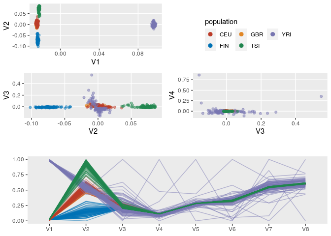
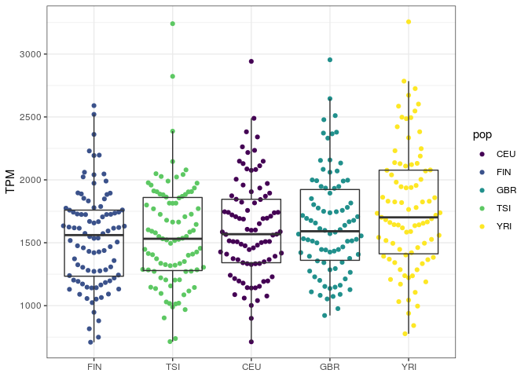
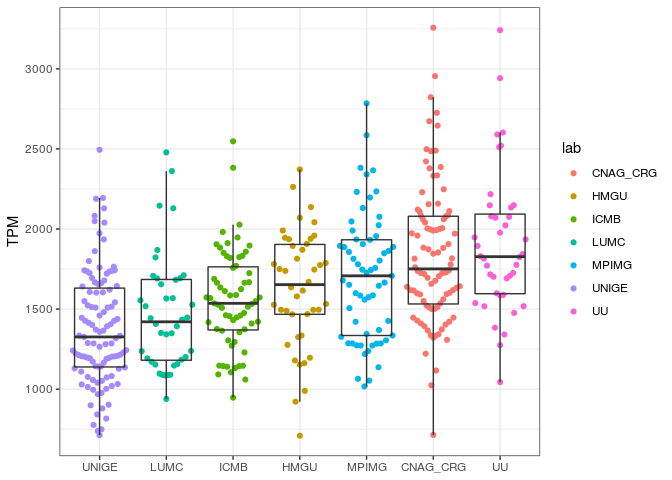
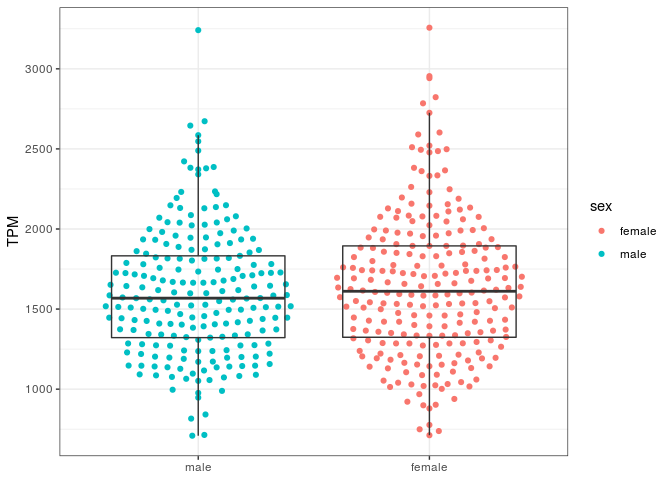
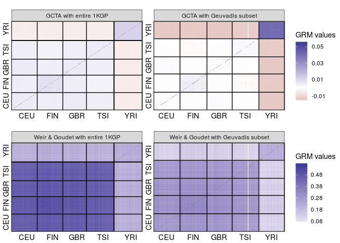
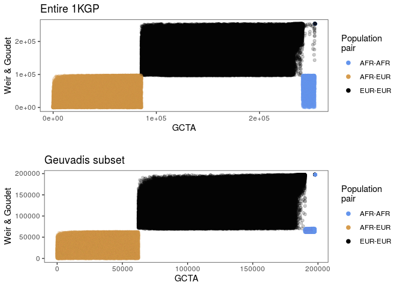
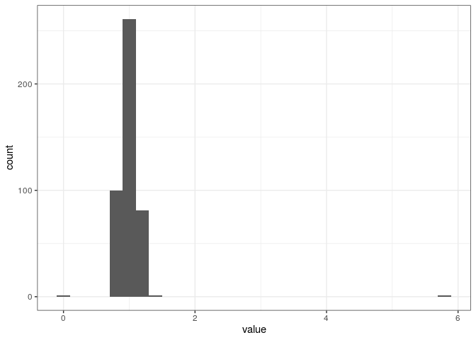

Heritability
================

## Sample:

  - 445 individuals from The 1000 Genomes Project (358 from 4 European
    populations + 87 Yorubans) with RNA-seq available from the Geuvadis
    consortium.

## 1\. VCF processing

### Subset and filtering

Here we select the GEUVADIS individuals, and exclude variants with
missing data or which are monomorphic in this subset of individuals.

Next we call an R script that converts VCF to GDS.

``` bash
#!/bin/bash

#PBS -l nodes=1:ppn=1
#PBS -l mem=8gb
#PBS -l walltime=24:00:00
#PBS -q short
#PBS -t 1-22
#PBS -N processVCF
#PBS -j oe
#PBS -o log/$PBS_JOBNAME

cd $PBS_O_WORKDIR

chr=$PBS_ARRAYID
samples=/raid/genevol/heritability/samples.txt
vcfin=/raid/genevol/heritability/genotypes_1000g/ALL.chr${chr}_GRCh38.genotypes.20170504.vcf.gz
vcfout=./data/kgp/chr${chr}_subset.vcf

bcftools view --samples-file $samples --force-samples $vcfin |\
    bcftools view --genotype ^miss - |\
    bcftools view --min-ac=1:minor -o $vcfout -

Rscript vcf2gds.R $chr

rm $vcfout
```

The content of the vcf2gds.R script is the following:

``` r
library(SeqArray)

chr <- commandArgs(TRUE)[1]

vcf_file <- sprintf("./data/kgp/chr%s_subset.vcf", chr)
gds_file <- sprintf("./data/kgp/chr%s_tmp.gds", chr)

#convert
seqVCF2GDS(vcf_file, gds_file, fmt.import = "GT", verbose = FALSE)
```

## Analyses in R

### Packages:

``` r
library(tidyverse)
library(SeqArray) 
library(SeqVarTools) 
library(SNPRelate)
library(GENESIS)
library(Biobase)
library(cowplot)
library(ggbeeswarm)
library(ggthemes)
```

### Concatenate GDS files for all chromosomes

``` r
gds_file <- "/home/vitor/heritability/data/kgp/allchrs.gds"

gds_list <- sprintf("/home/vitor/heritability/data/kgp/chr%d.gds", 1:22)

seqMerge(gds_list, gds_file)
```

### Pruning

``` r
# this step takes hours
gds <- seqOpen(gds_file)

set.seed(100)
pruned <- snpgdsLDpruning(gds, 
                          method = "corr", 
                          ld.threshold = sqrt(0.1))

prunedsnps <- unlist(pruned, use.names = FALSE)

seqSetFilter(gds, variant.id = prunedsnps)
seqExport(gds, "/home/vitor/heritability/data/kgp/allchrs_pruned.gds")
seqClose(gds)
```

### PCA on genotype data

``` r
# Close GDS and open the pruned one
gdsfmt::showfile.gds(closeall = TRUE)

gds <- seqOpen("/home/vitor/heritability/data/kgp/allchrs_pruned.gds")

pca <- snpgdsPCA(gds, num.thread = 16L)
```

    Principal Component Analysis (PCA) on genotypes:
    Calculating allele counts/frequencies ...
    # of selected variants: 2,195,733
        # of samples: 445
        # of SNVs: 2,195,733
        using 16 threads
        # of principal components: 32
    CPU capabilities: Double-Precision SSE2
    Wed Mar 17 20:53:34 2021    (internal increment: 8752)
    [..................................................]  0%, ETC: ---        [==================================================] 100%, completed, 38s
    Wed Mar 17 20:54:12 2021    Begin (eigenvalues and eigenvectors)
    Wed Mar 17 20:54:12 2021    Done.

``` r
pops <- read_tsv("/raid/genevol/heritability/hla_expression.tsv") %>%
    distinct(subject_id, pop) %>%
    rename(sampleid = subject_id)

pcadf <- as.data.frame(pca$eigenvect) %>%
    as_tibble() %>%
    add_column(sampleid = pca$sample.id, .before = 1) %>%
    inner_join(pops, ., by = "sampleid")
```

``` r
p1 <- ggplot(pcadf, aes(V1, V2, color = pop)) +
    geom_point() +
    scale_color_colorblind() +
    theme(panel.grid.minor = element_blank(),
          panel.background = element_rect(fill = "grey45"),
          legend.key = element_rect(fill = "grey45")) +
    labs(color = "Population")

p2 <- ggplot(pcadf, aes(V2, V3, color = pop)) +
    geom_point() +
    scale_color_colorblind() +
    theme(panel.grid.minor = element_blank(),
          panel.background = element_rect(fill = "grey45"))

p3 <- ggplot(pcadf, aes(V3, V4, color = pop)) +
    geom_point() +
    scale_color_colorblind() +
    theme(panel.grid.minor = element_blank(),
          panel.background = element_rect(fill = "grey45"))

p_legend <- get_legend(p1)

plot_grid(p1 + theme(legend.position = "none"), 
          p_legend,
          p2 + theme(legend.position = "none"), 
          p3 + theme(legend.position = "none"),
          nrow = 2)
```

<!-- -->

### Phenotypes (HLA-A expression in Geuvadis)

``` r
hla_expression <- read_tsv("/raid/genevol/heritability/hla_expression.tsv") %>%
    filter(gene_name == "HLA-A", subject_id %in% seqGetData(gds, "sample.id")) 
```

### Expression across populations

``` r
ggplot(hla_expression, aes(reorder(pop, tpm), tpm)) +
    geom_quasirandom(aes(color = pop), method = "smiley") +
    geom_boxplot(fill = NA, outlier.color = NA) +
    scale_color_colorblind() +
    theme_bw() +
    labs(x = NULL, y = "TPM")
```

<!-- -->

### Expression across laboratories

``` r
ggplot(hla_expression, aes(reorder(lab, tpm), tpm)) +
    geom_quasirandom(aes(color = lab), method = "smiley") +
    geom_boxplot(fill = NA, outlier.color = NA) +
    theme_bw() +
    labs(x = NULL, y = "TPM")
```

<!-- -->

### Expression between males and females

``` r
ggplot(hla_expression, aes(reorder(sex, tpm), tpm)) +
    geom_quasirandom(aes(color = sex), method = "smiley") +
    geom_boxplot(fill = NA, outlier.color = NA) +
    theme_bw() +
    labs(x = NULL, y = "TPM")
```

<!-- -->

Here we got to evaluate whether such differences across groupings are
adequate for an analysis with the combined dataset, or whether they can
be accounted for by using covariates.

Before we continue, we need to transform our phenotype data.frame into
an “Annotated data frame”, which is a data structure provided by
`Biobase`. This means that we have to add metadata to our
`hla_expression` data.frame, and include a `sample.id` column as a
requirement for `GENESIS`. Since we do not have multiple samples for the
same individuals, we will just create the `sample.id` column as a copy
of `subject_id`.

``` r
metadata <- 
    data.frame(labelDescription = c("sample identifier",
                                    "subject identifier",
                                    "laboratory of RNA sequencing",
                                    "subject's sex",
                                    "subject's population",
                                    "PC 1",
                                    "PC 2",
                                    "PC 3",
                                    "expression levels in TPM"))

annotphen <- hla_expression %>%
    mutate(sample.id = subject_id) %>%
    left_join(select(pcadf, sampleid, V1:V3), 
              by = c("subject_id" = "sampleid")) %>%
    select(sample.id, subject_id, lab, sex, pop, V1, V2, V3, tpm) %>%
    as.data.frame() %>%
    AnnotatedDataFrame(metadata)

# access the metadata with the varMetadata() function
varMetadata(annotphen)
```

``` 
                       labelDescription
sample.id             sample identifier
subject_id           subject identifier
lab        laboratory of RNA sequencing
sex                       subject's sex
pop                subject's population
V1                                 PC 1
V2                                 PC 2
V3                                 PC 3
tpm            expression levels in TPM
```

``` r
# access the data with the pData() function
head(pData(annotphen))
```

``` 
  sample.id subject_id      lab    sex pop          V1            V2
1   HG00096    HG00096    UNIGE   male GBR -0.02409590  1.178854e-03
2   HG00097    HG00097     LUMC female GBR -0.02433438 -9.808199e-04
3   HG00099    HG00099     HMGU female GBR -0.02452840 -2.650025e-05
4   HG00100    HG00100 CNAG_CRG female GBR -0.02342908  1.718510e-02
5   HG00101    HG00101    UNIGE   male GBR -0.02409977  1.364934e-03
6   HG00102    HG00102    MPIMG female GBR -0.02474157 -2.891527e-03
            V3     tpm
1 -0.005208341 1604.34
2 -0.007818318 1342.20
3 -0.007551133  921.60
4  0.007413764 1392.66
5 -0.003502374 1082.02
6 -0.006582548 1053.15
```

## GRM

### GCTA

We will use the `SNPRelate` package to compute a GRM. We will begin with
the GCTA method.

``` r
# Close GDS and open the pruned one
gdsfmt::showfile.gds(closeall = TRUE)
```

``` 
                                                            FileName ReadOnly
1 /raid/genevol/users/vitor/heritability/data/kgp/allchrs_pruned.gds     TRUE
   State
1 closed
```

``` r
pruned <- seqOpen("/home/vitor/heritability/data/kgp/allchrs_pruned.gds")

# Computar a GRM
grm_obj <- snpgdsGRM(pruned, method = "GCTA", num.thread = 16L)
```

    Genetic Relationship Matrix (GRM, GCTA):
    Calculating allele counts/frequencies ...
    # of selected variants: 2,195,733
        # of samples: 445
        # of SNVs: 2,195,733
        using 16 threads
    CPU capabilities: Double-Precision SSE2
    Wed Mar 17 20:54:20 2021    (internal increment: 8752)
    [..................................................]  0%, ETC: ---        [==================================================] 100%, completed, 39s
    Wed Mar 17 20:54:59 2021    Done.

We extract and rename the matrix

``` r
sample_ids <- seqGetData(pruned, "sample.id")

grm <- grm_obj$grm
rownames(grm) <- sample_ids
colnames(grm) <- sample_ids

# first 5 individuals:
grm[1:5, 1:5]
```

``` 
            HG00096      HG00097      HG00099     HG00100     HG00101
HG00096 0.956687356 0.0022034937 0.0023660411 0.001431433 0.003642691
HG00097 0.002203494 0.9754513066 0.0007980224 0.003025820 0.003069123
HG00099 0.002366041 0.0007980224 0.9609264716 0.009601814 0.005132164
HG00100 0.001431433 0.0030258202 0.0096018139 0.998632104 0.010114417
HG00101 0.003642691 0.0030691232 0.0051321635 0.010114417 0.938943766
```

### Distribution of the GRM diagonal values

<!-- -->

### GRM off-diagonal values

\* diagonal is set to NA so we can better see the range for off-diagonal
(much smaller) values

<!-- -->

### GRM eigenvalues

``` r
eig <- eigen(grm)

range(eig$values)
```

    [1] -9.687702e-14  5.794577e+00

<!-- -->

## Fitting the Null model

The first step in finding genetic variants which are associated with a
phenotype is preparing null model.

We fit a null model which adjusts gene expression according to
covariates such as population of origin, laboratory of sequencing, and
sex. We also account for the relatedness between individuals (GRM).

``` r
mod_null <- fitNullModel(annotphen, 
                         outcome = "tpm", 
                         covars = c("lab", "sex", "pop", "V1", "V2", "V3"),
                         cov.mat = grm)

#Error in chol.default(Sigma) : the leading minor of order 445 is not positive definite
#12. chol.default(Sigma)
#11. chol(Sigma)
#10. chol(Sigma)
#9. .computeSigmaQuantities(varComp = sigma2.k, covMatList = covMatList, group.idx = group.idx)
#8. .runAIREMLgaussian(y, X, start = start, covMatList = covMatList, group.idx = group.idx, AIREML.tol = AIREML.tol, drop.zeros = drop.zeros, max.iter = max.iter, EM.iter = EM.iter, verbose = verbose)
#7. .fitNullModel(y = desmat$y, X = desmat$X, covMatList = cov.mat, group.idx = desmat$group.idx, family = family, start = start, AIREML.tol = AIREML.tol, max.iter = max.iter, EM.iter = EM.iter, drop.zeros = drop.zeros, return.small = return.small, verbose = verbose)
#6. .local(x, ...)
#5. fitNullModel(x, outcome, covars, cov.mat, group.var, ...)
#4. fitNullModel(x, outcome, covars, cov.mat, group.var, ...)
#3. .local(x, ...)
#2. fitNullModel(annotphen, outcome = "tpm", covars = c("lab", "sex", "pop", "V1", "V2", "V3"), cov.mat = grm)
#1. fitNullModel(annotphen, outcome = "tpm", covars = c("lab", "sex", "pop", "V1", "V2", "V3"), cov.mat = grm)
```

Now that we have a Null model adjusting expression levels for
population, sex, laboratory, population genetic structure, and the
relatedness, we can test for the association of the genetic variants
with expression levels.

The first step is to create a `SeqVarData` object including both the GDS
(genotypes) and the Annotated data.frame (phenotypes).

Then we will use the `assocTestSingle` function to assess the effect of
each variant.

``` r
# order individuals according to GDS
pData(annotphen) <- pData(annotphen) %>%
    mutate(subject_id = factor(subject_id, levels = seqGetData(pruned, "sample.id"))) %>%
    arrange(subject_id)

# create SeqVarData object and iterator
seqData <- SeqVarData(pruned, sampleData = annotphen)
iterator <- SeqVarBlockIterator(seqData, verbose = FALSE)

# test
assoc <- assocTestSingle(iterator, mod_null)

head(assoc)
```

`GENESIS` includes the `varCompCI` to compute the proportion of variance
explained (heritability) by each random effect, with a 95% CI:

``` r
varCompCI(nullmod, prop = TRUE)
```

## Packages version

    Error in get(genname, envir = envir) : object 'testthat_print' not found

    ─ Session info ───────────────────────────────────────────────────────────────
     setting  value                       
     version  R version 4.0.2 (2020-06-22)
     os       Ubuntu 16.04.7 LTS          
     system   x86_64, linux-gnu           
     ui       X11                         
     language (EN)                        
     collate  en_US.UTF-8                 
     ctype    en_US.UTF-8                 
     tz       America/Sao_Paulo           
     date     2021-03-17                  
    
    ─ Packages ───────────────────────────────────────────────────────────────────
     package          * version  date       lib source        
     assertthat         0.2.1    2019-03-21 [2] CRAN (R 4.0.2)
     backports          1.2.1    2020-12-09 [1] CRAN (R 4.0.2)
     beeswarm           0.2.3    2016-04-25 [1] CRAN (R 4.0.2)
     Biobase          * 2.50.0   2020-10-27 [1] Bioconductor  
     BiocGenerics     * 0.36.0   2020-10-27 [1] Bioconductor  
     Biostrings         2.58.0   2020-10-27 [1] Bioconductor  
     bit                4.0.4    2020-08-04 [1] CRAN (R 4.0.2)
     bit64              4.0.2    2020-07-30 [2] CRAN (R 4.0.2)
     bitops             1.0-6    2013-08-17 [2] CRAN (R 4.0.2)
     blob               1.2.1    2020-01-20 [2] CRAN (R 4.0.2)
     broom              0.7.5    2021-02-19 [1] CRAN (R 4.0.2)
     callr              3.5.1    2020-10-13 [1] CRAN (R 4.0.2)
     cellranger         1.1.0    2016-07-27 [2] CRAN (R 4.0.2)
     cli                2.3.0    2021-01-31 [1] CRAN (R 4.0.2)
     codetools          0.2-16   2018-12-24 [4] CRAN (R 4.0.0)
     colorspace         2.0-0    2020-11-11 [1] CRAN (R 4.0.2)
     conquer            1.0.1    2020-05-06 [2] CRAN (R 4.0.2)
     cowplot          * 1.1.1    2020-12-30 [1] CRAN (R 4.0.2)
     crayon             1.4.1    2021-02-08 [1] CRAN (R 4.0.2)
     data.table         1.13.6   2020-12-30 [1] CRAN (R 4.0.2)
     DBI                1.1.0    2019-12-15 [2] CRAN (R 4.0.2)
     dbplyr             1.4.4    2020-05-27 [2] CRAN (R 4.0.2)
     desc               1.2.0    2018-05-01 [2] CRAN (R 4.0.2)
     devtools           2.3.2    2020-09-18 [1] CRAN (R 4.0.2)
     digest             0.6.27   2020-10-24 [1] CRAN (R 4.0.2)
     DNAcopy            1.64.0   2020-10-27 [1] Bioconductor  
     dplyr            * 1.0.4    2021-02-02 [1] CRAN (R 4.0.2)
     ellipsis           0.3.1    2020-05-15 [1] CRAN (R 4.0.2)
     evaluate           0.14     2019-05-28 [2] CRAN (R 4.0.2)
     farver             2.0.3    2020-01-16 [2] CRAN (R 4.0.2)
     forcats          * 0.5.0    2020-03-01 [2] CRAN (R 4.0.2)
     foreach            1.5.0    2020-03-30 [2] CRAN (R 4.0.2)
     formula.tools      1.7.1    2018-03-01 [1] CRAN (R 4.0.2)
     fs                 1.5.0    2020-07-31 [1] CRAN (R 4.0.2)
     gdsfmt           * 1.26.1   2020-12-22 [1] Bioconductor  
     generics           0.1.0    2020-10-31 [1] CRAN (R 4.0.2)
     GENESIS          * 2.20.1   2021-01-28 [1] Bioconductor  
     GenomeInfoDb       1.26.2   2020-12-08 [1] Bioconductor  
     GenomeInfoDbData   1.2.4    2021-02-20 [1] Bioconductor  
     GenomicRanges      1.42.0   2020-10-27 [1] Bioconductor  
     ggbeeswarm       * 0.6.0    2017-08-07 [1] CRAN (R 4.0.2)
     ggplot2          * 3.3.2    2020-06-19 [2] CRAN (R 4.0.2)
     ggthemes         * 4.2.4    2021-01-20 [1] CRAN (R 4.0.2)
     glue               1.4.2    2020-08-27 [1] CRAN (R 4.0.2)
     gtable             0.3.0    2019-03-25 [2] CRAN (R 4.0.2)
     GWASExactHW        1.01     2013-01-05 [1] CRAN (R 4.0.2)
     GWASTools          1.36.0   2020-10-27 [1] Bioconductor  
     haven              2.3.1    2020-06-01 [2] CRAN (R 4.0.2)
     highr              0.8      2019-03-20 [2] CRAN (R 4.0.2)
     hms                0.5.3    2020-01-08 [2] CRAN (R 4.0.2)
     htmltools          0.5.1.1  2021-01-22 [1] CRAN (R 4.0.2)
     httr               1.4.2    2020-07-20 [2] CRAN (R 4.0.2)
     IRanges            2.24.1   2020-12-12 [1] Bioconductor  
     iterators          1.0.12   2019-07-26 [2] CRAN (R 4.0.2)
     jsonlite           1.7.2    2020-12-09 [1] CRAN (R 4.0.2)
     knitr              1.31     2021-01-27 [1] CRAN (R 4.0.2)
     labeling           0.4.2    2020-10-20 [1] CRAN (R 4.0.2)
     lattice            0.20-41  2020-04-02 [4] CRAN (R 4.0.0)
     lifecycle          1.0.0    2021-02-15 [1] CRAN (R 4.0.2)
     lmtest             0.9-38   2020-09-09 [1] CRAN (R 4.0.2)
     logistf            1.24     2020-09-16 [1] CRAN (R 4.0.2)
     lubridate          1.7.9.2  2020-11-13 [1] CRAN (R 4.0.2)
     magrittr           2.0.1    2020-11-17 [1] CRAN (R 4.0.2)
     Matrix             1.2-18   2019-11-27 [2] CRAN (R 4.0.2)
     MatrixModels       0.4-1    2015-08-22 [2] CRAN (R 4.0.2)
     matrixStats        0.58.0   2021-01-29 [1] CRAN (R 4.0.2)
     memoise            1.1.0    2017-04-21 [2] CRAN (R 4.0.2)
     mgcv               1.8-33   2020-08-27 [4] CRAN (R 4.0.2)
     mice               3.13.0   2021-01-27 [1] CRAN (R 4.0.2)
     modelr             0.1.8    2020-05-19 [1] CRAN (R 4.0.2)
     munsell            0.5.0    2018-06-12 [2] CRAN (R 4.0.2)
     nlme               3.1-149  2020-08-23 [4] CRAN (R 4.0.2)
     operator.tools     1.6.3    2017-02-28 [1] CRAN (R 4.0.2)
     pillar             1.4.7    2020-11-20 [1] CRAN (R 4.0.2)
     pkgbuild           1.1.0    2020-07-13 [2] CRAN (R 4.0.2)
     pkgconfig          2.0.3    2019-09-22 [2] CRAN (R 4.0.2)
     pkgload            1.1.0    2020-05-29 [1] CRAN (R 4.0.2)
     prettyunits        1.1.1    2020-01-24 [2] CRAN (R 4.0.2)
     processx           3.4.5    2020-11-30 [1] CRAN (R 4.0.2)
     ps                 1.5.0    2020-12-05 [1] CRAN (R 4.0.2)
     purrr            * 0.3.4    2020-04-17 [2] CRAN (R 4.0.2)
     quantreg           5.61     2020-07-09 [2] CRAN (R 4.0.2)
     quantsmooth        1.56.0   2020-10-27 [1] Bioconductor  
     R6                 2.5.0    2020-10-28 [1] CRAN (R 4.0.2)
     Rcpp               1.0.6    2021-01-15 [1] CRAN (R 4.0.2)
     RCurl              1.98-1.2 2020-04-18 [2] CRAN (R 4.0.2)
     readr            * 1.4.0    2020-10-05 [1] CRAN (R 4.0.2)
     readxl             1.3.1    2019-03-13 [1] CRAN (R 4.0.2)
     remotes            2.2.0    2020-07-21 [2] CRAN (R 4.0.2)
     reprex             1.0.0    2021-01-27 [1] CRAN (R 4.0.2)
     rlang              0.4.10   2020-12-30 [1] CRAN (R 4.0.2)
     rmarkdown          2.7      2021-02-19 [1] CRAN (R 4.0.2)
     rprojroot          1.3-2    2018-01-03 [2] CRAN (R 4.0.2)
     RSQLite            2.2.0    2020-01-07 [2] CRAN (R 4.0.2)
     rstudioapi         0.13     2020-11-12 [1] CRAN (R 4.0.2)
     rvest              0.3.6    2020-07-25 [2] CRAN (R 4.0.2)
     S4Vectors          0.28.1   2020-12-09 [1] Bioconductor  
     sandwich           3.0-0    2020-10-02 [1] CRAN (R 4.0.2)
     scales             1.1.1    2020-05-11 [2] CRAN (R 4.0.2)
     SeqArray         * 1.30.0   2020-10-27 [1] Bioconductor  
     SeqVarTools      * 1.28.1   2020-11-20 [1] Bioconductor  
     sessioninfo        1.1.1    2018-11-05 [2] CRAN (R 4.0.2)
     SNPRelate        * 1.24.0   2020-10-27 [1] Bioconductor  
     SparseM            1.78     2019-12-13 [2] CRAN (R 4.0.2)
     stringi            1.5.3    2020-09-09 [1] CRAN (R 4.0.2)
     stringr          * 1.4.0    2019-02-10 [2] CRAN (R 4.0.2)
     survival           3.2-7    2020-09-28 [4] CRAN (R 4.0.2)
     testthat           2.3.2    2020-03-02 [2] CRAN (R 4.0.2)
     tibble           * 3.0.6    2021-01-29 [1] CRAN (R 4.0.2)
     tidyr            * 1.1.2    2020-08-27 [1] CRAN (R 4.0.2)
     tidyselect         1.1.0    2020-05-11 [2] CRAN (R 4.0.2)
     tidyverse        * 1.3.0    2019-11-21 [1] CRAN (R 4.0.2)
     usethis            2.0.1    2021-02-10 [1] CRAN (R 4.0.2)
     vctrs              0.3.6    2020-12-17 [1] CRAN (R 4.0.2)
     vipor              0.4.5    2017-03-22 [1] CRAN (R 4.0.2)
     withr              2.4.1    2021-01-26 [1] CRAN (R 4.0.2)
     xfun               0.21     2021-02-10 [1] CRAN (R 4.0.2)
     xml2               1.3.2    2020-04-23 [2] CRAN (R 4.0.2)
     XVector            0.30.0   2020-10-27 [1] Bioconductor  
     yaml               2.2.1    2020-02-01 [2] CRAN (R 4.0.2)
     zlibbioc           1.36.0   2020-10-27 [1] Bioconductor  
     zoo                1.8-8    2020-05-02 [2] CRAN (R 4.0.2)
    
    [1] /raid/genevol/users/vitor/R/x86_64-pc-linux-gnu-library/4.0
    [2] /usr/local/lib/R/site-library
    [3] /usr/lib/R/site-library
    [4] /usr/lib/R/library
