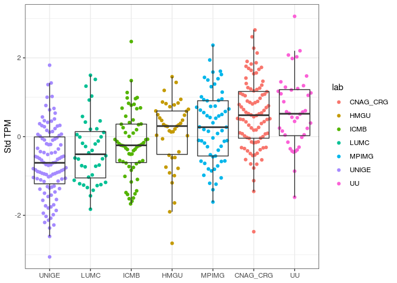
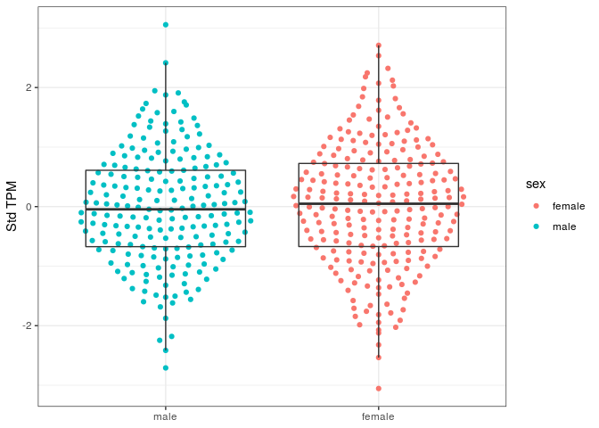
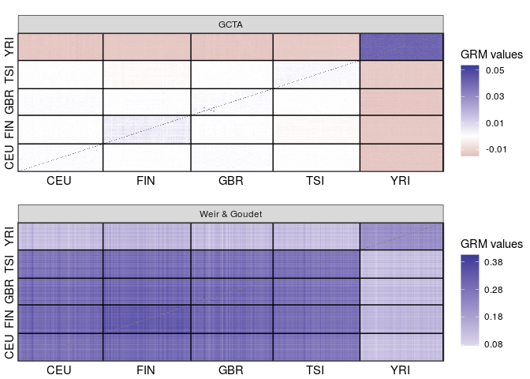

Heritability
================

``` r
library(tidyverse)
library(tidytext)
library(SeqArray) 
library(SeqVarTools) 
library(SNPRelate)
library(GENESIS)
library(Biobase)
library(cowplot)
library(ggbeeswarm)
library(ggthemes)
```

## Sample:

-   445 individuals from The 1000 Genomes Project (358 from 4 European populations + 87 Yorubans) with RNA-seq available from the Geuvadis consortium.

## Data pre-processing

### Genotypes

We use VCF files provided by 1000 Genomes Phase III (low coverage, in GRCh38 coordinates).

We select the GEUVADIS individuals, and exclude variants with missing data or which are monomorphic in this subset of individuals.

Then we convert VCF to GDS, which is a data structure that optimizes working with genotype data in R.

To perform all this processing, we run the script `./launch_processVCF.sh`.

Then we concatenate the GDS files for each chromosome in a single GDS with the code below:

``` r
gds_list <- sprintf("/raid/genevol/heritability/data/kgp/chr%d.gds", 1:22)

gds_file <- "/raid/genevol/heritability/data/kgp/allchrs.gds"

seqMerge(gds_list, gds_file)
```

We reduce the amount of variants by LD pruning:

``` r
# this step takes hours
gds <- seqOpen(gds_file)

set.seed(100)
pruned <- snpgdsLDpruning(gds, 
                          method = "corr", 
                          ld.threshold = sqrt(0.1))

prunedsnps <- unlist(pruned, use.names = FALSE)

seqSetFilter(gds, variant.id = prunedsnps)
seqExport(gds, "/raid/genevol/heritability/data/kgp/allchrs_pruned.gds")
seqClose(gds)
```

### Phenotypes

We use the FASTQ files provided by the Geuvadis Consortium, and estimate expression with Salmon. We begin with the expression of HLA-A.

Transcript Per Million (TPM) values are quantile normal transformed by `QTLtools correct`. Here is a comparison between raw and standardize TPMs:

``` r
# raw
hla_expression <- 
    "/raid/genevol/heritability/data/geuvadis_expression.bed.gz" %>%
    read_tsv() %>%
    filter(id == "HLA-A") %>%
    pivot_longer(-(1:6), names_to = "sampleid") %>%
    select(sampleid, value)

# standardized by QTLtools
hla_expression_std <- 
    "/raid/genevol/heritability/data/geuvadis_expression_std.bed" %>%
    read_tsv() %>%
    filter(id == "HLA-A") %>%
    pivot_longer(-(1:6), names_to = "sampleid") %>%
    select(sampleid, value)
```


## Results

### PCA on genotype data

``` r
# Close GDS and open the pruned one
gdsfmt::showfile.gds(closeall = TRUE)

gds <- seqOpen("/raid/genevol/heritability/data/kgp/allchrs_pruned.gds")

sample_ids <- seqGetData(gds, "sample.id")

pca <- snpgdsPCA(gds, num.thread = 16L)
```

    Principal Component Analysis (PCA) on genotypes:
    Calculating allele counts/frequencies ...
    # of selected variants: 2,195,733
        # of samples: 445
        # of SNVs: 2,195,733
        using 16 threads
        # of principal components: 32
    CPU capabilities: Double-Precision SSE2
    Wed Mar 31 10:28:56 2021    (internal increment: 8752)

    [..................................................]  0%, ETC: ---        
    [==================================================] 100%, completed, 36s
    Wed Mar 31 10:29:32 2021    Begin (eigenvalues and eigenvectors)
    Wed Mar 31 10:29:32 2021    Done.

``` r
pops <- read_tsv("/raid/genevol/heritability/data/geuvadis_metadata.tsv") %>%
    distinct(sampleid, population)

pcadf <- as.data.frame(pca$eigenvect) %>%
    as_tibble() %>%
    add_column(sampleid = pca$sample.id, .before = 1) %>%
    inner_join(pops, ., by = "sampleid")
```


### HLA-A expression across populations

``` r
sample_info <- "/raid/genevol/heritability/data/geuvadis_metadata.tsv" %>%
    read_tsv() %>%
    select(-ena_id)

expression_df <- left_join(hla_expression_std, sample_info, by = "sampleid") %>%
    select(sampleid, population, sex, lab, value)

ggplot(expression_df, aes(reorder(population, value), value)) +
    geom_quasirandom(aes(color = population), method = "smiley") +
    geom_boxplot(fill = NA, outlier.color = NA) +
    scale_color_colorblind() +
    theme_bw() +
    labs(x = NULL, y = "Std TPM")
```


### HLA-A expression across laboratories

``` r
ggplot(expression_df, aes(reorder(lab, value), value)) +
    geom_quasirandom(aes(color = lab), method = "smiley") +
    geom_boxplot(fill = NA, outlier.color = NA) +
    theme_bw() +
    labs(x = NULL, y = "Std TPM")
```



### HLA-A expression between males and females

``` r
ggplot(expression_df, aes(reorder(sex, value), value)) +
    geom_quasirandom(aes(color = sex), method = "smiley") +
    geom_boxplot(fill = NA, outlier.color = NA) +
    theme_bw() +
    labs(x = NULL, y = "Std TPM")
```



Here we got to evaluate whether such differences across groupings are adequate for an analysis with the combined dataset, or whether they can be accounted for by using covariates.

Before we continue, we need to transform our phenotype data.frame into an "Annotated data frame", which is a data structure provided by `Biobase`. This means that we have to add metadata to our `expression_df` data.frame, and include a `sample.id` column as a requirement for `GENESIS`. Since we do not have multiple samples for the same individuals, we will just create the `sample.id` column as a copy of `sampleid`.

``` r
metadata <- 
    c("sample identifier",
      "subject identifier",
      "laboratory of RNA sequencing",
      "subject's sex",
      "subject's population",
      "PC 1",
      "PC 2",
      "PC 3",
      "expression levels in TPM") %>%
    data.frame(labelDescription = .) 

annotphen <- expression_df %>%
    mutate(sample.id = sampleid) %>%
    left_join(select(pcadf, sampleid, V1:V3), by = "sampleid") %>%
    select(sample.id, sampleid, lab, sex, population, V1, V2, V3, value) %>%
    as.data.frame() %>%
    AnnotatedDataFrame(metadata)

# access the metadata with the varMetadata() function
varMetadata(annotphen)
```

                           labelDescription
    sample.id             sample identifier
    sampleid             subject identifier
    lab        laboratory of RNA sequencing
    sex                       subject's sex
    population         subject's population
    V1                                 PC 1
    V2                                 PC 2
    V3                                 PC 3
    value          expression levels in TPM

``` r
# access the data with the pData() function
head(pData(annotphen))
```

      sample.id sampleid      lab    sex population          V1            V2           V3      value
    1   HG00096  HG00096    UNIGE   male        GBR -0.02409590  1.178854e-03 -0.005208341  0.0620013
    2   HG00097  HG00097     LUMC female        GBR -0.02433438 -9.808199e-04 -0.007818318 -0.4860010
    3   HG00099  HG00099     HMGU female        GBR -0.02452840 -2.650025e-05 -0.007551133 -1.9096400
    4   HG00100  HG00100 CNAG_CRG female        GBR -0.02342908  1.718510e-02  0.007413764 -0.4235280
    5   HG00101  HG00101    UNIGE   male        GBR -0.02409977  1.364934e-03 -0.003502374 -1.4375500
    6   HG00102  HG00102    MPIMG female        GBR -0.02474157 -2.891527e-03 -0.006582548 -1.3484100

## GRM

### GCTA vs Weir&Gouget

We will use the `SNPRelate` package to compute a GRM. We will begin with the GCTA method.

``` r
# Close GDS and open the pruned one
gdsfmt::showfile.gds(closeall = TRUE)
```

                                                    FileName ReadOnly  State
    1 /raid/genevol/heritability/data/kgp/allchrs_pruned.gds     TRUE closed

``` r
pruned <- seqOpen("/raid/genevol/heritability/data/kgp/allchrs_pruned.gds")

# Computar a GRM
grm_gcta_obj <- snpgdsGRM(pruned, method = "GCTA", num.thread = 16L)
```

    Genetic Relationship Matrix (GRM, GCTA):
    Calculating allele counts/frequencies ...
    # of selected variants: 2,195,733
        # of samples: 445
        # of SNVs: 2,195,733
        using 16 threads
    CPU capabilities: Double-Precision SSE2
    Wed Mar 31 10:29:38 2021    (internal increment: 8752)

    [..................................................]  0%, ETC: ---        
    [==================================================] 100%, completed, 39s
    Wed Mar 31 10:30:17 2021    Done.

``` r
grm_wg_obj <- snpgdsGRM(pruned, method = "IndivBeta", num.thread = 16L)
```

    Genetic Relationship Matrix (GRM, IndivBeta):
    Calculating allele counts/frequencies ...
    # of selected variants: 2,195,733
        # of samples: 445
        # of SNVs: 2,195,733
        using 16 threads
    CPU capabilities: Double-Precision SSE2
    Wed Mar 31 10:30:20 2021    (internal increment: 65536)

    [..................................................]  0%, ETC: ---        
    [==================================================] 100%, completed, 9s
    Wed Mar 31 10:30:29 2021    Done.

We extract and rename the matrix

``` r
grm_gcta <- grm_gcta_obj$grm
rownames(grm_gcta) <- sample_ids
colnames(grm_gcta) <- sample_ids

grm_wg <- grm_wg_obj$grm
rownames(grm_wg) <- sample_ids
colnames(grm_wg) <- sample_ids
```

### Distribution of the GRM diagonal values


### GRM off-diagonal values

\* diagonal is set to NA so we can better see the range for off-diagonal (much smaller) values



### Rankings of pairs of individuals

``` r
pair_ranks <- grm_df %>%
  group_by(method) %>%
  mutate(r = rank(value, ties.method = "first")) %>%
  select(-value) %>%
  pivot_wider(names_from = method, values_from = r) %>%
  arrange(GCTA) %>%
  mutate(col = case_when(xor(pop1 == "YRI", pop2 == "YRI") ~ "AFR-EUR",
                         pop1 == "YRI" & pop2 == "YRI" ~ "AFR-AFR",
                         pop1 != "YRI" & pop2 != "YRI" ~ "EUR-EUR"))

ggplot(pair_ranks, aes(GCTA, `Weir & Goudet`)) +
  geom_point(aes(color = col), alpha = .1) +
  scale_color_manual(values = c("#046C9A", "#D69C4E", "#000000")) +
  theme_bw() +
  theme(panel.grid = element_blank()) +
  guides(color = guide_legend(override.aes = list(alpha = 1, size = 2))) +
  labs(color = "Population\npair")
```


### Fitting the Null model

The first step in finding genetic variants which are associated with a phenotype is preparing null model.

We fit a null model which adjusts gene expression according to covariates such as population of origin, laboratory of sequencing, and sex. We also account for the relatedness between individuals (GRM).

``` r
#mod_null_gcta <- fitNullModel(annotphen, 
#                         outcome = "value", 
#                         covars = c("lab", "sex"),
#                         cov.mat = grm_gcta)

mod_null_wg <- fitNullModel(annotphen, 
                         outcome = "value", 
                         covars = c("lab", "sex"),
                         cov.mat = grm_wg)
```

    [1]    0.4996713    0.4996713 -576.9746568    0.8415602
    [1]    0.7804955    0.1868632 -576.4135856    0.9305427
    [1]    0.94033611    0.04324574 -576.21739846    0.94848268
    [1]    0.97725015    0.01096589 -576.17938167    0.95172463
    [1]    0.9861944    0.0031750 -576.1705318    0.9524802
    [1]    0.98841194    0.00124507 -576.16835898    0.95266587
    [1]  9.895184e-01  2.823370e-04 -5.761673e+02  9.527583e-01
    [1]    0.9897947    0.0000000 -576.1669613    0.9528318
    [1]    0.9407967    0.0000000 -576.1669613    1.0024566
    [1]    0.9431022    0.0000000 -576.1669613    1.0000060

### Association testing

Now that we have a Null model adjusting expression levels for sex, laboratory, population genetic structure, and relatedness, we can test for the association of the genetic variants with expression levels.

The first step is to create a `SeqVarData` object including both the GDS (genotypes) and the Annotated data.frame (phenotypes).

Then we will use the `assocTestSingle` function to assess the effect of each variant.

``` r
# order individuals according to GDS
pData(annotphen) <- pData(annotphen) %>%
    mutate(sampleid = factor(sampleid, levels = seqGetData(pruned, "sample.id"))) %>%
    arrange(sampleid)

# create SeqVarData object and iterator
seqData <- SeqVarData(pruned, sampleData = annotphen)
iterator <- SeqVarBlockIterator(seqData, variantBlock = 20000, verbose = FALSE)

# test
assoc <- assocTestSingle(iterator, mod_null_wg)
```

    # of selected samples: 445

``` r
head(assoc, 10)
```

       variant.id chr   pos allele.index n.obs        freq MAC         Score  Score.SE   Score.Stat Score.pval          Est     Est.SE          PVE
    1           1   1 10177            1   445 0.428089888 381 -17.096720209 12.018944 -1.422481061 0.15488665 -0.118353248 0.08320199 4.630298e-03
    2           2   1 10352            1   445 0.439325843 391   4.638098246  9.651787  0.480542968 0.63084136  0.049787980 0.10360776 5.284214e-04
    3           6   1 11012            1   445 0.092134831  82 -10.667433273  9.894223 -1.078147607 0.28096789 -0.108967381 0.10106907 2.659943e-03
    4           8   1 13110            1   445 0.043820225  39 -11.421733009  6.789110 -1.682360748 0.09249891 -0.247802823 0.14729470 6.476706e-03
    5          10   1 13118            1   445 0.143820225 128  -7.468549658 11.534883 -0.647475128 0.51732449 -0.056131921 0.08669356 9.593170e-04
    6          11   1 13273            1   445 0.128089888 114  10.587377639 10.898274  0.971472838 0.33131287  0.089140060 0.09175764 2.159620e-03
    7          14   1 13445            1   445 0.001123596   1   0.008046673  1.147702  0.007011115 0.99440599  0.006108827 0.87130609 1.124838e-07
    8          16   1 13494            1   445 0.001123596   1   0.531436751  1.155193  0.460041612 0.64548635  0.398237954 0.86565638 4.842952e-04
    9          20   1 14604            1   445 0.150561798 134  -9.005681631 11.025875 -0.816777082 0.41405583 -0.074078213 0.09069575 1.526592e-03
    10         24   1 14933            1   445 0.041573034  37   4.511022584  6.639190  0.679453753 0.49685040  0.102339856 0.15062078 1.056418e-03

### Heritability

`GENESIS` includes the `varCompCI` to compute the proportion of variance explained (heritability) by each random effect, with a 95% CI:

``` r
varCompCI(mod_null_wg, prop = TRUE)
```

                Proportion Lower 95 Upper 95
    V_A                  1        1        1
    V_resid.var          0       NA       NA

## Package versions

    Error in get(genname, envir = envir) : object 'testthat_print' not found

    ─ Session info ──────────────────────────────────────────────────────────────────────────────────────────────────────────────────────────────────────────────────────────────────────────────────────────────────────────────────────────────────────────────────────────────────────────────────────────────────────────────────────────────────────────────────────────────────────────────────────────────────────────────────────────────────────────────────────────────────────────────────────────────────────────────────────────────────────────────────────────────────────────────────────────────────────────────────────────────────────────────────────────────────────────────────────────────────────────────────────────────────────────────────────────────────────────────────────────────────────────────────────────────────────────────────────────────────────────────────────────────────────────────────────────────────────────────────────────────────────────────────────────────────────────────────────
     setting  value                       
     version  R version 4.0.2 (2020-06-22)
     os       Ubuntu 16.04.7 LTS          
     system   x86_64, linux-gnu           
     ui       X11                         
     language en_US:en                    
     collate  en_US.UTF-8                 
     ctype    en_US.UTF-8                 
     tz       America/Sao_Paulo           
     date     2021-03-31                  

    ─ Packages ──────────────────────────────────────────────────────────────────────────────────────────────────────────────────────────────────────────────────────────────────────────────────────────────────────────────────────────────────────────────────────────────────────────────────────────────────────────────────────────────────────────────────────────────────────────────────────────────────────────────────────────────────────────────────────────────────────────────────────────────────────────────────────────────────────────────────────────────────────────────────────────────────────────────────────────────────────────────────────────────────────────────────────────────────────────────────────────────────────────────────────────────────────────────────────────────────────────────────────────────────────────────────────────────────────────────────────────────────────────────────────────────────────────────────────────────────────────────────────────────────────────────────────────
     package          * version  date       lib source        
     assertthat         0.2.1    2019-03-21 [2] CRAN (R 4.0.2)
     backports          1.2.1    2020-12-09 [1] CRAN (R 4.0.2)
     beeswarm           0.2.3    2016-04-25 [1] CRAN (R 4.0.2)
     Biobase          * 2.50.0   2020-10-27 [1] Bioconductor  
     BiocGenerics     * 0.36.0   2020-10-27 [1] Bioconductor  
     Biostrings         2.58.0   2020-10-27 [1] Bioconductor  
     bit                4.0.4    2020-08-04 [1] CRAN (R 4.0.2)
     bit64              4.0.2    2020-07-30 [2] CRAN (R 4.0.2)
     bitops             1.0-6    2013-08-17 [2] CRAN (R 4.0.2)
     blob               1.2.1    2020-01-20 [2] CRAN (R 4.0.2)
     broom              0.7.5    2021-02-19 [1] CRAN (R 4.0.2)
     callr              3.5.1    2020-10-13 [1] CRAN (R 4.0.2)
     cellranger         1.1.0    2016-07-27 [2] CRAN (R 4.0.2)
     cli                2.3.0    2021-01-31 [1] CRAN (R 4.0.2)
     codetools          0.2-16   2018-12-24 [4] CRAN (R 4.0.0)
     colorspace         2.0-0    2020-11-11 [1] CRAN (R 4.0.2)
     conquer            1.0.1    2020-05-06 [2] CRAN (R 4.0.2)
     cowplot          * 1.1.1    2020-12-30 [1] CRAN (R 4.0.2)
     crayon             1.4.1    2021-02-08 [1] CRAN (R 4.0.2)
     data.table         1.13.6   2020-12-30 [1] CRAN (R 4.0.2)
     DBI                1.1.0    2019-12-15 [2] CRAN (R 4.0.2)
     dbplyr             1.4.4    2020-05-27 [2] CRAN (R 4.0.2)
     desc               1.2.0    2018-05-01 [2] CRAN (R 4.0.2)
     devtools           2.3.2    2020-09-18 [1] CRAN (R 4.0.2)
     digest             0.6.27   2020-10-24 [1] CRAN (R 4.0.2)
     DNAcopy            1.64.0   2020-10-27 [1] Bioconductor  
     dplyr            * 1.0.4    2021-02-02 [1] CRAN (R 4.0.2)
     ellipsis           0.3.1    2020-05-15 [1] CRAN (R 4.0.2)
     evaluate           0.14     2019-05-28 [2] CRAN (R 4.0.2)
     farver             2.0.3    2020-01-16 [2] CRAN (R 4.0.2)
     forcats          * 0.5.0    2020-03-01 [2] CRAN (R 4.0.2)
     foreach            1.5.0    2020-03-30 [2] CRAN (R 4.0.2)
     formula.tools      1.7.1    2018-03-01 [1] CRAN (R 4.0.2)
     fs                 1.5.0    2020-07-31 [1] CRAN (R 4.0.2)
     gdsfmt           * 1.26.1   2020-12-22 [1] Bioconductor  
     generics           0.1.0    2020-10-31 [1] CRAN (R 4.0.2)
     GENESIS          * 2.20.1   2021-01-28 [1] Bioconductor  
     GenomeInfoDb       1.26.2   2020-12-08 [1] Bioconductor  
     GenomeInfoDbData   1.2.4    2021-02-20 [1] Bioconductor  
     GenomicRanges      1.42.0   2020-10-27 [1] Bioconductor  
     ggbeeswarm       * 0.6.0    2017-08-07 [1] CRAN (R 4.0.2)
     ggplot2          * 3.3.2    2020-06-19 [2] CRAN (R 4.0.2)
     ggthemes         * 4.2.4    2021-01-20 [1] CRAN (R 4.0.2)
     glue               1.4.2    2020-08-27 [1] CRAN (R 4.0.2)
     gtable             0.3.0    2019-03-25 [2] CRAN (R 4.0.2)
     GWASExactHW        1.01     2013-01-05 [1] CRAN (R 4.0.2)
     GWASTools          1.36.0   2020-10-27 [1] Bioconductor  
     haven              2.3.1    2020-06-01 [2] CRAN (R 4.0.2)
     highr              0.8      2019-03-20 [2] CRAN (R 4.0.2)
     hms                0.5.3    2020-01-08 [2] CRAN (R 4.0.2)
     htmltools          0.5.1.1  2021-01-22 [1] CRAN (R 4.0.2)
     httr               1.4.2    2020-07-20 [2] CRAN (R 4.0.2)
     IRanges            2.24.1   2020-12-12 [1] Bioconductor  
     iterators          1.0.12   2019-07-26 [2] CRAN (R 4.0.2)
     janeaustenr        0.1.5    2017-06-10 [1] CRAN (R 4.0.2)
     jsonlite           1.7.2    2020-12-09 [1] CRAN (R 4.0.2)
     knitr              1.31     2021-01-27 [1] CRAN (R 4.0.2)
     labeling           0.4.2    2020-10-20 [1] CRAN (R 4.0.2)
     lattice            0.20-41  2020-04-02 [4] CRAN (R 4.0.0)
     lifecycle          1.0.0    2021-02-15 [1] CRAN (R 4.0.2)
     lmtest             0.9-38   2020-09-09 [1] CRAN (R 4.0.2)
     logistf            1.24     2020-09-16 [1] CRAN (R 4.0.2)
     lubridate          1.7.9.2  2020-11-13 [1] CRAN (R 4.0.2)
     magrittr           2.0.1    2020-11-17 [1] CRAN (R 4.0.2)
     Matrix             1.2-18   2019-11-27 [2] CRAN (R 4.0.2)
     MatrixModels       0.4-1    2015-08-22 [2] CRAN (R 4.0.2)
     matrixStats        0.58.0   2021-01-29 [1] CRAN (R 4.0.2)
     memoise            1.1.0    2017-04-21 [2] CRAN (R 4.0.2)
     mgcv               1.8-33   2020-08-27 [4] CRAN (R 4.0.2)
     mice               3.13.0   2021-01-27 [1] CRAN (R 4.0.2)
     modelr             0.1.8    2020-05-19 [1] CRAN (R 4.0.2)
     munsell            0.5.0    2018-06-12 [2] CRAN (R 4.0.2)
     nlme               3.1-149  2020-08-23 [4] CRAN (R 4.0.2)
     operator.tools     1.6.3    2017-02-28 [1] CRAN (R 4.0.2)
     pillar             1.4.7    2020-11-20 [1] CRAN (R 4.0.2)
     pkgbuild           1.1.0    2020-07-13 [2] CRAN (R 4.0.2)
     pkgconfig          2.0.3    2019-09-22 [2] CRAN (R 4.0.2)
     pkgload            1.1.0    2020-05-29 [1] CRAN (R 4.0.2)
     prettyunits        1.1.1    2020-01-24 [2] CRAN (R 4.0.2)
     processx           3.4.5    2020-11-30 [1] CRAN (R 4.0.2)
     ps                 1.5.0    2020-12-05 [1] CRAN (R 4.0.2)
     purrr            * 0.3.4    2020-04-17 [2] CRAN (R 4.0.2)
     quantreg           5.61     2020-07-09 [2] CRAN (R 4.0.2)
     quantsmooth        1.56.0   2020-10-27 [1] Bioconductor  
     R6                 2.5.0    2020-10-28 [1] CRAN (R 4.0.2)
     Rcpp               1.0.6    2021-01-15 [1] CRAN (R 4.0.2)
     RCurl              1.98-1.2 2020-04-18 [2] CRAN (R 4.0.2)
     readr            * 1.4.0    2020-10-05 [1] CRAN (R 4.0.2)
     readxl             1.3.1    2019-03-13 [1] CRAN (R 4.0.2)
     remotes            2.2.0    2020-07-21 [2] CRAN (R 4.0.2)
     reprex             1.0.0    2021-01-27 [1] CRAN (R 4.0.2)
     rlang              0.4.10   2020-12-30 [1] CRAN (R 4.0.2)
     rmarkdown          2.7      2021-02-19 [1] CRAN (R 4.0.2)
     rprojroot          1.3-2    2018-01-03 [2] CRAN (R 4.0.2)
     RSQLite            2.2.0    2020-01-07 [2] CRAN (R 4.0.2)
     rstudioapi         0.13     2020-11-12 [1] CRAN (R 4.0.2)
     rvest              0.3.6    2020-07-25 [2] CRAN (R 4.0.2)
     S4Vectors          0.28.1   2020-12-09 [1] Bioconductor  
     sandwich           3.0-0    2020-10-02 [1] CRAN (R 4.0.2)
     scales             1.1.1    2020-05-11 [2] CRAN (R 4.0.2)
     SeqArray         * 1.30.0   2020-10-27 [1] Bioconductor  
     SeqVarTools      * 1.28.1   2020-11-20 [1] Bioconductor  
     sessioninfo        1.1.1    2018-11-05 [2] CRAN (R 4.0.2)
     SnowballC          0.7.0    2020-04-01 [1] CRAN (R 4.0.2)
     SNPRelate        * 1.24.0   2020-10-27 [1] Bioconductor  
     SparseM            1.78     2019-12-13 [2] CRAN (R 4.0.2)
     stringi            1.5.3    2020-09-09 [1] CRAN (R 4.0.2)
     stringr          * 1.4.0    2019-02-10 [2] CRAN (R 4.0.2)
     survival           3.2-7    2020-09-28 [4] CRAN (R 4.0.2)
     testthat           2.3.2    2020-03-02 [2] CRAN (R 4.0.2)
     tibble           * 3.0.6    2021-01-29 [1] CRAN (R 4.0.2)
     tidyr            * 1.1.2    2020-08-27 [1] CRAN (R 4.0.2)
     tidyselect         1.1.0    2020-05-11 [2] CRAN (R 4.0.2)
     tidytext         * 0.3.0    2021-01-06 [1] CRAN (R 4.0.2)
     tidyverse        * 1.3.0    2019-11-21 [1] CRAN (R 4.0.2)
     tokenizers         0.2.1    2018-03-29 [1] CRAN (R 4.0.2)
     usethis            2.0.1    2021-02-10 [1] CRAN (R 4.0.2)
     vctrs              0.3.6    2020-12-17 [1] CRAN (R 4.0.2)
     vipor              0.4.5    2017-03-22 [1] CRAN (R 4.0.2)
     withr              2.4.1    2021-01-26 [1] CRAN (R 4.0.2)
     xfun               0.21     2021-02-10 [1] CRAN (R 4.0.2)
     xml2               1.3.2    2020-04-23 [2] CRAN (R 4.0.2)
     XVector            0.30.0   2020-10-27 [1] Bioconductor  
     yaml               2.2.1    2020-02-01 [2] CRAN (R 4.0.2)
     zlibbioc           1.36.0   2020-10-27 [1] Bioconductor  
     zoo                1.8-8    2020-05-02 [2] CRAN (R 4.0.2)

    [1] /raid/genevol/users/vitor/R/x86_64-pc-linux-gnu-library/4.0
    [2] /usr/local/lib/R/site-library
    [3] /usr/lib/R/site-library
    [4] /usr/lib/R/library
