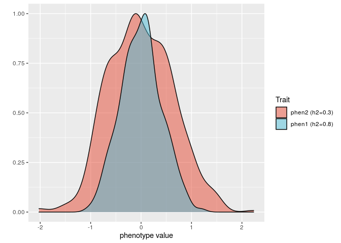
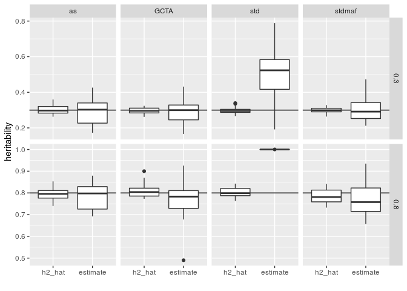

Prática Herdabilidade
================

O material abaixo se refere à aula de Jerome Goudet e Bruce Weir no
Summer Institutes in Statistical Genetics 2020.

**Obs: O código usado se baseia em pacotes que o Prof Jerome Goudet usa
ou desenvolve. Mas podemos explorar outras alternativas mais amplamente
usadas na literatura para nossas análises futuras.**

``` r
library(tidyverse)
library(gaston)
library(hierfstat)
library(JGTeach)
```

# Herdabilidade em dados simulados: fenótipos para uma população panmítica

Previamente, foram gerados dados genotípicos para 500 indivíduos com 20
cromossomos de 1Mb, com o seguinte comando do programa `ms`:

    [1] "ms 1000 20 -t 200 -r 200 1000000 -p 8"

Esses dados foram salvos no arquivo `./data/pan.txt`, e podem ser lidos
no R com a função `ms2bed` do pacote `hierfstat`.

``` r
pan <- ms2bed("./data/pan.txt")
```

Em seguida, com a função `make.traits` do pacote `JGTeach` de Jerome
Goudet, simula-se um fenótipo com herdabilidade de 0.8 e outro com
herdabilidade 0.3, com 100 loci causais.

``` r
phen1 <- make.traits(pan, h2 = 0.8, n.causal = 100, minp = 0)
phen2 <- make.traits(pan, h2 = 0.3, n.causal = 100, minp = 0)
```

Um histograma dos fenótipos simulados:

<!-- -->

Em seguida, vamos usar modelos lineares mistos para estimar
herdabilidade. Isto requer uma GRM.

Nas aulas de herdabilidade do SISG, foram discutidas 3 GRMs:

  - Allele-sharing GRM (as);
  - GCTA (Kc0);
  - “Standard” GRM (GG’/N, onde G é a matriz de genótipos e N é o total
    de SNPs)

Além disso, uma recomendação para a GRM standard é filtrar variantes com
MAF \> 5%, então também testaremos a GRM:

  - “Standard” com MAF\>5%

Primeiro, vamos computar essas GRMs, usando funções dos pacotes que
carregamos no início desse script.

``` r
GRM_as <- kinship2grm(beta.dosage(pan, inb = TRUE))
GRM_c0 <- 2 * Kc0(pan)
GRM_std <- GRM(pan)
GRM_std_maf05 <- GRM(pan[, pan@snps$maf >= 0.05])
```

Agora vamos estimar a herdabilidade com a função `lmm.aireml` do pacote
`gaston`. E então vamos extrair a estimativa de herdabilidade do objeto
`lmm.aireml` com a função `herit` definida abaixo:

``` r
herit <- function(x) x$tau / (x$tau + x$sigma2)

# fenótipo 1
h_phen1_as <- 
    herit(lmm.aireml(phen1$trait$pheno, K = GRM_as, verbose = FALSE))

h_phen1_c0 <- 
    herit(lmm.aireml(phen1$trait$pheno, K = GRM_c0, verbose = FALSE))

h_phen1_std <- 
    herit(lmm.aireml(phen1$trait$pheno, K = GRM_std, verbose = FALSE))

h_phen1_stdmaf <-
    herit(lmm.aireml(phen1$trait$pheno, K = GRM_std_maf05, verbose = FALSE))

# fenótipo 2
h_phen2_as <- 
    herit(lmm.aireml(phen2$trait$pheno, K = GRM_as, verbose = FALSE))

h_phen2_c0 <- 
    herit(lmm.aireml(phen2$trait$pheno, K = GRM_c0, verbose = FALSE))

h_phen2_std <- 
    herit(lmm.aireml(phen2$trait$pheno, K = GRM_std, verbose = FALSE))

h_phen2_stdmaf <-
    herit(lmm.aireml(phen2$trait$pheno, K = GRM_std_maf05, verbose = FALSE))
```

Agora vamos comparar as estimativas com os valores de \(\hat{h^2}\):

| fenotipo | GRM                | h2\_hat | h2\_estimate |
| -------: | :----------------- | ------: | -----------: |
|        1 | Allele sharing     |    0.80 |         0.75 |
|        1 | GCTA               |    0.80 |         0.74 |
|        1 | Standard           |    0.80 |         1.00 |
|        1 | Standard (MAF\>5%) |    0.80 |         0.71 |
|        2 | Allele sharing     |    0.31 |         0.25 |
|        2 | GCTA               |    0.31 |         0.25 |
|        2 | Standard           |    0.31 |         0.49 |
|        2 | Standard (MAF\>5%) |    0.31 |         0.24 |

Para uma melhor avaliação do padrão, vamos analisar 20 réplicas. Ou
seja, 20 simulações de cada fenótipo: herdabilidade 0.8 e 0.3.

Para isso criamos a função `get.herit` que automatiza o processo acima
para simular fenótipos e estimar a herdabilidade com diferentes
GRMs.

``` r
get.herit <- function(bed, h2 = 0.8, n.causal = 100, minp = 0, GRM = GRM, ...) { 
    tx <- make.traits(bed = bed, h2 = h2, n.causal = n.causal, minp = minp, ...) 
    est <- herit(lmm.aireml(Y = tx$trait$pheno, K = GRM, verbose = FALSE, ...)) 
    tibble(h2_hat = tx$h2hat, estimate = est)
}

# h2 = 0.8
h_phen1_as_20rep <- 
    replicate(20, get.herit(pan, GRM = GRM_as), simplify = FALSE) %>% 
    bind_rows()

h_phen1_c0_20rep <- 
    replicate(20, get.herit(pan, GRM = GRM_c0), simplify = FALSE) %>% 
    bind_rows()

h_phen1_std_20rep <- 
    replicate(20, get.herit(pan, GRM = GRM_std), simplify = FALSE) %>% 
    bind_rows()

h_phen1_stdmaf_20rep <- 
    replicate(20, get.herit(pan, GRM = GRM_std_maf05), simplify = FALSE) %>% 
    bind_rows()


# h2 = 0.3
h_phen2_as_20rep <- 
    replicate(20, get.herit(pan, GRM = GRM_as, h2 = 0.3), simplify = FALSE) %>% 
    bind_rows()

h_phen2_c0_20rep <- 
    replicate(20, get.herit(pan, GRM = GRM_c0, h2 = 0.3), simplify = FALSE) %>% 
    bind_rows()

h_phen2_std_20rep <- 
    replicate(20, get.herit(pan, GRM = GRM_std, h2 = 0.3), simplify = FALSE) %>% 
    bind_rows()

h_phen2_stdmaf_20rep <- 
    replicate(20, get.herit(pan, GRM = GRM_std_maf05, h2 = 0.3), simplify = FALSE) %>%
    bind_rows()
```

Vamos avaliar essas medidas num gráfico:

<!-- -->

# Herdabilidade usando genótipos do 1000 Genomas

Podemos repetir o exercício acima, mas ao invés de usar genótipos
simulados para uma população panmítica com o `ms`, agora podemos usar
dados de populações reais do Projeto 1000 Genomas.

A diferença entre o dado simulado e o real é que no real temos estrutura
de população, miscigenação, etc. Como será que esses fatores influenciam
as estimativas de herdabilidade?

``` r
#genótipos e matching
ch22 <- read.VCF("./data/chr22_Mb0_20.recode.vcf.gz")
```

    ped stats and snps stats have been set. 
    'p' has been set. 
    'mu' and 'sigma' have been set.

``` r
ch22_M <- readRDS("./data/matching.ch22.RDS")

Mb <- mean(mat2vec(ch22_M))

# GRMs
GRM_ch22_as <- 2 * ((ch22_M - Mb) / (1 - Mb))
GRM_ch22_c0 <- 2 * Kc0(ch22_M, matching = TRUE)
GRM_ch22_std <- GRM(ch22)
GRM_ch22_stdmaf <- GRM(ch22[, ch22@snps$maf >= 0.05])
```

A seguir, vamos fazer a mesma estimativa de herdabilidade em 20 réplicas
feita acima, porém como o dado é maior e demora muito mais, criei uma
estratégia para executar paralelamente em 32 CPUs:

``` r
# Contruir a lista de GRMs e valores de h2 para a análise em paralelo
grm_list <- list(as = GRM_ch22_as, c0 = GRM_ch22_c0, std = GRM_ch22_std, stdmaf = GRM_ch22_stdmaf)
h2_list <- rep(c(0.8, 0.3), each = 4)

reps_df <- tibble(i = rep(1:8, each = 20))
input_df <- tibble(i = 1:8, grm = c(grm_list, grm_list), grm_name = names(grm), h2 = h2_list) %>%
    left_join(reps_df, ., by = "i")

# aplicar a função get.herit a 20 réplicas de cada combinação [GRM x valor de h2]
res <- 
    parallel::mcMap(function(grm, h) get.herit(ch22, GRM = grm, h2 = h), 
                    input_df$grm, input_df$h2, mc.cores = 32)
```

Vamos visualizar num
gráfico:

<!-- -->

## As estimativas de herdabilidade são afetadas por estrutura de população?

Comentário de Vitor: parece haver uma subestimativa.
